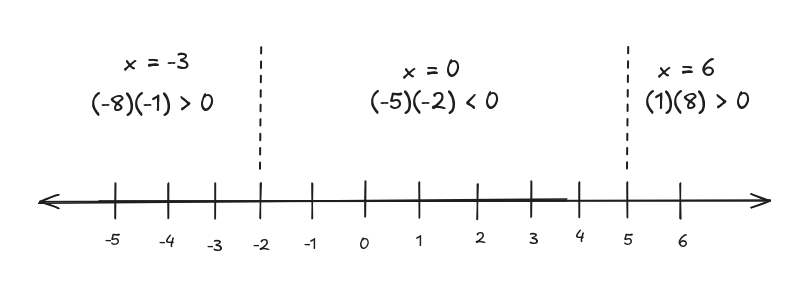
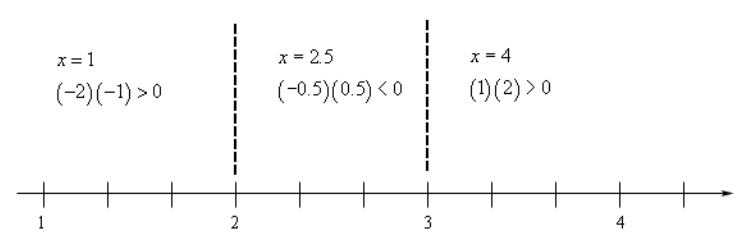
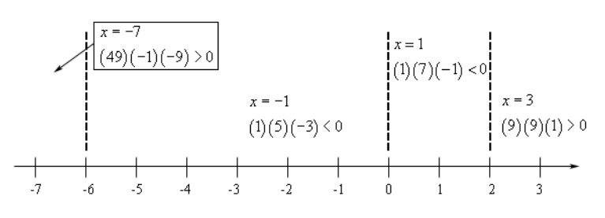

# 2.12 Polynomial Inequalities

**NOTE:** Professor Leonard's explanation of this topic is more comprehensive.
See
[11.4 of Professor Leonard's Intermediate Algebra Series](https://www.youtube.com/watch?v=Rj0OtLftBzc).

---

**Example 1**

Solve $x^2 - 10 < 3x$.

$$ x^2 - 10 < 3x $$

**<ins>Step 1:</ins>**

Get a zero on one side of the inequality. It doesn't matter which side has the
zero, however, we're going to be factoring in the next step so keep that in mind
as you do this step. Make sure that you've got something that's going to be easy
to factor.

$$ x^2 - 3x - 10 < 0 $$

**<ins>Step 2:</ins>**

If possible, factor the polynomial. Note that it won't always be possible to
factor this, but that won't change things. This step is really here to simplify
the process more than anything. Almost all of the problems that we're going to
look at will be factorable.

$$ (x - 5)(x + 2) < 0 $$

**<ins>Step 3:</ins>**

Determine where the polynomial is zero. Notice that these points won't make the
inequality true (in this case) because $0 < 0$ is NOT a true inequality. That
isn't a problem. These points are going to allow us to find the actual solution.

In our case the polynomial will be zero at $x = -2$ and $x = 5$.

Now, before moving on to the next step let's address why we want these points.

We haven't discussed graphing polynomials yet, however, the graphs of
polynomials are nice smooth functions that have no breaks in them. This means
that we are moving across the number line (in any direction) if the value of the
polynomial changes sign (say from positive to negative) then it MUST go through
zero!

So that means that these two numbers ($x = 5$ and $x = -2$) are the ONLY places
where the polynomial can change sign. The number line is then divided into three
regions. In each region if the inequality is satisfied by one point from that
region then it is satisfied for ALL points in that region. If this wasn't true
(<em>i.e.</em> it was positive at one point in the region and negative at
another) then it must also be zero somewhere in that region, but that can't
happen as we've already determined all the places where the polynomial can be
zero! Likewise, if the ineqality isn't satisfied for some point in thta region
then it isn't satisfied for ANY point in that region.

This leads us into the next step.

**<ins>Step 4:</ins>**

Graph the points wwhere the polynomial is zero (<em>i.e</em> the points from the
previous step) on a number line and pick a <b>test point</b> from each of the
regions. Plug each of these test points into the polynomial and determine the
sign of the polynomial at that point.

This is the step in the process that has all the work, although it isn't too
bad. Here is the number line for this problem.

Now, let's talk about this a little. When we pick test points make sure that you
pick easy numbers to work with. So, don't choose large numbers or fractions
unless you are forced to by the problem.

Also, note that we plugged the test points into the factored form of the
polynomial and all we're really after here is whether or not the polynomial is
positive or negative. Therefore, we didn't actually bother with values of the
polynomial just the sign and we can get that from the product shown. The product
of two negatives is a positive, <em>etc.</em>

We are now ready for the final step of the process.

**<ins>Step 5:</ins>**

Write down the answer. Recall that we discussed earlier that if any point from a
region satisfied the inequality then ALL points in that region satisfied the
inequality and likewise if any point from a region did not satisfy the
inequality then NONE of the points in that region would satisfy the inequality.

This means that all we need to do is look up at the number line above. If the
test p oint from a region satisfies the inequality then that region is part of
the solution. If the test point doesn't satisfy the inequality then that region
isn't part of the solution.

Now, also notice that any value of $x$ that will satisfy the original inequality
will also satisfy the inequality from Step 2 and likewise, if an $x$ satisfies
the inequality from Step 2 then it will satisfy the original inequality.

So, that means that all we need to do is determine the regions in which the
polynomial from Step 2 is negative. For this problem that is only the middle
region. The inequality and interval notation for the solution to this inequality
are,

$$ -2 < x < 5 \text{ } (-2, 5) $$

Notice that we do need to exclude the endpoints since we have a strict
inequality (< in this case) in the inequality.

---

**Example 2**

Solve $x^2 - 5x \geq -6$.

$$ x^2 - 5x \geq -6 $$

$$ x^2 - 5x + 6 \geq 0 $$

$$ (x - 3)(x - 2) \geq 0 $$

$$ x = 3 \text{ AND } x = 2 $$

Are the only two places where our polynomial will be zero.

$$ (-\infty, 2] \cup [3, \infty) $$

---

**Example 3**

Solve $x^4 + 4x^3 - 12x^2 \leq 0$.

$$ x^4 + 4x^3 - 12x^2 \leq 0 $$

$$ x^2(x^2 + 4x - 12) \leq 0 $$

$$ x^2(x + 6)(x - 2) \leq 0 $$

$$ x = 0 $$

$$ x = -6 $$

$$ x = 2 $$

$$ -6 \leq x \leq 2 $$

$$ [-6, 2] $$

---

**Example 4**

Solve $(x + 1)(x - 3)^2 > 0$.

$$ x = -1 $$

$$ x = 3 $$

$$ -1 < x < 3 \text{ and } 3 < x < \infty $$

$$ (-1, 3) \cup (3, \infty) $$

---

**Example 5**

Solve $3x^2 - 2x - 11 > 0$.

$$ 3x^2 - 2x - 11 > 0 $$

$$ x = \frac{-(-2) \pm \sqrt{(-2)^2 - 4(3)(-11)}}{2(3)} $$

$$ x = \frac{2 \pm 2\sqrt{34}}{6} $$

$$ x = \frac{1 \pm \sqrt{34}}{3} $$

$$ x = \frac{1 + \sqrt{34}}{3} = 2.27698 $$

$$ x = \frac{1 - \sqrt{34}}{3} = -1.61032 $$

$$ \left(-\infty, \frac{1 - \sqrt{34}}{3}\right) \cup \left(\frac{1 + \sqrt{34}}{3}, \infty\right) $$

---

## Practice Problems

**1.**

$$ u^2 + 4u \geq 21 $$

$$ u^2 + 4u - 21 \geq 0 $$

$$ (u + 7)(u - 3) \geq 0 $$

$$ u = -7 $$

$$ u = 3 $$

$$ (-\infty, -7] \cup [3, \infty) $$

**2.**

$$ x^2 + 8x + 12 < 0 $$

$$ (x + 6)(x + 2) < 0 $$

$$ x = -6 $$

$$ x = -2 $$

$$ x > -6 \text{ and } x < -2 $$

$$ -6 < x < -2$$

$$ (-6, -2)$$

**3.**

$$ 4t^2 \leq 15 - 17t $$

$$ 4t^2 + 17t - 15 \leq 0 $$

$$ (4t - 3)(t + 5) \leq 0 $$

$$ 4t - 3 = 0 $$

$$ 4t = 3 $$

$$ t = \frac{3}{4} $$

$$ t + 5 = 0 $$

$$ t = -5  $$

$$ [-5, \frac{3}{4}] $$

**4.**

$$ z^2 + 34 > 12z $$

$$ z^2 - 12z + 34 > 0 $$

$$ z = \frac{-(-12) \pm \sqrt{(-12)^2 - 4(1)(34)}}{2(1)} $$

$$ z = \frac{12 \pm 2\sqrt{2}}{2} $$

$$ z = 6 \pm \sqrt{2} $$

$$ z = 6 + \sqrt{2} =  7.4142 $$

$$ z = 6 - \sqrt{2} = 4.5858 $$

Test cases.

$$ z = 8 $$

$$ (8)^2 + 34 > 12(8) $$

$$ 64 + 34 > 96 $$

$$ 98 > 96 $$

TRUE.

$$ z = 6 $$

$$ (6)^2 + 34 > 12(6) $$

$$ 36 + 34 > 72 $$

$$ 70 > 72 $$

FALSE.

$$ z = 4 $$

$$ (4)^2 + 34 > 12(4) $$

$$ 16 + 34 > 48 $$

$$ 50 > 48 $$

$$ (-\infty, 4.5858) \cup (7.4142, \infty) $$

**5.**

$$ y^2 - 2y + 1 \leq 0 $$

$$ (y - 1)(y - 1) \leq 0 $$

$$ y = 1 $$

Note: Because it is a perfect square, $y$ can ONLY be $1$.

**6.**

$$ t^4 + t^3 - 12t^2 < 0 $$

$$ t^2(t^2 + t - 12) < 0 $$

$$ t^2(t + 4)(t - 3) < 0 $$

$$ t = 0 $$

$$ t = -4 $$

$$ t = 3 $$

$$ (-4, 0) \cup (0, 3) $$

---

## Assignment Problems

**1.**

$$ z^2 - 11z + 24 < 0 $$

$$ (z - 3)(z - 8) < 0 $$

$$ z = 3 $$

$$ z = 8 $$

Test cases.

$$ z = 2 $$

$$ ((2) - 3)((2) - 8) < 0 $$

$$ 6 < 0 $$

FALSE.

$$ z = 5 $$

$$ ((5) - 3)((5) - 8) < 0 $$

$$ -6 < 0 $$

TRUE.

$$ z = 9 $$

$$ ((9) - 3)((9) - 8) < 0 $$

$$ 6 < 0 $$

$$ (3, 8) $$

**2.**

$$ 2x^2 - 3 \geq 5x $$

$$ 2x^2 - 5x - 3 \geq 0 $$

$$ (2x + 1)(x - 3) \geq 0 $$

$$ 2x + 1 = 0 $$

$$ 2x = -1 $$

$$ x = -\frac{1}{2} $$

$$ x - 3 = 0 $$

$$ x = 3 $$

Test Cases:

$$ x = -1 $$

$$ (2(-1) + 1)((-1) - 3) \geq 0 $$

$$ (-2 + 1)(-1 - 3) \geq 0 $$

$$ (-1)(-4) \geq 0 $$

$$ 4 \geq 0 $$

TRUE.

$$ x = 0 $$

$$ (2(0) + 1)((0) - 3) \geq 0 $$

$$ (0 + 1)(0 - 3) \ geq 0 $$

$$ (1)(-3) \geq 0 $$

$$ -3 \geq 0 $$

FALSE.

$$ x = 4 $$

$$ (2(4) + 1)((4) - 3) \geq 0 $$

$$ (8 + 1)(4 - 3) \ geq 0 $$

$$ (9)(1) \geq 0 $$

$$ 9 \geq 0 $$

TRUE.

$$ (-\infty, -\frac{1}{2}) \cup (3, \infty) $$

**3.**

$$ t^2 > 30 - 7t $$

$$ t^2 + 7t - 30 > 0 $$

$$ (t + 10)(t - 3) > 0 $$

$$ t = -10 $$

$$ t = 3 $$

Test Cases:

$$ t = -11 $$

$$ ((-11) + 10)((-11) - 3) > 0 $$

$$ (-1)(-14) > 0 $$

$$ 14 > 0 $$

TRUE.

$$ t = 0 $$

$$ ((0) + 10)((0) - 3) > 0 $$

$$ (10)(-3) > 0 $$

$$ -30 > 0 $$

FALSE.

$$ t = 4 $$

$$ ((4) + 10)((4) - 3) > 0 $$

$$ 14(1)> 0 $$

$$ 14 > 0 $$

TRUE.

$$ (-\infty, -10) \cup (3, \infty) $$

**4.**

$$ m^2 - 7m \leq 8 $$

$$ m^2 - 7m - 8 \leq 0 $$

$$ (m - 8)(m + 1) \leq 0 $$

$$ m = 8 $$

$$ m = -1 $$

Test Cases:

$$ m = -2 $$

$$ ((-2) - 8)((-2) + 1) \leq 0 $$

$$ (-10)(-1) \leq 0 $$

$$ 10 \leq 0 $$

FALSE.

$$ m = 0 $$

$$ ((0) - 8)((0) + 1) \leq 0 $$

$$ (-8)(1) \leq 0 $$

$$ -8 \leq 0 $$

TRUE.

$$ m = 9 $$

$$ ((9) - 8)((9) + 1) \leq 0 $$

$$ (1)(10) \leq 0 $$

$$ 10 \leq 0 $$

FALSE.

$$ [-1, 8] $$

**5.**

$$ x^2 + 6x \geq -9 $$

$$ x^2 + 6x + 9 \geq 0 $$

$$ (x + 3)(x + 3) \geq 0 $$

$$ (x + 3)^2 \geq 0 $$

$$ \text{ALWAYS TRUE FOR ALL REAL NUMBERS} $$

$$ (-\infty, \infty) $$

**6.**

$$ u^2 + u \leq 1 $$

$$ u^2 + u - 1 \leq 0 $$

$$ u = \frac{-(1) \pm \sqrt{(1)^2 - 4(1)(-1)}}{2(1)} $$

$$ u = \frac{-1 \pm \sqrt{5}}{1} $$

$$ u = -1 \pm \sqrt{5} $$

$$ u = -1 + \sqrt{5} = 1.2361 $$

$$ u = -1 - \sqrt{5} = -3.2361 $$

Test Cases:

$$ u = -4 $$

$$ (-4)^2 + (-4) - 1 \leq 0 $$

$$ 16 - 4 - 1 \leq 0 $$

$$ 12 - 1 \leq 0 $$

$$ 11 \leq 0 $$

FALSE.

$$ u = 0 $$

$$ (0)^2 + (0) - 1 \leq 0 $$

$$ 0 + 0 - 1 \leq 0 $$

$$ 0 - 1 \leq 0 $$

$$ -1 \leq 0 $$

TRUE.

$$ u = 2 $$

$$ (2)^2 + (2) - 1 \leq 0 $$

$$ 4 + 2 - 1 \leq 0 $$

$$ 6 - 1 \leq 0 $$

$$ 5 \leq 0 $$

FALSE.

$$ [-3.2361, 1.2361] $$

**7.**

$$ w^2 + 4w - 12 > 0 $$

$$ (w + 6)(w - 2) > 0 $$

$$ w = -6 $$

$$ w = 2 $$

Test Cases:

$$ w = -7 $$

$$ ((-7) + 6)((-7) - 2) > 0 $$

$$ (-7 + 6)(-9) > 0 $$

$$ (-1)(-9) > 0 $$

$$ 9 > 0 $$

TRUE.

$$ w = 0 $$

$$ ((0) + 6)((0) - 2) > 0 $$

$$ (6)(-2) > 0 $$

$$ 12 > 0 $$

FALSE.

$$ w = 3 $$

$$ ((3) + 6)((3) - 2) > 0 $$

$$ (9)(1) > 0 $$

$$ 9 > 0 $$

TRUE.

$$ (-\infty, -6) \cup (2, \infty) $$

**8.**

$$ x^2 + 49 > 14x $$

$$ x^2 - 14x + 49 > 0 $$

$$ (x - 7)(x - 7) > 0 $$

$$ (x - 7)^2 > 0 $$

$$ x = 7 $$

Note: Because the inequality sign is <em>non-inclusive</em>, it means that $7$
cannot be included in our final set:

$$ (-\infty, 7) \cup (7, \infty) $$

**9.**

$$ t^2 \leq t $$

$$ t^2 - t \leq 0 $$

$$ t(t - 1) \leq 0 $$

$$ t = 0 $$

$$ t - 1 = 0 $$

$$ t = 1 $$

Test Cases:

$$ t = -1 $$

$$ (-1)((-1) - 1) \leq 0 $$

$$ (-1)(-2) \leq 0 $$

$$ 2 \leq 0 $$

FALSE.

$$ t = \frac{1}{2} $$

$$ \left(\frac{1}{2}\right)\left(\frac{1}{2} - 1\right) \leq 0 $$

$$ \left(\frac{1}{2}\right)\left(-\frac{1}{2}\right) \leq 0 $$

$$ -\frac{1}{4} \leq 0 $$

TRUE.

$$ t = 2 $$

$$ (2)((2) - 1) \leq 0 $$

$$ 2(1) \leq 0 $$

$$ 2 \leq 0 $$

FALSE.

$$ [0, 1] $$

**10.**

$$ x^2 - 8x > -14 $$

$$ x^2 - 8x + 14 > 0 $$

$$ x = \frac{-(-8) \pm \sqrt{(-8)^2 - 4(1)(14)}}{2(1)} $$

$$ x = \frac{8 \pm 2\sqrt{2}}{2} $$

$$ x = 4 \pm \sqrt{2} $$

$$ x = 4 + \sqrt{2} = 5.4142$$

$$ x = 4 - \sqrt{2} = 2.5858 $$

Test Cases:

$$ x = 1 $$

$$ (1)^2 - 8(1) + 14 > 0 $$

$$ 1 - 8 + 14 > 0 $$

$$ -7 + 14 > 0 $$

$$ 7 > 0 $$

TRUE.

$$ x = 3 $$

$$ (3)^2 - 8(3) + 14 > 0 $$

$$ 9 - 24 + 14 > 0 $$

$$ -15 + 14 > 0 $$

$$ -1 > 0 $$

FALSE.

$$ x = 6 $$

$$ (6)^2 - 8(6) + 14 > 0 $$

$$ 36 - 24 + 14 > 0 $$

$$ 12 + 14 > 0 $$

$$ 26 > 0 $$

TRUE.

$$ (-\infty, 2.5858) \cup (5.4142, \infty) $$

**11.**

$$ 9u^2 - 6u + 1 < 0 $$

$$ (3u - 1)(3u - 1) < 0 $$

$$ (3u - 1)^2 < 0 $$

Note: But $(3u - 1)^2$ can NEVER be less than $0$. Thusly Our answer is:

$$ \emptyset $$

**12.**

$$ z^6 + 8z^5 + 12z^4 \geq 0 $$

$$ z^4(z^2 + 8z + 12) \geq 0 $$

$$ z^4(z + 6)(z + 2) \geq 0 $$

$$ z = -6 $$

$$ z = -2 $$

$$ z = 0 $$

Test Cases:

$$ z = -7 $$

$$ (-7)^4((-7) + 6)((-7) + 2) \geq 0 $$

$$ 2401(-1)(-5) \geq 0 $$

$$ 12005 \geq 0 $$

TRUE.

$$ z = -4 $$

$$ (-4)^4((-4) + 6)((-4) + 2) \geq 0 $$

$$ 256(2)(-2) \geq 0 $$

$$ -1024 \geq 0 $$

FALSE.

$$ z = -1 $$

$$ (-1)^4((-1) + 6)((-1) + 2) \geq 0 $$

$$ 1(5)(1) \geq 0 $$

$$ 5 \geq 0 $$

TRUE.

$$ z = 1 $$

$$ (1)^4((1) + 6)((1) + 2) \geq 0 $$

$$ 1(7)(3) \geq 0 $$

$$ 21 \geq 0 $$

True.

$$ z = -6 $$

$$ z = -2 $$

$$ z = 0 $$

$$ (-\infty, -6] \cup [0, \infty) $$

**13.**

$$ 2w^3 - 3w^2 > 14w $$

$$ 2w^3 - 3w^2 - 14w > 0 $$

$$ w(2w^2 - 3w - 14) > 0 $$

$$ w(2w - 7)(w + 2) > 0 $$

$$ w + 2 = 0 $$

$$ w = -2 $$

$$ w = 0 $$

$$ 2w - 7 = 0 $$

$$ 2w = 7 $$

$$ w = \frac{7}{2} $$

Test Cases:

$$ w = -3 $$

$$ (-3)(2(-3) - 7)((-3) + 2) > 0 $$

$$ (-3)(-6 - 7)(-3 + 2) > 0 $$

$$ (-3)(-13)(-1) > 0 $$

$$ -39 > 0 $$

FALSE.

$$ w = -1 $$

$$ (-1)(2(-1) - 7)((-1) + 2) > 0 $$

$$ (-1)(-2 - 7)(-1 + 2) > 0 $$

$$ (-1)(-9)(1) > 0 $$

$$ 9 > 0 $$

TRUE.

$$ w = 1 $$

$$ (1)(2(1) - 7)((1) + 2) > 0 $$

$$ (1)(2 - 7)(1 + 2) > 0 $$

$$ (1)(-5)(3) > 0 $$

$$ -15 > 0 $$

FALSE.

$$ w = 4 $$

$$ (4)(2(4) - 7)((4) + 2) > 0 $$

$$ (4)(8 - 7)(4 + 2) > 0 $$

$$ (4)(1)(6) > 0 $$

$$ 24 > 0 $$

TRUE.

$$ w = -2 $$

$$ w = 0 $$

$$ w = \frac{7}{2} $$

$$ (-2, 0) \cup \left(\frac{7}{2}, \infty\right) $$
