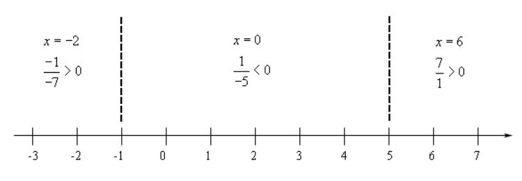
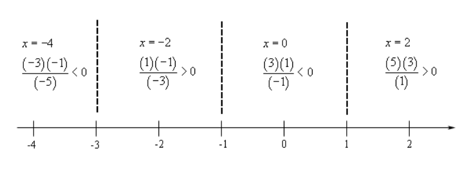

# 2.13 Rational Inequalities

---

**Example 1**

Solve $\dfrac{x + 1}{x -  5} \leq 0$.

$$ \text{numerator : } x = -1 $$

$$ \text{denominator : } x = 5 $$

Note here that the middle section is where the expression holds true (between
$-1$ and $5$). Also note that we <em>cannot</em> include $5$ even though our
inequality operator is inclusive. This is becaue to include $5$ would create a
case where our denominator could be $0$. Thusly we must exclude it from our
final solution set.

$$ -1 \leq x < 5 $$

$$ [-1, 5) $$

---

**Example 2**

Solve $\dfrac{x^2 + 4x + 3}{x - 1} > 0$.

$$ \frac{x^2 + 4x + 3}{x - 1} > 0 $$

$$ \frac{(x + 3)(x + 1)}{x - 1} > 0 $$

$$ \text{numerator : } x = -3 $$

$$ \text{numerator : } x = -1 $$

$$ \text{denominator : }x = 1 $$

$$ (-3, 1) \cup (1, \infty) $$

---

**Example 3**

Solve $\dfrac{x^2 - 16}{(x - 1)^2} < 0$.

$$ \frac{x^2 - 16}{(x - 1)^2} < 0 $$

$$ \frac{(x - 4)(x + 4)}{(x - 1)(x - 1)} < 0 $$

$$ \text{numerator : } x = -4 $$

$$ \text{denominator : } x  = 1 $$

$$ \text{numerator : } x = 4 $$

Test Cases:

$$ x = -5 $$

$$ \frac{((-5) - 4)((-5) + 4)}{((-5) - 1)((-5) - 1)} < 0 $$

$$ \frac{(-9)(-1)}{(-6)^2} < 0 $$

$$ \frac{9}{36} < 0 $$

FALSE.

$$ x = 0 $$

$$ \frac{((0) - 4)((0) + 4)}{((0) - 1)((0) - 1)} < 0 $$

$$ \frac{(-4)(4)}{(-1)^2} < 0 $$

$$ \frac{-16}{1} < 0 $$

TRUE.

$$ x = 2 $$

$$ \frac{((2) - 4)((2) + 4)}{((2) - 1)((2) - 1)} < 0 $$

$$ \frac{(-2)(6)}{(1)^2} < 0 $$

$$ \frac{-12}{1} < 0 $$

TRUE.

$$ x = 5 $$

$$ \frac{((5) - 4)((5) + 4)}{((5) - 1)((5) - 1)} < 0 $$

$$ \frac{(1)(9)}{(4)^2} < 0 $$

$$ \frac{9}{16} < 0 $$

FALSE.

$$ (-4, 1) \cup (1, 4) $$

---

**Example 4**

Solve $\dfrac{3x + 1}{x + 4} \geq 1$.

$$ \frac{3x + 1}{x + 4} \geq 1 $$

$$ \frac{3x + 1}{x + 4} - 1 \geq 0 $$

$$ \frac{3x + 1}{x + 4} - \frac{x + 4}{x + 4} \geq 0 $$

$$ \frac{3x + 1 - (x + 4)}{x + 4} \geq 0 $$

$$ \frac{2x - 3}{x + 4} \geq 0 $$

$$ \text{numerator : } x = \frac{3}{2} $$

$$ \text{denominator : } x = -4 $$

Test Cases:

$$ x = -5 $$

$$ \frac{2(-5) - 3}{(-5) + 4} \geq 0 $$

$$ \frac{-10 - 3}{-1} \geq 0 $$

$$ \frac{-13}{-1} \geq 0 $$

$$ 13 \geq 0 $$

TRUE.

$$ x = 0 $$

$$ \frac{2(0) - 3}{(0) + 4} \geq 0 $$

$$ \frac{0 - 3}{4} \geq 0 $$

$$ \frac{-3}{4} \geq 0 $$

FALSE.

$$ x = 2 $$

$$ \frac{2(2) - 3}{(2) + 4} \geq 0 $$

$$ \frac{4 - 3}{6} \geq 0 $$

$$ \frac{1}{6} \geq 0 $$

TRUE.

$$ (-\infty, -4) \cup \left[\frac{3}{2}, \infty\right)  $$

---

**Example 5**

Solve $\dfrac{x - 8}{x} \leq 3 - x$.

$$ \frac{x - 8}{x} \leq 3 - x $$

$$ \frac{x - 8}{x} - (3 - x) \leq 0 $$

$$ \frac{x - 8}{x} - \frac{x(3 - x)}{x} \leq 0 $$

$$ \frac{x - 8 - x(3 - x)}{x} \leq 0 $$

$$ \frac{x - 8 - 3x + x^2}{x} \leq 0 $$

$$ \frac{x^2 -2x -8}{x} \leq 0 $$

$$ \frac{(x - 4)(x + 2)}{x} \leq 0 $$

$$ \text{numerator : } x = -2 $$

$$ \text{denominator : } x = 0 $$

$$ \text{numerator : } x = 4 $$

Test Cases:

$$ x = -3 $$

$$ \frac{((-3) - 4)((-3) + 2)}{(-3)} \leq 0 $$

$$ \frac{(-7)(-1)}{-1} \leq 0 $$

$$ \frac{7}{-1} \leq 0 $$

$$ -7 \leq 0 $$

TRUE.

$$ x = -1 $$

$$ \frac{((-1) - 4)((-1) + 2)}{(-1)} \leq 0 $$

$$ \frac{(-5)(1)}{-1} \leq 0 $$

$$ \frac{-5}{-1} \leq 0 $$

$$ 5 \leq 0 $$

FALSE.

$$ x = 1 $$

$$ \frac{((1) - 4)((1) + 2)}{(1)} \leq 0 $$

$$ \frac{(-3)(3)}{1} \leq 0 $$

$$ \frac{-9}{1} \leq 0 $$

$$ -9 \leq 0 $$

TRUE.

$$ x = 5 $$

$$ \frac{((5) - 4)((5) + 2)}{(5)} \leq 0 $$

$$ \frac{(1)(7)}{5} \leq 0 $$

$$ \frac{7}{5} \leq 0 $$

FALSE.

$$ (-\infty, -2] \cup (0, 4] $$

---

## Practice Problems

**1.**

$$ \frac{4 - x}{x + 3} > 0 $$

$$ \frac{x - 4}{x + 3} < 0 $$

$$ \text{denominator : } x = -3 $$

$$ \text{numerator : } x = 4 $$

Test Cases:

$$ x = -4 $$

$$ \frac{(-4) - 4}{(-4) + 3} < 0 $$

$$  \frac{-8}{-1} < 0 $$

$$ 8 < 0 $$

FALSE.

$$ x = 0 $$

$$ \frac{(0) - 4}{(0) + 3} < 0 $$

$$ \frac{-4}{3} < 0 $$

TRUE.

$$ x = 5 $$

$$ \frac{(5) - 4}{(5) + 3} < 0 $$

$$ \frac{1}{8} < 0 $$

FALSE.

$$ (-3, 4) $$

**2.**

$$ \frac{2z - 5}{z - 7} \leq 0 $$

$$ 2z - 5 = 0 $$

$$ 2z = 5 $$

$$ \text{numerator : } z = \frac{5}{2} $$

$$ z - 7 = 0 $$

$$ \text{ denominator : } z = 7 $$

Test Cases:

$$ z = 1 $$

$$ \frac{2(1) - 5}{(1) - 7} \leq 0 $$

$$ \frac{-3}{-6} \leq 0 $$

$$ \frac{1}{2} \leq 0 $$

FALSE.

$$ z = 4 $$

$$ \frac{2(4) - 5}{(4) - 7} \leq 0 $$

$$ \frac{3}{-3} \leq 0 $$

$$ -1 \leq 0 $$

TRUE.

$$ z = 8 $$

$$ \frac{2(8) - 5}{(8) - 7} \leq 0 $$

$$ \frac{11}{1} \leq 0 $$

$$ 11 \leq 0 $$

FALSE.

$$ \left[\frac{5}{2}, 7\right) $$

**3.**

$$ \frac{w^2 + 5w - 6}{w - 3} \geq 0 $$

$$ \frac{(w + 6)(w - 1)}{w - 3} \geq 0 $$

$$ \text{numerator : } w = -6 $$

$$ \text{numerator : } w = 1 $$

$$ \text{denominator : } w = 3 $$

Test Cases:

$$ w = -7 $$

$$ \frac{((-7) + 6)((-7) - 1)}{(-7) - 3} \geq 0 $$

$$ \frac{(-1)(-8)}{-10} \geq 0 $$

$$ \frac{8}{-10} \geq 0 $$

FALSE.

$$ w = 0 $$

$$ \frac{((0) + 6)((0) - 1)}{(0) - 3} \geq 0 $$

$$ \frac{(6)(-1)}{-3} \geq 0 $$

$$ \frac{-6}{-3} \geq 0 $$

$$ 2 \geq 0 $$

TRUE.

$$ w = 2 $$

$$ \frac{((2) + 6)((2) - 1)}{(2) - 3} \geq 0 $$

$$ \frac{(8)(1)}{-1} \geq 0 $$

$$  \frac{8}{-1} \geq 0 $$

FALSE.

$$ w = 4 $$

$$ \frac{((4) + 6)((4) - 1)}{(4) - 3} \geq 0 $$

$$ \frac{(8)(3)}{1} \geq 0 $$

$$ \frac{24}{1} \geq 0 $$

TRUE.

$$ [-6, 1] \cup (3, \infty) $$

**4.**

$$ \frac{3x + 8}{x - 1} < -2 $$

$$ \frac{3x + 8}{x - 1} + 2 < 0 $$

$$ \frac{3x + 8 + 2(x - 1)}{x - 1} < 0 $$

$$ \frac{3x + 8 + 2x - 2}{x - 1} < 0 $$

$$  \frac{5x + 6}{x - 1} < 0 $$

$$ 5x + 6 = 0 $$

$$ 5x = -6 $$

$$ \text{numerator : } x = -\frac{6}{5} $$

$$ \text{denominator : } x = 1 $$

Test Cases:

$$ x = -2 $$

$$  \frac{5(-2) + 6}{(-2) - 1} < 0 $$

$$ \frac{-4}{-3} < 0 $$

$$ \frac{4}{3} < 0 $$

FALSE.

$$ x = 0 $$

$$  \frac{5(0) + 6}{(0) - 1} < 0 $$

$$ \frac{6}{-1} < 0 $$

$$ -6 < 0 $$

TRUE.

$$ x = 2 $$

$$  \frac{5(2) + 6}{(2) - 1} < 0 $$

$$ \frac{16}{1} < 0 $$

$$ 16 < 0 $$

FALSE.

FALSE, TRUE, FALSE

$$ \text{numerator : } x = -\frac{6}{5} $$

$$ \text{denominator : } x = 1 $$

$$ \left(-\frac{6}{5}, 1\right) $$

**5.**

$$ u \leq \frac{4}{u - 3} $$

$$ u - \left(\frac{4}{u - 3}\right) \leq 0 $$

$$ \frac{u(u - 3) - 4}{u - 3} \leq 0 $$

$$ \frac{u^2 - 3u - 4}{u - 3} \leq 0 $$

$$ \frac{(u - 4)(u + 1)}{u - 3} \leq 0 $$

$$ \text{numerator : } u = -1 $$

$$ \text{denominator : } u = 3 $$

$$ \text{numerator : } u = 4 $$

Test Cases:

$$ u = -2 $$

$$ \frac{((-2) - 4)((-2) + 1)}{(-2) - 3} \leq 0 $$

$$ \frac{(-6)(-1)}{-5} \leq 0 $$

$$ \frac{6}{-5} \leq 0 $$

TRUE.

$$ u = 0 $$

$$ \frac{((0) - 4)((0) + 1)}{(0) - 3} \leq 0 $$

$$ \frac{(-4)(1)}{-3} \leq 0 $$

$$ \frac{-4}{-3} \leq 0 $$

$$ \frac{4}{3} \leq 0 $$

FALSE.

$$ u = \frac{7}{2} $$

$$ \frac{\left(\dfrac{7}{2} - 4\right)\left(\dfrac{7}{2} + 1\right)}{\dfrac{7}{2} - 3} \leq 0 $$

$$ \frac{\left(-\dfrac{1}{2}\right)\left(\dfrac{9}{2}\right)}{\dfrac{1}{2}} \leq 0 $$

$$ \frac{-\dfrac{9}{4}}{\dfrac{1}{2}} \leq 0 $$

$$ -\frac{9}{2} \leq 0 $$

TRUE.

$$ u = 5 $$

$$ \frac{((5) - 4)((5) + 1)}{(5) - 3} \leq 0 $$

$$ \frac{(1)(6)}{2} \leq 0 $$

$$ \frac{6}{2} \leq 0 $$

$$ 3 \leq 0 $$

FALSE.

$$ (-\infty, -1] \cup (3, 4] $$

**6.**

$$  \frac{t^3 - 6t^2}{t - 2} > 0 $$

$$  \frac{t^2(t - 6)}{t - 2} > 0 $$

$$ \text{numerator : } t = 0 $$

$$ \text{denominator : } t = 2 $$

$$ \text{numerator : } t = 6 $$

Test Cases:

$$ t = -1 $$

$$  \frac{(-1)^2((-1) - 6)}{(-1) - 2} > 0 $$

$$ \frac{(1)(-7)}{-3} > 0 $$

$$ \frac{7}{3} > 0 $$

TRUE.

$$ t = 1 $$

$$  \frac{(1)^2((1) - 6)}{(1) - 2} > 0 $$

$$ \frac{(1)(-5)}{-1} > 0 $$

$$ \frac{-5}{-1} $$

$$ 5 > 0 $$

TRUE.

$$ t = 3 $$

$$  \frac{(3)^2((3) - 6)}{(3) - 2} > 0 $$

$$ \frac{(9)(-3)}{1} > 0 $$

$$ \frac{-27}{1} > 0 $$

FALSE.

$$ t = 7 $$

$$  \frac{(7)^2((7) - 6)}{(7) - 2} > 0 $$

$$ \frac{(49)(1)}{5} > 0 $$

$$ \frac{49}{5} > 0 $$

TRUE.

TRUE, TRUE, FALSE, TRUE.

$$ \text{numerator : } t = 0 $$

$$ \text{denominator : } t = 2 $$

$$ \text{numerator : } t = 6 $$

$$ (-\infty, 0) \cup (0, 2) \cup (6, \infty) $$

---

## Assignment Problems

**1.**

$$ \frac{t + 6}{t - 1} < 0 $$

$$ \text{numerator : } t = -6 $$

$$ \text{denominator : } t = 1 $$

Test Cases:

$$ t = -7 $$

$$ \frac{(-7) + 6}{(-7) - 1} < 0 $$

$$ \frac{-1}{-8} < 0 $$

$$ \frac{1}{8} < 0 $$

FALSE.

$$ t = 0 $$

$$ \frac{(0) + 6}{(0) - 1} < 0 $$

$$ \frac{6}{-1} < 0 $$

$$ -6 < 0 $$

TRUE.

$$ t = 2 $$

$$ \frac{(2) + 6}{(2) - 1} < 0 $$

$$ \frac{8}{1} < 0 $$

$$ 8 < 0 $$

FALSE.

$$ (-6, 1) $$

**2.**

$$ \frac{4x + 2}{3 - x} \geq 0 $$

$$ 4x + 2 = 0 $$

$$ 4x = -2 $$

$$ x = -\frac{2}{4} $$

$$ \text{numerator : } x = -\frac{1}{2} $$

$$ 3 - x = 0 $$

$$ \text{denominator : } x = 3 $$

Test Cases:

$$ x = -1 $$

$$ \frac{4(-1) + 2}{3 - (-1)} \geq 0 $$

$$ \frac{-2}{4} \geq 0 $$

$$ -\frac{1}{2} \geq 0 $$

FALSE.

$$ x = 0 $$

$$ \frac{4(0) + 2}{3 - (0)} \geq 0 $$

$$ \frac{2}{3} \geq 0 $$

$$ TRUE. $$

$$ x = 4 $$

$$ \frac{4(4) + 2}{3 - (4)} \geq 0 $$

$$ \frac{18}{-1} \geq 0 $$

$$ -18 \geq 0 $$

FALSE.

$$ \left[-\frac{1}{2}, 3\right) $$

**3.**

$$ \frac{2u + 3}{u + 6} > 0 $$

$$ \text{denominator : } u = -6 $$

$$ \text{numerator : } u = -\frac{3}{2} $$

Test Cases:

$$ u = -7 $$

$$ \frac{2(-7) + 3}{(-7) + 6} > 0 $$

$$ \frac{-11}{-1} > 0 $$

$$ 11 > 0 $$

TRUE.

$$ u = -3 $$

$$ \frac{2(-3) + 3}{(-3) + 6} > 0 $$

$$ \frac{-3}{3} > 0 $$

$$ -1 > 0 $$

FALSE.

$$ u = 0 $$

$$ \frac{2(0) + 3}{(0) + 6} > 0 $$

$$ \frac{3}{6} > 0 $$

$$ \frac{1}{2} > 0 $$

TRUE.

$$ (-\infty, -6) \cup (-\frac{3}{2}, \infty) $$

**4.**

$$ \frac{3 - z}{z + 1} < -2 $$

$$ \frac{3 - z}{z + 1} + 2 < 0 $$

$$ \frac{3 - z + 2(z + 1)}{z + 1} < 0 $$

$$ \frac{3 - z + 2z + 2}{z + 1} < 0 $$

$$ \frac{z + 5}{z + 1} < 0 $$

$$ \text{numerator : } z = -5 $$

$$ \text{denominator : } z = -1 $$

Test Cases:

$$ z = -6 $$

$$ \frac{(-6) + 5}{(-6) + 1} < 0 $$

$$ \frac{-1}{-5} < 0 $$

$$ \frac{1}{5} < 0 $$

FALSE.

$$ z = -3 $$

$$ \frac{(-3) + 5}{(-3) + 1} < 0 $$

$$ \frac{2}{-2} < 0 $$

$$ -1 < 0 $$

TRUE.

$$ z = 0 $$

$$ \frac{(0) + 5}{(0) + 1} < 0 $$

$$ \frac{5}{1} < 0 $$

$$ 5 < 0 $$

FALSE.

$$ (-5, -1) $$

**5.**

$$ \frac{w + 9}{w + 2} \leq 3 $$

$$ \frac{w + 9}{w + 2} - 3 \leq 0 $$

$$ \frac{w + 9 - 3(w + 2)}{w + 2} \leq 0 $$

$$ \frac{w + 9 - 3w - 6}{w + 2} \leq 0 $$

$$  \frac{-2w + 3}{w + 2} \leq 0 $$

$$ -2w + 3 = 0 $$

$$ 3 = 2w $$

$$ \frac{3}{2} = w $$

$$ \text{denominator : } w = -2 $$

$$ \text{numerator : } w = \frac{3}{2} $$

Test Cases:

$$ w = -3 $$

$$  \frac{-2(-3) + 3}{(-3) + 2} \leq 0 $$

$$  \frac{9}{-1} \leq 0 $$

$$ -9 \leq 0 \text{ TRUE }$$

$$ w = 0 $$

$$  \frac{-2(0) + 3}{(0) + 2} \leq 0 $$

$$ \frac{3}{2} \leq 0 \text{ FALSE } $$

$$ w = 2 $$

$$  \frac{-2(2) + 3}{(2) + 2} \leq 0 $$

$$ \frac{-1}{4} \leq 0 $$

$$ -\frac{1}{4} \leq 0 \text{ TRUE } $$

$$ (-\infty, -2) \cup \left[\frac{3}{2}, \infty\right) $$

**6.**

$$ \frac{x^2 + 9x + 14}{x - 1} > 0 $$

$$ \frac{(x + 7)(x + 2)}{x - 1} > 0 $$

$$ \text{numerator : } x = -7 $$

$$ \text{numerator : } x = -2 $$

$$ \text{denominator : } x = 1 $$

Test Cases:

$$ x = -8 $$

$$ \frac{((-8) + 7)((-8) + 2)}{(-8) - 1} > 0 $$

$$ \frac{(-1)(-6)}{-9} > 0 $$

$$ \frac{6}{-9} > 0 \text{ FALSE }$$

$$ x = -4 $$

$$ \frac{((-4) + 7)((-4) + 2)}{(-4) - 1} > 0 $$

$$ \frac{(3)(-2)}{-5} > 0 $$

$$ \frac{-6}{-5} > 0 \text{ TRUE } $$

$$ x = 0 $$

$$ \frac{((0) + 7)((0) + 2)}{(0) - 1} > 0 $$

$$ \frac{(7)(2)}{-1} > 0 $$

$$ -14 > 0 \text{ FALSE }$$

$$ x = 2 $$

$$ \frac{((2) + 7)((2) + 2)}{(2) - 1} > 0 $$

$$ \frac{(9)(4)}{-1} > 0 $$

$$ -36 > 0 \text{ FALSE} $$

$$ (-7, -2) $$

**7.**

$$ \frac{4z^2 + 3z - 10}{z} \geq 0 $$

$$ \frac{(4z - 5)(z + 2)}{z} \geq 0 $$

$$ \text{numerator : } z = -2 $$

$$ \text{denominator : } z = 0 $$

$$ \text{numerator : } z = \frac{5}{4} $$

Test Cases:

$$ z = -3 $$

$$ \frac{(4(-3) - 5)((-3) + 2)}{(-3)} \geq 0 $$

$$ \frac{(-17)(-1)}{-3} \geq 0 $$

$$ \frac{17}{-3} \geq 0 \text{ FALSE } $$

$$ z = -1 $$

$$ \frac{(4(-1) - 5)((-1) + 2)}{(-1)} \geq 0 $$

$$ \frac{(-9)(1)}{-1} \geq 0 $$

$$ 9 \geq 0 \text{ TRUE } $$

$$ z = 1 $$

$$ \frac{(4(1) - 5)((1) + 2)}{(1)} \geq 0 $$

$$ \frac{(-1)(3)}{1} \geq 0 $$

$$ -3 \geq 0 \text{ FALSE } $$

$$ z = 2 $$

$$ \frac{(4(2) - 5)((2) + 2)}{(2)} \geq 0 $$

$$ \frac{(3)(4)}{2} \geq 0 $$

$$ 6 \geq 0 \text{ TRUE } $$

$$ [-2, 0) \cup \left[\frac{5}{4}, \infty\right) $$

**8.**

$$ \frac{t^2 + 10t + 16}{t^2 - 4t + 3} \leq 0 $$

$$ \frac{(t + 8)(t + 2)}{(t - 3)(t - 1)} \leq 0 $$

$$ \text{numerator : } t = -8 $$

$$ \text{numerator : } t = -2 $$

$$ \text{denominator : } t = 1 $$

$$ \text{denominator : } t = 3 $$

Test Cases:

$$ t = -9 $$

$$ \frac{((-9) + 8)((-9) + 2)}{((-9) - 3)((-9) - 1)} \leq 0 $$

$$ \frac{(-1)(-7)}{(-12)(-10)} \leq 0 $$

$$ \frac{7}{120} \leq 0 \text{ FALSE } $$

$$ t = -4 $$

$$ \frac{((-4) + 8)((-4) + 2)}{((-4) - 3)((-4) - 1)} \leq 0 $$

$$ \frac{(4)(-2)}{(-7)(-5)} \leq 0 $$

$$  \frac{-8}{35} \leq 0 \text{ TRUE } $$

$$ t = 0 $$

$$ \frac{((0) + 8)((0) + 2)}{((0) - 3)((0) - 1)} \leq 0 $$

$$ \frac{(8)(2)}{(-3)(-1)} \leq 0 $$

$$ \frac{16}{3} \leq 0 \text{ FALSE } $$

$$ t = 2 $$

$$ \frac{((2) + 8)((2) + 2)}{((2) - 3)((2) - 1)} \leq 0 $$

$$ \frac{(10)(4)}{(-1)(-1)} \leq 0 $$

$$ 40 \leq 0 \text{ FALSE } $$

$$ t = 4 $$

$$ \frac{((4) + 8)((4) + 2)}{((4) - 3)((4) - 1)} \leq 0 $$

$$ \frac{(12)(6)}{(1)(3)} \leq 0 $$

$$ 24 \leq 0 \text{ FALSE } $$

$$ [-8, -2] $$

**9.**

$$ \frac{z^2 - 6z + 4}{z - 5} < 4 $$

$$ \frac{z^2 - 6z + 4}{z - 5} - 4 < 0 $$

$$  \frac{z^2 - 6z + 4 - 4(z - 5)}{z - 5} < 0 $$

$$  \frac{z^2 - 6z + 4 - 4z + 20}{z - 5} < 0 $$

$$ \frac{z^2 - 10z + 24}{z - 5} < 0 $$

$$ \frac{(z - 6)(z - 4)}{z - 5} < 0 $$

$$ \text{numerator : } z = 4 $$

$$ \text{denominator : } z = 5 $$

$$ \text{numerator : } z = 6 $$

Test Cases:

$$ z = 3 $$

$$ \frac{((3) - 6)((3) - 4)}{(3) - 5} < 0 $$

$$  \frac{(-3)(-1)}{-2} < 0 $$

$$ -\frac{3}{2} < 0 \text{ TRUE }$$

$$ z = \frac{9}{2} $$

$$ \frac{\left(\dfrac{9}{2} - 6\right)\left(\dfrac{9}{2} - 4\right)}{\dfrac{9}{2} - 5} < 0 $$

$$  \frac{\left(-\dfrac{3}{2}\right)\left(\dfrac{1}{2}\right)}{-\dfrac{1}{2}} < 0 $$

$$ \frac{-\dfrac{3}{4}}{-\dfrac{1}{2}} < 0 $$

$$ \frac{3}{2} < 0 \text{ FALSE } $$

$$ z = \frac{11}{2} $$

$$ \frac{\left(\dfrac{11}{2} - 6\right)\left(\dfrac{11}{2} - 4\right)}{\dfrac{11}{2} - 5} < 0 $$

$$  \frac{\left(-\dfrac{1}{2}\right)\left(\dfrac{3}{2}\right)}{\dfrac{1}{2}} < 0 $$

$$ \frac{-\dfrac{3}{4}}{\dfrac{1}{2}} < 0 $$

$$ -\frac{3}{2} < 0 \text{ TRUE }$$

$$ z = 7 $$

$$ \frac{((7) - 6)((7) - 4)}{(7) - 5} < 0 $$

$$  \frac{(1)(3)}{2} < 0 $$

$$ \frac{3}{2} < 0 \text{ FALSE } $$

$$ (-\infty, 4) \cup (5, 6) $$

**10.**

$$ w - 5 \geq \frac{3 - w^2}{w} $$

$$ 0 \geq \left(\frac{3 - w^2}{w}\right) - (w - 5) $$

$$ 0 \geq \frac{3 - w^2 - w(w - 5)}{w} $$

$$ 0 \geq \frac{3 - w^2 - w^2 + 5w}{w} $$

$$ 0 \geq \frac{-2w^2 + 5w + 3}{w} $$

$$ 0 \geq \frac{(2w + 1)(-w + 3)}{w} $$

$$ \text{numerator : } w = -\frac{1}{2} $$

$$ \text{denominator : } w = 0 $$

$$ \text{numerator : } w = 3 $$

Test Cases:

$$ w = -1 $$

$$ 0 \geq \frac{(2(-1) + 1)(-(-1) + 3)}{(-1)} $$

$$ 0 \geq \frac{(-1)(4)}{-1} $$

$$ 0 \geq 4 \text{ FALSE } $$

$$ w = -\frac{1}{4} $$

$$ 0 \geq \frac{\left(2\left(-\dfrac{1}{4}\right) + 1\right)\left(-\left(-\dfrac{1}{4}\right) + 3\right)}{\left(-\dfrac{1}{4}\right)} $$

$$ 0 \geq \frac{\left(\dfrac{1}{2}\right)\left(\dfrac{13}{4}\right)}{-\dfrac{1}{4}} $$

$$ 0 \geq \frac{\dfrac{13}{8}}{-\dfrac{1}{4}} $$

$$ 0 \geq -\frac{13}{2} \text{ TRUE } $$

$$ w = 1 $$

$$ 0 \geq \frac{(2(1) + 1)(-(1) + 3)}{(1)} $$

$$ 0 \geq \frac{(3)(2)}{1} $$

$$ 0 \geq 6 \text{ FALSE } $$

$$ w = 4 $$

$$ 0 \geq \frac{(2(4) + 1)(-(4) + 3)}{(4)} $$

$$ 0 \geq \frac{(9)(-1)}{4} $$

$$ 0 \geq -\frac{9}{4} \text{ TRUE } $$

FALSE, TRUE, FALSE, TRUE

$$ \text{numerator : } w = -\frac{1}{2} $$

$$ \text{denominator : } w = 0 $$

$$ \text{numerator : } w = 3 $$

$$ \left[-\frac{1}{2}, 0\right) \cup [3, \infty) $$

**11.**

$$ \frac{x^2 + 8x + 16}{x} > 0 $$

$$ \frac{(x + 4)(x + 4)}{x} > 0 $$

$$ \text{numerator : } x = -4 $$

$$ \text{denominator : } x = 0 $$

Test Cases:

**NOTE FOR FUTURE REFERENCE:** There was no need to test numerator here, as the
(x + 4)^2 indicates a perfect square and will always be positive.

$$ x = -5 $$

$$ \frac{((-5) + 4)((-5) + 4)}{(-5)} > 0 $$

$$ \frac{(-1)(-1)}{-5} > 0 $$

$$ -\frac{1}{5} > 0 \text{ FALSE } $$

$$ x = -1 $$

$$ \frac{((-1) + 4)((-1) + 4)}{(-1)} > 0 $$

$$ \frac{(3)(3)}{-1} > 0 $$

$$ -9 > 0 \text{ FALSE }$$

$$ x = 1 $$

$$ \frac{((1) + 4)((1) + 4)}{(1)} > 0 $$

$$ \frac{(5)(5)}{1} > 0 $$

$$ 25 > 0 \text{ TRUE } $$

$$ (0, \infty) $$

**12.**

$$ \frac{u - 8}{3u^4 - u^5} \leq 0 $$

$$ \frac{u - 8}{u^4(3 - u)} \leq 0 $$

$$ \text{denominator : } u = 0 $$

$$ \text{denominator : } u = 3 $$

$$ \text{numerator : } u = 8 $$

Test Cases:

$$ u = -1 $$

$$ \frac{(-1) - 8}{(-1)^4(3 - (-1))} \leq 0 $$

$$ \frac{-9}{(1)(4)} \leq 0 $$

$$ -\frac{9}{4} \leq 0 \text{ TRUE } $$

$$ u = 1 $$

$$ \frac{(1) - 8}{(1)^4(3 - (1))} \leq 0 $$

$$ \frac{-7}{(1)(2)} \leq 0 $$

$$ -\frac{7}{2} \leq 0 \text{ TRUE } $$

$$ u = 5 $$

$$ \frac{(5) - 8}{(5)^4(3 - (5))} \leq 0 $$

$$ \frac{-3}{(625)(-2)} \leq 0 $$

$$ \frac{3}{1250} \leq 0 \text{ FALSE } $$

$$ u = 9 $$

$$ \frac{(9) - 8}{(9)^4(3 - (9))} \leq 0 $$

$$ \frac{1}{(6561)(-6)} \leq 0 $$

$$ -\frac{1}{39366} \leq 0 \text{ TRUE } $$

$$ (-\infty, 0) \cup (0, 3) \cup [8, \infty) $$

**13.**

$$ \frac{2}{x^2 - 2x + 1} \geq 0$$

$$ \frac{2}{(x - 1)(x - 1)} \geq 0$$

$$ (-\infty, 1) \cup (1, \infty) $$
