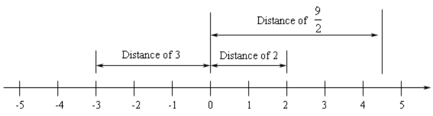

# 2.14 Absolute Value Equations

**Geometric Definition**

In this definition we are going to think of $|p|$ as the distance of $p$ from
the origin on a number line. Also, we will always use a positive value for
distance. Consider the following number line.

From this we can get the following values of absolute value.

$$ |2| = 2 $$

$$ |-3| = 3 $$

$$ |\frac{9}{2}| = \frac{9}{2} $$

All taht we need to do is identify the point on the number line and determin its
distance from the origin. Note as well that we also have $|0| = 0$.

**Mathematical Definition**

We can also give a strict mathematical/formula definition for absolute value. It
is,

$$
|p| =
\begin{cases}
p & \text{if } p \geq 0 \\
-p & \text{if } p < 0
\end{cases}
$$

This tells us to look at the sign of $p$ and if it's positive we just drop the
absolute value bar. If $p$ is negative we drop the absolute value bars and then
put a negative in front of it.

So let's see a couple of quick examples.

$$ |4| = 4 \text{ because } 4 \geq 0 $$

$$ |-8| = -(-8) = 8 \text{ because } -8 < 0 $$

$$ |0| = 0 \text{ because } 0 \geq 0 $$

Note that these give exactly the same value as if we'd used the geometric
interpretation.

One way to think of absolute value is that it takes a number and makes it
positive. In fact, we can gaurantee that,

$$ |p| \geq 0 $$

regardless of the value of $p$.

We do need to be careful however to not misuse either of these definitions. For
example, we can't use the definition on

$$ |-x| $$

because we don't tknow the value of $x$.

Also, don't make the mistake of assuming that absolute value just makes all
miknus signs into plus signs. In other words, don't make the following mistake,

$$ |4x - 3| \neq 4x + 3 $$

This just isn't true! If you aren't sure that you believe that then plug in a
number for $x$. For example, if $x = -1$ we would get,

$$ 7 = |-7| = |4(-1) - 3| \neq 4(-1) + 3 = -1 $$

There are a couple of problems with this. First, the numbers are clearly not the
same and so that's all we really need to prove that the two expressions aren't
the same. There is also the fact however that the right number is negative and
we will never get a negative value out of an absolute value! That also will
guranatee that these two expressions aren't the same.

The definitions above are easy to apply if all we've got are numbers inside the
absolute value bars. However, once we put variables inside them we've got to
start being very careful.

It's now time to start thinking about how to solve equations that contain
absolute values. Let's start off fairly simple and look at the following
equation.

$$ |p| = 4 $$

Now, if we think of this from a geometric point of view this means that whatever
$p$ is it must have a distance of $4$ from the origin. Well there are only two
numbers that have a distnace of $4$ from the origin, namely $4$ and $-4$. So,
there are two solutions to this equation,

$$ p = -4 \text{ or } p = 4 $$

Now, if you think about it we can do this for any positive number, not just $4$.
So, this leads to the following general formula for equations involving absolute
value.

$$ \text{If } |p| = b, b > 0 \text{ then } p = -b \text{ or } p = b $$

Notice that this does <b>require</b> the $b$ to be a positive number. We will
deal with what happens if $b$ is zero or negative in a bit.

Let's take a look at some examples.

---

**Example 1**

Solve each of the following.

**(a)**

$$ |2x - 5| = 9 $$

$$ 2x - 5 = 9 \text{ or } 2x - 5 = -9 $$

$$ 2x = 14 \text{ or } 2x = -4 $$

$$ x = 7 \text{ or } x = -2 $$

$$ x = \{-2, 7\} $$

**(b)**

$$ |1 - 3t| = 20 $$

$$ 1 - 3t = 20 \text{ or } 1 - 3t = -20 $$

$$ -3t = 19 \text{ or } -3t = -21 $$

$$ t = -\frac{19}{3} \text{ or } t = 7 $$

$$ t = \left\{-\frac{19}{3}, 7\right\} $$

**(c\)**

$$ |5y - 8| = 1 $$

$$ 5y - 8 = 1 \text{ or } 5y - 8 = -1 $$

$$ 5y = 9 \text{ or } 5y = 7 $$

$$ y = \frac{9}{5} \text{ or } y = \frac{7}{5} $$

$$ y = \left\{\frac{9}{5}, \frac{7}{5}\right\} $$

---

Now let's take a look at how to deal with equations for which $b$ is zero or
negative. We'll do this with an example.

---

**Example 2**

Solve each of the following.

**(a)**

$$ |10x - 3| = 0 $$

$$ 10x - 3 = 0 $$

$$ 10x = 3 $$

$$ x = \frac{3}{10} $$

$$ x = \left\{\frac{3}{10}\right\} $$

**(b)**

$$ |5x + 9| = -3 $$

$$ \emptyset $$

---

So, summarizing we can see that if $b$ is zero then we can just drop the
absolute value bars and solve the equation. Likewise, if $b$ is negative then
there will be no solution to the equation.

To this point we've only looked at equations that involve an absolute value
being equal to a number, but there is no reason to think that there has to only
be a number on the other side of the equal sign. Likewise, there is no reason to
think that we can only have one absolute value in the problem. So, we need to
take a look at a couple of these kinds of equations.

---

**Example 3**

Solve each of the following.

**(a)**

$$ |x - 2| = 3x + 1 $$

$$ x - 2 = -(3x + 1) \text{ or } x - 2 = 3x + 1 $$

$$ 4x = 1  \text{ or } -2x = 3 $$

$$ x = \frac{1}{4} \text{ or } x = -\frac{3}{2} $$

But if we double check our negative solution:

$$ \left|-\frac{3}{2} - 2\right| \stackrel{?}{=} 3\left(-\frac{3}{2}\right) + 1 $$

$$ \left|-\frac{7}{2}\right| \stackrel{?}{=} -\frac{7}{2} $$

$$ \frac{7}{2} \neq -\frac{7}{2} $$

Therefore our only remaining solution is:

$$ x = \left\{\frac{1}{4}\right\} $$

**(b)**

$$ |4x + 3| = 3 - x $$

$$ 4x + 3 = 3 - x \text{ or } 4x + 3 = -(3 - x) $$

$$ 5x = 0 \text{ or } 3x = -6  $$

$$ x = 0 \text{ or } x = -2 $$

Note that we do not need to check our solution here. We only exclude a potential
solution if it makes the portion <em>without absolute value bars negative</em>.

$$ x = \{0, -2\} $$

**(c\)**

$$ |2x - 1| = |4x + 9| $$

$$ 2x - 1 = -(4x + 9) = -4x - 9 \text{ or } 2x - 1 = 4x + 9 $$

$$ 6x = -8 \text{ or } -2x = 10 $$

$$ x = -\frac{8}{6} = -\frac{4}{3} \text{ or } x = -5 $$

---

## Practice Problems

---

For problems 1 - 5 solve each of the equation.

**1.**

$$ |4p - 7| = 3 $$

$$ 4p - 7 = 3 \text{ or } 4p - 7 = -(3) $$

$$ 4p = 10 \text{ or } 4p = 4 $$

$$ p = \frac{10}{4} = \frac{5}{2} \text{ or } p = 1 $$

$$ p = \left\{\frac{5}{2}, 1\right\} $$

**2.**

$$ |2 - 4x| = 1 $$

$$ 2 - 4x = 1 \text{ or } 2 - 4x = -(1) $$

$$ -4x = -1 \text{ or } -4x = -3 $$

$$ x = \frac{1}{4} \text{ or } x = \frac{3}{4} $$

$$ x = \left\{\frac{1}{4}, \frac{3}{4}\right\} $$

**3.**

$$ 6u = |1 + 3u| $$

$$ -(6u) = 1 + 3u \text{ or } 6u = 1 + 3u $$

$$ -1 = 9u \text{ or } -1 = -3u $$

$$ -\frac{1}{9} = u \text{ or } \frac{1}{3} = u $$

$$ 6\left(-\frac{1}{9}\right) \stackrel{?}{=} \left|1 + 3\left(-\frac{1}{9}\right)\right| $$

$$ -\frac{2}{3} \stackrel{?}{=} \left|\frac{2}{3}\right| $$

$$ -\frac{2}{3} \neq \frac{2}{3} $$

$$ u = \left\{\frac{1}{3}\right\} $$

)

**4.**

$$ |2x - 3| = 4 - x $$

$$ 2x - 3 = 4 - x \text{ or } 2x - 3 = -(4 - x) $$

$$ 2x - 3 = 4 - x \text{ or } 2x - 3 = -4 + x $$

$$ 3x = 7 \text{ or } x = -1 $$

$$ x = \frac{7}{3} \text{ or } x = -1 $$

$$ |2(-1) - 3| \stackrel{?}{=} 4 - (-1) $$

$$ |-2 - 3| \stackrel{?}{=} 4 + 1 $$

$$ |-5| \stackrel{?}{=} 5 $$

$$ 5 = 5 $$

$$ x = \left\{-1, \frac{7}{3}\right\} $$

**5.**

$$ \left|\frac{1}{2}z + 4\right| = |4z - 6| $$

$$ \frac{1}{2}z + 4 = 4z - 6 \text{ or } \frac{1}{2}z + 4 = -(4z - 6) $$

$$ \frac{1}{2}z + 4 = 4z - 6 \text{ or } \frac{1}{2}z + 4 = 6 - 4z $$

$$ -\frac{7}{2}z = -10 \text{ or } \frac{9}{2}z = 2 $$

$$ z = \frac{20}{7} \text{ or } z = \frac{4}{9} $$

$$ z = \left\{\frac{20}{7}, \frac{4}{9}\right\} $$

---

For problems 6 & 7 find all the real valued solutions to the equation.

**6.**

$$ |x^2 + 2x| = 15 $$

$$ x^2 + 2x = 15 \text{ or } x^2 + 2x = -(15) $$

$$ x^2 + 2x - 15 = 0 \text{ or } x^2 + 2x + 15 = 0 $$

$$ (x + 5)(x - 3) = 0 \text{ or } x = \frac{-(2) \pm \sqrt{(2)^2 - 4(1)(15)}}{2(1)} = \frac{-2 \pm \sqrt{56}i}{2} $$

$$ x = \{-5, 3\} $$

**7.**

$$ |x^2 + 4| = 1 $$

$$ x^2 + 4 = 1 \text{ or } x^2 + 4 = -1 $$

$$ x^2 = -3 \text{ or } x^2 = -5 $$

$$ \emptyset $$

---

## Assignment Problems

---

For problems 1 - 10 solve each of the equation.

**1.**

$$ |2x + 9| = 7 $$

$$ 2x + 9 = 7 \text{ or } 2x + 9 = -7 $$

$$ 2x = -2 \text{ or } 2x = -16 $$

$$ x = -1 \text{ or } x = -8 $$

$$ x = \{-1, -8\} $$

**2.**

$$ |5w - 2| = 3 $$

$$ 5w - 2 = 3 \text{ or } 5w - 2 = -3 $$

$$ 5w = 5 \text{ or } 5w = -1 $$

$$ w = 1 \text{ or } w = -\frac{1}{5} $$

$$ w = \left\{1, -\frac{1}{5}\right\} $$

**3.**

$$ |6 - 7t| = 10 $$

$$ 6 - 7t = 10 \text{ or } 6 - 7t = -10 $$

$$ -7t = 4 \text{ or } -7t = -16 $$

$$ t = -\frac{4}{7} \text{ or } t = \frac{16}{7} $$

$$ t = \left\{-\frac{4}{7}, \frac{16}{7}\right\} $$

**4.**

$$ 2 = \left|\frac{1}{4}m - \frac{1}{3}\right| $$

$$ 2 = \frac{1}{4}m - \frac{1}{3} \text{ or } -2 = \frac{1}{4}m - \frac{1}{3} $$

$$ \frac{7}{3} = \frac{1}{4}m \text{ or } -\frac{5}{3} = \frac{1}{4}m $$

$$ \frac{28}{3} = m \text{ or } -\frac{20}{3} = m $$

$$ m = \left\{\frac{28}{3}, -\frac{20}{3}\right\} $$

**5.**

$$ |8u + 9| = 9 $$

$$ 8u + 9 = 9 \text{ or } 8u + 9 = -9 $$

$$ 8u = 0 \text{ or } 8u = -18 $$

$$ u = 0 \text{ or } u = -\frac{9}{4} $$

$$ u = \left\{0, -\frac{9}{4}\right\} $$

**6.**

$$ |x + 3| = 4x + 1 $$

$$ x + 3 = 4x + 1 \text{ or } x + 3 = -(4x + 1) $$

$$ x + 3 = 4x + 1 \text{ or } x + 3 = -4x - 1 $$

$$ 2 = 3x \text{ or } 5x = -4 $$

$$ \frac{2}{3} = x \text{ or } x = -\frac{4}{5} $$

$$ \left|-\frac{4}{5} + 3\right| \stackrel{?}{=} 4\left(-\frac{4}{5}\right) + 1 $$

$$ \left|\frac{11}{5}\right| \stackrel{?}{=} -\frac{11}{5}$$

$$ \frac{11}{5} \neq -\frac{11}{5} $$

$$ x = \left\{\frac{2}{3}\right\}$$

**7.**

$$ |2z - 7| = 3z - 10 $$

$$ 2z - 7 = 3z - 10 \text{ or } 2z - 7 = -(3z - 10) $$

$$ 2z - 7 = 3z - 10 \text{ or } 2z - 7 = -3z + 10 $$

$$ 3 = z \text{ or } z = \frac{17}{5} $$

$$ z = \left\{3, \frac{17}{5}\right\} $$

**8.**

$$ |3y + 9| = 10 - y $$

$$ 3y + 9 = 10 - y \text{ or } 3y + 9 = -(10 - y) $$

$$ 3y + 9 = 10 - y \text{ or } 3y + 9 = -10 + y $$

$$ 4y = 1 \text{ or } 2y = -19 $$

$$ y = \frac{1}{4} \text{ or } y = -\frac{19}{2} $$

$$ \left|3\left(-\frac{19}{2}\right) + 9\right| \stackrel{?}{=} 10 - \left(-\frac{19}{2}\right) $$

$$ \left|-\frac{39}{2}\right| \stackrel{?}{=} \frac{39}{2} $$

$$ \frac{39}{2} = \frac{39}{2} $$

$$ y = \left\{\frac{1}{4}, -\frac{19}{2}\right\} $$

**9.**

$$ |6w + 12| = 1 + w $$

$$ 6w + 12 = 1 + w \text{ or } 6w + 12 = -(1 + w) $$

$$ 6w + 12 = 1 + w \text{ or } 6w + 12 = -1 - w $$

$$ 5w = -11 \text{ or } 7w = -13 $$

$$ w = -\frac{11}{5} \text{ or } w = -\frac{13}{7} $$

$$ \left|6\left(-\frac{11}{5}\right) + 12\right| \stackrel{?}{=} 1 + \left(-\frac{11}{5}\right) $$

$$ \left|-\frac{6}{5}\right| \stackrel{?}{=} -\frac{6}{5} $$

$$ \frac{6}{5} \neq -\frac{6}{5} $$

$$ \left|6\left(-\frac{13}{7}\right) + 12\right| \stackrel{?}{=} 1 + \left(-\frac{13}{7}\right) $$

$$ \left|\frac{6}{7}\right| = -\frac{6}{7}$$

$$ \frac{6}{7} \neq -\frac{6}{7} $$

$$ \emptyset $$

**10.**

$$ |8x + 3| = 0 $$

$$ 8x + 3 = 0 $$

$$ 8x = -3 $$

$$ x = -\frac{3}{8} $$

$$ x = \left\{-\frac{3}{8}\right\} $$

---

For problems 11 - 13 find all the real valued solutions to the equation.

**11.**

$$ |x^2 + 1| = -4 $$

$$ x^2 + 1 = -4 \text{ or } x^2 + 1 = -(-4) $$

$$ x^2 + 1 = -4 \text{ or } x^2 + 1 = 4 $$

$$ x^2 = -5 \text { or } x^2 = 3 $$

$$ x = \sqrt{-5} \text{ or } x = \sqrt{3} $$

$$ \left|\left(\sqrt{3}\right)^2 + 1\right| \stackrel{?}{=} -4 $$

$$ |3 + 1| \stackrel{?}{=} -4 $$

$$ 4 \neq -4 $$

$$ \emptyset $$

**12.**

$$ |u^2 - 7u| = 12 $$

$$ u^2 - 7u = 12 \text{ or } u^2 - 7u = -12 $$

$$ u^2 - 7u - 12 = 0 \text{ or } u^2 - 7u + 12 = 0 $$

$$ u = \frac{-(-7) \pm \sqrt{(-7)^2 - 4(1)(-12)}}{2(1)}  \text{ or } (u - 3)(u - 4) = 0 $$

$$ u = \frac{7 \pm \sqrt{97}}{2} \text{ or } u = 3, u = 4 $$

$$ u = \frac{7 + \sqrt{97}}{2} = 8.4244  \text{ or } u = 3, u = 4 $$

$$ u = \frac{7 - \sqrt{97}}{2} = -1.4244 \text{ or } u = 3, u = 4 $$

$$ u = \{8.4244, -1.4244, 3, 4\} $$

**13.**

$$ |z^2 - 6| = z $$

$$ z^2 - 6 = z \text{ or } z^2 - 6 = -z $$

$$ z^2 - z - 6 = 0 \text{ or } z^2 + z - 6 = 0 $$

$$ (z + 2)(z - 3) = 0 \text{ or } (z - 2)(z + 3) = 0$$

$$ z = -2, z = 3, z = 2, z = -3 $$

$$ |(-2)^2 - 6| \stackrel{?}{=} -2 $$

$$ |4 - 6| \stackrel{?}{=} -2 $$

$$ |-2| \stackrel{?}{=} -2 $$

$$ 2 \neq -2 $$

$$ |(-3)^2 - 6| \stackrel{?}{=} -3 $$

$$ |9 - 6| \stackrel{?}{=} -3 $$

$$ |3| \stackrel{?}{=} -3 $$

$$ 3 \neq -3 $$

$$ z = \{2, 3\} $$
