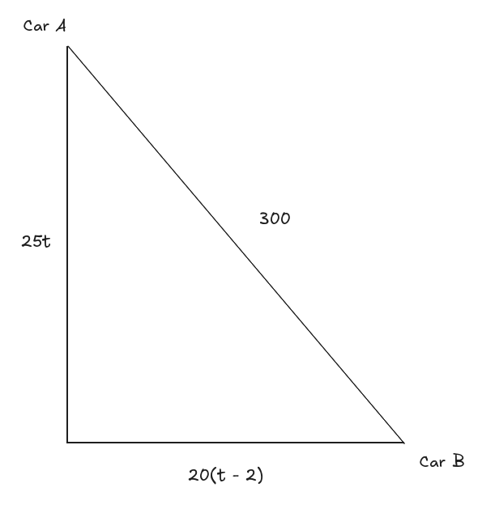

# 2.8 Applications Of Quadratic Equations

---

**Example 1**

> We are going to fence in a rectangular field and we know that for some reason
> we want the field to have an enclosed area of 75 ft2. We also know
> that we want the width of the field to be 3 feet longer than the length of the
> field. What are the dimensions of the field?

Let $x$ be the length of the field and so we know that $x + 3$ will be the width
of the field.

$$ \text{AREA} = \text{LENGTH} \times \text{WIDTH} $$

$$ ax^2 + bx + c = 0 $$

$$ x(x + 3) = 75 $$

$$ x^2 + 3x - 75 = 0 $$

$$ a = 1 $$

$$ b = 3 $$

$$ c = -75 $$

$$ x = \frac{-(3) \pm \sqrt{(3)^2 - 4(1)(-75)}}{2(1)} $$

$$ x = \frac{-3 \pm \sqrt{309}}{2} $$

$$ x = \frac{-3 + \sqrt{309}}{2} = 7.2892 $$

$$ x = \frac{-3 - \sqrt{309}}{2} = -10.2892 $$

A negative solution cannot apply in the context of the problem, thusly the
length of the field is 7.2892 feet. The width is 10.2892 feet.

---

**Example 2**

> Two cars start out at the same point. One car starts out driving north at 25
> mph. Two hours later the second car starts driving east at 20 mph. How long
> after the first car starts traveling does it take for the two cars to be 300
> miles apart?

Let $t$ be the amount of time that the first car (car $A$) travels. Since the
second car (car $B$), starts out two hours later, then we know tha 5it will
travel for $t - 2$ hours.

Now, we know that the distance traveled by an object is its speed times time
traveled. So we have the following distances travelbed for each car.

$$ \text{distance of car A: } 25t $$

$$ \text{distance of car B: } 20(t - 2) $$

At this point a quick sketch of the situation is probably in order so we can see
just what is going on. In the sketch we will assume that the two cars have
traveled long enough so that they are 300 miles apart.

We have a right triangle here. That means we can use the Pythagorean Theorem:

$$ (25t)^2 + (20(t - 2))^2 = (300)^2 $$

This is a quadratic equation, but it is going to need some fairly heavy
simplification before we can solve it so let's do that.

$$ 652t^2 + (20t - 40)^2 = 90000 $$

$$ 625t^2 + 400t^2 - 1600 = 90000 $$

$$ 1025t^2 - 1600t - 88400 = 0 $$

Now, the coefficients here are quite large, but that is just something that will
happen fairly often with these problems do don't worry about that. Using the
quadratic formula (and simplifying that answer) gives,

$$ t = \frac{-(-1600) \pm \sqrt{(-1600)^2 - 4(1025)(-88400)}}{2(1025)} $$

$$ t = \frac{1600 \pm \sqrt{365000000}}{2050} $$

$$ t = \frac{1600 \pm 1000\sqrt{365}}{2050} $$

$$ t = \frac{32 \pm 20\sqrt{365}}{41} $$

$$ t = \frac{32 + 20\sqrt{365}}{41} = 10.09998 $$

$$ t = \frac{32 - 20\sqrt{365}}{41} = -8.539011 $$

As with the previous example the negative answer just doesn't make any sense.
So, it looks like the car $A$ traveled for $10.09998$ hours when they were
finally $300$ miles apart. The second car will have traveled $8.09998$ hours
before they are $300$ miles apart.

---

**Example 3**

> An office has two envelope stuffing machines. Working together they can stuff
> a batch of envelopes in 2 hours. Working separately, it will take the second
> machine 1 hour longer than the first machine to stuff a batch of envelopes.
> How long would it take each machine to stuff a batch of envelopes by
> themselves?

Let $t$ be the amount of hours it takes for Machine $A$ to stuff a batch of
envelopes. Make $t + 1$ the amount of hours it takes for Machine $B$ to stuff a
batch of envelopes.

$$ (\text{Work Rate of Machine A})(\text{Time Spent Working}) + (\text{Work Rate of Machine B})(\text{Time Spent Working}) = 1 $$

Within a single hour, Machine $A$ works at the rate of $\frac{1}{t}$. Within a
single hour, Machine $B$ works at the rate of $\frac{1}{t + 1}$. The total
amount spent working is 2 hours.

$$ \left(\frac{1}{t}\right)(2) + \left(\frac{1}{t + 1}\right)(2) = 1 $$

$$ \frac{2}{t} + \frac{2}{t + 1} = 1 $$

$$ LCD = (t)(t + 1) $$

$$ (t)(t + 1)\left(\frac{2}{t} + \frac{2}{t + 1}\right) = (1)(t)(t + 1) $$

$$ 2(t + 1) + 2t = t^2 + t $$

$$ 2t + 2 + 2t = t^2 + t $$

$$ 0 = t^2 - 3t - 2 $$

$$ t = \frac{-(-3) \pm \sqrt{(-3)^2 - 4(1)(-2)}}{2(1)} $$

$$ t = \frac{-3 \pm \sqrt{17}}{2} $$

$$ t = \frac{-3 + \sqrt{17}}{2} = 3.5616 $$

$$ t = \frac{-3 - \sqrt{17}}{2} = -0.5616 $$

Once again, the negative makes no sense in the context of the problem. Thusly
Machine A will work for 3.5616 hours to stuff a batch of envelopes by itself,
while Machine B will need 4.5616 hours to stuff a batch of envelopes by itself.

---

## Practice Problems

**1.**

> The width of a rectangle is 1 m less than twice the length. If the area of the
> rectangle is 100 m2 what are the dimensions of the rectangle?

Let $x$ be the length of the rectangle. Let $2x - 1$ be the width of the
rectangle.

$$ \text{AREA} = \text{LENGTH} \times \text{WIDTH} $$

$$ x(2x - 1) = 100 $$

$$ 2x^2 - x = 100 $$

$$ 2x^2 - x - 100 = 0 $$

$$ x = \frac{-(-1) \pm \sqrt{(-1)^2 - 4(2)(-100)}}{2(2)} $$

$$ x = \frac{1 \pm \sqrt{801}}{4} $$

$$ x = \frac{1 \pm 3\sqrt{89}}{4} $$

$$ x = \frac{1 + 3\sqrt{89}}{4} = 7.3254 $$

$$ x = \frac{1 - 3\sqrt{89}}{4} = -6.825 $$

The negative makes no sense in the context of the problem statement, so the
length of our rectangle is $7.3254m$ and the width of our rectangle is
$13.6508m$.

**2.**

> Two cars start out at the same spot. One car starts to drive north at 40 mph
> and 3 hours later the second car starts driving to the east at 60 mph. How
> long after the first car starts driving does it take for the two cars to be
> 500 miles apart?

Let $t$ be the amount of hours after Car A starts driving that both Car A and
Car B are 500 miles apart.

$$ \text{distance of car A: } 40t $$

$$ \text{distance of car B: } 60(t - 3) $$

As before we can utilize the Pythagorean Theorem to solve this:

$$ a^2 + b^2 = c^2 $$

$$ (40t)^2 + (60(t - 3))^2 = (500)^2 $$

$$ 1600t^2 + 3600(t - 3)^2 = 250000 $$

$$ 1600t^2 + 3600(t - 3)(t - 3) = 250000 $$

$$ 1600t^2 + 3600(t^2 - 6t + 9) = 250000 $$

$$ 1600t^2 + 3600t^2 - 21600t + 32400 = 250000 $$

$$ 1600t^2 + 3600t^2 - 21600t + 32400 - 250000 = 0 $$

$$ 5200t^2 - 21600t - 217600 = 0 $$

$$ t = \frac{-(-21600) \pm \sqrt{(-21600)^2 - 4(5200)(-217600)}}{2(5200)} $$

$$ t = \frac{21600 \pm \sqrt{4992640000}}{10400} $$

$$ t = \frac{21600 \pm 800\sqrt{7801}}{10400} $$

$$ t = \frac{21600 + 800\sqrt{7801}}{10400} = 8.8710 $$

$$ t = \frac{21600 - 800\sqrt{7801}}{10400} = -4.7172 $$

And again, the negative answer makes no sense in the context of the problem
statement. Thusly it will take car $A$ $8.871 \text{ hours}$ before the two cars
are $500$ miles apart, while it will take car $B$ $5.871 \text{hours}$ before
the two cars are $500$ miles apart..

**3.**

> Two people can paint a house in 14 hours. Working individually one of the
> people takes 2 hours more than it takes the other person to paint the house.
> How long would it take each person working individually to paint the house?

$$ (\text{Work Rate of Person A})(\text{Time Spent Working}) + (\text{Work Rate of Person B})(\text{Time Spent Working}) = 1 $$

Within a single hour, Person $A$ paints at the rate of $\frac{1}{t}$. Within a
single hour, Person $B$ works at the rate of $\frac{1}{t + 2}$. The total amount
spent working is 14 hours.

$$ \left(\frac{1}{t}\right)(14) + \left(\frac{1}{t + 2}\right)(14) = 1 $$

$$ \frac{14}{t} + \frac{14}{t + 2} = 1 $$

$$ LCD = (t)(t + 2) $$

$$ (t)(t + 2)\left(\frac{14}{t} + \frac{14}{t + 2}\right) = (1)(t)(t + 2) $$

$$ 14(t + 2) + 14t = t(t + 2) $$

$$ 14t + 28 + 14t = t^2 + 2t $$

$$ 0 = t^2 + 2t - 14t - 28 - 14t $$

$$ 0 = t^2 - 26t - 28 $$

$$ t^2 - 26t - 28 = 0 $$

$$ t = \frac{-(-26) \pm \sqrt{(-26)^2 - 4(1)(-28)}}{2(1)} $$

$$ t = \frac{26 \pm \sqrt{788}}{2} $$

$$ t = \frac{26 \pm 2\sqrt{197}}{2} $$

$$ t = 13 \pm \sqrt{197} $$

$$ t = 13 + \sqrt{197} = 27.0357 $$

$$ t = 13 - \sqrt{197}= -1.0357 $$

Once again ,the negative answer makes no sense, thusly we can say that Person
$A$ will take $27.0357 \text{ hours}$ to paint a house, while it will take
Person $B$ $29.0357 \text{ hours}$ to paint a house.

---

## Assignment Problems

**1.**

> The length of a rectangle is 4 feet more than the width. If the area of the
> rectangle is 136 ft2 what are the dimensions of the rectangle?

Let $w$ be the width of the rectangle. Let $w + 4$ be the length of the
rectangle.

$$ \text{AREA} = \text{LENGTH} \times \text{WIDTH} $$

$$ w(w + 4) = 136 $$

$$ w^2 + 4w = 136 $$

$$ w^2 + 4w - 136 = 0 $$

$$ w = \frac{-(4) \pm \sqrt{(4)^2 - 4(1)(-136)}}{2(1)} $$

$$ w = \frac{-4 \pm 4\sqrt{35}}{2} $$

$$ w = -2 \pm 2\sqrt{35} $$

$$ w = -2 + 2\sqrt{35}  = 9.8322 $$

$$ w = -2 - 2\sqrt{35} = -13.8322 $$

The negative result makes no sense given the problem statement. Thusly our width
our rectangle is $9.8322 \text{ feet}$ and our length of our rectangle is
$13.8322 \text{ feet}$.

**2.**

> The area of some rectangle is 35 in2. Four times the width of this
> rectangle is the same as 3 inches more than twice the length. What are the
> dimensions of the rectangle?

Let $L$ be the length of this rectangle. The width of this rectangle is
$\dfrac{2L + 3}{4}$. The area of this rectangle is $35$.

$$ \text{AREA} = \text{LENGTH} \times \text{WIDTH} $$

$$ L(\frac{2L + 3}{4}) = 35 $$

$$ \frac{2L^2 + 3L}{4} = 35 $$

$$ 2L^2 + 3L = 140 $$

$$ 2L^2 + 3L - 140 = 0 $$

$$ L = \frac{-(3) \pm \sqrt{(3)^2 - 4(2)(-140)}}{2(2)} $$

$$ L = \frac{-3 \pm \sqrt{1129}}{4} $$

$$ L = \frac{-3 + \sqrt{1129}}{4} = 7.6501 $$

$$ L = \frac{-3 - \sqrt{1129}}{4} = -9.1501 $$

The negative result makes no sense in the context of the problem statement.
Thusly the length of our rectangle is $7.6501 \text{ inches}$ and the width of
our rectangle is $4.5751 \text{ inches}$.

**3.**

> The area of a triangle is 28 m2 and the height of the triangle is 2
> meters less than 5 times the base. What are the height and base of this
> triangle?

Area of a standard triangle can be calculated as:

$$ \text{AREA} = \frac{1}{2} \times \text{BASE} \times \text{HEIGHT} $$

Let $b$ be the amount of meters the base of the triangle is. The height of the
triangle is $5b - 2$ meters. Therefore we can set up the following formula for
finding the value of our base, $b$.

$$ \frac{1}{2}(b)(5b - 2) = 28 $$

$$ \frac{1}{2}(5b^2 - 2b) = 28 $$

$$ \frac{5}{2}b^2 - b = 28 $$

$$ \frac{5}{2} - b - 28 = 0 $$

$$ b = \frac{-(-1) \pm \sqrt{(-1)^2 - 4\left(\dfrac{5}{2}\right)(-28)}}{2\left(\dfrac{5}{2}\right)} $$

$$ b = \frac{1 \pm \sqrt{281}}{5} $$

$$ b = \frac{1 + \sqrt{281}}{5} = 3.5526 $$

$$ b = \frac{1 - \sqrt{281}}{5} = -3.1526 $$

The negative result makes no sense in the context of the problem statement.
Thusly our base is $3.5526 \text{ meters}$, while our height is
$15.7630 \text{ meters}$

**4.**

> Two cars start out at the same spot. One car starts to drive north at 18 mph 5
> hours before the second car starts driving to the east at 32 mph. How long
> after the first car starts driving does it take for the two cars to be 350
> miles apart?

Let $t$ be the amount of hours after the first car(Car A) starts driving that it
takes for the two cars to be 350 miles apart. $t - 5$ represents the amount of
hours after the second car (Car B) starts driving that it takes for the two cars
to be 350 miles apart.

$$ \text{distance of car A: } 18t $$

$$ \text{distance of car B: } 32(t - 5) $$

Because the cars are travelling north and east, the angle at which they are
travelling creates a right triangle, thusly we can utilize the Pythagorean
Theorem to solve this:

$$ a^2 + b^2 = c^2 $$

$$ (18t)^2 + (32(t - 5))^2 = (350)^2 $$

$$ 324t^2 + 1024(t - 5)^2 = 122500 $$

$$ 324t^2 + 1024(t - 5)(t - 5) = 122500 $$

$$ 324t^2 + 1024(t^2 - 10t + 25) = 122500 $$

$$ 324t^2 + 1024t^2 - 10240t + 25600 = 122500 $$

$$ 324t^2 + 1024t^2 - 10240t + 25600 - 122500 = 0 $$

$$ 1348t^2 - 10240t - 96900 = 0 $$

$$ t = \frac{-(-10240) \pm \sqrt{(-10240)^2 - 4(1348)(-96900)}}{2(1348)} $$

$$ t = \frac{10240 \pm 40\sqrt{392089}}{2696} $$

$$ t = \frac{10240 + 40\sqrt{392089}}{2696} = 13.0886 $$

$$ t = \frac{10240 - 40\sqrt{392089}}{2696} = -5.4921 $$

The negative result makes no sense in the context of the problem statement.
Thusly the amount of hours after the first car(Car A) starts driving that it
takes for the two cars to be 350 miles apart is $13.0886 \text{ hours}$, while
$8.0886 \text{ hours}$ is the amount of hours after the second car (Car B)
starts driving that it takes for the two cars to be 350 miles apart.

**5.**

> Two cars start out at the same point and at the same time one starts driving
> north while the other starts driving east at a speed that is 4 mph faster than
> the car driving north. Twelve hours after the cars start driving they are 600
> miles apart. What was the speed of each car?

Let $s$ be the speed of Car A in miles per hour, and let $s + 4$ be the speed of
Car B in miles per hour.

$$ \text{distance of car A: } 12s $$

$$ \text{distance of car B: } 12(s + 4) $$

The two cars are traveling at a right angle, and thusly the Pythagorean Theorem
can be applied to solve this problem.

$$ a^2 + b^2 = c^2 $$

$$ (12s)^2 + (12(s + 4))^2 = (600)^2 $$

$$ 144s^2 + 144(s + 4)^2 = 360000 $$

$$ 144s^2 + 144(s + 4)(s + 4) = 360000 $$

$$ 144s^2 + 144(s^2 + 8s + 16) = 360000 $$

$$ 144s^2 + 144s^2 + 1152s + 2304 = 360000 $$

$$ 144s^2 + 144s^2 + 1152s + 2304 - 360000 = 0 $$

$$ 288s^2 + 1152s - 357696 = 0 $$

$$ s = \frac{-(1152) \pm \sqrt{(1152)^2 - 4(288)(-357696)}}{2(288)} $$

$$ s = \frac{-1152 \pm 576\sqrt{1246}}{576} $$

$$ s = -2 \pm \sqrt{1246} $$

$$ s = -2 + \sqrt{1246} = 33.2987 $$

$$ s = -2 - \sqrt{1246} = -37.2987 $$

The negative number makes no sense in the context of this problem statement.
Thusly the speed of car A is $33.2987 \text{ miles per hour}$, and the speed of
car B is $37.2987 \text{ miles per hour}$.

**6.**

> Two people can paint a house in 21 hours. Working individually one of the
> people can paint the house in 6 hours more than it takes the other person to
> paint the house. How long would it take each person working individually to
> paint the house?

$$ (\text{Work Rate of Person A})(\text{Time Spent Working}) + (\text{Work Rate of Person B})(\text{Time Spent Working}) = 1 \text{ Job} $$

Within a single hour, Person $A$ paints at the rate of $\frac{1}{t}$. Within a
single hour, Person $B$ works at the rate of $\frac{1}{t + 6}$. The total amount
spent working is 21 hours.

$$ \left(\frac{1}{t}\right)(21) + \left(\frac{1}{t + 6}\right)(21) = 1 $$

$$ \frac{21}{t} + \frac{21}{t + 6} = 1 $$

$$ LCD = (t)(t + 6) $$

$$ (t)(t + 6)\left(\frac{21}{t} + \frac{21}{t + 6}\right) = (1)(t)(t + 6) $$

$$ 21(t + 6) + 21(t) = t(t + 6) $$

$$ 21t + 126 + 21t = t^2 + 6t $$

$$ 0 = t^2 + 6t - 21t - 126 - 21t $$

$$ 0 = t^2 - 36t - 126 $$

$$ t^2 - 36t - 126 = 0 $$

$$ t = \frac{-(-36) \pm \sqrt{(-36)^2 - 4(1)(-126)}}{2(1)} $$

$$ t = \frac{36 \pm 30\sqrt{2}}{2} $$

$$ t = 18 \pm 15\sqrt{2} $$

$$ t = 18 + 15\sqrt{2} = 39.2132 $$

$$ t = 18 - 15\sqrt{2} = -3.2132 $$

The negative result makes no sense in the context of the problem statement.
Thusly $39.2132 \text{ hours}$ is the amount of time it would take Person A to
paint a house, while $45.2132 \text{ hours}$ is the amount of time it would take
Person B to paint a house.
