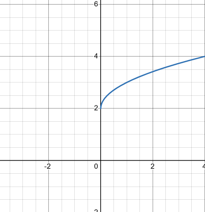

# 3.1 Graphing

---

**Example 1**

Sketch the graph of $y = (x - 1)^2 - 4$.

| x  | y  | (x, y)  |
| -- | -- | ------- |
| -2 | 5  | (-2, 5) |
| -1 | 0  | (-1, 0) |
| 0  | -3 | (0, -3) |
| 1  | -4 | (1, -4) |
| 2  | -3 | (2, -3) |
| 3  | 0  | (3, 0)  |
| 4  | 5  | (4, 5)  |

---

**Example 2**

Determine the $x$-intercepts and the $y$-intercepts for each of the following
equations.

**(a)**

$$ y = x^2 + x - 6 $$

Determine the $x$-intercept:

$$ 0 = x^2 + x - 6 $$

$$ 0 = (x + 3)(x - 2) $$

So there are 2 $x$-intercepts: $(-3, 0)$ and $(2, 0)$.

Determine the $y$-intercept:

$$ y = (0)^2 + 0 - 6 $$

$$ y = 0 + 0 - 6 $$

$$ y = -6 $$

So our $y$ intercept is $(0, -6)$.

**(b)**

$$ y = x^2 + 2 $$

Determine the $x$-intercept:

$$ 0 = x^2 + 2 $$

$$ -2 = x^2 $$

$$ \sqrt{-2} = \sqrt{x^2} $$

$$ \pm \sqrt{2}i = x $$

Complex numbers indicate that our graph does not cross the $x$-axis.

Determine the $y$-intercept:

$$ y = 0^2 + 2 $$

$$ y = 0 + 2 $$

$$ y = 2 $$

So our $y$-intercept is $(0, 2)$.

$$  $$

**(c\)**

$$ y = (x + 1)^2 $$

Determine the $x$-intercept:

$$ 0 = (x + 1)^2 $$

$$ 0 = (x + 1)(x + 1) $$

$$ x = -1 $$

So our $x$-intercept is $(-1, 0)$.

Determine the $y$-intercept:

$$ y = (0 + 1)^2 $$

$$ y = (1)^2 $$

$$ y = 1 $$

So our $y$-intercept is $(0, 1)$.

Note that the graph doesn't actually cross the $x$-axis at $x = -1$. This point
is still called an $x$-intercept however.

---

## Practice Problems

For problems 1 - 3 construct a table of at least 4 ordered pairs of points on
the graph of the equation and use the ordered pairs from the table to sketch the
graph of the equation.

**1.**

$$ y = 3x + 4 $$

| x               | y   | (x, y)                          |
| --------------- | --- | ------------------------------- |
| $-1$            | $1$ | $(-1, 1)$                       |
| $0$             | $4$ | $(0, 4)$                        |
| $-\dfrac{4}{3}$ | $0$ | $\left(-\dfrac{4}{3}, 0\right)$ |
| $-\dfrac{2}{3}$ | $2$ | $\left(-\dfrac{2}{3}, 2\right)$ |

**2.**

$$ y = 1 - x^2 $$

$$ -1 = 1 - x^2 $$

$$ -1 = -x^2 $$

$$ 1 = x^2 $$

$$ \pm \sqrt{1} = x $$

| x              | y    | (x, y)               |
| -------------- | ---- | -------------------- |
| $-1$           | $0$  | $(-1, 0)$            |
| $0$            | $1$  | $(0, 1)$             |
| $1$            | $0$  | $(1, 0)$             |
| $\pm \sqrt{1}$ | $-1$ | $(\pm \sqrt{1}, -1)$ |

**3.**

$$ y = 2 + \sqrt{x} $$

| x | y | (x, y) |
| - | - | ------ |
| 0 | 2 | (0, 2) |
| 1 | 3 | (1, 3) |
| 4 | 4 | (4, 4) |
| 9 | 5 | (9, 5) |

---

For problems 4 - 9 determine the $x$-intercepts and the $y$-intercepts for the
equation. Do not sketch the graph.

**4.**

$$ 3x - 7y = 10 $$

$$ 3(0) - 7y = 10 $$

$$ 0 - 7y = 10 $$

$$ -7y = 10 $$

$$ y = -\frac{10}{7} $$

$$ 3x - 7(0) = 10 $$

$$ 3x - 0 = 10 $$

$$ 3x = 10 $$

$$ x = \frac{10}{3} $$

$$ x-\text{intercept} = \left(\frac{10}{3}, 0\right) $$

$$ y-\text{intercept} = \left(0, -\frac{10}{7}\right) $$

**5.**

$$ y = 6 - x^2 $$

$$ 0 = 6 - x^2 $$

$$ -6 = -x^2 $$

$$ 6 = x^2 $$

$$ \pm \sqrt{6} = x $$

$$ y = 6 - (0)^2 $$

$$ y = 6 $$

$$ x-\text{intercepts} = \left(\sqrt{6}, 0\right) \text{ and } \left(-\sqrt{6}, 0\right) $$

$$ y-\text{intercept} = (0, 6) $$

**6.**

$$ y = x^2 + 6x - 7 $$

$$ 0 = x^2 + 6x - 7 $$

$$ 0 = (x + 7)(x - 1) $$

$$ y = (0)^2 + 6(0) - 7 $$

$$ y = -7 $$

$$ x-\text{intercepts} = (-7, 0) \text{ and } (1, 0) $$

$$ y-\text{intercept} = (0, -7) $$

**7.**

$$ y = x^2 + 10 $$

$$ 0 = x^2 + 10 $$

$$ -10 = x^2 $$

$$ \pm \sqrt{-10} = \sqrt{x^2} $$

$$ \pm \sqrt{10}i = x $$

$$ y = (0)^2 + 10 $$

$$ y = 10 $$

$$ x-\text{intercept} = \text{NONE} $$

$$ y-\text{intercept} = (0, 10) $$

**8.**

$$ y = x^2 + 6x + 58 $$

$$ 0 = x^2 + 6x + 58 $$

$$ x = \frac{-(6) \pm \sqrt{(6)^2 - 4(1)(58)}}{2(1)} $$

$$ x = \frac{-6 \pm 14i}{2} $$

$$ y = (0)^2 + 6(0) + 58 $$

$$ y = 58 $$

$$ x-\text{intercept} = \text{NONE} $$

$$ y-\text{intercept} = (0, 58) $$

**9.**

$$ y = (x + 3)^2 - 8 $$

$$ 0 = (x + 3)^2 - 8 $$

$$ 8 = (x + 3)^2 $$

$$ \pm \sqrt{8} = \sqrt{(x + 3)^2} $$

$$ \pm \sqrt{8} = x + 3 $$

$$ -3 \pm \sqrt{8} = x $$

$$ y = (0 + 3)^2 - 8 $$

$$ y = 3^2 - 8 $$

$$ y = 9 - 8 $$

$$ y = 1 $$

$$ x-\text{intercepts} = \left(-3 + \sqrt{8}, 0 \right) \text{ and } \left(-3 - \sqrt{8}, 0 \right) $$

$$ y-\text{intercept} = (0, 1) $$

---

## Assignment Problems

For problems 1 - 7 construct a table of at least 4 ordered pairs of points on
the graph of the equation and use the ordered pairs from the table to sketch the
graph of the equation.

**1.**

$$ y = \frac{1}{2}x + \frac{3}{2} $$

$$ -4 = \frac{1}{2}x + \frac{3}{2} $$

$$ -\frac{11}{2} = \frac{1}{2}x $$

| x     | y    | (x, y)     |
| ----- | ---- | ---------- |
| $1$   | $2$  | $(1, 2)$   |
| $-3$  | $0$  | $(-3, 0)$  |
| $-7$  | $-2$ | $(-7, -2)$ |
| $-11$ | $-4$ | $(-11, -4) |

**2.**

$$ y = 4 - x $$

| x    | y   | (x, y)    |
| ---- | --- | --------- |
| $0$  | $4$ | $(0, 4)$  |
| $-4$ | $8$ | $(-4, 8)$ |
| $2$  | $2$ | $(2, 2)$  |
| $4$  | $0$ | $(4, 0)$  |

**3.**

$$ y = 3x^2 $$

| x    | y    | (x, y)    |
| ---- | ---- | --------- |
| $0$  | $0$  | $(0, 0)$  |
| $1$  | $3$  | $(1, 3)$  |
| $-1$ | $3$  | $(-1, 3)$ |
| $2$  | $12$ | $(2, 12)$ |

**4.**

$$ y = (x + 3)^2 $$

| x  | y  | (x, y)  |
| -- | -- | ------- |
| 0  | 9  | (0, 9)  |
| -3 | 0  | (-3, 0) |
| 2  | 25 | (2, 25) |
| -2 | 1  | (-2, 1) |

**5.**

$$ y = \sqrt{x + 2} $$

| x    | y   | (x, y)    |
| ---- | --- | --------- |
| $-2$ | $0$ | $(-2, 0)$ |
| $2$  | $2$ | $(2, 2)$  |
| $7$  | $3$ | $(7, 3)$  |
| $14$ | $4$ | $(14, 4)$ |

**6.**

$$ y = |x| $$

| x    | y   | (x, y)    |
| ---- | --- | --------- |
| $-2$ | $2$ | $(-2, 2)$ |
| $0$  | $0$ | $(0, 0)$  |
| $2$  | $2$ | $(2, 2)$  |
| $3$  | $3$ | $(3, 3)$  |

**7.**

$$ y = x^3 $$

| x    | y    | (x, y)     |
| ---- | ---- | ---------- |
| $1$  | $1$  | $(1, 1)$   |
| $2$  | $8$  | $(2, 8)$   |
| $-2$ | $-8$ | $(-2, -8)$ |
| $-1$ | $-1$ | $(-1, -1)$ |

For problems 8 - 18 determine the $x$-intercepts and $y$-intercepts for the
equation. Do not sketch the graph.

**8.**

$$ y = \frac{7}{3}x + 2 $$

$$ 0 = \frac{7}{3}x + 2 $$

$$ -2 = \frac{7}{3}x $$

$$ -2\left(\frac{3}{7}\right) = x $$

$$ -\frac{6}{7} = x $$

$$ y = \frac{7}{3}(0) + 2 $$

$$ y = 0 + 2 $$

$$ y = 2 $$

$$ x-\text{intercept} = \left(-\frac{6}{7}, 0\right) $$

$$ y-\text{intercept} = (0, 2) $$

**9.**

$$ 6y + 11x = -2 $$

$$ 6(0) + 11x = -2 $$

$$ 11x = -2 $$

$$ x = -\frac{2}{11} $$

$$ 6y + 11(0) = -2 $$

$$ 6y = -2 $$

$$ y = -\frac{1}{3} $$

$$ x-\text{intercept} = \left(-\frac{2}{11}, 0\right) $$

$$ y-text{intercept} = \left(0, -\frac{1}{3}\right) $$

**10.**

$$ y = 10x^2 $$

$$ 0 = 10x^2 $$

$$ 0 = x^2 $$

$$ \sqrt{0} = \sqrt{x^2} $$

$$ 0 = x $$

$$ y = 10(0)^2 $$

$$ y = 10(0) $$

$$ y = 0 $$

$$ x-\text{intercept} = (0, 0) $$

$$ y-\text{intercept} = (0, 0) $$

**11.**

$$ y = x^2 - 10x + 25 $$

$$ 0 = x^2 - 10x + 25 $$

$$ 0 = (x - 5)(x - 5) $$

$$ x = 5 $$

$$ y = (0)^2 - 10(0) + 25 $$

$$ y = 0 - 0 + 25 $$

$$ y = 25 $$

$$ x-\text{intercept} = (5, 0) $$

$$ y-\text{intercept} = (0, 25) $$

**12.**

$$ y = 16x^2 - 8x + 17 $$

$$ 0 = 16x^2 - 8x + 17 $$

$$ x = \frac{-(-8) \pm \sqrt{(-8)^2 - 4(16)(17)}}{2(16)} $$

$$ x = \frac{8 \pm 32i}{32} $$

$$ x = \frac{1}{4} \pm i$$

$$ y = 16(0)^2 - 8(0) + 17 $$

$$ y = 16(0) - 0 + 17 $$

$$ y = 0 - 0 + 17 $$

$$ y = 17 $$

$$ x-\text{intercept} = \text{NONE} $$

$$ y-\text{intercept} = (0, 17) $$

**13.**

$$ y = -x^2 - 25x - 24 $$

$$ 0 = -x^2 - 25x - 24 $$

$$ -1(0) = -1(-x^2 - 25x - 24) $$

$$ 0 = x^2 + 25x + 24 $$

$$ 0 = (x + 24)(x + 1) $$

$$ y = -(0)^2 - 25(0) - 24 $$

$$ y = 0 - 0 - 24 $$

$$ y = -24 $$

$$ x-\text{intercepts} = (-24, 0) \text{ and } (-1, 0) $$

$$ y-\text{intercept} = (0, -24) $$

**14.**

$$ y = 2x^2 - 6x + 7 $$

$$ 0 = 2x^2 - 6x + 7 $$

$$ x = \frac{-(-6) \pm \sqrt{(-6)^2 - 4(2)(7)}}{2(2)} $$

$$ x = \frac{6 \pm 2\sqrt{5}i}{4} $$

$$ x = \frac{3}{2} \pm \frac{1}{2}\sqrt{5}i $$

$$ y = 2(0)^2 - 6(0) + 7 $$

$$ y = 0 - 0 + 7 $$

$$ y = 7 $$

$$ x-\text{intercept} = \text{NONE} $$

$$ y-\text{intercept} = (0, 7) $$

**15.**

$$ y = -4x^2 - 3 $$

$$ 0 = -4x^2 - 3 $$

$$ 3 = -4x^2 $$

$$ -\frac{3}{4} = x^2 $$

$$ \pm \sqrt{-\frac{3}{4}} = \sqrt{x^2} $$

$$ \pm \sqrt{\frac{3}{4}}i = x $$

$$ y = -4(0)^2 - 3 $$

$$ y = -4(0) - 3 $$

$$ y = 0 - 3 $$

$$ y = -3 $$

$$ x-\text{intercept} = \text{NONE} $$

$$ y-\text{intercept} = (0, -3) $$

**16.**

$$ y = 6x^3 + 48 $$

$$ 0 = 6x^3 + 48 $$

$$ -48 = 6x^3 $$

$$ -\frac{48}{6} = x^3 $$

$$ -8 = x^3 $$

$$ \sqrt[3]{-8} = \sqrt[3]{x^3} $$

$$ -2 = x $$

$$ y = 6(0)^3 + 48 $$

$$ y = 6(0) + 48 $$

$$ y = 0 + 48 $$

$$ y = 48 $$

$$ x-\text{intercept} = (-2, 0) $$

$$ y-\text{intercept} = (0, 48) $$

**17.**

$$ y = |x + 4| - 7 $$

$$ 0 = |x + 4| - 7 $$

$$ 7 = |x + 4| $$

$$ -7 = x + 4 \text{ or } 7 = x + 4 $$

$$ -11 = x \text{ or } 3 = x $$

$$ y = |0 + 4| - 7 $$

$$ y = |4| - 7 $$

$$ y = 4 - 7 $$

$$ y = -3 $$

$$ x-\text{intercepts} = (-11, 0) \text{ and } (3, 0) $$

$$ y-\text{intercept} = (0, -3) $$

**18.**

$$ y = 4 - \sqrt{x - 2} $$

$$ 0 = 4 - \sqrt{x - 2} $$

$$ -4 = -\sqrt{x - 2} $$

$$ -1(-4) = -1(-\sqrt{x - 2}) $$

$$ 4 = \sqrt{x - 2} $$

$$ 4^2 = (\sqrt{x - 2})^2 $$

$$ 16 = x - 2 $$

$$ 18 = x $$

$$ y = 4 - \sqrt{0 - 2} $$

$$ y = 4 - \sqrt{-2} $$

$$ y = 4 - \sqrt{2}i $$

$$ x-\text{intercept} = (18, 0) $$

$$ y-\text{intercept} = \text{NONE} $$
