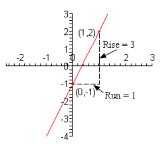
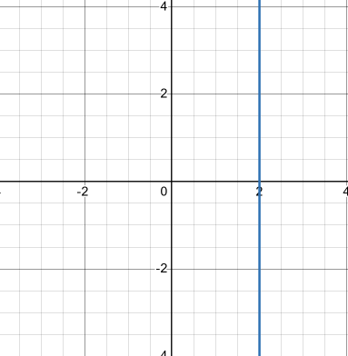

# 3.2 Lines

In mathematics, a _Line_ can be defined by the following formula:

$$ Ax + By = C $$

As long as _both_ $x$ and $y$ are not $0$.

Note that it is okay if $x$ is $0$ as long as $y$ is not $0$ and visa versa.

This is what is known as the **standard form** of the line.

One of the more important ideas that we'll be discussing in this section is that
of **slope**. The slope of a line is a measure of the _steepness_ of a line and
it can also be used to measure whether a line is increasing or decreasing as we
move from left to right. Here is the precise definition of the slope of the
line.

Give any two points on the line, say $(x_1, y_1)$ and $(x_2, y_2)$, the slope of
the line is given by,

$$ m = \frac{y_2 - y_1}{x_2 - x_1} $$

In other words, the slope is the difference in the $y$ values divided by the
difference in the $x$ values. Also, do not get worried about the subscripts on
the variables. These are used fairly regularly from this point on and are simply
used to denote the fact that the variables are both $x$ or $y$ values but are,
in all likelihood, different.

When using this definition do not worry about which point should be the first
point and which point should be the second point. You can choose either to be
the first and/or second and we'll get exactly the same value for the slope.

There is also a geometric "definition" of the slope of the line as well. You
will often hear the slope as being defined as follows,

$$ m = \frac{\text{rise}}{\text{run}} $$

The two definitions are identical as the following diagrams illustrates. The
numerators and denominators of both definitions are the same.

Note as well that if we have the slope (written as a fraction) and a pointo n
the line, say $(x_1, y_1)$, then we can easily find a second point that is also
on the line. Before seeing how this canb e done let's take the convention that
if the slope is negative we will put the minus sign on the numerator of the
slope. In other words, we will assume that the _rise_ is negative if the slope
is negative. Note as well that a neative _rise_ is really a _fall_.

So, we have the slope, written as a fraction, and a point on the line,
$(x_1, y_1)$. To get the coordinates of the second point, $(x_2, y_2)$ all that
we need to do is start at $(x_1, y_1)$ then move to the right by the _run_ (or
the denominator of the slope) and then up/down by _rise_ (or the numerator of
the slope) dependingo n the sign of the _rise_. We can also write down some
equations for the coordinates of the second point as follows,

$$ x_2 = x_1 + \text{run} $$

$$ y_2 = y_1 + \text{rise} $$

Note that if the slope is negative then the _rise_ will be a negative number.

Let's compute a couple of slopes.

---

**Example 1**

Determine the slope of each of the following lines. Sketch the graph of each
line.

**(a)**

The line that contains the two points $(-2, -3)$ and $(3, 1)$.

$$ m = \frac{1 - (-3)}{3 - (-2)} $$

$$ m = \frac{4}{5} $$

**(b)**

The line that contains the two points $(-1, 5)$ and $(0, -2)$.

$$ m = \frac{(-2) - 5}{0 - (-1)} $$

$$ m = \frac{-7}{1} $$

$$ m = -7 $$

**(c\)**

The line that contains the two points $(-3, 2)$ and $(5, 2)$.

$$ m = \frac{2 - 2}{5 - (-3)} $$

$$ m = \frac{0}{8} $$

$$ m = 0 $$

**(d)**

The line that contains the two points $(4, 3)$ and $(4, -2)$.

$$ m = \frac{(-2) - 3}{4 - 4} $$

$$ m = \frac{-5}{0} = \text{undefined}$$

---

We can use this set of examples to see some general facts about lines.

First, we can see from the first two parts that the larger the number (ignoring
any minus signs) the steeper the line. So, we can use the slope to tell us
something about just how steep a line is.

Next, we can see that if the slope is a positive number then the line will be
increasing as we move from left to right. Likewise, if the slope is a negative
number then the line will decrease as we move from left to right.

We can use the final two parts to see what the slopes of horizontal and vertical
lines will be. A horizontal line will always have a slope of zero and a vertical
line will alway shave an undefined scope.

We now need to take a look at some special forms of the equation of the line.

We will start off with horizontal and vertical lines. A horizontal line with a
$y$-intercept of $b$ will have the equation,

$$ y = b $$

Likewise, a vertical line with an $x$-intercept of $a$ will have the equation,

$$ x = a $$

So, if we go back and look at the last two parts of the previous examples we can
see that the equation of the line for the horizontal line in the third part is

$$ y = 2 $$

while the equation for the vertical line in the fourth part is

$$ x = 4 $$

The next special form of the line that we need to look at is the **point-slope
form** of the line. This form is very useful for writing down the equation of a
line. If we know that a line passes through the point $(x_1, y_1)$ and has a
slope of $m$ then the point-slope form of the equation of the line is,

$$ y - y_1 = m(x - x_1) $$

Sometimes this is written as,

$$ y = y_1 + m(x - x_1) $$

The form it's written in usually depends on the instructor that is teaching the
class.

As stated earlier this form is particularly useful for writing down the equation
of a line so let's take a look at an example of this.

---

**Example 2**

Write down the equation of the line that passes through two points $(-2, 4)$ and
$(3, -5)$.

First, let's determine the slope:

$$ m = \frac{-5 - 4}{3 - (-2)}  $$

$$ m = -\frac{9}{5} $$

Now, we can use either point to determine the equation of the line. We'll use
both to demonstrate:

First, let's use $(-2, 4)$.

$$ y = 4 - \frac{9}{5}(x - (-2)) $$

$$ yn = 4 - \frac{9}{5}(x + 2) $$

Now, let's use $(3, -5)$.

$$ y = -5 - \frac{9}{5}(x - 3) $$

These look different, but in reality they are the same equation. We simply need
to distribute the slope through the parenthesis and then simplify.

Here is the first equation using $(-2, 4)$:

$$ y = 4 - \frac{9}{5}(x + 2) $$

$$ y = 4 - \frac{9}{5}x - \frac{18}{5} $$

$$ y = -\frac{9}{5} + \frac{2}{5} $$

And the second equation using $(3, -5)$:

$$ y = -5 -\frac{9}{5}(x - 3)  $$

$$ y = -5 - \frac{9}{5}x + \frac{27}{5} $$

$$ y = -\frac{9}{5}x + \frac{2}{5} $$

And sure enough, they are the same equation.

---

The final special form of the equation of the line is probably the one that most
people are familiar with. It is the **slope-intercept form**. In this case if we
know that a line has slope $m$ and has a $y$-intercept of $(0, b)$ then the
slope-intercept form of the equation of the line is,

$$ y = mx + b $$

This form is particularly useful for graphing lines. Let's take a look at a
couple of examples.

---

**Example 3**

Determine the slope of each of the following equations and sketch the graph of
the line.

**(a)**

$$ 2y - 6x = -2 $$

$$ 2y = 6x - 2 $$

$$ y = \frac{6x - 2}{2} $$

$$ y = 3x - 1 $$

Thusly, the slope for this line is $3$ and the $y$-intercept is the point
$(0, -1)$. Don't forget to take the sign when determining the $y$-intercept.
Now, to find the second point we usually like the slope written as a fraction to
make it clear what the _rise_ and _run_ are. So,

$$ m = 3 = \frac{3}{1} = \frac{\text{rise}}{\text{run}} \Rightarrow \text{rise} = 3, \text{run} = 1 $$

The second point is then,

$$ x_2 = 0 + 1 = 1 $$

$$ y = -1 + 3 = 2 $$

$$ (1, 2) $$

Here is a sketch of the graph of the line.

**(b)**

$$ 3y + 4x = 6 $$

$$ 3y = -4x + 6 $$

$$ y = \frac{-4x + 6}{3} $$

$$ y = \frac{-4}{3}x + 2 $$

So the slope for this line is $-\frac{4}{3}$ and the $y$-intercept is the point
$(0, 2)$.

$$ m = \frac{-4}{3} = \frac{\text{rise}}{\text{run}} \Rightarrow \text{rise} = -4, \text{run} = 3 $$

$$ x_2 = 0 + 3 \text{ } y_2 = 2 + (-4) \Rightarrow (3, -2) $$

Here is a sketch of the graph for this line.

---

The final topic that we need to discuss in this section is that of parallel and
perpendicular lines. Here is a sketch of parallel and perpendicular lines.

Suppose that the slope of Line 1 is $m_1$ and the slope of Line 2 is $m_2$. We
can relate the slopes of parallel lines and we can relate slopes of
perpendicular lines as follows.

$$ \text{parallel: } m_1 = m_2 $$

$$ \text{perpendicular: } m_1m_2 = -1 \text{ or } m_2 = -\frac{1}{m_1}$$

Note that there are two forms of the equation for perpendicular lines. The
second is m ore common and in this case we usually say that $m_2$ is the
negative reciprocal of $m_2$.

---

**Example 4**

Determine if the line that passes through the points $(-2, -10)$ and $(6, -1)$
is parallel, perpendicular or neither to the line given by $7y - 9x = 15$.

We can determine this by using our two different methods for determining slope.
Recall:

$$ m = \frac{y_2 - y_1}{x_2 - x_1}  $$

And also:

$$ y = mx + b $$

Let's determine oru first slope, $m_1$:

$$ m_1 = \frac{-1 - (-10)}{6 - (-2)} = \frac{9}{8} $$

We don't need the equation of this line, so we won't bother figuring it out, we
just need to compare the two slopes. Let's find out the value of our second
slope, $m_2$:

$$ 7y - 9x = 15 $$

$$ 7y = 9x + 15 $$

$$ y = \frac{9x + 15}{7} $$

$$ y = \frac{9}{7}x + \frac{15}{7} $$

$$ m_2 = \frac{9}{7} $$

Since the rule for if two lines are parallel:

$$ \text{parallel: } m_1 = m_2 $$

$$ \frac{9}{8} \neq \frac{9}{7} $$

Is not followed here, we can determine that our two lines are not parallel. What
about perpendicular?

$$ \text{perpendicular: } m_1m_2 = -1 \text{ or } m_2 = -\frac{1}{m_1}$$

$$ m_2 = -\frac{1}{m_1} $$

$$ \frac{9}{7} \stackrel{?}{=} -\frac{1}{\dfrac{9}{8}} $$

$$ \frac{9}{7} \neq -\frac{8}{9} $$

Therefore, the two lines are neither parallel nor perpendicular.

---

**Example 5**

Determine the equation of the line that passes through the point $(8, 2)$ and
is,

**(a)**

parallel to the line given by $10y + 3x = -2$

The slope of this formula, represented by $m_2$ is:

$$ 10y + 3x = -2 $$

$$ 10y = -3x - 2 $$

$$ y = \frac{-3x - 2}{10} $$

$$ y = -\frac{3}{10}x - \frac{1}{5} $$

$$ m_2 = -\frac{3}{10} $$

Now we have the slope, we can place it into point-slope form of the line to
write down the equation of the line.

$$ y = y_1 + m(x - x_1) $$

$$ y = 2 + (-\frac{3}{10})(x - 8) $$

$$ y = 2 - \frac{3}{10}x + \frac{24}{10} $$

$$ y = -\frac{3}{10}x + \frac{44}{10} $$

$$ y = -\frac{3}{10}x + \frac{22}{5} $$

**(b)**

perpendicular to the line given by $10y + 3x = -2$.

Again, we can use the slope of this formula from before:

$$ m_2 = -\frac{3}{10} $$

To determine the formula of a line that runs perpendicular to it.

$$ \text{perpendicular: } m_1m_2 = -1 \text{ or } m_2 = -\frac{1}{m_1}$$

$$ m_2 = -\frac{1}{-\dfrac{3}{10}} = \frac{10}{3} $$

Now, just as before, we can plug this slope into our point-slope form:

$$ y = 2 + \frac{10}{3}(x - 8) $$

$$ y = 2 + \frac{10}{3}x - \frac{80}{3} $$

$$ y = \frac{10}{3}x + \frac{74}{3} $$

---

## Practice Problems

For problems 1 & 2 determine the slope of the line containing the two points and
sketch the graph of the line.

**1.**

$$ (-2, 4), (1, 10) $$

$$ m = \frac{y_2 - y_1}{x_2 - x_1}  $$

$$ m = \frac{10 - 4}{1 - (-2)}  $$

$$ m = \frac{6}{3} $$

$$ m = 2 $$

$$ y = y_1 + m(x - x_1) $$

$$ y = 4 + 2(x - (-2)) $$

**2.**

$$ (8, 2), (14, -7) $$

$$ m = \frac{y_2 - y_1}{x_2 - x_1}  $$

$$ m = \frac{-7 - 2}{14 - 8}  $$

$$ m = \frac{-9}{6} $$

$$ m = -\frac{3}{2} $$

$$ y = y_1 + m(x - x_1) $$

$$ y = 2 - \frac{3}{2}(x - 8) $$

For problems 3 - 5 write down the equation of the line that passes through the
two points. Give your answer in point-slope form and slope-intercept form.

$$ y = y_1 + m(x - x_1) $$

$$ y = mx + b $$

**3.**

$$ (-2, 4), (1, 10) $$

$$ m = \frac{10 - 4}{1 - (-2)} = \frac{6}{3} = 2 $$

$$ y = y_1 + m(x - x_1) $$

$$ y = 4 + 2(x - (-2)) $$

$$ y = 4 + 2x + 4 $$

$$ y = 2x + 8 $$

$$ y = mx + b $$

$$ 10 = 2(1) + b $$

$$ 10 = 2 + b $$

$$ 8 = b $$

$$ y = 2x + 8 $$

**4.**

$$ (8, 2), (14, -7) $$

$$ m = \frac{(-7) - 2}{14 - 8} = \frac{-9}{6} = -\frac{3}{2} $$

$$ y = y_1 + m(x - x_1) $$

$$ y = 2 - \frac{3}{2}(x - 8) $$

$$ y = 2 - \frac{3}{2}x + \frac{24}{2} $$

$$ y = -\frac{3}{2}x + \frac{28}{2} $$

$$ y = -\frac{3}{2}x + 14 $$

$$ y = mx + b $$

$$ -7 = -\frac{3}{2}(14) + b $$

$$ -7 = -21 + b $$

$$ 14 = b $$

$$ y = -\frac{3}{2}x + 14 $$

**5.**

$$ (-4, 8), (-1, -20) $$

$$ m = \frac{-20 - 8}{-1 - (-4)} = -\frac{28}{3} $$

$$ y = y_1 + m(x - x_1) $$

$$ y = -20 - \frac{28}{3}(x + 1) $$

$$ y = -20 - \frac{28}{3} x - \frac{28}{3} $$

$$ y = -\frac{28}{3}x - \frac{88}{3} $$

$$ y = mx + b $$

$$ -20 = -\frac{28}{3}(-1) + b $$

$$ -20 = \frac{28}{3} + b $$

$$ -20 - \frac{28}{3} = b $$

$$ -\frac{88}{3} = b $$

$$ y = -\frac{28}{3}x - \frac{88}{3} $$

For problems 6 & 7 determine the slope of the line and sketch the graph of the
line.

**6.**

$$ 4y + x = 8 $$

$$ 4y = -x + 8 $$

$$ y = \frac{-x + 8}{4} $$

$$ y = -\frac{1}{4}x + 2 $$

$$ m = -\frac{1}{4} $$

**7.**

$$ 5x - 2y = 6 $$

$$ -2y = -5x + 6 $$

$$ y = \frac{-5x + 6}{-2} $$

$$ y = \frac{5}{2}x - 3 $$

$$ m = \frac{5}{2} $$

For problems 8 & 9 determine if the two given lines are parallel, perpendicular
or neither.

$$ \text{parallel: } m_1 = m_2 $$

$$ \text{perpendicular: } m_1m_2 = -1 \text{ or } m_2 = -\frac{1}{m_1}$$

**8.**

$$ y = \frac{3}{7}x + 1 \text{ and } 3y + 7x = -10 $$

Let $m_1$ be the slope of the first line:

$$ m_1 = \frac{3}{7} $$

Let $m_2$ be the slope of the second line:

$$ 3y + 7x = -10 $$

$$ 3y = -7x - 10 $$

$$ y = \frac{-7x - 10}{3} $$

$$ y = -\frac{7}{3}x - \frac{10}{3} $$

$$ m_2 = -\frac{7}{3} $$

$$ \text{parallel: } m_1 = m_2 \text{ FALSE.} $$

$$ \text{perpendicular: } m_1m_2 = -1 \text{ or } m_2 = -\frac{1}{m_1}
\text{ TRUE} $$

The lines are perpendicular.

**9.**

$$ 8x - y = 2 \text{ and the line containing the two points } (1, 3) \text{ and } (2, -4) $$

Let $m_1$ be the slope of the first line.

$$ 8x - y = 2 $$

$$ -y = -8x + 2 $$

$$ y = 8x - 2 $$

$$ m_1 = 8 $$

Let $m_2$ be the slope of the second line.

$$ m = \frac{y_2 - y_1}{x_2 - x_1} $$

$$ m_2 = \frac{-4 - 3}{2 - 1} = \frac{-7}{1} = -7 $$

$$ \text{parallel: } m_1 = m_2 \text{ FALSE.} $$

$$ \text{perpendicular: } m_1m_2 = -1 \text{ or } m_2 = -\frac{1}{m_1}
\text{ FALSE} $$

The lines are neither parallel nor perpendicular.

**10.**

Find the equation of the line through $(-7, 2)$ and is parallel to the line
$3x - 14y = 4$.

$$ y = y_1 + m(x - x_1) $$

$$ \text{parallel: } m_1 = m_2 $$

$$ -14y = -3x + 4 $$

$$ y = \frac{-3x + 4}{-14} $$

$$ y = \frac{3}{14}x - \frac{2}{7} $$

$$ m, m_2 = \frac{3}{14} $$

$$ y = y_1 + m_2(x - x_1) $$

$$ y = 2 + \frac{3}{14}(x + 7) $$

$$ y = 2 + \frac{3}{14}x + \frac{3}{2} $$

$$ y = \frac{3}{14}x + \frac{7}{2} $$

**11.**

Find the equation of the line through $(-7, 2)$ and is perpendicular to the line
$3x - 14y = 4$.

$$ y = y_1 + m(x - x_1) $$

$$ \text{perpendicular: } m_1m_2 = -1 \text{ or } m_2 = -\frac{1}{m_1} $$

$$ m_2 = -\frac{14}{3} $$

$$ y = y_1 + m_2(x - x_1) $$

$$ y = 2 - \frac{14}{3}(x + 7)) $$

$$ y = 2 - \frac{14}{3}x - \frac{98}{3} $$

$$ y = -\frac{14}{3}x - \frac{92}{3} $$

---

## Assignment Problems

For problems 1 - 5 determine the slope of the line containing the two points and
sketch the graph of the line.

$$ y = y_1 + m(x - x_1) $$

**1.**

$$ (2, 10), (2, 14) $$

$$ m = \frac{14 - 10}{2 - 2} $$

$$ m = \frac{4}{0} = \text{undefined} $$

$$ x = 2 $$

**2.**

$$ (-6, 0), (-1, 3) $$

$$ m = \frac{3 - 0}{-1 - (-6)} $$

$$ m = \frac{3}{5} $$

$$ y = 0 + \frac{3}{5}(x + 6) $$

$$ y = \frac{3}{5}x + \frac{18}{5} $$

**3.**

$$ (2, 12), (6, 10) $$

$$ m = \frac{10 - 12}{6 - 2} $$

$$ m = -\frac{1}{2} $$

$$ y = 12 - \frac{1}{2}(x - 2) $$

$$ y = 12 - \frac{1}{2}x + 1 $$

$$ y = -\frac{1}{2}x + 13 $$

**4.**

$$ (-5, 7), (1, -11) $$

$$ m = \frac{-11 - 7}{1 - (-5)} $$

$$ m = -3 $$

$$ y = y_1 + m(x - x_1) $$

$$ y = 7 + -3(x + 5) $$

$$ y = 7 - 3x - 15 $$

$$ y = -3x - 8 $$

**5.**

$$ (-1, -6), (4, -6) $$

$$ m = \frac{-6 - (-6)}{4 - (-1)} $$

$$ m = \frac{0}{5} $$

$$ m = 0 $$

$$ y = -6 + 0(x + 1) $$

$$ y = -6 + 0 $$

$$ y = -6 $$

For problems 6 - 12 write down the equation of the line that passes through the
two points. Give your answer in point-slope form and slope-intercept form.

$$ y = y_1 + m(x - x_1) $$

$$ y = mx + b $$

**6.**

$$ (2, 10), (4, 14) $$

$$ m = \frac{14 - 10}{4 - 2} $$

$$ m = 2 $$

$$ y = y_1 + m(x - x_1) $$

$$ y = 10 + 2(x - 2) $$

$$ y = 10 + 2x - 4 $$

$$ y = 2x + 6 $$

$$ y = mx + b $$

$$ 10 = 2(2) + b $$

$$ 10 = 4 + b $$

$$ 6 = b $$

$$ y = 2x + 6 $$

**7.**

$$ (-6, 0), (-1, 3) $$

$$ m = \frac{y_2 - y_1}{x_2 - x_1} $$

$$ m = \frac{3 - 0}{-1 - (-6)} $$

$$ m = \frac{3}{5} $$

$$ y = y_1 + m(x - x_1) $$

$$ y = 0 + \frac{3}{5}(x + 6) $$

$$ y = \frac{3}{5}x + \frac{18}{5} $$

$$ y = mx + b $$

$$ 0 = \frac{3}{5}(-6) + b $$

$$ 0 = -\frac{18}{5} + b $$

$$ \frac{18}{5} = b $$

$$ y = \frac{3}{5}x + \frac{18}{5} $$

**8.**

$$ (2, 12), (6, 10) $$

$$ m = \frac{y_2 - y_1}{x_2 - x_1} $$

$$ m = \frac{10 - 12}{6 - 2} $$

$$ m = -\frac{1}{2} $$

$$ y = y_1 + m(x - x_1) $$

$$ y = 12 + -\frac{1}{2}(x - 2) $$

$$ y = 12 + -\frac{1}{2}x + 1 $$

$$ y = -\frac{1}{2}x + 13 $$

$$ y = mx + b $$

$$ 12 = -\frac{1}{2}(2) + b $$

$$ 12 = -1 + b $$

$$ 13 = b $$

$$ y = -\frac{1}{2}x + 13 $$

**9.**

$$ (-5, 7), (1, -11) $$

$$ m = \frac{y_2 - y_1}{x_2 - x_1} $$

$$ m = \frac{-11 - 7}{1 - (-5)} $$

$$ m = -3 $$

$$ y = y_1 + m(x - x_1) $$

$$ y = 7 - 3(x + 5) $$

$$ y = 7 - 3x - 15 $$

$$ y = -3x - 8 $$

$$ y = mx + b $$

$$ 7 = -3(-5) + b $$

$$ 7 = 15 + b $$

$$ -8 = b $$

$$ y = -3x - 8 $$

**10.**

$$ (-1, -6), (4, -6) $$

$$ m = \frac{y_2 - y_1}{x_2 - x_1} $$

$$ m = \frac{-6 - (-6)}{(4 - (-1)} $$

$$ m = \frac{0}{5} $$

$$ m = 0 $$

$$ y = y_1 + m(x - x_1) $$

$$ y = -6 + 0(x + 1) $$

$$ y = -6 + 0 $$

$$ y = -6 $$

$$ y = mx + b $$

$$ -6 = 0(-1) + b $$

$$ -6 = 0 + b $$

$$ -6 = b $$

$$ y = 0x + (-6) $$

$$ y = -6 $$

**11.**

$$ (0, 10), (4, 2) $$

$$ m = \frac{y_2 - y_1}{x_2 - x_1} $$

$$ m = \frac{2 - 10}{4 - 0} $$

$$ m = -2 $$

$$ y = y_1 + m(x - x_1) $$

$$ y = 10 - 2(x - 0) $$

$$ y = -2x + 10 $$

$$ y = mx + b $$

$$ 10 = (-2)(0) + b $$

$$ 10 = 0 + b $$

$$ 10 = b $$

$$ y = -2x + 10 $$

**12.**

$$ (-9, 2), (3, 24) $$

$$ m = \frac{y_2 - y_1}{x_2 - x_1} $$

$$ m = \frac{24 - 2}{3 - (-9)} $$

$$ m = \frac{11}{6} $$

$$ y = y_1 + m(x - x_1) $$

$$ y = 2 + \frac{11}{6}(x + 9) $$

$$ y = 2 + \frac{11}{6}x + \frac{33}{2} $$

$$ y = \frac{11}{6}x + \frac{37}{2} $$

$$ y = mx + b $$

$$ 2 = \frac{11}{6}(-9) + b $$

$$ 2 = -\frac{99}{6} + b $$

$$ 2 = -\frac{33}{2} + b $$

$$ 2 + \frac{33}{2} = b $$

$$ \frac{37}{2} = b $$

$$ y = \frac{11}{6}x + \frac{37}{2} $$

For problems 13 - 17 determine the slope of the line and sketch the graph of the
line.

**13.**

$$ 6x - y = 8 $$

$$ -y = -6x + 8 $$

$$ y = 6x - 8 $$

$$ m = 6 $$

**14.**

$$ y + 2x = -3 $$

$$ y = -2x - 3 $$

$$ m = -2 $$

**15.**

$$ 3x - y = 1 $$

$$ -y = -3x + 1 $$

$$ y = 3x - 1 $$

$$ m = 3 $$

**16.**

$$ 5y + 4x = 7 $$

$$ 5y = -4x + 7 $$

$$ y = \frac{-4x + 7}{5} $$

$$ y = -\frac{4}{5}x + \frac{7}{5} $$

$$ m = -\frac{4}{5} $$

**17.**

$$ 6y - 13x = -4 $$

$$ 6y = 13x - 4 $$

$$ y = \frac{13x - 4}{6} $$

$$ y = \frac{13}{6}x - \frac{2}{3} $$

$$ m = \frac{13}{6} $$

For problems 18 - 20 determine if the two given lines are parallel,
perpendicular or neither.

$$ \text{parallel: } m_1 = m_2 $$

$$ \text{perpendicular: } m_1m_2 = -1 \text{ or } m_2 = -\frac{1}{m_1} $$

**18.**

The line containing the two points $(0, 0), (3, 18)$ and the line containing the
two points $(-1, -5), (1, 7)$.

$$ m_1 = \frac{18 - 0}{3 - 0} $$

$$ m_1 = \frac{18}{3} $$

$$ m_1 = 6 $$

$$ m_2 = \frac{7 - (-5)}{1 - (-1)} $$

$$ m_2 = \frac{12}{2} $$

$$ m_2 = 6 $$

$$ \text{parallel: } m_1 = m_2 \text{ TRUE} $$

$$ \text{perpendicular: } m_1m_2 = -1 \text{ or } m_2 = -\frac{1}{m_1} \text{ FALSE} $$

The lines are parallel.

**19.**

$y - 4x = 9$ and $4y - x = -3$

$$ y - 4x = 9 $$

$$ y = 4x + 9 $$

$$ m_1 = 4 $$

$$ 4y - x = -3 $$

$$ 4y = x - 3 $$

$$ y = \frac{x - 3}{4} $$

$$ y = \frac{1}{4}x - \frac{3}{4} $$

a$ m_2 = \frac{1}{4} $$

$$ \text{parallel: } m_1 = m_2 \text{ FALSE} $$

$$ \text{perpendicular: } m_1m_2 = -1 \text{ or } m_2 = -\frac{1}{m_1} \text{ FALSE} $$

The lines are neither parallel nor perpendicular.

**20.**

$y = \dfrac{2}{3}x - 4$ and the line containing the two points
$(-4, 7), (2, -2)$

$$ y = \frac{2}{3}x - 4 $$

$$ m_1 = \frac{2}{3} $$

$$ m_2 = \frac{-2 - 7}{2 - (-4)} $$

$$ m_2 = \frac{-9}{6} $$

$$ m_2= -\frac{3}{2} $$

$$ \text{parallel: } m_1 = m_2 \text{ FALSE} $$

$$ \text{perpendicular: } m_1m_2 = -1 \text{ or } m_2 = -\frac{1}{m_1} \text{ TRUE} $$

The lines are perpendicular.

**21.**

Find the equation of the line through $(6, -1)$ and is parallel to the line
$9x + 2y = 1$.

$$ 9x + 2y = 1 $$

$$ 2y = -9x + 1 $$

$$ y = \frac{-9x + 1}{2} $$

$$ y = -\frac{9}{2}x + \frac{1}{2} $$

$$ m = -\frac{9}{2} $$

$$ y = y_1 + m(x - x_1) $$

$$ y = -1 - \frac{9}{2}(x - 6) $$

$$ y = -1 -\frac{9}{2}x + \frac{54}{2} $$

$$ y = -1 -\frac{9}{2}x + 27 $$

$$ y = -\frac{9}{2}x + 26 $$

**22.**

Find the equation of the line through $(6, -1)$ and is perpendicular to the line
$9x + 2y = 1$.

$$ m = -\frac{1}{-\dfrac{9}{2}} $$

$$ m = \frac{2}{9} $$

$$ y = -1 + \frac{2}{9}(x - 6) $$

$$ y = -1 + \frac{2}{9}x - \frac{4}{3} $$

$$ y = \frac{2}{9}x - \frac{7}{3} $$

**23.**

Find the equation of the line through $(-4, -9)$ and is parallel to the line
$-8y - x = 43$.

$$ -8y - x = 43 $$

$$ -8y = x + 43 $$

$$ y = \frac{x + 43}{-8} $$

$$ y = -\frac{1}{8}x - \frac{43}{8}$$

$$ m = -\frac{1}{8} $$

$$ y = y_1 + m(x - x_1) $$

$$ y = -9 - \frac{1}{8}(x + 4) $$

$$ y = -9 - \frac{1}{8}x - \frac{1}{2} $$

$$ y = -\frac{1}{8}x - \frac{19}{2} $$

**24.**

Find the equation of the line through $(-4, -9)$ and is perpendicular to the
line $-8y - x = 43$.

$$ m = -\frac{1}{-\dfrac{1}{8}} $$

$$ m = 8 $$

$$ y = y_1 + m(x - x_1) $$

$$ y = -9 + 8(x + 4) $$

$$ y = -9 + 8x + 32 $$

$$ y = 8x + 23 $$
