# 3.3 Circles

In this section we are going to take a quick look at circles. However, before we
do that we need to give a quick formula that hopefully you’ll recall seeing at
some point in the past.

Given two points $(x_1, y_1)$ and $(x_2, y_2)$ the distance between them is
given by,

$$ d = \sqrt{(x_2 - x_1)^2 + (y_2 - y_1)^2} $$

So, why did we remind you of this formula? Well, let’s recall just what a circle
is. A circle is all the points that are the same distance, $r$ - called the
radius, from a point, $(h, k)$ - called the center. In other words, if $(x, y)$
is any point that is on the circle then it has a distance of $r$ from the
center, $(h, k)$.

If we use the distance formula on these two points we would get,

$$ r = \sqrt{(x - h)^2 + (y - k)^2} $$

Or, if we square both sides we get,

$$ (x - h)^2 + (y - k)^2 = r^2 $$

This is the **standard form** of the equation ofa circle with radius $r$ and
center $(h, k)$.

---

**Example 1**

Write down the equation of a circle with radius $8$ and center $(-4, 7)$.

Okay, in this case we have $r = 8$, $h = −4$ and $k = 7$ so all we need to do is
plug them into the standard form of the equation of the circle.

$$ (x - (-4))^2 + (y - 7)^2 = 8^2 $$

$$ (x + 4)^2 + (y - 7)^2 = 64 $$

---

Do not square out the two terms on the left. Leaving these terms as they are
will allow us to quickly identify the equation as that of a circle and to
quickly identify the radius and center of the circle.

Graphing circles is a fairly simple process once we know the radius and center.
In order to graph a circle all we really need is the right most, left most, top
most and bottom most points on the circle. Once we know these it’s easy to
sketch in the circle.

Nicely enough for us these points are easy to find. Since these are points on
the circle we know that they must be a distance of r from the center. Therefore,
the points will have the following coordinates.

$$ \text{right most point : }  (h + r, k) $$

$$ \text{left most point : }  (h - r, k) $$

$$ \text{top most point : }  (h, k + r) $$

$$ \text{bottom most point : }  (h, k - r) $$

In other words all we need to do is add $r$ on to the $x$ coordinate or $y$
coordinate of the point to get the right most or top most point repsectively and
subtract $r$ from the $x$ coordinate or $y$ coordinate to get the left most or
bottom most points.

Let's graph some circles.

---

**Example 2**

Determine the center and radius of each of the following circles and sketch the
graph of the circle.

**(a)**

$$ x^2 + y^2 = 1 $$

$$ (x - h)^2 + (y - k)^2 = r^2 $$

$$ (x - 0)^2 + (y - 0)^2 = (\sqrt{1})^2  $$

$$ h = 0 $$

$$ k = 0 $$

$$ r = \sqrt{1} = 1 $$

Don’t forget that the radius is the square root of the number on the other side
of the equal sign. Here is a sketch of this circle.

$$ \text{center} = (0, 0) $$

$$ \text{radius} = 1 $$

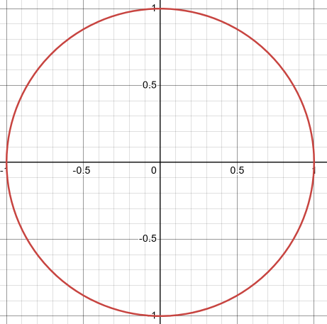

A circle centered at the origin with radius 1 (_i.e._ this circle) is called the
**unit circle**. The unit circle is very useful in a Trigonometry class.

**(b)**

$$ x^2 + (y - 3)^2 = 4 $$

$$ h = 0 $$

$$ k = 3 $$

$$ r = \sqrt{4} = 2 $$

$$ \text{center} = (0, 3) $$

$$ \text{radius} = 2 $$

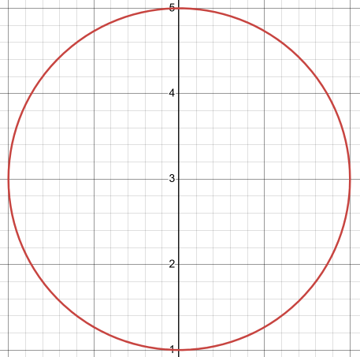

**(c\)**

$$ (x - 1)^2 + (y + 4)^2 = 16 $$

$$ h = 1 $$

$$ k = -4 $$

$$ r = \sqrt{16} = 4 $$

$$ \text{center} = (1, -4) $$

$$ \text{radius} = 4 $$

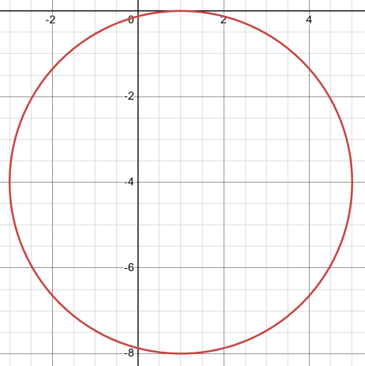

---

So, we’ve seen how to deal with circles that are already in the standard form.
However, not all circles will start out in the standard form. So, let’s take a
look at how to put a circle in the standard form.

---

**Example 3**

Determine the center and radius of each of the following.

**(a)**

$$ x^2 + y^2 + 8x + 7 = 0 $$

$$ x^2 + 8x + y^2 = -7 $$

$$ \left(\frac{8}{2}\right)^2 = (4)^2 = 16 $$

$$ x^2 + 8x + 16 + y^2 = -7 + 16 $$

$$ x^2 + 8x + 16 + y^2 = 9 $$

$$ (x + 4)^2 + y^2 = 9 $$

$$ h = -4 $$

$$ k = 0 $$

$$ r = \sqrt{9} = 3 $$

$$ \text{center} = (-4, 0) $$

$$ \text{radius} = 3 $$

**(b)**

$$ x^2 + y^2 - 3x + 10y - 1 = 0 $$

$$ x^2 -3x + y^2 + 10y = 1 $$

$$ \left(-\frac{3}{2}\right)^2 = \frac{9}{4} $$

$$ \left(\frac{10}{2}\right)^2 = (5)^2 = 25 $$

$$ x^2 - 3x + \frac{9}{4} + y^2 + 10y + 25 = 1 + \frac{9}{4} + 25 $$

$$ \left(x - \frac{3}{2}\right)^2 + (y + 5)^2 = \frac{113}{4} $$

$$ h = \frac{3}{2} $$

$$ k = -5 $$

$$ r = \sqrt{\frac{113}{4}} = \frac{\sqrt{113}}{2} $$

$$ \text{center} = \left(\frac{3}{2}, -5\right) $$

$$ \text{radius} = \frac{\sqrt{113}}{2} $$

---

## Practice Problems

**1.**

Write the equation of the circle with radius $3$ and center $(6, 0)$.

$$ (x - 6)^2 + (y - 0)^2 = 3^2 $$

$$ (x - 6)^2 + y^2 = 9 $$

**2.**

Write the equation of the circle with radius $\sqrt{7}$ and center $(-1, -9)$.

$$ (x + 1)^2 + (y + 9)^2 = (\sqrt{7})^2 $$

$$ (x + 1)^2 + (y + 9)^2 = 7 $$

For problems 3 - 5 determine the radius and center of the circle and sketch the
graph of the circle.

**3.**

$$ (x - 9)^2 + (y + 4)^2 = 25 $$

$$ h = 9 $$

$$ k = -4 $$

$$ r = \sqrt{25} = 5 $$

$$ \text{center} = (9, -4) $$

$$ text{radius} = 5 $$

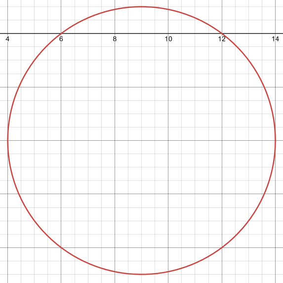

**4.**

$$ x^2 + (y - 5)^2 = 4 $$

$$ h = 0 $$

$$ k = 5 $$

$$ r = \sqrt{4} = 2 $$

$$ \text{center} = (0, 5) $$

$$ \text{radius} = 2 $$

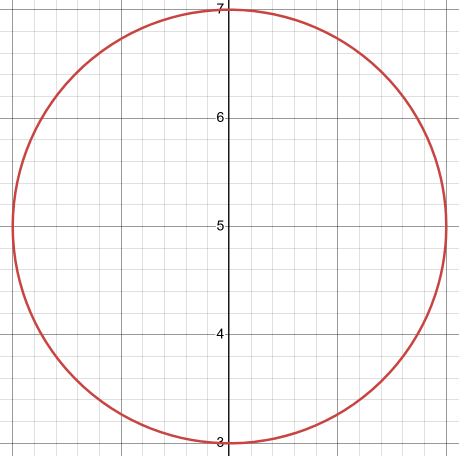

**5.**

$$ (x + 1)^2 + (y + 3)^2 = 6 $$

$$ h = -1 $$

$$ k = -3 $$

$$ r = \sqrt{6} $$

$$ \text{center} = (-1, -3) $$

$$ \text{radius} = \sqrt{6} $$

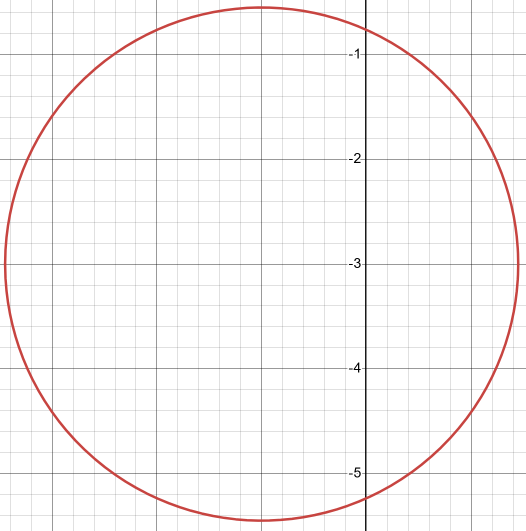

For problems 6 - 8 determine the radius and center of the circle. If the
equation is not the equation of a circle clearly explain why not.

**6.**

$$ x^2 + y^2 + 14x - 8y + 56 = 0 $$

$$ x^2 + 14x + y^2 - 8y = -56 $$

$$ \left(\frac{14}{2}\right)^2 = (7)^2 = 49 $$

$$ \left(-\frac{8}{2}\right)^2 = \left(\frac{64}{4}\right) = 16 $$

$$ x^2 + 14x + 49 + y^2 - 8y + 16 = -56 + 49 + 16 $$

$$ (x + 7)^2 + (y - 4)^2 = 9 $$

$$ h = -7 $$

$$ k = 4 $$

$$ r = \sqrt{9} = 3 $$

$$ \text{center} = (-7, 4) $$

$$ \text{radius} = 3 $$

**7.**

$$ 9x^2 + 9y^2 - 6x - 36y - 107 = 0 $$

$$ 9x^2 - 6x + 9y^2 - 36y = 107 $$

$$ \left(\frac{1}{9}\right)(9x^2 - 6x + 9y^2 - 36y) = (107)\left(\frac{1}{9}\right) $$

$$ x^2 - \frac{2}{3}x + y^2 - 4y = \frac{107}{9} $$

$$ \left(-\frac{\dfrac{2}{3}}{2}\right)^2 = \frac{1}{9} $$

$$ \left(-\frac{4}{2}\right)^2 = (-2)^2 = 4 $$

$$ x^2 - \frac{2}{3}x + \frac{1}{9} + y^2 - 4y + 4 = \frac{107}{9} + \frac{1}{9} + 4 $$

$$ \left(x - \frac{1}{3}\right)^2 + (y - 2)^2 = 16 $$

$$ h = \frac{1}{3} $$

$$ k = 2 $$

$$ r = \sqrt{16} = 4 $$

$$ \text{center} = \left(\frac{1}{3}, 2\right) $$

$$ \text{radius} = 4 $$

**8.**

$$ x^2 + y^2 + 8x + 20 = 0 $$

$$ x^2 + 8x + y^2 + 20 = 0 $$

$$ x^2 + 8x + y^2 = -20 $$

$$ \left(\frac{8}{2}\right)^2 = (4)^2 = 16 $$

$$ x^2 + 8x + 16 + y^2  = -20 + 16  $$

$$ (x + 4)^2 + y^2 = -4 $$

The equation is not a circle because the radius is not a real number.
$\sqrt{-4} = 2i$.

---

## Assignment Problems

**1.**

Write the equation of the circle with radius $1$ and center $(11, 4)$.

$$ (x - 11)^2 + (y - 4)^2 = 1^2 $$

$$ (x - 11)^2 + (y - 4)^2 = 1 $$

**2.**

Write the equation of the circle with radius $10$ and center $(-6, 0)$.

$$ (x + 6)^2 + (y - 0)^2 = (10)^2 $$

$$ (x + 6)^2 + y^2 = 100 $$

**3.**

Write the equation of the circle with radius $\sqrt{19}$ and center $(7, -2)$.

$$ (x - 7)^2 + (y + 2)^2 = (\sqrt{19})^2 $$

$$ (x - 7)^2 + (y + 2)^2 = 19 $$

**4.**

Write the equation of the circle with radius $\dfrac{7}{3}$ and center
$\left(-\dfrac{1}{2}, \dfrac{3}{4}\right)$.

$$ \left(x + \frac{1}{2}\right)^2 + \left(y - \frac{3}{4}\right)^2 = \left(\frac{7}{3}\right)^2 $$

$$ \left(x + \frac{1}{2}\right)^2 + \left(y - \frac{3}{4}\right)^2 = \frac{49}{9} $$

For problems 5 - 10 determine the radius and center of the circle and sketch the
graph of the circle.

**5.**

$$ (x + 8)^2 + y^2 = 36 $$

$$ \text{center} = (-8, 0) $$

$$ \text{radius} = \sqrt{36} = 6 $$

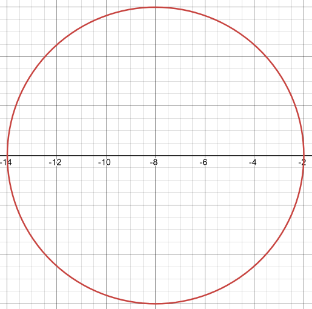

**6.**

$$ (x - 1)^2 + (y - 7)^2 = 16 $$

$$ \text{center} =  (1, 7) $$

$$ \text{radius} =  \sqrt{16} = 4 $$

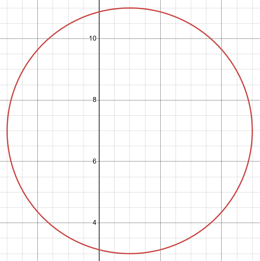

**7.**

$$ (x + 10)^2 + (y - 6)^2 = 25 $$

$$ \text{center} =  (-10, 6) $$

$$ \text{radius} = \sqrt{25} = 5 $$

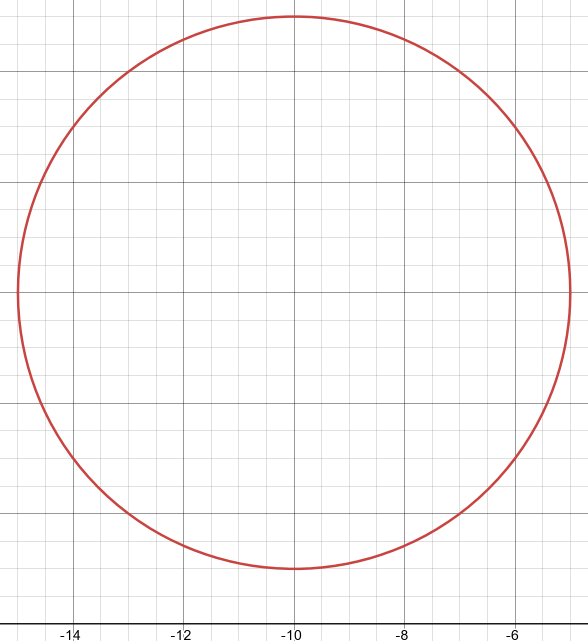

**8.**

$$ x^2 + (y + 4)^2 = \frac{49}{144} $$

$$ \text{center} = (0, -4) $$

$$ \text{radius} = \sqrt{\frac{49}{144}} = \frac{7}{12} $$

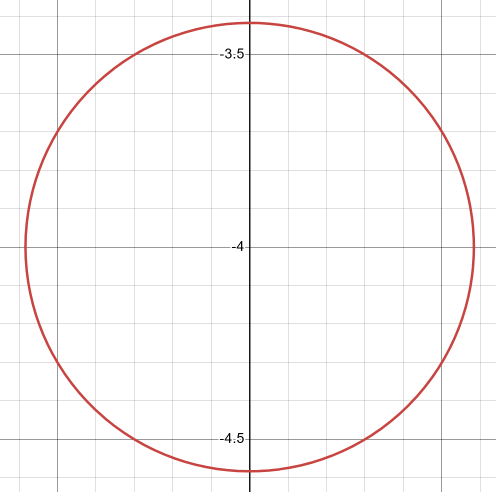

**9.**

$$ (x + 2)^2 + (y - 1)^2 = 3 $$

$$ \text{center} = (-2, 1) $$

$$ \text{radius} = \sqrt{3} $$

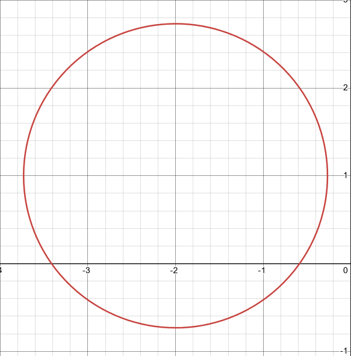

**10.**

$$ (x - 5)^2 + (y - 3)^2 = 11 $$

$$ \text{center} = (5, 3) $$

$$ \text{radius} = \sqrt{11} $$

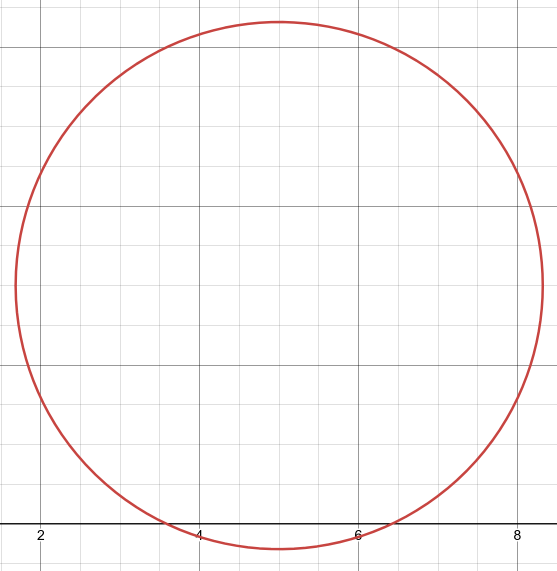

For problems 11 - 17 determine the radius and center of the circle. If the
equation is not the equation of a circle clearly explain why not.

**11.**

$$ x^2 + y^2 - 8y = 0 $$

$$ \left(-\frac{8}{2}\right)^2 = (-4)^2 = 16 $$

$$ x^2 + y^2 - 8y + 16 = 0 + 16 $$

$$ x^2 + (y - 4)^2 = 16 $$

$$ \text{center} = (0, 4) $$

$$ \text{radius} =  \sqrt{16} = 4 $$

**12.**

$$ x^2 + y^2 - 6x - 4y - 12 = 0 $$

$$ x^2 - 6x + y^2 - 4y = 12 $$

$$ \left(-\frac{6}{2}\right)^2 = (-3)^2 = 9 $$

$$ \left(-\frac{4}{2}\right)^2 = (-2)^2 = 4 $$

$$ x^2 - 6x + 9 + y^2 - 4y + 4 = 12 + 9 + 4 $$

$$ (x - 3)^2 + (y - 2)^2 = 25 $$

$$ \text{center} = (3, 2) $$

$$ \text{radius} = \sqrt{25} = 5 $$

**13.**

$$ x^2 + y^2 + 12x + 2y + 28 = 0 $$

$$ x^2 + 12x + y^2 + 2y = -28 $$

$$ \left(\frac{12}{2}\right)^2 = (6)^2 = 36 $$

$$ \left(\frac{2}{2}\right)^2 = (1)^2 = 1 $$

$$ x^2 + 12x + 36 + y^2 + 2y + 1 = -28 + 36 + 1 $$

$$ (x + 6)^2 + (y + 1)^2 = 9 $$

$$ \text{center} = (-6, -1) $$

$$ \text{radius} = \sqrt{9} = 3 $$

**14.**

$$ 16x^2 + 16y^2 - 16x + 8y - 11 = 0 $$

$$ 16x^2 - 16x + 16y^2 + 8y = 11 $$

$$ \left(\frac{1}{16}\right)(16x^2 - 16x + 16y^2 + 8y) = (11)\left(\frac{1}{16}\right) $$

$$ x^2 -x + y^2 + \frac{1}{2}y = \frac{11}{16} $$

$$ \left(-\frac{1}{2}\right)^2 = \frac{1}{4} $$

$$ \left(\frac{\dfrac{1}{2}}{2}\right)^2 = \left(\frac{1}{4}\right)^2 = \frac{1}{16} $$

$$ x^2 -x + \frac{1}{4} + y^2 + \frac{1}{2}y + \frac{1}{16} = \frac{11}{16} + \frac{1}{4} + \frac{1}{16} $$

$$ \left(x - \frac{1}{2}\right)^2 + \left(y + \frac{1}{4}\right)^2 = 1 $$

$$ \text{center} = \left(\frac{1}{2}, -\frac{1}{4}\right) $$

$$ \text{radius} = \sqrt{1} = 1 $$

**15.**

$$ 2x^2 + 2y^2 - 3x + 1 = 0 $$

$$ 2x^2 -3x + 2y^2 = -1 $$

$$ \left(\frac{1}{2}\right)(2x^2 -3x + 2y^2) = (-1)\left(\frac{1}{2}\right) $$

$$ x^2 - \frac{3}{2}x + y^2 = -\frac{1}{2} $$

$$ \left(-\frac{\dfrac{3}{2}}{2}\right)^2  = \left(\frac{3}{4}\right)^2  = \frac{9}{16} $$

$$ x^2 - \frac{3}{2}x + \frac{9}{16} + y^2 = -\frac{1}{2} + \frac{9}{16} $$

$$ \left(x -\frac{3}{4}\right)^2 + y^2 = \frac{1}{16} $$

$$ \text{center} = \left(\frac{3}{4}, 0\right) $$

$$ \text{radius} = \sqrt{\frac{1}{16}} = \frac{1}{4} $$

**16.**

$$ x^2 + y^2 + 2x - 2y + 11 = 0 $$

$$ x^2 + 2x + y^2 - 2y = -11 $$

$$ \left(\frac{2}{2}\right)^2 = (1)^2 = 1 $$

$$ \left(-\frac{2}{2}\right)^2 = (-1)^2 = 1 $$

$$ x^2 + 2x + 1 + y^2 - 2y + 1  = -11 + 1 + 1 $$

$$ (x + 1)^2 + (y - 1)^2 = -9 $$

$$ \text{NOT A CIRCLE, RADIUS NOT A REAL NUMBER} $$

**17.**

$$ x^2 + y^2 - 10x + 4y + 29 = 0 $$

$$ x^2 - 10x + y^2 + 4y = -29 $$

$$ \left(-\frac{10}{2}\right)^2 = (-5)^2 = 25 $$

$$ \left(\frac{4}{2}\right)^2 = \frac{16}{4} = 4 $$

$$ x^2 - 10x + 25 + y^2 + 4y + 4 = -29 + 25 + 4 $$

$$ (x - 5)^2 + (y + 2)^2 = 0 $$

$$ \text{center} = (5, -2) $$

$$ \text{radius} = \sqrt{0} = 0 $$

**Note:** this is also known as a
[degenerate](https://en.wikipedia.org/wiki/Degeneracy_(mathematics)) circle.
