# 3.5 Graphing Functions

---

Now we need to discuss graphing functions. If we recall from the previous
section we said that $f(x)$ is nothing more than a fancy way of writing $y$.
This means that we already know how to graph functions. We graph functions in
exactly the same way that we graph equations. If we know ahead of time what the
function is a graph of we can use that information to help us with the graph and
if we don’t know what the function is ahead of time then all we need to do is
plug in $x$’s computed value of the function (which is really a $y$ value) and
then plot the points.

---

**Example 1**

Sketch the graph of $f(x) = (x - 1)^3 + 1$.

Now, as we talked about when we first looked at graphing earlier in this chapter
we’ll need to pick values of $x$ to plug in and knowing the values to pick
really only comes with experience. Therefore, don’t worry so much about the
values of $x$ that we’re using here. By the end of this chapter you’ll also be
able to correctly pick these values.

| x  | f(x) | (x, y)   |
| -- | ---- | -------- |
| -1 | -7   | (-1, -7) |
| 0  | 0    | (0, 0)   |
| 1  | 1    | (1, 1)   |
| 2  | 2    | (2, 2)   |
| 3  | 9    | (3, 9)   |

Here is the sketch of the graph.

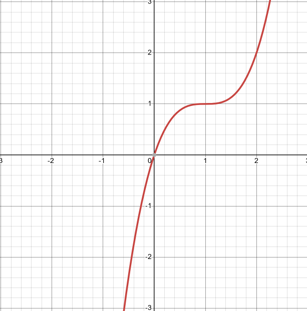

---

So, graphing functions is pretty much the same as graphing equations.

There is one function that we’ve seen to this point that we didn’t really see
anything like when we were graphing equations in the first part of this chapter.
That is piecewise functions. So, we should graph a couple of these to make sure
that we can graph them as well.

---

**Example 2**

Sketch the graph of the following piecewise function.

$$
g(x) =
\begin{cases}
-x^2 + 4 & \text{if } x < 1 \\
2x - 1 & \text{if } x \geq 1
\end{cases}
$$

Okay, now when we are graphing piecewise functions we are really graphing
several functions at once, except we are only going to graph them on very
specific intervals. In this case we will be graphing the following two
functions,

$$ -x^2 + 4 \text{ on } x < 1 $$

$$ 2x - 1 \text{ on } x \geq 1 $$

We’ll need to be a little careful with what is going on right at $x = 1$ since
technically that will only be valid for the bottom function. However, we’ll deal
with that at the very end when we actually do the graph. For now, we will use
$x = 1$ in both functions.

The first thing to do here is to get a table of values for each function on the
specified range and again we will use $x = 1$ in both even though technically it
only should be used with the bottom function.

| $x$  | $-x^2 + 4$ | $(x, y)$  |
| ---- | ---------- | --------- |
| $-2$ | $0$        | $(-2, 0)$ |
| $-1$ | $3$        | $(-1, 3)$ |
| $0$  | $4$        | $(0, 4)$  |
| $1$  | $3$        | $(1, 3)$  |

| $x$ | $2x - 1$ | $(x, y)$ |
| --- | -------- | -------- |
| $1$ | $1$      | $(1, 1)$ |
| $2$ | $3$      | $(2, 3)$ |
| $3$ | $5$      | $(3, 5)$ |

Here is a sketch of the graph and notice how we denoted the points at $x = 1$.
For the top function we used an open dot for the point at $x = 1$ and for the
bottom function we used a closed dot at $x = 1$. In this way we make it clear on
the graph that only the bottom function really has a point at $x = 1$.

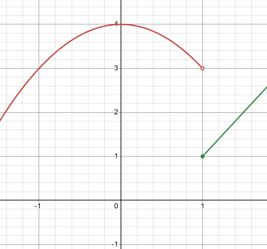

Notice that since the two graphs didn’t meet at $x = 1$ we left a blank space in
the graph. Do NOT connect these two points with a line. There really does need
to be a break there to signify that the two portions do not meet at $x = 1$.

Sometimes the two portions will meet at these points and at other times they
won’t. We shouldn’t ever expect them to meet or not to meet until we’ve actually
sketched the graph.

---

Let's take a look at another example of a piecewise function.

---

**Example 3**

Sketch the graph of the following piecewise function.

$$
h(x) =
\begin{cases}
x + 3 & \text{if } x < -2 \\
x^2 & \text{if } -2 \leq x < 1 \\
-x + 2 & \text{if } x \geq 1
\end{cases}
$$

In this case we will be graphing three functions on the ranges given above. So,
as with the previous example we will get function values for each function in
its specified range and we will include the endpoints of each range in each
computation. When we graph we will acknowledge which function the endpoint
actually belongs with by using a closed dot as we did previously. Also, the top
and bottom functions are lines and so we don’t really need more than two points
for these two. We’ll get a couple more points for the middle function.

| $x$  | $x + 3$ | $(x, y)$  |
| ---- | ------- | --------- |
| $-3$ | $0$     | $(-3, 0)$ |
| $-2$ | $1$     | $(-2, 1)$ |

| $x$  | $x^2 | $(x, y)$  |
| ---- | ---- | --------- |
| $-2$ | $4$  | $(-2, 4)$ |
| $-1$ | $1$  | $(-1, 1)$ |
| $0$  | $0$  | $(0, 0)$  |
| $1$  | $1$  | $(1, 1)$  |

| $x$ | $-x + 2$ | $(x, y)$ |
| --- | -------- | -------- |
| $1$ | $1$      | $(1, 1)$ |
| $2$ | $0$      | $(2, 0)$ |

Here is the sketch of the graph.

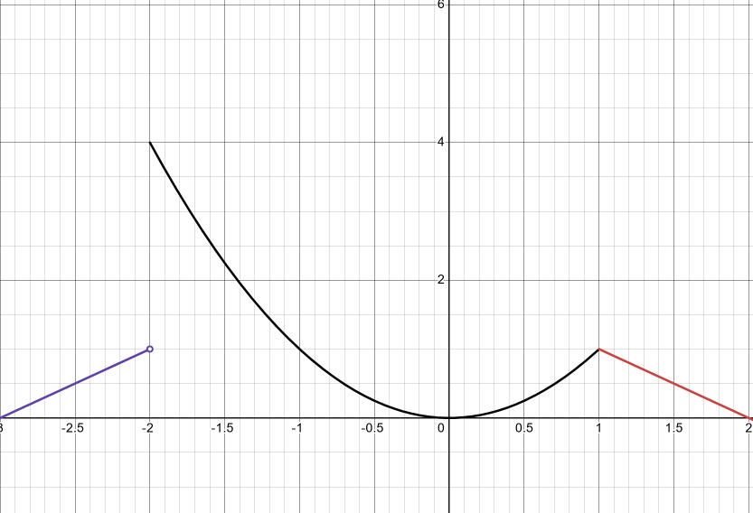

Note that in this case two of the portions met at the breaking point $x = 1$ and
at the other breaking point, $x = −2$, they didn’t meet up. As noted in the
previous example sometimes they meet up and sometimes they won’t.

---

## Practice Problems

For problems 1 – 5 construct a table of at least 4 ordered pairs of points on
the graph of the function and use the ordered pairs from the table to sketch the
graph of the function.

**1.**

$$ f(x) = x^2 - 2 $$

| $x$  | $x^2 - 2$ | $(x, y)$   |
| ---- | --------- | ---------- |
| $0$  | $-2$      | $(0, 2)$   |
| $-1$ | $-1$      | $(-1, -1)$ |
| $1$  | $-1$      | $(1, -1)$  |
| $2$  | $2$       | $(2, 2)$   |

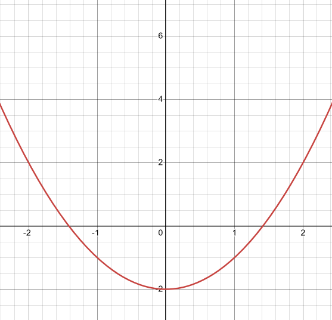

**2.**

$$ f(x) = \sqrt{x + 1} $$

| $x$  | $\sqrt{x + 1}$ | $(x, y)$  |
| ---- | -------------- | --------- |
| $-1$ | $0$            | $(-1, 0)$ |
| $0$  | $1$            | $(0, 1)$  |
| $3$  | $2$            | $(3, 2)$  |
| $8$  | $3$            | $(8, 3)$  |

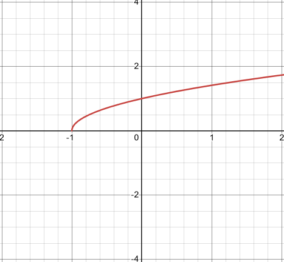

**3.**

$$ f(x) = 9 $$

| $x$  | $9$ | $(x, y)$  |
| ---- | --- | --------- |
| $0$  | $9$ | $(0, 9)$  |
| $-1$ | $9$ | $(-1, 9)$ |
| $1$  | $9$ | $(1, 9)$  |
| $2$  | $9$ | $(2, 9)$  |

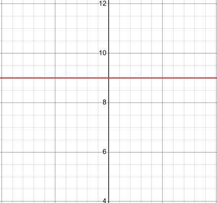

**4.**

$$
f(x) =
\begin{cases}
10 - 2x & \text{if } x < 2 \\
x^2 + 2 & \text{if } x \geq 2
\end{cases}
$$

| $x$  | $10 - 2x$ | $(x, y)$   |
| ---- | --------- | ---------- |
| $-2$ | $14$      | $(-2, 14)$ |
| $-1$ | $12$      | $(-1, 12)$ |
| $0$  | $10$      | $(0, 10)$  |
| $1$  | $8$       | $(1, 8)$   |

| $x$ | $x^2 + 2$ | $(x, y)$  |
| --- | --------- | --------- |
| $2$ | $6$       | $(2, 6)$  |
| $3$ | $11$      | $(3, 11)$ |
| $4$ | $18$      | $(4, 18)$ |
| $5$ | $27$      | $(5, 27)$ |

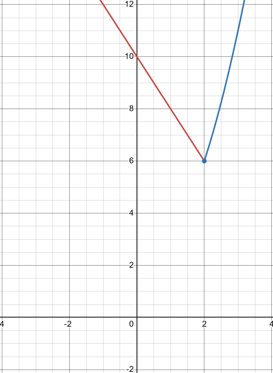

**5.**

$$
f(x) =
\begin{cases}
5 + x & \text{if } x \geq 1 \\
2 & \text{if } -2 \leq x < 1 \\
1 - x^2 & \text{if } x < -2
\end{cases}
$$

| $x$ | $5 + x$ | $(x, y)$ |
| --- | ------- | -------- |
| $1$ | $6$     | $(1, 6)$ |
| $2$ | $7$     | $(2, 7)$ |
| $3$ | $8$     | $(3, 8)$ |
| $4$ | $9$     | $(4, 9)$ |

| $x$  | $2$ | $(x, y)$  |
| ---- | --- | --------- |
| $0$  | $2$ | $(0, 2)$  |
| $-1$ | $2$ | $(-1, 2)$ |
| $-2$ | $2$ | $(-2, 2)$ |

| $x$  | $1 - x^2$ | $(x, y)$    |
| ---- | --------- | ----------- |
| $-3$ | $-8$      | $(-3, -8)$  |
| $-4$ | $-15$     | $(-4, -15)$ |
| $-5$ | $-24$     | $(-5, -24)$ |
| $-6$ | $-35$     | $(-6, -35)$ |

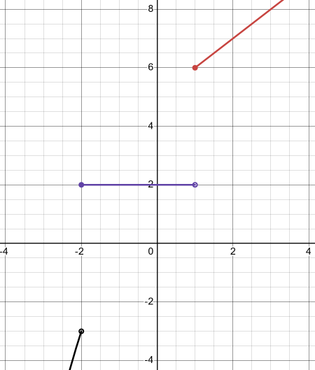

---

## Assignment Problems

For problems 1 – 13 construct a table of at least 4 ordered pairs of points on
the graph of the function and use the ordered pairs from the table to sketch the
graph of the function.

**1.**

$$ f(x) = 6x - 1 $$

| $x$  | $6x - 1$ | $(x, y)$   |
| ---- | -------- | ---------- |
| $0$  | $-1$     | $(0, -1)$  |
| $1$  | $5$      | $(1, 5)$   |
| $-1$ | $-7$     | $(-1, -7)$ |
| $2$  | $11$     | $(2, 11)$  |

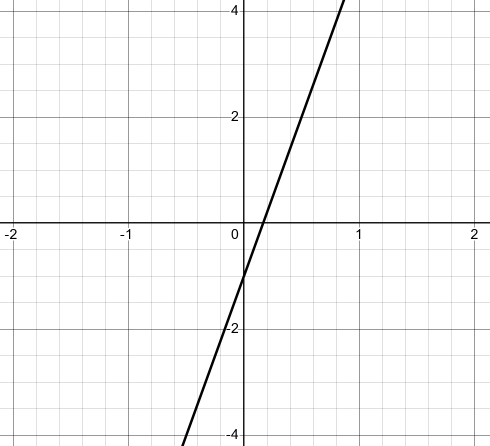

**2.**

$$ f(x) = 3 - 5x $$

| $x$  | $3 - 5x$ | $(x, y)$  |
| ---- | -------- | --------- |
| $0$  | $3$      | $(0, 3)$  |
| $-1$ | $8$      | $(-1, 8)$ |
| $1$  | $-2$     | $(1, -2)$ |
| $2$  | $-7$     | $(2, -7)$ |

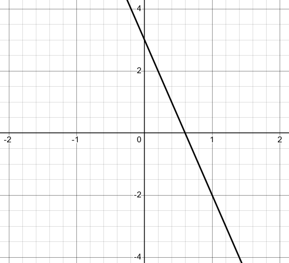

**3.**

$$ f(x) = 2x^2 $$

| $x$  | $2x^2$ | $(x, y)$  |
| ---- | ------ | --------- |
| $0$  | $0$    | $(0, 0)$  |
| $-1$ | $2$    | $(-1, 2)$ |
| $1$  | $2$    | $(1, 2)$  |
| $-2$ | $8$    | $(-2, 8)$ |

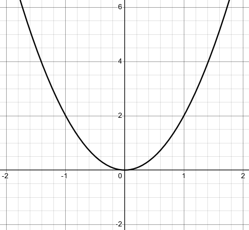

**4.**

$$ f(x) = x^2 + 7 $$

| $x$  | $x^2 + 7$ | $(x, y)$   |
| ---- | --------- | ---------- |
| $0$  | $7$       | $(0, 7)$   |
| $1$  | $8$       | $(1, 8)$   |
| $-2$ | $11$      | $(-2, 11)$ |
| $3$  | $16$      | $(3, 16)$  |

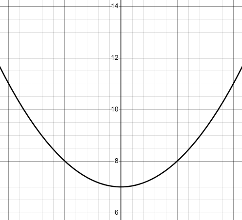

**5.**

$$ f(x) = \sqrt{x + 3} $$

| $x$  | $\sqrt{x + 3}$ | $(x, y)$  |
| ---- | -------------- | --------- |
| $-3$ | $0$            | $(-3, 0)$ |
| $6$  | $3$            | $(6, 3)$  |
| $13$ | $4$            | $(13, 4)$ |
| $22$ | $5$            | $(22, 5)$ |

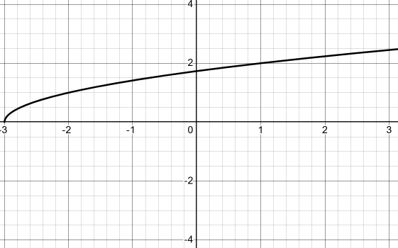

**6.**

$$ f(x) = \sqrt{6 - x} $$

| $x$   | $\sqrt{6 - x}$ | $(x, y)$   |
| ----- | -------------- | ---------- |
| $-3$  | $3$            | $(-3, 3)$  |
| $-10$ | $4$            | $(-10, 4)$ |
| $-19$ | $5$            | $(-19, 5)$ |
| $-30$ | $6$            | $(-30, 6)$ |

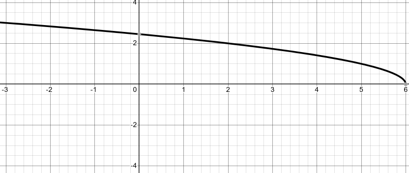

**7.**

$$ f(x) = \frac{1}{x}\text{, use only positive } x\text{'s} $$

| $x$ | $\frac{1}{x}$  | $(x, y)$                       |
| --- | -------------- | ------------------------------ |
| $1$ | $1$            | $(1, 1)$                       |
| $2$ | $\dfrac{1}{2}$ | $\left(2, \dfrac{1}{2}\right)$ |
| $3$ | $\dfrac{1}{3}$ | $\left(3, \dfrac{1}{3}\right)$ |
| $4$ | $\dfrac{1}{4}$ | $\left(4, \dfrac{1}{4}\right)$ |

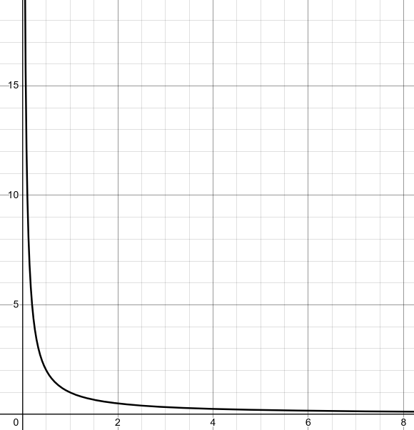

**8.**

$$ f(x) = \frac{1}{x}\text{, use only negative } x\text{'s} $$

| $x$  | $\frac{1}{x}$   | $(x, y)$                         |
| ---- | --------------- | -------------------------------- |
| $-1$ | $-1$            | $(-1, -1)$                       |
| $-2$ | $-\dfrac{1}{2}$ | $\left(-2, -\dfrac{1}{2}\right)$ |
| $-3$ | $-\dfrac{1}{3}$ | $\left(-3, -\dfrac{1}{3}\right)$ |
| $-4$ | $-\dfrac{1}{4}$ | $\left(-4, -\dfrac{1}{4}\right)$ |

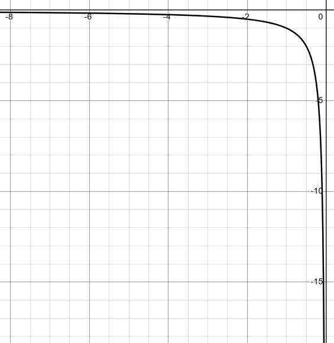

**9.**

$$
f(x) =
\begin{cases}
3 & \text{if } x \geq 0 \\
4 - x & \text{if } x < 0
\end{cases}
$$

| $x$ | $3$ | $(x, y)$ |
| --- | --- | -------- |
| $0$ | $3$ | $(0, 3)$ |
| $1$ | $3$ | $(1, 3)$ |
| $2$ | $3$ | $(2, 3)$ |
| $3$ | $3$ | $(3, 3)$ |

| $x$  | $4 - x$ | $(x, y)$  |
| ---- | ------- | --------- |
| $-1$ | $5$     | $(-1, 5)$ |
| $-2$ | $6$     | $(-2, 6)$ |
| $-3$ | $7$     | $(-3, 7)$ |
| $-4$ | $8$     | $(-4, 8)$ |

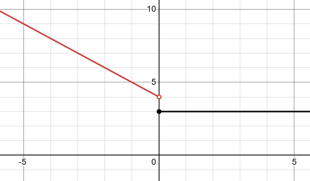

**10.**

$$
f(x) =
\begin{cases}
4x & \text{if } x \leq -2 \\
3 - 2x & \text{if } x > -2
\end{cases}
$$

| $x$  | $4x$  | $(x, y)$    |
| ---- | ----- | ----------- |
| $-2$ | $-8$  | $(-2, -8)$  |
| $-3$ | $-12$ | $(-3, -12)$ |
| $-4$ | $-16$ | $(-4, -16)$ |
| $-5$ | $-20$ | $(-5, -20)$ |

| $x$  | $3 - 2x$ | $(x, y)$  |
| ---- | -------- | --------- |
| $-1$ | $5$      | $(-1, 5)$ |
| $0$  | $3$      | $(0, 3)$  |
| $1$  | $1$      | $(1, 1)$  |
| $2$  | $-1$     | $(2, -1)$ |

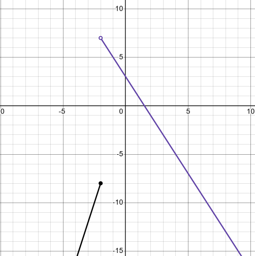

**11.**

$$
f(x) =
\begin{cases}
2 - x^2 & \text{if } x < 1 \\
(x - 2)^2 & \text{if } x \geq 1
\end{cases}
$$

| $x$  | $2 - x^2$ | $(x, y)$   |
| ---- | --------- | ---------- |
| $0$  | $2$       | $(0, 2)$   |
| $-1$ | $1$       | $(-1, 1)$  |
| $-2$ | $-2$      | $(-2, -2)$ |
| $-3$ | $-7$      | $(-3, -7)$ |

| $x$ | $(x - 2)^2$ | $(x, y)$ |
| --- | ----------- | -------- |
| $1$ | $1$         | $(1, 1)$ |
| $2$ | $0$         | $(2, 0)$ |
| $3$ | $1$         | $(3, 1)$ |
| $4$ | $4$         | $(4, 4)$ |

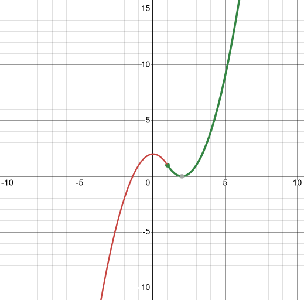

**12.**

$$
f(x) =
\begin{cases}
x^2 & \text{if } x > 3 \\
4 & \text{if } -2 \leq x \leq 3 \\
1 - x & \text{if } x < -2
\end{cases}
$$

| $x$ | $x^2$ | $(x, y)$  |
| --- | ----- | --------- |
| $4$ | $16$  | $(4, 16)$ |
| $5$ | $25$  | $(5, 25)$ |
| $6$ | $36$  | $(6, 36)$ |
| $7$ | $49$  | $(7, 49)$ |

| $x$  | $4$ | $(x, y)$  |
| ---- | --- | --------- |
| $-2$ | $4$ | $(-2, 4)$ |
| $-1$ | $4$ | $(-1, 4)$ |
| $0$  | $4$ | $(0, 4)$  |
| $3$  | $4$ | $(3, 4)$  |

| $x$  | $1 - x$ | $(x, y)$  |
| ---- | ------- | --------- |
| $-3$ | $4$     | $(-3, 4)$ |
| $-4$ | $5$     | $(-4, 5)$ |
| $-5$ | $6$     | $(-5, 6)$ |
| $-6$ | $7$     | $(-6, 7)$ |

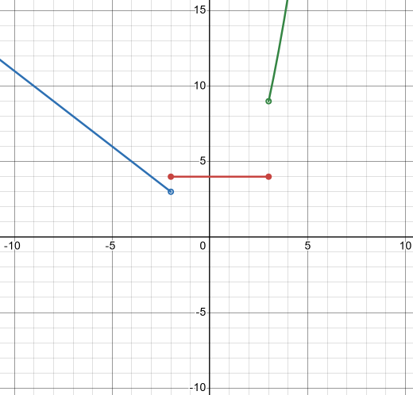

**13.**

$$
f(x) =
\begin{cases}
1 - x & \text{if } x \geq 1 \\
x^2 - 1 & \text{if } -1 < x < 1 \\
-1 - x & \text{if } x \leq -1
\end{cases}
$$

| $x$ | $1 - x$ | $(x, y)$  |
| --- | ------- | --------- |
| $1$ | $0$     | $(1, 0)$  |
| $2$ | $-1$    | $(2, -1)$ |
| $3$ | $-2$    | $(3, -2)$ |
| $4$ | $-3$    | $(4, -3)$ |

| $x$ | $x^2 - 1$ | $(x, y)$  |
| --- | --------- | --------- |
| $0$ | $-1$      | $(0, -1)$ |

| $x$  | $-1 - x$ | $(x, y)$  |
| ---- | -------- | --------- |
| $-1$ | $0$      | $(-1, 0)$ |
| $-2$ | $1$      | $(-2, 1)$ |
| $-3$ | $2$      | $(-3, 2)$ |
| $-4$ | $3$      | $(-4, 3)$ |

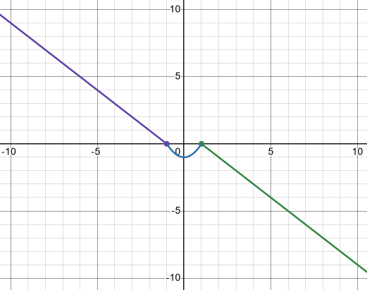
