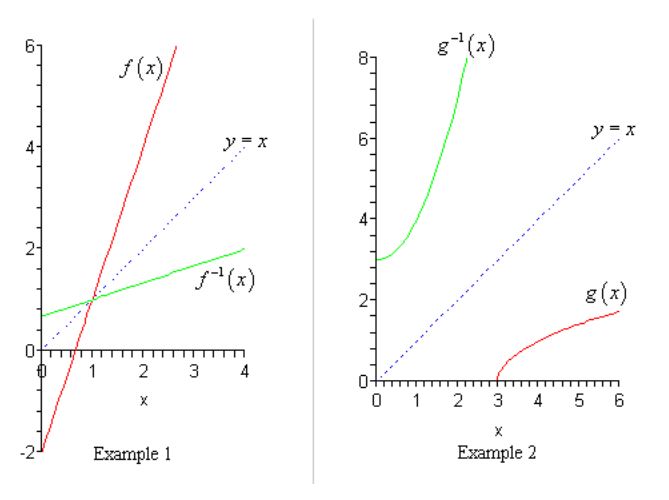

# 3.7 Inverse Functions

---

In the last example from the previous section we looked at the two functions
$f(x) = 3x - 2$ and $g(x) = \dfrac{x}{3} + \dfrac{2}{3}$ and saw that

$$ (f \circ g)(x) = (g \circ f)(x) = x $$

and as noted in that section this means that these are very special functions.
Let’s see just what makes them so special. Consider the following evaluations.

$$ f(\textcolor{blue}{-1}) = 3(-1) - 2 = \textcolor{red}{-5} \Rightarrow g(\textcolor{red}{-5}) = \frac{-5}{3} + \frac{2}{3} = \frac{-3}{3} = \textcolor{blue}{-1} $$

$$ g(\textcolor{blue}{2}) = \frac{2}{3} + \frac{2}{3} = \textcolor{red}{\frac{4}{3}} \Rightarrow f\left(\textcolor{red}{\frac{4}{3}}\right) = 3\left(\frac{4}{3}\right) - 2 = 4 - 2 = \textcolor{blue}{2} $$

In the first case we plugged $x = -1$ into $f(x)$ and got a value of $-5$. We
then turned around and plugged $x = -5$ into $g(x)$ and got a value of $-1$, the
number that we started off with.

In the second case we did something similar. Here we plugged $x = 2$ into $g(x)$
and got a value of $\dfrac{4}{3}$, we turned around a plugged this into $f(x)$
and got a value of $2$, which is, again, the number that we started with.

Note that we really are doing some function composition here. The first case is
really,

$$ (g \circ f)(-1) = g[f(-1)] = g[-5] = -1 $$

and the second case is really,

$$ (f \circ g)(2) = f[g(2)] = f\left[\frac{4}{3}\right] = 2 $$

Note as well that these both agree with the formula for the compositions that we
found in the previous section. We get back out of the function evaluation the
number that we originally plugged into the composition.

So, just what is going on here? In some way we can think of these two functions
as undoing what the other did to a number. In the first case we plugged $x = -1$
into $f(x)$ and then plugged the result from this function evaluation back into
$g(x)$ and in some way $g(x)$ undid what $f(x)$ had done to $x = -1$ and gave us
back the original $x$ that we started with.

Function pairs that exhibit this behavior are called **inverse functions$$.
Before formally defining inverse functions and the notation that we're going to
use for them we need to get a definition out of the way.

A function is called **one-to-one** if no two values of $x$ produce the same
$y$. This is a fairly simple definition of one-to-one but it takes an example of
a function that isn’t one-to-one to show just what it means. Before doing that
however we should note that this definition of one-to-one is not really the
mathematically correct definition of one-to-one. It is identical to the
mathematically correct definition it just doesn’t use all the notation from the
formal definition.

Now, let’s see an example of a function that isn’t one-to-one. The function
$f(x) = x^2$ is not one-to-one because both $f(−2) = 4$ and $f(2) = 4$. In other
words, there are two different values of $x$ that produce the same value of $y$.
Note that we can turn $f(x) = x^2$ into a one-to-one function if we restrict
ourselves to $0 \leq x < \infty$. This can sometimes be done with functions.

Showing that a function is one-to-one is often a tedious and difficult process.
For the most part we are going to assume that the functions that we’re going to
be dealing with in this section are one-to-one. We did need to talk about
one-to-one functions however since only one-to-one functions can be inverse
functions.

Now, let’s formally define just what inverse functions are.

**Inverse Functions**

> Given two one-to-one functions $f(x)$ and $g(x)$ if
> $$ (f \circ g)(x) = x \text{ AND } (g \circ f)(x) = x  $$
>
> then we say that $f(x)$ and $g(x)$ are **inverses** of each other. More
> specifically we say that $g(x)$ is the **inverse** of $f(x)$ and denote it by
> $$ g(x) = f^{-1}(x) $$
>
> Likewise, we could say that $f(x)$ is the **inverse** of $g(x)$ and denote it
> by
>
> $$ f(x) = g^{-1}(x) $$

The notation that we use really depends upon the problem. In most cases either
is acceptable.

For the two functions that we started off this section with we could write
either of the following two sets of notation.

$$ f(x) = 3x - 2 $$

$$ f^{-1}(x) = \frac{x}{3} + \frac{2}{3} $$

$$ g(x) = \frac{x}{3} + \frac{2}{3} $$

$$ g^{-1}(x) = 3x - 2 $$

Now, be careful with the notation for inverses. The “-1” is NOT an exponent
despite the fact that it sure does look like one! When dealing with inverse
functions we’ve got to remember that

$$ f^{-1}(x) \neq \frac{1}{f(x)} $$

The process for finding the inverse of a function is a fairly simple one
although there is a couple of steps that can on occasion be somewhat messy. Here
is the process

**Finding the Inverse of a Function**

> Given the function $f(x)$ we want to find the inverse function, $f^{-1}(x)$.
>
> 1. First, replace $f(x)$ with $y$. This is done to make the rest of the
>    process easier.
> 2. Replace every $x$ with a $y$ and replace every $y$ with an $x$.
> 3. Solve the equation from Step 2 for $y$. This is the step where mistakes are
>    most often made so be careful with this step.
> 4. Replace $y$ with $f^{-1}(x)$. In other words, we've managed to find the
>    inverse at this point!
> 5. Verify your work by checking that $(f \circ f^{-1})(x) = x$ and
>    $(f^{-1} \circ f)(x) = x$ are both true. This work can sometimes be messy
>    making it easy to make mistakes so, again, be careful.

That’s the process. Most of the steps are not all that bad but as mentioned in
the process there are a couple of steps that we really need to be careful with.

In the verification step we technically really do need to check that both
$(f \circ f^{-1})(x) = x$ and $(f^{-1} \circ f)(x) = x$ are true. However, there
are functions (they are far beyond the scope of this course however) for which
it is possible for only one of these to be true. This is brought up because in
all the problems here we will be just checking one of them. We just need to
always remember that technically we should check both.

Let’s work some examples.

---

**Example 1**

Given $f(x) = 3x - 2$ find $f^{-1}(x)$.

First replace $f(x)$ with $y$.

$$ y = 3x - 2 $$

Next replace all $x$'s with $y$ and all $y$'s with $x$.

$$ x = 3y - 2 $$

Now solve for $y$.

$$ x + 2 = 3y $$

$$ \frac{x + 2}{3} = y $$

$$ \frac{x}{3} + \frac{2}{3} = y $$

Finally replace $y$ with $f^{-1}(x)$.

$$ f^{-1}(x) = \frac{x}{3} + \frac{2}{3} $$

Then verify the results.

$$ (f \circ f^{-1})(x) \stackrel{?}{=} x $$

$$ (f \circ f^{-1})(x) = f[f^{-1}(x)] = f\left[\frac{x}{3} + \frac{2}{3}\right] $$

$$ (f \circ f^{-1})(x) = 3\left(\frac{x}{3} + \frac{2}{3}\right) - 2 $$

$$ (f \circ f^{-1})(x) = x + 2 - 2 $$

$$ (f \circ f^{-1})(x) = x $$

And also verify the other way around:

$$ (f^{-1} \circ f)(x) \stackrel{?}{=} x $$

$$ (f^{-1} \circ f)(x) = f^{-1}[f(x)] = f^{-1}[3x - 2] $$

$$ (f^{-1} \circ f)(x) = \frac{(3x - 2)}{3} + \frac{2}{3} $$

$$ (f^{-1} \circ f)(x) = \frac{(3x - 2)+ 2}{3} $$

$$ (f^{-1} \circ f)(x) = \frac{3x}{3} $$

$$ (f^{-1} \circ f)(x) = x $$

---

**Example 2**

Given $g(x) = \sqrt{x - 3}$ find $g^{-1}(x)$, $x \geq 0$.

Replace $g(x)$ with $y$.

$$ y = \sqrt{x - 3} $$

Swap $x$ and $y$.

$$ x = \sqrt{y - 3} $$

Solve for $y$.

$$ x^2 = y - 3 $$

$$ x^2 + 3 = y $$

Replace $y$ with $g^{-1}(x)$.

$$ g^{-1}(x) = x^2 + 3 $$

Verify the results.

$$ (g \circ g^{-1})(x) \stackrel{?}{=} x $$

$$ (g \circ g^{-1})(x) = g[g^{-1}(x)] = g[x^2 + 3] $$

$$ (g \circ g^{-1})(x) = \sqrt{(x^2 + 3) - 3} $$

$$ (g \circ g^{-1})(x) = \sqrt{(x^2} $$

$$ (g \circ g^{-1})(x) = x $$

And verify the other way around.

$$ (g^{-1} \circ g)(x) \stackrel{?}{=} x $$

$$ (g^{-1} \circ g)(x) = g^{-1}[g(x)] = g^{-1}\left[\sqrt{x - 3}\right] $$

$$ (g^{-1} \circ g)(x) = (\sqrt{x - 3})^2 + 3$$

$$ (g^{-1} \circ g)(x) = x - 3 + 3 $$

$$ (g^{-1} \circ g)(x) = x $$

---

The next example can be a little messy so be careful with the work here.

---

**Example 3**

Given $h(x) = \dfrac{x + 4}{2x - 5}$ find $h^{-1}(x)$.

Replace $h(x)$ with $y$.

$$ y = \frac{x + 4}{2x - 5} $$

Swap $y$ and $x$.

$$ x = \frac{y + 4}{2y - 5} $$

Solve for $y$.

$$ (2y - 5)x = y + 4 $$

$$ 2xy - 5x = y + 4 $$

$$ 2xy - y = 4 + 5x $$

$$ y(2x - 1) = 4 + 5x $$

$$ y = \frac{4 + 5x}{2x - 1} $$

Replace $y$ with $h^{-1}(x)$

$$ h^{-1}(x) = \frac{4 + 5x}{2x - 1} $$

Verify first:

$$ (h \circ h^{-1})(x) \stackrel{?}{=} x $$

$$ (h \circ h^{-1})(x) = h[h^{-1}(x)] = h\left[\frac{4 + 5x}{2x - 1}\right] $$

$$ (h \circ h^{-1})(x) = \frac{\left(\dfrac{4 + 5x}{2x - 1}\right) + 4}{2\left(\dfrac{4 + 5x}{2x - 1}\right) - 5} $$

$$ (h \circ h^{-1})(x) = \frac{(2x - 1)\left(\left(\dfrac{4 + 5x}{2x - 1}\right) + 4\right)}{(2x - 1)\left(2\left(\dfrac{4 + 5x}{2x - 1}\right) - 5\right)} $$

$$ (h \circ h^{-1})(x) =  \frac{4 + 5x + 4(2x - 1)}{2(4 + 5x) - 5(2x - 1)}$$

$$ (h \circ h^{-1})(x) = \frac{4 + 5x + 8x - 4}{8 + 10x - 10x + 5} $$

$$ (h \circ h^{-1})(x) = \frac{13x}{13} $$

$$ (h \circ h^{-1})(x) = x $$

Verify second:

$$ (h^{-1} \circ h)(x) \stackrel{?}{=} x $$

$$ (h^{-1} \circ h)(x) = h^{-1}[h(x)] = h^{-1}\left[\frac{x + 4}{2x - 5}\right] $$

$$ (h^{-1} \circ h)(x) = \frac{4 + 5\left(\dfrac{x + 4}{2x - 5}\right)}{2\left(\dfrac{x + 4}{2x - 5}\right) - 1} $$

$$ (h^{-1} \circ h)(x) = \frac{(2x - 5)\left(4 + 5\left(\dfrac{x + 4}{2x - 5}\right)\right)}{(2x - 5)\left(2\left(\dfrac{x + 4}{2x - 5}\right) - 1\right)} $$

$$ (h^{-1} \circ h)(x) = \frac{4(2x - 5) + 5(x + 4)}{2(x + 4) - 1(2x - 5)} $$

$$ (h^{-1} \circ h)(x) = \frac{8x - 20 + 5x + 20}{2x + 8 - 2x + 5} $$

$$ (h^{-1} \circ h)(x) = \frac{13x}{13} $$

$$ (h^{-1} \circ h)(x) = x $$

---

There is one final topic that we need to address quickly before we leave this
section. There is an interesting relationship between the graph of a function
and its inverse.

Here is the graph of the function and inverse from the first two examples. We’ll
not deal with the final example since that is a function that we haven’t really
talked about graphing yet.

In both cases we can see that the graph of the inverse is a reflection of the
actual function about the line $y = x$. This will always be the case with the
graphs of a function and its inverse.

---

## Practice Problems

**1.**

Given $h(x) = 5 - 9x$ find $h^{-1}(x)$.

Replace $h(x)$ with $y$.

$$ y = 5 - 9x $$

Swap $y$ and $x$.

$$ x = 5 - 9y $$

Solve for $y$.

$$ x - 5 = -9y $$

$$ \frac{x - 5}{-9} = y $$

$$ -\frac{x - 5}{9} = y $$

Replace $y$ with $h^{-1}(x)$.

$$ h^{-1}(x) = -\frac{x - 5}{9} $$

Verify:

$$ (h \circ h^{-1})(x) = h[h^{-1}(x)] = h\left[-\frac{x - 5}{9}\right] $$

$$ (h \circ h^{-1})(x) = 5 - 9\left(-\frac{x - 5}{9}\right) $$

$$ (h \circ h^{-1})(x) = 5 + x - 5 $$

$$ (h \circ h^{-1})(x) = x $$

And verify again:

$$ (h^{-1} \circ h)(x) = h^{-1}[h(x)] = h^{-1}[5 - 9x] $$

$$ (h^{-1} \circ h)(x) = -\frac{(5 - 9x) - 5}{9} $$

$$ (h^{-1} \circ h)(x) = -\frac{5 - 9x - 5}{9} $$

$$ (h^{-1} \circ h)(x) = -\frac{-9x}{9} $$

$$ (h^{-1} \circ h)(x) = \frac{9x}{9} $$

$$ (h^{-1} \circ h)(x) = x $$

**2.**

Given $g(x) = \dfrac{1}{2}x + 7$ find $g^{-1}(x)$.

Replace $g(x)$ with $y$.

$$ y = \dfrac{1}{2}x + 7 $$

Swap $y$ and $x$.

$$ x = \dfrac{1}{2}y + 7 $$

Solve for $y$.

$$ x - 7 = \frac{1}{2}y $$

$$ 2(x - 7) = y $$

$$ 2x - 14 = y $$

Replace $y$ with $g^{-1}(x)$.

$$ g^{-1}(x) = 2x - 14 $$

Verify:

$$ (g \circ g^{-1})(x) \stackrel{?}{=} x $$

$$ (g \circ g^{-1})(x) = g[g^{-1}(x)] = g[2x - 14] $$

$$ (g \circ g^{-1})(x) = \frac{1}{2}(2x - 14) + 7 $$

$$ (g \circ g^{-1})(x) = x - 7 + 7$$

$$ (g \circ g^{-1})(x) = x $$

Verify again:

$$ (g^{-1} \circ g)(x) \stackrel{?}{=} x $$

$$ (g^{-1} \circ g)(x) = g^{-1}[g(x)] = g^{-1}\left[\frac{1}{2}x + 7\right] $$

$$ (g^{-1} \circ g)(x) = 2\left(\frac{1}{2}x + 7\right) - 14$$

$$ (g^{-1} \circ g)(x) = x + 14 - 14 $$

$$ (g^{-1} \circ g)(x) = x $$

**3.**

Given $f(x) = (x - 2)^3 + 1$ find $f^{-1}(x)$.

Replace $f(x)$ with $y$.

$$ y = (x - 2)^3 + 1 $$

Swap $y$ and $x$.

$$ x = (y - 2)^3 + 1 $$

Solve for $y$.

$$ x - 1 = (y - 2)^3 $$

$$ \sqrt[3]{x - 1} = y - 2 $$

$$ \sqrt[3]{x - 1} + 2 = y $$

Replace $y$ with $f^{-1}(x)$.

$$ f^{-1}(x) = \sqrt[3]{x - 1} + 2 $$

Verify:

$$ (f \circ f^{-1})(x) \stackrel{?}{=} x $$

$$ (f \circ f^{-1})(x) = f[f^{-1}(x)] = f[\sqrt[3]{x - 1} + 2] $$

$$ (f \circ f^{-1})(x) = ((\sqrt[3]{x - 1} + 2) - 2)^3 + 1 $$

$$ (f \circ f^{-1})(x) = (\sqrt[3]{x - 1})^3 + 1 $$

$$ (f \circ f^{-1})(x) = x - 1 + 1 $$

$$ (f \circ f^{-1})(x) = x $$

Verify again:

$$ (f^{-1} \circ f)(x) \stackrel{?}{=} x $$

$$ (f^{-1} \circ f)(x) = f^{-1}[f(x)] = f^{-1}[(x - 2)^3 + 1] $$

$$ f^{-1}(x) = \sqrt[3]{x - 1} + 2 $$

$$ (f^{-1} \circ f)(x) = \sqrt[3]{((x - 2)^3 + 1) - 1} + 2 $$

$$ (f^{-1} \circ f)(x) = \sqrt[3]{(x - 2)^3} + 2 $$

$$ (f^{-1} \circ f)(x) = x - 2 + 2 $$

$$ (f^{-1} \circ f)(x) = x $$

**4.**

Given $A(x) = \sqrt[5]{2x + 11}$ find $A^{-1}(x)$.

Replace $A(x)$ with $y$.

$$ y = \sqrt[5]{2x + 11} $$

Swap $y$ and $x$.

$$ x = \sqrt[5]{2y + 11} $$

Solve for $y$.

$$ x^5 = 2y + 11 $$

$$ x^5 - 11 = 2y $$

$$ \frac{x^5 - 11}{2} = y $$

Replace $y$ with $A^{-1}(x)$.

$$ A^{-1}(x) = \frac{x^5 - 11}{2} $$

Verify:

$$ (A \circ A^{-1})(x) \stackrel{?}{=} x $$

$$ (A \circ A^{-1})(x) = A[A^{-1}(x)] = A\left[\frac{x^5 - 11}{2}\right] $$

$$ (A \circ A^{-1})(x) = \sqrt[5]{2\left(\frac{x^5 - 11}{2}\right) + 11} $$

$$ (A \circ A^{-1})(x) = \sqrt[5]{x^5 - 11 + 11} $$

$$ (A \circ A^{-1})(x) = \sqrt[5]{x^5} $$

$$ (A \circ A^{-1})(x) = x $$

Verify again:

$$ (A^{-1} \circ A)(x) \stackrel{?}{=} x $$

$$ (A^{-1} \circ A)(x) = A^{-1}[A(x)] = A^{-1}[\sqrt[5]{2x + 11}] $$

$$ (A^{-1} \circ A)(x) = \frac{(\sqrt[5]{2x + 11})^5 - 11}{2}$$

$$ (A^{-1} \circ A)(x) = \frac{2x + 11 - 11}{2}$$

$$ (A^{-1} \circ A)(x) = \frac{2x}{2}$$

$$ (A^{-1} \circ A)(x) = x $$

**5.**

Given $f(x) = \dfrac{4x}{5 - x}$ find $f^{-1}(x)$.

Replace $f(x)$ with $y$.

$$ y = \frac{4x}{5 - x} $$

Swap $y$ and $x$.

$$ x = \frac{4y}{5 - y} $$

aolve for $y$.

$$ (5 - y)x = 4y $$

$$ 5x - yx = 4y $$

$$ 5x = 4y + yx $$

$$ 5x = y(4 + x) $$

$$ \frac{5x}{4 + x} = y $$

Replace $y$ with $f^{-1}(x)$.

$$ f^{-1}(x) = \frac{5x}{4 + x} $$

Verify:

$$ (f \circ f^{-1})(x) \stackrel{?}{=} x $$

$$ (f \circ f^{-1})(x) = f[f^{-1}(x)] = f\left[\frac{5x}{4 + x}\right] $$

$$ (f \circ f^{-1})(x) = \frac{4\left(\dfrac{5x}{4 + x}\right)}{5 - \left(\dfrac{5x}{4 + x}\right)}$$

$$ (f \circ f^{-1})(x) = \frac{(4 + x)\left(4\left(\dfrac{5x}{4 + x}\right)\right)}{(4 + x)\left(5 - \left(\dfrac{5x}{4 + x}\right)\right)}$$

$$ (f \circ f^{-1})(x) = \frac{4(5x)}{5(4 + x) - 5x}$$

$$ (f \circ f^{-1})(x) = \frac{20x}{20 + 5x - 5x} $$

$$ (f \circ f^{-1})(x) = \frac{20x}{20} $$

$$ (f \circ f^{-1})(x) = x $$

Verify again:

$$ (f^{-1} \circ f)(x) \stackrel{?}{=} x $$

$$ (f^{-1} \circ f)(x) = f^{-1}[f(x)] = f^{-1}\left[\frac{4x}{5 - x}\right] $$

$$ (f^{-1} \circ f)(x) = \frac{5\left(\dfrac{4x}{5 - x}\right)}{4 + \left(\dfrac{4x}{5 - x}\right)} $$

$$ (f^{-1} \circ f)(x) = \frac{(5 - x)\left(5\left(\dfrac{4x}{5 - x}\right)\right)}{(5 - x)\left(4 + \left(\dfrac{4x}{5 - x}\right)\right)} $$

$$ (f^{-1} \circ f)(x) = \frac{5(4x)}{4(5 - x) + 4x} $$

$$ (f^{-1} \circ f)(x) = \frac{20x}{20 - 4x+ 4x} $$

$$ (f^{-1} \circ f)(x) = \frac{20x}{20} $$

$$ (f^{-1} \circ f)(x) = x $$

**6.**

Given $h(x) = \dfrac{1 + 2x}{7 + x}$ find $h^{-1}(x)$.

Replace $h(x)$ with $y$.

$$ y = \frac{1 + 2x}{7 + x} $$

Swap $y$ and $x$.

$$ x = \frac{1 + 2y}{7 + y} $$

Solve for $y$.

$$ (7 + y)x = 1 + 2y $$

$$ 7x + xy = 1 + 2y $$

$$ 7x - 1 = 2y - xy $$

$$ 7x - 1 = y(2 - x) $$

$$ \frac{7x - 1}{2 - x} = y $$

Replace $y$ with $h^{-1}(x)$.

$$ h^{-1}(x) = \frac{7x - 1}{2 - x} $$

Verify:

$$ (h \circ h^{-1})(x) \stackrel{?}{=} x $$

$$ (h \circ h^{-1})(x) = h[h^{-1}(x)] = h[\frac{7x - 1}{2 - x}] $$

$$ (h \circ h^{-1})(x) = \frac{1 + 2\left(\dfrac{7x - 1}{2 - x}\right)}{7 + \left(\dfrac{7x - 1}{2 - x}\right)}$$

$$ (h \circ h^{-1})(x) = \frac{(2 - x)\left(1 + 2\left(\dfrac{7x - 1}{2 - x}\right)\right)}{(2 - x)\left(7 + \left(\dfrac{7x - 1}{2 - x}\right)\right)}$$

$$ (h \circ h^{-1})(x) = \frac{(2 - x) + 2(7x - 1)}{7(2 - x) + (7x - 1)}$$

$$ (h \circ h^{-1})(x) = \frac{2 - x + 14x - 2}{14 - 7x + 7x - 1}$$

$$ (h \circ h^{-1})(x) = \frac{13x}{13}$$

$$ (h \circ h^{-1})(x) = x $$

Verify again:

$$ (h^{-1} \circ h)(x) \stackrel{?}{=} x $$

$$ (h^{-1} \circ h)(x) = h^{-1}[h(x)] = h^{-1}\left[\frac{1 + 2x}{7 + x}\right] $$

$$ (h^{-1} \circ h)(x) = \frac{7\left(\dfrac{1 + 2x}{7 + x}\right) - 1}{2 - \left(\dfrac{1 + 2x}{7 + x}\right)} $$

$$ (h^{-1} \circ h)(x) = \frac{(7 + x)\left(7\left(\dfrac{1 + 2x}{7 + x}\right) - 1\right)}{(7 + x)\left(2 - \left(\dfrac{1 + 2x}{7 + x}\right)\right)} $$

$$ (h^{-1} \circ h)(x) = \frac{7(1 + 2x) - (7 + x)}{2(7 + x) - (1 + 2x)} $$

$$ (h^{-1} \circ h)(x) = \frac{7 + 14x - 7 - x}{14 + 2x - 1 - 2x} $$

$$ (h^{-1} \circ h)(x) = \frac{13x}{13} $$

$$ (h^{-1} \circ h)(x) = x $$

---

## Assignment Problems

**1.**

Given $P(x) = 12x - 7$ find $P^{-1}(x)$.

Replace $P(x)$ with $y$.

$$ y = 12x - 7 $$

Swap $y$ and $x$.

$$ x = 12y - 7 $$

Solve for $y$.

$$ x + 7 = 12y $$

$$ \frac{x + 7}{12} = y $$

Replace $y$ with $P^{-1}(x)$.

$$ P^{-1}(x) = \frac{x + 7}{12} $$

Verify:

$$ (P \circ P^{-1})(x) \stackrel{?}{=} x $$

$$ (P \circ P^{-1})(x) = P[P^{-1}(x)] = P\left[\frac{x + 7}{12}\right] $$

$$ (P \circ P^{-1})(x) = 12\left(\frac{x + 7}{12}\right) - 7 $$

$$ (P \circ P^{-1})(x) = x + 7 - 7 $$

$$ (P \circ P^{-1})(x) = x $$

Verify again:

$$ (P^{-1} \circ P)(x) \stackrel{?}{=} x $$

$$ (P^{-1} \circ P)(x) = P^{-1}[P(x)] = P^{-1}[12x - 7] $$

$$ (P^{-1} \circ P)(x) = \frac{(12x - 7) + 7}{12} $$

$$ (P^{-1} \circ P)(x) = \frac{12x - 7 + 7}{12} $$

$$ (P^{-1} \circ P)(x) = \frac{12x}{12} $$

$$ (P^{-1} \circ P)(x) = x $$

**2.**

Given $g(x) = 7x$ find $g^{-1}(x)$.

Replace $g(x)$ with $y$.

$$ y = 7x $$

Swap $y$ and $x$.

$$ x = 7y $$

Solve for $y$.

$$ \frac{x}{7} = y $$

Replace $y$ with $g^{-1}(x)$.

$$ g^{-1}(x) = \frac{x}{7} $$

Verify:

$$ (g \circ g^{-1})(x) \stackrel{?}{=} x $$

$$ (g \circ g^{-1})(x) = g[g^{-1}(x)] = g\left[\frac{x}{7}\right] $$

$$ (g \circ g^{-1})(x) = 7\left(\frac{x}{7}\right) $$

$$ (g \circ g^{-1})(x) = x $$

Verify again:

$$ (g^{-1} \circ g)(x) \stackrel{?}{=} x $$

$$ (g^{-1} \circ g)(x) = g^{-1}[g(x)] = g^{-1}[7x] $$

$$ (g^{-1} \circ g)(x) = \frac{(7x)}{7} $$

$$ (g^{-1} \circ g)(x) = x $$

**3.**

Given $h(x) = \dfrac{3}{4} - \dfrac{9}{7}x$ find $h^{-1}(x)$.

Replace $h(x)$ with $y$.

$$ y = \frac{3}{4} - \frac{9}{7}x $$

Swap $y$ and $x$.

$$ x = \frac{3}{4} - \frac{9}{7}y $$

Solve for $y$.

$$ \frac{9}{7}y = \frac{3}{4} - x $$

$$ y = \left(\frac{3}{4} - x\right)\left(\frac{7}{9}\right) $$

$$ y = \left(\frac{7}{9}\right)\left(\frac{3}{4}\right) - x\left(\frac{7}{9}\right) $$

$$ y = \frac{21}{36} - \frac{7}{9}x $$

$$ y = \frac{7}{12} - \frac{7}{9}x $$

Replace $y$ with $h^{-1}(x)$.

$$ h^{-1}(x) = \frac{7}{12} - \frac{7}{9}x $$

Verify:

$$ (h \circ h^{-1})(x) \stackrel{?}{=} x $$

$$ (h \circ h^{-1})(x) = h[h^{-1}(x)] = h\left[\frac{7}{12} - \frac{7}{9}x\right] $$

$$ (h \circ h^{-1})(x) = \frac{3}{4} - \frac{9}{7}\left(\frac{7}{12} - \frac{7}{9}x\right)$$

$$ (h \circ h^{-1})(x) = \frac{3}{4} - \left(\frac{9}{7}\right)\left(\frac{7}{12}\right) + \left(\frac{9}{7}\right)\left(\frac{7}{9}x\right)$$

$$ (h \circ h^{-1})(x) = \frac{3}{4} - \frac{3}{4} + x $$

$$ (h \circ h^{-1})(x) = x $$

Verify again:

$$ (h^{-1} \circ h)(x) \stackrel{?}{=} x $$

$$ (h^{-1} \circ h)(x) = h^{-1}[h(x)] = h^{-1}\left[\frac{3}{4} - \frac{9}{7}x\right] $$

$$ (h^{-1} \circ h)(x) = \frac{7}{12} - \frac{7}{9}\left(\frac{3}{4} - \frac{9}{7}x\right) $$

$$ (h^{-1} \circ h)(x) = \frac{7}{12} - \left(\frac{7}{9}\right)\left(\frac{3}{4}\right) + \left(\frac{7}{9}\right)\left(\frac{9}{7}x\right) $$

$$ (h^{-1} \circ h)(x) = \frac{7}{12} - \frac{7}{12} + x $$

$$ (h^{-1} \circ h)(x) = x $$

**4.**

Given $A(x) = 4 - (x + 3)^5$ find $A^{-1}(x)$.

Replace $A(x)$ with $y$.

$$ y = 4 - (x + 3)^5 $$

Swap $y$ and $x$.

$$ x = 4 - (y + 3)^5 $$

Solve for $y$.

$$ x = 4 - (y + 3)^5 $$

$$ (y + 3)^5 - 4 = -x $$

$$ (y + 3)^5 = 4 - x $$

$$ y + 3 = \sqrt[5]{4 - x} $$

$$ y = \sqrt[5]{4 - x} - 3 $$

Replace $y$ with $A^{-1}(x)$.

$$ A^{-1}(x) = \sqrt[5]{4 - x} - 3 $$

Verify:

$$ (A \circ A^{-1})(x) \stackrel{?}{=} x $$

$$ (A \circ A^{-1})(x) = A[A^{-1}(x)] = A[\sqrt[5]{4 - x} - 3] $$

$$ (A \circ A^{-1})(x) = 4 - ((\sqrt[5]{4 - x} - 3) + 3)^5 $$

$$ (A \circ A^{-1})(x) = 4 - (\sqrt[5]{4 - x})^5 $$

$$ (A \circ A^{-1})(x) = 4 - (4 - x) $$

$$ (A \circ A^{-1})(x) = 4 - 4 + x $$

$$ (A \circ A^{-1})(x) = x $$

Verify again:

$$ (A^{-1} \circ A)(x) \stackrel{?}{=} x $$

$$ (A^{-1} \circ A)(x) = A^{-1}[A(x)] =A^{-1}[4 - (x + 3)^5] $$

$$ (A^{-1} \circ A)(x) = \sqrt[5]{4 - (4 - (x + 3)^5)} - 3 $$

$$ (A^{-1} \circ A)(x) = \sqrt[5]{4 - 4 + (x + 3)^5} - 3 $$

$$ (A^{-1} \circ A)(x) = \sqrt[5]{(x + 3)^5} - 3 $$

$$ (A^{-1} \circ A)(x) = x + 3 - 3 $$

$$ (A^{-1} \circ A)(x) = x $$

**5.**

Given $f(x) = 2(1 - 4x)^3 + 1$ find $f^{-1}(x)$.

Replace $f(x)$ with $y$.

$$ y = 2(1 - 4x)^3 + 1 $$

Swap $y$ and $x$.

$$ x = 2(1 - 4y)^3 + 1 $$

Solve for $y$.

$$ x = 2(1 - 4y)^3 + 1 $$

$$ x - 1 = 2(1 - 4y)^3  $$

$$ \frac{x - 1}{2} = (1 - 4y)^3  $$

$$ \sqrt[3]{\frac{x - 1}{2}} = 1 - 4y  $$

$$ \sqrt[3]{\frac{x - 1}{2}} - 1 = -4y  $$

$$ 4y = 1 - \sqrt[3]{\frac{x - 1}{2}} $$

$$ y = \frac{1 - \sqrt[3]{\dfrac{x - 1}{2}}}{4} $$

Replace $y$ with $f^{-1}(x)$.

$$ f^{-1}(x) = \frac{1 - \sqrt[3]{\dfrac{x - 1}{2}}}{4} $$

Verify:

$$ (f \circ f^{-1})(x) \stackrel{?}{=} x $$

$$ (f \circ f^{-1})(x) = f[f^{-1}(x)] = f\left[\frac{1 - \sqrt[3]{\dfrac{x - 1}{2}}}{4}\right] $$

$$ (f \circ f^{-1})(x) = 2\left(1 - 4\left(\frac{1 - \sqrt[3]{\dfrac{x - 1}{2}}}{4}\right)\right)^3 + 1 $$

$$ (f \circ f^{-1})(x) = 2\left(1 - \left(1 - \sqrt[3]{\dfrac{x - 1}{2}}\right)\right)^3 + 1 $$

$$ (f \circ f^{-1})(x) = 2\left(1 - 1 + \sqrt[3]{\dfrac{x - 1}{2}}\right)^3 + 1 $$

$$ (f \circ f^{-1})(x) = 2\left(\sqrt[3]{\dfrac{x - 1}{2}}\right)^3 + 1 $$

$$ (f \circ f^{-1})(x) = 2\left(\dfrac{x - 1}{2}\right) + 1 $$

$$ (f \circ f^{-1})(x) = x - 1 + 1 $$

$$ (f \circ f^{-1})(x) = x $$

Verify again:

$$ (f^{-1} \circ f)(x) \stackrel{?}{=} x $$

$$ (f^{-1} \circ f)(x) = f^{-1}[f(x)] = f^{-1}[2(1 - 4x)^3 + 1] $$

$$ (f^{-1} \circ f)(x) = \frac{1 - \sqrt[3]{\dfrac{(2(1 - 4x)^3 + 1) - 1}{2}}}{4} $$

$$ (f^{-1} \circ f)(x) = \frac{1 - \sqrt[3]{\dfrac{2(1 - 4x)^3 + 1 - 1}{2}}}{4} $$

$$ (f^{-1} \circ f)(x) = \frac{1 - \sqrt[3]{\dfrac{2(1 - 4x)^3}{2}}}{4} $$

$$ (f^{-1} \circ f)(x) = \frac{1 - \sqrt[3]{(1 - 4x)^3}}{4} $$

$$ (f^{-1} \circ f)(x) = \frac{1 - (1 - 4x)}{4} $$

$$ (f^{-1} \circ f)(x) = \frac{1 - 1 + 4x}{4} $$

$$ (f^{-1} \circ f)(x) = \frac{4x}{4} $$

$$ (f^{-1} \circ f)(x) = x $$

**6.**

Given $P(x) = \sqrt[7]{5 - 8x}$ find $P^{-1}(x)$.

Replace $P(x)$ with $y$.

$$ y = \sqrt[7]{5 - 8x} $$

Swap $y$ and $x$.

$$ x = \sqrt[7]{5 - 8y} $$

Solve for $y$.

$$ x = \sqrt[7]{5 - 8y} $$

$$ x^7 = 5 - 8y $$

$$ x^7 - 5 = -8y $$

$$ 8y = 5 - x^7 $$

$$ y = \frac{5 - x^7}{8} $$

Replace $y$ with $P^{-1}(x)$.

$$ P^{-1}(x) = \frac{5 - x^7}{8} $$

Verify:

$$ (P \circ P^{-1})(x) \stackrel{?}{=} x $$

$$ (P \circ P^{-1})(x) = P[P^{-1}(x)] = P\left[\frac{5 - x^7}{8}\right] $$

$$ (P \circ P^{-1})(x) = \sqrt[7]{5 - 8\left(\frac{5 - x^7}{8}\right)} $$

$$ (P \circ P^{-1})(x) = \sqrt[7]{5 - (5 - x^7)} $$

$$ (P \circ P^{-1})(x) = \sqrt[7]{5 - 5 + x^7} $$

$$ (P \circ P^{-1})(x) = \sqrt[7]{x^7} $$

$$ (P \circ P^{-1})(x) = x $$

Verify again:

$$ (P^{-1} \circ P)(x) \stackrel{?}{=} x $$

$$ (P^{-1} \circ P)(x) = P^{-1}[P(x)] = P^{-1}[\sqrt[7]{5 - 8x}] $$

$$ (P^{-1} \circ P)(x) = \frac{5 - (\sqrt[7]{5 - 8x})^7}{8} $$

$$ (P^{-1} \circ P)(x) = \frac{5 - (5 - 8x)}{8} $$

$$ (P^{-1} \circ P)(x) = \frac{5 - 5 + 8x}{8} $$

$$ (P^{-1} \circ P)(x) = \frac{8x}{8} $$

$$ (P^{-1} \circ P)(x) = x $$

**7.**

Given $g(x) = 1 + \sqrt[3]{3x + 4}$ find $g^{-1}(x)$.

Replace $g(x)$ with $y$.

$$ y = 1 + \sqrt[3]{3x + 4} $$

Swap $y$ and $x$.

$$ x = 1 + \sqrt[3]{3y + 4} $$

Solve for $y$.

$$ x = 1 + \sqrt[3]{3y + 4} $$

$$ x - 1 = \sqrt[3]{3y + 4} $$

$$ (x - 1)^3 = 3y + 4 $$

$$ (x - 1)^3 - 4 = 3y $$

$$ \frac{(x - 1)^3 - 4}{3} = y $$

Replace $y$ with $g^{-1}(x)$

$$ g^{-1}(x) = \frac{(x - 1)^3 - 4}{3} $$

Verify:

$$ (g \circ g^{-1})(x) \stackrel{?}{=} x $$

$$ (g \circ g^{-1})(x) = g[g^{-1}(x)] = g\left[\frac{(x - 1)^3 - 4}{3}\right] $$

$$ (g \circ g^{-1})(x) = 1 + \sqrt[3]{3\left(\frac{(x - 1)^3 - 4}{3}\right) + 4} $$

$$ (g \circ g^{-1})(x) = 1 + \sqrt[3]{(x - 1)^3 - 4 + 4} $$

$$ (g \circ g^{-1})(x) = 1 + \sqrt[3]{(x - 1)^3} $$

$$ (g \circ g^{-1})(x) = 1 + (x - 1) $$

$$ (g \circ g^{-1})(x) = 1 + x - 1 $$

$$ (g \circ g^{-1})(x) = x $$

Verify again:

$$ (g^{-1} \circ g)(x) \stackrel{?}{=} x $$

$$ (g^{-1} \circ g)(x) = g^{-1}[g(x)] = g^{-1}\left[1 + \sqrt[3]{3x + 4}\right] $$

$$ (g^{-1} \circ g)(x) = \frac{\left(\left(1 + \sqrt[3]{3x + 4}\right) - 1\right)^3 - 4}{3} $$

$$ (g^{-1} \circ g)(x) = \frac{\left(\sqrt[3]{3x + 4}\right)^3 - 4}{3} $$

$$ (g^{-1} \circ g)(x) = \frac{3x + 4 - 4}{3} $$

$$ (g^{-1} \circ g)(x) = \frac{3x}{3} $$

$$ (g^{-1} \circ g)(x) = x $$

**8.**

Given $f(x) = \dfrac{10 - 3x}{8x}$ find $f^{-1}(x)$.

Replace $f(x)$ with $y$.

$$ y = \frac{10 - 3x}{8x} $$

Swap $y$ and $x$.

$$ x = \frac{10 - 3y}{8y} $$

Solve for $y$.

$$ x = \frac{10 - 3y}{8y} $$

$$ 8xy = 10 - 3y $$

$$ 8xy + 3y = 10 $$

$$ y(8x + 3) = 10 $$

$$ y = \frac{10}{8x + 3} $$

Replace $y$ with $f^{-1}(x)$.

$$ f^{-1}(x) = \frac{10}{8x + 3} $$

Verify:

$$ (f \circ f^{-1})(x) \stackrel{?}{=} x $$

$$ (f \circ f^{-1})(x) = f[f^{-1}(x)] = f\left[\frac{10}{8x + 3}\right] $$

$$ (f \circ f^{-1})(x) = \frac{10 - 3\left(\dfrac{10}{8x + 3}\right)}{8\left(\dfrac{10}{8x + 3}\right)} $$

$$ (f \circ f^{-1})(x) = \frac{(8x + 3)\left(10 - 3\left(\dfrac{10}{8x + 3}\right)\right)}{(8x + 3)\left(8\left(\dfrac{10}{8x + 3}\right)\right)} $$

$$ (f \circ f^{-1})(x) = \frac{10(8x + 3) - 3(10)}{8(10)} $$

$$ (f \circ f^{-1})(x) = \frac{80x + 30 - 30}{80} $$

$$ (f \circ f^{-1})(x) = \frac{80x}{80} $$

$$ (f \circ f^{-1})(x) = x $$

Verify again:

$$ (f^{-1} \circ f)(x) \stackrel{?}{=} x $$

$$ (f^{-1} \circ f)(x) = f^{-1}[f(x)] = f^{-1}\left[\frac{10 - 3x}{8x}\right] $$

$$ (f^{-1} \circ f)(x) = \frac{10}{8\left(\dfrac{10 - 3x}{8x}\right) + 3} $$

$$ (f^{-1} \circ f)(x) = \frac{(8x)10}{(8x)\left(8\left(\dfrac{10 - 3x}{8x}\right) + 3\right)} $$

$$ (f^{-1} \circ f)(x) = \frac{80x}{8(10 - 3x) + 3(8x)} $$

$$ (f^{-1} \circ f)(x) = \frac{80x}{80 - 24x + 24x} $$

$$ (f^{-1} \circ f)(x) = \frac{80x}{80} $$

$$ (f^{-1} \circ f)(x) = x $$

**9.**

Given $g(x) = \dfrac{6x - 7}{4 + x}$ find $g^{-1}(x)$.

Replace $g(x)$ with $y$.

$$ y = \frac{6x - 7}{4 + x} $$

Swap $y$ and $x$.

$$ x = \frac{6y - 7}{4 + y} $$

Solve for $y$.

$$ x = \frac{6y - 7}{4 + y} $$

$$ (4 + y)x = 6y - 7 $$

$$ 4x + xy = 6y - 7 $$

$$ 4x + 7 = 6y - xy $$

$$ 4x + 7 = y(6 - x) $$

$$ \frac{4x + 7}{6 - x} = y $$

Replace $y$ for $g^{-1}(x)$.

$$ g^{-1}(x) = \frac{4x + 7}{6 - x} $$

Verify:

$$ (g \circ g^{-1})(x) \stackrel{?}{=} x $$

$$ (g \circ g^{-1})(x) = g[g^{-1}(x)] = g\left[\frac{4x + 7}{6 - x}\right] $$

$$ (g \circ g^{-1})(x) = \frac{6\left(\dfrac{4x + 7}{6 - x}\right) - 7}{4 + \left(\dfrac{4x + 7}{6 - x}\right)} $$

$$ (g \circ g^{-1})(x) = \frac{(6 - x)\left(6\left(\dfrac{4x + 7}{6 - x}\right) - 7\right)}{(6 - x)\left(4 + \left(\dfrac{4x + 7}{6 - x}\right)\right)} $$

$$ (g \circ g^{-1})(x) = \frac{6(4x + 7) - 7(6 - x)}{4(6 - x) + 4x + 7} $$

$$ (g \circ g^{-1})(x) = \frac{24x + 42 - 42 + 7x}{24 - 4x + 4x + 7} $$

$$ (g \circ g^{-1})(x) = \frac{31x}{31} $$

$$ (g \circ g^{-1})(x) = x $$

Verify again:

$$ (g^{-1} \circ g)(x) \stackrel{?}{=} x $$

$$ (g^{-1} \circ g)(x) = g^{-1}[g(x)] = g^{-1}\left[\frac{6x - 7}{4 + x}\right] $$

$$ (g^{-1} \circ g)(x) = \frac{4\left(\dfrac{6x - 7}{4 + x}\right) + 7}{6 - \left(\dfrac{6x - 7}{4 + x}\right)} $$

$$ (g^{-1} \circ g)(x) = \frac{(4 + x)\left(4\left(\dfrac{6x - 7}{4 + x}\right) + 7\right)}{(4 + x)\left(6 - \left(\dfrac{6x - 7}{4 + x}\right)\right)} $$

$$ (g^{-1} \circ g)(x) = \frac{4(6x - 7) + 7(4 + x)}{6(4 + x) - (6x - 7)} $$

$$ (g^{-1} \circ g)(x) = \frac{24x - 28 + 24 + 7x}{24 + 6x - 6x + 7} $$

$$ (g^{-1} \circ g)(x) = \frac{31x}{31} $$

$$ (g^{-1} \circ g)(x) = x $$

**10.**

Given $f(x) = \dfrac{3 - x}{9 - 7x}$ find $f^{-1}(x)$.

Replace $f(x)$ with $y$.

$$ y = \frac{3 - x}{9 - 7x} $$

Swap $y$ and $x$.

$$ x = \frac{3 - y}{9 - 7y} $$

Solve for $y$.

$$ x = \frac{3 - y}{9 - 7y} $$

$$ (9 - 7y)x = 3 - y $$

$$ 9x - 7xy = 3 - y $$

$$ y - 7xy = 3 - 9x $$

$$ y(1 - 7x) = 3 - 9x $$

$$ y = \frac{3 - 9x}{1 - 7x} $$

Replace $y$ with $f^{-1}(x)$.

$$ f^{-1}(x) = \frac{3 - 9x}{1 - 7x} $$

Verify:

$$ (f \circ f^{-1})(x) \stackrel{?}{=} x $$

$$ (f \circ f^{-1})(x) = f[f^{-1}(x)] = f\left[\frac{3 - 9x}{1 - 7x}\right] $$

$$ (f \circ f^{-1})(x) = \frac{3 - \left(\dfrac{3 - 9x}{1 - 7x}\right)}{9 - 7\left(\dfrac{3 - 9x}{1 - 7x}\right)} $$

$$ (f \circ f^{-1})(x) = \frac{(1 - 7x)\left(3 - \left(\dfrac{3 - 9x}{1 - 7x}\right)\right)}{(1 - 7x)\left(9 - 7\left(\dfrac{3 - 9x}{1 - 7x}\right)\right)} $$

$$ (f \circ f^{-1})(x) = \frac{3(1 - 7x) - (3 - 9x)}{9(1 - 7x) - 7(3 - 9x)} $$

$$ (f \circ f^{-1})(x) = \frac{3 - 21x - 3 + 9x}{9 - 63x - 21 + 63x} $$

$$ (f \circ f^{-1})(x) = \frac{-12x}{-12} $$

$$ (f \circ f^{-1})(x) = x $$

Verify again:

$$ (f^{-1} \circ f)(x) \stackrel{?}{=} x $$

$$ (f^{-1} \circ f)(x) = f^{-1}[f(x)] = f^{-1}\left[\frac{3 - x}{9 - 7x}\right] $$

$$ (f^{-1} \circ f)(x) = \frac{3 - 9\left(\dfrac{3 - x}{9 - 7x}\right)}{1 - 7\left(\dfrac{3 - x}{9 - 7x}\right)} $$

$$ (f^{-1} \circ f)(x) = \frac{(9 - 7x)\left(3 - 9\left(\dfrac{3 - x}{9 - 7x}\right)\right)}{(9 - 7x)\left(1 - 7\left(\dfrac{3 - x}{9 - 7x}\right)\right)} $$

$$ (f^{-1} \circ f)(x) = \frac{3(9 - 7x) - 9(3 - x)}{(9 - 7x) - 7(3 - x)} $$

$$ (f^{-1} \circ f)(x) = \frac{27 - 21x - 27 + 9x}{9 - 7x - 21 + 7x} $$

$$ (f^{-1} \circ f)(x) = \frac{-12x}{-12x} $$

$$ (f^{-1} \circ f)(x) = x $$
