# 4.3 Ellipses

---

In a previous
[section](https://tutorial.math.lamar.edu/Classes/Alg/Circles.aspx) we looked at
graphing circles and since circles are really special cases of ellipses we’ve
already got most of the tools under our belts to graph ellipses. All that we
really need here to get us started is then **standard form** of the ellipse and
a little information on how to interpret it.

Here is the standard form of an ellipse.

$$ \frac{(x - h)^2}{a^2} + \frac{(y - k)^2}{b^2} = 1 $$

Note that the right side MUST be a 1 in order to be in standard form. The point
$(h, k)$ is called the center of the ellipse.

To graph the ellipse all that we need are the right most, left most, top most
and bottom most points. Once we have those we can sketch in the ellipse. Here
are formulas for finding these points.

$$ \text{right most point : } (h + a, k) $$

$$ \text{left most point : } (h - a, k) $$

$$ \text{top most point : } (h, k + b) $$

$$ \text{bottom most point : } (h, k - b) $$

Note that $a$ is the square root of the number under the $x$ term and is the
amount that we move right and left from the center. Also, $b$ is the square root
of the number under the $y$ term and is the amount that we move up or down from
the center.

Let’s sketch some graphs.

---

Sketch the graph of each of the following ellipses.

**(a)**

$$ \frac{(x + 2)^2}{9} + \frac{(y - 4)^2}{25} = 1 $$

So, the center of this ellipse is $(−2, 4)$ and as usual be careful with signs
here! Also, we have $a = 3$ and $b = 5$. So, the points are,

$$ \text{right most point : } (1, 4) $$

$$ \text{left most point : } (-5, 4) $$

$$ \text{top most point : } (-2, 9) $$

$$ \text{bottom most point : } (-2, -1) $$

Here is a sketch of this ellipse.

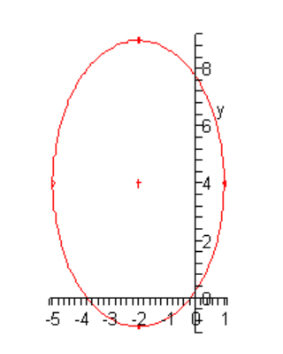

**(b)**

$$ \frac{x^2}{49} + \frac{(y - 3)^2}{4} = 1 $$

$$ \text{right most point : } (7, 3) $$

$$ \text{left most point : } (-7, 3) $$

$$ \text{top most point : } (0, 5) $$

$$ \text{bottom most point : } (0, 1) $$

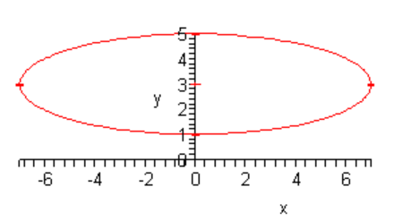

**(c\)**

$$ 4(x + 1)^2 + (y + 3)^2 = 1 $$

$$ \frac{(x + 1)^2}{\dfrac{1}{4}}+ \frac{(y + 3)^2}{1} = 1 $$

$$ \text{right most point : } (-1 + \frac{1}{2}, -3) $$

$$ \text{left most point : } (-1 - \frac{1}{2}, -3) $$

$$ \text{top most point : } (-1, -3 + 1) $$

$$ \text{bottom most point : } (-1, -3 - 1) $$

Which equates to:

$$ \text{right most point : } (-\frac{1}{2}, -3) $$

$$ \text{left most point : } (-\frac{3}{2}, -3) $$

$$ \text{top most point : } (-1, -2) $$

$$ \text{bottom most point : } (-1, -4) $$

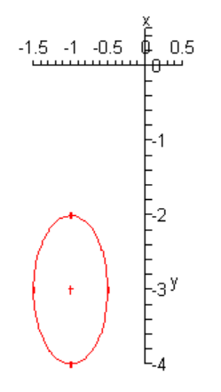

---

Finally, let’s address a comment made at the start of this section. We said that
circles are really nothing more than a special case of an ellipse. To see this
let’s assume that $a = b$. In this case we have,

$$ \frac{(x - h)^2}{a^2} + \frac{(y - k)^2}{a^2} = 1 $$

Note that we acknowledged that $a = b$ and used $a$ in both cases. Now if we
clear denominators we get,

$$ (x - h)^2 + (y - k)^2 = a^2 $$

This is the standard form of a circle with center $(h, k)$ and radius $a$. So,
circles really are special cases of ellipses.

---

## Practice Problems

For problems 1 - 3 sketch the ellipse.

**1.**

$$ \frac{(x + 3)^2}{9} + \frac{(y - 5)^2}{3} = 1 $$

$$ \frac{(x - h)^2}{a^2} + \frac{(y - k)^2}{b^2} = 1 $$

$$ \text{right most point : } (-3 + 3, 5) $$

$$ \text{left most point : } (-3 - 3, 5) $$

$$ \text{top most point : } (-3, 5 + \sqrt{3}) $$

$$ \text{bottom most point : } (-3, 5 - \sqrt{3}) $$

$$ \text{right most point : } (0, 5) $$

$$ \text{left most point : } (-6, 5) $$

$$ \text{top most point : } (-3, 6.7321) $$

$$ \text{bottom most point : } (-3, 3.2679) $$

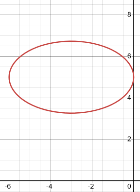

**2.**

$$ x^2 + \frac{(y - 1)^2}{4} = 1 $$

$$ \frac{(x - 0)^2}{1} + \frac{(y - 1)^2}{4} = 1 $$

$$ \frac{(x - h)^2}{a^2} + \frac{(y - k)^2}{b^2} = 1 $$

$$ \text{right most point : } (0 + 1, 1) $$

$$ \text{left most point : } (0 - 1, 1) $$

$$ \text{top most point : } (0, 1 + 2) $$

$$ \text{bottom most point : } (0, 1 - 2) $$

$$ \text{right most point : } (1, 1) $$

$$ \text{left most point : } (-1, 1) $$

$$ \text{top most point : } (0, 3) $$

$$ \text{bottom most point : } (0, -1) $$

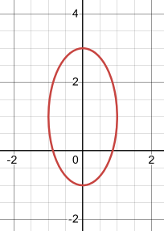

**3.**

$$ 4(x + 2)^2 + \frac{(y + 4)^2}{4} = 1 $$

$$ \frac{(x + 2)}{\dfrac{1}{4}} + \frac{(y + 4)^2}{4} = 1 $$

$$ \frac{(x - h)^2}{a^2} + \frac{(y - k)^2}{b^2} = 1 $$

$$ \text{right most point : } (-2 + \frac{1}{2}, -4) $$

$$ \text{left most point : } (-2 - \frac{1}{2}, -4) $$

$$ \text{top most point : } (-2, -4 + 2) $$

$$ \text{bottom most point : } (-2, -4 - 2) $$

$$ \text{right most point : } (-\frac{3}{2}, -4) $$

$$ \text{left most point : } (-\frac{5}{2}, -4) $$

$$ \text{top most point : } (-2, -2) $$

$$ \text{bottom most point : } (-2, -6) $$

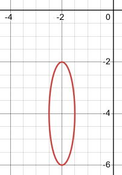

For problems 4 & 5 complete the square on the $x$ and $y$ portions of the
equation and write the equation into the standard form of the equation of the
ellipse.

**4.**

$$ x^2 + 8x + 3y^2 - 6y + 7 = 0 $$

$$ x^2 + 8x + 3(y^2 - 2y) + 7 = 0 $$

$$ \left(\frac{8}{2}\right)^2 $$

$$ (4)^2 = 16 $$

$$ \left(\frac{-2}{2}\right)^2 $$

$$ (-1)^2 = 1 $$

$$ (x^2 + 8x + 16) - 16 + 3(y^2 - 2y + 1) - 3 + 7 = 0 $$

$$ (x + 4)^2 + 3(y - 1)^2 - 16 - 3 + 7 = 0 $$

$$ (x + 4)^2 + 3(y - 1)^2 - 12 = 0 $$

$$ (x + 4)^2 + 3(y - 1)^2 = 12 $$

$$ \frac{(x + 4)^2}{12} + \frac{3(y - 1)^2}{12} = 1 $$

**5.**

$$ 9x^2 + 126x + 4y^2 - 32y + 469 = 0 $$

$$ 9(x^2 + 14x) + 4(y^2 - 8y) + 469 = 0 $$

$$ \left(\frac{14}{2}\right)^2 $$

$$ (7)^2 = 49 $$

$$ \left(\frac{-8}{2}\right)^2 $$

$$ (-4)^2 = 16 $$

$$ 9(x^2 + 14x + 49) - 441 + 4(y^2 - 8y + 16) - 64 + 469 = 0 $$

$$ 9(x + 7)^2 + 4(y - 4)^2 - 441 - 64 + 469 = 0 $$

$$ 9(x + 7)^2 + 4(y - 4)^2 - 36 = 0 $$

$$ 9(x + 7)^2 + 4(y - 4)^2 = 36 $$

$$ \frac{9(x + 7)^2}{36} + \frac{4(y - 4)^2}{36} = 1 $$

$$ \frac{(x + 7)^2}{4} + \frac{(y - 4)^2}{9} = 1 $$

---

## Assignment Problems

For problems 1 - 7 sketch the ellipse.

**1.**

$$ \frac{(x + 5)^2}{4} + \frac{(y - 2)^2}{9} = 1 $$

$$ \frac{(x - h)^2}{a^2} + \frac{(y - k)^2}{b^2} = 1 $$

$$ \text{right most point : } (-5 + 2, 2) $$

$$ \text{left most point : } (-5 - 2, 2) $$

$$ \text{top most point : } (-5, 2 + 3) $$

$$ \text{bottom most point : } (-5, 2 - 3) $$

$$ \text{right most point : } (-3, 2) $$

$$ \text{left most point : } (-7, 2) $$

$$ \text{top most point : } (-5, 5) $$

$$ \text{bottom most point : } (-5, -1) $$

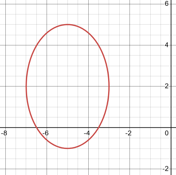

**2.**

$$ (x - 4)^2 + \frac{y^2}{16} = 1 $$

$$ \frac{(x - h)^2}{a^2} + \frac{(y - k)^2}{b^2} = 1 $$

$$ \text{right most point : } (4 + 1, 0) $$

$$ \text{left most point : } (4 - 1, 0) $$

$$ \text{top most point : } (4, 0 + 4) $$

$$ \text{bottom most point : } (4, 0 - 4) $$

$$ \text{right most point : } (5, 0) $$

$$ \text{left most point : } (3, 0) $$

$$ \text{top most point : } (4, 4) $$

$$ \text{bottom most point : } (4, -4) $$

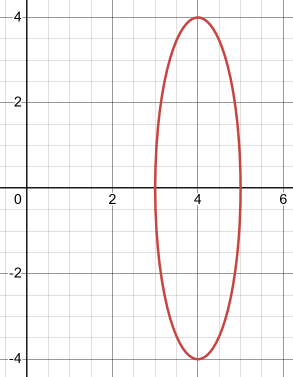

**3.**

$$ \frac{(x + 1)^2}{25} + \frac{(y + 6)^2}{4} = 1 $$

$$ \frac{(x - h)^2}{a^2} + \frac{(y - k)^2}{b^2} = 1 $$

$$ \text{right most point : } (-1 + 5, -6) $$

$$ \text{left most point : } (-1 - 5, -6) $$

$$ \text{top most point : } (-1, -6 + 2) $$

$$ \text{bottom most point : } (-1, -6 - 2) $$

$$ \text{right most point : } (4, -6) $$

$$ \text{left most point : } (-6, -6) $$

$$ \text{top most point : } (-1, -4) $$

$$ \text{bottom most point : } (-1, -8) $$

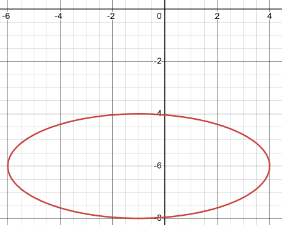

**4.**

$$ \frac{(x - 3)^2}{5} + \frac{(y + 1)^2}{12} = 1 $$

$$ \frac{(x - h)^2}{a^2} + \frac{(y - k)^2}{b^2} = 1 $$

$$ \text{right most point : } (3 + \sqrt{5}, -1) $$

$$ \text{left most point : } (3 - \sqrt{5}, -1) $$

$$ \text{top most point : } (3, -1 + \sqrt{12}) $$

$$ \text{bottom most point : } (3, -1 - \sqrt{12}) $$

$$ \text{right most point : } (5.2361, -1) $$

$$ \text{left most point : } (0.7639, -1) $$

$$ \text{top most point : } (3, 2.4641) $$

$$ \text{bottom most point : } (3, -4.4641) $$

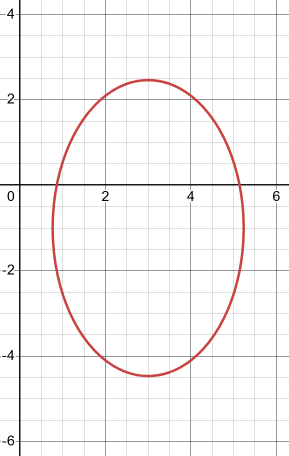

**5.**

$$ 9(x - 2)^2 + 4(y - 3)^2 = 1 $$

$$ \frac{(x - 2)^2}{\dfrac{1}{9}} + \frac{(y - 3)^2}{\dfrac{1}{4}} = 1 $$

$$ \frac{(x - h)^2}{a^2} + \frac{(y - k)^2}{b^2} = 1 $$

$$ \text{right most point : } \left(2 + \frac{1}{3}, 3\right) $$

$$ \text{left most point : } \left(2 - \frac{1}{3}, 3\right) $$

$$ \text{top most point : } \left(2, 3 + \frac{1}{2}\right) $$

$$ \text{bottom most point : } \left(2, 3 - \frac{1}{2}\right) $$

$$ \text{right most point : } \left(\frac{7}{3}, 3\right) $$

$$ \text{left most point : } \left(\frac{5}{3}, 3\right) $$

$$ \text{top most point : } \left(2, \frac{7}{2}\right) $$

$$ \text{bottom most point : } \left(2, \frac{5}{2}\right) $$

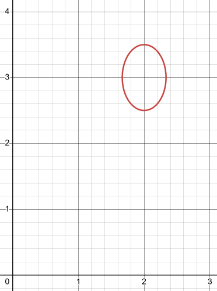

**6.**

$$ \frac{(x - 3)^2}{9} + 2(y + 4)^2 = 1 $$

$$ \frac{(x - 3)^2}{9} + \frac{(y + 4)^2}{\dfrac{1}{2}} = 1 $$

$$ \frac{(x - h)^2}{a^2} + \frac{(y - k)^2}{b^2} = 1 $$

$$ \text{right most point : } (3 + 3, -4) $$

$$ \text{left most point : } (3 - 3, -4) $$

$$ \text{top most point : } \left(3, -4 + \sqrt{\frac{1}{2}}\right) $$

$$ \text{bottom most point : } \left(3, -4 - \sqrt{\frac{1}{2}}\right) $$

$$ \text{right most point : } (6, -4) $$

$$ \text{left most point : } (0, -4) $$

$$ \text{top most point : } (3, -3.2929) $$

$$ \text{bottom most point : } (3, -4.7071) $$

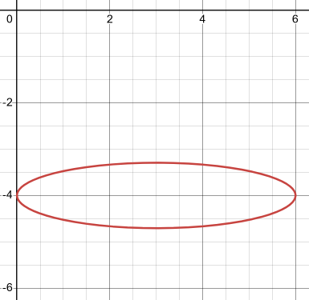

**7.**

$$ \frac{(x - 4)^2}{9} + \frac{(y - 1)^2}{9} = 1 $$

$$ \frac{(x - h)^2}{a^2} + \frac{(y - k)^2}{b^2} = 1 $$

$$ \text{right most point : } (4 + 3, 1) $$

$$ \text{left most point : } (4 - 3, 1) $$

$$ \text{top most point : } (4, 1 + 3) $$

$$ \text{bottom most point : } (4, 1 - 3) $$

$$ \text{right most point : } (7, 1) $$

$$ \text{left most point : } (1, 1) $$

$$ \text{top most point : } (4, 4) $$

$$ \text{bottom most point : } (4, -2) $$

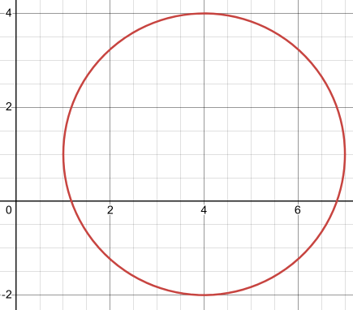

For problems 8 - 10 complete the square on the $x$ and $y$ portions of the
equation and write the equation into the standard form of the equation of the
ellipse.

**8.**

$$ 4x^2 - 16x + y^2 + 2y + 13 = 0 $$

$$ 4(x^2 - 4x) + (y^2 + 2y) + 13 = 0 $$

$$ \left(\frac{-4}{2}\right)^2 $$

$$ (-2)^2 = 4 $$

$$ \left(\frac{2}{2}\right)^2 $$

$$ (1)^2 = 1 $$

$$ 4(x^2 - 4x + 4) - 16 + (y^2 + 2y + 1) - 1 + 13 = 0 $$

$$ 4(x - 2)^2 + (y + 1)^2 - 16 - 1 + 13 = 0 $$

$$ 4(x - 2)^2 + (y + 1)^2 - 4 = 0 $$

$$ 4(x - 2)^2 + (y + 1)^2 = 4 $$

$$ \frac{4(x - 2)^2}{4} + \frac{(y + 1)^2}{4} = 1 $$

$$ (x - 2)^2 + \frac{(y + 1)^2}{4} = 1 $$

**9.**

$$ x^2 + 6x + 4y^2 + 16y + 9 = 0 $$

$$ (x^2 + 6x) + 4(y^2 + 4y) + 9 = 0 $$

$$ \left(\frac{6}{2}\right)^2 $$

$$ (3)^2 = 9 $$

$$ \left(\frac{4}{2}\right)^2 $$

$$ (2)^2 = 4 $$

$$ (x^2 + 6x + 9) - 9 + 4(y^2 + 4y + 4) - 16 + 9 = 0 $$

$$ (x + 3)^2 + 4(y + 2)^2 - 9 - 16 + 9 = 0 $$

$$ (x + 3)^2 + 4(y + 2)^2 - 16 = 0 $$

$$ (x + 3)^2 + 4(y + 2)^2 = 16 $$

$$ \frac{(x + 3)^2}{16} + \frac{4(y + 2)^2}{16} = 1 $$

$$ \frac{(x + 3)^2}{16} + \frac{(y + 2)^2}{4} = 1 $$

**10.**

$$ 5x^2 + 10x + 3y^2 - 6y - 7 = 0 $$

$$ 5(x^2 + 2x) + 3(y^2 - 2y) - 7 = 0 $$

$$ \left(\frac{2}{2}\right)^2 $$

$$ (1)^2 = 1 $$

$$ \left(\frac{-2}{2}\right)^2 $$

$$ (-1)^2 = 1 $$

$$ 5(x^2 + 2x + 1) - 5 + 3(y^2 - 2y + 1) - 3 - 7 = 0 $$

$$ 5(x + 1)^2 + 3(y - 1)^2 - 5 - 3 - 7 = 0 $$

$$ 5(x + 1)^2 + 3(y - 1)^2 - 15 = 0 $$

$$ 5(x + 1)^2 + 3(y - 1)^2 = 15 $$

$$ \frac{5(x + 1)^2}{15} + \frac{3(y - 1)^2}{15} = 1 $$

$$ \frac{(x + 1)^2}{3} + \frac{(y - 1)^2}{5} = 1 $$
