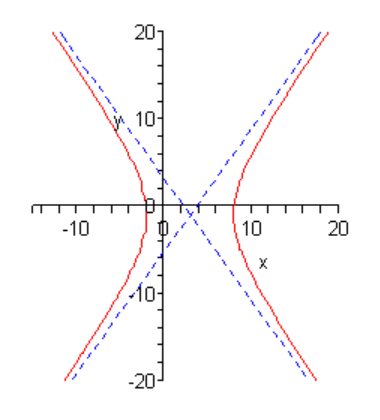

# 4.4 Hyperbolas

---

The next graph that we need to look at is the hyperbola. There are two basic
forms of a hyperbola. Here are examples of each.

Hyperbolas consist of two vaguely parabola shaped pieces that open either up and
down or right and left. Also, just like parabolas each of the pieces has a
vertex. Note that they aren’t really parabolas, they just resemble parabolas.

There are also two lines on each graph. These lines are called asymptotes and as
the graphs show as we make $x$ large (in both the positive and negative sense)
the graph of the hyperbola gets closer and closer to the asymptotes. The
asymptotes are not officially part of the graph of the hyperbola. However, they
are usually included so that we can make sure and get the sketch correct. The
point where the two asymptotes cross is called the center of the hyperbola.

There are two **standard forms** of the hyperbola, one for each type shown
above. Here is a table giving each form as well as the information we can get
from each one.

|                         |                                                       |                                                       |
| ----------------------- | ----------------------------------------------------- | ----------------------------------------------------- |
| Form                    | $\dfrac{(x - h)^2}{a^2} - \dfrac{(y - k)^2}{b^2} = 1$ | $\dfrac{(y - k)^2}{b^2} - \dfrac{(x - h)^2}{a^2} = 1$ |
| Center                  | $(h, k)$                                              | $(h, k)$                                              |
| Opens                   | $\text{Opens left and right}$                         | $\text{Opens up and down}$                            |
| Vertices                | $(h + a, k) \text{ and } (h - a, k)$                  | $(h, k + b) \text{ and } (h, k - b)$                  |
| Slope of Asymptotes     | $\pm \dfrac{b}{a}$                                    | $\pm \dfrac{b}{a}$                                    |
| Equations of Asymptotes | $y = k \pm \dfrac{b}{a}(x - h)$                       | $y = k \pm \dfrac{b}{a}(x - h)$                       |

Note that the difference between the two forms is which term has the minus sign.
If the $y$ term has the minus sign then the hyperbola will open left and right.
If the $x$ term has the minus sign then the hyperbola will open up and down.

We got the equations of the asymptotes by using the point-slope form of the line
and the fact that we know that the asymptotes will go through the center of the
hyperbola.

Let’s take a look at a couple of these.

---

**Example 1**

Sketch the graph of each of the following hyperbolas.

**(a)**

$$ \frac{(x - 3)^2}{25} - \frac{(y + 1)^2}{49} = 1 $$

Now, notice that the $y$ term has the minus sign and so we know that we’re in
the first column of the table above and that the hyperbola will be opening left
and right.

The first thing that we should get is the center since pretty much everything
else is built around that. The center in this case is $(3, −1)$ and as always
watch the signs! Once we have the center we can get the vertices. These are
$(8, −1)$ and $(−2, −1)$.

Next, we should get the slopes of the asymptotes. These are always the square
root of the number under the $y$ term divided by the square root of the number
under the $x$ term and there will always be a positive and a negative slope. The
slopes are then $\pm \dfrac{7}{5}$.

Now that we've got the center and the slopes of the asymptotes we can get the
equations for the asymptotes. They are,

$$ y = -1 + \frac{7}{5}(x - 3) \text{ and } y = -1 - \frac{7}{5}(x - 3) $$

We can now start the sketching. We start by sketching the asymptotes and the
vertices. Once these are done we know what the basic shape should look like so
we sketch it in making sure that as x gets large we move in closer and closer to
the asymptotes.

Here is the sketch for this hyperbola.

**(b)**

$$ \frac{y^2}{9} - (x + 2)^2 = 1 $$

In this case the hyperbola will open up and down since the $x$ term has the
minus sign. Now, the center of this hyperbola is $(-2, 0)$. Remember that since
theree is a $y^2$ term by itself we had to have $k = 0$. At this point we also
know that the vertices are $(-2, 3)$ and $(-2, -3)$.

In order to see the slopes of the asymptotes let's rewrite the equation a
little.

$$ \frac{y^2}{9} - \frac{(x + 2)^2}{1} = 1 $$

So, the slopes of the asymptotes are $\pm \dfrac{3}{1} = \pm 3$. The equations
of the asymptotes are then,

$$ y = 0 + 3(x + 2) = 3x + 6 \text{ and } y = 0 - 3(x + 2) = -3x - 6 $$

Here is the sketch of this hyperbola.

---

## Practice Problems

For problems 1 - 3 sketch the hyperbola.

**1.**

$$ \frac{y^2}{16} - \frac{(x - 2)^2}{9} = 1 $$

Find the Center: $(2, 0)$

Find the Direction Hyperbola Opens: up and down

Find Vertices:

Because it opens up and down, the formula for finding the vertices is:

$$ (h, k + b) \text{ and } (h, k - b) $$

$$ (2, 0 + 4) \text{ and } (2, 0 - 4) $$

$$ (2, 4) \text{ and } (2, -4) $$

Find Slope of Asymptotes:

$$ \pm \frac{b}{a} $$

$$ \pm \frac{4}{3} $$

Find Equation of Asymptotes:

$$ y = k \pm \frac{b}{a}(x - h) $$

$$ y = 0 \pm \frac{4}{3}(x - 2) $$

$$ y = 0 + \frac{4}{3}(x - 2) \text{ and } y = 0 - \frac{4}{3}(x - 2) $$

**2.**

$$ \frac{(x + 3)^2}{4} - \frac{(y - 1)^2}{9} = 1 $$

Find the Center: $(-3, 1)$

Find the Direction Hyperbola Opens: Opens Left and Right.

Find Vertices:

Because it opens left and right the formula for finding the vertices is:

$$ (h + a, k) \text{ and } (h - a, k) $$

$$ (-3 + 2, 1) \text{ and } (-3 - 2, 1) $$

$$ (-1, 1) \text{ and } (-5, 1) $$

Find Slope of Asymptotes:

$$ \pm \frac{b}{a} $$

$$ \pm \frac{3}{2} $$

Find Equation of Asymptotes:

$$ y = 2 \pm \frac{3}{2}(x - (-3)) $$

$$ y = 2 \pm \frac{3}{2}(x + 3) $$

$$ y = 2 + \frac{3}{2}(x + 3) \text{ and } y = 2 - \frac{3}{2}(x + 3) $$

$$ y = 2x + \frac{9}{2} \text{ and } y = 2x - \frac{9}{2} $$

**3.**

$$ 3(x - 1)^2 - \frac{(y + 1)^2}{2} = 1 $$

$$ \frac{(x - 1)^2}{\dfrac{1}{3}} - \frac{(y + 1)^2}{2} = 1 $$

Find the Center: $(1, -1)$

Find the Direction Hyperbola Opens: Right and Left

Find Vertices:

$$ (h + a, k) \text{ and } (h - a, k) $$

$$ \left(1 + \sqrt{\frac{1}{3}}, -1\right) \text{ and } \left(1 - \sqrt{\frac{1}{3}}, -1\right) $$

$$ (1.5774, -1)  \text{ and } (0.4226, -1) $$

Find Slope of Asymptotes:

$$ \pm \frac{b}{a} $$

$$ \pm \frac{\sqrt{2}}{\sqrt{\dfrac{1}{3}}} $$

$$ \pm 2.4495 $$

Find Equation of Asymptotes:

$$ y = k \pm \dfrac{b}{a}(x - h) $$

$$ \frac{(x - 1)^2}{\dfrac{1}{3}} - \frac{(y + 1)^2}{2} = 1 $$

$$ y = -1 \pm \frac{\sqrt{2}}{\sqrt{\dfrac{1}{3}}}(x - 1) $$

$$ y = -1 + 2.4495(x - 1) \text{ and } -1 - 2.4495(x - 1) $$

For problems 4 & 5 complete the square on the $x$ and $y$ portions of the
equation and write the equation into the standard form of the equation of the
hyperbola.

**4.**

NOTE: Paul's Solution to this problem is incorrect as he copied his own problem
incorrectly when solving.

$$ 4x^2 - 32x - y^2 - 4y + 24 = 0 $$

$$ 4(x^2 - 8x) - (y^2 - 4y) + 24 = 0 $$

$$ \left(\frac{-8}{2}\right)^2 $$

$$ (-4)^2 = 16 $$

$$ \left(\frac{-4}{2}\right)^2 $$

$$ (-2)^2 = 4 $$

$$ 4(x^2 - 8x + 16) - 64 - (y^2 - 4y + 4) - 4 + 24 = 0 $$

$$ 4(x - 4)^2 - (y - 2)^2 - 64 - 4 + 24 = 0 $$

$$ 4(x - 4)^2 - (y - 2)^2 - 44 = 0 $$

$$ 4(x - 4)^2 - (y - 2)^2 = 44 $$

$$ \frac{4(x - 4)^2}{44} - \frac{(y - 2)^2}{44} = 1 $$

$$ \frac{(x - 4)^2}{11} - \frac{(y - 2)^2}{44} = 1 $$

**5.**

$$ 25y^2 + 250y - 16x^2 - 32x + 209 = 0 $$

$$ 25(y^2 + 10y) - 16(x^2 - 2x) + 209 = 0 $$

$$ \left(\frac{10}{2}\right)^2 $$

$$ (5)^2 = 25 $$

$$ \left(\frac{-2}{2}\right)^2 $$

$$ (-1)^2 = 1 $$

$$ 25(y^2 + 10y + 25) - 625 - 16(x^2 - 2x + 1) + 16 + 209 = 0 $$

$$ 25(y + 5)^2 - 16(x - 1)^2 - 625 + 16 + 209 = 0 $$

$$ 25(y + 5)^2 - 16(x - 1)^2 - 400 = 0 $$

$$ 25(y + 5)^2 - 16(x - 1)^2 = 400 $$

$$ \frac{25(y + 5)^2}{400} - \frac{16(x - 1)^2}{400} = 1 $$

$$ \frac{(y + 5)^2}{16} - \frac{(x - 1)^2}{25} = 1 $$

---

## Assignment Problems

For problems 1 - 5 sketch the hyperbola.

**1.**

$$ \frac{x^2}{9} - \frac{y^2}{4} = 1 $$

Find the Center: $(0, 0)$

Opens in which direction?: left/right

Find The Vertices:

$$ (h + a, k) \text{ and } (h - a, k) $$

$$ (0 + 3, 0) \text{ and } (0 - 3, 0) $$

$$ (3, 0) \text{ and } (-3, 0) $$

Find The Slope of the Asymptotes:

$$ \pm \frac{b}{a} $$

$$ \pm \frac{2}{3} $$

Find the Equations of the Asymptotes:

$$ y = k \pm \frac{b}{a}(x - h) $$

$$ y = 0 \pm \frac{2}{3}(x - 0) $$

$$ y = \pm \frac{2}{3}(x) $$

$$ y = \frac{2}{3}x \text{ and } -\frac{2}{3}x $$

**2.**

$$ \frac{(y + 3)^2}{36} - \frac{(x + 2)^2}{16} = 1 $$

Find the Center: $(-2, -3)$

Opens in which direction?: up/down

Find The Vertices:

$$ (h, k + b) \text{ and } (h, k - b) $$

$$ (-2, -3 + 6) \text{ and } (-2, -3 - 6) $$

$$ (-2, 3) \text{ and } (-2, -9) $$

Find The Slope of the Asymptotes:

$$ \pm \frac{6}{4} $$

$$ \pm \frac{3}{2} $$

Find the Equations of the Asymptotes:

$$ y = k \pm \frac{b}{a}(x - h) $$

$$ y = -3 \pm \frac{3}{2}(x - (-2)) $$

$$ y = -3 \pm \frac{3}{2}(x + 2) $$

$$ y = -3 + \frac{3}{2}(x + 2) \text{ and } -3 - \frac{3}{2}(x + 2) $$

**3.**

$$ \frac{(y - 5)^2}{49} - \frac{x^2}{64} = 1 $$

Find the Center: $(0, 5)$

Opens in which direction?: up/down

Find The Vertices:

$$ (0, 5 + 7) \text{ and } (0, 5 - 7) $$

$$ (0, 12) \text{ and } (0, -2) $$

Find The Slope of the Asymptotes:

$$ \pm \frac{b}{a} $$

$$ \pm \frac{7}{8} $$

Find the Equations of the Asymptotes:

$$ y = k \pm \frac{b}{a}(x - h) $$

$$ y = 7 \pm \frac{7}{8}(x - 0) $$

$$ y = 7 \pm \frac{7}{8}x $$

$$ y = 7 + \frac{7}{8}x \text{ and } y = 7 - \frac{7}{8}x $$

**4.**

$$ 9(x - 4)^2 - \frac{(y - 1)^2}{4} = 1 $$

$$ \frac{(x - 4)^2}{\dfrac{1}{9}} - \frac{(y - 1)^2}{4} = 1 $$

Find the Center: $(4, 1)$

Opens in which direction?: left/right

Find The Vertices:

$$ (h + a, k) \text{ and } (h - a, k) $$

$$ \left(4 + \frac{1}{3}, 1\right) \text{ and } \left(4 - \frac{1}{3}, 1\right) $$

$$ \left(\frac{13}{3}, 1\right) \text{ and } \left(\frac{11}{3}, 1\right) $$

Find The Slope of the Asymptotes:

$$ \pm \frac{b}{a} $$

$$ \pm \frac{2}{\dfrac{1}{3}} $$

$$ \pm 6 $$

Find the Equations of the Asymptotes:

$$ y = k \pm \frac{b}{a}(x - h) $$

$$ y = 1 \pm 6(x - 4) $$

$$ y = 1 \pm 6x - 24 $$

$$ y = 1 + 6x - 24 \text{ and } y = 1 - 6x + 24 $$

$$ y = 6x - 23 \text{ and } y = -6x + 25 $$

**5.**

$$ \frac{1}{25}(y + 1)^2 - 15(x - 3)^2 = 1 $$

$$ \frac{(y + 1)^2}{25} - \frac{(x - 3)^2}{\dfrac{1}{15}} = 1 $$

Find the Center: $(3, -1)$

Opens in which direction?: up/down

Find The Vertices:

$$ (3, -1 + 5) \text{ and } (3, -1 - 5) $$

$$ (3, 4) \text{ and } (3, -6) $$

Find The Slope of the Asymptotes:

$$ \pm \frac{b}{a} $$

$$ \pm \frac{5}{\sqrt{\dfrac{1}{15}}} $$

$$ \pm 5\sqrt{15} $$

$$ \pm 19.3649 $$

Find the Equations of the Asymptotes:

$$ y = k \pm \frac{b}{a}(x - h) $$

$$ y = -1 \pm 5\sqrt{15}(x - 3) $$

$$ y = -1 \pm 19.3649(x - 3) $$

$$ y = -1 \pm 19.3649x - 58.0947 $$

$$ y = \pm 19.3649x - 59.0947 $$

$$ y = 19.3649x - 59.0947 \text{ and } y = -19.3649x + 49.0947 $$

For problems 6 - 8 complete the square on the $x$ and $y$ portions of the
equation and write the equation into the standard form of the equation of the
hyperbola.

**6.**

$$ 9x^2 - 4y^2 + 48y - 180 = 0 $$

$$ 9x^2 - 4(y^2 + 12y) - 180 = 0 $$

$$ \left(\frac{12}{2}\right)^2 $$

$$ (6)^2 = 36 $$

$$ 9x^2 - 4(y^2 + 12y + 36) - 144 - 180 = 0 $$

$$ 9x^2 - 4(y + 6)^2 - 144 - 180 = 0 $$

$$ 9x^2 - 4(y + 6)^2 - 324 = 0 $$

$$ 9x^2 - 4(y + 6)^2 = 324 $$

$$ \frac{9x^2}{324} - \frac{4(y + 6)^2}{324} = 1 $$

$$ \frac{x^2}{36} - \frac{(y + 6)^2}{81} = 1 $$

**7.**

$$ y^2 - 6y - 4x^2 - 8x - 11 = 0 $$

$$ (y^2 - 6y) - 4(x^2 - 2x) - 11 = 0 $$

$$ \left(\frac{-6}{2}\right)^2 $$

$$ (-3)^2 = 9 $$

$$ \left(\frac{-2}{2}\right)^2 $$

$$ (-1)^2 = 1 $$

$$ (y^2 - 6y + 9) - 9 - 4(x^2 - 2x + 1) + 4 - 11 = 0 $$

$$ (y - 3)^2 - 4(x - 1)^2 - 9 + 4 - 11 = 0 $$

$$ (y - 3)^2 - 4(x - 1)^2 - 16 = 0 $$

$$ (y - 3)^2 - 4(x - 1)^2 = 16 $$

$$ \frac{(y - 3)^2}{16} - \frac{4(x - 1)^2}{16} = 1 $$

$$ \frac{(y - 3)^2}{16} - \frac{(x - 1)^2}{4} = 1 $$

**8.**

$$ 7x^2 - 28x - 4y^2 + 40y - 100 = 0 $$

$$ 7(x^2 - 4x) - 4(y^2 + 10y) - 100 = 0 $$

$$ \left(\frac{-4}{2}\right)^2 $$

$$ (-2)^2 = 4 $$

$$ \left(\frac{10}{2}\right)^2 $$

$$ (5)^2 = 25 $$

$$ 7(x^2 - 4x + 4) - 28 - 4(y^2 + 10y + 25) - 100 - 100 = 0 $$

$$ 7(x - 2)^2 - 4(y + 5)^2 - 28 - 100 - 100 = 0 $$

$$ 7(x - 2)^2 - 4(y + 5)^2 - 228 = 0 $$

$$ 7(x - 2)^2 - 4(y + 5)^2 = 228 $$

$$ \frac{7(x - 2)^2}{228} - \frac{4(y + 5)^2}{228} = 1 $$

$$ \frac{7(x - 2)^2}{228} - \frac{(y + 5)^2}{57} = 1 $$
