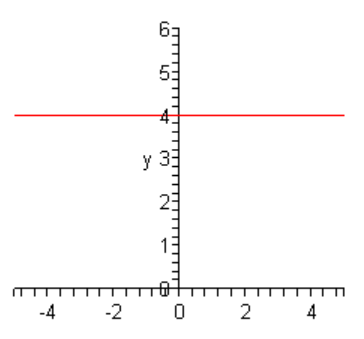
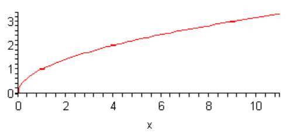
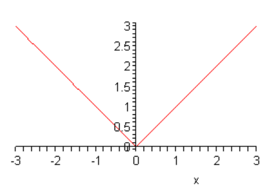
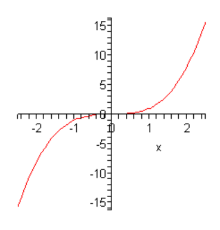

# 4.5 Miscellaneous Functions

The point of this section is to introduce you to some other functions that don’t
really require the work to graph that the ones that we’ve looked at to this
point in this chapter. For most of these all that we’ll need to do is evaluate
the function as some $x$’s and then plot the points.

**Constant Function**

This is probably the easiest function that we’ll ever graph and yet it is one of
the functions that tend to cause problems for students.

The most general form for the constant function is,

$$ f(x) = c $$

where $c$ is some number.

Let’s take a look at $f(x) = 4$ so we can see what the graph of constant
functions look like. Probably the biggest problem students have with these
functions is that there are no $x$’s on the right side to plug into for
evaluation. However, all that means is that there is no substitution to do. In
other words, no matter what x we plug into the function we will always get a
value of 4 (or $c$ in the general case) out of the function.

So, every point has a $y$ coordinate of 4. This is exactly what defines a
horizontal line. In fact, if we recall that $f(x)$ is nothing more than a fancy
way of writing $y$ we can rewrite the function as,

$$ y = 4 $$

And this is exactly the equation of a horizontal line.

Here is the graph of this function.

**Square Root**

Next, we want to take a look at $f(x) = \sqrt{x}$. First, note that since we
don’t want to get complex numbers out of a function evaluation we have to
restrict the values of $x$ that we can plug in. We can only plug in value of $x$
in the range $x \geq 0$. This means that our graph will only exist in this range
as well.

To get the graph we’ll just plug in some values of $x$ and then plot the points.

| $x$ | $f(x)$ |
| --- | ------ |
| $0$ | $0$    |
| $1$ | $1$    |
| $4$ | $2$    |
| $9$ | $3$    |

The graph is then,

**Absolute Value**

We’ve dealt with this function several times already. It’s now time to graph it.
First, let’s remind ourselves of the definition of the absolute value function.

$$
f(x) =
\begin{cases}
x & \text{if } x \geq 0 \\
-x & \text{if } x < 0
\end{cases}
$$

This is a piecewise function and we’ve seen how to graph these already. All that
we need to do is get some points in both ranges and plot them.

Here are some function evaluations.

| $x$  | $f(x)$ |
| ---- | ------ |
| $0$  | $0$    |
| $1$  | $1$    |
| $-1$ | $1$    |
| $2$  | $2$    |
| $-2$ | $2$    |

Here is the graph of this function.

So, this is a “V” shaped graph.

**Cubic Function**

We’re not actually going to look at a general cubic polynomial here. We’ll do
some of those in the next chapter. Here we are only going to look at
$f(x) = x^3$. There really isn’t much to do here other than just plugging in
some points and plotting.

| $x$  | $f(x)$ |
| ---- | ------ |
| $0$  | $0$    |
| $1$  | $1$    |
| $-1$ | $-1$   |
| $2$  | $8$    |
| $-2$ | $-8$   |

Here is the graph of this function.

We will need some of these in the next section so make sure that you can
identify these when you see them and can sketch their graphs fairly quickly.
