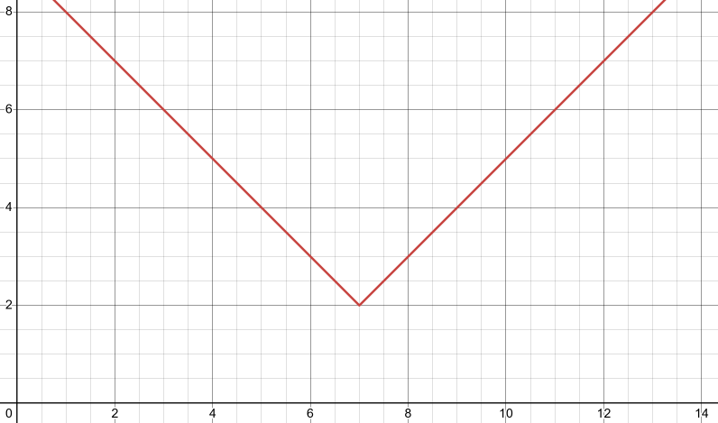
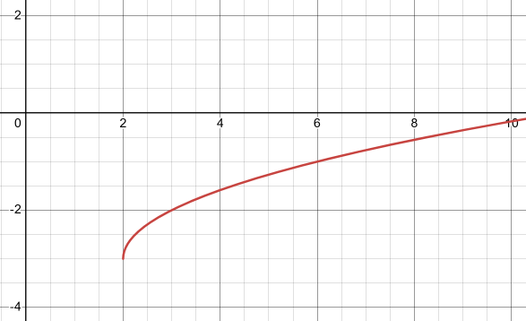

# 4.6 Transformations

---

In this section we are going to see how knowledge of some fairly simple graphs
can help us graph some more complicated graphs. Collectively the methods we’re
going to be looking at in this section are called **transformations**.

**Vertical Shifts**

The first transformation we’ll look at is a vertical shift.

> Given the grraph of $f(x)$ the graph of $g(x) = f(x) + c$ will be the graph of
> $f(x)$ shifted up by $c$ units if $c$ is positive and/or down by $c$ units if
> $c$ is negative.

So, if we can graph $f(x)$ getting the graph of $g(x$) is fairly easy. Let's
take a look at a couple of examples.

---

**Example 1**

Using transformations sketch the graph of the following functions.

The first thing to do here is graph the function without the constant which by
this point should be fairly simple for you. Then shift accordingly.

**(a)**

$$ g(x) = x^2 + 3 $$

In this case we first need to graph $x^2$ (the dotted line on the graph below)
and then pick this up and shift it upwards by 3. Coordinate wise this will mean
adding 3 onto all the $y$ coordinates of points on $x^2$.

Here is the sketch for this one.

**(b)**

$$ f(x) = \sqrt{x} - 5 $$

Okay, in this case we're going to be shifting the graph of $\sqrt{x}$ (the
dotted line on the graph below) down by 5. Again, from a coordinate standpoint
this means that we subtract 5 from the $y$ coordinates of poitns on $\sqrt{x}$.

Here is this graph.

---

So, vertical shifts aren’t all that bad if we can graph the “base” function
first. Note as well that if you’re not sure that you believe the graphs in the
previous set of examples all you need to do is plug a couple values of x into
the function and verify that they are in fact the correct graphs.

---

**Horizontal Shifts**

These are fairly simple as well although there is one bit where we need to be
careful.

> Given the graph of $f(x)$ the graph of $g(x) = f(x + c)$ will be the graph of
> $f(x)$ shifted left by $c$ units if $c$ is positive and/or right by $c$ units
> if $c$ is negative.

Now, we need to be careful here. A positive $c$ shifts a graph in the negative
direction and a negative $c$ shifts a graph in the positive direction. They are
exactly opposite than vertical shifts and it's easy to flip these around and
shift incorrectly if we aren't being careful.

---

**Example 2**

Using transformations sketch the graph of the following functions.

**(a)**

$$ h(x) = (x + 2)^3 $$

Okay, with these we need to first identify the “base” function. That is the
function that’s being shifted. In this case it looks like we are shifting
$f(x) = x^3$. We can then see that,

$$ h(x) = (x + 2)^3 = f(x + 2) $$

In this case $c = 2$ and so we're going to shift the graph of $f(x) = x^3$ (the
dotted line on the graph below) and move it 2 units to the left. This will mean
subtracting 2 from the $x$ coordinates of all the points on $f(x) = x^3$.

Here is the graph for this problem.

**(b)**

$$ g(x) = \sqrt{x - 4} $$

In this case it looks like the base function is $\sqrt{x}$ and it also looks
like $c = -4$ and so we will be shifting the graph of $\sqrt{x}$ (the dotted
line on the graph below) to the right by 4 units. In terms of coordinates this
will mean that we're going to add 4 onto the $x$ coordinate of all the points on
$\sqrt{x}$.

Here is the sketch for this function.

---

**Vertical and Horizontal Shifts**

Now we can also combine the two shifts we just got done looking at into a single
problem. If we know the graph of $f(x)$ the graph of $g(x) = f(x + c) + k$ will
be the graph of $f(x)$ shifted left or right by $c$ units depending on the sign
of $c$ and up or down by $k$ units depending on the sign of $k$.

Let's take a look at a couple of examples.

---

**Example 3**

Use transformation to sketch the graph of each of the following.

**(a)**

$$ f(x) = (x - 2)^2 + 4 $$

In this part it looks like the base function is $x^2$ and it looks like it will
be shifted to the right by 2 (since $c = -2$) and up by 4 (since $k = 4)$. Here
is the sketch of this function.

**(b)**

$$ g(x) = |x + 3| - 5 $$

For this part we will be shifting $|x|$ to the left by 3 (since $c = 3$) and
down 5 (since $k = -5$). Here is the sketch of this function.

---

**Reflections**

The final set of transformations that we're going to be looking at in this
section aren't shifts, but instead they are called reflections and there are two
of them.

**Reflection about the $x$-axis**

> Given the graph of $f(x)$ then the graph of $g(x) = -f(x)$ is the graph of
> $f(x)$ _reflected_ about the $x$-axis. This means that the signs on all of the
> $y$ coordinates are changed to the opposite sign.

**Reflection about the $y$-axis**

> Given the graph of $f(x)$ then the graph of $g(x) = f(-x)$ is the graph of
> $f(x)$ _reflected_ about the $y$-axis. This means that the signs on all of the
> $x$ coordinates are changed to the opposite sign.

Here is an example of each.

---

**Example 4**

Using transformation sketch the graph of each of the following.

**(a)**

$$ g(x) = -x^2 $$

Based on the placement of the minus sign (_i.e._ it's outside the square and NOT
inside the square, or $(-x)^2$) it looks like we will be reflecting $x^2$ about
the $x$-axis. So, again, the means that all we do is change the sign on all the
$y$ coordinates.

Here is the sketch of this graph.

**(b)**

$$ h(x) = \sqrt{-x} $$

Now with this one let's first address the minus sign under the square root in
more general terms. We know that we can't take the square roots of negative
numbers, however the presence of that minus sign doesn't necessarily cause
problems. We won't be able to plug positive values of $x$ into the function
since that would give square roots of negative numbers. However, if $x$ were
negative, then the negative of a negative number is positive and that is okay.
For instance,

$$ h(-4) = \sqrt{-(-4)} = \sqrt{4} = 2 $$

So, don't get all worried about that minus sign.

Now, let's address the reflection here. Since the minus sign is under the square
root as opposed to in front of it we are doing a reflection about the $y$-axis.
This means that we'll need to change all the signs of points on $\sqrt{x}$.

Note as well that this syncs up with our discussion on this minus sign at the
start of this part.

Here is the graph for this function.

---

## Practice Problems

Use transformations to sketch the graph of the following functions.

**1.**

$$ f(x) = \sqrt{x} + 4 $$

**2.**

$$ f(x) = x^3 - 2 $$

**3.**

$$ f(x) = |x + 2| $$

**4.**

$$ f(x) = (x - 5)^2 $$

**5.**

$$ f(x) = -x^3 $$

**6.**

$$ f(x) = \sqrt{x + 4} - 3 $$

**7.**

$$ f(x) = |x - 7| + 2 $$

---

## Assignment Problems

Use transformations to sketch the graph of the following functions.

**1.**

$$ f(x) = |x| - 4 $$

**2.**

$$ f(x) = \sqrt{x} - 3 $$

**3.**

$$ f(x) = x^2 + 7 $$

**4.**

$$ f(x) = \sqrt{x + 2} $$

**5.**

$$ f(x) = (x + 3)^2 $$

**6.**

$$ f(x) = |x - 1| $$

**7.**

$$ f(x) = -|x| $$

**8.**

$$ f(x) = -\sqrt{x} $$

**9.**

$$ f(x) = (-x)^3 $$

**10.**

$$ f(x) = |-x| $$

**11.**

$$ f(x) = \sqrt{x - 2} - 3 $$

**12.**

$$ f(x) = (x + 1)^2 - 4 $$

**13.**

$$ f(x) = |x + 2| + 4 $$

**14.**

$$ f(x) = (x - 5)^3 + 2 $$

