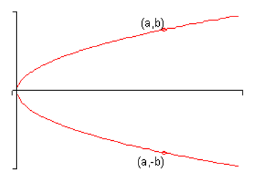
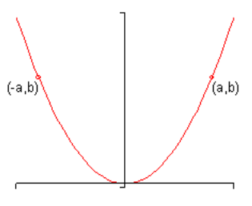
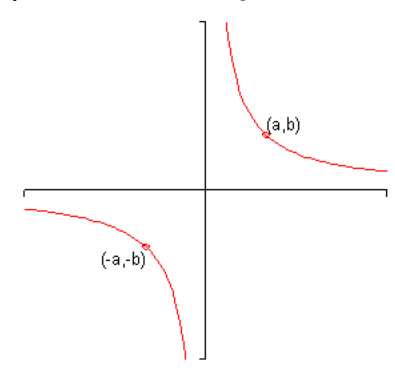

# 4.7 Symmetry

In this section we are going to take a look at something that we used back when
we were graphing parabolas. However, we’re going to take a more general view of
it this section. Many graphs have **symmetry** to them.

Symmetry can be useful in graphing an equation since it says that if we know one
portion of the graph then we will also know the remaining (and symmetric)
portion of the graph as well. We used this fact when we were graphing parabolas
to get an extra point of some of the graphs.

In this section we want to look at three types of symmetry.

1. A graph is said to be **symmetric about the $x$-axis** if whenever $(a, b)$
   is on the graph then so is $(a, -b)$. Here is a sketch of a graph that is
   symmetric about the $x$-axis.

2. A graph is said to be **symmetric about the $y$-axis** if whenever $(a, b)$
   is on the graph then so is $(-a, b)$. Here is a sketch of a graph that is
   symmetric about the $y$-axis.

3. A graph is said to be **symmetric about the origin** if whenever $(a, b)$ is
   on the graph then so is $(-a, -b)$. Here is a sketch of a graph that is
   symmetric about the origin.

Now that most graphs don't have any kind of symmetry. Also, it is possible for a
graph to have more than one kind of symmetry. For example, the graph of a circle
centered at the origin exhibits all three symmetries.

---

**Tests for Symmetry**

> We've some fairly simple tests for each of the different types of symmetry.
>
> 1. A graph will have symmetry about the $x$-axis if we get an equivalent
>    equation when all the $y$'s are replaced with $-y$.
> 2. A graph will have symmetry about the $y$-axis if we get an equivalent
>    equation when all the $x$'s are replaced with $-x$.
> 3. A grpah will have symmetry about the origin if we get an equivalent
>    equation when all the $y$'s are replaced with $-y$ and all the $x$'s are
>    replaced with $-x$.

We will define just what we mean by an "equivalent equation" when we reach an
example of that. For the majority of the examples that we're liable to run
across this will mean that it is exactly the same equation.

Let's test a few equations for symmetry. Note that we aren't going to graph
these since most of them would actually be fairly diffulct to graph. The point
of this example is only to use the tests to determine the symmetry of each
equation.

---

**Example 1**

Determine the symmetry of each of the following equations.

**(a)**

$$ y = x^2 - 6x^4 + 2 $$

We'll first check for symmetry about the $x$-axis. This means that we need to
replace all the $y$'s with $-y$. That's easy enough to do in this case since
there is only one $y$.

$$ -y = x^2 - 6x^4 + 2 $$

Now, this is not an equivalent equation since the terms on the right are
identical to the original equation and the term on the left is the opposite
sign. So, this equation doesn't have symmetry about the $x$-axis.

Next, let's check symmetry about the $y$-axis. Here we'll replace all $x$'s with
$-x$.

$$ y = (-x)^2 - 6(-x)^4 + 2 $$

$$ y = x^2 - 6x^4 + 2 $$

After simplifying we got exactly the same equation back out which means that the
two are equivalent. Therefore, this equation does have symmtry about the
$y$-axis.

Finally, we need to check for symmetry about the origin. Here we replace both
variables.

$$ -y = (-x)^2 - 6(-x)^4 + 2 $$

$$ -y = x^2 -6x^4 + 2 $$

So, as with the first test, the left side is different from the original
equation and the right side is identical to the original equation. Therefore,
this isn't equivalent to the original equationa nd we don't have symmetry about
the origin.

**(b)**

$$ y = 2x^3 - x^5 $$

We'll not put in quite as much detail here. First, we'll check for symmetry
about the $x$-axis.

$$ -y = 2x^3 - x^5 $$

We don't have symmetry here since the one side is identical to the original
equation and the other isn't. So, we don't have symmetry about the $x$-axis.

Next, check for symmetry about the $y$-axis.

$$ y = 2(-x)^3 - (-x)^5 $$

$$ y = -2x^3 + x^5 $$

Remember that if we take a negative to an odd power the minus sign can come out
in front. So, upon simplifying we get the left side to be identical to the
original equation, but the right side is now the opposite sign from the original
equation and so this isn't equivalent to the original equation and so we don't
have symmetry about the $y$-axis.

Finally, let's check symmetry about the origin.

$$ -y = 2(-x)^3 - (-x)^5 $$

$$ -y = -2x^3 + x^5 $$

Now, this time notice that all signs in this equation are exactly the opposite
from the original equation. This means that it IS equivalent to the original
equation since all we would need to do is multiply the whole thing by "-1" to
get back to the original equation.

Therefore, in this case we have symmetry about the origin.

**(c\)**

$$ y^4 + x^3 - 5x = 0 $$

First, check for symmetry about the $x$-axis.

$$ (-y)^4 + x^3 - 5x = 0 $$

$$ y^4 + x^3 - 5x = 0 $$

This is identical to the original equation and so we have symmetry about the
$x$-axis.

Now, check for symmetry about the $y$-axis.

$$ y^4 + (-x)^3 - 5(-x) = 0 $$

$$ y^4 - x^3 + 5x = 0 $$

So, some terms have the same sign as the original equation and others don't so
there isn't symmetry about the $y$-axis.

Finally, check for symmetry about the origin.

$$ (-y)^4 + (-x)^3 - 5(-x) = 0 $$

$$ y^4 - x^3 + 5x = 0 $$

Again, this is not the same as the original equation and isn't exactly the
opposite sign from the original equation and so isn't symmetric about the
origin.

**(d)**

$$ y = x^3 + x^2 + x + 1 $$

First, symmetry about the $x$-axis.

$$ -y = x^3 + x^2 + x + 1 $$

It looks like no symmetry about the $x$-axis.

Next, symmetry about the $y$-axis.

$$ y = (-x)^3 + (-x)^2 + (-x) + 1 $$

$$ y = -x^3 + x^2 - x + 1 $$

And again, no symmetry here either.

This function has no symmetry of any kind. That's not unusual as most functions
don't have any of these symmetries.

**(e)**

$$ x^2 + y^2 = 1 $$

Check $x$-axis symmetry first.

$$ x^2 + (-y)^2 = 1 $$

$$ x^2 + y^2 = 1 $$

So, it's got symmetry about the $x$-axis.

Next, check for $y$-axis symmetry.

$$ (-x)^2 + y^2 = 1 $$

$$ x^2 + y^2 = 1 $$

Looks like it's also got $y$-axis symmetry.

Finally, symmetry about the origin.

$$ (-x)^2 + (-y)^2 = 1 $$

$$ x^2 + y^2 = 1 $$

So, it's also got symmetry about the origin.

Note that this is a circle centered at the origin and as noted when we first
started talking about symmetry it does have all three symmetries.

---

## Practice Problems

Determine the symmetry of each of the following equations.

**1.**

$$ x = 4y^6 - y^2 $$

Find symmetry along the $x$-axis.

$$ x = 4(-y)^6 - (-y)^2 $$

$$ x = 4y^6 - y^2 $$

There **IS** symmetry along the $x$-axis.

Find symmetry along the $y$-axis.

$$ (-x) = 4y^6 - y^2 $$

$$ -x = 4y^6 - y^2 $$

There is **NOT** symmetry along the $y$-axis.

Find symmetry along the origin.

$$ (-x) = 4(-y)^6 - (-y)^2 $$

$$ -x = 4y^6 - y^2 $$

There is **NOT** symmetry along the origin.

**2.**

$$ \frac{y^2}{4} = 1 + \frac{x^2}{9} $$

Find symmetry along the $x$-axis.

$$ \frac{(-y)^2}{4} = 1 + \frac{x^2}{9} $$

$$ \frac{y^2}{4} = 1 + \frac{x^2}{9} $$

There **IS** symmetry along the $x$-axis.

Find symmetry along the $y$-axis.

$$ \frac{y^2}{4} = 1 + \frac{(-x)^2}{9} $$

$$ \frac{y^2}{4} = 1 + \frac{x^2}{9} $$

There **IS** symmetry along the $y$-axis.

Find symmetry along the origin.

$$ \frac{(-y)^2}{4} = 1 + \frac{(-x)^2}{9} $$

$$ \frac{y^2}{4} = 1 + \frac{x^2}{9} $$

There **IS** symmetry along the origin.

**3.**

$$ x^2 = 7y - x^3 + 2 $$

Find symmetry along the $x$-axis.

$$ x^2 = -7y - x^3 + 2 $$

There is **NOT** symmetry along the $x$-axis.

Find symmetry along the $y$-axis.

$$ x^2 = 7y + x^3 + 2 $$

There is **NOT** symmetry along the $y$-axis.

Find symmetry along the origin.

$$ (-x)^2 = 7(-y) - (-x)^3 + 2 $$

$$ x^2 = -7y + x^3 + 2 $$

There is **NOT** symmetry along the origin.

**4.**

$$ y = 4x^2 + x^6 - x^8 $$

Find symmetry along the $x$-axis.

$$ (-y) = 4x^2 + x^6 - x^8 $$

$$ -y = 4x^2 + x^6 - x^8 $$

There is **NOT** symmetry along the $x$-axis.

Find symmetry along the $y$-axis.

$$ y = 4(-x)^2 + (-x)^6 - (-x)^8 $$

$$ y = 4x^2 + x^6 - x^8 $$

There **IS** symmetry along the $y$-axis.

Find symmetry along the origin.

$$ (-y) = 4(-x)^2 + (-x)^6 - (-x)^8 $$

$$ -y = 4x^2 + x^6 - x^8 $$

There is **NOT** symmetry along the origin.

**5.**

$$ y = 7x + 4x^5 $$

Find symmetry along the $x$-axis.

$$ (-y) = 7x + 4x^5 $$

$$ -y = 7x + 4x^5 $$

There is **NOT** symmetry along the $x$-axis.

Find symmetry along the $y$-axis.

$$ y = 7(-x) + 4(-x)^5 $$

$$ y = -7x - 4x^5 $$

There is **NOT** symmetry along the $y$-axis.

Find symmetry along the origin.

$$ (-y) = 7(-x) + 4(-x)^5 $$

$$ -y = -7x - 4x^5 $$

There **IS** symmetry along the origin.

---

## Assignment Problems

Determine the symmetry of each of the following equations.

**1.**

$$ x^5 + 5y^3 = 2y $$

Find symmetry along the $x$-axis.

$$ x^5 + 5(-y)^3 = 2(-y) $$

$$ x^5 - 5y^3 = -2y $$

There is **NOT** symmetry along the $x$-axis.

Find symmetry along the $y$-axis.

$$ (-x)^5 + 5y^3 = 2y $$

$$ -x^5 + 5y^3 = 2y $$

There is **NOT** symmetry along the $y$-axis.

Find symmetry along the origin.

$$ (-x)^5 + 5(-y)^3 = 2(-y) $$

$$ -x^5 - 5y^3 = -2y $$

There **IS** symmetry along the origin.

**2.**

$$ y + 4y^2 = 5x^3 + 1 $$

Find symmetry along the $x$-axis.

$$ (-y) + 4(-y)^2 = 5x^3 + 1 $$

$$ -y + 4y^2 = 5x^3 + 1 $$

There is **NOT** symmetry along the $x$-axis.

Find symmetry along the $y$-axis.

$$ y + 4y^2 = -5x^3 + 1 $$

There is **NOT** symmetry along the $y$-axis.

Find symmetry along the origin.

$$ -y + 4y^2 = -5x^3 + 1 $$

There is **NOT** symmetry along the origin.

**3.**

$$ y^2 = 8x^4 + \frac{x^2}{y^2} - 1 $$

Find symmetry along the $x$-axis.

$$ (-y)^2 = 8x^4 + \frac{x^2}{(-y)^2} - 1 $$

$$ y^2 = 8x^4 + \frac{x^2}{y^2} - 1 $$

There **IS** symmetry along the $x$-axis.

Find symmetry along the $y$-axis.

$$ y^2 = 8(-x)^4 + \frac{(-x)^2}{y^2} - 1 $$

$$ y^2 = 8x^4 + \frac{x^2}{y^2} - 1 $$

There **IS** symmetry along the $y$-axis.

Find symmetry along the origin.

$$ (-y)^2 = 8(-x)^4 + \frac{(-x)^2}{(-y)^2} - 1 $$

$$ y^2 = 8x^4 + \frac{x^2}{y^2} - 1 $$

There **IS** symmetry along the origin.

**4.**

$$ y = 4x^2 - 7x + 1 $$

Find symmetry along the $x$-axis.

$$ (-y) = 4x^2 - 7x + 1 $$

$$ -y = 4x^2 - 7x + 1 $$

There is **NOT** symmetry along the $x$-axis.

Find symmetry along the $y$-axis.

$$ y = 4(-x)^2 - 7(-x) + 1 $$

$$ y = 4x^2 + 7x + 1 $$

There is **NOT** symmetry along the $y$-axis.

Find symmetry along the origin.

$$ (-y) = 4(-x)^2 - 7(-x) + 1 $$

$$ -y = 4x^2 + 7x + 1 $$

There is **NOT** symmetry along the origin.

**5.**

$$ y = 5|x| + 8 $$

Find symmetry along the $x$-axis.

$$ (-y) = 5|x| + 8 $$

$$ -y = 5|x| + 8 $$

There is **NOT** symmetry along the $x$-axis.

Find symmetry along the $y$-axis.

$$ y = 5|(-x)| + 8 $$

$$ y = 5|-x| + 8 $$

There **IS** symmetry along the $y$-axis.

Find symmetry along the origin.

$$ (-y) = 5|(-x)| + 8 $$

$$ -y = 5|-x| + 8 $$

There is **NOT** symmetry along the origin.

**6.**

$$ x = 9 - 4y^2 $$

Find symmetry along the $x$-axis.

$$ x = 9 - 4(-y)^2 $$

$$ x = 9 - 4y^2 $$

There **IS** symmetry along the $x$-axis.

Find symmetry along the $y$-axis.

$$ (-x) = 9 - 4y^2 $$

$$ -x = 9 - 4y^2 $$

There is **NOT** symmetry along the $y$-axis.

Find symmetry along the origin.

$$ (-x) = 9 - 4(-y)^2 $$

$$ -x = 9 - 4y^2 $$

There is **NOT** symmetry along the origin.

**7.**

$$ y^4 + 8y^2 = 5x - 1 $$

Find symmetry along the $x$-axis.

$$ (-y)^4 + 8(-y)^2 = 5x - 1 $$

$$ y^4 + 8y^2 = 5x - 1 $$

There **IS** symmetry along the $x$-axis.

Find symmetry along the $y$-axis.

$$ y^4 + 8y^2 = 5(-x) - 1 $$

$$ y^4 + 8y^2 = -5x - 1 $$

There is **NOT** symmetry along the $y$-axis.

Find symmetry along the origin.

$$ (-y)^4 + 8(-y)^2 = 5(-x) - 1 $$

$$ y^4 + 8y^2 = -5x - 1 $$

There is **NOT** symmetry along the origin.

**8.**

$$ x^2 - 4xy + y^2 = 1 $$

Find symmetry along the $x$-axis.

$$ x^2 - 4x(-y) + (-y)^2 = 1 $$

$$ x^2 + 4xy + y^2 = 1 $$

There is **NOT** symmetry along the $x$-axis.

Find symmetry along the $y$-axis.

$$ (-x)^2 - 4(-x)y + y^2 = 1 $$

$$ x^2 + 4xy + y^2 = 1 $$

There is **NOT** symmetry along the $y$-axis.

Find symmetry along the origin.

$$ (-x)^2 - 4(-x)(-y) + (-y)^2 = 1 $$

$$ x^2 - 4xy + y^2 = 1 $$

There **IS** symmetry along the origin.

**9.**

$$ y = \frac{x^2}{x^2 + 1} $$

Find symmetry along the $x$-axis.

$$ (-y) = \frac{x^2}{x^2 + 1} $$

$$ -y = \frac{x^2}{x^2 + 1} $$

There is **NOT** symmetry along the $x$-axis.

Find symmetry along the $y$-axis.

$$ y = \frac{(-x)^2}{(-x)^2 + 1} $$

$$ y = \frac{x^2}{x^2 + 1} $$

There **IS** symmetry along the $y$-axis.

Find symmetry along the origin.

$$ (-y) = \frac{(-x)^2}{(-x)^2 + 1} $$

$$ -y = \frac{x^2}{x^2 + 1} $$

There is **NOT** symmetry along the origin.
