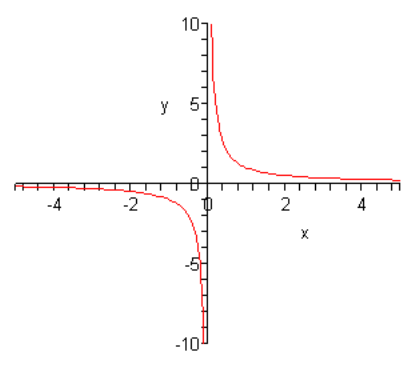
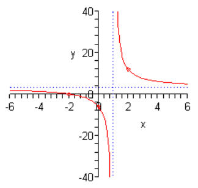
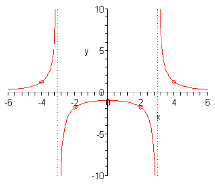
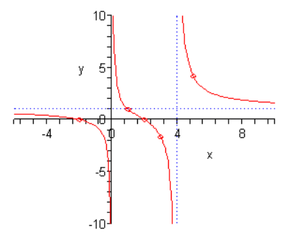

# 4.8 Rational Functions

In this final section we need to discuss graphing rational functions. It’s is
probably best to start off with a fairly simple one that we can do without all
that much knowledge on how these work.

Let's sketch the graph of $f(x) = \dfrac{1}{x}$. First, since this is a rational
function we are going to have to be careful with division by zero issues. So, we
can see from this equation that we’ll have to avoid $x = 0$ since that will give
division by zero.

Now, let’s just plug in some values of $x$ and see what we get.

| $x$     | $f(x)$  |
| ------- | ------- |
| $-4$    | $-0.25$ |
| $-2$    | $-0.5$  |
| $-1$    | $-1$    |
| $-0.1$  | $-10$   |
| $-0.01$ | $-100$  |
| $0.01$  | $100$   |
| $0.1$   | $10$    |
| $1$     | $1$     |
| $2$     | $0.5$   |
| $4$     | $0.25$  |

So, as $x$ get large (positively and negatively) the function keeps the sign of
$x$ and gets smaller and smaller. Likewise, as we approach $x = 0$ the function
again keeps the same sign as $x$ but starts getting quite large. Here is a
sketch of this graph.

First, notice that the graph is in two pieces. Almost all rational functions
will have graphs in multiple pieces like this.

Next, notice that this graph does not have any intercepts of any kind. That’s
easy enough to check for ourselves.

Recall that a graph will have a $y$-intercept at the point $(0, f(0))$. However,
in this case we have to avoid $x = 0$ and so this graph will never cross the
$y$-axis. It does get very close to the $y$-axis, but it will never cross or
touch it and so no $y$-intercept.

Next, recall that we can determine where a graph will have $x$-intercepts by
solving $f(x) = 0$. For rational functions this may seem like a mess to deal
with. However, there is a nice fact about rational functions that we can use
here. A rational function will be zero at a particular value of $x$ only if the
numerator is zero at that $x$ and the denominator isn’t zero at that $x$. In
other words, to determine if a rational function is ever zero all that we need
to do is set the numerator equal to zero and solve. Once we have these solutions
we just need to check that none of them make the denominator zero as well.

In our case the numerator is one and will never be zero and so this function
will have no $x$-intercepts. Again, the graph will get very close to the
$x$-axis but it will never touch or cross it.

Finally, we need to address the fact that graph gets very close to the $x$ and
$y$-axis but never crosses. Since there isn’t anything special about the axis
themselves we’ll use the fact that the $x$-axis is really the line given by
$y = 0$ and the $y$-axis is really the line given by $x = 0$.

In our graph as the value of $x$ approaches $x = 0$ the graph starts gets very
large on both sides of the line given by $x = 0$. This line is called a
**vertical asymptote**.

Also, as $x$ get very large, both positive and negative, the graph approaches
the line given by $y = 0$. This line is called a **horizontal asymptote**.

Here are the general definitions of the two asymptotes.

> 1. The line $x = a$ is a **vertical asymptote** if the graph increases or
>    decreases without bound on one or both sides of the line as $x$ move sin
>    closer and closer to $x = a$.
> 2. The line $y = b$ is a **horizontal asymptote** if the graph approaches $y =
>
>> b$ as $x$ increases or decreases without bound. Note that it doesn't have to
>> appraoch $y = b$ as $x$ BOTH increases and decreases. It only needs to
>> appraoch it on one side in order for it to be a horizontal asymptote.

Determining asymptotes is actually a fairly simple process. First, let’s start
with the rational function,

$$ f(x) = \frac{ax^n + \text{...}}{bx^m + \text{...}} $$

where $n$ is the largest exponent in the numerator and $m$ is the largest
exponent in the denominator.

We then have the following facts about asymptotes.

> 1. The graph will have a vertical asymptote at $x = a$ if the denominator is
>    zero at $x = a$ and the numerator isn't zero at $x = a$.
> 2. If $n < m$ then the $x$-axis is the horizontal asymptote.
> 3. If $n = m$ then the line $y = \dfrac{a}{b}$ is the horizontal asymptote.
> 4. If $n > m$ there will be no horizontal asymptotes.

The process for graphing a rational function is fairly simple. Here it is.

**Process for Graphing a Rational Function**

> 1. Find the intercepts, if there are any. Rememeber that the $y$-intercept is
>    given by $(0, f(0))$ and we find the $x$-intercepts by setting the
>    numerator equal to zero and solving.
> 2. Find the vertical asymptotes by setting the denominator equal to zero and
>    solving.
> 3. Find the horizontal asymptote, if it exists, using the fact above.
> 4. The vertical asymptotes will divide the number line into regions. In each
>    region graph at least one point in each region. This point will tell us
>    whether the graph will be above or below the horizontal asymptote and if we
>    need to we should get several points to determine the general shape of the
>    graph.
> 5. Sketch the graph.

Note that the sketch that we’ll get from the process is going to be a fairly
rough sketch but that is okay. That’s all that we’re really after is a basic
idea of what the graph will look at.

Let’s take a look at a couple of examples.

---

**Example 1**

Sketch the graph of the following function.

$$ f(x) = \frac{3x + 6}{x - 1} $$

So, we'll start off with the intercepts. The $y$-intercept is,

$$ f(0) = \frac{6}{-1} = -6 \Rightarrow (0, -6) $$

The $x$-intercepts will be,

$$ 3x + 6 = 0 $$

$$ x = -2 \Rightarrow (-2, 0) $$

So, we've got one vertical asymptote. This means that there are now two regions
of $x$'s. They are $x < 1$ and $x > 1$.

Now, the largest exponent in the numerator and denominator is 1 and so by the
fact there will be a horizontal asymptote at the line.

$$ y = \frac{3}{2} = 3 $$

Now, we just need points in each region of $x$'s. Since the $y$-intercept and
the $x$-intercept are already in the left region we won't need to get any points
there. That means that we'll just need to get a point in the right region. It
donesn't really matter what value of $x$ we pick here we just need to keep it
fairly small so it will fit onto our graph.

$$ f(2) = \frac{3(2) + 6}{2 - 1} = \frac{12}{1} = 12 \Rightarrow (2, 12) $$

Okay, putting all this together gives the following graph.

Note that the asymptotes are shown as dotted lines.

---

**Example 2**

Sketch the graph of the following function.

$$ f(x) = \frac{9}{x^2 - 9} $$

Okay, we’ll start with the intercepts. The $y$-intercept is,

$$ f(0) = \frac{9}{-9} = -1 \Rightarrow (0, -1) $$

The numerator is a constant and so there won’t be any $x$-intercepts since the
function can never be zero.

Next, we’ll have vertical asymptotes at,

$$ x^2 - 9 = 0 \Rightarrow \pm 3 $$

So, in this case we'll ahve three regions to our graph: $x < -3, -3 < x < 3, x >
3$.

Also, the largest exponent in the denominator is 2 and since there are no $x$’s
in the numerator the largest exponent is 0, so by the fact the $x$-axis will be
the horizontal asymptote.

Finally, we need some points. We’ll use the following points here.

$$ f(-4) = \frac{9}{7} \Rightarrow \left(-4, \frac{9}{7} \right) $$

$$ f(-2) = -\frac{9}{5} \Rightarrow \left(-2, -\frac{9}{5} \right) $$

$$ f(2) = -\frac{9}{5} \Rightarrow \left(2, -\frac{9}{5} \right) $$

$$ f(4) = \frac{9}{7} \Rightarrow \left(4, \frac{9}{7} \right) $$

Notice that along with the $y$-intercept we actually have three points in the
middle region. This is because there are a couple of possible behaviors in this
region and we’ll need to determine the actual behavior. We’ll see the other main
behaviors in the next examples and so this will make more sense at that point.

Here is the sketch of the graph.

---

**Example 3**

Sketch the graph of the following function.

$$ f(x) = \frac{x^2 - 4}{x^2 - 4x} $$

This time notice that if we were to plug in $x = 0$ into the denominator we
would get division by zero. This means there will not be a $y$-intercept for
this graph. We have however, managed to find a vertical asymptote already.

Now, let’s see if we’ve got $x$-intercepts.

$$ x^2 - 4 = 0 \Rightarrow x = \pm 2 $$

So, we’ve got two of them.

We’ve got one vertical asymptote, but there may be more so let’s go through the
process and see.

$$ x^2 - 4x = x(x - 4) = 0 \Rightarrow x = 0, x = 4 $$

So, we've got two again and the three regions that we've got are $x < 0, 0 < x <
4, x > 4$.

Next, the largest exponent in both the numerator and denominator is 2 so by the
fact there will be a horizontal asymptote at the line,

$$ y = \frac{1}{1} = 1 $$

Now, one of the $x$-intercepts is in the far left region so we don’t need any
points there. The other $x$-intercept is in the middle region. So, we’ll need a
point in the far right region and as noted in the previous example we will want
to get a couple more points in the middle region to completely determine its
behavior.

$$ f(1) = 1 \Rightarrow (1, 1) $$

$$ f(3) = -\frac{5}{3} \Rightarrow \left(3, -\frac{5}{3} \right) $$

$$ f(5) =  \frac{21}{5} \Rightarrow \left(5, \frac{21}{5} \right) $$

Here is the sketch for this function.

Notice that this time the middle region doesn’t have the same behavior at the
asymptotes as we saw in the previous example. This can and will happen fairly
often. Sometimes the behavior at the two asymptotes will be the same as in the
previous example and sometimes it will have the opposite behavior at each
asymptote as we see in this example. Because of this we will always need to get
a couple of points in these types of regions to determine just what the behavior
will be.

---

## Practice Problems

**1.**

$$ f(x) = \frac{-4}{x - 2} $$

**2.**

$$ f(x) = \frac{6 - 2x}{1 - x} $$

**3.**

$$ f(x) = \frac{8}{x^2 + x - 6} $$

**4.**

$$ f(x) = \frac{4x^2 - 36}{x^2 - 2x - 8} $$

---

## Assignment Problems

Sketch the graph of each of the following functions. Clearly identify all
intercepts and asymptotes.

**1.**

$$ f(x) = \frac{7}{5x + 10} $$

**2.**

$$ f(x) = \frac{6 - x}{x - 3} $$

**3.**

$$ f(x) = \frac{8x + 6}{4 - 2x} $$

**4.**

$$ f(x) = \frac{-2}{x^2 - 5x} $$

**5.**

$$ f(x) = \frac{x + 3}{x^2 + 4x - 5} $$

**6.**

$$ f(x) = \frac{2}{x^2 - x - 12} $$

**7.**

$$ f(x) = \frac{5x^2 + 1}{2x^2 - 32} $$

**8.**

$$ f(x) = \frac{x^2 - 5x + 4}{x^2 + 2x - 15} $$
