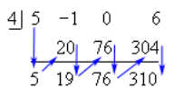
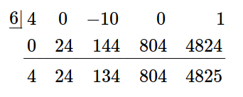

# 5.1 Dividing Polynomials

---

In this section we’re going to take a brief look at dividing polynomials. This
is something that we’ll be doing off and on throughout the rest of this chapter
and so we’ll need to be able to do this.

Let’s do a quick example to remind us how long division of polynomials works.

---

**Example 1**

Divide $5x^3 - x^2 + 6$ by $x - 4$.

Let's first get the problem set up.

<math xmlns="http://www.w3.org/1998/Math/MathML" display="block">
  <mi>x</mi>
  <mo>&#x2212;<!-- − --></mo>
  <mn>4</mn>
  <menclose>
    <mrow class="MJX-TeXAtom-ORD">
      <mn>5</mn>
      <mrow class="MJX-TeXAtom-ORD">
        <msup>
          <mrow class="MJX-TeXAtom-ORD">
            <mi>x</mi>
          </mrow>
          <mrow class="MJX-TeXAtom-ORD">
            <mn>3</mn>
          </mrow>
        </msup>
      </mrow>
      <mo>&#x2212;<!-- − --></mo>
      <mrow class="MJX-TeXAtom-ORD">
        <msup>
          <mrow class="MJX-TeXAtom-ORD">
            <mi>x</mi>
          </mrow>
          <mrow class="MJX-TeXAtom-ORD">
            <mn>2</mn>
          </mrow>
        </msup>
      </mrow>
      <mo>+</mo>
      <mn>0</mn>
      <mi>x</mi>
      <mo>+</mo>
      <mn>6</mn>
    </mrow>
  </menclose>
</math>

Recall that we need to have the terms written down with the exponents in
decreasing order and to make sure we don’t make any mistakes we add in any
missing terms with a zero coefficient.

Now we ask ourselves what we need to multiply $x - 4$ to get the first term in
first polynomial. in this case that is $5x^2$. So multiply $x - 4$ by $5x^2$ and
subtract the result from the first polynomial.

<math xmlns="http://www.w3.org/1998/Math/MathML" display="block">
  <mtable columnalign="right left right left right left right left right left right left" rowspacing="3pt" columnspacing="0em 2em 0em 2em 0em 2em 0em 2em 0em 2em 0em" displaystyle="true">
    <mtr>
      <mtd />
      <mtd>
        <mspace width="thinmathspace" />
        <mspace width="thinmathspace" />
        <mspace width="thinmathspace" />
        <mn>5</mn>
        <msup>
          <mi>x</mi>
          <mrow class="MJX-TeXAtom-ORD">
            <mn>2</mn>
          </mrow>
        </msup>
      </mtd>
    </mtr>
    <mtr>
      <mtd>
        <mi>x</mi>
        <mo>&#x2212;<!-- − --></mo>
        <mn>4</mn>
      </mtd>
      <mtd>
        <mrow class="MJX-TeXAtom-ORD">
          <menclose>
            <mrow class="MJX-TeXAtom-ORD">
              <mn>5</mn>
              <mrow class="MJX-TeXAtom-ORD">
                <msup>
                  <mrow class="MJX-TeXAtom-ORD">
                    <mi>x</mi>
                  </mrow>
                  <mrow class="MJX-TeXAtom-ORD">
                    <mn>3</mn>
                  </mrow>
                </msup>
              </mrow>
              <mo>&#x2212;<!-- − --></mo>
              <mrow class="MJX-TeXAtom-ORD">
                <msup>
                  <mrow class="MJX-TeXAtom-ORD">
                    <mi>x</mi>
                  </mrow>
                  <mrow class="MJX-TeXAtom-ORD">
                    <mn>2</mn>
                  </mrow>
                </msup>
              </mrow>
              <mo>+</mo>
              <mn>0</mn>
              <mi>x</mi>
              <mo>+</mo>
              <mn>6</mn>
            </mrow>
          </menclose>
        </mrow>
      </mtd>
    </mtr>
    <mtr>
      <mtd>
        <mo>&#x2212;<!-- − --></mo>
      </mtd>
      <mtd>
        <munder>
          <mrow>
            <mo>(</mo>
            <mrow>
              <mn>5</mn>
              <mrow class="MJX-TeXAtom-ORD">
                <msup>
                  <mrow class="MJX-TeXAtom-ORD">
                    <mi>x</mi>
                  </mrow>
                  <mrow class="MJX-TeXAtom-ORD">
                    <mn>3</mn>
                  </mrow>
                </msup>
              </mrow>
              <mo>&#x2212;<!-- − --></mo>
              <mn>20</mn>
              <mrow class="MJX-TeXAtom-ORD">
                <msup>
                  <mrow class="MJX-TeXAtom-ORD">
                    <mi>x</mi>
                  </mrow>
                  <mrow class="MJX-TeXAtom-ORD">
                    <mn>2</mn>
                  </mrow>
                </msup>
              </mrow>
            </mrow>
            <mo>)</mo>
          </mrow>
          <mo>&#x005F;<!-- _ --></mo>
        </munder>
      </mtd>
    </mtr>
    <mtr>
      <mtd />
      <mtd>
        <mspace width="0.65in" />
        <mn>19</mn>
        <mrow class="MJX-TeXAtom-ORD">
          <msup>
            <mrow class="MJX-TeXAtom-ORD">
              <mi>x</mi>
            </mrow>
            <mrow class="MJX-TeXAtom-ORD">
              <mn>2</mn>
            </mrow>
          </msup>
        </mrow>
        <mo>+</mo>
        <mn>0</mn>
        <mi>x</mi>
        <mo>+</mo>
        <mn>6</mn>
      </mtd>
    </mtr>
  </mtable>
</math>

The new polynomial is called the **remainder**. We continue the process until
the degree of the remainder is less than the degree of the **divisor**, which is
$x - 4$ in this case. So, we need to continue until the degree of the remainder
is less than 1.

Recall that the degree of a polynomial is the highest exponent in the
polynomial. Also, recall that a constant is thought of as a polynmial of degree
zero. Therefore, we'll need to continue until we get a constant in this case.

Here is the rest of the work for this example.

<math xmlns="http://www.w3.org/1998/Math/MathML" display="block">
  <mtable columnalign="right left right left right left right left right left right left" rowspacing="3pt" columnspacing="0em 2em 0em 2em 0em 2em 0em 2em 0em 2em 0em" displaystyle="true">
    <mtr>
      <mtd />
      <mtd>
        <mspace width="thinmathspace" />
        <mspace width="thinmathspace" />
        <mspace width="thinmathspace" />
        <mn>5</mn>
        <mrow class="MJX-TeXAtom-ORD">
          <msup>
            <mrow class="MJX-TeXAtom-ORD">
              <mi>x</mi>
            </mrow>
            <mrow class="MJX-TeXAtom-ORD">
              <mn>2</mn>
            </mrow>
          </msup>
        </mrow>
        <mo>+</mo>
        <mn>19</mn>
        <mi>x</mi>
        <mo>+</mo>
        <mn>76</mn>
      </mtd>
    </mtr>
    <mtr>
      <mtd>
        <mi>x</mi>
        <mo>&#x2212;<!-- − --></mo>
        <mn>4</mn>
      </mtd>
      <mtd>
        <mrow class="MJX-TeXAtom-ORD">
          <menclose>
            <mrow class="MJX-TeXAtom-ORD">
              <mn>5</mn>
              <mrow class="MJX-TeXAtom-ORD">
                <msup>
                  <mrow class="MJX-TeXAtom-ORD">
                    <mi>x</mi>
                  </mrow>
                  <mrow class="MJX-TeXAtom-ORD">
                    <mn>3</mn>
                  </mrow>
                </msup>
              </mrow>
              <mo>&#x2212;<!-- − --></mo>
              <mrow class="MJX-TeXAtom-ORD">
                <msup>
                  <mrow class="MJX-TeXAtom-ORD">
                    <mi>x</mi>
                  </mrow>
                  <mrow class="MJX-TeXAtom-ORD">
                    <mn>2</mn>
                  </mrow>
                </msup>
              </mrow>
              <mo>+</mo>
              <mn>0</mn>
              <mi>x</mi>
              <mo>+</mo>
              <mn>6</mn>
            </mrow>
          </menclose>
        </mrow>
      </mtd>
    </mtr>
    <mtr>
      <mtd>
        <mo>&#x2212;<!-- − --></mo>
      </mtd>
      <mtd>
        <munder>
          <mrow>
            <mo>(</mo>
            <mrow>
              <mn>5</mn>
              <mrow class="MJX-TeXAtom-ORD">
                <msup>
                  <mrow class="MJX-TeXAtom-ORD">
                    <mi>x</mi>
                  </mrow>
                  <mrow class="MJX-TeXAtom-ORD">
                    <mn>3</mn>
                  </mrow>
                </msup>
              </mrow>
              <mo>&#x2212;<!-- − --></mo>
              <mn>20</mn>
              <mrow class="MJX-TeXAtom-ORD">
                <msup>
                  <mrow class="MJX-TeXAtom-ORD">
                    <mi>x</mi>
                  </mrow>
                  <mrow class="MJX-TeXAtom-ORD">
                    <mn>2</mn>
                  </mrow>
                </msup>
              </mrow>
            </mrow>
            <mo>)</mo>
          </mrow>
          <mo>&#x005F;<!-- _ --></mo>
        </munder>
      </mtd>
    </mtr>
    <mtr>
      <mtd />
      <mtd>
        <mspace width="0.65in" />
        <mn>19</mn>
        <mrow class="MJX-TeXAtom-ORD">
          <msup>
            <mrow class="MJX-TeXAtom-ORD">
              <mi>x</mi>
            </mrow>
            <mrow class="MJX-TeXAtom-ORD">
              <mn>2</mn>
            </mrow>
          </msup>
        </mrow>
        <mo>+</mo>
        <mn>0</mn>
        <mi>x</mi>
        <mo>+</mo>
        <mn>6</mn>
      </mtd>
    </mtr>
    <mtr>
      <mtd />
      <mtd>
        <mi></mi>
        <mspace width="0.4in" />
        <mo>&#x2212;<!-- − --></mo>
        <munder>
          <mrow>
            <mo>(</mo>
            <mrow>
              <mn>19</mn>
              <mrow class="MJX-TeXAtom-ORD">
                <msup>
                  <mrow class="MJX-TeXAtom-ORD">
                    <mi>x</mi>
                  </mrow>
                  <mrow class="MJX-TeXAtom-ORD">
                    <mn>2</mn>
                  </mrow>
                </msup>
              </mrow>
              <mo>&#x2212;<!-- − --></mo>
              <mn>76</mn>
              <mi>x</mi>
            </mrow>
            <mo>)</mo>
          </mrow>
          <mo>&#x005F;<!-- _ --></mo>
        </munder>
      </mtd>
    </mtr>
    <mtr>
      <mtd />
      <mtd>
        <mspace width="1.3in" />
        <mn>76</mn>
        <mi>x</mi>
        <mo>+</mo>
        <mn>6</mn>
      </mtd>
    </mtr>
    <mtr>
      <mtd />
      <mtd>
        <mi></mi>
        <mspace width="1.05in" />
        <mo>&#x2212;<!-- − --></mo>
        <munder>
          <mrow>
            <mo>(</mo>
            <mrow>
              <mn>76</mn>
              <mi>x</mi>
              <mo>&#x2212;<!-- − --></mo>
              <mn>304</mn>
            </mrow>
            <mo>)</mo>
          </mrow>
          <mo>&#x005F;<!-- _ --></mo>
        </munder>
      </mtd>
    </mtr>
    <mtr>
      <mtd />
      <mtd>
        <mspace width="1.9in" />
        <mn>310</mn>
      </mtd>
    </mtr>
  </mtable>
</math>

Okay, now that we've gotten this done, let's remember how we write the actual
answer down. The answer is,

$$ \frac{5x^3 - x^2 + 6}{x - 4} = 5x^2 + 19x + 76 + \frac{310}{x - 4} $$

---

There is actually another way to write the answer from the previous example that
we’re going to find much more useful, if for no other reason that it’s easier to
write down. If we multiply both sides of the answer by $x − 4$ we get,

$$ 5x^3 - x^2 + 6 = (x - 4)(5x^2 + 19x + 76) + 310 $$

In this example we divided the polynomial by a linear polynomial in the form of
$x − r$ and we will be restricting ourselves to only these kinds of problems.
Long division works for much more general division, but these are the kinds of
problems we are going to seeing the later sections.

In fact, we will be seeing these kinds of divisions so often that we’d like a
quicker and more efficient way of doing them. Luckily there is something out
there called **synthetic division** that works wonderfully for these kinds of
problems. In order to use synthetic division we must be dividing a polynomial by
a linear term in the form $x − r$. If we aren’t then it won’t work.

Let’s redo the previous problem with synthetic division to see how it works.

---

**Example 2**

Use synthetic division to divide $5x^3 - x^2 + 6$ by $x - 4$.

Okay with synthetic division we pretty much ignore all the $x$’s and just work
with the numbers in the polynomials.

First, let’s notice that in this case $r = 4$.

Now we need to set up the process. There are many different notations for doing
this. We’ll be using the following notation.

$$ \underline{4}| \text{ }5\text{ }-1\text{ }0\text{ }6 $$

The numbers to teh right of the vertical bar are the coefficients of the terms
in the polynomial written in order of decreasing exponent. Also notice that any
missing terms are acknowledged with a coefficient of zero.

Now, it will probably be easier to write down the process and then explain it so
here it is.

The first thing we do is drop the first number in the top line straight down as
shown. Then along each diagonal we multiply the starting number by $r$ (which is
$4$ in this case) and put this number in the second row. Finally, add the
numbers in the first and second row putting the results in the third row. We
continue this until we reach the final number in the first row.

Now, notice that the numbers in the bottom row are the coefficients of the
quadratic polynomial from our answer written in order of decreasing exponent and
the final number in the third row is the remainder.

The answer is then the same as the first example.

First example:

$$ \frac{5x^3 - x^2 + 6}{x - 4} = 5x^2 + 19x + 76 + \frac{310}{x - 4} $$

This example:

$$ 5x^3 - x^2 + 6 = (x - 4)(5x^2 + 19x + 76) + 310 $$

---

We'll do some more examples of synthetic division in a bit. However, we really
should generalize things out a little first with the following fact.

**Division Algorithm**

> Given a polynomial $P(x)$ with degree at least $1$ and any number $r$ there is
> another polynomial $Q(x)$, called the **quotient**, with degree one less than
> the degree of $P(x)$ and a number $R$, called the **remainder**, such that,
> $$ P(x) = (x - r)Q(x) + R $$

Note as well that $Q(x)$ and $R$ are unique, or in other words, there is only
one $Q(x)$ and $R$ that will work for a given $P(x)$ and $r$.

So, with the one example we've done to this point we can see that,

$$ Q(x) = 5x^2 + 19x + 76 \text{ and } R = 310 $$

Now, let's work a couple more synthetic division problems.

---

**Example 3**

Use synthetic division to do each of the following divisions.

**(a)**

$$ 2x^3 - 3x - 5 \text{ by } x + 2 $$

Okay in this case we need to be a little careful here. We MUST divide by a term
in the form $x − r$ in order for this to work and that minus sign is absolutely
required. So, we’re first going to need to write $x + 2$ as,

$$ x + 2 = x - (-2) $$

and in doing so we can see that $r = -2$.

We can now do synthetic division and this time we'll just put up the results and
leave it to you to check all the actual numbers.

$$
\underline{-2}| \quad2\quad\quad0\quad-3\quad-5 \\
\underline{\quad\quad\quad\quad\quad-4\quad\quad8\quad-10} \\
\quad\quad\quad2\quad-4\text{ }\text{ }\text{ }\quad5\quad-15
$$

So in this case we have,

$$ 2x^3 - 3x - 5 = (x + 2)(2x^2 - 4x + 5) - 15 $$

**(b)**

$$ 4x^4 - 10x^2 + 1 \text{ by } x - 6 $$

In this case we've got $r = 6$. Here is the work.

In this case we then have.

$$ 4x^4 - 10x^2 + 1 = (x - 6)(4x^3 + 24x^2 + 134x + 804) + 4825 $$

---

So, just why are we doing this? That’s a natural question at this point. One
answer is that, down the road in a later section, we are going to want to get
our hands on the $Q(x)$. Just why we might want to do that will have to wait for
an explanation until we get to that point.

There is also another reason for this that we are going to make heavy usage of
later on. Let’s first start out with the division algorithm.

$$ P(x) = (x - r)Q(x) + R $$

Now, let's evaluate the polynomial $P(x)$ at $r$. If we had an actual polynomial
here we could evaluate $P(x)$ directly of course, but let's use the division
algorithm and see what we get,

$$
P(r) = (r - r)Q(r) + R \\
\text{ }=(0)Q(r) + R \\
= R\quad\quad\quad\quad
$$

Now, that's convenient. The remainder of the division algorithm is also the
value of the polynomial evaluated at $r$. So, from our previous examples we now
know the following function evaluations.

$$ \text{If } P(x) = 5x^3 - x^2 + 6 \text{ then } P(4) = 310 $$

$$ \text{If } P(x) = 2x^3 - 3x - 5 \text{ then } P(-2) = -15 $$

$$ \text{If } P(x) = 4x^4 - 10x^2 + 1 \text{ then } P(6) = 4825 $$

This is a very quick method for evaluating polynomials. For polynomials with
only a few terms and/or polynomials with "small" degree this may not be much
quicker than evaluating them directly. However, if there are many terms in the
polynomial and they have large degrees this can be much quicker and much less
prone to mistakes than computing them directly.

As noted, we will be using this fact in a later section to greatly reduce the
amount of work we'll need to do in those problems.

---

## Practice Problems

For problems 1 - 3 use long division to perform the indicated division.

**1.** Divide $3x^4 - 5x^2 + 3$ by $x + 2$.

$$ \frac{3x^4 - 5x^2 + 3}{x + 2} = (x + 2)(3x^3 - 6x^2 + 7x - 14) + 31 $$

**2.** Divide $x^3 + 2x^2 - 3x + 4$ by $x - 7$.

$$ \frac{x^3 + 2x^2 - 3x + 4}{x - 7} = (x - 7)(x^2 + 9x + 60) + 424 $$

**3.** Divide $2x^5 + x^4 - 6x + 9$ by $x^2 - 3x + 1$.

$$ \frac{2x^5 + x^4 - 6x + 9}{x^2 - 3x + 1} = (x^2 - 3x + 1)(2x^3 + 7x^2 + 19x + 50) + 125x - 41 $$

For problems 4 - 6 use synthetic division to perform the indicated division.

**4.** Divide $x^3 + x^2 + x + 1$ by $x + 9$.

$$ x^3 + x^2 + x + 1 = (x + 9)(x^2 - 8x + 73) - 656 $$

**5.** Divide $7x^3 - 1$ by $x + 2$.

$$ 7x^3 - 1 = (x + 2)(7x^2 - 14x + 28) - 57 $$

**6.** Divide $5x^4 + x^2 - 8x + 2$ by $x - 4$.

| $r$ | $x^4$ | $x^3$ | $x^2$ | $x$ | $R$  |
| --- | ----- | ----- | ----- | --- | ---- |
| 4   | 5     | 0     | 1     | -8  | 2    |
|     |       | 20    | 80    | 324 | 1264 |
|     | 5     | 20    | 81    | 316 | 1266 |

$$ 5x^4 + x^2 - 8x + 2 = (x - 4)(5x^3 + 20x^2 + 81x + 316) + 1266 $$

---

For problems 1 - 6 use long division to perform the indicated division.

**1.** Divide $7x^2 + 4x - 9$ by $x - 1$.

$$ \frac{7x^2 + 4x - 9}{x - 1} = 7x + 11 + \frac{2}{x - 1} $$

$$ 7x^2 + 4x - 9 = (x - 1)(7x + 11) + 2 $$

**2.** Divide $8x^3 - 4x + 1$ by $x + 6$.

$$ \frac{8x^3 - 4x + 1}{x + 6} = 8x^2 - 48x + 284 - \frac{1703}{x + 6} $$

$$ 8x^3 - 4x + 1 = (x + 6)(8x^2 - 48x + 284) - 1703 $$

**3.** Divide $x^4 - 2x^2 + 7x$ by $x - 4$.

$$ \frac{x^4 - 2x^2 + 7x}{x - 4} = x^3 + 4x^2 + 14x + 63 + \frac{252}{x - 4} $$

$$ x^4 - 2x^2 + 7x = (x - 4)(x^3 + 4x^2 + 14x + 63) + 252 $$

**4.** Divide $2x^4 - 9x^3 + 2x + 8$ by $x + 3$.

$$ \frac{2x^4 - 9x^3 + 2x + 8}{x + 3} = 2x^3 - 15x^2 + 45x - 133 + \frac{407}{x + 3} $$

$$ 2x^4 - 9x^3 + 2x + 8 = (x + 3)(2x^3 - 15x^2 + 45x - 133) + 407 $$

**5.** Divide $8x^4 + x^3 - 3x^2 + 1$ by $x^2 - 2$.

$$ \frac{8x^4 + x^3 - 3x^2 + 1}{x^2 - 2} = 8x^2 + x + 13 + \frac{2x + 27}{x^2 - 2} $$

$$ 8x^4 + x^3 - 3x^2 + 1 = (x^2 - 2)(8x^2 + x + 13) + 2x + 27 $$

**6.** Divide $4x^5 - 7x^3 + x^2 - 4x + 2$ by $2x^2 - 3x - 6$.

$$ \frac{4x^5 - 7x^3 + x^2 - 4x + 2}{2x^2 - 3x - 6} = 2x^3 + 3x^2 + 7x + 20 + \frac{98x + 122}{2x^2 - 3x - 6} $$

$$ 4x^5 - 7x^3 + x^2 - 4x + 2 = (2x^2 - 3x - 6)(2x^3 + 3x^2 + 7x + 20) + 98x + 122 $$

For problems 7 - 11 use synthetic division to perform the indicated division.

**7.** Divide $-x^3 - 8x^2 + x + 10$ by $x + 2$.

| $r$ | $x^3$ | $x^2$ | $x$ | $R$ |
| --- | ----- | ----- | --- | --- |
| -2  | -1    | -8    | 1   | 10  |
|     |       | 2     | 12  | -26 |
|     | -1    | -6    | 13  | -16 |

$$ -x^3 - 8x^2 + x + 10 = (x + 2)(-x^2 - 6x + 13) - 16 $$

**8.** Divide $10x^3 - 9x$ by $x - 10$.

| $r$ | $x^3$ | $x^2$ | $x$  | $R$  |
| --- | ----- | ----- | ---- | ---- |
| 10  | 10    | 0     | -9   | 0    |
|     |       | 100   | 1000 | 9910 |
|     | 10    | 100   | 991  | 9910 |

$$ 10x^3 - 9x = (x - 10)(10x^2 + 100x + 991) + 9910 $$

**9.** Divide $3x^4 + 5x^3 + x - 2$ by $x + 7$.

| $r$ | $x^4$ | $x^3$ | $x^2$ | $x$  | $R$  |
| --- | ----- | ----- | ----- | ---- | ---- |
| -7  | 3     | 5     | 0     | 1    | -2   |
|     |       | -21   | 112   | -784 | 5481 |
|     | 3     | -16   | 112   | -783 | 5479 |

$$ 3x^4 + 5x^3 + x - 2 = (x + 7)(3x^3 - 16x^2 - 112x - 783) + 5479 $$

**10.** Divide $x^4 + 2x^3 - 9x + 11$ by $x + 3$.

| $r$ | $x^4$ | $x^3$ | $x^2$ | $x$ | $R$ |
| --- | ----- | ----- | ----- | --- | --- |
| -3  | 1     | 2     | 0     | -9  | 11  |
|     |       | -3    | 3     | -9  | 54  |
|     | 1     | -1    | 3     | -18 | 65  |

$$ x^4 + 2x^3 - 9x + 11 = (x + 3)(x^3 - x^2 + 3x - 18) + 65 $$

**11.** Divide $5x^4 - 4x^3 + 3x^2 - 2x + 1$ by $x - 1$.

| $r$ | $x^4$ | $x^3$ | $x^2$ | $x$ | $R$ |
| --- | ----- | ----- | ----- | --- | --- |
| 1   | 5     | -4    | 3     | 2   | 1   |
|     |       | 5     | 1     | 4   | 6   |
|     | 5     | 1     | 4     | 6   | 7   |

$$ 5x^4 - 4x^3 + 3x^2 - 2x + 1 = (x - 1)(5x^3 + x^2 + 4x + 6) + 7 $$
