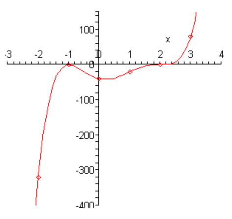
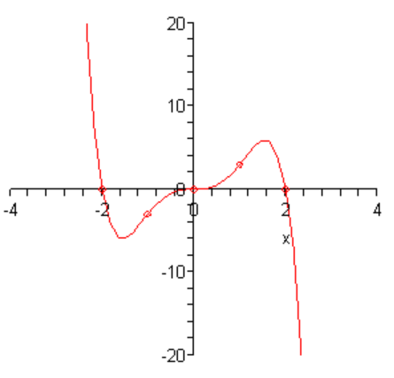

# 5.3 Graphing Polynomials

---

In this section we are going to look at a method for getting a rough sketch of a
general polynomial. The only real information that we’re going to need is a
complete list of all the zeroes (including multiplicity) for the polynomial.

In this section we are going to either be given the list of zeroes or they will
be easy to find. In the next section we will go into a method for determining a
large portion of the list for most polynomials. We are graphing first since the
method for finding all the zeroes of a polynomial can be a little long and we
don’t want to obscure the details of this section in the mess of finding the
zeroes of the polynomial.

Let’s start off with the graph of couple of polynomials.

Do not worry about the equations for these polynomials. We are giving these only
so we can use them to illustrate some ideas about polynomials.

First, notice that the graphs are nice and smooth. There are no holes or breaks
in the graph and there are no sharp corners in the graph. The graphs of
polynomials will always be nice smooth curves.

Secondly, the “humps” where the graph changes direction from increasing to
decreasing or decreasing to increasing are often called **turning points**. If
we know that the polynomial has degree $n$ then we will know that there will be
at most $n − 1$ turning points in the graph.

While this won’t help much with the actual graphing process it will be a nice
check. If we have a fourth degree polynomial with 5 turning point then we will
know that we’ve done something wrong since a fourth degree polynomial will have
no more than 3 turning points.

Next, we need to explore the relationship between the $x$-intercepts of a graph
of a polynomial and the zeroes of the polynomial. Recall that to find the
[$x$-intercepts](https://tutorial.math.lamar.edu/Classes/Alg/Graphing.aspx#Fcns_Intercepts)
of a function we need to solve the equation

$$ P(x) = 0 $$

Also, recall that $x = r$ is a zero of the polynomial, $P(x)$, provided $P(r) =
0$. But this means that $x = r$ is also a solution to $P(x) = 0$.

In other words, the zeroes of a polynomial are also the $x$-intercepts of the
graph. Also, recall that $x$-intercepts an either cross the $x$-axis or they can
just touch the $x$-axis without actually crossing the axis.

Notice as well from the graphs above that the $x$-intercepts can either flatten
out as they cross the $x$-axis or they can go through the $x$-axis at an angle.

The following fact will relate all of these ideas to the multiplicity of zero.

**Fact**

> If $x = r$ is a zero of the polynomial $P(x)$ with multiplicity $k$ then,
>
> 1. If $k$ is odd then the $x$-intercept corresponding to $x = r$ will cross
>    the $x$-axis.
> 2. If $k$ is even then the $x$-intercept corresponding to $x = r$ will only
>    touch the $x$-axis and not actually cross it.
>
> Furthermore, if $k > 1$ then the graph will flatten out at $x = r$.

Finally, notice that as we let $x$ get large in both the positive or negative
sense (_i.e._ at either end of the graph) then the graph will either increase
without bound or decrease without bound. This will always happen with every
polynomial and we can use the following test to determine just what will happen
at the endpoints of the graph.

**Leading Coefficient Test**

Suppose that $P(x)$ is a polynomial with degree $n$. So we know that the
polynomial must look like,

$$ P(x) = ax^n + \dots $$

We don't know if there are any other terms in the polynomial, but we do know
that the first term will have to be the one listed since it has degree $n$. We
now have the following facts about the graph of $P(x)$ at the ends of the graph.

1. If $a > 0$ and $n$ is even then the graph of $P(x)$ will increase without
   bound at both endpoints. A good example of this is the graph of $x^2$.

2. If $a > 0$ and $n$ is odd then the graph of $P(x)$ will increase without
   bound at the right end and decrease without bound at the left end. A good
   example of this is the graph of $x^3$.

3. If $a < 0$ and $n$ is even then the graph of $P(x)$ will decrease without
   bound at both endpoints. A good example of this is the graph of $-x^2$.

4. If $a < 0$ and $n$ is odd then the graph of $P(x)$ will decrease without
   bound at the right end and increase without bound at the left end. A good
   example of this is the graph of $-x^3$.

Okay, now that we’ve got all that out of the way we can finally give a process
for getting a rough sketch of the graph of a polynomial.

**Process for Graphing a Polynomial**

> 1. Determine all the zeroes of the polynomial and their multiplicity. Use the
>    fact above to determine the $x$-intercept that corresponds to each zero
>    will cross the $x$-axis or just touch it and if the $x$-intercept will
>    flatten out or not.
> 2. Determine the $y$-intercept, $(0, P(0))$.
> 3. Use the leading coefficient test to determine the behavior of the polyomial
>    at the end of the graph.
> 4. Plot a few more points. This is left intentionally vague. The more points
>    that you plot the better the sketch. At the least you should plot at least
>    one at either end of the graph and at least one point between each pair of
>    zeroes.

We should give a quick warning about this process before we actually try to use
it. This process assumes that all the zeroes are real numbers. If there are any
complex zeroes then this process may miss some pretty important features of the
graph.

Let’s sketch a couple of polynomials.

---

**Example 1**

Sketch the graph of $P(x) = 5x^5 - 20x^4 + 5x^3 + 50x^2 - 20x - 40$.

We found the zeroes and multiplicities of this polynomial in the previous
[section](https://tutorial.math.lamar.edu/Classes/Alg/ZeroesOfPolynomials.aspx#Poly_Zero_Ex1_a)
so we’ll just write them back down here for reference purposes.

$$ x = -1 \text{ (multiplicity } 2 \text{)} $$

$$ x = 2 \text{ (multiplicity } 3 \text{)} $$

So, from the fact we know that $x = -1$ will just touch the $x$-axis and not
actually cross it and that $x = 2$ will cross the $x$-axis and will be flat as
it does this since the multiplicity is greater than 1. Also, both will be flat
as they cross the $x$-axis since the multiplicity for both is greater than 1.

Next, the $y$-intercept is $(0, -40)$.

The coefficient of the 5th degree term is positive and since the
degree is odd we know that this polynomial will increase without bound at the
right end and decrease without bound at the left end.

Finally, we just need to evaluate the polynomial at a couple of points. The
points that we pick aren't really all that important. We just want to pick
points according to the guidelines in the process outlined above and points that
will be fairly easy to evaluate. Here are some points. We will leave it to you
to verify the evaluations.

$$ P(-2) = -320 $$

$$ P(1) = -20 $$

$$ P(3) = 80 $$

Now, to actually sketch the graph we'll start on the left end and work our way
across to the right end. First, we know that on the left end the graph decreases
without bound as we make $x$ more and more negative and this agrees with the
point that we evaluated at $x = -2$.

So, as we move to the right the function will actually be increasing at $x = -2$
and we will continue to increase until we hit the first $x$-intercept at $x =
-1$. At this point we know that the graph just touches the $x$-axis without
actually crossing it and will be flat as it does this. This means that at $x =
-1$ the graph must be at a turning point.

The graph is now decreasing as we move to the right. Again, this agrees with the
next point that we'll run across, the $y$-intercept.

Now, according to the next point that we've got, $x = 1$, the graph must have
another turning point somewhere between $x = 0$ and $x = 1$ since the graph is
higher at $x = 1$ than at $x = 0$. Just where this turning point will occur is
very difficult to determine at this level so we won't worry about trying to find
it. In fact, determining this point usually requires some Calculus.

So, we are moving to the right and the function is increasing. The next point
that we hit is the $x$-intercept at $x = 24 and this one crosses the $x$-axis so
we know that there won't be a turning point here as there was at the first
$x$-intercept. Also, the graph will be flat as it touches the $x$-axis because
the multiplicity is greater than one. So, the graph will continue to increase
through this point, briefly flattening out as it touches the $x$-axis, until we
hit the final point that we evaluated the function at $x = 3$.

At this point, we've hit all the $x$-intercepts and we know that the graph will
increase without bound at the right end and so it looks like all we need to do
is sketch in an increasing curve.

Here is a sketch of the polynomial.

Note that one of the reasons for plotting points at the ends is to see just how
fast the graph is increasing or decreasing. We can see from the evaluations that
the graph is decreasing on the left end much faster than it's increasing on the
right end.

---

Okay, let’s take a look at another polynomial. This time we’ll go all the way
through the process of finding the zeroes.

---

**Example 2**

Sketch the graph of $P(x) = x^4 - x^3 - 6x^2$.

First, we’ll need to factor this polynomial as much as possible so we can
identify the zeroes and get their multiplicities.

$$ P(x) = x^4 - x^3 - 6x^2 = x^2(x^2 - x - 6) = x^2(x - 3)(x + 2) $$

Here's a list of the zeroes and their multiplicities.

$$ x = -2 \text{ (multiplicity } 1 \text{)} $$

$$ x = 0 \text{ (multiplicity } 2 \text{)} $$

$$ x = 3 \text{ (multiplicity } 1 \text{)} $$

So, the zeroes at $x = -2$ and $x = 3$ will correspond to $x$-intercepts that
cross the $x$-axis since their multiplicity is odd and will do so at an angle
since their multiplicity is NOT at least 2. The zero at $x = 0$ will not cross
the $x$-axis since its multiplicity is even but will be flat as it touches the
$x$-axis since the multiplicity is greater than one.

The $y$-intercept is $(0, 0)$ and notice that this is also the $x$-intercept.

The coefficient of the 4th degree term is positive and so since the
degree is even we know that the polynomial will increase without bound at both
ends of the graph.

Finally, here are some function evaluations.

$$ P(-3) = 54 $$

$$ P(-1) = -4 $$

$$ P(1) = -6 $$

$$ P(4) = 96 $$

Now, starting at the left end we know that as we make $x$ more and more negative
the function must increase without bound. That means that as we move to the
right the graph will actually be decreasing.

At $x = -3$ the graph will be decreasing and will continue to decrease when we
hit the first $x$-intercept at $x = -2$ since we know that this $x$-intercept
will cross the $x$-axis.

Next, since the next $x$-intercept is at $x = 0$ we will have to have a turning
point somewhere so that the graph can increase back up to this $x$-intercept.
Again, we won't worry about where this turning point actually is.

Once we hit the $x$-intercept at $x = 0$ we know that we've got to have a
turning point since this $x$-intercept doesn't cross the $x$-axis. Therefore, to
the right of $x = 0$ the graph will now be decreasing. Recall however, that
because the multiplicity is greater than one it will be flat as it touches the
$x$-axis.

It will continue to decrease until it hits another turning point (at some
unknown point) so that the graph can get bakck up to the $x$-axis for the next
$x$-intercept at $x = 3$. This is the final $x$-intercept and since the graph is
increasing at this point and must increase without bound at this end we are
done.

Here is a sketch of the graph.

---

**Example 3**

Sketch the graph of $P(x) = -x^5 + 4x^3$.

As with the previous example we'll first need to factor this as much as
possible.

$$ P(x) = -x^5 + 4x^3 = -(x ^5 - 4x^3) = -x^3(x^2 - 4) = -x^3(x - 2)(x + 2) $$

Notice that we first factored out a minus sign to make ther est of the factoring
a little easier

Notice that we first factored out a minus sign to make the rest of the factoring
a little easier. Here is a list of all the zeroes and their multiplicities.

$$ x = -2 \text{ (multiplicity } 1 \text{)} $$

$$ x = 0 \text{ (multiplicity } 3 \text{)} $$

$$ x = 2 \text{ (multiplicity } 1 \text{)} $$

So, all tree zeroes correspond to $x$-intercepts that actually cross the
$x$-axis since all their multiplicities are odd, however, only the $x$-intercept
at $x = 0$ will cross the $x$-axis flattened out.

The $y$-intercept is $(0, 0)$ and as with the previous example this is also an
$x$-intercept.

In this case the coefficient of the 5th degree term is negative and
so since the degree is odd the graph will increase without bound on the left
side and decrease without bound on the right side.

Here are some function evaluations.

$$ P(-3) = 135 $$

$$ P(-1) = -3 $$

$$ P(1) = 3 $$

$$ P(3) = -135 $$

Alright, this graph will start out much as the previous graph did. At the left
end the graph will be decreasing as we move to the right and will decrease
throuhg the first $x$-intercept at $x = -2$ since we know that this
$x$-intercept crosses the $x$-axis.

Now at some po int we'll get a turning point so the graph can get back up to the
next $x$-intercept at $x = 0$ and the graph will continue to increase through
this point since it also crosses the $x$-axis. Note as well that the graph
should be flat at this point as well since the multiplicity is greater than one.

Finally, the graph will reach another turning point and start decreasing so it
can get back down to the final $x$-intercept at $x = 2$. Since we know that the
graph will decrease without bound at this end we are done.

Here is the sketch of this polynomial.

---

The process that we’ve used in these examples can be a difficult process to
learn. It takes time to learn how to correctly interpret the results.

Also, as pointed out at various spots there are several situations that we won’t
be able to deal with here. To find the majority of the turning points we would
need some Calculus, which we clearly don’t have. Also, the process does require
that we have all the zeroes and that they all be real numbers.

Even with these drawbacks however, the process can at least give us an idea of
what the graph of a polynomial will look like.

---

## Practice Problems

Sketch the graph of each of the following polynomials.

**1.**

$$ f(x) = x^3 - 2x^2 - 24x $$

Find the multiplicities:

$$ f(x) = x^3 - 2x^2 - 24x = x(x^2 - 2x - 24) $$

$$ f(x) = x^3 - 2x^2 - 24x = x(x - 6)(x + 4) $$

$$ x = 0 \text{ (multiplicity: } 1 \text{)} $$

$$ x = 6 \text{ (multiplicity: } 1 \text{)} $$

$$ x = -4 \text{ (multiplicity: } 1 \text{)}$$

Find the $y$-intercept: $(0, 0)$

Find the coefficient of the highest degree term and determine if it is positive
or negative and also if it is even or odd.

The coefficient of the 3rd term is positive and since the degree is
odd we know that this polynomial will increase without bound at the right end
and decrease without bound at the left end.

Pick out some points on the graph.

$$ f(-5) = (-5)^3 - 2(-5)^2 - 24(-5) $$

$$ f(-5) = -125 - 2(25) + 120 $$

$$ f(-5) = -125 - 50 + 120 $$

$$ f(-5) = -175 + 120 $$

$$ f(-5) = -55 $$

$$ f(-2) = (-2)^3 - 2(-2)^2 - 24(-2) $$

$$ f(-2) = -8 - 2(4) + 48 $$

$$ f(-2) = -8 - 8 + 48 $$

$$ f(-2) = -16 + 48 $$

$$ f(-2) = 32 $$

$$ f(3) = (3)^3 - 2(3)^2 - 24(3) $$

$$ f(3) = 27 - 2(9) - 72 $$

$$ f(3) = 27 - 18 - 72 $$

$$ f(3) = -63 $$

$$ f(7) = (7)^3 - 2(7)^2 - 24(7) $$

$$ f(7) = 343 - 2(49) - 168 $$

$$ f(7) = 343 - 98 - 168 $$

$$ f(7) = 77 $$

**2.**

$$ g(x) = -x^3 + 3x - 2 = -(x - 1)^2(x + 2) $$

Find the multiplicities:

$$ x = 1 \text{ (multiplicity: } \text{2)} $$

$$ x = -2 \text{ (multiplicity: } \text{1)} $$

Find the $y$-intercept: $(0, -2)$.

Find the coefficient of the highest degree term and determine if it is positive
or negative and also if it is even or odd.

The 3rd degree term has a coefficient of $-1$. The coefficient is
negative and because it has an odd term, it will increase at the left of the
graph without bound and decrease at the right of the graph without bound.

Pick out some points on the graph.

$$ g(-3) = -(-3)^3 + 3(-3) - 2 $$

$$ g(-3) = -(-27) -9 - 2 $$

$$ g(-3) = 27 -9 - 2 $$

$$ g(-3) = 16 $$

$$ g(-1) = -(-1)^3 + 3(-1) - 2 $$

$$ g(-1) = 1 - 3 - 2 $$

$$ g(-1) = -4 $$

$$ g(2) = -(2)^3 + 3(2) - 2 $$

$$ g(2) = -8 + 6 - 2 $$

$$ g(2) = -4 $$

**3.**

$$ h(x) = x^4 + x^3 - 12x^2 + 4x + 16 = (x - 2)^2(x + 1)(x + 4) $$

Find the multiplicities:

$$ x = 2 \text{ (multiplicity: } 2\text{)} $$

$$ x = -1 \text{ (multiplicity: } 1\text{)} $$

$$ x = -4 \text{ (multiplicity: } 1\text{)} $$

Find the $y$-intercept: $(0, 16)$.

Find the coefficient of the highest degree term and determine if it is positive
or negative and also if it is even or odd.

The coefficient of the 5th term is $1$, since the coefficient is
positive and the degree is even, we can determine that the graph will increase
towards the upper bound on both left and right hand sides of the graph.

Pick out some points on the graph.

$$ h(-5) = (-5)^4 + (-5)^3 - 12(-5)^2 + 4(-5) + 16 $$

$$ h(-5) = 196 $$

$$ h(-3) = (-3)^4 + (-3)^3 - 12(-3)^2 + 4(-3) + 16 $$

$$ h(-3) = -50 $$

$$ h(1) = (1)^4 + (1)^3 - 12(1)^2 + 4(1) + 16 $$

$$ h(1) = 10 $$

$$ h(3) = (3)^4 + (3)^3 - 12(3)^2 + 4(3) + 16 $$

$$ h(3) = 28 $$

**4.**

$$ P(x) = x^5 - 12x^3 - 16x^2 = x^2(x + 2)^2(x - 4) $$

Find the multiplicities:

$$ x = 0 \text{ (multiplicity: } 2\text{)} $$

$$ x = -2 \text{ (multiplicity: } 2\text{)} $$

$$ x = 4 \text{ (multiplicity: } 1\text{)} $$

Find the $y$-intercept: $(0, 0)$

Find the coefficient of the highest degree term and determine if it is positive
or negative and also if the degree is even or odd.

The 5th degree term has a coefficient of $1$. Since the coefficient
is **positive** and the degree is **odd**, the graph can be expected to decrease
without bound on the left hand side of the graph and increase without bound on
the right hand side of the graph.

Pick out some points on the graph.

$$ P(-3) = (-3)^5 - 12(-3)^3 - 16(-3)^2 $$

$$ P(-3) = -63 $$

$$ P(-1) = (-1)^5 - 12(-1)^3 - 16(-1)^2 $$

$$ P(-1) = -5 $$

$$ P(2) = (2)^5 - 12(2)^3 - 16(2)^2 $$

$$ P(2) = -128 $$

$$ P(4.1) = (4.1)^5 - 12(4.1)^3 - 16(4.1)^2 $$

$$ P(4.1) = 62.55 $$

---

## Assignment Problems

Sketch the graph of each of the following polynomials.

**1.**

$$ f(x) = -x^3 - x^2 + 17x - 15 = -(x - 1)(x - 3)(x + 5) $$

Find the multiplicities:

$$ x = 1 \text{ (multiplicity : } 1\text{)} $$

$$ x = 3 \text{ (multiplicity : } 1\text{)} $$

$$ x = -5 \text{ (multiplicity : } 1\text{)} $$

Find the $y$-intercept: $(0, -15)$

Find the coefficient of the highest degree term and determine if it is positive
or negative and also if it is even or odd.

The coefficient of the 3rd term is **negative** and it's degree is
**odd**. So it's graph will increase without bound on the left side of the graph
and decrease without bound on the right side of the graph.

Pick out some points on the graph.

$$ f(-6) = -(-6)^3 - (-6)^2 + 17(-6) - 15 $$

$$ f(-6) = -(-216) - (36) - 102 - 15 $$

$$ f(-6) = 216 - 36 - 102 - 15 $$

$$ f(-6) = 63 $$

$$ f(-1) = -(-1)^3 - (-1)^2 + 17(-1) - 15 $$

$$ f(-1) = 1 - 1 - 17 - 15 $$

$$ f(-1) = -32 $$

$$ f(2) = -(2)^3 - (2)^2 + 17(2) - 15 $$

$$ f(2) = 7 $$

$$ f(4) = -(4)^3 - (4)^2 + 17(4) - 15 $$

$$ f(4) = -27 $$

**2.**

$$ A(x) = x^3 + 2x^2 - 3x $$

Find the multiplicities:

$$ A(x) = x(x^2 + 2x - 3) $$

$$ A(x) = x(x + 3)(x - 1) $$

$$ x = 0 \text{ (multiplicity: } 1\text{)} $$

$$ x = -3 \text{ (multiplicity: } 1\text{)} $$

$$ x = 1 \text{ (multiplicity: } 1\text{)} $$

Find the $y$-intercept: $(0, 0)$

Find the coefficient of the highest degree term and determine if it is positive
or negative and also if it is even or odd.

The coefficient of the 3rd term is **positive** and the degree is
**odd**. Thusly the graph can be expected to decrease without bound on the left
side of the graph and increase without bound on the right side of the graph.

Pick out some points on the graph.

$$ A(-4) = (-4)^3 + 2(-4)^2 - 3(-4) $$

$$ A(-4) = -20 $$

$$ A(-1) = (-1)^3 + 2(-1)^2 - 3(-1) $$

$$ A(-1) = 4 $$

$$ A(0.5) = (0.5)^3 + 2(0.5)^2 - 3(0.5) $$

$$ A(0.5) = -0.875 $$

$$ A(2) = (2)^3 + 2(2)^2 - 3(2) $$

$$ A(2) = 10 $$

**3.**

$$ h(x) = x^4 + 2x^3 - 3x^2 $$

Find the multiplicities:

$$ h(x) = x^2(x^2 + 2x - 3) $$

$$ h(x) = x^2(x + 3)(x - 1) $$

$$ x = 0 \text{ (multiplicity } 2\text{)} $$

$$ x = -3 \text{ (multiplicity } 1\text{)} $$

$$ x = 1 \text{ (multiplicity } 1\text{)} $$

Find the $y$-intercept: $(0, 0)$

Find the coefficient of the highest degree term and determine if it is positive
or negative and also if it is even or odd.

The coefficient of the 4th term is **positive** and the degree is
**even**. Therefore the graph can be expected to **increase** without bound on
**both** ends of the graph.

Pick out some points on the graph.

$$ h(-4) = (-4)^4 + 2(-4)^3 - 3(-4)^2 $$

$$ h(-4) = 80 $$

$$ h(-1) = (-1)^4 + 2(-1)^3 - 3(-1)^2 $$

$$ h(-1) = -4 $$

$$ h(0.5) = (0.5)^4 + 2(0.5)^3 - 3(0.5)^2 $$

$$ h(0.5) = -0.4375 $$

$$ h(2) = (2)^4 + 2(2)^3 - 3(2)^2 $$

$$ h(2) = 20 $$

**4.**

$$ g(x) = x^4 + 14x^3 + 68x^2 + 136x + 96 = (x + 2)^2(x + 4)(x + 6) $$

Find the multiplicities:

$$ x = -2 \text{ (multiplicity : } 2 \text{)} $$

$$ x = -4 \text{ (multiplicity : } 1 \text{)} $$

$$ x = -6 \text{ (multiplicity : } 1 \text{)} $$

Find the $y$-intercept: $(0, 96)$.

Find the coefficient of the highest degree term and determine if it is positive
or negative and also if it is even or odd.

The coefficient of the 4th degree is **positive** and the degree is
**even**. Thusly the graph can be expected to **increase** without bound at
**both** ends of the graph.

Pick out some points on the graph.

$$ g(-7) = (-7)^4 + 14(-7)^3 + 68(-7)^2 + 136(-7) + 96 $$

$$ g(-7) = 75 $$

$$ g(-5) = (-5)^4 + 14(-5)^3 + 68(-5)^2 + 136(-5) + 96 $$

$$ g(-5) = -9 $$

$$ g(-3) = (-3)^4 + 14(-3)^3 + 68(-3)^2 + 136(-3) + 96 $$

$$ g(-3) = 3 $$

$$ g(4) = (4)^4 + 14(4)^3 + 68(4)^2 + 136(4) + 96 $$

$$ g(4) = 2880 $$

**5.**

$$ Q(x) = -x^5 + 8x^4 - 13x^3 - 22x^2 + 32x + 32 = -(x - 4)^2(x + 1)^2(x - 2) $$

Find the multiplicities:

$$ x = 4 \text{ (multiplicity : } 2 \text{)} $$

$$ x = -1 \text{ (multiplicity : } 2 \text{)} $$

$$ x = 2 \text{ (multiplicity : } 1 \text{)} $$

Find the $y$-intercept: $(0, 32)$

Find the coefficient of the highest degree term and determine if it is positive
or negative and also if it is even or odd.

The coefficient of the 5th term is **negative** and the degree is
**odd**, indicating that the graph will **increase** without bound on the
**left** side of the graph and will **decrease** without bound on the **right**
side of the graph.

Pick out some points on the graph.

$$ Q(-2) = -(-2)^5 + 8(-2)^4 - 13(-2)^3 - 22(-2)^2 + 32(-2) + 32 $$

$$ Q(-2) = 144 $$

$$ Q(1) = -(1)^5 + 8(1)^4 - 13(1)^3 - 22(1)^2 + 32(1) + 32 $$

$$ Q(1) = 36 $$

$$ Q(3) = -(3)^5 + 8(3)^4 - 13(3)^3 - 22(3)^2 + 32(3) + 32 $$

$$ Q(3) = -16 $$

**6.**

$$ P(x) = -x^4 + 5x^3 - 6x^2 - 4x + 8 = -(x - 2)^3(x + 1) $$

Find the multiplicities:

$$ x = 2 \text{ (multiplicity : } 3 \text{)} $$

$$ x = -1 \text{ (multiplicity : } 1 \text{)} $$

Find the $y$-intercept: $(0, 8)$

Find the coefficient of the highest degree term and determine if it is positive
or negative and also if it is even or odd.

The coefficient of the 4th term is **negative** and degree is
**even**, indicating that the graph will **decrease** without bound on **both**
sides of the graph.

Pick out some points on the graph.

$$ P(-2) = -(-2)^4 + 5(-2)^3 - 6(-2)^2 - 4(-2) + 8 $$

$$ P(-2) = -64 $$

$$ P(0.5) = -(0.5)^4 + 5(0.5)^3 - 6(0.5)^2 - 4(0.5) + 8 $$

$$ P(0.5) = 5.0625 $$

$$ P(3) = -(3)^4 + 5(3)^3 - 6(3)^2 - 4(3) + 8 $$

$$ P(3) = -4 $$

**7.**

$$ h(x) = x^5 + 5x^4 - 18x^3 - 58x^2 + 145x - 75 = (x - 1)^2(x + 5)^2(x - 3) $$

Find the multiplicities:

$$ x = 1 \text{ (multiplicity : } 2 \text{)} $$

$$ x = -5 \text{ (multiplicity : } 2 \text{)} $$

$$ x = 3 \text{ (multiplicity : } 1 \text{)} $$

Find the $y$-intercept: $(0, -75)$

Find the coefficient of the highest degree term and determine if it is positive
or negative and also if it is even or odd.

The coefficient of the 5th term is **positive** and it's degree is
**odd**. Thusly the graph will **decrease** without bound on the **left** side
of the graph and will **increase** without bound on the **right** side of the
graph.

Pick out some points on the graph.

$$ h(-6) = (-6)^5 + 5(-6)^4 - 18(-6)^3 - 58(-6)^2 + 145(-6) - 75 $$

$$ h(-6) = -441 $$

$$ h(-2) = (-2)^5 + 5(-2)^4 - 18(-2)^3 - 58(-2)^2 + 145(-2) - 75 $$

$$ h(-2) = -405 $$

$$ h(2) = (2)^5 + 5(2)^4 - 18(2)^3 - 58(2)^2 + 145(2) - 75 $$

$$ h(2) = -49 $$

$$ h(4) = (4)^5 + 5(4)^4 - 18(4)^3 - 58(4)^2 + 145(4) - 75 $$

$$ h(4) = 729 $$

**8.**

$$ R(x) = x^6 - 2x^5 - 11x^4 + 12x^3 + 36x^2 = x^2(x + 2)^2(x - 3)^2 $$

Find the multiplicities:

$$ x = 0 \text{ (multiplicity } 2 \text{)} $$

$$ x = -2 \text{ (multiplicity } 2 \text{)} $$

$$ x = 3 \text{ (multiplicity } 2 \text{)} $$

Find the $y$-intercept: $(0, 0)$

Find the coefficient of the highest degree term and determine if it is positive
or negative and also if it is even or odd.

The coefficient of the 6th term is **positive** and it's degree is
**even**. Therefore the graph will **increase** without bound on **both** sides
of the graph.

Pick out some points on the graph.

$$ R(-3) = (-3)^6 - 2(-3)^5 - 11(-3)^4 + 12(-3)^3 + 36(-3)^2 $$

$$ R(-3) = 324 $$

$$ R(-1) = (-1)^6 - 2(-1)^5 - 11(-1)^4 + 12(-1)^3 + 36(-1)^2 $$

$$ R(-1) = 16 $$

$$ R(1) = (1)^6 - 2(1)^5 - 11(1)^4 + 12(1)^3 + 36(1)^2 $$

$$ R(1) = 36 $$

$$ R(4) = (4)^6 - 2(4)^5 - 11(4)^4 + 12(4)^3 + 36(4)^2 $$

$$ R(4) = 576 $$
