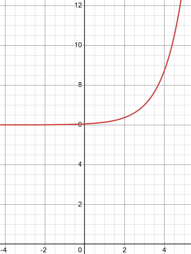
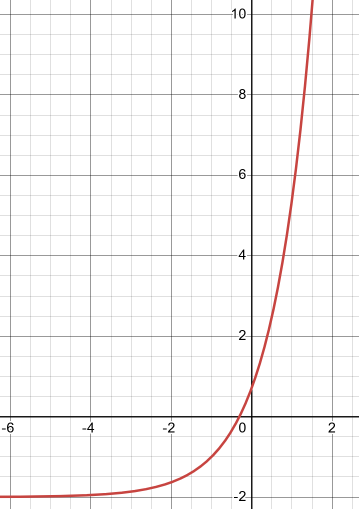

# 6.1 Exponential Functions

---

Let’s start off this section with the definition of an exponential function.

> If $b$ is any number such that $b > 0$ and $b \neq 1$ then an **exponential
> function** is a function in the form,
>
> $$ f(x) = b^x $$
>
> where $b$ is called the **base** and $x$ can be any real number.

Notice that the $x$ is now in the exponent and the base is a fixed number. This
is exactly the opposite from what we’ve seen to this point. To this point the
base has been the variable, $x$ in most cases, and the exponent was a fixed
number. However, despite these differences these functions evaluate in exactly
the same way as those that we are used to. We will see some examples of
exponential functions shortly.

Before we get too far into this section we should address the restrictions on
$b$ . We avoid one and zero because in this case the function would be,

$$ f(x) = 0^x = 0 \text{ and } f(x) = 1^x = 1 $$

and these are constant functions and won’t have many of the same properties that
general exponential functions have.

Next, we avoid negative numbers so that we don’t get any complex values out of
the function evaluation. For instance, if we allowed $b = −4$ the function would
be,

$$ f(x) = (-4)^x \quad \Rightarrow \quad f\left(\frac{1}{2}\right) = (-4)^{\frac{1}{2}} = \sqrt{-4} $$

and as you can see there are some function evaluations that will give complex
numbers. We only want real numbers to arise from function evaluation and so to
make sure of this we require that $b$ not be a negative number.

Now, let’s take a look at a couple of graphs. We will be able to get most of the
properties of exponential functions from these graphs.

---

**Example 1**

Sketch the graph of $f(x) = 2^x$ and $g(x) = \left(\dfrac{1}{2}\right)^x$ on the
same axis system.

Okay, since we don’t have any knowledge on what these graphs look like we’re
going to have to pick some values of $x$ and do some function evaluations.
Function evaluation with exponential functions works in exactly the same manner
that all function evaluation has worked to this point. Whatever is in the
parenthesis on the left we substitute into all the $x$’s on the right side.

Here are some evaluations for these two functions,

| $x$  | $f(x) = 2^x$                                     | $g(x) = \left(\dfrac{1}{2}\right)^x$                                       |
| ---- | ------------------------------------------------ | -------------------------------------------------------------------------- |
| $-2$ | $f(-2) = 2^{-2} = \dfrac{1}{2^2} = \dfrac{1}{4}$ | $g(-2) = \left(\dfrac{1}{2}\right)^{-2} = \left(\dfrac{2}{1}\right)^2 = 4$ |
| $-1$ | $f(-1) = 2^{-1} = \dfrac{1}{2^1} = \dfrac{1}{2}$ | $g(-1) = \left(\dfrac{1}{2}\right)^{-1} = \left(\dfrac{2}{1}\right)^1 = 2$ |
| $0$  | $f(0) = 2^0 = 1$                                 | $g(0) = \left(\dfrac{1}{2}\right)^0 = 1$                                   |
| $1$  | $f(1) = 2^1 = 2$                                 | $g(1) = \left(\dfrac{1}{2}\right)^1 = \dfrac{1}{2}$                        |
| $2$  | $f(2) = 2^2 = 4$                                 | $g(2) = \left(\dfrac{1}{2}\right)^2 = \dfrac{1}{4}$                        |

Here is the sketch of the two graphs.

---

Note as well that we could have written $g(x)$ in the following way,

$$ g(x) = \left(\frac{1}{2}\right)^x = \frac{1}{2^x} = 2^{-x} $$

Sometimes we’ll see this kind of exponential function and so it’s important to
be able to go between these two forms.

Now, let’s talk about some of the properties of exponential functions.

**Properties of $f(x) = b^x$**

> 1. The graph of $f(x)$ will always contain the point $(0, 1)$. Or put another
>    way, $f(0) = 1$ regardless of the value of $b$.
> 2. For every possible $b$ we have $b^x > 0$. Note that this implies that
>    $b^x \neq 0$.
> 3. If $0 < b < 1$ then the graph of $b^x$ will decrease as we move from left
>    to right. Check out the graph of $\left(\dfrac{1}{2}\right)^x$ above for
>    verification of this property.
> 4. If $b > 1$ then the graph of $b^x$ will increase as we move from left to
>    right. Check out the graph of $2^x$ above for verification of this
>    property.
> 5. If $b^x = b^y$ then $x = y$.

All of these properties except the final one can be verified easily from the
graphs in the first example. We will hold off discussing the final property for
a couple of sections where we will actually be using it.

As a final topic in this section we need to discuss a special exponential
function. In fact this is so special that for many people this is THE
exponential function. Here it is,

$$ f(x) = \mathbf{e}^x $$

where $\mathbf{e} = 2.718281828 \dots$. Note the difference between $f(x) = b^x$
and $f(x) = \mathbf{e}^x$. in the first case $b$ is any number that meets the
restrictions given above while $\mathbf{e}$ is a very specific number. Also note
that $\mathbf{e}$ is not a terminating decimal.

This special exponential function is very important and arises naturally in many
areas. As noted above, this function arises so often that many people will think
of this function if you talk about exponential functions. We will see some of
the applications of this function in the final section of this chapter.

Let's get a quick graph of this function.

---

**Example 2**

Sketch the graph of $f(x) = \mathbf{e}^x$.

Let’s first build up a table of values for this function.

| $x$    | $-2$          | $-1$          | $0$ | $1$          | $2$          |
| ------ | ------------- | ------------- | --- | ------------ | ------------ |
| $f(x)$ | $0.1353\dots$ | $0.3679\dots$ | $1$ | $2.718\dots$ | $7.389\dots$ |

To get these evaluation (with the exception of $x = 0$) you will need to use a
calculator. In fact, that is part of the point of this example. Make sure that
you can run your calculator and verify these numbers.

Here is a sketch of this graph.

Notice that this is an increasing graph as we should expect since
$\mathbf{e} = 2.718281827 \dots > 1$.

---

There is one final example that we need to work before moving onto the next
section. This example is more about the evaluation process for exponential
functions than the graphing process. We need to be very careful with the
evaluation of exponential functions.

---

**Example 3**

Sketch the graph of $g(x) = 5\mathbf{e}^{1 - x} - 4$.

Here is a quick table of values for this function.

| $x$    | $-1$          | $0$          | $1$ | $2$           | $3$           |
| ------ | ------------- | ------------ | --- | ------------- | ------------- |
| $g(x)$ | $32.945\dots$ | $9.591\dots$ | $1$ | $-2.161\dots$ | $-3.323\dots$ |

Now, as we stated above this example was more about the evaluation process than
the graph so let’s go through the first one to make sure that you can do these.

$$ g(-1) = 5\mathbf{e}^{1 - (-1)} - 4 $$

$$ \quad = 5\mathbf{e}^2 - 4 $$

$$ \quad \quad \quad = 5(7.389) - 4 $$

Notice that when evaluating exponential functions we first need to actually do
the exponentiation before we multiply by any coefficients (5 in this case).
Also, we used only 3 decimal places here since we are only graphing. In many
applications we will want to use far more decimal places in these computations.

Here is a sketch of the graph.

---

Notice that this graph violates all the properties we listed above. That is
okay. Those properties are only valid for functions in the form $f(x) = b^x$ or
$f(x) = \mathbf{e}^x$. We've got a lot more going on in this function and so the
proeprties, as written above, won't hold for this function.

---

## Practice Problems

**1.** Given the function $f(x) = 4^x$ evaluate each of the following.

**(a)** $f(-2)$

$$ f(-2) = 4^{-2} = \left(\frac{1}{4^2}\right) = \frac{1}{16} $$

**(b)** $f\left(-\dfrac{1}{2}\right)$

$$ f\left(-\dfrac{1}{2}\right) = 4^{-\frac{1}{2}} = \frac{1}{4^{\frac{1}{2}}} = \frac{1}{\sqrt{4}} = \frac{1}{2} $$

**(c\)** $f(0)$

$$ f(0) = 4^0 = 1 $$

**(d)** $f(1)$

$$ f(1) = 4^1 = 4 $$

**(e)** $f\left(\dfrac{3}{2}\right)$

$$ f\left(\dfrac{3}{2}\right) = 4^{\frac{3}{2}} = \left(4^{\frac{1}{2}}\right)^3 = 2^3 = 8 $$

**2.** Given the function $f(x) = \left(\dfrac{1}{5}\right)^x$ evaluate each of
the following.

**(a)** $f(-3)$

$$ f(-3) = \left(\dfrac{1}{5}\right)^{-3} = \left(\frac{5}{1}\right)^3 = \frac{5^3}{1^3} = 125 $$

**(b)** $f(-1)$

$$ f(-1) = \left(\dfrac{1}{5}\right)^{-1} = \left(\frac{5}{1}\right)^1 = 5 $$

**(c\)** $f(0)$

$$ f(0) = \left(\dfrac{1}{5}\right)^{0} = 1 $$

**(d)** $f(2)$

$$ f(2) = \left(\dfrac{1}{5}\right)^{2} = \frac{1^2}{5^2} = \frac{1}{25} $$

**(e)** $f(3)$

$$ f(3) = \left(\dfrac{1}{5}\right)^{3} = \frac{1^3}{5^3} = \frac{1}{125} $$

**3.** Sketch each of the following.

**(a)** $f(x) = 6^x$

| $x$  | $f(x)$                                            |
| ---- | ------------------------------------------------- |
| $-2$ | $f(-2) = 6^{-2} = \dfrac{1}{6^2} = \dfrac{1}{36}$ |
| $-1$ | $f(-1) = 6^{-1} = \dfrac{1}{6}$                   |
| $0$  | $f(0) = 6^0 = 1$                                  |
| $1$  | $f(1) = 6^1 = 6$                                  |
| $2$  | $f(2) = 6^2 = 36$                                 |

**(b)** $g(x) = 6^x - 9$

| $x$  | $g(x)$                                                                           |
| ---- | -------------------------------------------------------------------------------- |
| $-2$ | $g(-2) = 6^{-2} - 9 = \dfrac{1}{6^2} - 9 = \dfrac{1}{36} - 9 = -\dfrac{323}{36}$ |
| $-1$ | $g(-1) = 6^{-1} - 9 = \dfrac{1}{6^1} - 9 = \dfrac{1}{6} - 9 = -\dfrac{53}{6}$    |
| $0$  | $g(0) = 6^0 - 9 = 1 - 9 = -8$                                                    |
| $1$  | $g(1) = 6^1 - 9 = 6 - 9 = -3$                                                    |
| $2$  | $g(2) = 6^2 - 9 = 36 - 9 = 27$                                                   |

**(c\)** $g(x) = 6^{x + 1}$

| $x$  | $g(x)$                                       |
| ---- | -------------------------------------------- |
| $-2$ | $g(-2) = 6^{-2 + 1} = 6^{-1} = \dfrac{1}{6}$ |
| $-1$ | $g(-1) = 6^{-1 + 1} = 6^0 = 1$               |
| $0$  | $g(0) = 6^{0 + 1} = 6^1 = 6$                 |
| $1$  | $g(1) = 6^{1 + 1} = 6^2 = 36$                |
| $2$  | $g(2) = 6^{2 + 1} = 6^3 = 216$               |

**4.** Sketch the graph of $f(x) = \mathbf{e}^{-x}$.

**5.** Sketch the graph of $f(x) = \mathbf{e}^{x - 3} + 6$.

---

## Assignment Problems

**1.** Given the function $f(x) = 9^x$ evaluate each of the following.

**(a)** $f(-3)$

$$ f(-3) = 9^{-3} = \frac{1}{9^3} = \frac{1}{729} $$

**(b)** $f(-1)$

$$ f(-1) = 9^{-1} = \frac{1}{9} $$

**(c\)** $f(0)$

$$ f(0) = 9^0 = 1 $$

**(d)** $f\left(\dfrac{1}{2}\right)$

$$ f\left(\frac{1}{2}\right) = 9^{\frac{1}{2}} = \sqrt{9} = 3 $$

**(e)** $f\left(\dfrac{3}{2}\right)$

$$ f\left(\frac{3}{2}\right) = 9^{\frac{3}{2}} = (9^{\frac{1}{2}})^3 = (3)^3 = 27 $$

**2.** Given the function $f(x) = 8^x$ evaluate each of the following.

**(a)** $f\left(-\dfrac{2}{3}\right)$

$$ f\left(-\dfrac{2}{3}\right) = 8^{-\frac{2}{3}} = \frac{1^\frac{2}{3}}{8^{\frac{2}{3}}} = \frac{1}{(8^{\frac{1}{3}})^2} = \frac{1}{(\sqrt[3]{8})^2} = \frac{1}{(2)^2} = \frac{1}{4} $$

**(b)** $f(-1)$

$$ f(-1) = 8^{-1} = \frac{1}{8} $$

**(c\)** $f(0)$

$$ f(0) = 8^{0} = 1 $$

**(d)** $f(2)$

$$ f(2) = 8^{2} = 16 $$

**(e)** $f\left(\dfrac{5}{3}\right)$

$$ f\left(\dfrac{5}{3}\right) = 8^{\frac{5}{3}} = (8^{\frac{1}{3}})^5 = (\sqrt[3]{8})^5 = (2)^5 = 32 $$

**3.** Given the function $f(x) = \left(\dfrac{1}{7}\right)^x$ evaluate each of
the following.

**(a)** $f(-2)$

$$ f(-2) = \left(\dfrac{1}{7}\right)^{-2} = 7^2 = 49 $$

**(b)** $f(-1)$

$$ f(-1) = \left(\dfrac{1}{7}\right)^{-1} = 7 $$

**(c\)** $f(0)$

$$ f(0) = \left(\dfrac{1}{7}\right)^0 = 1 $$

**(d)** $f(2)$

$$ f(2) = \left(\dfrac{1}{7}\right)^2 = \frac{1}{49} $$

**(e)** $f(4)$

$$ f(4) = \left(\dfrac{1}{7}\right)^4 = \frac{1}{2401} $$

**4.** Given the following $f(x) = \left(\dfrac{1}{16}\right)^x$ evaluate each
of the following.

**(a)** $f(-2)$

$$ f(-2) = \left(\dfrac{1}{16}\right)^{-2} = 16^2 = 256 $$

**(b)** $f\left(-\dfrac{1}{4}\right)$

$$ f\left(-\frac{1}{4}\right) = \left(\dfrac{1}{16}\right)^{-\frac{1}{4}} = 16^{\frac{1}{4}} = \sqrt[4]{16} = 2 $$

**(c\)** $f(0)$

$$ f(0) = \left(\dfrac{1}{16}\right)^{0} = 1 $$

**(d)** $f(2)$

$$ f(2) = \left(\dfrac{1}{16}\right)^{2} = \frac{1}{256} $$

**(e)** $f\left(\dfrac{1}{4}\right)$

$$ f\left(\frac{1}{4}\right) = \left(\dfrac{1}{16}\right)^{\frac{1}{4}} = \frac{1^{\frac{1}{4}}}{16^{\frac{1}{4}}} = \frac{1}{\sqrt[4]{16}} = \frac{1}{2} $$

**5.** Sketch each of the following.

**(a)** $f(x) = \left(\dfrac{1}{3}\right)^x$

| $x$  | $f(x)$                                              |
| ---- | --------------------------------------------------- |
| $-2$ | $f(-2) = \left(\dfrac{1}{3}\right)^{-2} = 3^2 = 9$  |
| $-1$ | $f(-1) = \left(\dfrac{1}{3}\right)^{-1} = 3$        |
| $0$  | $f(0) = \left(\dfrac{1}{3}\right)^0 = 1$            |
| $1$  | $f(1) = \left(\dfrac{1}{3}\right)^1 = \dfrac{1}{3}$ |
| $2$  | $f(2) = \left(\dfrac{1}{3}\right)^2 = \dfrac{1}{9}$ |

**(b)** $g(x) = \left(\dfrac{1}{3}\right)^x + 2$

| $x$  | $g(x)$                                                                                  |
| ---- | --------------------------------------------------------------------------------------- |
| $-2$ | $g(-2) = \left(\dfrac{1}{3}\right)^{-2} + 2 = 3^2 + 2 = 9 + 2 = 11$                     |
| $-1$ | $g(-1) = \left(\dfrac{1}{3}\right)^{-1} + 2 = 3 + 2 = 5$                                |
| $0$  | $g(0) = \left(\dfrac{1}{3}\right)^0 + 2 = 1 + 2 = 3$                                    |
| $1$  | $g(1) = \left(\dfrac{1}{3}\right)^1 + 2 = \dfrac{1}{3} + \dfrac{6}{3} = \dfrac{7}{3}$   |
| $2$  | $g(2) = \left(\dfrac{1}{3}\right)^2 + 2 = \dfrac{1}{9} + \dfrac{18}{9} = \dfrac{19}{9}$ |

**(c\)** $g(x) = \left(\dfrac{1}{3}\right)^{x + 4}$

| $x$  | $g(x)$                                                                                      |
| ---- | ------------------------------------------------------------------------------------------- |
| $-2$ | $g(-2) = \left(\dfrac{1}{3}\right)^{-2 + 4} =\left(\dfrac{1}{3}\right)^{2} = \dfrac{1}{9}$  |
| $-1$ | $g(-1) = \left(\dfrac{1}{3}\right)^{-1 + 4} =\left(\dfrac{1}{3}\right)^{3} = \dfrac{1}{27}$ |
| $0$  | $g(0) = \left(\dfrac{1}{3}\right)^{0 + 4} = \left(\dfrac{1}{3}\right)^4 = \dfrac{1}{81}$    |
| $1$  | $g(1) = \left(\dfrac{1}{3}\right)^{1 + 4} = \left(\dfrac{1}{3}\right)^5 = \dfrac{1}{243}$   |
| $2$  | $g(2) = \left(\dfrac{1}{3}\right)^{2 + 4} = \left(\dfrac{1}{3}\right)^6 = \dfrac{1}{729}$   |

**6.** Sketch each of the following.

**(a)** $f(x) = 5^x$

| $x$  | $f(x)$                                                         |
| ---- | -------------------------------------------------------------- |
| $-2$ | $f(-2) = 5^{-2} = \left(\dfrac{1}{5}\right)^2 = \dfrac{1}{25}$ |
| $-1$ | $f(-1) = 5^{-1} = \dfrac{1}{5}$                                |
| $0$  | $f(0) = 5^0 = 1$                                               |
| $1$  | $f(1) = 5^1 = 5$                                               |
| $2$  | $f(2) = 5^2 = 25$                                              |

**(b)** $g(x) = 5^x - 4$

| $x$  | $g(x)$                                                                                       |
| ---- | -------------------------------------------------------------------------------------------- |
| $-2$ | $g(-2) = 5^{-2} - 4 = \left(\dfrac{1}{5}\right)^2 - 4 = \dfrac{1}{25} - 4 = -\dfrac{99}{25}$ |
| $-1$ | $g(-1) = 5^{-1} - 4 = \dfrac{1}{5} - 4 = -\dfrac{19}{5}$                                     |
| $0$  | $g(0) = 5^0 - 4 = 1 - 4 = -3$                                                                |
| $1$  | $g(1) = 5^1 - 4 = 5 - 4 = 1$                                                                 |
| $2$  | $g(2) = 5^2 - 4 = 25 - 4 = 21$                                                               |

**(c\)** $g(x) = 5^{x - 3}$

| $x$  | $g(x)$                                                                        |
| ---- | ----------------------------------------------------------------------------- |
| $-2$ | $g(-2) = 5^{-2 - 3} = 5^{-5} = \left(\dfrac{1}{5}\right)^5 = \dfrac{1}{3125}$ |
| $-1$ | $g(-1) = 5^{-1 - 3} = 5^{-4} = \left(\dfrac{1}{5}\right)^4 = \dfrac{1}{625}$  |
| $0$  | $g(0) = 5^{0 - 3} = 5^{-3} = \left(\dfrac{1}{5}\right)^3 = \dfrac{1}{125}$    |
| $1$  | $g(1) = 5^{1 - 3} = 5^{-2} = \left(\dfrac{1}{5}\right)^2 = \dfrac{1}{25}$     |
| $2$  | $g(2) = 5^{2 - 3} =  5^{-1} = \dfrac{1}{5}$                                   |

**7.** Sketch the graph of $f(x) = 10^{x - 2} + 6$.

**8.** Sketch the graph of $f(x) = \left(\dfrac{1}{7}\right)^{x + 4} - 1$.

**9.** Sketch the graph of $f(x) = \mathbf{e}^{x + 1} - 2$.

**10.** Sketch the graph of $f(x) = \mathbf{e}^{x - 4} - 1$.

