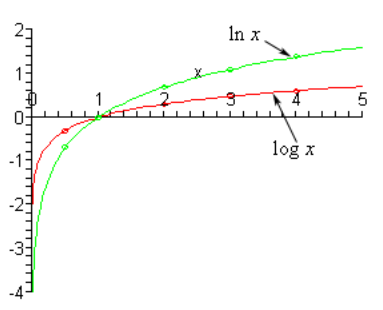
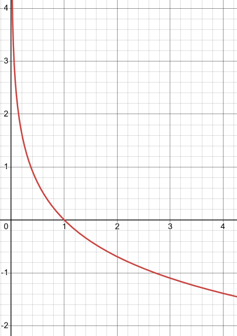
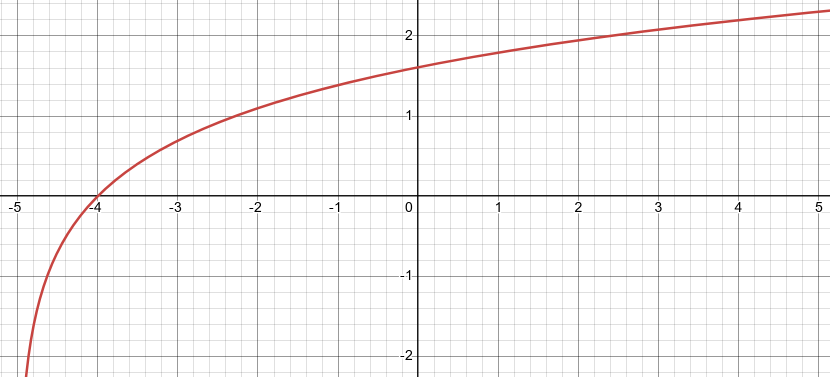
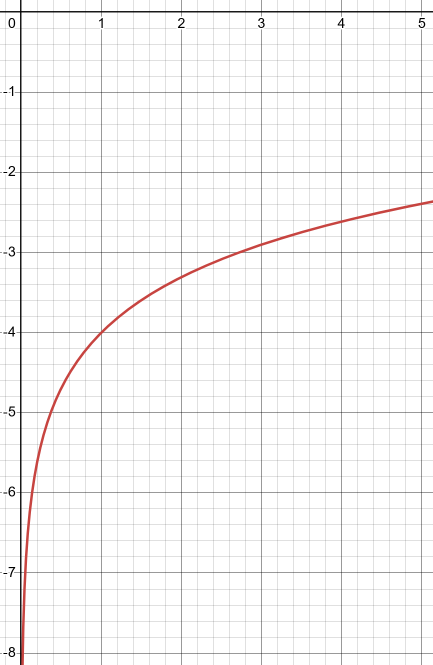
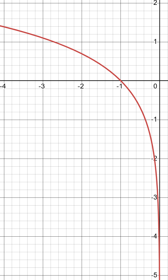
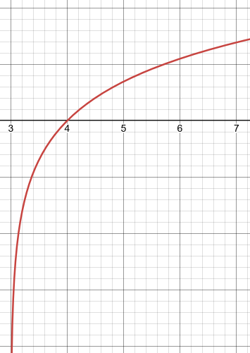
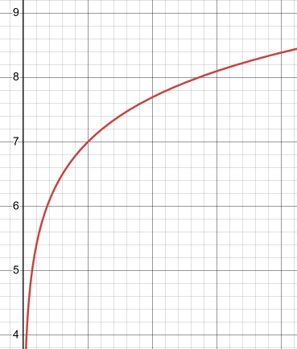
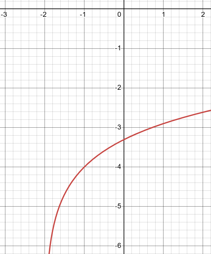
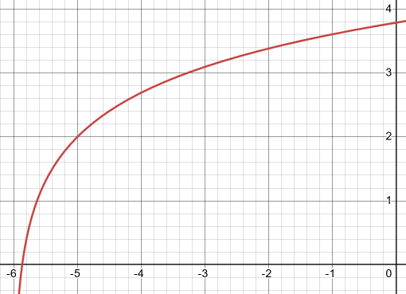

# 6.2 Logarithm Functions

---

In this section we now need to move into logarithm functions. This can be a
tricky function to graph right away. There is going to be some different
notation that you aren’t used to and some of the properties may not be all that
intuitive. Do not get discouraged however. Once you figure these out you will
find that they really aren’t that bad and it usually just takes a little working
with them to get them figured out.

Here is the definition of the logarithm function.

> If $b$ is any number such that $b > 0$ and $b \neq 1$ and $x > 0$ then,
> $$ y = \log_{b}{x} \text{ is equivalent to } b^y = x $$
>
> We usually read this as "log base $b$ of $x$".

In this definition $y = \log_{b}{x}$ is called the **logarithm form** and $b^y =
x$ is called the **exponential form**.

Note that the requirement that $x > 0$ is really a result of the fact that we
are also requiring $b > 0$. If you think about it, it will make sense. We are
raising a positive number to an exponent and so there is no way that the result
can possibly be anything other than another positive number. It is very
important to remember that we can’t take the logarithm of zero or a negative
number.

Now, let’s address the notation used here as that is usually the biggest hurdle
that students need to overcome before starting to understand logarithms. First,
the “log” part of the function is simply three letters that are used to denote
the fact that we are dealing with a logarithm. They are not variables and they
aren’t signifying multiplication. They are just there to tell us we are dealing
with a logarithm.

Next, the $b$ that is subscripted on the “log” part is there to tell us what the
base is as this is an important piece of information. Also, despite what it
might look like there is no exponentiation in the logarithm form above. It might
look like we’ve got bx

in that form, but it isn’t. It just looks like that might be what’s happening.

It is important to keep the notation with logarithms straight, if you don’t you
will find it very difficult to understand them and to work with them.

Now, let’s take a quick look at how we evaluate logarithms.

---

**Example 1** Evaluate each of the following logarithms.

Now, the reality is that evaluating logarithms directly can be a very difficult
process, even for those who really understand them. It is usually much easier to
first convert the logarithm form into exponential form. In that form we can
usually get the answer pretty quickly.

**(a)** $\log_{4}{16}$

Okay what we are really asking here is the following.

$$ \log_{4}{16} = ? $$

As suggested above, let’s convert this to exponential form.

$$ \log_{4}{16} = ? \quad \Rightarrow \quad 4^{?} = 16 $$

Most people cannot evaluate the logarithm $\log_{4}{16}$ right off the top of
their head. However, most people can determine the exponent that we need on 4 to
get 16 once we do the exponentiation. So, since,

$$ 4^2 = 16 $$

we must have the following value of the logarithm.

$$ \log_{4}{16} = 2 $$

**(b)** $\log_{2}{16}$

This one is similar to the previous part. Let’s first convert to exponential
form.

$$ \log_{2}{16} = ? \quad \Rightarrow \quad 2^{?} = 16 $$

If you don’t know this answer right off the top of your head, start trying
numbers. In other words, compute 2^2, 2^3, 2^4, _etc_ until you get 16. In this
case we need an exponent of $4$. Therefore, the value of this logarithm is,

$$ \log_{2}{16} = 4 $$

**(c\)** $\log_{6}{216}$

We’ll do this one without any real explanation to see how well you’ve got the
evaluation of logarithms down.

$$ \log_{6}{216} = 3 \text{ because } 6^3 = 216 $$

**(d)** $\log_{5}{\dfrac{1}{125}}$

Now, this one looks different from the previous parts, but it really isn’t any
different. As always let’s first convert to exponential form.

$$ \log_{5}{\frac{1}{125}} = ? \quad \Rightarrow \quad 5^{?} = \frac{1}{125} $$

First, notice that the only way that we can raise an integer to an integer power
and get a fraction as an answer is for the exponent to be negative. So, we know
that the exponent has to be negative.

Now, let's ignore the fraction for a second and ask $5^{?} = 125$. In this case
if we cube $5$ we will get $125$.

So, it looks like we have the following,

$$ \log_{5}{\frac{1}{125}} = -3 \quad \text{ because } \quad 5^{-3} = \frac{1}{5^3} = \frac{1}{125} $$

**(e)** $\log_{\frac{1}{3}}{81}$

Converting this logarithm to exponential form gives,

$$ \log_{\frac{1}{3}}{81} = ? \quad \Rightarrow \quad \left(\frac{1}{3}\right)^{?} = 81 $$

Now, just like the previous part, the only way that this is going to work out is
if the exponent is negative. Then all we need to do is recognize that $3^4 = 81$
and we can see that,

$$ \log_{\frac{1}{3}}{81} = -4 \quad \text{ because } \quad \left(\frac{1}{3}\right)^{-4} = \left(\frac{3}{1}\right)^4 = 3^4 = 81 $$

**(f)** $\log_{\frac{3}{2}}{\dfrac{27}{8}}$

Here is the answer to this one.

$$ \log_{\frac{3}{2}}{\frac{27}{8}} \quad \text{ because } \quad \left(\frac{3}{2}\right)^3 = \frac{3^3}{2^3} = \frac{27}{8} $$

---

Hopefully, you now have an idea on how to evaluate logarithms and are starting
to get a grasp on the notation. There are a few more evaluations that we want to
do however, we need to introduce some special logarithms that occur on a very
regular basis. They are the **common logarithm** and the **natural logarithm**.
Here are the definitions and notations that we will be using for these two
logarithms.

$$ \text{common logarithm : } \quad \log{x} = \log_{10}{x} $$

$$ \text{natural logarithm : } \quad \ln{x} = \log_{e}{x} $$

So, the common logarithm is simply the log base $10$, except we drop the "base
10" part of the notation. Similarly, the natural logarithm is simply the log
base $\mathbf{e}$ with a different notation and where $\mathbf{e}$ is the same
number that we saw in the previous
[section](https://tutorial.math.lamar.edu/Classes/Alg/ExpFunctions.aspx#ExpLog_Exp_EDef)
and is defined to be $\mathbf{e} = 2.718281828\dots$.

Let's take a look at a couple more evaluations.

---

**Example 2** Evaluate each of the following logarithms.

To do the first four evaluations we just need to remember what the notation for
these are and what base is implied by the notation. The final two evaluations
are to illustrate some of the properties of all logarithms that we’ll be looking
at eventually.

**(a)** $\log{1000}$

$$ \log{1000} = 3 \quad \text{ because } \quad 10^3 = 1000 $$

**(b)** $\log{\dfrac{1}{100}}$

$$ \log{\frac{1}{100}} = -2 \quad \text{ because } \quad 10^{-2} = \frac{1}{10^2} = \frac{1}{100}$$

**(c\)** $\ln{\dfrac{1}{\mathbf{e}}}$

$$ \ln{\frac{1}{\mathbf{e}}} = -1 \quad \text{ because } \quad \mathbf{e}^{-1} = \frac{1}{\mathbf{e}} $$

**(d)** $\ln{\sqrt{\mathbf{e}}}$

$$ \ln{\sqrt{\mathbf{e}}} = \frac{1}{2} \quad \text{ because } \quad \mathbf{e}^{\frac{1}{2}} = \sqrt{\mathbf{e}} $$

Notice that with this one we are really just acknowledging a change of notation
from fractional exponent into radical form.

**(e)** $\log_{34}{34}$

$$ \log_{34}{34} = 1 \quad \text{ because } \quad 34^1 = 34 $$

Notice that this one will work regardless of the base that we're using.

**(f)** $\log_{8}{1}$

$$ \log_{8}{1} = 0 \quad \text{ because } \quad 8^0 = 1 $$

Again, note that the base that we're using here won't change the answer.

---

So, when evaluating logarithms all that we’re really asking is what exponent did
we put onto the base to get the number in the logarithm.

Now, before we get into some of the properties of logarithms let’s first do a
couple of quick graphs.

---

**Example 3** Sketch the graph of the common logarithm and the natural logarithm
on the same axis system.

This example has two points. First, it will familiarize us with the graphs of
the two logarithms that we are most likely to see in other classes. Also, it
will give us some practice using our calculator to evaluate these logarithms
because the reality is that is how we will need to do most of these evaluations.

Here is a table of values for the two logarithms.

| $x$            | $\log{x}$ | $\ln{x}$  |
| -------------- | --------- | --------- |
| $\dfrac{1}{2}$ | $-0.3010$ | $-0.6931$ |
| $1$            | $0$       | $0$       |
| $2$            | $0.3010$  | $0.6931$  |
| $3$            | $0.4771$  | $1.0986$  |
| $4$            | $0.6021$  | $1.3863$  |

Here is a sketch of the graphs of these two functions.

---

Now let’s start looking at some properties of logarithms. We’ll start off with
some basic evaluation properties.

**Properties of Logarithms**

> 1. $\log_{b}{1} = 0$. This follows from the fact that $b^0 = 1$.
> 2. $\log_{b}{b} = 1$. This follows from the fact that $b^1 = b$.
> 3. $\log_{b}{b^x} = x$. This can be generalized out to
>    $\log_{b}{b^{f(x)}} = f(x)$.
> 4. $b^{\log_{b}{x}} = x$. This can be generalized out to
>    $b^{\log_{b}{f(x)}} = f(x)$.

Properties 3 and 4 leads to a nice relationship between the logarithm and
exponential function. Let's first compute the following
[function compositions](https://tutorial.math.lamar.edu/Classes/Alg/CombineFunctions.aspx)
for $f(x) = b^x$ and $g(x) = \log_{b}{x}$.

$$ (f \circ g)(x) = f[g(x)] = f(\log_{b}{x}) = b^{\log_{b}{x}} = x $$

$$ (g \circ f)(x) = g[f(x)] = g[b^x] = \log_{b}{b^x} = x $$

Recall from the section on
[inverse functions](https://tutorial.math.lamar.edu/Classes/Alg/InverseFunctions.aspx)
that this means that the exponential and logarithm functions are inverses of
each other. This is a nice fact to remember on occasion.

We should also give the generalized version of Properties 3 and 4 in terms of
both the natural and common logarithm as we’ll be seeing those in the next
couple of sections on occasion.

$$ \ln{\mathbf{e}^{f(x)}} = f(x) \quad \log{10^{f(x)}} = f(x) $$

$$ \mathbf{e}^{\ln{f(x)}} = f(x) \quad 10^{\log{f(x)}} = f(x) $$

Now, let's take a look at some manipulation properties of the logarithm.

**More Properties of Logarithms**

> 5. $\log_{b}{(xy)} = \log_{b}{x} + \log_{b}{y}$
> 6. $\log_{b}{\left(\dfrac{x}{y}\right)} = \log_{b}{x} - \log_{b}{y}$
> 7. $\log_{b}{(x ^r)} = r\log_{b}x$
> 8. If $\log_{b}{x} = \log_{b}{y}$ then $x = y$.

We won’t be doing anything with the final property in this section; it is here
only for the sake of completeness. We will be looking at this property in detail
in a couple of sections.

The first two properties listed here can be a little confusing at first since on
one side we’ve got a product or a quotient inside the logarithm and on the other
side we’ve got a sum or difference of two logarithms. We will just need to be
careful with these properties and make sure to use them correctly.

Also, note that there are no rules on how to break up the logarithm of the sum
or difference of two terms. To be clear about this let’s note the following,

$$ \log_{b}{(x + y)} \neq \log_{b}{x} + \log_{b}{y} $$

$$ \log_{b}{(x - y)} \neq \log_{b}{x} - \log_{b}{y} $$

Be careful with these and do not try to use these as they simply aren’t true.

Note that all of the properties given to this point are valid for both the
common and natural logarithms. We just didn’t write them out explicitly using
the notation for these two logarithms, the properties do hold for them
nonetheless

Now, let’s see some examples of how to use these properties.

---

**Example 4** Simplify each of the following logarithms.

The instructions here may be a little misleading. When we say simplify we really
mean to say that we want to use as many of the logarithm properties as we can.

**(a)** $\log_{4}{(x^3y^5)}$

Note that we can’t use Property 7 to bring the 3 and the 5 down into the front
of the logarithm at this point. In order to use Property 7 the whole term in the
logarithm needs to be raised to the power. In this case the two exponents are
only on individual terms in the logarithm and so Property 7 can’t be used here.

We do, however, have a product inside the logarithm so we can use Property 5 on
this logarithm.

$$ \log_{4}{(x^3y^5)} = \log_{4}{(x^3)} + \log_{4}{(y^5)} $$

Now that we’ve done this we can use Property 7 on each of these individual
logarithms to get the final simplified answer.

$$ \log_{4}{(x^3y^5)} = 3\log_{4}{x} + 5\log_{4}{y} $$

**(b)** $\log\left(\dfrac{x^9y^5}{z^3}\right)$

In this case we’ve got a product and a quotient in the logarithm. In these cases
it is almost always best to deal with the quotient before dealing with the
product. Here is the first step in this part.

$$ \log{\left(\frac{x^9y^5}{z^3}\right)} = \log{(x^9y^5)} - \log{z^3} $$

$$ \quad \quad \quad \quad \text{ } \quad \quad \quad = \log{x^9} + \log{y^5} - \log{z^3} $$

$$ \quad \quad \quad \quad \quad \text{ } \quad \quad \quad = 9\log{x} + 5\log{y} - 3\log{z}$$

**(c\)** $\ln{\sqrt{xy}}$

For this part let’s first rewrite the logarithm a little so that we can see the
first step.

$$ \ln{\sqrt{xy}} = \ln{(xy)^{\frac{1}{2}}} $$

Written in this form we can see that there is a single exponent on the whole
term and so we’ll take care of that first.

$$ \ln{\sqrt{xy}} = \frac{1}{2}\ln{(xy)} $$

Now, we will take care of the product.

$$ \ln{\sqrt{xy}} = \frac{1}{2}(\ln{x} + \ln{y}) $$

Notice the parenthesis in this the answer. The $\frac{1}{2}$ multiplies the
original logarithm and so it will also need to multiply the whole “simplified”
logarithm. Therefore, we need to have a set of parenthesis there to make sure
that this is taken care of correctly.

**(d)** $log_{3}{\left(\dfrac{(x + y)^2}{x^2 + y^2}\right)}$

We’ll first take care of the quotient in this logarithm.

$$ \log_{3}{\left(\frac{(x + y)^2}{x^2 + y^2}\right)} = \log_{3}{(x + y)^2} -
\log_{3}{(x^2 + y^2)} $$

We now reach the real point to this problem. The second logarithm is as
simplified as we can make it. Remember that we can’t break up a log of a sum or
difference and so this can’t be broken up any farther. Also, we can only deal
with exponents if the term as a whole is raised to the exponent. The fact that
both pieces of this term are squared doesn’t matter. It needs to be the whole
term squared, as in the first logarithm.

So, we can further simplify the first logarithm, but the second logarithm can’t
be simplified any more. Here is the final answer for this problem.

$$ \log_{3}{\left(\frac{(x + y)^2}{x^2 + y^2}\right)} = 2\log_{3}{(x + y)} - \log_{3}{(x^2 + y^2)} $$

---

Now, we need to work some examples that go the other way. This next set of
examples is probably more important than the previous set. We will be doing this
kind of logarithm work in a couple of sections.

---

**Example 5** Write each of the following as a single logarithmh with a
coefficient of 1.

The instruction requiring a coefficient of 1 means that the when we get down to
a final logarithm there shouldn’t be any number in front of the logarithm.

Note as well that these examples are going to be using Properties 5 – 7 only
we’ll be using them in reverse. We will have expressions that look like the
right side of the property and use the property to write it so it looks like the
left side of the property.

**(a)** $7\log_{12}{x} + 2\log_{12}{y}$

The first step here is to get rid of the coefficients on the logarithms. This
will use Property 7 in reverse. In this direction, Property 7 says that we can
move the coefficient of a logarithm up to become a power on the term inside the
logarithm.

Here is that step for this part.

$$ 7\log_{12}{x} + 2\log_{12}{y} = \log_{12}{x^7} + \log_{12}{y^2} $$

We’ve now got a sum of two logarithms both with coefficients of 1 and both with
the same base. This means that we can use Property 5 in reverse. Here is the
answer for this part.

$$ 7\log_{12}{x} + 2\log_{12}{y} = \log_{12}{(x^7y^2)} $$

**(b)** $3\log{x} - 6\log{y}$

Again, we will first take care of the coefficients on the logarithms.

$$ 3\log{x} - 6\log{y} = \log{x^3} - \log{y^6} $$

We now have a difference of two logarithms and so we can use Property 6 in
reverse. When using Property 6 in reverse remember that the term from the
logarithm that is subtracted off goes in the denominator of the quotient. Here
is the answer to this part.

$$ 3\log{x} - 6\log{y} = \log{\left(\frac{x^3}{y^6}\right)} $$

**(c\)** $5\ln{(x + y)} - 2\ln{y} - 8\ln{x}$

In this case we’ve got three terms to deal with and none of the properties have
three terms in them. That isn’t a problem. Let’s first take care of the
coefficients and at the same time we’ll factor a minus sign out of the last two
terms. The reason for this will be apparent in the next step.

$$ 5\ln{(x + y)} - 2\ln{y} - 8\ln{x} = \ln{(x + y)^5} - \ln{(y^2x^8)} $$

Now we are down to two logarithms and they are a difference of logarithms and so
we can write it as a single logarithm with a quotient.

$$ 5\ln{(x + y)} - 2\ln{y} - 8\ln{x} = \ln{\left(\frac{(x + y)^5}{y^2x^8}\right)} $$

---

The final topic that we need to discuss in this section is the **change of
base** formula.

Most calculators these days are capable of evaluating common logarithms and
natural logarithms. However, that is about it, so what do we do if we need to
evaluate another logarithm that can’t be done easily as we did in the first set
of examples that we looked at?

To do this we have the change of base formula. Here is the change of base
formula.

$$ \log_{a}{x} = \frac{\log_{b}{x}}{\log_{b}{a}} $$

where we can choose $b$ to be anything we want it to be. In order to use this to
help us evaluate logarithms this is usually the common or natural logarithm.
Here is the change of base formula using both the common logarithm and the
natural logarithm.

$$ \log_{a}{x} = \frac{\log{x}}{\log{a}} \quad \log_{a}{x} = \frac{\ln{x}}{\ln{a}} $$

Let's see how this works with an example.

---

**Example 6** Evaluate $\log_{5}{7}$.

First, notice that we can’t use the same method to do this evaluation that we
did in the first set of examples. This would require us to look at the following
exponential form,

$$ 5^{?} = 7 $$

and that’s just not something that anyone can answer off the top of their head.
If the 7 had been a 5, or a 25, or a 125, _etc._ we could do this, but it’s not.
Therefore, we have to use the change of base formula.

Now, we can use either one and we’ll get the same answer. So, let’s use both and
verify that. We’ll start with the common logarithm form of the change of base.

$$ \log_{5}{7} = \frac{\log{7}}{\log{5}} = \frac{0.845098040014}{0.698970004336} = 1.20906195512 $$

Now, let's try the natural logarithm form of the change of base formula.

$$ \log_{5}{7} = \frac{\ln{7}}{\ln{5}} = \frac{1.94591014906}{1.60943791243} = 1.20906195512 $$

So, we go the same answer despite the fact that the fractions involved different
answers.

---

## Practice Problems

For problems 1 - 3 write the expression in logarithmic form.

**1.** $7^5 = 16807$

$$ \log_{7}{16807} = 5 $$

**2.** $16^{\frac{3}{4}} = 8$

$$ \log_{16}{8} = \frac{3}{4} $$

**3.** $\left(\dfrac{1}{3}\right)^{-2} = 9$

$$ \log_{\frac{1}{3}}{9} = -2 $$

For problems 4 - 6 write the expression in exponential form.

**4.** $\log_{2}{32} = 5$

$$ 2^5 = 32 $$

**5.** $\log_{\frac{1}{5}}{\dfrac{1}{625}} = 4$

$$ \left(\frac{1}{5}\right)^4 = \frac{1}{625} $$

**6.** $\log_{9}{\dfrac{1}{81}} = -2$

$$ 9^{-2} = \frac{1}{81} $$

For problems 7 - 12 determine the exact value of each of the following without
using a calculator.

**7.** $\log_{3}{81}$

$$ 3^{?} = 81 $$

$$ 3^4 = 81 $$

$$ \log_{3}{81} = 4 $$

**8.** $\log_{5}{125}$

$$ 5^{?} = 125 $$

$$ 5^3 = 125 $$

$$ \log_{5}{125} = 3 $$

**9.** $\log_{2}{\dfrac{1}{8}}$

$$ 2^{?} = \frac{1}{8} $$

$$ 2^{-3} = \frac{1}{8} $$

$$ \log_{2}{\frac{1}{8}} = -3 $$

**10.** $\log_{\frac{1}{4}}{16}$

$$ \left(\frac{1}{4}\right)^{?} = 16 $$

$$ \left(\frac{1}{4}\right)^{-2} = 16 $$

$$ \log_{\frac{1}{4}}{16} = -2 $$

**11.** $\ln{\mathbf{e}^4}$

$$ \mathbf{e}^{?} = \mathbf{e}^4 $$

$$ \ln{mathbf{e}^4} = 4 $$

**12.** $\log{\dfrac{1}{100}}$

$$ 10^{?} = \frac{1}{100} $$

$$ \log{\dfrac{1}{100}} = -2 $$

For problems 13 - 15 write each of the following in terms of simpler logarithms

**13.** $\log{(3x^4y^{-7})}$

$$ \log{(3x^4y^{-7})} = \log{(3x^4)} + \log{(y^-7)} $$

$$ \log{(3x^4y^{-7})} = 4\log{(3x)} -7 \log{(y)} $$

$$ \log{(3x^4y^{-7})} = \log{(3)} + 4\log{(x)} -7 \log{(y)} $$

**14.** $\ln\left(x\sqrt{y^2 + z^2}\right)$

$$ \ln\left(x\sqrt{y^2 + z^2}\right) = \ln{(x)} + \ln{\left(\sqrt{y^2 + z^2}\right)} $$

$$ \ln\left(x\sqrt{y^2 + z^2}\right) = \ln{(x)} + \ln{(y^2 + z^2)^{\frac{1}{2}}} $$

$$ \ln\left(x\sqrt{y^2 + z^2}\right) = \ln{(x)} + \frac{1}{2}\ln{(y^2 + z^2)}$$

**15.** $\log_{4}{\left(\dfrac{x - 4}{y^2\sqrt[5]{z}}\right)}$

$$ \log_{4}{\left(\dfrac{x - 4}{y^2\sqrt[5]{z}}\right)} = \log_{4}{(x - 4)} - \log_{4}{(y^2\sqrt[5]{z})} $$

$$ \log_{4}{\left(\dfrac{x - 4}{y^2\sqrt[5]{z}}\right)} = \log_{4}{(x - 4)} - \log_{4}{(y^2)} + \log_{4}{(\sqrt[5]{z})}$$

$$ \log_{4}{\left(\dfrac{x - 4}{y^2\sqrt[5]{z}}\right)} = \log_{4}{(x - 4)} - 2\log_{4}{(y)} + \frac{1}{5}\log_{4}{(z)} $$

For problems 16 - 18 combine each of the following into a single logarithm with
a coefficient of one.

**16.** $2\log_{4}{x} + 5\log_{4}{y} - \frac{1}{2}\log_{4}{z}$

$$ 2\log_{4}{x} + 5\log_{4}{y} - \frac{1}{2}\log_{4}{z} = \log_{4}{x^2} + \log_{4}{y^5} - \log_{4}{\sqrt{z}} $$

$$ 2\log_{4}{x} + 5\log_{4}{y} - \frac{1}{2}\log_{4}{z} = \log_{4}{\left(\frac{x^2y^5}{\sqrt{z}}\right)} $$

**17.** $3\ln{(t + 5)} - 4\ln{t} - 2\ln{(s - 1)}$

$$ 3\ln{(t + 5)} - 4\ln{t} - 2\ln{(s - 1)} = \ln{(t + 5)^3} - \ln{t^4} - \ln{(s - 1)^2} $$

$$ 3\ln{(t + 5)} - 4\ln{t} - 2\ln{(s - 1)} = \ln{(t + 5)^3} - \left(\ln{t^4} + \ln{(s - 1)^2}\right) $$

$$ 3\ln{(t + 5)} - 4\ln{t} - 2\ln{(s - 1)} = \ln{\left[\frac{(t + 5)^3}{t^4(s - 1)^2}\right]} $$

**18.** $\dfrac{1}{3}\log{a} - 6\log{b} + 2$

$$ \frac{1}{3}\log{a} - 6\log{b} + 2 = \log{\sqrt[3]{a}} - \log{b^6} + 2 $$

$$ \frac{1}{3}\log{a} - 6\log{b} + 2 = \log{\sqrt[3]{a}} - \log{b^6} + \log{100} $$

For problems 19 & 20 use the change of base formula and a calculator to find the
value of each of the following.

**19.** $\log_{12}{35}$

$$ \log_{12}{35} = \frac{\log{35}}{\log{12}} = \frac{1.544068044}{1.079181246} = 1.43077731 $$

$$ \log_{12}{35} = \frac{\ln{35}}{\ln{12}} = \frac{3.555348016}{2.484906650} = 1.43077731 $$

**20.** $\log_{\frac{2}{3}}{53}$

$$ \log_{\frac{2}{3}}{53} = \frac{\log{53}}{\log{\frac{2}{3}}} = \frac{1.724275870}{-0.176091259} = -9.79194469 $$

$$ \log_{\frac{2}{3}}{53} = \frac{\ln{53}}{\ln{\frac{2}{3}}} = \frac{3.970291914}{-0.405465108} = -9.79194469 $$

For problems 21 - 23 sketch each of the given functions.

**21.** $g(x) = -\ln{(x)}$

| $g(x)$         | $-\ln{(x)}$ |
| -------------- | ----------- |
| $\dfrac{1}{2}$ | $0.6931$    |
| $1$            | $0$         |
| $2$            | $-0.6931$   |
| $3$            | $-1.0986$   |
| $4$            | $1.3863$    |

**22.** $g(x) = \ln{(x + 5)}$

| $g(x)$         | $\ln{(x + 5)}$ |
| -------------- | -------------- |
| $\dfrac{1}{2}$ | $1.7047$       |
| $1$            | $1.6094$       |
| $2$            | $1.9459$       |
| $3$            | $2.0794$       |
| $4$            | $2.1972$       |

**23.** $g(x) = \ln{(x)} - 4$

| $g(x)$         | $\ln{(x)} - 4$ |
| -------------- | -------------- |
| $\dfrac{1}{2}$ | $-4.6931$      |
| $1$            | $-4$           |
| $2$            | $-3.3069$      |
| $3$            | $-2.9014$      |
| $4$            | $-2.6137$      |

---

## Assignment Problems

For problems 1 - 5 write the expression in logarithmic form.

**1.** $11^{-3} = \dfrac{1}{1331}$

$$ \log_{11}{\frac{1}{1331}} = -3 $$

**2.** $4^7 = 16384$

$$ \log_{4}{16384} = 7 $$

**3.** $\left(\dfrac{2}{7}\right)^{-3} = \dfrac{343}{8}$

$$ \log_{\frac{2}{7}}{\left(\frac{343}{8}\right)} = -3 $$

**4.** $25^{\frac{3}{2}} = 125$

$$ \log_{25}{125} = \frac{3}{2} $$

**5.** $27^{-\frac{5}{3}} = \dfrac{1}{243}$

$$ \log_{27}{\left(\frac{1}{243}\right)}= -\frac{5}{3} $$

For problems 6 - 10 write the expression in exponential form.

**6.** $\log_{\frac{1}{6}}{36} = -2$

$$ \frac{1}{6}^{-2} = 36 $$

**7.** $\log_{12}{20736} = 4$

$$ 12^4 = 20736 $$

**8.** $\log_{9}{243} = \dfrac{5}{2}$

$$ 9^{\frac{5}{2}} = 243 $$

**9.** $\log_{4}{\dfrac{1}{128}} = -\dfrac{7}{2}$

$$ 4^{-\frac{7}{2}} = \frac{1}{128} $$

**10.** $\log_{8}{32768} = 5$

$$ 8^5 = 32768 $$

For problems 11 – 18 determine the exact value of each of the following without
using a calculator.

**11.** $\log_{7}{343}$

$$ 7^{?} = 343 $$

$$ 7^3 = 343 $$

$$ \log_{7}{343} = 3 $$

**12.** $\log_{4}{1024}$

$$ 4^{?} = 1024 $$

$$ 4^5 = 1024 $$

$$ \log_{4}{1024} = 5 $$

**13.** $\log_{\frac{3}{8}}{\dfrac{27}{512}}$

$$ \left(\frac{3}{8}\right)^{?} = \frac{27}{512} $$

$$ \left(\frac{3}{8}\right)^{3} = \frac{27}{512} $$

$$ \log_{\frac{3}{8}}{\dfrac{27}{512}} = 3 $$

**14.** $\log_{11}{\dfrac{1}{121}}$

$$ 11^{?} = \frac{1}{121} $$

$$ 11^{-2} = \frac{1}{121} $$

$$ \log_{11}{\dfrac{1}{121}} = -2 $$

**15.** $\log_{0.1}{0.0001}$

$$ 0.1^{?} = 0.0001 $$

$$ 0.1^4 = 0.0001 $$

$$ \log_{0.1}{0.0001} = 4 $$

**16.** $\log_{16}{4}$

$$ 16^{?} = 4 $$

$$ 16^{\frac{1}{2}} = 4 $$

$$ \log_{16}{4} = \frac{1}{2} $$

**17.** $\log{10000}$

$$ 10^{?} = 10000 $$

$$ 10^4 = 10000 $$

$$ \log{10000} = 4 $$

**18.** $\ln{\dfrac{1}{\sqrt[5]{\mathbf{e}}}}$

$$ \mathbf{e}^{?} = \frac{1}{\sqrt[5]{\mathbf{e}}} $$

$$ \mathbf{e}^{-\frac{1}{5}} = \frac{1}{\sqrt[5]{\mathbf{e}}}  $$

$$ \ln{\dfrac{1}{\sqrt[5]{\mathbf{e}}}} = -\frac{1}{5} $$

For problems 19 – 20 write each of the following in terms of simpler logarithms

**19.** $\log_{7}{10a^7b^3c^{-8}}$

$$ \log_{7}{10a^7b^3c^{-8}} = \log_{7}{10} + \log_{7}{a^7} + \log_{7}{b^3} + \log_{7}{c^{-8}} $$

$$ \log_{7}{10a^7b^3c^{-8}} = \log_{7}{10} + 7\log_{7}{a} + 3\log_{7}{b} - 8\log_7{c} $$

**20.** $\log{\left[z^2(x^2 + 4)^3\right]}$

$$ \log{\left[z^2(x^2 + 4)^3\right]} = \log{z^2} + \log{(x^2 + 4)^3} $$

$$ \log{\left[z^2(x^2 + 4)^3\right]} = 2\log{z} + 3\log{(x^2 + 4)} $$

**21.** $\ln{\left(\dfrac{w^2\sqrt[4]{t^3}}{\sqrt{t + w}}\right)}$

$$ \ln{\left(\dfrac{w^2\sqrt[4]{t^3}}{\sqrt{t + w}}\right)} = \ln{(w^2\sqrt[4]{t^3})} - \ln{(\sqrt{t + w})} $$

$$ \ln{\left(\dfrac{w^2\sqrt[4]{t^3}}{\sqrt{t + w}}\right)} = \ln{(w^2)} + \ln{(\sqrt[4]{t^3})} - \frac{1}{2}\ln{(t + w)} $$

$$ \ln{\left(\dfrac{w^2\sqrt[4]{t^3}}{\sqrt{t + w}}\right)} = 2\ln{(w)} + \frac{1}{4}\ln{(t^3)} - \frac{1}{2}\ln{(t + w)} $$

$$ \ln{\left(\dfrac{w^2\sqrt[4]{t^3}}{\sqrt{t + w}}\right)} = 2\ln{(w)} + \frac{3}{4}\ln{(t)} - \frac{1}{2}\ln{(t + w)} $$

For problems 22 – 24 combine each of the following into a single logarithm with
a coefficient of one.

**22.** $7\ln{t} - 6\ln{s} + 5\ln{w}$

$$ 7\ln{t} - 6\ln{s} + 5\ln{w} = \ln{(t^7)} - \ln{(s^6)} + \ln{(w^5)} $$

$$ 7\ln{t} - 6\ln{s} + 5\ln{w} = \ln{\left(\frac{t^7}{s^6w^5}\right)}$$

**23.** $\dfrac{1}{2}\log{(z + 1)} - 2\log{x} - 4\log{y} - 3\log{z}$

$$ \frac{1}{2}\log{(z + 1)} - 2\log{x} - 4\log{y} - 3\log{z} = \log{(\sqrt{z + 1})} - \log{(x^2)} - \log{(y^4)} - \log{(z^3)} $$

$$ \frac{1}{2}\log{(z + 1)} - 2\log{x} - 4\log{y} - 3\log{z} = \log{(\sqrt{z + 1})} + (\log{(x^2)} + \log{(y^4)} + \log{(z^3)}) $$

$$ \frac{1}{2}\log{(z + 1)} - 2\log{x} - 4\log{y} - 3\log{z} = \log{\left(\frac{\sqrt{z + 1}}{x^2y^4z^3}\right)}$$

**24.** $2\log_{3}{(x + y)} + 6\log_{3}{x} - \dfrac{1}{3}$

$$ 2\log_{3}{(x + y)} + 6\log_{3}{x} - \frac{1}{3} = \log_{3}{(x + y)^2} + \log_{3}{(x^6)} - \frac{1}{3} $$

$$ 2\log_{3}{(x + y)} + 6\log_{3}{x} - \frac{1}{3} = \log_{3}{(x + y)^2} + \log_{3}{(x^6)} - log_{3}{(27)} $$

$$ 2\log_{3}{(x + y)} + 6\log_{3}{x} - \frac{1}{3} = \log_{3}\left(\frac{x^6(x + y)^2}{27}\right) $$

For problems 25 & 26 use the change of base formula and a calculator to find the
value of each of the following.

**25.** $\log_{7}{100}$

$$ \log_{7}{100} = \frac{\log{(100)}}{\log{(7)}} = \frac{2}{0.845098040} =
2.366589325 $$

$$ \log_{7}{100} = \frac{\ln{(100)}}{\ln{(7)}} = \frac{4.605170186}{1.945910149} = 2.366589325 $$

**26.** $\log_{\frac{5}{7}}{\dfrac{1}{8}}$

$$ \log_{\frac{5}{7}}{\dfrac{1}{8}}= \frac{\log{\left(\frac{1}{8}\right)}}{\log{\left(\frac{5}{7}\right)}} = \frac{-0.903089987}{-0.146128036} = 6.180128151 $$

$$ \log_{\frac{5}{7}}{\dfrac{1}{8}}= \frac{\ln{\left(\frac{1}{8}\right)}}{\ln{\left(\frac{5}{7}\right)}} = \frac{-2.079441542}{-0.336472237} = 6.180128151 $$

For problems 27 – 31 sketch each of the given functions.

**27.** $g(x) = \ln{(-x)}$

| $g(x)$          | $\ln{(-x)}$ |
| --------------- | ----------- |
| $-\dfrac{1}{2}$ | $-0.6931$   |
| $-1$            | $0$         |
| $-2$            | $0.6931$    |
| $-3$            | $1.0986$    |
| $-4$            | $1.3863$    |

**28.** $g(x) = \ln{(x - 3)}$

| $g(x)$ | $\ln{(x - 3)}$ |
| ------ | -------------- |
| $4$    | $0$            |
| $5$    | $0.6931471806$ |
| $6$    | $1.098612289$  |
| $7$    | $1.386294361$  |
| $8$    | $1.609437912$  |

**29.** $g(x) = \ln{(x)} + 7$

| $g(x)$         | $\ln{(x)} + 7$ |
| -------------- | -------------- |
| $\dfrac{1}{2}$ | $2.014903021$  |
| $1$            | $2.079441542$  |
| $2$            | $2.197224577$  |
| $3$            | $2.302585093$  |
| $4$            | $2.397895273$  |

**30.** $g(x) = \ln{(x + 2)} - 4$

| $g(x)$         | $\ln{(x + 2)} - 4$ |
| -------------- | ------------------ |
| $\dfrac{1}{2}$ | $-3.083709268$     |
| $1$            | $-2.901387711$     |
| $2$            | $-2.613705639$     |
| $3$            | $-2.390562088$     |
| $4$            | $-2.208240531$     |

**31.** $g(x) = \ln{(x + 6)} + 2$

| $g(x)$         | $\ln{(x + 6)} + 2$ |
| -------------- | ------------------ |
| $\dfrac{1}{2}$ | $3.871802177$      |
| $1$            | $3.945910149$      |
| $2$            | $4.079441542$      |
| $3$            | $4.197224577$      |
| $4$            | $4.302585093$      |

