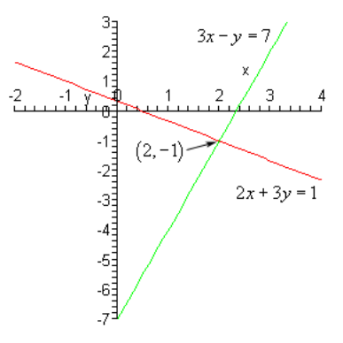
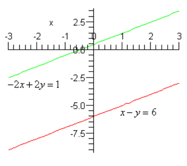

# 7.1 Linear Systems With Two Variables

---

A linear system of two equations with two variables is any system that can be
written in the form.

$$
\begin{align*}
ax + by = p \\
cx + dy = q
\end{align*}
$$

where any of the constants can be zero with the exception that each equation
must have at least one variable in it.

Also, the system is called linear if the variables are only to the first power,
are only in the numerator and there are no products of variables in any of the
equations.

Here is an example of a system with numbers.

$$
\begin{align*}
3x - y = 7 \\
2x + 3y = 1
\end{align*}
$$

Before we discuss how to solve systems we should first talk about just what a
solution to a system of equations is. A solution to a system of equations is a
value of $x$ and a value of $y$ that, when substituted into the equations,
satisfies both equations at the same time.

For the example above $x = 2$ and $y = −1$ is a solution to the system. This is
easy enough to check.

$$
\begin{align*}
3(2) - (-1) = 7 \\
2(2) + 3(-1) = 1
\end{align*}
$$

So, sure enough that pair of numbers is a solution to the system. Do not worry
about how we got these values. This will be the very first system that we solve
when we get into examples.

Note that it is important that the pair of numbers satisfy both equations. For
instance, $x = 1$ and $y = −4$ will satisfy the first equation, but not the
second and so isn’t a solution to the system. Likewise, $x = −1$ and $y = 1$
will satisfy the second equation but not the first and so can’t be a solution to
the system.

Now, just what does a solution to a system of two equations represent? Well if
you think about it both of the equations in the system are lines. So, let’s
graph them and see what we get.

As you can see the solution to the system is the coordinates of the point where
the two lines intersect. So, when solving linear systems with two variables we
are really asking where the two lines will intersect.

We will be looking at two methods for solving systems in this section.

The first method is called the **method of substitution**. In this method we
will solve one of the equations for one of the variables and substitute this
into the other equation. This will yield one equation with one variable that we
can solve. Once this is solved we substitute this value back into one of the
equations to find the value of the remaining variable.

In words this method is not always very clear. Let’s work a couple of examples
to see how this method works.

---

**Example 1** Solve each of the following systems.

**(a)**

$$
\begin{align*}
3x - y = 7 \\
2x + 3y = 1
\end{align*}
$$

So, this was the first system that we looked at above. We already know the
solution, but this will give us a chance to verify the values that we wrote down
for the solution.

Now, the method says that we need to solve one of the equations for one of the
variables. Which equation we choose and which variable that we choose is up to
you, but it’s usually best to pick an equation and variable that will be easy to
deal with. This means we should try to avoid fractions if at all possible.

In this case it looks like it will be really easy to solve the first equation
for $y$ so let’s do that.

$$ 3x - 7 = y $$

Now, substitute this into the second equation.

$$ 2x + 3(3x - 7) = 1 $$

This is an equatioon in $x$ that we can solve so let's do that.

$$ 2x + 9x - 21 = 1 $$

$$ 11x = 22 $$

$$ x = 2 $$

So, there is the $x$ portion of the solution.

Finally, do NOT forget to go back and find the $y$ portion of the solution. This
is one of the more common mistakes students make in solving systems. To so this
we can either plug the $x$ value into one of the original equations and solve
for $y$ or we can just plug it into our substitution that we found in the first
step. That will be easier so let’s do that.

$$ y = 3x - 7 = 3(2) - 7 = -1 $$

So, the solution is $x = 2$ and $y = -1$ as we noted above.

**(b)**

$$
\begin{align*}
5x + 4y = 1 \\
3x - 6y = 2
\end{align*}
$$

With this system we aren’t going to be able to completely avoid fractions.
However, it looks like if we solve the second equation for $x$ we can minimize
them. Here is that work.

$$ 3x = 6y + 2 $$

$$ x = 2y + \frac{2}{3} $$

Now, substitute this into the first equation and solve the resulting equation
for $y$.

$$ 5\left(2y + \frac{2}{3} \right) + 4y = 1 $$

$$ 10y + \frac{10}{3} + 4y = 1 $$

$$ 14y = 1 - \frac{10}{3} = -\frac{7}{3} $$

$$ y = -\left(\frac{7}{3}\right)\left(\frac{1}{14}\right) $$

$$ y = -\frac{1}{6} $$

Finally, substitute this into the original substitution to find $x$.

$$ x = 2\left(-\frac{1}{6}\right) + \frac{2}{3} = -\frac{1}{3} + \frac{2}{3} = \frac{1}{3} $$

So, the solution to this sysmte is $x = \dfrac{1}{3}$ and $y= -\dfrac{1}{6}$.

---

As with single equations we could always go back and check this solution by
plugging it into both equations and making sure that it does satisfy both
equations. Note as well that we really would need to plug into both equations.
It is quite possible that a mistake could result in a pair of numbers that would
satisfy one of the equations but not the other one.

Let’s now move into the next method for solving systems of equations. As we saw
in the last part of the previous example the method of substitution will often
force us to deal with fractions, which adds to the likelihood of mistakes. This
second method will not have this problem. Well, that’s not completely true. If
fractions are going to show up they will only show up in the final step and they
will only show up if the solution contains fractions.

This second method is called the **method of elimination**. In this method we
multiply one or both of the equations by appropriate numbers (_i.e._ multiply
every term in the equation by the number) so that one of the variables will have
the same coefficient with opposite signs. Then next step is to add the two
equations together. Because one of the variables had the same coefficient with
opposite signs it will be eliminated when we add the two equations. The result
will be a single equation that we can solve for one of the variables. Once this
is done substitute this answer back into one of the original equations.

As with the first method it’s much easier to see what’s going on here with a
couple of examples.

---

**Example 2** Solve each of the following systems.

**(a)**

$$
\begin{align*}
5x + 4y = 1 \\
3x - 6y = 2
\end{align*}
$$

This is the system in the previous set of examples that made us work with
fractions. Working it here will show the differences between the two methods and
it will also show that either method can be used to get the solution to a
system.

So, we need to multiply one or both equations by constants so that one of the
variables has the same coefficient with opposite signs. So, since the $y$ terms
already have opposite signs let’s work with these terms. It looks like if we
multiply the first equation by 3 and the second equation by 2 the $y$ terms will
have coefficients of 12 and -12 which is what we need for this method.

Here is the work for this step.

$$ 5x + 4y = 1 \quad \underrightarrow{\times \, \,3} \quad  15x + 12y = 3 $$

$$ 3x - 6y = 2 \quad \underrightarrow{\times \, \,3} \hspace{1.6em} \underline{6x - 12y = 4} $$

$$ \hspace{9.5em} 21x \hspace{2.1em} = 7 $$

So, as the description of the method promised we have an equation that can be
solved for $x$. Doing this gives, $x = \frac{1}{3}$ which is exactly what we
found in the previous example. Notice however, that the only fraction that we
had to deal with to this point is the answer itself which is different from the
method of substitution.

Now, again don’t forget to find $y$. In this case it will be a little more work
than the method of substitution. To find $y$ we need to substitute the value of
$x$ into either of the original equations and solve for $y$. Since $x$ is a
fraction let’s notice that, in this case, if we plug this value into the second
equation we will lose the fractions at least temporarily. Note that often this
won’t happen and we’ll be forced to deal with fractions whether we want to or
not.

$$ 3\left(\frac{1}{3}\right) - 6y = 2 $$

$$ 1 - 6y = 2 $$

$$ -6y = 1 $$

$$ y = -\frac{1}{6} $$

Again, this is the same value we found in the previous example.

**(b)**

$$
\begin{align*}
2x + 4y = -10 \\
6x + 3y = 6
\end{align*}
$$

In this part all the variables are positive so we’re going to have to force an
opposite sign by multiplying by a negative number somewhere. Let’s also notice
that in this case if we just multiply the first equation by -3 then the
coefficients of the $x$ will be -6 and 6.

Sometimes we only need to multiply one of the equations and can leave the other
one alone. Here is this work for this part.

$$ 2x + 4y = -10 \quad \underrightarrow{\times \, \,-3} \quad -6 - 12y = 30 $$

$$ 6x + 3y = 6 \quad \underrightarrow{\text{same}} \hspace{1.75em} \underline{\hspace{2em} 6x + 3y = 6} $$

$$ \hspace{14.5em} -9y = 36 $$

$$ \hspace{16.5em} y = -4 $$

Finally, plug this into either of the equations and solve for $x$. We will use
the first equation this time.

$$ 2x + 4(-4) = -10 $$

$$ 2x - 16 = -10 $$

$$ 2x = 6 $$

$$ x = 3 $$

So, the solution to this sysmte is $x = 3$ and $y = -4$.

---

There is a third method that we’ll be looking at to solve systems of two
equations, but it’s a little more complicated and is probably more useful for
systems with at least three equations so we’ll look at it in a later
[**section**](https://tutorial.math.lamar.edu/Classes/Alg/AugmentedMatrix.aspx).

Before leaving this section we should address a couple of special case in
solving systems.

---

**Example 3** Solve the following system of equations.

$$
\begin{align*}
x - y = 6 \\
-2x + 2y = 1
\end{align*}
$$

We can use either method here, but it looks like substitution would probably be
slightly easier. We’ll solve the first equation for $x$ and substitute that into
the second equation.

$$ x = 6 + y $$

$$ -2(6 + y) + 2y = 1 $$

$$ -12 - 2y + 2y = 1 $$

$$ -12 = 1 \text{ ??} $$

So, this is clearly not true and there doesn’t appear to be a mistake anywhere
in our work. So, what’s the problem? To see let’s graph these two lines and see
what we get.

It appears that these two lines are parallel (can you verify that with the
slopes?) and we know that two parallel lines with different $y$-intercepts
(that’s important) will never cross.

As we saw in the opening discussion of this section solutions represent the
point where two lines intersect. If two lines don’t intersect we can’t have a
solution.

So, when we get this kind of nonsensical answer from our work we have two
parallel lines and there is **no solution** to this system of equations.

---

The system in the previous example is called **inconsistent**. Note as well that
if we’d used elimination on this system we would have ended up with a similar
nonsensical answer.

---

**Example 4** Solve the following system of equations.

$$
\begin{align*}
2x + 5y = -1 \\
-10x - 25y = 5
\end{align*}
$$

In this example it looks like elimination would be the easiest method.

$$ 2x + 5y = -1 \hspace{5em} \underrightarrow{\times \, \,5} \hspace{6em} 10x + 25y = -5 $$

$$ -10x - 25y = 5 \hspace{3em} \underrightarrow{same} \hspace{3em} \underline{\hspace{2em} -10x - 25y = 5} $$

On first glance this might appear to be the same problem as the previous
example. However, in that case we ended up with an equality that simply wasn’t
true. In this case we have $0 = 0$ and that is a true equality and so in that
sense there is nothing wrong with this.

However, this is clearly not what we were expecting for an answer here and so we
need to determine just what is going on.

We’ll leave it to you to verify this, but if you find the slope and
$y$-intercepts for these two lines you will find that both lines have exactly
the same slope and both lines have exactly the same y-intercept. So, what does
this mean for us? Well if two lines have the same slope and the same
$y$-intercept then the graphs of the two lines are the same graph. In other
words, the graphs of these two lines are the same graph. In these cases any set
of points that satisfies one of the equations will also satisfy the other
equation.

Also, recall that the graph of an equation is nothing more than the set of all
points that satisfies the equation. In other words, there is an infinite set of
points that will satisfy this set of equations.

In these cases we do want to write down something for a solution. So, what we’ll
do is solve one of the equations for one of the variables (it doesn’t matter
which you choose). We’ll solve the first for $y$.

$$ 2x + 5y = -1 $$

$$ 5y = -2x - 1 $$

$$ y = -\frac{2}{5}x - \frac{1}{5} $$

Then, given any $x$ we can find a $y$ and these two numbers will form a solution
to the system of equations. We usually denote this by writing the solution as
follows,

$$ x = t $$

$$ y = -\frac{2}{5}t - \frac{1}{5} \text{ where } t \text{ is any real number} $$

To show that these give solutions let’s work through a couple of values of $t$.

$t = 0$

$$ x = 0 \quad y = -\frac{1}{5} $$

To show that this is a solution we need to plug it into both equations in the
system.

$$ 2(0) + 5\left(-\frac{1}{5}\right) \stackrel{?}{=} -1 \hspace{3em} -10(0) - 25\left(-\frac{1}{5}\right) \stackrel{?}{=} 5 $$

$$ \hspace{5.5em} -1 = -1 \hspace{11.5em} 5 = 5 $$

So, $x = 0$ and $y = -\frac{1}{5}$ is a solution to the system. Let's do another
one real quick.

$t = -3$

$$ x = -3 \quad y = -\frac{2}{5}(-3) - \frac{1}{5} = \frac{6}{5} - \frac{1}{5} = 1 $$

Again we need to plug it into both equations in the system to show that it's a
solution.

$$ 2(-3) + 5(1) \stackrel{?}{=} -1 \hspace{5em} -10(-3) - 25(1) \stackrel{?}{=} 5 $$

$$ \hspace{4.25em} -1 = -1 \hspace{12.25em} 5 = 5 $$

Sure enough $x = -3$ and $y = 1$ is a solution.

So, since there are an infinite number of possible $t$’s there must be an
**infinite number of solutions** to this system and they are given by,

$$ x = t $$

$$ y = -\frac{2}{5}t - \frac{1}{5} \text{ where } t \text{ is any real number} $$

---

Systems such as those in the previous examples are called **dependent**.

We’ve now seen all three possibilities for the solution to a system of
equations. A system of equation will have either no solution, exactly one
solution or infinitely many solutions.

---

## Practice Problems

For problems 1 – 3 use the Method of Substitution to find the solution to the
given system or to determine if the system is inconsistent or dependent.

**1.**

$$
\begin{align*}
x - 7y = -11  \\
5x + 2y = -18
\end{align*}
$$

$$ x = 7y - 11 $$

$$ 5(7y - 11) + 2y = -18 $$

$$ 35y - 55 + 2y = -18 $$

$$ 37y = 37 $$

$$ y = 1 $$

$$ x - 7(1) = -11 $$

$$ x - 7 = -11 $$

$$ x = -4 $$

$$ \boxed{x = -4, y = 1} $$

**2.**

$$
\begin{align*}
7x - 8y = -12 \\
-4x + 2y = 3
\end{align*}
$$

$$ 7x = 8y - 12 $$

$$ x = \frac{8y - 12}{7} $$

$$ -4\left(\frac{8y - 12}{7}\right) + 2y = 3 $$

$$ \frac{-4(8y - 12)}{7} = -2y + 3 $$

$$ \frac{-32y + 48}{7} = -2y + 3 $$

$$ -32y + 48 = 7(-2y + 3) $$

$$ -32y + 48 = -14y + 21 $$

$$ 27 = 18y $$

$$ y = \frac{3}{2} $$

$$ 7x - 8\left(\frac{3}{2}\right) = -12 $$

$$ 7x - 12 = -12 $$

$$ 7x = 0 $$

$$ x = 0 $$

$$ \boxed{x = 0, y = \frac{3}{2}} $$

**3.**

$$
\begin{align*}
3x + 9y = -6 \\
-4x - 12y = 8
\end{align*}
$$

$$ 3x = -9y - 6 $$

$$ x = \frac{-9y - 6}{3} $$

$$ x = -3y - 2 $$

$$ -4(-3y - 2) - 12y = 8 $$

$$ 12y + 8 - 12y = 8 $$

$$ 8 = 8 $$

$$ \boxed{x = -3t - 2, y = t \text{ where } t \text{ is any number}} $$

For problems 4 – 6 use the Method of Elimination to find the solution to the
given system or to determine if the system is inconsistent or dependent.

**4.**

$$
\begin{align*}
6x - 5y = 8 \\
-12x + 2y = 0
\end{align*}
$$

$$ 2(6x - 5y) = 2(8) $$

$$ 12x - 10y = 16 $$

$$ (12x - 10y = 16) + (-12x + 2y = 0) = -8y = 16 \Rightarrow y = -2 $$

$$ 6x - 5(-2) = 8 $$

$$ 6x + 10 = 8 $$

$$ 6x = -2 $$

$$ x = -\frac{1}{3} $$

$$ \boxed{x = -\frac{1}{3}, y = -2} $$

**5.**

$$
\begin{align*}
-2x + 10y = 2 \\
5x - 25y = 3
\end{align*}
$$

$$ 5(-2x + 10y = 2) \Rightarrow -10x + 50y = 10 $$

$$ 2(5x - 25y = 3) \Rightarrow 10x - 50y = 6 $$

$$ 0 = 16 \text{ ??} $$

$$ \boxed{\text{NO SOLUTION}} $$

**6.**

$$
\begin{align*}
2x + 3y = 20 \\
7x + 2y = 53
\end{align*}
$$

$$ -2(2x + 3y = 20) \Rightarrow -4x -6y = -40  $$

$$ 3(7x + 2y = 53) \Rightarrow 21x + 6y = 159 $$

$$ 17x = 119 $$

$$ x = 7 $$

$$ 2(7) + 3y = 20 $$

$$ 14 + 3y = 20 $$

$$ 3y = 6 $$

$$ y = 2 $$

$$ \boxed{x = 7, y = 2} $$

---

## Assignment Problems

For problems 1 – 5 use the Method of Substitution to find the solution to the
given system or to determine if the system is inconsistent or dependent.

**1.**

$$ 8x + y = 13 $$

$$ 3x + 4y = -6 $$

$$ y = -8x + 13 $$

$$ 3x + 4(-8x + 13) = -6 $$

$$ 3x - 32x + 52 = -6 $$

$$ -29x = -58 $$

$$ x = 2 $$

$$ 8(2) + y = 13 $$

$$ 16 + y = 13 $$

$$ y = -3 $$

$$ \boxed{x = 2, y = -3} $$

**2.**

$$ x - 3y = 7 $$

$$ -2x + 6y = 4 $$

$$ x = 3y + 7 $$

$$ -2(3y + 7) + 6y = 4 $$

$$ -6y - 14 + 6y = 4 $$

$$ -14 = 4 \text{ ??} $$

$$ \boxed{\text{NO SOLUTION}} $$

**3.**

$$ -12x + 6y = -12 $$

$$ 4x + 2y = -2 $$

$$ -12x = -6y - 12 $$

$$ x = \frac{-6y - 12}{-12} $$

$$ x = \frac{1}{2}y + 1 $$

$$ 4\left(\frac{1}{2}y + 1\right) + 2y = -2 $$

$$ 2y + 4 + 2y = -2 $$

$$ 4y = -6 $$

$$ y = -\frac{3}{2} $$

$$ -12x + 6\left(-\frac{3}{2}\right) = -12 $$

$$ -12x - 9 = -12 $$

$$ -12x = -3 $$

$$ x = \frac{1}{4} $$

$$ \boxed{x = \frac{1}{4}, y = -\frac{3}{2}} $$

**4.**

$$ 3x + 6y = 12 $$

$$ -4x - 7y = -12 $$

$$ 3x = -6y + 12 $$

$$ x = \frac{-6y + 12}{3} $$

$$ x = -2y + 4 $$

$$ -4(-2y + 4) - 7y = -12 $$

$$ 8y - 16 - 7y = -12 $$

$$ y = 4 $$

$$ 3x + 6(4) = 12 $$

$$ 3x + 24 = 12 $$

$$ 3x = -12 $$

$$ x = -4 $$

$$ \boxed{x = -4, y = 4} $$

**5.**

$$ 12x - 6y = 18 $$

$$ 4x - 2y = 6 $$

$$ 12x = 6y + 18 $$

$$ x = \frac{6y + 18}{12} $$

$$ x = \frac{1}{2}y + \frac{3}{2} $$

$$ 4\left(\frac{1}{2}y + \frac{3}{2}\right) - 2y = 6 $$

$$ 2y + 6 - 2y = 6 $$

$$ 0 = 0 $$

$$ \boxed{x = \left(\frac{1}{2}t + \frac{3}{2}\right), y = t \text{ where } t \text{ is a real number}} $$

For problems 6 – 10 use the Method of Elimination to find the solution to the
given system or to determine if the system is inconsistent or dependent.

**6.**

$$
\begin{align*}
-5x + 10y = 1 \\
x - 2y = -8
\end{align*}
$$

$$ 5(x - 2y = -8) \Rightarrow 5x - 10y = -40 $$

$$ (-5x + 10y = 1) + (5x - 10y = -40) \Rightarrow 0 = -39 \text{ ??} $$

$$ \boxed{\text{NO SOLUTION}} $$

**7.**

$$
\begin{align*}
7x + 6y = 0 \\
2x + 3y = 0
\end{align*}
$$

$$ -2(2x + 3y = 0) \Rightarrow -4x -6y = 0 $$

$$ (7x + 6y = 0) + (-4x -6y = 0) \Rightarrow 3x = 0 \Rightarrow x = 0 $$

$$ 7(0) + 6y = 0 $$

$$ 6y = 0 $$

$$ y = 0 $$

$$ \boxed{x = 0, y = 0} $$

**8.**

$$
\begin{align*}
-8x + 24y = 12 \\
10x - 30y = -15
\end{align*}
$$

$$ 10(-8x + 24y = 12) \Rightarrow -80x + 240y = 120 $$

$$ 8(10x - 30y = -15) \Rightarrow 80x - 240y = -120 $$

$$ 0 = 0 $$

$$ -8x = -24y + 12 $$

$$ x = \frac{-24y + 12}{-8} $$

$$ x = 3y - \frac{3}{2}  $$

$$ \boxed{x = \left(3t - \frac{3}{2}\right), y = t \text{ where } t \text{ is any real number}} $$

**9.**

$$
\begin{align*}
-2x + 3y = 24 \\
3x - 8y = -57
\end{align*}
$$

$$ 3(-2x + 3y = 24) \Rightarrow -6x + 9y = 72 $$

$$ 2(3x - 8y = -57) \Rightarrow 6x - 16y = -114 $$

$$ (-6x + 9y = 72) + (6x - 16y = -114) \Rightarrow -7y = -42 \Rightarrow y = 6 $$

$$ -2x + 3(6) = 24 $$

$$ -2x + 18 = 24 $$

$$ -2x = 6 $$

$$ x = -3 $$

$$ \boxed{x = -3, y = 6} $$

**10.**

$$
\begin{align*}
6x + 4y = -20 \\
7x + 3y = -35
\end{align*}
$$

$$ -3(6x + 4y = -20) \Rightarrow -18x - 12y = 60 $$

$$ 4(7x + 3y = -35) \Rightarrow 28x + 12y = -140 $$

$$ (-18x - 12y = 60) + (28x + 12y = -140) \Rightarrow 10x = -80 \Rightarrow x = -8$$

$$ 6(-8) + 4y = -20 $$

$$ -48 + 4y = -20 $$

$$ 4y = 28 $$

$$ y = 7 $$

$$ \boxed{x = -8, y = 7} $$
