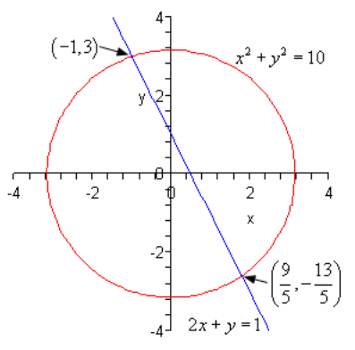
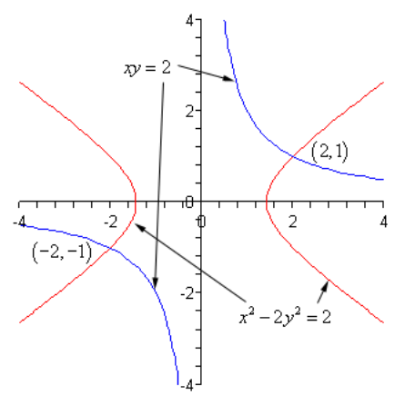
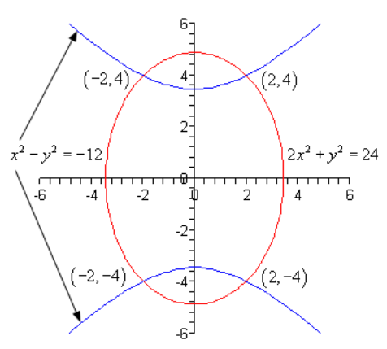

# 7.5 Nonlinear Systems

---

In this section we are going to be looking at non-linear systems of equations. A
non-linear system of equations is a system in which at least one of the
variables has an exponent other than 1 and/or there is a product of variables in
one of the equations.

To solve these systems we will use either the substitution method or elimination
method that we first looked at when we solved systems of linear equations. The
main difference is that we may end up getting complex solutions in addition to
real solutions. Just as we saw in solving systems of two equations the real
solutions will represent the coordinates of the points where the graphs of the
two functions intersect.

Let’s work some examples.

---

**Example 1** Solve the following system of equations.

$$
\begin{align*}
x^2 + y^2 = 10 \\
2x + y = 1
\end{align*}
$$

In linear systems we had the choice of using either method on any given system.
With non-linear systems that will not always be the case. In the first equation
both of the variables are squared and in the second equation both of the
variables are to the first power. In other words, there is no way that we can
use elimination here and so we are must use substitution. Luckily that isn’t too
bad to do for this system since we can easily solve the second equation for $y$
and substitute this into the first equation.

$$ y = 1 - 2x $$

$$ x^2 + (1 - 2x)^2 = 10 $$

This is a quadratic equation that we can solve.

$$ x^2 + 1 - 4x + 4x^2 = 10 $$

$$ 5x^2 - 4x - 9 = 0 $$

$$ (x + 1)(5x - 9) = 0 \quad \Rightarrow \quad x = -1, x = \frac{9}{5} $$

So, we have two values of $x$. Now, we need to determine the values of $y$ and
we are going to have to be careful to not make a common mistake here. We
determine the values of $y$ by plugging $x$ into our substitution.

$$ x = -1 \quad \Rightarrow \quad y = 1 - 2(-1) = 3 $$

$$ x = \frac{9}{5} \quad \Rightarrow \quad y = 1 - 2\left(\frac{9}{5}\right) = -\frac{13}{5} $$

Now, we only have two solutions here. Do not start mixing and matching all
possible values of $x$ and $y$ into solutions. We get $y = 3$ as a solution ONLY
if $x = -1$ and so the first solution is,

$$ x = \frac{9}{5}, y = -\frac{13}{5} $$

So, we have two solutions. Now, as noted at the start of this section these two
solutions will represent the points of intersection of these two curves. Since
the first equation is a circle and the second equation is a line have two
intersection points is definitely possible. Here is a sketch of the two
equations as a verification of this.

---

Note that when the two equations are a line and a circle as in the previous
example we know that we will have at most two real solutions since it is only
possible for a line to intersect a circle zero, one, or two times.

---

**Example 2** Solve the following system of equations.

$$
\begin{align*}
x^2 - 2y^2 = 2 \\
xy = 2
\end{align*}
$$

Okay, in this case we have a
[**hyperbola**](https://tutorial.math.lamar.edu/Classes/Alg/Hyperbolas.aspx)
(the first equation, although it isn’t in standard form) and a
[**rational function**](https://tutorial.math.lamar.edu/Classes/Alg/GraphRationalFcns.aspx)
(the second equation if we solved for $y$). As with the first example we can’t
use elimination on this system so we will have to use substitution.

The best way is to solve the second equation for either $x$ or $y$. Either one
will give us pretty much the same work so we’ll solve for $y$ since that is
probably the one that will make the equation look more like those that we’ve
looked at in the past. In other words, the new equation will be in terms of $x$
and that is the variable that we are used to seeing in equations.

$$ y = \frac{2}{x} $$

$$ x^2 - 2\left(\frac{2}{x}\right)^2 = 2 $$

$$ x^2 - 2\left(\frac{4}{x^2}\right) = 2 $$

$$ x^2 - \frac{8}{x^2} = 2 $$

The first step towards solving this equation will be to multiply the whole thing
by $x^2$ to clear out the denominators.

$$
\begin{align*}
x^4 - 8 = 2x^2 \\
x^4 - 2x^2 - 8 = 0
\end{align*}
$$

Now, this is
[**quadratic in form**](https://tutorial.math.lamar.edu/Classes/Alg/ReducibleToQuadratic.aspx)
and we know how to solve those kinds of equations. If we define,

$$ u = x^2 \quad \Rightarrow \quad u^2 = (x^2)^2 = x^4 $$

and the equation can be written as,

$$
\begin{align*}
u^2 - 2u - 8 = 0 \\
(u - 4)(u + 2) = 0 \quad \Rightarrow \quad u = -2, u = 4
\end{align*}
$$

In terms of $x$ this means that we have the following,

$$
\begin{align*}
x^2 = 4 \quad \Rightarrow \quad x = \pm 2 \\
x^2 = -2 \quad \Rightarrow \quad x = \pm \sqrt{2}i
\end{align*}
$$

So, we have four possible values of $x$ and two of them are complex. To
determine the values of $y$ we can plug these into our substitution.

$$ x = 2 \quad \Rightarrow \quad y = \frac{2}{2} = 1 $$

$$ x = -2 \quad \Rightarrow \quad y = \frac{2}{-2} = -1 $$

$$ x = \sqrt{2}i \quad \Rightarrow \quad y = \frac{2}{\sqrt{2}i} = \frac{2}{\sqrt{2}i}\left(\frac{i}{i}\right) = \frac{2i}{\sqrt{2}i^2} = -\frac{2i}{\sqrt{2}} $$

$$ x = -\sqrt{2}i \quad \Rightarrow \quad y = -\frac{2}{\sqrt{2}i} = -\frac{2}{\sqrt{2}i}\left(\frac{i}{i}\right) = -\frac{2i}{\sqrt{2}i^2} = \frac{2i}{\sqrt{2}} $$

For the complex solutions, notice that we made sure the $i$ was in the
numerator. The four solutions are then,

$$
\begin{align*}
x = 2, y = 1 \quad \text{ and } \quad x = -2, y = -1 \text{ and} \\
x = \sqrt{2}i, y = -\frac{2i}{\sqrt{2}} \quad \text{ and } \quad x = -\sqrt{2}i,
  y = \frac{2i}{\sqrt{2}}
\end{align*}
$$

Two of the solutions are real and so represent intersection points of the graphs
of these two equations. The other two are complex solutions and while solutions
will not represent intersection points of the curves.

For reference purposes, here is a sketch of the two curves.

Note that there are only two intersection points of these two graphs as
suggested by the two real solutions. Complex solutions never represent
intersections of two curves.

---

**Example 3** Solve the following system of equations.

$$
\begin{align*}
2x^2 + y^2 = 24 \\
x^2 - y^2 = -12
\end{align*}
$$

This time we have an
[**ellipse**](https://tutorial.math.lamar.edu/Classes/Alg/Ellipses.aspx) and a
hyperbola. Neither one are in standard form however.

In the first two examples we’ve used the substitution method to solve the system
and we can use that here as well. Let’s notice however, that if we just add the
two equations we will eliminate the $y$’s from the system so we’ll do it that
way.

$$
\begin{align*}
2x^2 + y^2 = 24 \\
\underline{x^2 - y^2 = -12} \\
3x^2 \hspace{2em} = 12
\end{align*}
$$

This is easy enough to solve for $x$.

$$
\begin{align*}
3x^2 = 12 \\
x^2 = 4 \quad \Rightarrow \quad x = \pm 2
\end{align*}
$$

To determine the value(s) of the $y$’s we can substitute these into either of
the equations. We will use the first since there won’t be any minus signs to
worry about.

$x = 2 \text{ :}$

$$
\begin{align*}
2(2)^2 + y^2 = 24 \\
8 + y^2 = 24 \\
y^2 = 16 \quad \Rightarrow \quad y = \pm 4
\end{align*}
$$

$x = -2 \text{ :}$

$$
\begin{align*}
2(-2)^2 + y^2 = 24 \\
8 + y^2 = 24
y^2 = 16 \quad \Rightarrow \quad y = \pm 4
\end{align*}
$$

Note that for this system, unlike the previous examples, each value of $x$
actually gave two possible values of $y$. That means that there are in fact four
solutions. They are,

$$ (2, 4) \quad (2, -4) \quad (-2, 4) \quad (-2, -4) $$

This also means that there should be four intersection points to the two curves.
Here is a sketch for verification.

---

## Practice Problems

Find the solution to each of the following equations.

**1.**

$$
\begin{align*}
y = x^2 + 6x - 8 \\
y = 4x + 7
\end{align*}
$$

**2.**

$$
\begin{align*}
y = 1 - 3x \\
\frac{x^2}{4} + y^2 = 1
\end{align*}
$$

**3.**

$$
\begin{align*}
xy = 4 \\
\frac{x^2}{4} + \frac{y^2}{25} = 1
\end{align*}
$$

**4.**

$$
\begin{align*}
y = 1 - 2x^2 \\
x^2 - \frac{y^2}{9} = 1
\end{align*}
$$

---

## Assignment Problems

Find the solution to each of the following equations.

**1.**

$$
\begin{align*}
y = -x^2 + 5x + 16 \\
y = 7x - 8
\end{align*}
$$

**2.**

$$
\begin{align*}
y = 3 -x^2 \\
y = 8x^2 + 2
\end{align*}
$$

**3.**

$$
\begin{align*}
x^2 + \frac{y^2}{4} = 1 \\
y = 4 - 4x
\end{align*}
$$

**4.**

$$
\begin{align*}
x^2 + y^2 = 9 \\
y = 1 + \frac{x^2}{5}
\end{align*}
$$

**5.**

$$
\begin{align*}
x^2 + y^2 = 16 \\
y^2 - \frac{x^2}{15} = 1
\end{align*}
$$

**6.**

$$
\begin{align*}
xy = -2 \\
x^2 + \frac{y^2}{25} = 1
\end{align*}
$$

**7.**

$$
\begin{align*}
x^2 + y^2 = 1 \\
\frac{x^2}{4} + y^2 = 1
\end{align*}
$$

**8.**

$$
\begin{align*}
x^2 + y^2 = 3 \\
\frac{x^2}{9} + y^2 = 1
\end{align*}
$$
