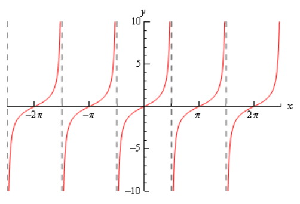
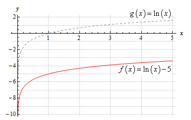
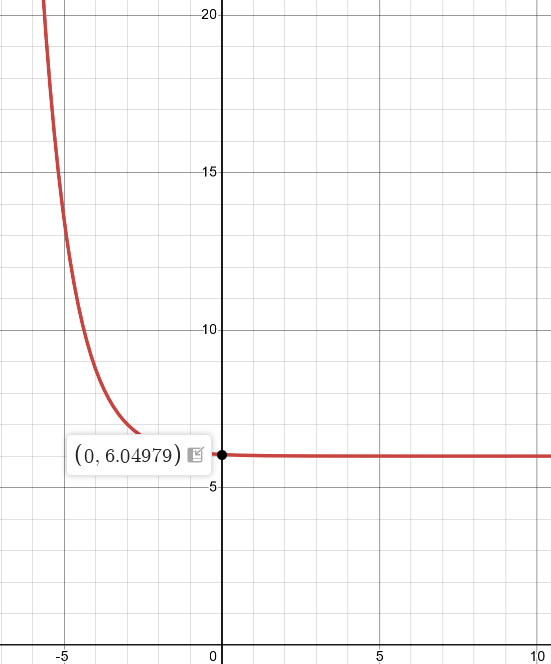
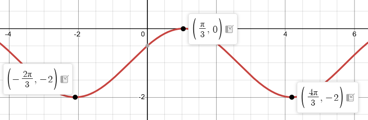
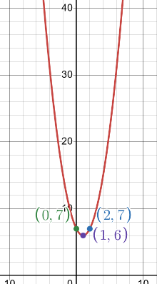

# Section 1.10 : Common Graphs

The purpose of this section is to make sure that you’re familiar with the graphs
of many of the basic functions that you’re liable to run across in a calculus
class.

---

**Example 1** Graph $y = -\dfrac{2}{5}x + 3$.

This is a line in the slope intercept form

$$ y = mx + b $$

In this case the line has a $y$ intercept of $(0, b)$ and a slope of $m$. Recall
that slope can be thought of as

$$ m = \frac{\text{rise}}{\text{run}} $$

Note that if the slope is negative we tend to think of the rise as a fall.

The slope allows us to get a second point on the line. Once we have any point on
the line and the slope we move right by run and up/down by rise depending on the
sign. This will be a second point on the line.

In this case we know $(0, 3)$ is a point on the line and the slope is
$-\dfrac{2}{5}$. So starting at $(0, 3)$ we'll move $5$ to the right (_i.e._
$0 \rightarrow 5$) and down $2$ (_i.e._ $3 \rightarrow 1$) to get $(5, 1)$ as a
second point on the line. Once we've got two points on a line all we need to do
is plot the two points and connect them with a line.

Here's the sketch for this line.

---

**Example 2** Graph $f(x) = \mid x \mid$

There really isn’t much to this problem outside of reminding ourselves of what
absolute value is. Recall that the absolute value function is defined as,

$$  $$

$$
\mid x \mid =
\begin{cases}
x \text{ if } x \geq 0 \\
-x \text{ if } x < 0
\end{cases}
$$

The graph is then,

---

**Example 3** Graph $f(x) = -x^2 + 2x + 3$.

This is a parabola in the general form.

$$ f(x) = ax^2 + bx + c $$

In this form, the $x$-coordinate of the vertex (the highest or lowest point on
the parabola) is $x = -\dfrac{b}{2a}$ and the $y$-coordinate is
$y = f\left(-\dfrac{b}{2a}\right)$. So, for our parabola the coordinates of the
vertex will be.

$$ x = -\frac{2}{2(-1)} = 1 $$

$$ y = f(1) = -(1)^2 + 2(1) + 3 = 4 $$

So, the vertex for this parabola is $(1, 4)$.

We can also determine which direction the parabola opens from the sign of $a$.
If $a$ is positive the parabola opens up and if $a$ is negative the parabola
opens down. In our case the parabola opens down.

Now, because the vertex is above the $x$-axis and the parabola opens down we
know that we'll have $x$-intercepts (_i.e._ values of $x$ for which we'll have
$f(x) = 0$) on this graph. So, we'll solve the following.

$$ -x^2 + 2x + 3 = 0 $$

$$ x^2 - 2x - 3 = 0 $$

$$ (x - 3)(x + 1) = 0 $$

So, we will have $x$-intercepts at $x = -1$ and $x = 3$. Notice that to make our
life easier in the solution process we multiplied everything by $-1$ to get the
coefficient of the $x^2$ positive. This made the factoring easier.

Here's a sketch of this parabola.

---

**Example 4** Graph $f(y) = y^2 - 6yn + 5$.

Most people come out of an Algebra class capable of dealing with functions in
the form $y = f(x)$. However, many functions that you will have to deal with in
a Calculus class are in the form $x = f(y)$ and can only be easily worked with
in that form. So, you need to get used to working with functions in this form.

The nice thing about these kinds of function is that if you can deal with
functions in the form $y = f(x)$ then you can deal with functions in the form
$x = f(y)$ even if you aren't that familiar with them.

Let's first consider the equation.

$$ y = x^2 - 6x + 5 $$

This is a parabola that opens up and has a vertex of $(3, -4)$, as we know from
our work in the previous example.

For our function we have essentially the same equation except the $x$ and $y$'s
are switched around. In other words, we have a parabola in the form,

$$ x = ay^2 + by + c $$

This is the general form of this kind of parabola and this will be a parabola
that opens left or right depending on the sign of $a$. The $y$-coordinate of the
vertex is given by $y = -\dfrac{b}{2a}$ and we find the $x$-coordinate by
plugging this into the equation. So, you can see that this is very similar to
the type of parabola that you're already used to dealing with.

Now, let's get back to the example. Our functdion is a parabola that opens to
the right ($a$ is positive) and has a vertex at $(-4, 3)$. The vertex is to the
left of the $y$-axis and opens to the right so we'll need the $y$-intercepts
(_i.e._ values of $y$ for which we'll have $f(y) = 0$). We find these just like
we found $x$-intercepts in the previous problem.

$$ y^2 - 6y + 5 = 0 $$

$$ (y - 5)(y - 1) = 0 $$

So, our parabola will have $y$-intercepts at $y = 1$ and $y = 5$. Here's a
sketch of the graph.

---

**Example 5** Graph $x^2 + 2x + y^2 - 8y + 8 = 0$.

To determine just what kind of graph we’ve got here we need to complete the
square on both the $x$ and the $y$.

$$ x^2 + 2x + y^2 - 8y + 8 = 0 $$

$$ x^2 + 2x + 1 - 1 + y^2 - 8y + 16 - 16 + 8 = 0 $$

$$ (x + 1)^2 + (y - 4)^2 = 9 $$

Recall that to complete the square we take the half of the coefficient of the
$x$ (or the $y$), square this and then add and subtract it to the equation.

Upon doing this we see that we have a circle and it’s now written in standard
form.

$$ (x - h)^2 + (y - k)^2 = r^2 $$

When circles are in this form we can easily identify the center $(h, k)$ and
radius $r$. Once we have these we can graph the circle simply by starting at the
center and moving right, left, up and down by $r$ to get the rightmost,
leftmost, top most and bottom most points respectively.

Our circle has a center at $(-1, 4)$ and a radius of $3$. Here's a sketch of
this circle.

---

**Example 6** Graph $\dfrac{(x - 2)^2}{9} + 4(y + 2)^2 = 1$.

This is an ellipse. The standard form of the ellipse is

$$ \frac{(x - h)^2}{a^2} + \frac{(y - k)^2}{b^2} = 1 $$

This is an ellipse with center $(h, k)$ and the right most and left most points
are a distance of $a$ from the center and the top most and bottom most points
are a distance of $b$ away from the center.

The ellipse for this problem has center $(2, -2)$ and has $a = 3$ and $b =
\dfrac{1}{2}$. Note that to get the $b$ we're really rewriting the equation as,

$$ \frac{(x - 2)^2}{9} + \frac{(y + 2)^2}{\dfrac{1}{4}} = 1 $$

to get it into standard form.

Here's a sketch of the ellipse.

---

**Example 7** Graph $\dfrac{(x + 1)^2}{9} - \dfrac{(y - 2)^2}{4} = 1$.

This is a hyperbola. There are actually two standard forms for a hyperbola. Here
are the basics for each form.

$$ \text{Form} \quad \quad \quad \frac{(x - h)^2}{a^2} - \frac{(y - k)^2}{b^2} = 1 \quad \quad \quad \frac{(y - k)^2}{b^2} - \frac{(x - h)^2}{a^2} = 1 $$

$$ \text{Center} \quad \quad \quad (h, k) \quad \quad \quad (h, k) $$

$$ \text{Opens} \quad \quad \quad \text{Opens right and left} \quad \quad \quad \text{Opens up and down} $$

$$ \text{Vertices} \quad \quad \quad a \text{ units right and left of center} \quad \quad \quad b \text{ units up and down from center} $$

$$ \text{Slope of Asymptotes} \quad \quad \quad \pm \frac{b}{a} \quad \quad \quad \pm \frac{b}{a} $$

So, what does all this mean? First, notice that one of the terms is positive and
the other is negative. This will determine which direction the two parts of the
hyperbola open. If the $x$ term is positive the hyperbola opens left and right.
Likewise, if the $y$ term is positive the hyperbola opens up and down.

The asymptotes of a hyperbola are two lines that intersect at the center and
have the slopes listed above. As you move farther out from the center the graph
will get closer and closer to the asymptotes.

For the equation listed here the hyperbola will open left and right. Its center
is $(-1, 2)$. The two vertices are $(-4, 2)$ and $(2, 2)$. The asymptotes will
have slopes $\pm \dfrac{2}{3}$.

Here is a sketch of this hyperbola. Note that the asymptotes are denoted by the
two dashed lines.

---

**Example 8** Graph $f(x) = \mathbf{e}^x$ and $g(x) = \mathbf{e}^{-x}$.

There really isn’t a lot to this problem other than making sure that both of
these exponentials are graphed somewhere.

These will both show up with some regularity in later sections and their
behavior as $x$ goes to both plus and minus infinity will be needed and from
this graph we can clearly see this behavior.

---

**Example 9** Graph $f(x) = \ln(x)$.

This has already been graphed once in this review, but this puts it here with
all the other “important” graphs.

---

**Example 10** Graph $y = \sqrt{x}$.

This one is fairly simple, we just need to make sure that we can graph it when
need be.

Remember that the domain of the square root function is $x \geq 0$.

---

**Example 11** Grpah $y = x^3$.

Again, there really isn’t much to this other than to make sure it’s been graphed
somewhere so we can say we’ve done it.

---

**Example 12** Graph $y = \cos(x)$.

There really isn't a whole lot to this one. Here's the graph for
$-4\pi \leq x \leq 4\pi$.

Let’s also note here that we can put all values of $x$ into cosine (which won’t
be the case for most of the trig functions) and so the domain is all real
numbers. Also note that

$$ -1 \leq \cos(x) \leq 1 $$

It is important to notice that cosine will never be larger than $1$ or smaller
than $-1$. This will be useful on occasion in a calculus class. In general we
can say that

$$ -R \leq R\cos(\omega x) \leq R $$

---

**Example 13** Graph $y = \sin(x)$.

As with the previous problem there really isn’t a lot to do other than graph it.
Here is the graph for $-4\pi \leq x \leq 4\pi$.

From this graph we can see that sine has the same range that cosine does. In
general

$$ -R \leq R\sin(\omega x) \leq R $$

As with cosine, sine itself will never be larger than $1$ and never smaller than
$-1$. Also the domain of sine is all real numbers.

---

**Example 14** Graph $y = \tan(x)$.

In the case of tangent we have to be careful when plugging $x$'s in since
tangent doesn't exist wherever cosine is zero (remember that
$\tan x = \dfrac{\sin x}{\cos x}$). Tangent will not exist at

$$ x = \dots, -\frac{5\pi}{2}, -\frac{3\pi}{2}, -\frac{\pi}{2}, \frac{\pi}{2}, \frac{3\pi}{2}, \frac{5\pi}{2}, \dots $$

and the graph will have asymptotes at these points. Here is the graph of tangent
on the range $-\dfrac{5\pi}{2} < x < \dfrac{5\pi}{2$a.}$

---

**Example 15** Graph $y = \sec(x)$.

As with tangent we will have to avoid $x$'s for which cosine is zero (remember
that $\sec x = \dfrac{1}{\cos x}$). Secant will not exist at

$$ x = \dots, -\frac{5\pi}{2}, -\frac{3\pi}{2}, -\frac{\pi}{2}, \frac{\pi}{2}, \frac{3\pi}{2}, \frac{5\pi}{2}, \dots $$

and the graph will have asymptotes at these points. Here is the graph of secant
on the range $-\dfrac{5\pi}{2} < x < \dfrac{5\pi}{2}$.

Notice that the graph is always greater than $1$ or less than $-1$. This should
not be terribly surprising. Recall that

$$ -1 \leq \cos(x) \leq 1 $$

So, one divided by something less than one will be greater than $1$. Also
$\dfrac{1}{\pm 1} = \pm 1$ and so we get the following ranges for secant.

$$ \sec(\omega x) \geq 1 \quad \text{ and } \quad \sec(\omega x) \leq -1 $$

---

Note that we did not graph cotangent or cosecant here. However, they are similar
to the graphs of tangent and secant and you should be able to do quick sketches
of them given the work above if needed.

Finally, note that we did not cover any of the basic transformations that are
often used in graphing functions here. The practice problems for this section
have quite a few problems designed to help you remember them. If you know the
basic transformations it often makes graphing a much simpler process so if you
are not comfortable with them you should work through the practice problems for
this section.

---

## Practice Problems

Without using a graphing calculator sketch the graph of each of the following.

**1.** $y = \dfrac{4}{3}x - 2$

**Solution**

**2.** $f(x) = \mid x - 3 \mid$

**Solution**

**3.** $g(x) = \sin(x) + 6$

**Solution**

**4.** $f(x) = \ln(x) - 5$

**Solution**

**5.** $h(x) = \cos\left(x + \dfrac{\pi}{2}\right)$

**Solution**

**6.** $h(x) = (x - 3)^2 + 4$

**Solution**

**7.** $W(x) = \mathbf{e}^{x + 2} - 3$

**Solution**

**8.** $f(y) = (y - 1)^2 + 2$

**Solution**

**9.** $R(x) = -\sqrt{x}$

**Solution**

**10.** $g(x) = \sqrt{-x}$

**Solution**

**11.** $h(x) = 2x^2 - 3x + 4$

**Solution**

**12.** $f(y) = -4y^2 + 8yn + 3$

**Solution**

**13.** $(x + 1)^2 + (y - 5)^2 = 9$

**Solution**

**14.** $x^2 - 4x + y^2 - 6y - 87 = 0$

**Solution**

**15.** $25(x + 2)^2 + \dfrac{y^2}{4} = 1$

**Solution**

**16.** $x^2 + \dfrac{(y - 6)^2}{9} = 1$

**Solution**

**17.** $\dfrac{x^2}{36} - \dfrac{y^2}{49} = 1$

**Solution**

**18.** $(y + 2)^2 - \dfrac{(x + 4)^2}{16} = 1$

**Solution**

---

## Assignment Problems

Without using a graphing calculator sketch the graph of each of the following.

**1.** $y = -2x + 7$

**Solution**

Slope:

$$ y = mx + b $$

$$ m = \frac{\text{rise}}{\text{run}} = \frac{-2}{1} $$

$$ \text{y-intercept: } (0, 7) $$

$$ \text{x-intercept: } \left(\frac{7}{2}, 0\right) $$

**2.** $f(x) = \mid x + 4 \mid$

**Solution**

Standard absolute value graph shifted to the left $4$ units.

**3.** $g(x) = \sqrt{x} - 5$

**Solution**

Standard square root shifted down by $5$ units.

**4.** $g(x) = \tan\left(x + \dfrac{\pi}{3}\right)$

**Solution**

Standard tangent, except shifted to left $\dfrac{\pi}{3}$ radians.

**5.** $f(x) = \sec(x) + 2$

**Solution**

Standard secant except shifted up by $2$ radians.

**6.** $h(x) = \mid x + 2 \mid - 4$

**Solution**

Standard absolut value except shifted left by $2$ units and down by $4$ units.

**7.** $Q(x) = \mathbf{e}^{-x - 3} + 6$

**Solution**

Standard Euler's graph except reflected due to negative $a$, shifted right by
$3$ units, and shifted up by $6$ units.

**8.** $V(x) = \sqrt{x - 6} + 3$

**Solution**

Standard square root graph, except shifted right by $6$ units and up by $3$
units.

**9.** $g(x) = \sin\left(x + \dfrac{\pi}{6}\right) - 1$

**Solution**

Standard sine graph except shifted to the left by $\dfrac{\pi}{6}$ radians and
down by $1$ radian.

**10.** $h(x) = (x + 6)^2 - 8$

$$ (x + 6)(x + 6) - 8 $$

$$ x^2 + 12x + 36 - 8 $$

$$ x^2 + 12x + 28 $$

**Solution**

Parabola shifted to the left by $6$ units and down by $8$ units.

Find Vertex:

$$ x = -\frac{b}{2a} = -\frac{12}{2(1)} = -6 $$

$$ h(-6) = (-6 + 6)^2 - 8 $$

$$ h(-6) = (0)^2 - 8 $$

$$ h(-6) = (0) - 8 $$

$$ h(-6) = -8 $$

Vertex = (-6, 8)

Find $x$-intercepts:

$$ (x + 6)^2 - 8 = 0 $$

$$ (x + 6)^2 = 8 $$

$$ x + 6 = \pm 2\sqrt{2} $$

$$ x = -6 \pm 2\sqrt{2} \approx -3.1716, -8.8284 $$

**11.** $W(y) = (y + 5)^2 + 3$

**Solution**

Parabola, opens to the right (positive $a$ prior to $y$). Shifted down by $5$
units and shifted to the right by $3$ units.

$$ W(y) = (y + 5)^2 + 3 $$

$$ x = (y + 5)^2 + 3 $$

Find Vertex:

$$ (y + 5)(y + 5) + 3 $$

$$ y^2 + 10y + 25 + 3 $$

$$ y^2 + 10y + 28 $$

$$ y = -\frac{b}{2a} = -\frac{10}{2(1)} = -5 $$

$$ W(-5) = ((-5) + 5)^2 + 3 $$

$$ W(-5) = (0)^2 + 3 $$

$$ W(-5) = (0) + 3 $$

$$ W(-5) = 3 $$

Vertex: $(3, -5)$

Because vertex is already $3$ to the right and opens to the right, this will
never have any $y$-intercepts.

Solving for where $y$ is $0$ will give us an $x$-intercept though.

$$ x = (0 + 5)^2 + 3 $$

$$ x = (5)^2 + 3 $$

$$ x = 25 + 3 $$

$$ x = 28 $$

So we have an $x$-intercept at $(28, 0)$.

But plugging in $-10$ also gives us $28$:

$$ x = (-10 + 5)^2 + 3 $$

$$ x = (-5)^2 + 3 $$

$$ x = 25 + 3 $$

$$ x = 28 $$

So we have a point at $(28, -10)$.

**12.** $f(y) = (y - 9)^2 - 2$

**Solution**

Another parabola, still opening right ($a$ preceding $y$ is positive). Shifting
up by $9$ units and to the left by $2$ units.

$$ x = (y - 9)^2 - 2 $$

$$ x = y^2 - 18y + 81 - 2 $$

$$ x = y^2 - 18y + 79 $$

$$ y = -\frac{b}{2a} = -\frac{-18}{2(1)} = 9 $$

$$ f(9) = ((9) - 9)^2 - 2 $$

$$ f(9) = (0)^2 - 2 $$

$$ f(9) = -2 $$

Vertex is at $(-2, 9)$.

We can find an $x$-intercept by setting $y$ to $0$:

$$ x = (0 - 9)^2 - 2 $$

$$ x = (-9)^2 - 2 $$

$$ x = 81 - 2 $$

$$ x = 79 $$

$x$-intercept at:

$$ (79, 0) $$

And we can get the same $x$-coordinate when $y = 18$.

$$ x = (18 - 9)^2 - 2 $$

$$ x = (9)^2 - 2 $$

$$ x = 81 - 2 $$

$$ x = 79 $$

So we have another point at:

$$ (79, 18) $$

**13.** $f(x) = (x - 1)^2 + 6$

**Solution**

Another parabola. This one opening upwards ($x$ is positive). It is shifted to
the right by $1$ and up by $6$.

$$ f(x) = x^2 - 2x + 1 + 6 $$

$$ f(x) = x^2 - 2x + 7 $$

$$ x = -\frac{b}{2a} = -\frac{-2}{2(1)} = 1 $$

$$ f(1) = ((1) - 1)^2 + 6 $$

$$ f(1) = (0)^2 + 6 $$

$$ f(1) = 0 + 6 $$

$$ f(1) = 6 $$

Vertex is:

$$ (1, 6) $$

Setting $x$ to $0$ gives us a $y$ intercept:

$$ f(x) = (x - 1)^2 + 6 $$

$$ f(0) = ((0) - 1)^2 + 6 $$

$$ f(0) = (-1)^2 + 6 $$

$$ f(0) = 1 + 6 $$

$$ f(0) = 7 $$

So we have a $y$-intercept at:

$$ (0, 7) $$

And we have a similar $y$-coordinate when we plug in $x = 2$:

$$ f(2) = ((2) - 1)^2 + 6 $$

$$ f(2) = (1)^2 + 6 $$

$$ f(2) = (1) + 6 $$

$$ f(2) = 7 $$

So we have another point at:

$$ (2, 7) $$

**14.** $R(x) = -\ln(x)$

**Solution**

This is just a standard natural logarithm graph that is reflected about the
$x$-axis.

**15.** $g(x) = \ln(-x)$

**Solution**

And this one is the standard natural logarithm graph that is reflected about the
$y$-axis.

**16.** $h(x) = x^2 + 8x - 1$

**Solution**

This is a parabola in standard form.

$$ x = -\frac{b}{2a} = -\frac{8}{2(1)} = -4 $$

$$ h(-4) = (-4)^2 + 8(-4) - 1 $$

$$ h(-4) = 16 - 32 - 1 $$

$$ h(-4) = -17 $$

Vertex is:

$$ (-4, -17) $$

Completing the square can give us the parabola in vertex form:

$$ \left(\frac{b}{2a}\right)^2 = \left(\frac{8}{2(1)}\right)^2 = 16 $$

$$ h(x) = x^2 + 8x + 16 - 16 - 1 $$

$$ h(x) = (x + 4)^2 - 17 $$

Find an $y$-intercept:

$$ h(0) = (0 + 4)^2 - 17 $$

$$ h(0) = 16 - 17 $$

$$ h(0) = -1 $$

$y$-intercept at:

$$ (0, -1) $$

And we get a point with the same $y$-coordinate if we plug in $x = -8$.

$$ h(-8) = ((-8) + 4)^2 - 17 $$

$$ h(-8) = (-4)^2 - 17 $$

$$ h(-8) = 16 - 17 $$

$$ h(-8) = -1 $$

So we have another point at:

$$ (-8, -1) $$

**17.** $Y(x) = -3x^2 - 6x + 5$

**Solution**

Another parabola, opens downwards ($-3$ precedes $x$). Let's convert to Vertex
Form:

$$ Y(x) = -3x^2 - 6x + 5 $$

Divide by $-3$ in order to prepare for complete the square:

$$ Y(x) = x^2 + 2x - \frac{5}{3} $$

Complete the square:

$$ \left(\frac{b}{2}\right)^2 = \frac{2}{2}^2 = 1 $$

$$ Y(x) = x^2 + 2x + 1 - 1 - \frac{5}{3} $$

$$ Y(x) = (x + 1)^2 - \frac{8}{3} $$

And multiply by $-3$ again to get our final vertex form:

$$ Y(x) = -3(x + 1)^2 + 8 $$

So our Vertex is:

$$ (-1, 8) $$

We can find a $y$-coordinate by plugging in $x = 0$:

$$ Y(x) = -3x^2 - 6x + 5 $$

$$ Y(0) = -3(0)^2 - 6(0) + 5 $$

$$ Y(0) = 0 - 0 + 5 $$

$$ Y(0) = 5 $$

So, we have a $y$-intercept at:

$$ (0, 5) $$

Because the vertex is at $(-1, 8)$, and we know it opens downwards, we will have
$x$-intercepts ( as $y = 8$ is above the $x$-axis).

We can set our original equation to $0$ to solve for the $x$-intercept(s):

$$ Y(x) = -3x^2 - 6x + 5 $$

$$ 0 = -3x^2 - 6x + 5 $$

Let's just use the Quadratic Formula:

$$ x = \frac{-(-6) \pm \sqrt{(-6)^2 - 4(-3)(5)}}{2(-3)} $$

$$ x = \frac{6 \pm \sqrt{96}}{-6} $$

$$ x = \frac{6 \pm 4\sqrt{6}}{-6} $$

$$ x = -1 \mp \frac{2}{3}\sqrt{6} \approx -2.6330, 0.6330 $$

**18.** $f(y) = -y^2 - 4y - 2$

**Solution**

Another parabola, this time opening to the left ($-1$ precedes $y$).

$$ f(y) = -y^2 - 4y - 2 $$

$$ x = -y^2 - 4y - 2 $$

Let's use the vertex formula:

$$ -\frac{b}{2a} = -\frac{-4}{2(-1)} = -\frac{-4}{-2} = -(2) = -2 $$

$$ f(-2) = -(-2)^2 - 4(-2) - 2 $$

$$ f(-2) = -(4) + 8 - 2 $$

$$ f(-2) = 4 - 2 $$

$$ f(-2) = 2 $$

So our vertex is:

$$ (2, -2) $$

We can plug in $y = 0$ to find an $x$ intercept:

$$ f(0) = -(0)^2 - 4(0) - 2 $$

$$ f(0) = -2 $$

So we have an $x$-intercept at:

$$ (-2, 0) $$

Using the vertex, $(2, -2)$ as a reference, we know that $(-2, 0)$ lies above
the vertex, and therefore there must be a corresponding point with the same
$x$-coordinate of $-2$. Since $(-2, 0)$ lies $2$ units above the vertex, it
makes sense that $(-2, -4)$ would lie $2$ units below the vertex. Let's plug in
$-4$ to confirm we get the same $x$-coordinate:

$$ f(-4) = -(-4)^2 - 4(-4) - 2 $$

$$ f(-4) =  -16 + 16 - 2 $$

$$ f(-4) = -2 $$

Indeed we do. After plotting, we have our leftwards facing parabola:

**19.** $h(y) = 2y^2 + 2y - 3$

**Solution**

Another parabola, this one facing right.

$$ h(y) = 2y^2 + 2y - 3 $$

$$ x = 2y^2 + 2y - 3 $$

Let's find the vertex:

$$ y = -\frac{b}{2a} = -\frac{2}{2(2)} = -\frac{1}{2} $$

$$ h\left(-\frac{1}{2}\right) = 2\left(-\frac{1}{2}\right)^2 + 2\left(-\frac{1}{2}\right) - 3 $$

$$ h\left(-\frac{1}{2}\right) = 2\left(\frac{1}{4}\right) - 1 - 3 $$

$$ h\left(-\frac{1}{2}\right) = -\frac{7}{2} $$

So we have our vertex at:

$$ \left(-\frac{7}{2}, -\frac{1}{2}\right) $$

We can find an $x$-intercept by plugging in $y = 0$:

$$ h(0) = 2(0)^2 + 2(0) - 3 $$

$$ h(0) = -3 $$

So we have an $x$-intercept at:

$$ (-3, 0) $$

Because the parabola opens to the right, and we know that the vertex is at
$\left(-\dfrac{7}{2}, -\dfrac{1}{2}\right)$ and we have an $x$-intercept at
$(-3, 0)$, it makes sense that we'd have a mirroring point with a $y$-coordinate
of $-1$, let's plug in $y = -1$ to be sure:

$$ h(-1) = 2(-1)^2 + 2(-1) - 3 $$

$$ h(-1) = 2(1) - 2 - 3 $$

$$ h(-1) = 2 - 2 - 3 $$

$$ h(-1) = -3 $$

And we have another point at $(-3, -1)$.

We also know we will have some $y$-intercepts as well, as we are rightward
opening, but our $x$ coordinate is negative. Thusly we can find the
$y$-intercepts as well:

$$ h(y) = 2y^2 + 2y - 3 $$

$$ 0 = 2y^2 + 2y - 3 $$

$$ y = \frac{-(2) \pm \sqrt{(2)^2 - 4(2)(-3)}}{2(2)} $$

$$ y = \frac{-2 \pm \sqrt{4 + 24}}{4} $$

$$ y = \frac{-2 \pm \sqrt{28}}{4} $$

$$ y = \frac{-2 \pm 2\sqrt{7}}{4} $$

$$ y = \frac{-1 \pm \sqrt{7}}{2} \approx 0.8229, -1.8229  $$

**20.** $x^2 - 6x + y^2 + 8y + 24 = 0$

**Solution**

We'll need to complete the square to find what we're dealing with here.

$$ x^2 - 6x + 9 - 9 + y^2 + 8y + 16 - 16 + 24 = 0 $$

$$ (x^2 - 6x + 9) - 9 + (y^2 + 8y + 16) - 16 + 24 = 0 $$

$$ (x - 3)^2 - 9 + (y + 4)^2 - 16 + 24 = 0 $$

$$ (x - 3)^2 + (y + 4)^2 = 9 + 16 - 24 $$

$$ (x - 3)^2 + (y + 4)^2 = 1 $$

This is a circle:

$$ (x - h)^2 + (y - k)^2 = r^2 $$

So our center is:

$$ (3, -4) $$

And our radius is:

$$ r = 1 $$

Grahing this, we can find that the four major extremities along the $y$ and $x$
axis are:

$$ (4, -4), (2, -4), (3, -5), (3, -3) $$

Let's graph it:

**21.** $x^2 + y^2 + 10y = -9$

**Solution**

Looks like another circle, we'll just have to complete the square to be sure:

$$ x^2 + y^2 + 10y = -9 $$

$$ x^2 + y^2 + 10y + 25 - 25 = -9 $$

$$ x^2 + (y^2 + 10y + 25) - 25 = -9 $$

$$ x^2 + (y + 5)^2 = -9 + 25 $$

$$ x^2 + (y + 5)^2 = 16 $$

Again, this takes the form of a circle:

$$ (x - h)^2 + (y - k)^2 = r^2 $$

So our center is:

$$ (0, -5) $$

And our radius is:

$$ r = 4 $$

This means our four extremities are:

$$ (4, -5), (-4, -5), (0, -9), (0, -1) $$

Let's Graph it:

**22.** $\dfrac{(x + 4)^2}{25} + \dfrac{(y + 2)^2}{25} = 1$

This is also a circle, but in the form of an ellipse.

$$ \frac{(x - h)^2}{a^2} + \frac{(y - k)^2}{b^2} = 1 $$

Our center is:

$$ (-4, -2) $$

If we multiply the whole thing by $25$, we get our radius:

$$ (x + 4)^2 + (y + 2)^2 = 25 $$

And our radius is:

$$ r = 5 $$

So our four extremities are:

$$ (-4, 3), (-4, -7), (1, -2), (-9, -2) $$

Let's graph it:

**Solution**

**23.** $x^2 - 2x + 4y^2 - 16y + 16 = 0$

**Solution**

Let's get this into proper form first.

$$ x^2 - 2x + 4y^2 - 16y + 16 = 0 $$

$$ x^2 - 2x  + 1 - 1 + 4(y^2 - 4y) + 16 = 0 $$

$$ x^2 - 2x  + 1 - 1 + 4(y^2 - 4y + 4 - 4) + 16 = 0 $$

$$ (x^2 - 2x  + 1) - 1 + 4((y^2 - 4y + 4) - 4) + 16 = 0 $$

$$ (x - 1)^2 - 1 + 4((y - 2)^2 - 4) + 16 = 0 $$

$$ (x - 1)^2 - 1 + 4(y - 2)^2 - 16 + 16 = 0 $$

$$ (x - 1)^2 + 4(y - 2)^2 = 1 $$

$$ \frac{(x - 1)^2}{1} + \frac{(y - 2)^2}{\dfrac{1}{4}} = 1 $$

And this is an ellipse.

Our center is:

$$ (1, 2) $$

And our extremities can be found using:

$$ a^2 = 1 $$

$$ a = 1 $$

$$ b^2 = \frac{1}{4} $$

$$ b = \frac{1}{2} $$

These will be added and subtracted to their respective coordinates above ($x$
goes to $a$, and $y$ goes to $b$) to determine along which axis our ellipse is
more elonagted. Our four extremities are:

$$ (0, 2), (2, 2), \left(1, \frac{5}{2}\right), \left(1, \frac{3}{2}\right) $$

Let's Graph it:

**24.** $\dfrac{(x + 6)^2}{4} + 16(y - 5)^2 = 1$

**Solution**

This is also an ellipse, just needs to be expressed slightly differently:

$$ \dfrac{(x + 6)^2}{4} + 16(y - 5)^2 = 1 $$

$$ \dfrac{(x + 6)^2}{4} + \frac{(y - 5)^2}{\dfrac{1}{16}} = 1 $$

Our center is:

$$ (-6, 5) $$

We can determine our extremities by:

$$ a^2 = 4 $$

$$ a = 2 $$

$$ b^2 = \frac{1}{16} $$

$$ b = \frac{1}{4} $$

Our four extremities are:

$$ (-4, 5), (-8, 5), \left(-6, \frac{21}{4}\right), \left(-6, \frac{19}{4}\right) $$

Let's graph it:

**25.** $\dfrac{(y - 1)^2}{25} - \dfrac{(x - 3)^2}{4} = 1$

**Solution**

This is a Hyperbola:

$$ \frac{(x - h)^2}{a^2} - \frac{(y - k)^2}{b^2} = 1 $$

This is one of two standard forms (the other is below). This one opens right and
left (right if $x$ is positive).

Same as ellipse, just minus sign inbetween two major fractions. Note it can also
look like:

$$ \frac{(y - k)^2}{b^2} - \frac{(x - h)^2}{a^2} = 1 $$

Which is what we have above, this one opens up and down (up since $y$ is
positive).

The center is:

$$ (3, 1) $$

We can find the slope of the asymptotes by the following formula:

$$ y = \pm \frac{b}{a}(x - h) + k $$

$$ b^2 =  25 $$

$$ b = 5 $$

$$ a^2 = 4 $$

$$ a = 2 $$

So the slope of our asymptotes are:

$$ \pm \frac{5}{2} $$

We can find the vertices in this case by looking $b$ units up and down from the
center.

Thusly our vertices are:

$$ (3, 6), (3, -4) $$

Knowing our asymptotes, vertices, and center, let's graph it:

**26.** $(x - 4)^2 - 9(y + 7)^2 = 1$

**Solution**

This is another hyperbola, let's first get it into standard form:

$$ (x - 4)^2 - 9(y + 7)^2 = 1 $$

$$ \frac{(x - 4)^2}{1} - \frac{(y + 7)^2}{\dfrac{1}{9}} = 1 $$

This hyperbola opens left/right.

Our center is:

$$ (4, -7) $$

Our asymptotes can be determined by the following formula.

$$ y = \pm \frac{b}{a}(x - h) + k $$

$$ a^2 = 1 $$

$$ a = 1 $$

$$ b^2 = \frac{1}{9} $$

$$ b = \frac{1}{3} $$

Our asymptotes therefore are:

$$ y = \pm \frac{1}{3}(x - 4) + (-7) $$

$$ y = \pm \frac{1}{3}(x - 4) - 7 $$

And our vertices can be found by looking $a$ units to the left and right of the
center.

Therefore our vertices are:

$$ (3, -7), (5, -7) $$

Knowing our center, asymptotes, and vertices, let's now graph:

