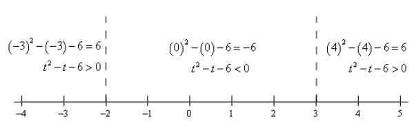

# Section 1.1 Functions

[Original Notes](https://tutorial.math.lamar.edu/Classes/CalcI/Functions.aspx)

---

In this section we're going to make sure that you're familiar with functions and
function notation. Both will appear in almost every section in a Calculus class
so you will need to be able to deal with them.

First, what exactly is a function? The simplest definition is an equation will
be a function if, for any $x$ in the domain of the equation (the domain is all
the $x$'s that can be plugged into the equation), the equation will yield
exactly one value of $y$ when we evaluate the equation at a specific $x$.

This is usually easier to understand with an example.

---

**Example 1** Determine if each of the following are functions.

**(a)** $y = x^2 + 1$

**Solution:**

This first one is a function. Given an $x$, there is only one way to square it
and then add $1$ to the result. Soo, no matter what value of $x$ you put into
the equation, there is only one possible value of $y$ when we evaluate the
equation at that value of $x$.

**(b)** $y^2 = x + 1$

**Solution:**

The only difference between this equation and the first is that we moved the
exponent off the $x$ and onto the $y$. This small change is all that is
required, in this case, to change the equation from a function to something that
isn't a function.

To see that this isn't a function is fairly simple. Choose a value of $x$, say
$x = 3$ and plug this into the equation.

$$ y^2 = 3 + 1 = 4 $$

Now, there are two possible values of $y$ that we could use here. We could use
$y = 2$ or $y = -2$. Since there are two possible values of $y$ that we get from
a single $x$ this equation isn't a function.

Note that this only needs to be the case for a single value of $x$ to make an
equation not be a function. For instance, we could have used $x = -1$ and in
this case, we would get a single $y$ ($y = 0$). However, because of what happens
at $x = 3$ this equation will not be a function.

---

Next, we need to take quick look at function notation. Function notation is
nothing more than a fancy way of writing the $y$ in a function that will allow
us to simplify notation and some of our work a little.

Let's take a look at the following function.

$$ yn = 2x^2 - 5x + 3 $$

Using function notation, we can write this as any of the following.

$$
\begin{align*}
f(x) = 2x^2 - 5x + 3 \quad g(x) = 2x^2 - 5x + 3 \\
h(x) = 2x^2 - 5x + 3 \quad R(x) = 2x^2 - 5x + 3 \\
w(x) = 2x^2 - 5x + 3 \quad y(x) = 2x^2 - 5x + 3  \\
\vdots
\end{align*}
$$

Recall that this is NOT a letter times $x$, this is just a fancy way of writing
$y$.

So, why is this useful? Well let's take the function above and let'sg et the
value of the function at $x = -3$. Using function notation we represent the
value of the function at $x = -3$ as $f(-3)$. Function notation gives us a nice
compact way of representing function values.

Now, how do we actually evaluate the function? That's really simple. Everywhere
we see an $x$ on the right side we will substitute whatever is in the
parenthesis on the left side. For our function this gives,

$$
\begin{align*}
f(-3) = 2(-3)^2 - 5(-3) + 3 \\
\quad = 2(9) + 15 + 3 \\
\quad = 36 \\
\end{align*}
$$

Let's take a look at some more function evaluation.

---

**Example 2** Given $f(x) = -x^2 + 6x - 11 find each of the following.

**(a)** $f(2)$

**Solution:**

$$ f(2) = -(2)^2 + 6(2) - 11 $$

$$ f(2) = -(4) + 12 - 11 $$

$$ \boxed{f(2) = -3} $$

**(b)** $f(-10)$

**Solution:**

$$ f(-10) = -(-10)^2 + 6(-10) - 11 $$

$ f(-10) = -(100) - 60 - 11 $$

$$ \boxed{f(-10) = -171} $$

**\(c\)** $f(t)$

**Solution:**

$$ f(t) = -(t)^2 + 6(t) - 11 $$

$$ \boxed{f(t) = -t^2 + 6t - 11} $$

**(d)** $f(t - 3)$

**Solution:**

$$ f(t - 3) = -(t - 3)^2 + 6(t - 3) - 11 $$

$$ f(t - 3) = -(t - 3)(t - 3) + 6(t - 3) - 11 $$

$$ f(t - 3) = -1(t^2 - 6t + 9) + 6t - 18 - 11 $$

$$ f(t - 3) = -t^2 + 6t - 9 + 6t - 18 - 11 $$

$$ \boxed{f(t - 3) = -t^2 + 12t - 38} $$

**(e)** $f(x - 3)$

**Solution:**

$$ f(x - 3) = -(x - 3)^2 + 6(x - 3) - 11 $$

$$ f(x - 3) = -(x - 3)(x - 3) + 6(x - 3) - 11 $$

$$ f(x - 3) = -1(x^2 - 6x + 9) + 6x - 18 - 11 $$

$$ f(x - 3) = -x^2 + 6x - 9 + 6x - 18 - 11 $$

$$ \boxed{f(x - 3) = -x^2 + 12x - 38} $$

**(f)** $f(4x - 1)$

**Solution:**

$$ f(4x - 1) = -(4x - 1)^2 + 6(4x - 1) - 11 $$

$$ f(4x - 1) = -(4x - 1)(4x - 1) + 6(4x - 1) - 11 $$

$$ f(4x - 1) = -(16x^2 - 8x + 1) + 24x - 6 - 11 $$

$$ f(4x - 1) = -16x^2 + 8x - 1 + 24x - 6 - 11 $$

$$ \boxed{f(4x - 1) = -16x^2 + 32x - 18} $$

---

All throughout a calculus course we will be finding roots of functions. A root
of a function is nothing more than a number for which the function is zero. In
other words, finding the roots of a function, $g(x)$, is equivalent to solving

$$ g(x) = 0 $$

---

**Example 3** Determine all roots of $f(t) = 9t^3 - 18t^2 + 6t$

**Solution:**

$$ 9t^3 - 18t^2 + 6t = 0 $$

$$ 3t(3t^2 - 6t + 2) = 0 $$

$$ 3t = 0 $$

$$ t = 0 $$

$$ t = \frac{-(-6) \pm \sqrt{(-6)^2 - 4(3)(2)}}{2(3)} $$

$$ t = \frac{6 \pm 2\sqrt{3}}{6} $$

$$ t = 1 \pm \frac{\sqrt{3}}{3} $$

$$ \boxed{t = 0 \text{, } t = 1 + \frac{\sqrt{3}}{3} \text{, } t = 1 - \frac{\sqrt{3}}{3}} $$

---

This example had a couple of points other than finding roots of functions.

The first was to remind you of the quadratic formula. This won't be the last
time that you'll need it in this class.

The second was to get you used to seeing "messy" answers. In fact, the answers
in the above example are not really all that messy. However, most students come
out of an Algebra class very used to seeing only integers and the occassional
"nice" fraction as answers.

So, here is fair warning. In this class I often will intentionally make the
answers look "messy" just to get you out of the habit of always expecting "nice"
answers. In "real life" (whatever that is) the answer is rarely a simple integer
such as two. In most problems the answer will be a decimal that came about from
a messy fraction and/or an answer that involves radicals.

One of the more important ideas about functions is that of the **domain** and
**range** of a function. In simplest terms the domain of a function is the set
of all values that can be plugged into a function and have the function exist
and have a real number for a value. So, for the domain we need to avoid division
by zero, square roots of negative numbers, logarithms of zero and logarithms of
negative numbers (if not familiar with logarithms we'll take a look at them a
little [later](https://tutorial.math.lamar.edu/Classes/CalcI/LogFcns.aspx)),
_etc._. The range of a function is simply the set of all possible values that a
function can take.

Let's find the domain and range of a few functions.

---

**Example 4** Find the domain and range of each of the following functions.

**(a)** $f(x) = 5x - 3$

**Solution:**

We know that this is a line and that it's not a horizontal line (because the
slope is $5$ and not zero...). This means that this function can take on any
value and so the range is all real numbers. Using "mathematical notation" this
is,

$$ \text{Range: } (-\infty, \infty) $$

This is mojre generally a polynomial and we know that we can plug any value into
a polynomial and so the domain in this case is also all real numbers or,

$$ \text{Domain: } -\infty < x < \infty \text{ or } (-\infty, \infty) $$

**(b)** $g(t) = \sqrt{4 - 7t}$

**Solution:**

This is a square root and we know that square roots are always positive or zero.
We know then that the range will be,

$$ \text{Range: } [0, \infty) $$

For the domain we have a little bit of work to do, but not much. We need to make
sure that we don't take square roots of any negative numbers, so we need to
require that,

$$
\begin{align*}
4 - 7t \geq 0 \\
\quad 4 \geq 7t \\
\quad \frac{4}{7} \geq t \quad \Rightarrow \quad t \leq \frac{4}{7}
\end{align*}
$$

The domain is then,

$$ \text{Domain: } t \leq \frac{4}{7} \quad \text{ or } \quad \left(-\infty, \frac{4}{7}\right] $$

**\(c\)** $h(x) = -2x^2 + 12x + 5$

**Solution:**

Here we have a quadratic, which is a polynomial, so we again k,now that the
domain is allareal numbers or,

$$ \text{Domain: } -\infty < x < \infty \quad \text{ or } \quad (-\infty, \infty) $$

In this case the range requires a little bit of work. From an Algebra class we
know that the graph of this will be a
[parabola](https://tutorial.math.lamar.edu/Classes/Alg/Parabolas.aspx) that
opens down (because the coefficient of the $x^2$ is negative) and so the vertex
will be the highest point on the graph. If we know the vertex we can then get
the range. The vertex is then,

$$ x = -\frac{12}{2(-2)} = 3 \quad y = h(3) = -2(3)^2 + 12(3) + 5 = 23 \quad \Rightarrow \quad (3, 23) $$

So, as discussed, wek now that this will be the highest point on the graph or
the largest value of the function and the parabola will take all values less
than this, so the range is then,

$$ \text{Range: } (-\infty, 23] $$

**(d)** $f(z) = \mid z - 6 \mid - 3$

**Solution:**

This function contains an absolute value and we know that absolute value will be
either positive or zero. In this case the absolute value will be zero if $z = 6$
and so the absolute value portion of this function will always be greater than
or equal to zero. We are subtracting $3$ from the absolute value portion and so
we then know that the range will be,

$$ \text{Range: } [-3, \infty) $$

We can plug any value into an absolute value and so the domain is once again all
real numbers or,

$$ \text{Domain: } -\infty < z < \infty \quad \text{ or } \quad (-\infty,
\infty) $

**(e)** $g(x) = 8$

**Solution:**

This function may seem a little tricky at first but is actually the easiest one
in this set of examples. This is a constant function and so any value of $x$
that we plug into the function will yield a value of $8$. This means that the
range is a single value or,

$$ \text{Range: } 8 $$

The domain is all real numbers,

$$ \text{Domain: } -\infty < x < \infty \quad \text{ or } \quad (-\infty, \infty) $$

---

In general, determining the range of a function can be somewhat difficult. As
long as we restrict ourselves down to "simple" functions, some of which we
looked at in the previous example, finding the range is not too bad, but for
most functions it can be a difficult process.

Because the difficult in finding the range for a lot of functions we had to keep
those in the previous set somewhat simple, which also meant that we couldn't
really look at some of the more complicated domain examples that are liable to
be important in a Calculus course. So, let's take a look at another set of
functions only this time we'll just look for the domain.

---

**Example 5** Find the domain of each of the following functions.

**(a)** $f(x) = \dfrac{x - 4}{x^2 - 2x - 15}$

**Solution:**

Okay, with this problem we need to avoid division by zero, so we need to
determine where the denominator is zero which means solving,

$$ x^2 - 2x - 15 = (x - 5)(x + 3) = 0 \quad \Rightarrow \quad x = -3 \text{, } x = 5 $$

So, these are the only values of $x$ that we need to avoid and so the domain is,

$$ \text{Domain: } \text{ All real numbers except } x = -3 \text{ \& } x = 5 $$

**(b)** $g(t) = \sqrt{6 + 5 - t^2}$

**Solution:**

In this case, we need to avoid square roots of negative numbers and so need to
require that,

$$ 6 + t - t^2 \geq 0 \quad \Rightarrow \quad t^2 - t - 6 \leq 0 $$

Note that we multiplied the whole inequality by $-1$ (and remembered to switch
the direction of the inequality) to make this easier to deal with. You'll need
to be able to solve inequalities like this more than a few times in a Calculus
course so let's make sure you can solve these.

The first thing that we need to do is determine where the function is zero and
that's not too difficult in this case.

$$ t^2 - t - 6 = (t - 3)(t + 2) = 0 $$

So, the function will be zero at $t = -2$ and $t = 3$. Recall that these points
will be the only place where the function _may_ change sign. It's not required
to change sign at these points, but these will be the only points where the
function can change sign. This means that all we need to do is break up a number
line into the three regions that avoid these two points and test the sign of the
function at a single point in each of the regions. If the function is positive
at a single point in the region it will be positive at all points int hat region
because it doesn't contain the any of the points where the function may change
sign. We'll have a similar situation if the function is negative for the test
point. So here is a number line showing these computations.

From this we can see that the only region in which the quadratic (in its
modified form) will be negative is in the middle region. Recalling that we got
to the modified region by multiplying the quadratic by a $-1$ this means that
the quadratic under the root will only be positive in the middle region and so
the domain for this function is then,

$$ \text{Domain: } -2 \leq t \leq 3 \quad \text{ or } \quad [-2, 3] $$

**\(c\)** $h(x) = \dfrac{x}{\sqrt{x^2 - 9}}$

**Solution:**

In this case we have a mixture of the two previous parts. We have to worry about
division by zero and square roots of negative numbers. We can cover both issues
by requiring that,

$$ x^2 - 9 > 0 $$

Note that we need the inequality here to be strictly greater than zero to avoid
the division by zero issues. We can either solve this by the method from the
previous example or, in this case, it is easy enough to solve by inspection. The
domain in this case is,

$$ \text{Domain: } x < -3 \text{ \& } x > 3 \quad \text{ or } \quad (-\infty, -3) \text{ \& } (3, \infty) $$

---

The next topic that we need to discuss here is that of **function composition**.
The composition $f(x)$ and $g(x)$ is

$$ (f \circ g)(x) = f(g(x)) $$

In other words, compositions are evaluated by plugging the second function
listed into the first function listed. Note as well that order is important
here. Interchanging the order will more often than not result in a different
answer.

---

**Example 6** Given $f(x) = 3x^2 - x + 10$ and $g(x) = 1 - 20x$ find each of the
following.

**(a)** $(f \circ g)(5)$

**Solution:**

$$ (f \circ g)(5) = f(g(5)) $$

$$ (f \circ g)(5) = 3(1 - 20(5))^2 - (1 - 20(5)) + 10 $$

$$ (f \circ g)(5) = 3(1 - 100)^2 - (1 - 100) + 10 $$

$$ (f \circ g)(5) = 3(-99)^2 - 1 + 100 + 10 $$

$$ (f \circ g)(5) = 3(9801) - 1 + 100 + 10 $$

$$ \boxed{(f \circ g)(5) = 29512} $$

**(b)** $(f \circ g)(x)$

**Solution:**

$$ (f \circ g)(x) = 3(1 - 20(x))^2 - (1 - 20(x)) + 10 $$

$$ (f \circ g)(x) = 3(1 - 20x)^2 - (1 - 20x) + 10 $$

$$ (f \circ g)(x) = 3(1 - 20x)(1 - 20x) - 1 + 20x + 10 $$

$$ (f \circ g)(x) = 3(1 - 40x + 400x^2) - 1 + 20x + 10 $$

$$ (f \circ g)(x) = 3 - 120x + 1200x^2 - 1 + 20x + 10 $$

$$ \boxed{(f \circ g)(x) = 1200x^2 - 100x + 12} $$

**\(c\)** $(g \circ f)(x)$

**Solution:**

$$ (g \circ f)(x) = 1 - 20(3x^2 - x + 10) $$

$$ (g \circ f)(x) = 1 - 60x^2 + 20x - 200 $$

$$ \boxed{(g \circ f)(x) = -60x^2 + 20x - 199} $$

**(d)** $(g \circ g)(x)$

**Solution:**

$$ (g \circ g)(x) = 1 - 20(1 - 20(x)) $$

$$ (g \circ g)(x) = 1 - 20 + 400x $$

$$ \boxed{(g \circ g)(x) = 400x - 19} $$

---

Let's work one more example that will lead us into the next section.

---

**Example 7** Given $f(x) = 3x - 2$ and $g(x) = \dfrac{1}{3}x + \dfrac{2}{3}$
find each of the following.

**(a)*** $(f \circ g)(x)$

**Solution:**

$$ (f \circ g)(x) = 3\left(\frac{1}{3}x + \frac{2}{3}\right) - 2 $$

$$ (f \circ g)(x) = (x + 2) - 2 $$

$$ \boxed{(f \circ g)(x) = x} $$

**(b)** $(g \circ f)(x)$

**Solution:**

$$ (g \circ f)(x) = \frac{1}{3}(3x - 2) + \frac{2}{3} $$

$$ (g \circ f)(x) = \left(x - \frac{2}{3}\right) + \frac{2}{3} $$

$$ \boxed{(g \circ f)(x) = x} $$

---

In this case the two compositions were the same and in fact the answer was very
simple.

$$ (f \circ g)(x) = (g \circ f)(x) = x $$

This will usually not happen. However, when the two compositions are both $x$
there is a very nice relationship between the two functions. We will take a look
at that relationship in the next section.

---

## Practice Problems

---

For problems 1 - 4 the given functions perform the indicated function
evaluations.

**1.** $f(x) = 3 - 5x - 2x^2$

**(a)** $f(4)$

**Solution:**

**(b)** $f(0)$

**Solution:**

**\(c\)** $f(-3)$

**Solution:**

**(d)** $f(6 - t)$

**Solution:**

**(e)** $f(7 - 4x)$

**Solution:**

**(f)** $f(x + h)$

**Solution:**

**2.** $g(t) = \dfrac{t}{2t + 6}$

**(a)** $g(0)$

**Solution:**

**(b)** $g(-3)$

**Solution:**

**\(c\)** $g(10)$

**Solution:**

**(d)** $g(x^2)$

**Solution:**

**(e)** $g(t + h)$

**Solution:**

**(f)** $g(t^2 - 3t + 1)$

**Solution:**

**3.** $h(z) = \sqrt{1 - z^2}$

**(a)** $h(0)$

**Solution:**

**(b)** $h\left(-\dfrac{1}{2}\right)$

**Solution:**

**\(c\)** $h\left(\dfrac{1}{2}\right)$

**Solution:**

**(d)** $h(9z)$

**Solution:**

**(e)** $h(z^2 - 2z)$

**Solution:**

**(f)** $h(z + k)$

**Solution:**

**4.** $R(x) = \sqrt{3 + x} - \dfrac{4}{x + 1}$

**(a)** $R(0)$

**Solution:**

**(b)** $R(6)$

**Solution:**

**\(c\)** $R(-9)$

**Solution:**

**(d)** $R(x + 1)$

**Solution:**

**(e)** $R(x^4 - 3)$

**Solution:**

**(f)** $R\left(\dfrac{1}{x} - 1\right)$

**Solution:**

---

The **difference quotient of a function $f(x)$ is defined to be,

$$ \frac{f(x + h) - f(x)}{h} $$

For problems 5 - 9 compute the difference quotient of the given function.

**5.** $f(x) = 4x - 9$

**Solution:**

**6.** $g(x) = 6 - x^2$

**Solution:**

**7.** $f(t) = 2t^2 - 3t + 9$

**Solution:**

**8.** $y(z) = \frac{1}{z + 2}$

**Solution:**

**9.** $A(t) = \dfrac{2t}{3 - t}$

**Solution:**

---

For problems 10 - 17 determine all the roots of the given function.

**10.** $f(x) = x^5 - 4x^4 - 32x^3$

**Solution:**

**11.** $R(y) = 12y^2 + 11y - 5$

**Solution:**

**12.** $h(t) = 18 - 3t - 2t^2$

**Solution:**

**13.** $g(x) = x^3 + 7x^2 - x$

**Solution:**

**14.** $W(x) = x^4 + 6x^2 - 27$

**Solution:**

**15.** $f(t) = t^{\frac{5}{3}} - 7t^{\frac{4}{3}} - 8t$

**Solution:**

**16.** $h(z) = \dfrac{z}{z - 5} - \dfrac{4}{z - 8}$

**Solution:**

**17.** $g(w) =  \dfrac{2w}{w + 1}+ \dfrac{w - 4}{2w - 3}$

**Solution:**

---

For problems 18 - 2w find the domain and range of the given function.

**18.** $Y(t) = 3t^2 - 2t + 1$

**Solution:**

**19.** $g(z) = -z^2 - 4z + 7$

**Solution:**

**20.** $f(z) = 2 + \sqrt{z^2 + 1}$

**Solution:**

**21.** $h(y) = -3\sqrt{14 + 3y}$

**Solution:**

**22.** $M(x) = 5 - \mid x + 8 \mid$

**Solution:**

---

For problems 23 - 32 find the domain of the given function.

**23.** $f(w) = \dfrac{w^3 - 3w + 1}{12w - 7}$

**Solution:**

**24.** $R(z) = \dfrac{5}{z^3 + 10z^2 + 9z}$

**Solution:**

**25.** $g(t) = \dfrac{6t - t^3}{7 - t - 4t^2}$

**Solution:**

**26.** $g(x) = \sqrt{25 - x^2}$

**Solution:**

**27.** $h(x) = \sqrt{x^4 - x^3 - 20x^2}$

**Solution:**

**28.** $P(t) = \dfrac{5t + 1}{\sqrt{t^3 - t^2 - 8t}}$

**Solution:**

**29.** $f(z) = \sqrt{z - 1} + \sqrt{z + 6}$

**Solution:**

**30.** $h(y) = \sqrt{2y + 9} - \dfrac{1}{\sqrt{2 - y}}$

**Solution:**

**31.** $A(x) = \dfrac{4}{x - 9} - \sqrt{x^2 - 36}$

**Solution:**

**32.** $Q(y) = \sqrt{y^2 + 1} - \sqrt[3]{1 - y}$

**Solution:**

---

For problems 33 - 36 compute $(f \circ g)(x)$ and $(g \circ f)(x)$ for each of
the given pair of functions.

**33.** $f(x) = 4x - 1 \text{, } g(x) = \sqrt{6 + 7x}$

**Solution:**

**34.** $f(x) = 5x + 2 \text{, } g(x) = x^2 - 14x$

**Solution:**

**35.** $f(x) = x^2 - 2x + 1 \text{, } g(x) = 8 - 3x^2$

**Solution:**

**36.** $f(x) = x^2 + 3 \text{, } g(x) = \sqrt{5 + x^2}$

**Solution:**

---

## Assignment Problems

---

For problems 1 - 6 the given functions perform the indicated function
evaluations.

**1.** $f(x) = 10x - 3$

**(a)** $f(-5)$

**Solution:**

**(b)** $f(0)$

**Solution:**

**\(c\)** $f(7)$

**Solution:**

**(d)** $f(t^2 + 2)$

**Solution:**

**(e)** $f(12 - x)$

**Solution:**

**(f)** $f(x + h)$

**Solution:**

**2.** $h(y) = 4y^2 - 7y + 1$

**(a)** $h(0)$

**Solution:**

**(b)** $h(-3)$

**Solution:**

**\(c\)** $h(5)$

**Solution:**

**(d)** $h(6z)$

**Solution:**

**(e)** $h(1 - 3y)$

**Solution:**

**(f)** $h(y + k)$

**Solution:**

**3.** $g(t) = \dfrac{t + 5}{1 - t}$

**(a)** $g(0)$

**Solution:**

**(b)** $g(4)$

**Solution:**

**\(c\)** $g(-7)$

**Solution:**

**(d)** $g(x^2 - 5)$

**Solution:**

**(e)** $g(t + h)$

**Solution:**

**(f)** $g(4\sqrt{5} + 9)$

**Solution:**

**4.** $f(z) = \sqrt{4z + 5}$

**(a)** $f(0)$

**Solution:**

**(b)** $f(-1)$

**Solution:**

**\(c\)** $f(-2)$

**Solution:**

**(d)** $f(5 - 12y)$

**Solution:**

**(e)** $f(2z^2 + 8)$

**Solution:**

**(f)** $f(z + h)$

**Solution:**

**5.** $z(x) = \dfrac{\sqrt{x^2 + 9}}{4x + 8}$

**(a)** $z(4)$

**Solution:**

**(b)** $z(-4)$

**Solution:**

**\(c\)** $z(1)$

**Solution:**

**(d)** $z(2 - 7x)$

**Solution:**

**(e)** $z(\sqrt{3x + 4})$

**Solution:**

**(f)** $z(x + h)$

**Solution:**

**6.** $Y(t) = \sqrt{3 - t} - \dfrac{t}{2t + 5}$

**(a)** $Y(0)$

**Solution:**

**(b)** $Y(7)$

**Solution:**

**\(c\)** $Y(-4)$

**Solution:**

**(d)** $Y(5 - t)$

**Solution:**

**(e)** $Y(t^2 - 10)$

**Solution:**

**(f)** $Y(6t - t^2)$

**Solution:**

---

The **difference quotient of a function $f(x)$ is defined to be,

$$ \frac{f(x + h) - f(x)}{h} $$

For problems 7 - 13 compute the difference quotient of the given function.

**7.** $Q(t) = 4 - 7t$

**Solution:**

**8.** $g(t) = 42$

**Solution:**

**9.** $H(x) = 2x^2 + 9$

**Solution:**

**10.** $z(y) = 3 - 8y - y^2$

**Solution:**

**11.** $g(z) = \sqrt{4 + 3z}$

**Solution:**

**12.** $y(x) = \dfrac{-4}{1 - 2x}$

**Solution:**

**13.** $f(t) = \dfrac{t^2}{t + 7}$

**Solution:**

---

For problems 14 - 21 determine all the roots of the given function.

**14.** $y(t) = 40 + 3t - t^2$

**Solution:**

**15.** $f(x) = 6x^4 - 5x^3 - 4x^2$

**Solution:**

**16.** $Z(p) = 6 - 11p - p^2$

**Solution:**

**17.** $h(y) = 4y^6 + 10y^5 + y^4$

**Solution:**

**18.** $g(z) = z^7 + 6z^4 - 16z$

**Solution:**

**19.** $f(t) = t^{\frac{1}{2}} - 8t^{\frac{1}{4}} + 15$

**Solution:**

**20.** $h(w) = \dfrac{w}{4w + 5} + \dfrac{3w}{w - 8}$

**Solution:**

**21.** $g(w) = \dfrac{w}{w + 3} - \dfrac{w + 2}{4w - 1}$

**Solution:**

---

For problems 22 - 30 find the domain and range of the given function.

**22.** $f(x) = x^2 - 8x + 3$

**Solution:**

**23.** $z(w) = 4 - 7w - w^2$

**Solution:**

**24.** $g(t) = 3t^2 + 2t - 3$

**Solution:**

**25.** $g(x) = 5 - \sqrt{2x}$

**Solution:**

**26.** $B(z) = 10 + \sqrt{9 + 7z^2}$

**Solution:**

**27.** $h(y) = 1 + \sqrt{6 - 7y}$

**Solution:**

**28.** $f(x) = 12 - 5\sqrt{2x + 9}$

**Solution:**

**29.** $V(t) = -6 \mid 5 - t \mid$

**Solution:**

**30.** $y(x) = 12 + 9 \mid x^2 - 1 \mid$

**Solution:**

---

For problems 31 - 51 find the domain of the given function.

**31.** $f(t) = \dfrac{4 - 12t + 8t^2}{16t + 9}$

**Solution:**

**32.** $v(y) = \dfrac{y^3 - 27}{4 - 17y}$

**Solution:**

**33.** $g(x) = \dfrac{3x + 1}{5x^2 - 3x - 2}$

**Solution:**

**34.** $h(t) = \dfrac{t^3 - t^2 + 1 - 1}{35t^3 + 2t^4 - t^5}$

**Solution:**

**35.** $f(z) =\dfrac{z^2 + z}{z^3 - 9z^2 + 2z}$

**Solution:**

**36.** $V(p) = \dfrac{3 - p^4}{4p^2 + 10p + 2}$

**Solution:**

**37.** $g(z) = \sqrt{z^2 - 15}$

**Solution:**

**38.** $f(t) = \sqrt{36 - 9t^2}$

**Solution:**

**39.** $A(x) = \sqrt{15x - 2x^2 - x^3}$

**Solution:**

**40.** $Q(y) = \sqrt{4y^3 - 4y^2 + y}$

**Solution:**

**41.** $P(t) = \dfrac{t^2 + 7}{\sqrt{6t - t^2}}$

**Solution:**

**42.** $h(t) = \dfrac{t^2}{\sqrt{5 + 3t - t^2}}$

**Solution:**

**43.** $h(x) = \dfrac{6}{\sqrt{x^2 - 7x + 3}}$

**Solution:**

**44.** $f(z) = \frac{z + 1}{\sqrt{z^4 - 6z^3 + 9z^2}}$

**Solution:**

**45.** $S(t) = \sqrt{8 - t} + \sqrt{2t}$

**Solution:**

**46.** $g(x) = \sqrt{5x - 8} - 2\sqrt{x + 9}$

**Solution:**

**47.** $h(y) = \sqrt{49 - y^2} - \dfrac{y}{\sqrt{4y - 12}}$

**Solution:**

**48.** $A(x) = \dfrac{x + 1}{x - 4} + 4\sqrt{x^2 + 10x + 9}$

**Solution:**

**49.** $f(t) = \dfrac{8}{t^2 - 3t - 4} + \dfrac{3}{\sqrt{12 - 7t - 3t^2}}$

**Solution:**

**50.** $R(x) = \frac{3}{x^4 + x^2} + \sqrt[5]{x^2 - x - 6}$

**Solution:**

**51.** $C(z) = z^3 - \sqrt[4]{z^6 + z^2}$

**Solution:**

---

For problems 52 - 55 compute $(f \circ g)(x)$ and $(g \circ f)(x)$ for each of
the given pairs of functions.

**52.** $f(x) = 5 + 2x \text{, } g(x) = 8 - 23x$

**Solution:**

**53.** $f(x) = \sqrt{2 - x} \text{, } g(x) = 2x^2 - 9$

**Solution:**

**54.** $f(x) = 2x^2 + x - 4 \text{, } g(x) = 7x - x^2$

**Solution:**

**55.** $f(x) = \dfrac{x}{3 + 2x} \text{, } g(x) = 8 + 5x$

**Solution:**
