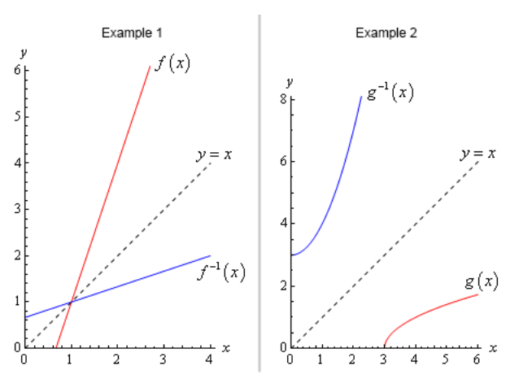

# Section 1.2 : Inverse Functions

In the last
[example](https://tutorial.math.lamar.edu/Classes/CalcI/Functions.aspx#Rev_Fcns_Ex7)
from the previous section we looked at the two functions $f(x) = 3x - 2$ and
$g(x) = \dfrac{x}{3} + \dfrac{2}{3}$ and saw that

$$ (f \circ g)(x) = (g \circ f)(x) = x $$

and as noted in that section this means that there is a nice relationship
between these two functions. Let's see just what that relationship is. Consider
the following evaluations.

$$ f(\textcolor{blue}{-1}) = 3(-1) - 2 = \textcolor{red}{-5} \quad \Rightarrow \quad g(\textcolor{red}{-5}) = \frac{-5}{3} + \frac{2}{3} = \frac{-3}{3} = \textcolor{blue}{-1} $$

$$ g(\textcolor{blue}{2}) = \frac{2}{3} + \frac{2}{3} = \textcolor{red}{\frac{4}{3}} \quad \Rightarrow \quad f\left(\textcolor{red}{\frac{4}{3}}\right) = 3\left(\frac{4}{3}\right) - 2 = 4 - 2 = \textcolor{blue}{2} $$

In the first case we plugged $x = -1$ into $f(x)$ and got a value of $-5$. We
then turned around and plugged $x = -5$ into $g(x)$ and got a vlue of $-14, the
number we started off with.

In the second ase we did something similar. Here we plugged $x = 2$ into $g(x)$
and got a value of $\dfrac{4}{3}$, we turned around and plugged this into $f(x)$
and got a value of $2$, which is again the number that we started with.

Note that we really are doing some function composition here. The first case is
really,

$$ (g \circ f)(-1) = g[f(-1)] = g[-5] = -1 $$

and the second case is really,

$$ (f \circ g)(2) = f[g(2)] = f\left[\frac{4}{3}\right] = 2 $$

Note as well that these both agree with the formula for the compositions that we
found in the previous section. We get back out of the function evaluation the
number that we originally plugged into the composition.

So, just what is going on here? In some way we can think of these two functions
as undoing what the other did to a number. In the first case we plugged $x = -1$
into $f(x)$ and then plugged the result from this function evaluation back into
$g(x)$ and in some way $g(x)$ undid what $f(x)$ had done to $x = -1$ and gave us
back the original $x$ that we started with.

Function pairs that exhibit this bwehavior are called **inverse functions**.
Before formally defining inverse functions and the notation that we're going to
use for them we need to get a definition out of the way.

A function is called **one-to-one** if no two values of $x$ produce the same
$y$. Mathematically this is the same as saying,

$$ f(x_1) \neq f(x_2) \quad \text{ whenever } \quad x_1 \neq x_2 $$

So, a function is one-to-one if whenever we plug different values into the
function we get different function values.

Sometimes it is easier to understand this definition if we see a function that
isn't one-to-one. Let's take a look at a function that isn't one-to-one. The
function $f(x) = x^2$ is not one-to-one because both $f(-2) = 4$ and
$f(2) =n 4$. In other words, there are two different values of $x$ that produce
the same value of $y$. Note that we can turn $f(x) = x^2$ into a one-to-one
function if we restrict ourselves to $0 \leq x < \infty$. This can sometimes be
done with functions.

Showing that a function is one-to-one is often tedious and/or difficult. For the
most part we are going to assume that the functions that we're going to be
dealing with in this course are either one-to-one or we have restricted the
domain of the function to get it to be a one-to-one function.

Now, let's formally define just what inverse functions are. Given two one-to-one
functions $f(x)$ and $g(x)$ if

$$ (f \circ g)(x) = x \quad \text{ AND } \quad (g \circ f)(x) = x $$

then we say that $f(x)$ and $g(x)$ are **inverses** of each other. More
specifically we will say that $g(x)$ is the **inverse** of $f(x)$ and denote it
by

$$ g(x) = f^{-1}(x) $$

Likewise, we could also say that $f(x)$ is the **inverse** of $g(x)$ and denote
it by

$$ f(x) = g^{-1}(x) $$

The notation that we use really depends upon the problem. In most cases either
is acceptable.

For the two functions that we started off this section with we could write
either of the following two sets of notation.

$$ f(x) = 3x - 2 \quad\quad\quad f^{-1}(x) = \frac{x}{3} + \frac{2}{3} $$

$$ g(x) = \frac{x}{3} + \frac{2}{3} \quad\quad\quad g^{-1}(x) = 3x - 2 $$

Now, be careful with the noatation for inverses. The "$-1$" is NOT an exponent
despite the fact that it sure does look like one! When dealing with inverse
functions we've got to remember that

$$ f^{-1}(x) \neq \frac{1}{f(x)} $$

This is one of the most common mistakes that students make when first studying
inverse functions.

The process for finding the inverse of a function is a fairly simple one
although there are a couple of steps that can on occassion be somewhat messy.
Here is the process

---

**Finding the Inverse of a Function**

> Given the function $f(x)$ we want to find the inverse function, $f^{-1}(x)$.
>
> 1. First, replace $f(x)$ with $y$. This is done to make the rest of the
>    process easier.
> 2. Replace every $x$ with a $y$ and replace every $y$ with an $x$.
> 3. Solve the equation from Step 2 for $y$. This is the step where mistakes are
>    most often made so be careful with this step.
> 4. Replace $y$ with $f^{-1}(x)$. In other words, we've managed to find the
>    inverse at this point!
> 5. Verify your work by checking that
>
> $$ (f \circ f^{-1})(x) = x $$
>
> and
>
> $$ (f^{-1} \circ f)(x) = x $$
>
> are both true. This work can sometimes be messy making it easy to make m
> istakes so again be careful.

That's the process. Most of the steps are not all that bad but as mentioned in
the process there are a couple of steps that we really need to be careful with
since it is easy to make mistakes in those steps.

In the verification step we technically really do need to check that both
$(f \circ f^{-1})(x) = x$ and $(f^{-1} \circ f)(x) = x$ are true. For all the
functions that we are going to be looking at in this course if one is true then
the other will also be true. However, there are functions (they are beyond the
scope of this course however) for which it is possible for only one of these to
be true. This is brought up because in all the problems here we will be just
checking one of them. We just need to always remember that technically we should
check both.

Let's work some examples.

---

**Example 1** Given $f(x) = 3x - 2$ find $f^{-1}(x)$.

**Solution:**

Now, we already know what the inverse to this function is as we’ve already done
some work with it. However, it would be nice to actually start with this since
we know what we should get. This will work as a nice verification of the
process.

So, let's get started. We'll first replace $f(x)$ with $y$.

$$ y = 3x - 2 $$

Next, replace all $x$'s with $y$ and all $y$'s with $x$.

$$ x = 3y - 2 $$

Now, solve for $y$.

$$ x + 2 = 3y $$

$$ \frac{1}{3}(x + 2) = y $$

$$ \frac{x}{3} + \frac{2}{3} = y $$

Finally replace $y$ with $f^{-1}(x)$.

$$ f^{-1}(x) = \frac{x}{3} + \frac{2}{3} $$

Now, we need to verify the results. We already took care of this in the previous
section, however, we really should follow the process so we'll do that here. It
doesn't matter which of the two that we check we just need to check one of them.
This time we'll checdk that $(f \circ f^{-1})(x) = x$ is true.

$$
\begin{align*}
(f \circ f^{-1})(x) = f\left[f^{-1}(x)\right] \\
\quad = f\left[\frac{x}{3} + \frac{2}{3}\right] \\
\quad = 3\left(\frac{x}{3} + \frac{2}{3}\right) - 2 \\
\quad = x + 2 - 2 \\
\quad = x
\end{align*}
$$

---

**Example 2** Given $g(x) = \sqrt{x - 3}$ find $g^{-1}(x)$.

**Solution:**

$$ y = \sqrt{x - 3} $$

$$ x = \sqrt{y - 3} $$

$$ x^2 = y - 3 $$

$$ x^2 + 3 = y $$

$$ g^{-1}(x) = x^2 + 3 $$

Check:

$$ (g \circ g^{-1})(x) = g\left[g^{-1}(x)\right] $$

$$ (g \circ g^{-1})(x) = g\left[x^2 + 3\right] $$

$$ (g \circ g^{-1})(x) = \sqrt{(x^2 + 3) - 3} $$

$$ (g \circ g^{-1})(x) = \sqrt{x^2 + 3 - 3} $$

$$ (g \circ g^{-1})(x) = \sqrt{x^2} $$

$$ (g \circ g^{-1})(x) = x $$

---

**Example 3** Given $h(x) = \dfrac{x + 4}{2x - 5}$ find $h^{-1}(x)$.

$$ y = \frac{x + 4}{2x - 5} $$

$$ x = \frac{y + 4}{2y - 5} $$

$$ x(2y - 5) = y + 4 $$

$$ 2xy - 5x = y + 4 $$

$$ 2xy - y = 5x + 4 $$

$$ y(2x - 1) = 5x + 4 $$

$$ y = \frac{5x + 4}{2x - 1} $$

$$ h^{-1}(x) = \frac{5x + 4}{2x - 1} $$

Check:

$$ (h \circ h^{-1})(x) = h\left[h^{-1}(x)\right] $$

$$ (h \circ h^{-1})(x) = h\left[\frac{5x + 4}{2x - 1}\right] $$

$$ (h \circ h^{-1})(x) = \frac{\dfrac{5x + 4}{2x - 1} + 4}{2\left(\dfrac{5x + 4}{2x - 1}\right) - 5}$$

$$ (h \circ h^{-1})(x) = \left(\frac{2x - 1}{2x - 1}\right)\frac{\dfrac{5x + 4}{2x - 1} + 4}{2\left(\dfrac{5x + 4}{2x - 1}\right) - 5}$$

$$ (h \circ h^{-1})(x) = \frac{5x + 4 + 4(2x - 1)}{2(5x + 4) - 5(2x - 1)} $$

$$ (h \circ h^{-1})(x) = \frac{5x + 4 + 8x - 4}{10x + 8 - 10x + 5} $$

$$ (h \circ h^{-1})(x) = \frac{13x}{13} $$

$$ (h \circ h^{-1})(x) = x $$

---

There is one final topic that we need to address quickly before we leave this
section. There is an interesting relationship between the graph of a function
and the graph of its inverse.

Here is the graph of the function and inverse from the first two examples.

In both cases we can see that the graph of hte inverse if the reflection of the
actual function about the line $y = x$. This will always be the case with the
graphs of a function and its inverse.

---

## Practice Problems

For each of the following functions find the inverse of the function. Verify
your inverse by computing one or both of the composition as discussed in this
section.

**1.** $f(x) = 6x + 15$

**Solution**

$$ y = 6x + 15 $$

$$ x = 6y + 15 $$

$$ x - 15 = 6y $$

$$ \frac{x - 15}{6} = y $$

$$ f^{-1}(x) = \frac{x - 15}{6} $$

Check:

$$ (f \circ f^{-1})(x) = f\left[f^{-1}(x)\right] $$

$$ (f \circ f^{-1})(x) = f\left[\frac{x - 15}{6}\right] $$

$$ (f \circ f^{-1})(x) = 6\left(\frac{x - 15}{6}\right) + 15 $$

$$ (f \circ f^{-1})(x) = (x - 15) + 15 $$

$$ (f \circ f^{-1})(x) = x $$

Answer:

$$ \boxed{f^{-1}(x) = \frac{x - 15}{6}} $$

**2.** $h(x) = 3 - 29x$

**Solution**

$$ y = 3 - 29x $$

$$ x = 3 - 29y $$

$$ x - 3 = -29y $$

$$ \frac{x - 3}{-29} = y $$

$$ h^{-1}(x) = -\frac{x - 3}{29} $$

Check:

$$ (h \circ h^{-1})(x) = h\left[h^{-1}(x)\right] $$

$$ (h \circ h^{-1})(x) = h\left[-\frac{x - 3}{29}\right] $$

$$ (h \circ h^{-1})(x) = 3 - 29\left(-\frac{x - 3}{29}\right) $$

$$ (h \circ h^{-1})(x) = 3 + (x - 3) $$

$$ (h \circ h^{-1})(x) = x $$

Answer:

$$ \boxed{h^{-1}(x) = -\frac{x - 3}{29}} $$

**3.** $R(x) = x^3 + 6$

**Solution**

$$ y = x^3 + 6 $$

$$ x = y^3 + 6 $$

$$ x - 6 = y^3 $$

$$ \sqrt[3]{x - 6} = y $$

$$ R^{-1}(x) = \sqrt[3]{x - 6} $$

Check:

$$ (R \circ R^{-1})(x) = R\left[R^{-1}(x)\right] $$

$$ (R \circ R^{-1})(x) = R\left[\sqrt[3]{x - 6}\right] $$

$$ (R \circ R^{-1})(x) = \left(\sqrt[3]{x - 6}\right)^3 + 6 $$

$$ (R \circ R^{-1})(x) = x - 6 + 6 $$

$$ (R \circ R^{-1})(x) = x $$

Answer:

$$ \boxed{R^{-1}(x) = \sqrt[3]{x - 6}} $$

**4.** $g(x) = 4(x - 3)^5 + 21$

**Solution**

$$ y = 4(x - 3)^5 + 21 $$

$$ x = 4(y - 3)^5 + 21 $$

$$ x - 21 = 4(y - 3)^5 $$

$$ \frac{x - 21}{4} = (y - 3)^5 $$

$$ \sqrt[5]{\frac{x - 21}{4}} = y - 3 $$

$$ \sqrt[5]{\frac{x - 21}{4}} + 3 = y $$

$$ g^{-1}(x) = \sqrt[5]{\frac{x - 21}{4}} + 3 $$

Check:

$$ (g \circ g^{-1})(x) = g\left[g^{-1}(x)\right] $$

$$ (g \circ g^{-1})(x) = g\left[\sqrt[5]{\frac{x - 21}{4}} + 3\right] $$

$$ (g \circ g^{-1})(x) = 4\left[\left(\sqrt[5]{\frac{x - 21}{4}} + 3\right) - 3\right]^5 + 21 $$

$$ (g \circ g^{-1})(x) = 4\left[\sqrt[5]{\frac{x - 21}{4}} + 3 - 3\right]^5 + 21 $$

$$ (g \circ g^{-1})(x) = 4\left[\sqrt[5]{\frac{x - 21}{4}}\right]^5 + 21 $$

$$ (g \circ g^{-1})(x) = 4\left(\frac{x - 21}{4}\right) + 21 $$

$$ (g \circ g^{-1})(x) = x - 21 + 21 $$

$$ (g \circ g^{-1})(x) = x $$

Answer:

$$ \boxed{g^{-1}(x) = \sqrt[5]{\frac{x - 21}{4}} + 3} $$

**5.** $W(x) = \sqrt[5]{9 - 11x}$

**Solution**

$$ y = \sqrt[5]{9 - 11x} $$

$$ x = \sqrt[5]{9 - 11y} $$

$$ x^5 = 9 - 11y $$

$$ x^5 - 9 = -11y $$

$$ \frac{x^5 - 9}{-11} = y $$

$$ W^{-1}(x) = -\frac{x^5 - 9}{11} $$

Check:

$$ (W \circ W^{-1})(x) = W\left[W^{-1}(x)\right] $$

$$ (W \circ W^{-1})(x) = W\left[-\frac{x^5 - 9}{11}\right] $$

$$ (W \circ W^{-1})(x) = \sqrt[5]{9 - 11\left(-\frac{x^5 - 9}{11}\right)} $$

$$ (W \circ W^{-1})(x) = \sqrt[5]{9 + x^5 - 9} $$

$$ (W \circ W^{-1})(x) = \sqrt[5]{x^5} $$

$$ (W \circ W^{-1})(x) = x $$

Answer:

$$ \boxed{W^{-1}(x) = -\frac{x^5 - 9}{11}} $$

**6.** $f(x) = \sqrt[7]{5x + 8}$

**Solution**

$$ y = \sqrt[7]{5x + 8} $$

$$ x = \sqrt[7]{5y + 8} $$

$$ x^7 = 5y + 8 $$

$$ x^7 - 8 = 5y $$

$$ \frac{x^7 - 8}{5} = y $$

$$ f^{-1}(x) = \frac{x^7 - 8}{5} $$

Check:

$$ (f \circ f^{-1})(x) = f\left[f^{-1}(x)\right] $$

$$ (f \circ f^{-1})(x) = f\left[\frac{x^7 - 8}{5}\right] $$

$$ (f \circ f^{-1})(x) = \sqrt[7]{5\left(\frac{x^7 - 8}{5}\right) + 8} $$

$$ (f \circ f^{-1})(x) = \sqrt[7]{x^7 - 8 + 8} $$

$$ (f \circ f^{-1})(x) = \sqrt[7]{x^7} $$

$$ (f \circ f^{-1})(x) = x $$

Answer:

$$ \boxed{f^{-1}(x) = \frac{x^7 - 8}{5}} $$

**7.** $h(x) = \dfrac{1 + 9x}{4 - x}$

**Solution**

$$ y = \dfrac{1 + 9x}{4 - x} $$

$$ x = \dfrac{1 + 9y}{4 - y} $$

$$ x(4 - y) = 1 + 9y $$

$$ 4x - xy = 1 + 9y $$

$$ 4x - 1 = xy + 9y $$

$$ 4x - 1 = y(x + 9) $$

$$ \frac{4x - 1}{x + 9} = y $$

$$ h^{-1}(x) = \frac{4x - 1}{x + 9} $$

Check:

$$ (h \circ h^{-1})(x) = h\left[h^{-1}(x)\right] $$

$$ (h \circ h^{-1})(x) = h\left[\frac{4x - 1}{x + 9}\right] $$

$$ (h \circ h^{-1})(x) = \frac{1 + 9\left(\dfrac{4x - 1}{x + 9}\right)}{4 - \left(\dfrac{4x - 1}{x + 9}\right)} $$

$$ (h \circ h^{-1})(x) = \left(\frac{x + 9}{x + 9}\right)\frac{1 + 9\left(\dfrac{4x - 1}{x + 9}\right)}{4 - \left(\dfrac{4x - 1}{x + 9}\right)} $$

$$ (h \circ h^{-1})(x) = \frac{1(x + 9) + 9(4x - 1)}{4(x + 9) - (4x - 1)} $$

$$ (h \circ h^{-1})(x) = \frac{x + 9 + 36x - 9}{4x + 36 - 4x + 1} $$

$$ (h \circ h^{-1})(x) = \frac{37x}{37} $$

$$ (h \circ h^{-1})(x) = x $$

Answer:

$$ \boxed{h^{-1}(x) = \frac{4x - 1}{x + 9}} $$

**8.** $f(x) = \dfrac{6 - 10x}{8x + 7}$

**Solution**

$$ y = \dfrac{6 - 10x}{8x + 7} $$

$$ x = \dfrac{6 - 10y}{8y + 7} $$

$$ x(8y + 7) = 6 - 10y $$

$$ 8xy + 7x = 6 - 10y $$

$$ 8xy + 10y = 6 - 7x $$

$$ y(8x + 10) = 6 - 7x $$

$$ y = \frac{6 - 7x}{8x + 10} $$

$$ f^{-1}(x) = \frac{6 - 7x}{8x + 10} $$

Check:

$$ (f \circ f^{-1})(x) = f\left[f^{-1}(x)\right] $$

$$ (f \circ f^{-1})(x) = f\left[\frac{6 - 7x}{8x + 10}\right] $$

$$ (f \circ f^{-1})(x) = \frac{6 - 10\left(\dfrac{6 - 7x}{8x + 10}\right)}{8\left(\dfrac{6 - 7x}{8x + 10}\right) + 7} $$

$$ (f \circ f^{-1})(x) = \left(\frac{8x + 10}{8x + 10}\right)\frac{6 - 10\left(\dfrac{6 - 7x}{8x + 10}\right)}{8\left(\dfrac{6 - 7x}{8x + 10}\right) + 7} $$

$$ (f \circ f^{-1})(x) = \frac{6(8x + 10) - 10(6 - 7x)}{8(6 - 7x) + 7(8x + 10)} $$

$$ (f \circ f^{-1})(x) = \frac{48x + 60 - 60 + 70x}{48 - 56x + 56x + 70} $$

$$ (f \circ f^{-1})(x) = \frac{118x}{118} $$

$$ (f \circ f^{-1})(x) = x $$

Answer:

$$ \boxed{f^{-1}(x) = \frac{6 - 7x}{8x + 10}} $$

---

## Assignment Problems

For each of the following functions find the inverse of the function. Verify
your inverse by computing one or both of the composition as discussed in this
section.

**1.** $f(x) = 11x - 8$

**Solution**

$$ y = 11x - 8 $$

$$ x = 11y - 8 $$

$$ x + 8 = 11y $$

$$ \frac{x + 8}{11} = y $$

$$ f^{-1}(x) = \frac{x + 8}{11} $$

Check:

$$ (f \circ f^{-1})(x) = f\left[f^{-1}(x)\right] $$

$$ (f \circ f^{-1})(x) = f\left[\frac{x + 8}{11}\right] $$

$$ (f \circ f^{-1})(x) = 11\left(\frac{x + 8}{11}\right) - 8 $$

$$ (f \circ f^{-1})(x) = x + 8 - 8 $$

$$ (f \circ f^{-1})(x) = x $$

Answer:

$$ \boxed{f^{-1}(x) = \frac{x + 8}{11}} $$

**2.** $g(x) = 4 - 10x$

**Solution**

$$ y = 4 - 10x $$

$$ x = 4 - 10y $$

$$ x - 4 =  -10y $$

$$ \frac{x - 4}{-10} = y $$

$$ g^{-1}(x) = -\frac{x - 4}{10} $$

Check:

$$ (g \circ g^{-1})(x) = g\left[g^{-1}(x)\right] $$

$$ (g \circ g^{-1})(x) = g\left[-\frac{x - 4}{10}\right] $$

$$ (g \circ g^{-1})(x) = 4 - 10\left(-\frac{x - 4}{10}\right) $$

$$ (g \circ g^{-1})(x) = 4 + x - 4 $$

$$ (g \circ g^{-1})(x) = x $$

Answer:

$$ \boxed{g^{-1}(x) = -\frac{x - 4}{10}} $$

**3.** $Z(x) = 2x^7 - 9$

**Solution**

$$ y = 2x^7 - 9 $$

$$ x = 2y^7 - 9 $$

$$ x + 9 = 2y^7 $$

$$ \frac{x + 9}{2} = y^7 $$

$$ \sqrt[7]{\frac{x + 9}{2}} = y $$

$$ Z^{-1}(x) = \sqrt[7]{\frac{x + 9}{2}} $$

Check:

$$ (Z \circ Z^{-1})(x) = Z\left[Z^{-1}(x)\right] $$

$$ (Z \circ Z^{-1})(x) = Z\left[\sqrt[7]{\frac{x + 9}{2}}\right] $$

$$ (Z \circ Z^{-1})(x) = 2\left(\sqrt[7]{\frac{x + 9}{2}}\right)^7 - 9 $$

$$ (Z \circ Z^{-1})(x) = 2\left(\frac{x + 9}{2}\right) - 9 $$

$$ (Z \circ Z^{-1})(x) = x + 9 - 9 $$

$$ (Z \circ Z^{-1})(x) = x $$

Answer:

$$ \boxed{Z^{-1}(x) = \sqrt[7]{\frac{x + 9}{2}}} $$

**4.** $h(x) = 7 + (2x + 1)^3$

**Solution**

$$ y = 7 + (2x + 1)^3 $$

$$ x = 7 + (2y + 1)^3 $$

$$ x - 7 = (2y + 1)^3 $$

$$ \sqrt[3]{x - 7} = 2y + 1 $$

$$ \sqrt[3]{x - 7} - 1 = 2y $$

$$ \frac{\sqrt[3]{x - 7} - 1}{2} = y $$

$$ h^{-1}(x) = \frac{\sqrt[3]{x - 7} - 1}{2} $$

Check:

$$ (h \circ h^{-1})(x) = h\left[h^{-1}(x)\right] $$

$$ (h \circ h^{-1})(x) = h\left[\frac{\sqrt[3]{x - 7} - 1}{2}\right] $$

$$ (h \circ h^{-1})(x) = 7 + \left[2\left(\frac{\sqrt[3]{x - 7} - 1}{2}\right) + 1\right]^3 $$

$$ (h \circ h^{-1})(x) = 7 + \left[\sqrt[3]{x - 7} - 1 + 1\right]^3 $$

$$ (h \circ h^{-1})(x) = 7 + \left[\sqrt[3]{x - 7}\right]^3 $$

$$ (h \circ h^{-1})(x) = 7 + x - 7 $$

$$ (h \circ h^{-1})(x) = x $$

Answer:

$$ \boxed{h^{-1}(x) = \frac{\sqrt[3]{x - 7} - 1}{2}} $$

**5.** $W(x) = \sqrt[7]{15x + 2}$

**Solution**

$$ y = \sqrt[7]{15x + 2} $$

$$ x = \sqrt[7]{15y + 2} $$

$$ x^7 = 15y + 2 $$

$$ x^7 - 2 = 15y $$

$$ \frac{x^7 - 2}{15} = y $$

$$ W^{-1}(x) = \frac{x^7 - 2}{15} $$

Check:

$$ (W \circ W^{-1})(x) = W\left[W^{-1}(x)\right] $$

$$ (W \circ W^{-1})(x) = W\left[\frac{x^7 - 2}{15}\right] $$

$$ (W \circ W^{-1})(x) = \sqrt[7]{15\left(\frac{x^7 - 2}{15}\right) + 2} $$

$$ (W \circ W^{-1})(x) = \sqrt[7]{x^7 - 2 + 2} $$

$$ (W \circ W^{-1})(x) = \sqrt[7]{x^7} $$

$$ (W \circ W^{-1})(x) = x $$

Answer:

$$ \boxed{W^{-1}(x) = \frac{x^7 - 2}{15}} $$

**6.** $h(x) = \sqrt[3]{6 - 18x}$

**Solution**

$$ y = \sqrt[3]{6 - 18x} $$

$$ x = \sqrt[3]{6 - 18y} $$

$$ x^3 = 6 - 18y $$

$$ x^3 - 6 = -18y $$

$$ \frac{x^3 - 6}{-18} = y $$

$$ h^{-1}(x) = -\frac{x^3 - 6}{18} $$

Check:

$$ (h \circ h^{-1})(x) = h\left[h^{-1}(x)\right] $$

$$ (h \circ h^{-1})(x) = h\left[-\frac{x^3 - 6}{18}\right] $$

$$ (h \circ h^{-1})(x) = \sqrt[3]{6 - 18\left(-\frac{x^3 - 6}{18}\right)} $$

$$ (h \circ h^{-1})(x) = \sqrt[3]{6 + x^3 - 6} $$

$$ (h \circ h^{-1})(x) = \sqrt[3]{x^3} $$

$$ (h \circ h^{-1})(x) = x $$

Answer:

$$ \boxed{h^{-1}(x) = -\frac{x^3 - 6}{18}} $$

**7.** $R(x) = \dfrac{2x + 14}{6x + 1}$

**Solution**

$$ y = \dfrac{2x + 14}{6x + 1} $$

$$ x = \dfrac{2y + 14}{6y + 1} $$

$$ x(6y + 1) = 2y + 14 $$

$$ 6xy + x = 2y + 14 $$

$$ 6xy - 2y = 14 - x $$

$$ y(6x - 2) = 14 - x $$

$$ y = \frac{14 - x}{6x - 2} $$

$$ R^{-1}(x) = \frac{14 - x}{6x - 2} $$

Check:

$$ (R \circ R^{-1})(x) = R\left[R^{-1}(x)\right] $$

$$ (R \circ R^{-1})(x) = R\left[\frac{14 - x}{6x - 2}\right] $$

$$ (R \circ R^{-1})(x) = \frac{2\left(\dfrac{14 - x}{6x - 2}\right) + 14}{6\left(\dfrac{14 - x}{6x - 2}\right) + 1}$$

$$ (R \circ R^{-1})(x) = \left(\frac{6x - 2}{6x - 2}\right)\frac{2\left(\dfrac{14 - x}{6x - 2}\right) + 14}{6\left(\dfrac{14 - x}{6x - 2}\right) + 1}$$

$$ (R \circ R^{-1})(x) = \frac{2(14 - x) + 14(6x - 2)}{6(14 - x) + 1(6x - 2)} $$

$$ (R \circ R^{-1})(x) = \frac{28 - 2x + 84x - 28}{84 - 6x + 6x - 2} $$

$$ (R \circ R^{-1})(x) = \frac{82x}{82} $$

$$ (R \circ R^{-1})(x) = x $$

Answer:

$$ \boxed{R^{-1}(x) = \frac{14 - x}{6x - 2}} $$

**8.** $g(x) = \dfrac{1 - x}{9 - 12x}$

**Solution**

$$ y = \dfrac{1 - x}{9 - 12x} $$

$$ x = \dfrac{1 - y}{9 - 12y} $$

$$ x(9 - 12y) = 1 - y $$

$$ 9x - 12xy = 1 - y $$

$$ -12xy + y = 1 - 9x $$

$$ y(-12x + 1) = 1 - 9x $$

$$ y = \frac{1 - 9x}{-12x + 1} $$

$$ g^{-1}(x) = \frac{1 - 9x}{1 - 12x} $$

Check:

$$ (g \circ g^{-1})(x) = g\left[g^{-1}(x)\right] $$

$$ (g \circ g^{-1})(x) = g\left[\frac{1 - 9x}{1 - 12x}\right] $$

$$ (g \circ g^{-1})(x) = \frac{1 - \left(\dfrac{1 - 9x }{1 - 12x}\right)}{9 - 12\left(\dfrac{1 - 9x}{1 - 12x}\right)} $$

$$ (g \circ g^{-1})(x) = \left(\frac{1 - 12x}{1 - 12x}\right)\frac{1 - \left(\dfrac{1 - 9x }{1 - 12x}\right)}{9 - 12\left(\dfrac{1 - 9x}{1 - 12x}\right)} $$

$$ (g \circ g^{-1})(x) = \frac{1(1 - 12x) - (1 - 9x)}{9(1 - 12x) - 12(1 - 9x)} $$

$$ (g \circ g^{-1})(x) = \frac{1 - 12x - 1 + 9x}{9 - 108x - 12 + 108x} $$

$$ (g \circ g^{-1})(x) = \frac{-3x}{-3} $$

$$ (g \circ g^{-1})(x) = x $$

Answer:

$$ \boxed{g^{-1}(x) = \frac{1 - 9x}{1 - 12x}} $$
