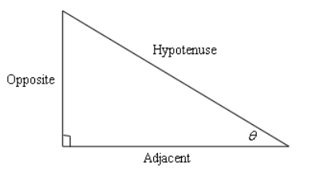
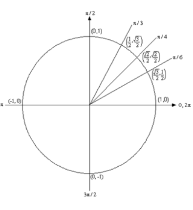
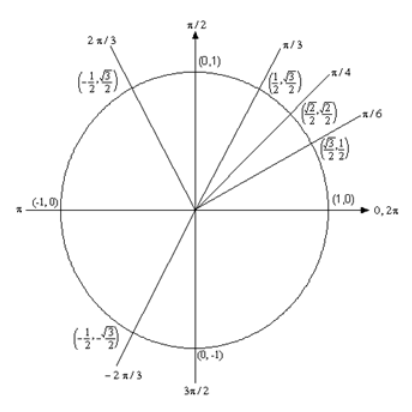
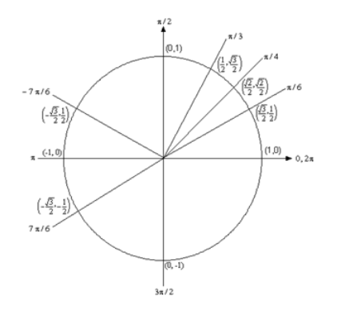
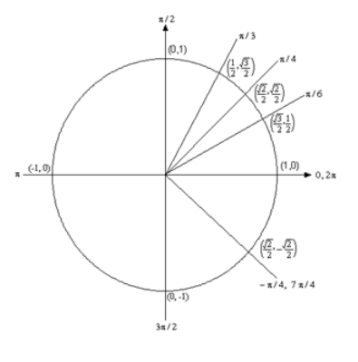

# Section 1.3 : Trig Functions

---

The intent of this section is to remind you of some of the more important (from
a Calculus standpoint...) topics from a trig class. One of the most important
(but not the first) of these topics will be how to use the unit circle. We will
leave the most important topic to the next section.

First let's start with the six trig functions and how they relate to each other.

$$ \cos(x) \quad \quad \quad \sin(x) $$

$$ \tan(x) = \frac{\sin(x)}{\cos(x)}  \quad \quad \quad \cot(x) = \frac{\cos(x)}{\sin(x)} = \frac{1}{\tan(x)} $$

$$ \sec(x) = \frac{1}{\cos(x)} \quad \quad \quad \csc(x) = \frac{1}{\sin(x)} $$

Recall as well that all the trig functions can be defined in terms of a right
triangle.

From this right triangle we get the following definitions of the six trig
functions.

$$ \cos\theta = \frac{\text{adjacent}}{\text{hypotenuse}} $$

$$ \sin\theta = \frac{\text{opposite}}{\text{hypotenuse}} $$

$$ \tan\theta = \frac{\text{opposite}}{\text{adjacent}} $$

$$ \cot\theta = \frac{\text{adjacent}}{\text{opposite}} $$

$$ \sec\theta = \frac{\text{hypotenuse}}{\text{adjacent}} $$

$$ \csc\theta = \frac{\text{hypotenuse}}{\text{opposite}} $$

Remembering both the relationship between all six of the trig functions and
their right triangle definitions will be useful in this course on occassion.

Next, we need to touch on radians. In most trig classes instructors tend to
concentrate on doing everything in terms of degrees (probably because it's
easier to visualize degrees). The same is true in many science classes. However,
in a calculus course almost everything is done in radians. The following table
gives some of the basic angles in both degrees and radians.

| Degree | Radians           |
| ------ | ----------------- |
| $0$    | $0$               |
| $30$   | $\dfrac{\pi}{6}$  |
| $45$   | $\dfrac{\pi}{4}$  |
| $60$   | $\dfrac{\pi}{3}$  |
| $90$   | $\dfrac{\pi}{2}$  |
| $180$  | $\pi$             |
| $270$  | $\dfrac{3\pi}{2}$ |
| $360$  | $2\pi$            |

Know this table! We may not see these specific angles all that much when we get
into the Calculus portion of these notes, but knowing these can help us to
visualize each angle. Now, one more time just make sure this is clear.

**Be forewarned, everything in most calculus classes will be done in radians!**

Let's next take a look at one of the most overlooked ideas from a trig class.
The unit circle is one of the more useful tools to come out of a trig class.
Unfortunately, most people don't learn it as well as they should in their trig
class.

Below is a unit circle with just the first quadrant filled in with the
"standard" angles. The way the unit circle works is to draw a line from the
center of the circle outwards corresponding to a given angle. Then look at the
coordinates of the point where the line and the circle intersect. The first
coordinate, _i.e._ the $x$-coordinate, is the cosine of that angle and the
second coordinate, _i.e._ the $y$-coordinate, is the sine of that angle. We've
put some of the _standard_ angles along with the coordinates of their
intersections on the unit circle.

So, from the unit circle above we can see that
$\cos\left(\dfrac{\pi}{6}\right) = \dfrac{\sqrt{3}}{2}$ and
$\sin\left(\dfrac{\pi}{6}\right) = \dfrac{1}{2}$.

Also, remember how the signs of angles work. If you rotate in a counter
clockwise direction the angle is positive and if you rotate in a clockwise
direction the angle is negative.

Recall as well that one complete revolution is $2\pi$, so the positive $x$-axis
can correspond to either an angle of $0$ or $2\pi$ (or $4\pi$, or $6\pi$, or
$-2\pi$, or $-4\pi$, _etc._ depending on the direction of rotation).

Likewise, the angle $\dfrac{\pi}{6}$ (to pick an angle completely at random) can
also be any of the following angles:

$\dfrac{\pi}{6} + 2\pi = \dfrac{13\pi}{6}$ (start at $\dfrac{\pi}{6}$ then
rotate once around counter clockwise)

$\dfrac{\pi}{6} + 4\pi = \dfrac{25\pi}{6}$ (start at $\dfrac{\pi}{6}$ then
rotate twice around counter clockwise)

$\dfrac{\pi}{6} - 2\pi = -\dfrac{11\pi}{6}$ (start at $\dfrac{\pi}{6}$ then
rotate once around clockwise)

$\dfrac{\pi}{6} - 4\pi = -\dfrac{23\pi}{6}$ (start at $\dfrac{\pi}{6}$ then
rotate twice around clockwise)

_etc._

In fact, $\dfrac{\pi}{6}$ can be any of the following angles $\dfrac{\pi}{6} +
2\pi n, n = 0, \pm 1, \pm 2, \pm 3, \dots$ In this case $n$ is the number of
complete revolutions you make around the unit circle starting at
$\dfrac{\pi}{6}$. Positive values of $n$ correspond to counter clockwise
rotations and negative values of $n$ correspond to clockwise rotations.

So, why did we ony put in the first quadrant? The answer is simple. If you know
the first quadrant then you can get all the other quadrants from the first with
a small application of geometry. You'll see how this is done in the following
set of examples.

---

**Example 1** Evaluate each of the following.

**(a)** $\sin\left(\dfrac{2\pi}{3}\right)$ and
$\sin\left(-\dfrac{2\pi}{3}\right)$

**Solution**

The first evaluation in ths part uses the angle $\dfrac{2\pi}{3}$. That's not on
our unit circle above, however notice that
$\dfrac{2\pi}{3} = \pi - \dfrac{\pi}{3}$. So $\dfrac{2\pi}{3}$ is found by
rotating up $\dfrac{\pi}{3}$ from the negative $x$-axis. This means that the
line for $\dfrac{2\pi}{3}$ will be a mirror image of the line for
$\dfrac{\pi}{3}$ only in the second quadrant. The coordinates for
$\dfrac{2\pi}{3}$ will be the coordinates for $\dfrac{\pi}{3}$ except the $x$
coordinate will be negative.

Likewise, for $-\dfrac{2\pi}{3}$ we can notice that
$-\dfrac{2\pi}{3} = -\pi + \dfrac{\pi}{3}$, so this angle can be found by
rotating down $\dfrac{\pi}{3}$ from the negative $x$-axis. This means that the
line for $-\dfrac{2\pi}{3}$ will be a mirror image of the line for
$\dfrac{\pi}{3}$ only in the third quadrant and the coordinates will be the same
as the coordinates for $\dfrac{\pi}{3}$ except both will be negative.

Both of these angles, along with the coordinates of the intersection points, are
shown on the following unit circle.

From this unit circle we can see that
$\sin\left(\dfrac{2\pi}{3}\right) = \dfrac{\sqrt{3}}{2}$.

This leads to a nice fact about the sine function. The sine function is called
an **odd** function and so for ANY angle we have

$$ \sin(-\theta) = -\sin(\theta) $$

**(b)** $\cos\left(\dfrac{7\pi}{6}\right)$ and
$\cos\left(-\dfrac{7\pi}{6}\right)$

**Solution**

For this example, notice that $\dfrac{7\pi}{6} = \pi + \dfrac{\pi}{6}$ so this
means we would rotate down $\dfrac{\pi}{6}$ from the negative $x$-axis to get to
this angle. Also $-\dfrac{7\pi}{6} = -\pi - \dfrac{\pi}{6}$ so this means we
would rotate up $\dfrac{\pi}{6}$ from the negative $x$-axis to get to this
angle. So, as with the last part, both of these angles will be mirror images of
$\dfrac{\pi}{6}$ in the third and second quadrants respectively and we can use
this to determine coordinates for both of these new angles.

Both of these angles are shown on the following unit circle along with the
coordinates for the intersection points.

From this unit circle we can see that
$\cos\left(\dfrac{7\pi}{6}\right) = -\dfrac{\sqrt{3}}{2}$ and
$\cos\left(-\dfrac{7\pi}{6}\right) = -\dfrac{\sqrt{3}}{2}$. In this case the
cosine function is called an **even** function and so for ANY angle we have

$$ \cos(-\theta) = \cos(\theta) $$

**\(c\)** $\tan\left(-\dfrac{\pi}{4}\right)$ and
$\tan\left(\dfrac{7\pi}{4}\right)$

**Solution**

Here we should note that $\dfrac{7\pi}{4} = 2\pi - \dfrac{\pi}{4}$ so
$\dfrac{7\pi}{4}$ and $-\dfrac{\pi}{4}$ are in fact the same angle! Also note
that this angle will be the mirror image of $\dfrac{\pi}{4}$ in the fourth
quadrant. The unit circle for this angle is

Now, if we remember that $\tan(x) = \dfrac{\sin(x)}{\cos(x)}$ we can use the
unit circle to find the values of the tangent function. So,

$$ \tan\left(\frac{7\pi}{4}\right) = \tan\left(-\frac{\pi}{4}\right) = \frac{\sin\left(-\dfrac{\pi}{4}\right)}{\cos\left(-\dfrac{\pi}{4}\right)} = \frac{-\dfrac{\sqrt{2}}{2}}{\dfrac{\sqrt{2}}{2}} = -1 $$

On a side note, notice that $\tan\left(\dfrac{\pi}{4}\right) = 1$ and we can see
that the tangent function is also called an **odd** function and so for ANY
angle we will have

$$ \tan(-\theta) = -\tan(\theta) $$

**(d)** $\sec\left(\dfrac{25\pi}{6}\right)$

**Solution**

Here we need to notice that $\dfrac{25\pi}{6} = 4\pi + \dfrac{\pi}{6}$. In other
words, we've started at $\dfrac{\pi}{6}$ and rotated around twice to end back up
at the same point on the unit circle. This means that

$$ \sec\left(\frac{25\pi}{6}\right) = \sec\left(4\pi + \frac{\pi}{6}\right) = \sec\left(\frac{\pi}{6}\right) $$

Now, let's also not get excited about the secant here. Just recall that

$$ \sec(x) = \frac{1}{\cos(x)} $$

and so all we need to do here is evaluate a cosine! Therefore,

$$ \sec\left(\frac{25\pi}{6}\right) = \sec\left(\frac{\pi}{6}\right) = \frac{1}{\cos\left(\dfrac{\pi}{6}\right)} = \frac{1}{\dfrac{\sqrt{3}}{2}} = \frac{2}{\sqrt{3}} $$

---

So, in the last example we saw how the unit circle can be used to determine the
value of the trig functions at any of the "common" angles. It's important to
notice that all of these examples used the fact that if you know the first
quadrant of the unit circle and can relate all the other angles to "mirror
images" of one of the first quadrant angles you don't really need to know the
whole unit circle. If you'd like to see a complete unite circle I've got one on
my [Trig Cheat Sheet](http://tutorial.math.lamar.edu/pdf/Trig_Cheat_Sheet.pdf)
that is available at
[http://tutorial.math.lamar.edu](http://tutorial.math.lamar.edu/).

Another important idea from the last example is that when it comes to evaluating
trig functions all that you really need to know is how to evaluate sine and
cosine. The other four trig functions are defined in terms of these two so if
you know how to evaluate sine and cosine you can also evaluate the remaining
four trig functions.

We've not covered many of the topics from a trig class in this section, but we
did cover some of the more important ones from a calculus standpoint. There are
many important trig formulas that you will use occassionally in a calculus
class. Most notablye are the half-angle and double-angle formulas. If you need
reminded of what these are, you might want to downloadmy
[Trig Cheat Sheet](http://tutorial.math.lamar.edu/pdf/Trig_Cheat_Sheet.pdf) as
most of the important facts and formulas from a trig class are listed there.

---

## Practice Problems

Determine the exact value of each of the following without using a calculator.
Note that the point of these problems is not really to learn how to find the
value of trig functions but instead to get you comfortable with the unit circle
since that is a very important skill that will be needed in solving trig
equations.

**1.** $\cos\left(\frac{5\pi}{6}\right)$

**Solution**

**2.** $\sin\left(-\dfrac{4\pi}{3}\right)$

**Solution**

**3.** $\sin\left(\dfrac{7\pi}{4}\right)$

**Solution**

**4.** $\cos\left(-\dfrac{2\pi}{3}\right)$

**Solution**

**5.** $\tan\left(\dfrac{3\pi}{4}\right)$

**Solution**

**6.** $\sec\left(-\dfrac{11\pi}{6}\right)$

**Solution**

**7.** $\cos\left(\dfrac{8\pi}{3}\right)$

**Solution**

**8.** $\tan\left(-\dfrac{\pi}{3}\right)$

**Solution**

**9.** $\tan\left(\dfrac{15\pi}{4}\right)$

**Solution**

**10.** $\sin\left(-\dfrac{11\pi}{3}\right)$

**Solution**

**11.** $\sec\left(\dfrac{29\pi}{4}\right)$

**Solution**

---

## Assignment Problems

**1.** $\tan\left(\dfrac{3\pi}{4}\right)$

**Solution**

**2.** $\sin\left(\dfrac{7\pi}{6}\right)$

**Solution**

**3.** $\sin\left(-\dfrac{3\pi}{4}\right)$

**Solution**

**4.** $\cos\left(\dfrac{4\pi}{3}\right)$

**Solution**

**5.** $\cot\left(\dfrac{5\pi}{4}\right)$

**Solution**

**6.** $\sin\left(-\dfrac{5\pi}{6}\right)$

**Solution**

**7.** $\sec\left(-\dfrac{\pi}{6}\right)$

**Solution**

**8.** $\cos\left(\dfrac{5\pi}{4}\right)$

**Solution**

**9.** $\\cosleft(\dfrac{11\pi}{6}\right)$

**Solution**

**10.** $\csc\left(\dfrac{11\pi}{6}\right)$

**Solution**

**11.** $\\cotleft(-\dfrac{4\pi}{3}\right)$

**Solution**

**12.** $\cos\left(-\dfrac{\pi}{4}\right)$

**Solution**

**13.** $\csc\left(\dfrac{2\pi}{3}\right)$

**Solution**

**14.** $\\secleft(\dfrac{17\pi}{6}\right)$

**Solution**

**15.** $\sin\left(-\dfrac{23\pi}{3}\right)$

**Solution**

**16.** $\tan\left(\dfrac{31\pi}{6}\right)$

**Solution**

**17.** $\cos\left(-\dfrac{15\pi}{4}\right)$

**Solution**

**18.** $\sec\left(-\dfrac{23\pi}{4}\right)$

**Solution**

**19.** $\cot\left(\dfrac{11\pi}{4}\right)$

**Solution**
