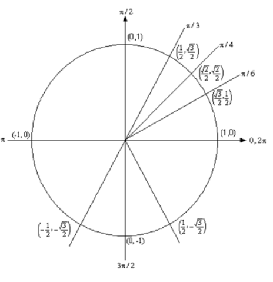

# Section 1.4 : Solving Trig Equations

In this section we will take a look at solving trig equations. This is something
that you will be asked to do on a fairly regular basis in many classes.

Let's just jump into the examples and see how to solve trig equations.

---

**Example 1** Solve $2\cos(t) = \sqrt{3}$.

**Solution**

My straight forward answer:

$$ 2\cos(t) = \sqrt{3} $$

$$ \cos(t) = \frac{\sqrt{3}}{2} $$

$$ \cos^{-1}(\cos(t)) = \cos^{-1}\left(\frac{\sqrt{3}}{2}\right) $$

$$ t = \cos^{-1}\left(\frac{\sqrt{3}}{2}\right) $$

$$ \boxed{t = \frac{\pi}{6}} $$

Paul's:

There's really not a whole lot to do in solving this kind of trig equation. We
first need to get the trig function on one side by itself. To do this all we
need to do is divide both sides by $2$.

$$ 2\cos(t) = \sqrt{3} $$

$$ \cos(t) = \frac{\sqrt{3}}{2} $$

We are looking for all values of $t$ for which cosine will have the value of
$\dfrac{\sqrt{3}}{2}$. So, let's take a look at the following unit circle.

From quick inspection we can see that $t = \dfrac{\pi}{6}$ is a solution.
However, as we have shown on the unit circle there is another angle which will
also be a solution. We need to determine what this angle is. When we look for
these angles we typically want _positive_ angles that lie between $0$ and
$2\pi$. This angle will not be the only possibility of course, but we typically
look for angles that meet these conditions.

To find this angle for this problem all we need to do is use a little geometry.
The angle in the first quadrant makes an angle of $\dfrac{\pi}{6}$ with the
positive $x$-axis, then so must the angle in the fourth quadrant. So, we have
two options. We could use $-\dfrac{\pi}{6}$, but again, it's more common to use
positive angles. To get a positive angle all we need to do is use the fact that
the angle is $\dfrac{\pi}{6}$ with the positive $x$-axis (as noted above) and a
positive angle will be $t = 2\pi - \dfrac{\pi}{6} = \dfrac{11\pi}{6}$.

One way to remember how to get the positive form of the second angle is to think
of making one full revolution from the positive $x$-axis (_i.e._ $2\pi$) and
then backing off $(_i.e._ subtracting) $\dfrac{\pi}{6}$.

We aren't done with this problem. As the discussion about finding the second
angle has shown there are many ways to write any given angle on the unit circle.
Sometimes it will be $-\dfrac{\pi}{6}$ that we want for the solution and
sometimes we will want both (or neither) of the listed angles. Therefore, since
there isn't anything in this problem (contrast this with the next problem) to
tell us which is the correct solution we will need to list ALL possible
solutions.

This is very easy to do. Recall from the previous
[section](https://tutorial.math.lamar.edu/Classes/CalcI/TrigFcns.aspx#All_Angles)
and you'll see there that we used

$$ \frac{\pi}{6} + 2\pi n \text{, } n = 0, \pm 1, \pm 2, \pm 3, \dots $$

to represent all the possible angles that can end at the same location on the
unit circle, _i.e._ angles that end at $\dfrac{\pi}{6}$. Remember that all this
says is that we start at $\dfrac{\pi}{6}$ then rotate around in the
counter-clockwise direction ($n$ is positive) or clockwise direction ($n$ is
negative) for $n$ complete rotations. The same thing can be done for the second
solution.

So, all together the complete solution to this problem is

$$ \frac{\pi}{6} + 2\pi n\text{, } n = 0, \pm 1, \pm 2, \pm 3, \dots $$

$$ \frac{11\pi}{6} + 2\pi n\text{, } n = 0, \pm 1, \pm 2, \pm 3, \dots $$

As a final thought, notice that we can get $-\dfrac{\pi}{6}$ by using $n = -1$
in the second solution.

---

Now, in a calculus class this is not a typical trig equation that we'll be asked
to solve. A more typical example is the next one.

---

**Example 2** Solve $2\cos(t) = \sqrt{3}$ on $[-2\pi, 2\pi]$.

**Solution**

In a calculus class we are often more interested in only the solutions to a trig
equation that fall in a certain interval. The first step in this kind of problem
is to find all possible solutions We did this in the previous example.

$$ \frac{\pi}{6} + 2\pi n\text{, } n = 0, \pm 1, \pm 2, \pm 3, \dots $$

$$ \frac{11\pi}{6} + 2\pi n\text{, } n = 0, \pm 1, \pm 2, \pm 3, \dots $$

Now, to find the solutions in the interval all we need to do is start picking
values of $n$, plugging them in and getting the solutions that will fall into
the interval that we've been given.

$n = 0$.

$$ \frac{\pi}{6} + 2\pi(0) = \frac{\pi}{6} < 2\pi $$

$$ \frac{11\pi}{6} + 2\pi(0) = \frac{11\pi}{6} < 2\pi $$

Now, notice that if we take any positive value of $n$ we will be adding on
positive multiples of $2\pi$ onto a positive quantity and this will take us past
the upper bound of our interval so we don't need to take any positive value of
$n$.

However, just because we aren't going to take any positive value of $n$ doesn't
mean that we shouldn't also look at negative values of $n$.

$n = -1$.

$$ \frac{\pi}{6} + 2\pi(-1) = -\frac{11\pi}{6} > -2\pi $$

$$ \frac{11\pi}{6} + 2\pi(-1) = -\frac{\pi}{6} > -2\pi $$

These are both greater than $-2\pi$ and so are solutions, but if we subtract
another $2\pi$ off (_i.e._ use $n = -2$) we will once again be outside of the
interval so we've found all the possible solutions that lie inside the interval
$[-2\pi, 2\pi]$.

So, the solutions are :
$\dfrac{\pi}{6}, \dfrac{11\pi}{6}, -\dfrac{\pi}{6}, \dfrac{-11\pi}{6}$

---

So, let's see if you've got all this down.

---

**Example 3** Solve $2\sin(5x) = -\sqrt{3}$ on $[-\pi, 2\pi]$

**Solution**

This problem is very similar to the other problems in this section with a very
important difference. We'll start this problem exactly the same way as we did in
the first example. So, first get the sine on one side by itself.

$$ 2\sin(5x) = -\sqrt{3} $$

$$ \sin(5x) = \frac{-\sqrt{3}}{2} $$

We are looking for angles that will give $-\dfrac{\sqrt{3}}{2}$ out of the sine
function. Let's again go to our trusty unit circle.

Now, there are no angles in the first quadrant for which sine has a value of
$-\dfrac{\sqrt{3}}{2}$. However, there are two angles in the lower half of the
unit circle for which sine will have a value of $-\dfrac{\sqrt{3}}{2}$. So, what
are these angles?

Notice that $\sin\left(\dfrac{\pi}{3}\right) = \dfrac{\sqrt{3}}{2}$. Given this
we now know that the angle in the third quadrant will be $\dfrac{\pi}{3}$ below
the **negative** $x$-axis or $\pi + \dfrac{\pi}{3} = \dfrac{4\pi}{3}$. An easy
way to remember this is to notice that we'll rotate half a revolution from the
positive $x$-axis to get to the negative $x$-axis then add on $\dfrac{\pi}{3}$
to reach the angle we are looking for.

Likewise, the angle in the fourth quadrant will be $\dfrac{\pi}{3}$ below the
**positive** $x$-axis. So, we could use $-\dfrac{\pi}{3}$ or
$2\i - \dfrac{\pi}{3} = \dfrac{5\pi}{3}$. Rememeber that we're typically looking
for positive angles between $0$ and $2\pi$ so we'll use the positive angle. An
easy way to remember how to find the positive angle here is to rotate one full
revolution from the positive $x$-axis (_i.e._ $2\pi$) and then backing off
(_i.e_ subtracting) $\frac{\pi}{3}$.

Now we come to the very important difference between this problem and the
previous problems in this section. The solution is **NOT**

$$ x = \frac{4\pi}{3} + 2\pi n, \quad n = 0, \pm 1, \pm 2, \dots $$

$$ x = \frac{5\pi}{3} + 2\pi n, \quad n = 0, \pm 1, \pm 2, \dots $$

This is not the set of solutions because we are NOT looking for values of $x$
for which $\sin(x) = -\dfrac{\sqrt{3}}{2}$, but isntead we are looking for
values of $x$ for which $\sin(5x) = -\dfrac{\sqrt{3}}{2}$. Note the difference
in teh arguments of the sine function! One is $x$ and the other is $5x$. This
makes all the difference in the world in finding the solution! Therefore, the
set of solutions is

$$ 5x = \frac{4\pi}{3} + 2\pi n, \quad n = 0, \pm 1, \pm 2, \dots $$

$$ 5x = \frac{5\pi}{3} + 2\pi n, \quad n = 0, \pm 1, \pm 2, \dots $$

Well, actually, that's not quite the solution. We are looking for values of $x$
so divide everything by $5$ to get

$$ x = \frac{4\pi}{15} + \frac{2\pi n}{5}, \quad n = 0, \pm 1, \pm 2, \dots $$

$$ x = \frac{\pi}{3} + \frac{2\pi n}{5}, \quad n = 0, \pm 1, \pm 2, \dots $$

Notice that we also divided the $2\pi n$ by $5$ as well! This is important! If
we don't do that you **WILL** miss solutions. For instance, take $n = 1$.

$$ x = \frac{4\pi}{15} + \frac{2\pi}{5} = \frac{10\pi}{15} = \frac{2\pi}{3}
\quad \Rightarrow \quad \sin\left(5\left(\frac{2\pi}{3}\right)\right) =
\sin\left(\frac{10\pi}{3}\right) = -\frac{\sqrt{3}}{2} $$

$$ x = \frac{\pi}{3} + \frac{2\pi}{5} = \frac{11\pi}{15} \quad \quad \Rightarrow
\quad \sin\left(5\left(\frac{11\pi}{5}\right)\right) = \sin\left(\frac{11\pi}{3}\right) = -\frac{\sqrt{3}}{2} $$

We'll leave it to you to verify our work showing they are solutions. However, it
makes the point. If you didn't divide the $2\pi n$ by $5$ you would have missed
these solutions!

Okay, now that we've gotten all possible solutions it's time to find the
solutions on the given interaval. We'll do this as we did in the previous
problem. Pick values of $n$ and get the solutions.

$n = 0$.

$$ x = \frac{4\pi}{15} + \frac{2\pi(0)}{5} = \frac{4\pi}{15} < 2\pi $$

$$ x = \frac{\pi}{3} + \frac{2\pi(0)}{5} = \frac{\pi}{3} < 2\pi $$

$n = 1$.

$$ x = \frac{4\pi}{15} + \frac{2\pi(1)}{5} = \frac{2\pi}{3} < 2\pi $$

$$ x = \frac{\pi}{3} + \frac{2\pi(1)}{5} = \frac{11\pi}{15} < 2\pi $$

$n = 2$.

$$ x = \frac{4\pi}{25} + \frac{2\pi(2)}{5} = \frac{16\pi}{15} < 2\pi $$

$$ x = \frac{\pi}{3} + \frac{2\pi(2)}{5} = \frac{17\pi}{15} < 2\pi $$

$n = 3$.

$$ x = \frac{4\pi}{15} + \frac{2\pi(3)}{5} = \frac{22\pi}{15} < 2\pi $$

$$ x = \frac{\pi}{3} + \frac{2\pi(3)}{5} = \frac{23\pi}{15} < 2\pi $$

$n = 4$.

$$ x = \frac{4\pi}{15} + \frac{2\pi(4)}{5} = \frac{28\pi}{15} < 2\pi $$

$$ x = \frac{\pi}{3} + \frac{2\pi(4)}{5} = \frac{29\pi}{15} < 2\pi $$

$n = 5$.

$$ x = \frac{4\pi}{15} + \frac{2\pi(5)}{5} = \frac{34\pi}{15} < 2\pi $$

$$ x = \frac{\pi}{3} + \frac{2\pi(5)}{5} = \frac{35\pi}{15} < 2\pi $$

Okay, so we finally got past the right endpoint of our interval so we don't need
any more positive $n$. Now let's take a look at the negative $n$ and see what
we've got.

$n = -1$.

$$ x = \frac{4\pi}{15} + \frac{2\pi(-1)}{5} = -\frac{2\pi}{15} < -\pi $$

$$ x = \frac{\pi}{3} + \frac{2\pi(-1)}{5} = -\frac{\pi}{15} < -\pi $$

$n = -2$.

$$ x = \frac{4\pi}{15} + \frac{2\pi(-2)}{5} = -\frac{8\pi}{15} < -\pi $$

$$ x = \frac{\pi}{3} + \frac{2\pi(-2)}{5} = -\frac{7\pi}{15} < -\pi $$

$n = -3$.

$$ x = \frac{4\pi}{15} + \frac{2\pi(-3)}{5} = -\frac{14\pi}{15} < -\pi $$

$$ x = \frac{\pi}{3} + \frac{2\pi(-3)}{5} = -\frac{13\pi}{15} < -\pi $$

$n = -4$.

$$ x = \frac{4\pi}{15} + \frac{2\pi(-4)}{5} = -\frac{4\pi}{3} < -\pi $$

$$ x = \frac{\pi}{3} + \frac{2\pi(-4)}{5} = -\frac{19\pi}{15} < -\pi $$

And we're now post the left endpoint of the interval. Sometimes, there will be
many solutions as there were in this example. Putting all of this together gives
the following set of solutions that lie in the given interval.

$$ \frac{4\pi}{3}, \frac{\pi}{3}, \frac{2\pi}{3}, \frac{11\pi}{15}, \frac{16\pi}{15}, \frac{17\pi}{15}, \frac{22\pi}{15}, \frac{23\pi}{15}, \frac{28\pi}{15}, \frac{29\pi}{15} $$

$$ -\frac{\pi}{15}, -\frac{2\pi}{15}, -\frac{7\pi}{15}, -\frac{8\pi}{15}, -\frac{13\pi}{15}, -\frac{14\pi}{15} $$

---

Let's work another example.

**Exmaple 4** Solve $\sin(2x) = -\cos(2x)$ on
$\left[-\frac{3\pi}{2}, \frac{3\pi}{2}\right]$

**Solution**

This problem is a little different from the previous ones. First, we need to do
some rearranging and simplication.

$$ \sin(2x) = -\cos(2x) $$

$$ \frac{\sin(2x)}{\cos(2x)} = -1 $$

$$ \tan(2x) = -1 $$

So, solving $\sin(2x) = -\cos(2x)$ is the same as solving $\tan(2x) = -1$.
Hopefully, you'll recall that the smallest positive angle where tangent is $-1$
is $\dfrac{3\pi}{4}$ and this angle is in the 2nd quadrant.

There is also a second angle for which tangent will be $-1$ and we can use the
unit circle to illustrate this second angle. Let's take a look at the following
unit circle.

As shown in this unit circle if we add $\pi$ to our first angle we get
$\dfrac{3\pi}{4} + \pi = \dfrac{7\pi}{4}$ and we get an angle that is in the
fourth quadrant and has the same coordinates except for opposite signs. This
means that tangent will also have a value of $-14 here and so is a second angle.

This will always be true when solving tangent equations. Once we have one angle
that will solve the equation a second angle will always be $\pi$ plus the first
angle.

All possible angles are then,

$$ 2x = \frac{3\pi}{4} + 2\pi n \text{, } \quad n = 0, \pm 1, \pm 2, \dots $$

$$ 2x = \frac{7\pi}{4} + 2\pi n \text{, } \quad n = 0, \pm 1, \pm 2, \dots $$

Or, upon dividing by the $2$ we get all possible solutions.

$$ x = \frac{3\pi}{8} + \pi n \text{, } \quad n = 0, \pm 1, \pm 2, \dots $$

$$ x = \frac{7\pi}{8} + \pi n \text{, } \quad n = 0, \pm 1, \pm 2, \dots $$

Now, lets' determine the solutions that lie in the given interval.

$n = 0$.

$$ x = \frac{3\pi}{8} + \pi(0) = \frac{3\pi}{8} < \frac{3\pi}{2} $$

$$ x = \frac{7\pi}{8} + \pi(0) = \frac{7\pi}{8} < \frac{3\pi}{2} $$

$n = 1$.

$$ x = \frac{3\pi}{8} + \pi(1) = \frac{11\pi}{8} < \frac{3\pi}{2} $$

$$ x = \frac{7\pi}{8} + \pi(1) = \frac{15\pi}{8} < \frac{3\pi}{2} $$

Unlike the previous example only one of these will be in the interval. This will
happen occassionally so don't always expect both answers from a particular $n$
to work. Also, we should now check $n = 2$ for the first to see if it will be in
or out of the interval. I'll leave it to you to check that it's out of the
interval.

Now, let's check the negative $n$.

$n = -1$.

$$ x = \frac{3\pi}{8} + \pi(-1) = -\frac{5\pi}{8} < -\frac{3\pi}{2} $$

$$ x = \frac{7\pi}{8} + \pi(-1) = -\frac{\pi}{8} < -\frac{3\pi}{2} $$

$n = -2$.

$$ x = \frac{3\pi}{8} + \pi(-2) = -\frac{13\pi}{8} < -\frac{3\pi}{2} $$

$$ x = \frac{7\pi}{8} + \pi(-2) = -\frac{9\pi}{8} < -\frac{3\pi}{2} $$

Again, only one will work here. I'll leave it to you to verify that $n = -3$
will give two answers that are both out of the interval.

The complete list of solutions is then,

$$ -\frac{9\pi}{8}, -\frac{5\pi}{8}, -\frac{\pi}{8}, \frac{3\pi}{8}, \frac{7\pi}{8}, \frac{11\pi}{8} $$

---

Before moving on we need to address one issue from the previous example. The
solution method used there is not the "standard" solution method. Because the
second angle is just $\pi$ plus the first and if we added $\pi$ onto the second
angle we'd be back at the line respecting the first angle the more standard
solution method is just add $\pi n$ onto the first angle to get,

$$ 2x = \frac{3\pi}{4} + \pi n \text{, } \quad n = 0, \pm 1, \pm 2, \dots $$

Then dividing by $2$ to get the full set of solutions,

$$ x = \frac{3\pi}{4} + \frac{\pi n}{2} \text{, } \quad n = 0, \pm 1, \pm 2, \dots $$

This set of solutions is identical to the set of solutions we got in the example
(we'll leave it to you to plug in some $n$'s and verify that). So, why did we
not use the method in the previous example? Simple. The method in the previous
example more closely mirrors the solution method for cosine and sine (_i.e._
they both, generally, give two sets of angles) and so for students that aren't
comfortable with solving trig equations this gives a "consistent" solution
method.

Let's work one more example so that we can make a point that needs to be
understood when solving some trig equations.

---

**Example 5** Solve $\cos(3x) = 2$.

**Solution**

This example is designed to remind you of certain properties about sine and
cosine. Recall that $-1 \leq \cos(\theta) \leq 1$ and $-1 \leq \sin(\theta) \leq
1$. Therefore, since cosine will never be greater than $1$, it definitely can't
be $2$. So **THERE ARE NO SOLUTIONS** to this equation!

It is important to remember that not all trig equations will have solutions.

---

In this section we solved some simple trig equations. There are more complicated
trig equations that we can solve so don't leave this section with the feeling
that there is nothing harder out there in the world to solve. In fact, we'll see
at least on of the more complicated problems in the next section. Also, every
one of these problems came down to solutions involving one of the "common" or
"standard" angles. Most trig equations won't come down to one of those and will
in fact need a calculator to solve. The next section is devoted to this kind of
problem.

---

## Practice Problems

Without using a calculator find the solution(s) to the following equations. If
an interval is given find only those solutions that are in the interval. If no
interval is given find all solutions to the equation.

**1.** $4\sin(3t) = 2$

**Solution**

**2.** $4\sin(3t) = 2 \text{ in } \left[0, \dfrac{4\pi}{3}\right]$

**Solution**

**3.** $2\cos\left(\frac{x}{3}\right) + \sqrt{2} = 0$

**Solution**

**4.** $2\cos\left(\frac{x}{3}\right) + \sqrt{2} = 0 \text{ in } [-7\pi, 7\pi]$

**Solution**

**5.** $4\cos(6z) = \sqrt{12} \text{ in } \left[0, \dfrac{\pi}{2}\right]$

**Solution**

**6.**
$2\sin\left(\dfrac{3y}{2}\right) + \sqrt{3} = 0 \text{ in } \left[-\dfrac{7\pi}{3}, 0\right]$

**Solution**

**7.**
$8\tan(2x) - 5 = 3 \text{ in } \left[-\dfrac{\pi}{2}, \dfrac{3\pi}{2}\right]$

**Solution**

**8.** $16 = -9\sin(7x) - 4 \text{ in } \left[-2\pi, \dfrac{9\pi}{4}\right]$

**Solution**

**9.** $\sqrt{3}\tan\left(\dfrac{t}{4}\right) + 5 = 4 \text{ in  } [0, 4\pi]$

**Solution**

**10.**
$3\csc(9z) - 7 = -5 \text{ in } \left[-\dfrac{\pi}{3}, \dfrac{4\pi}{9}\right]$

**Solution**

**11.**
$1 - 14\cos\left(\dfrac{2x}{5}\right) = -6 \text{ in } \left[5\pi, \dfrac{40\pi}{3}\right]$

**Solution**

**12.** $15 = 17 + 4\cos\left(\dfrac{y}{7}\right) \text{ in } [10\pi, 15\pi]$

**Solution**

---

## Assignment Problems

Without using a calculator find the solution(s) to the following equations. If
an interval is given find only those solutions that are in the interval. If no
interval is given find all solutions to the equation.

**1.** $10\cos(8t) = -5$

**Solution**

**2.**
$10\cos(8t) = -5 \text{ in } \left[-\dfrac{\pi}{4}, \dfrac{\pi}{4}\right]$

**Solution**

**3.** $2\sin\left(\dfrac{z}{4}\right) = \sqrt{3}$

**Solution**

**4.** $2\sin\left(\dfrac{z}{4}\right) = \sqrt{3} \text{ in } [0, 16\pi]$

**Solution**

**5.** $2\sin\left(\dfrac{2t}{3}\right) + \sqrt{2} = 0 \text{ in } [0, 5\pi]$

**Solution**

**6.**
$\sqrt{6} = -\sqrt{8}\cos(3x) \text{ in } \left[0, \dfrac{5\pi}{3}\right]$

**Solution**

**7.** $10 + 7\tan(4x) = 3 \text{ in } [-\pi, 0]$

**Solution**

**8.** $0 = 2\cos\left(\dfrac{y}{2}\right) - \sqrt{2} \text{ in } [-4\pi, 5\pi]$

**Solution**

**9.** $3\cos(5z) - 1 = 7 \text{ in } [-\pi, \pi]$

**Solution**

**10.**
$7\sqrt{3} + 7\cot(2w) = 0 \text{ in } \left[\dfrac{\pi}{3}, 2\pi\right]$

**Solution**

**11.** $2\csc\left(\dfrac{x}{3}\right) + \sqrt{8} = 0 \text{ in } [0, 2\pi]$

**Solution**

**12.**
$3 - 4\sin(4t) = 5 \text{ in } \left[-\dfrac{3\pi}{2}, -\dfrac{\pi}{2}\right]$

**Solution**

**13.** $3\sec\left(\dfrac{y}{5}\right) + 9 = 15 \text{ in } [-3\pi, 20\pi]$

**Solution**

**14.**
$\sqrt{12}\cos(2z) - 2\sin(2z) = 0 \text{ in } \left[\dfrac{3\pi}{2}, 2\pi\right]$

**Solution**
