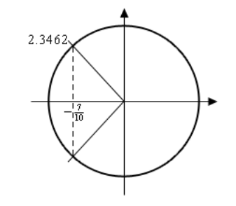

# Section 1.5 Solving Trig Equations With Calculators, Part I

In the previous section we started solving trig equations. The only problem with
the equations we solved in there is that they pretty much all had solutions that
came from a handful of “standard” angles and of course there are many equations
out there that simply don’t. So, in this section we are going to take a look at
some more trig equations, the majority of which will require the use of a
calculator to solve (a couple won’t need a calculator).

The fact that we are using calculators in this section does not however mean
that the problems in the previous section aren’t important. It is going to be
assumed in this section that the basic ideas of solving trig equations are known
and that we don’t need to go back over them here. In particular, it is assumed
that you can use a unit circle to help you find all answers to the equation
(although the process here is a little different as we’ll see) and it is assumed
that you can find answers in a given interval. If you are unfamiliar with these
ideas you should first go to the previous section and go over those problems.

Before proceeding with the problems we need to go over how our calculators work
so that we can get the correct answers. Calculators are great tools but if you
don’t know how they work and how to interpret their answers you can get in
serious trouble.

First, as already pointed out in previous sections, everything we are going to
be doing here will be in radians so make sure that your calculator is set to
radians before attempting the problems in this section. Also, we are going to
use $4$ decimal places of accuracy in the work here. You can use more if you
want, but in this class, we’ll always use at least $4$ decimal places of
accuracy.

Next, and somewhat more importantly, we need to understand how calculators give
answers to inverse trig functions. We didn’t cover inverse trig functions in
this review, but they are just inverse functions and we have talked a little bit
about inverse functions in a review
[section](https://tutorial.math.lamar.edu/Classes/CalcI/InverseFunctions.aspx).
The only real difference is that we are now using trig functions. We’ll only be
looking at three of them and they are:

$$ \text{Inverse Cosine} \quad : \quad \cos^{-1}(x) = \arccos(x) $$

$$ \text{Inverse Sine} \quad : \quad \sin^{-1}(x) = \arcsin(x) $$

$$ \text{Inverse Tangent} \quad : \quad \tan^{-1}(x) = \arctan(x) $$

As shown there are two different notations that are commonly used. In these
notes we’ll be using the first form since it is a little more compact. Most
calculators these days will have buttons on them for these three so make sure
that yours does as well.

We now need to deal with how calculators give answers to these. Let's suppose.
for example, that we wanted our calculator to copute
$\cos^{-1}\left(\dfrac{3}{4}\right)$. First, remember that what the calculator
is computing is the angle, let's say $x$, that we woulud plug into cosine to get
a value of $\dfrac{3}{4}$, or

$$ x = \cos^{-1}\left(\frac{3}{4}\right) \quad \Rightarrow \quad \cos(x) = \frac{3}{4} $$

So, in other words, when we are using our calculator to compute an inverse trig
function we are really solving a simple trig equation.

Having our calculator compute $\cos^{-1}\left(\dfrac{3}{4}\right)$ and hence
solve $\cos(x) = \dfrac{3}{4}$ gives,

$$ x = \cos^{-1}\left(\frac{3}{4}\right) = 0.7227 $$

From the previous section we know that there should in fact be an infinite
number of answers to this including a second angle that is in the interval
$[0,2\pi]$. However, our calculator only gave us a single answer. How to
determine what the other angles are will be covered in the following examples so
we won’t go into detail here about that. We did need to point out however, that
the calculators will only give a single answer and that we’re going to have more
work to do than just plugging a number into a calculator.

Since we know that there are supposed to be an infinite number of solutions to
$\cos(x) = \dfrac{3}{4}$ the next question we should ask then is just how did
the calculator decide to return the answer that it did? Why this one and not one
of the others? Will it give the same answer every time?

There are rules that determine just what answer the calculator gives when
computing inverse trig functions. All calculators will give answers in the
following ranges.

$$ 0 \leq \cos^{-1}(x) \leq \pi \quad -\frac{\pi}{2} \leq \sin^{-1}(x) \leq \frac{\pi}{2} \quad -\frac{\pi}{2} < \tan^{-1}(x) < \frac{\pi}{2} $$

If you think back to the unit circle and recall that we think of cosine as the
horizontal axis then we can see that we’ll cover all possible values of cosine
in the upper half of the circle and this is exactly the range given above for
the inverse cosine. Likewise, since we think of sine as the vertical axis in the
unit circle we can see that we’ll cover all possible values of sine in the right
half of the unit circle and that is the range given above.

For the tangent range look back to the graph of the tangent function itself and
we’ll see that one branch of the tangent is covered in the range given above and
so that is the range we’ll use for inverse tangent. Note as well that we don’t
include the endpoints in the range for inverse tangent since tangent does not
exist there.

So, if we can remember these rules we will be able to determine the remaining
angle in $[0,2\pi]$ that also works for each solution.

As a final quick topic let’s note that it will, on occasion, be useful to
remember the decimal representations of some basic angles. So here they are,

$$ \frac{\pi}{2} = 1.5708 \quad \pi = 3.1416 \quad \frac{3\pi}{2} = 4.7124 \quad 2\pi = 6.2832 $$

Using these we can quickly see that $\cos^{-1}\left(\dfrac{3}{4}\right)$ must be
in the first quadrant since $0.7227$ is between $0$ and $1.5708$. This will be
of great help when we go to determine the remaining angles

So, once again, we can’t stress enough that calculators are great tools that can
be of tremendous help to us, but if you don’t understand how they work you will
often get the answers to problems wrong.

So, with all that out of the way let’s take a look at our first problem.

---

**Example 1** Solve $4\cos(t) = 3 \text{ on } [-8, 10]$.

**Solution**

Okay, the first step here is identical to the problems in the previous section.
We first need to isolate the cosine on one side by itself and then use our
calculator to get the first answer.

$$ \cos(t) = \frac{3}{4} \quad \Rightarrow \quad t = \cos^{-1}\left(\frac{3}{4}\right) = 0.7227 $$

So, this is the one we were using above in the opening discussion of this
section. At the time we mentioned that there were infinite number of answers and
that we’d be seeing how to find them later. Well that time is now.

First, let’s take a quick look at a unit circle for this example.

The angle that we’ve found is shown on the circle as well as the other angle
that we know should also be an answer. Finding this angle here is just as easy
as in the previous section. Since the line segment in the first quadrant forms
an angle of $0.7227$ radians with the positive $x$-axis then so does the line
segment in the fourth quadrant. This means that we can use either $-0.7227$ as
the second angle or $2\pi - 0.7227 = 5.5605$. Which you use depends on which you
prefer. We’ll pretty much always use the positive angle to avoid the possibility
that we’ll lose the minus sign.

So, all possible solutions, ignoring the interval for a second, are then,

$$ t = 0.7227 + 2\pi n \text{, } \quad n = 0, \pm 1, \pm 2, \dots $$

$$ t = 5.5605 + 2\pi n \text{, } \quad n = 0, \pm 1, \pm 2, \dots $$

Now, all we need to do is plug in values of $n$ to determine the angle that are
actually in the interval. Here’s the work for that.

$$ n = -2 \quad \text{ : } \quad t = \xcancel{-11.8437} \quad \text{ and } \quad -7.0059 $$

$$ n = -1 \quad \text{ : } \quad t = t = -5.5605 \quad \text{ and } \quad -0.7227 $$

$$ n = 0 \quad \text{ : } \quad t = t = 0.7227 \quad \text{ and } \quad 5.5605 $$

$$ n = 1 \quad \text{ : } \quad t = t = 7.0059 \quad \text{ and } \quad \xcancel{11.8437} $$

So the solutions to this equation, in the given interval are,

$$ t = -7.0059, -5.5605, -0.7227, 0.7227, 5.5605, 7.0059 $$

Note that we had a choice of angles to use for the second angle in the previous
example. The choice of angles there will also affect the value(s) of $n$ that
we’ll need to use to get all the solutions. In the end, regardless of the angle
chosen, we’ll get the same list of solutions, but the value(s) of $n$ that give
the solutions will be different depending on our choice.

Also, in the above example we put in a little more explanation than we’ll show
in the remaining examples in this section to remind you how these work.

---

**Example 2** Solve $-10\cos(3t) = 7 \text{ on } [-2, 5]$.

Okay, let’s first get the inverse cosine portion of this problem taken care of.

$$ \cos(3t) = -\frac{7}{10} \quad \Rightarrow \quad 3t = \cos^{-1}\left(-\dfrac{7}{10}\right) = 2.3462 $$

Don't forget that we still need the "3"!

Now, let’s look at a quick unit circle for this problem. As we can see the angle
$2.3462$ radians is in the second quadrant and the other angle that we need is
in the third quadrant. We can find this second angle in exactly the same way we
did in the previous example. We can use either $-2.3462$ or we can use
$2\pi - 2.3462 = 3.9370$. As with the previous example we’ll use the positive
choice, but that is purely a matter of preference. You could use the negative if
you wanted to.

So, let's now finish out the problem. First, let's acknowledge that the values
of $3t$ that we need are,

$$ 3t = 2.3462 + 2\pi n \text{, } \quad n = 0, \pm 1, \pm 2, \dots $$

$$ 3t = 3.8370 + 2\pi n \text{, } \quad n = 0, \pm 1, \pm 2, \dots $$

Now, we need to properly deal with the $3$, so divide that out to get all the
solutions to the trig equation.

$$ t = 0.7821 + \frac{2\pi n}{3} \text{, } \quad n = 0, \pm 1, \pm 2, \dots $$

$$ t = 1.3123 + \frac{2\pi n}{3} \text{, } \quad n = 0, \pm 1, \pm 2, \dots $$

Finally, we need to get the values in the given interval.

$$ n = -2 \quad \text{ : } \quad t = \xcancel{-3.4067} \quad \text{ and } \quad \xcancel{-2.8765} $$

$$ n = -1 \quad \text{ : } \quad t = -1.33123 \quad \text{ and } \quad -0.7821 $$

$$ n = 0 \quad \text{ : } \quad t = 0.7821 \quad \text{ and } \quad 1.3123 $$

$$ n = 1 \quad \text{ : } \quad t = 2.8765 \quad \text{ and } \quad 3.4067 $$

$$ n = 2 \quad \text{ : } \quad t = 4.9709 \quad \text{ and } \quad \xcancel{5.5011} $$

The solutions to this equation, in the given interval are then,

$$ t = -1.3123, -0.7821, 0.7821, 1.3123, 2.8765, 3.4067, 4.9709 $$

---

We’ve done a couple of basic problems with cosines, now let’s take a look at how
solving equations with sines work.

---

**Example 3** Solve $6\sin\left(\dfrac{x}{2}\right) = 1 \text{ on } [-20, 30]$

**Solution**

Let’s first get the calculator work out of the way since that isn’t where the
difference comes into play.

$$ \sin\left(\frac{x}{2}\right) = \frac{1}{6} \quad \Rightarrow \quad \frac{x}{2} = \sin^{-1}\left(\frac{1}{6}\right) = 0.1674 $$

Here's a unit circle for this example.

To find the second angle in this case we can notice that the line in the first
quadrant makes an angle of $0.1674$ with the positive $x$-axis and so the angle
in the second quadrant will then make an angle of $0.1674$ with the negative
$x$-axis. So, if we start at the positive $x$-axis we rotate a half revolution
and then back off $0.1674$. Therefore, the angle that we’re after is then,
$\pi - 0.1674 = 2.9742$.

Here’s the rest of the solution for this example. We’re going to assume from
this point on that you can do this work without much explanation.

$$ \frac{x}{2} = 0.1674 + 2\pi n \quad \Rightarrow \quad x = 0.3348 + 4\pi n text{, } \quad n = 0, \pm 1, \pm 2, \dots $$

$$ \frac{x}{2} = 2.9742 + 2\pi n \quad \Rightarrow \quad x = 5.9484 + 4\pi n text{, } \quad n = 0, \pm 1, \pm 2, \dots $$

$$ n = -2 \quad \text{ : } \quad x = \xcancel{-24.7980} \quad \text{ and } \quad -19.1844 $$

$$ n = -1 \quad \text{ : } \quad x = -12.2316 \quad \text{ and } \quad -6.6180 $$

$$ n = 0 \quad \text{ : } \quad x = 0.3348 \quad \text{ and } \quad 5.9484 $$

$$ n = 1 \quad \text{ : } \quad x = 12.9012 \quad \text{ and } \quad 18.5148 $$

$$ n = 2 \quad \text{ : } \quad x = 25.4676 \quad \text{ and } \quad \xcancel{31.0812} $$

The solutions to this equation are then,

$$ x = -19.1844, -12.2316, -6.6180, 0.3348, 5.9484, 12.9012, 18.5148, 25.4676 $$

---

**Example 4** Solve $3\sin(5z) = -2 \text{ on } [0, 1]$.

**Solution**

You should be getting pretty good at these by now, so we won’t be putting much
explanation in for this one. Here we go.

$$ \sin(5z) = -\frac{2}{3} \quad \Rightarrow \quad 5z = \sin^{-1}\left(-\frac{2}{3}\right) = -0.7297 $$

Okay, with this one we're going to do a little more work than the others. For
the first angle we could use the answer our calculator gave us. However, it's
easy to lose minus signs so we'll instead use $2\pi - 0.7297 = 5.5535$. Again,
there is no reason to this other than a worry about losing the minus sign in the
calculator answer. If you'd like to use the calculator answer you are more than
welcome to. For the second angle we'll note that the lines in the third and
fourth quadrant make an angle of $0.7297$ with the $x$-axis. So, if we start at
the positive $x$-axis we rotate a half revoluation and then add on $0.7297$ for
the second angle. Therefore, the second angle is $\pi + 0.7297 = 3.8713$.

Here's the rest of the work for this example.

$$ 5z = 5.5535 + 2\pi n \quad \Rightarrow \quad z = 1.1107 + 2\pi n \text{, } \quad n = 0, \pm 1, \pm 2, \dots $$

$$ 5z = 3.8713 + 2\pi n \quad \Rightarrow \quad z = 0.7743 + 2\pi n \text{, } \quad n = 0, \pm 1, \pm 2, \dots $$

$$ n = -1 \quad \text{ : } \quad x = \xcancel{-0.1460} \quad \text{ and } \quad \xcancel{-0.4823} $$

$$ n = 0 \quad \text{ : } \quad x = \xcancel{1.1107} \quad \text{ and } \quad 0.7743 $$

So, in this case we get a single solution of $0.7743$.

---

Note that in the previous example we only got a single solution. This happens on
occasion so don’t get worried about it. Also, note that it was the second angle
that gave this solution and so if we’d just relied on our calculator without
worrying about other angles we would not have gotten this solution. Again, it
can’t be stressed enough that while calculators are a great tool if we don’t
understand how to correctly interpret/use the result we can (and often will) get
the solution wrong.

To this point we’ve only worked examples involving sine and cosine. Let’s now
work a couple of examples that involve other trig functions to see how they
work.

---

**Example 5** Solve $9\sin(2x) = -5\cos(2x) \text{ on } [-10, 0]$.

**Solution**

At first glance this problem seems to be at odds with the sentence preceding the
example. However, it really isn’t.

First, when we have more than one trig function in an equation we need a way to
get equations that only involve one trig function. There are many ways of doing
this that depend on the type of equation we’re starting with. In this case we
can simply divide both sides by a cosine and we’ll get a single tangent in the
equation. We can now see that this really is an equation that doesn’t involve a
sine or a cosine.

So, let’s get started on this example.

$$ \frac{\sin(2x)}{\cos(2x)} = \tan(2x) = -\frac{5}{9} \quad \Rightarrow \quad 2x = \tan^{-1}\left(-\frac{5}{9}\right) = -0.5071 $$

Now, the unit circle doesn't involve tangents, however we can use it to
illustrate the second angle int he range $[0, 2\pi]$.

The angles that we’re looking for here are those whose quotient of
$\dfrac{\text{sine}}{\text{cosine}}$ is the same. The second angle where we will
get the same value of tangent will be exactly opposite of the given point. For
this angle the values of sine and cosine are the same except they will have
opposite signs. In the quotient however, the difference in signs will cancel out
and we’ll get the same value of tangent. So, the second angle will always be the
first angle plus $\pi$.

Before getting the second angle let’s also note that, like the previous example,
we’ll use the $2\pi - 0.5071 = 5.7761$ for the first angle. Again, this is only
because of a concern about losing track of the minus sign in our calculator
answer. We could just as easily do the work with the original angle our
calculator gave us.

Now, this is where it seems like we’re just randomly making changes and doing
things for no reason. The second angle that we’re going to use is,

$$ \pi + (-0.5071) = \pi -0.5071 = 2.6345 $$

The fact that we used the calculator answer here seems to contradict the fact
that we used a different angle for the first above. The reason for doing this
here is to give a second angle that is in the range $[0,2\pi]$. Had we used
$5.7761$ to find the second angle we’d get $\pi + 5.7761 = 8.9177$. This is a
perfectly acceptable answer; however, it is larger than $2\pi$ (which is
$6.2832$) and the general rule of thumb is to keep the initial angles as small
as possible.

Here are all the solutions to the equation.

$$ 2x = 5.7761 + 2\pi n \quad \Rightarrow \quad x = 2.8881 + \pi n \text{, } \quad n = 0, \pm 1, \pm 2, \dots $$

$$ 2x = 2.6345 + 2\pi n \quad \Rightarrow \quad x = 1.3173 + \pi n \text{, } \quad n = 0, \pm 1, \pm 2, \dots $$

$$ n = -4 \quad \text{ : } \quad x = -9.6783 \quad \text{ and } \quad \xcancel{-11.2491} $$

$$ n = -3 \quad \text{ : } \quad x = -6.5367 \quad \text{ and } \quad -8.1075 $$

$$ n = -2 \quad \text{ : } \quad x = -3.3951 \quad \text{ and } \quad -4.9659 $$

$$ n = -1 \quad \text{ : } \quad x = -0.2535 \quad \text{ and } \quad -1.8243 $$

$$ n = 0 \quad \text{ : } \quad \xcancel{x = 2.8881} \quad \text{ and } \quad \xcancel{1.3173} $$

The seven solutions to this equation are then,

$$ -0.2535, -1.8243, -3.3951, -4.9659, -6.5367, -8.1075, -9.6783 $$

Note as well that we didn't need to do the $n = 0$ computation since we could
see from the given interval taht we only wanted negative answers and these would
clearly give positive answers.

---

Before moving on we need to address one issue about the previous example. The
solution method used there is not the “standard” solution method. Because the
second angle is just $\pi$ plus the first and if we added $\pi$ onto the second
angle we’d be back at the line representing the first angle. The more standard
solution method is to just add $\pi n$ onto the first angle.

If using the calculator answer this would give,

$$ 2x = -0.5071 + \pi n \text{, } \quad n = 0, \pm 1, \pm 2, \dots $$

If using the positive angle corresponding to the calculator answer this would
give,

$$ 2x = 5.7761 + \pi n \text{, } \quad n = 0, \pm 1, \pm 2, \dots $$

Then dividing by $2$ either of the following sets of solutions,

$$ x = -0.2535 + \frac{\pi n}{2} \text{, } \quad n = 0, \pm 1, \pm 2, \dots $$

$$ x = 2.8881 + \frac{\pi n}{2} \text{, } \quad n = 0, \pm 1, \pm 2, \dots $$

Either of these sets of solutions is identical to the set of solutions we got in
the example (we’ll leave it to you to plug in some $n$'s and verify that). So,
why did we not use the method in the previous example? Simple. The method in the
previous example more closely mirrors the solution method for cosine and sine
(_i.e._ they both, generally, give two sets of angles) and so for students that
aren’t comfortable with solving trig equations this gives a “consistent”
solution method.

Many calculators today can only do inverse sine, inverse cosine, and inverse
tangent. So, let’s see an example that uses one of the other trig functions.

---

**Example 6** Solve $7\sec(3t) = -10$.

We'll start this one in exactly the same way we've done all the others.

$$ \sec(3t) = -\frac{10}{7} \quad \Rightarrow \quad 3t = \sec^{-1}\left(-\frac{10}{7}\right) $$

Now we reach the problem. As noted above, many calculators can’t handle inverse
secant so we’re going to need a different solution method for this one. To
finish the solution here we’ll simply recall the definition of secant in terms
of cosine and convert this into an equation involving cosine instead and we
already know how to solve those kinds of trig equations.

$$ \frac{1}{\cos(3t)} = \sec(3t) = -\frac{10}{7} \quad \Rightarrow \quad \cos(3t) = -\frac{7}{10} $$

Now, we solved this equation in the second example above so we won’t redo our
work here. The solution is,

$$ t = 0.7821 + \frac{2\pi n}{3} \text{, } \quad n = 0, \pm 1, \pm 2, \dots $$

$$ t = 1.3123 + \frac{2\pi n}{3} \text{, } \quad n = 0, \pm 1, \pm 2, \dots $$

We weren't given an interval in this problem so there is nothing else to do
here.

---

For the remainder of the examples in this section we’re not going to be finding
solutions in an interval to save some space. If you followed the work from the
first few examples in which we were given intervals you should be able to do any
of the remaining examples if given an interval.

Also, we will no longer be including sketches of unit circles in the remaining
solutions. We are going to assume that you can use the above sketches as guides
for sketching unit circles to verify the claims in the following examples.

The next three examples don’t require a calculator but are important enough or
cause enough problems for students to include in this section in case you run
across them and haven’t seen them anywhere else.

---

**Example 7** Solve $\cos(4\theta) = -1$.

**Solution**

There really isn’t too much to do with this problem. It is, however, different
from all the others done to this point. All the others done to this point have
had two angles in the interval $[0,2\pi]$ that were solutions to the equation.
This only has one. If you aren’t sure you believe this sketch a quick unit
circle and you’ll see that in fact there is only one angle for which cosine is
$-1$.

Here is the solution to this equation.

$$ 4\theta = \pi + 2\pi n \quad \Rightarrow \quad \theta = \frac{\pi}{4} + \frac{\pi n}{2} \text{, } \quad n = 0, \pm 1, \pm 2, \dots $$

---

**Example 8** Solve $\sin\left(\dfrac{\alpha}{7}\right) = 0$.

**Solution**

Again, not much to this problem. Using a unit circle it isn’t too hard to see
that the solutions to this equation are,

$$ \frac{\alpha}{7} = 0 + 2\pi n \quad \Rightarrow \quad \alpha = 14\pi n \text{, } \quad n = 0, \pm 1, \pm 2, \dots $$

$$ \frac{\alpha}{7} = \pi + 2\pi n \quad \Rightarrow \quad \alpha = 7\pi + 14\pi n \text{, } \quad n = 0, \pm 1, \pm 2, \dots $$

---

This next example has an important point that needs to be understood when
solving some trig equations.

---

**Example 9** Solve $\sin(3t) = 2$.

**Solution**

This example is designed to remind you of certain properties about sine and
cosine. Recall that $-1 \leq \sin(\theta) \leq 1$ and
$-1 \leq \cos(\theta) \leq 1$. Therefore, since sine will never be greater than
$1$ it definitely can't be $2$. So, **THERE ARE NO SOLUTIONS** to this equation!

It is important to remember that not all trig equations will have solutions.

---

Because this document is also being prepared for viewing on the web we’re going
to split this section in two in order to keep the page size (and hence load time
in a browser) to a minimum. In the next section we’re going to take a look at
some slightly more “complicated” equations. Although, as you’ll see, they aren’t
as complicated as they may at first seem.

---

## Practice Problems

Find the solution(s) to the following equations. If an interval is given find
only those solutions that are in the interval. If no interval is given find all
solutions to the equation. These will require the use of a calculator so use at
least $4$ decimal places in your work.

**1.** $7\cos(4x) + 11 = 10$

**Solution**

$$ 7\cos(4x) + 11 = 10 $$

$$ 7\cos(4x) = -1 $$

$$ \cos(4x) = -\frac{1}{7} $$

$$ \cos^{-1}\left(-\frac{1}{7}\right) = 4x $$

$$ 4x = 1.7141 $$

From $[0, 2\pi]$, Quadrants II and III.

Second Angle:

$$ 2\pi - 1.7141 = 4.5691 $$

$$ 4x = 1.7141 + 2\pi n \text{, } \quad n = 0, \pm 1, \pm 2, \dots $$

$$ 4x = 4.5691 + 2\pi n \text{, } \quad n = 0, \pm 1, \pm 2, \dots $$

$$ \boxed{x = 0.4285 + \frac{\pi n}{2} \text{, } \quad n = 0, \pm 1, \pm 2, \dots} $$

$$ \boxed{x = 1.1423 + \frac{\pi n}{2} \text{, } \quad n = 0, \pm 1, \pm 2, \dots} $$

**2.** $6 + 5\cos\left(\dfrac{x}{3}\right) = 10 \text{ in } [0, 38]$

**Solution**

$$ 6 + 5\cos\left(\dfrac{x}{3}\right) = 10 $$

$$ 5\cos\left(\dfrac{x}{3}\right) = 4 $$

$$ \cos\left(\dfrac{x}{3}\right) = \frac{4}{5} $$

$$ \cos^{-1}\left(\frac{4}{5}\right) = \frac{x}{3} $$

$$ \frac{x}{3} = 0.6435 $$

Quadrants I and IV.

Second Angle:

$$ 2\pi - 0.6435 = 5.6397 $$

$$ \frac{x}{3} = 0.6435 + 2\pi n \text{, } \quad n = 0, \pm 1, \pm 2, \dots $$

$$ \frac{x}{3} = 5.6397 + 2\pi n \text{, } \quad n = 0, \pm 1, \pm 2, \dots $$

$$ x = 1.9305 + 18.8496n \text{, } \quad n = 0, \pm 1, \pm 2, \dots $$

$$ x = 16.9191 + 18.8496n \text{, } \quad n = 0, \pm 1, \pm 2, \dots $$

$$ n = 0 \quad \text{ : } \quad x = \boxed{1.9305} \quad \text{ and } \boxed{16.9191} \quad $$

$$ n = 1 \quad \text{ : } \quad x = \boxed{20.7801} \quad \text{ and } \boxed{35.7687} \quad $$

$$ n = 2 \quad \text{ : } \quad x = \xcancel{39.6297} \quad \text{ and } \xcancel{54.6183} \quad $$

Answer:

$$ \boxed{x = 1.9305, 16.9191, 20.7801, 35.7687} $$

**3.** $3 = 6 - 11\sin\left(\dfrac{t}{8}\right)$

**Solution**

$$ 3 = 6 - 11\sin\left(\dfrac{t}{8}\right) $$

$$ -3 = -11\sin\left(\dfrac{t}{8}\right) $$

$$ \frac{3}{11} = \sin\left(\dfrac{t}{8}\right) $$

$$ \sin^{-1}\left(\frac{3}{11}\right) = \frac{t}{8} $$

$$ \frac{t}{8} = 0.2762 $$

Quadrant I and II.

Second angle:

$$ \pi - 0.2762 = 2.8654 $$

$$ \frac{t}{8} = 0.2762 + 2\pi n \text{, } \quad n = 0, \pm 1, \pm 2, \dots $$

$$ \frac{t}{8} = 2.8654 + 2\pi n \text{, } \quad n = 0, \pm 1, \pm 2, \dots $$

$$ \boxed{t = 2.2096 + 16\pi n \text{, } \quad n = 0, \pm 1, \pm 2, \dots} $$

$$ \boxed{t = 22.9232 + 16\pi n \text{, } \quad n = 0, \pm 1, \pm 2, \dots} $$

**4.** $4\sin(6z) + \dfrac{13}{10} = -\dfrac{3}{10} \text{ in } [0, 2]$

**Solution**

$$ 4\sin(6z) + \dfrac{13}{10} = -\dfrac{3}{10} $$

$$ 4\sin(6z) = -\dfrac{16}{10} $$

$$ \sin(6z) = -\dfrac{16}{40} $$

$$ \sin(6z) = -\dfrac{2}{5} $$

$$ \sin^{-1}\left(-\frac{2}{5}\right) = 6z $$

$$ 6z = -0.4115 $$

Quadrant III and IV.

Find positive of first angle:

$$ 2\pi + (-0.4115) = 5.8717 $$

Find second angle:

$$ \pi + 0.4115 = 3.5531 $

$$ 6z = 3.5531 + 6.2832n \text{, } \quad n = 0, \pm 1, \pm 2, \dots $$

$$ 6z = 5.8717 + 6.2832n \text{, } \quad n = 0, \pm 1, \pm 2, \dots $$

$$ z = 0.5922 + 1.0472n \text{, } \quad n = 0, \pm 1, \pm 2, \dots $$

$$ z = 0.9786 + 1.0472n \text{, } \quad n = 0, \pm 1, \pm 2, \dots $$

$$ n = 0 \quad \text{ : } \quad z = \boxed{0.5922} \quad \text{ and } \boxed{0.9786} \quad $$

$$ n = 1 \quad \text{ : } \quad z = \boxed{1.6394} \quad \text{ and } \xcancel{2.0258} \quad $$

$$ n = 2 \quad \text{ : } \quad z = \xcancel{2.6866} \quad \text{ and } \xcancel{3.073} \quad $$

Answer:

$$ \boxed{0.5922, 0.9786, 1.6394} $$

**5.**
$9\cos\left(\dfrac{4z}{9}\right) + 21\sin\left(\dfrac{4z}{9}\right) = 0 \text{ in } [-10, 10]$

**Solution**

$$ 9\cos\left(\dfrac{4z}{9}\right) + 21\sin\left(\dfrac{4z}{9}\right) = 0 $$

$$ 9\cos\left(\dfrac{4z}{9}\right) = -21\sin\left(\dfrac{4z}{9}\right) $$

$$ 1 = \frac{-21\sin\left(\dfrac{4z}{9}\right)}{9\cos\left(\dfrac{4z}{9}\right)} $$

$$ \frac{\sin\left(\dfrac{4z}{9}\right)}{\cos\left(\dfrac{4z}{9}\right)} = -\frac{9}{21} $$

$$ \tan\left(\frac{4z}{9}\right) = -\frac{9}{21} $$

$$ \tan^{-1}\left(-\frac{9}{21}\right) = \frac{4z}{9} $$

$$ \frac{4z}{9} = -0.4049 $$

Quandrants II and IV.

Find positive first angle:

$$ 2\pi - 0.4049 = 5.8783 $$

Find second angle

$$ (2\pi - 0.4049) - \pi = 2.7367 $$

$$ \frac{4z}{9} = 2.7367 + 2\pi n \text{, } \quad n = 0, \pm 1, \pm 2 $$

$$ \frac{4z}{9} = 5.8783 + 2\pi n \text{, } \quad n = 0, \pm 1, \pm 2 $$

$$ 4z = 24.6303 + 56.5488n \text{, } \quad n = 0, \pm 1, \pm 2 $$

$$ 4z = 52.9047 + 56.5488n \text{, } \quad n = 0, \pm 1, \pm 2 $$

$$ z = 6.1576 + 14.1372n \text{, } \quad n = 0, \pm 1, \pm 2 $$

$$ z = 13.2262 + 14.1372n \text{, } \quad n = 0, \pm 1, \pm 2 $$

$$ n = -2 \quad \text{ : } \quad z = \xcancel{-22.1168} \quad \text{ and } \xcancel{-15.0482} \quad $$

$$ n = -1 \quad \text{ : } \quad z = \boxed{-7.9796} \quad \text{ and } \boxed{-0.9110} \quad $$

$$ n = 0 \quad \text{ : } \quad z = \boxed{6.1576} \quad \text{ and } \xcancel{13.2262} \quad $$

$$ n = 1 \quad \text{ : } \quad z = \xcancel{20.2948} \quad \text{ and } \xcancel{27.3634} \quad $$

Answer:

$$ \boxed{-7.9796, -0.9110, 6.1576} $$

**6.**
$3\tan\left(\dfrac{w}{4}\right) - 1 = 11 - 2\tan\left(\dfrac{w}{4}\right) \text{ in } [-50, 0]$

**Solution**

$$ 3\tan\left(\dfrac{w}{4}\right) - 1 = 11 - 2\tan\left(\dfrac{w}{4}\right) $$

$$ 5\tan\left(\dfrac{w}{4}\right) = 12 $$

$$ \tan\left(\dfrac{w}{4}\right) = \frac{12}{5} $$

$$ \tan^{-1}\left(\frac{12}{5}\right) = \frac{w}{4} $$

$$ \frac{w}{4} = 1.1760 $$

Quadrants I and III.

Second angle:

$$ \pi + 1.1760 = 4.3176 $$

$$ \frac{w}{4} = 1.1760 + 2\pi n \text{, } \quad n = 0, \pm 1, \pm 2, \dots $$

$$ \frac{w}{4} = 4.3176 + 2\pi n \text{, } \quad n = 0, \pm 1, \pm 2, \dots $$

$$ w = 4.7040 + 25.1328n \text{, } \quad n = 0, \pm 1, \pm 2, \dots $$

$$ w = 17.2704 + 25.1328n \text{, } \quad n = 0, \pm 1, \pm 2, \dots $$

$$ n = -3 \quad \text{ : } \quad w = \xcancel{-70.6944} \quad \text{ and } \xcancel{-58.1280} \quad $$

$$ n = -2 \quad \text{ : } \quad w = \boxed{-45.5616} \quad \text{ and } \boxed{-32.9952} \quad $$

$$ n = -1 \quad \text{ : } \quad w = \boxed{-20.4288} \quad \text{ and } \boxed{-7.8624} \quad $$

Answer:

$$ \boxed{-45.5616,  -32.9952, -20.4288, -7.8624} $$

**7.** $17 - 3\sec\left(\dfrac{z}{2}\right) = 2 \text{ in } [20, 45]$

**Solution**

$$ 17 - 3\sec\left(\dfrac{z}{2}\right) = 2 $$

$$ -3\sec\left(\dfrac{z}{2}\right) = -15 $$

$$ \sec\left(\dfrac{z}{2}\right) = 5 $$

$$ \cos\left(\frac{z}{2}\right) = \frac{1}{5} $$

$$ \cos^{-1}\left(\frac{1}{5}\right) = \frac{z}{2} $$

Quadrants I and IV.

$$ \frac{z}{2} = 1.3694 $$

Second angle:

$$ 2\pi - 1.3694 = 4.9138 $$

$$ \frac{z}{2} = 1.3694 + 2\pi n \text{, } \quad n = 0, \pm 1, \pm 2, \dots $$

$$ \frac{z}{2} = 4.9138 + 2\pi n \text{, } \quad n = 0, \pm 1, \pm 2, \dots $$

$$ z = 2.7388 + 12.5664n \text{, } \quad n = 0, \pm 1, \pm 2, \dots $$

$$ z = 9.8276 + 12.5664n \text{, } \quad n = 0, \pm 1, \pm 2, \dots $$

$$ n = 1 \quad \text{ : } \quad w = \xcancel{15.3052} \quad \text{ and } \boxed{22.3940} \quad $$

$$ n = 2 \quad \text{ : } \quad w = \boxed{27.8716} \quad \text{ and } \boxed{34.9604} \quad $$

$$ n = 3 \quad \text{ : } \quad w = \boxed{40.4380} \quad \text{ and } \xcancel{47.5268} \quad $$

$$ n = 4 \quad \text{ : } \quad w = \xcancel{53.0044} \quad \text{ and } \xcancel{60.0932} \quad $$

Answer:

$$ \boxed{22.3940, 27.8716, 34.9604, 40.4380} $$

**8.**
$12\sin(7y) + 11 = 3 + 4\sin(7y) \text{ in } \left[-2, -\dfrac{1}{2}\right]$

**Solution**

$$ 8\sin(7y) = -8 $$

$$ \sin(7y) = -1 $$

Only one angle ($\dfrac{3\pi}{2}$).

$$ \sin{-1}(-1) = 7y $$

$$ 7y = -1.5708 $$

Find positive value of angle:

$$ 2\pi - 1.5708 = 4.7124 $$

$$ 7y = 4.7124 + 2\pi n \text{, } \quad n = 0, \pm 1, \pm 2, \dots $$

$$ y = 0.6732 + 0.8976n \text{, } \quad n = 0, \pm 1, \pm 2, \dots $$

$$ n = -1 \quad \text{ : } \quad y = \xcancel{-0.2244} $$

$$ n = -2 \quad \text{ : } \quad y = \boxed{-1.1220} $$

$$ n = -3 \quad \text{ : } \quad y = \xcancel{-2.0196} $$

Answer:

$$ \boxed{-1.1220} $$

**9.** $5 - 14\tan(8x) = 30 \text{ in } [-1, 1]$

**Solution**

$$ 5 - 14\tan(8x) = 30 $$

$$ -14\tan(8x) = 25 $$

$$ \tan(8x) = -\frac{25}{14} $$

Quadrant II and IV

$$ \tan^{-1}\left(-\frac{25}{14}\right) = 8x $$

$$ 8x = -1.0603 $$

Positive of first angle:

$$ 2\pi - 1.0603 = 5.2229 $$

Second Angle:

$$ (2\pi - 1.0603) - \pi = 2.0813 $$

$$ 8x = 2.0813 + 2\pi n \text{, } \quad n = 0, \pm 1, \pm 2, \dots $$

$$ 8x = 5.2229 + 2\pi n \text{, } \quad n = 0, \pm 1, \pm 2, \dots $$

$$ x = 0.2602 + 0.7854n \text{, } \quad n = 0, \pm 1, \pm 2, \dots $$

$$ x = 0.6529 + 0.7854n \text{, } \quad n = 0, \pm 1, \pm 2, \dots $$

$$ n = -3 \quad \text{ : } \quad x = \xcancel{-2.096} \quad \text{ and } \xcancel{-1.7033} \quad $$

$$ n = -2 \quad \text{ : } \quad x = \xcancel{-1.3106} \quad \text{ and } \boxed{-0.9179} \quad $$

$$ n = -1 \quad \text{ : } \quad x = \boxed{-0.5252} \quad \text{ and } \boxed{-0.1325} \quad $$

$$ n = 0 \quad \text{ : } \quad x = \boxed{0.2602} \quad \text{ and } \boxed{0.6529} \quad $$

$$ n = 1 \quad \text{ : } \quad x = \xcancel{1.0456} \quad \text{ and } \xcancel{1.4383} \quad $$

Answers:

$$ \boxed{-0.9179, -0.5252, -0.1325, 0.2602, 0.6529} $$

**10.** $0 = 18 + 2\csc\left(\dfrac{t}{3}\right) \text{ in } [0, 5]$

**Solution**

$$ 0 = 18 + 2\csc\left(\dfrac{t}{3}\right) $$

$$ 2\csc\left(\dfrac{t}{3}\right) = -18 $$

$$ \csc\left(\dfrac{t}{3}\right) = -9 $$

$$ \sin\left(\dfrac{t}{3}\right) = -\frac{1}{9} $$

Quadrants III and IV

$$ \sin^{-1}\left(-\frac{1}{9}\right) = \frac{t}{3} $$

$$ \frac{t}{3} = -0.1113 $$

Positive first angle:

$$ 2\pi - 0.1113 = 6.1719 $$

Second angle:

$$ \pi + 0.1113 = 3.2529 $$

$$ \frac{t}{3} = 3.2529 + 2\pi n \text{, } \quad n = 0, \pm 1, \pm 2, \dots $$

$$ \frac{t}{3} = 6.1719 + 2\pi n \text{, } \quad n = 0, \pm 1, \pm 2, \dots $$

$$ t = 9.7587 + 18.8496n \text{, } \quad n = 0, \pm 1, \pm 2, \dots $$

$$ t = 18.5157 + 18.8496n \text{, } \quad n = 0, \pm 1, \pm 2, \dots $$

Answer:

$$ \boxed{\text{NO SOLUTION IN INTERVAL}} $$

**11.**
$\dfrac{1}{2}\cos\left(\dfrac{x}{8}\right) + \dfrac{1}{4} = \dfrac{2}{3} \text{ in } [0, 100]$

**Solution**

$$ \dfrac{1}{2}\cos\left(\dfrac{x}{8}\right) + \dfrac{1}{4} = \dfrac{2}{3} $$

$$ \frac{1}{2}\cos\left(\frac{x}{8}\right) = \frac{5}{12} $$

$$ \cos\left(\frac{x}{8}\right) = \frac{5}{6} $$

Quadrants I and IV.

$$ \cos^{-1}\left(\frac{5}{6}\right) = \frac{x}{8} $$

$$ \frac{x}{8} = 0.5857 $$

Second angle:

$$ 2\pi - 0.5857 = 5.6975 $$

$$ \frac{x}{8} = 0.5857 + 2\pi n \text{, } \quad n = 0, \pm 1, \pm 2, \dots $$

$$ \frac{x}{8} = 5.6975 + 2\pi n \text{, } \quad n = 0, \pm 1, \pm 2, \dots $$

$$ x = 4.6856 + 50.2656n \text{, } \quad n = 0, \pm 1, \pm 2, \dots $$

$$ x = 45.5800 + 50.2656n \text{, } \quad n = 0, \pm 1, \pm 2, \dots $$

$$ n = 0 \quad \text{ : } \quad x = \boxed{4.6856} \quad \text{ and } \boxed{45.5800} \quad $$

$$ n = 1 \quad \text{ : } \quad x = \boxed{54.9512} \quad \text{ and } \boxed{95.8456} \quad $$

$$ n = 2 \quad \text{ : } \quad x = \xcancel{105.2168} \quad \text{ and } \xcancel{146.1112} \quad $$

Answer:

$$ \boxed{4.6856, 45.5800, 54.9512, 95.8456} $$

**12.** $\dfrac{4}{3} = 1 + 3\sec(2t) \text{ in } [-4. 6]$

**Solution**

$$ \dfrac{4}{3} = 1 + 3\sec(2t) $$

$$ \dfrac{1}{3} = 3\sec(2t) $$

$$ \dfrac{1}{9} = \sec(2t) $$

$$ \cos(2t) = 9 $$

$$ -1 \leq \cos\theta \leq 1 $$

$$ \cos(2t) > 1 $$

Answer:

$$ \boxed{\text{NO SOLUTION}} $$

---

## Assignment Problems

Find the solution(s) to the following equations. If an interval is given find
only those solutions that are in the interval. If no interval is given find all
solutions to the equation.

**1.** $2 - 14\sin\left(\dfrac{t}{3}\right) = 5$

**Solution**

$$ 2 - 14\sin\left(\dfrac{t}{3}\right) = 5 $$

$$ -14\sin\left(\dfrac{t}{3}\right) = 3 $$

$$ \sin\left(\dfrac{t}{3}\right) = -\frac{3}{14} $$

Quadrants III and IV.

$$ \sin^{-1}\left(-\frac{3}{14}\right) = \frac{t}{3} $$

$$ \frac{t}{3} = -0.2160 $$

Find positive of first angle:

$$ 2\pi - 0.2160 = 6.0672 $$

Find second angle:

$$ \pi + 0.2160 = 3.3576 $$

$$ \frac{t}{3} = 3.3576 + 2\pi n \text{, } n = 0, \pm 1, \pm 2, \dots $$

$$ \frac{t}{3} = 6.0672 + 2\pi n \text{, } n = 0, \pm 1, \pm 2, \dots $$

Answer:

$$ \boxed{t = 10.0728 + 18.8496n \text{, } n = 0, \pm 1, \pm 2, \dots} $$

$$ \boxed{t = 18.2016 + 18.8496n \text{, } n = 0, \pm 1, \pm 2, \dots} $$

**2.** $4\cos(4x) + 8 = 10 - \cos(4x)$

**Solution**

$$ 4\cos(4x) + 8 = 10 - \cos(4x) $$

$$ 5\cos(4x) = 2 $$

$$ \cos(4x) = \frac{2}{5} $$

Quadrants I and IV.

$$ \cos^{-1}\left(\frac{2}{5}\right) = 4x $$

$$ 4x = 1.1593 $$

Second angle:

$$ 2\pi - 1.1593 = 5.1239 $$

$$ 4x = 1.1593 + 2\pi n \text{, } \quad n = 0, \pm 1, \pm 2, \dots $$

$$ 4x = 5.1239 + 2\pi n \text{, } \quad n = 0, \pm 1, \pm 2, \dots $$

Answers:

$$ \boxed{x = 0.2898 + 1.5708n \text{, } \quad n = 0, \pm 1, \pm 2, \dots} $$

$$ \boxed{x = 1.2810 + 1.5708n \text{, } \quad n = 0, \pm 1, \pm 2, \dots} $$

**3.** $2\tan(3w) + 3 = 25$

**Solution**

$$ 2\tan(3w) + 3 = 25 $$

$$ 2\tan(3w) = 22 $$

$$ \tan(3w) = 11 $$

Quadrants I and III.

$$ \tan^{-1}(11) = 3w $$

$$ 3w = 1.4801 $$

Second Angle:

$$ \pi + 1.4801 = 4.6217 $$

$$ 3w = 1.4801 + \pi n \text{, } \quad n = 0, \pm 1, \pm 2, \dots $$

$$ 3w = 4.6217 + \pi n \text{, } \quad n = 0, \pm 1, \pm 2, \dots $$

Answers:

$$ \boxed{w = 0.4934 + 1.0472n \text{, } \quad n = 0, \pm 1, \pm 2, \dots} $$

$$ \boxed{w = 1.5406 + 1.0472n \text{, } \quad n = 0, \pm 1, \pm 2, \dots} $$

**4.**
$2\sin\left(\dfrac{3x}{5}\right) - \dfrac{7}{5} = \dfrac{1}{5} \text{ in } [0, 15]$

**Solution**

$$ 2\sin\left(\dfrac{3x}{5}\right) - \dfrac{7}{5} = \dfrac{1}{5} $$

$$ 2\sin\left(\dfrac{3x}{5}\right) = \dfrac{8}{5} $$

$$ \sin\left(\dfrac{3x}{5}\right) = \dfrac{4}{5} $$

Quadrants I and II.

$$ \sin^{-1}\left(\frac{4}{5}\right) = \frac{3x}{5} $$

$$ \frac{3x}{5} = 0.9273 $$

Second Angle:

$$ \pi - 0.9273 = 2.2143 $$

$$ \frac{3x}{5} = 0.9273 + 2\pi n \text{, } \quad n = 0, \pm 1, \pm 2, \dots $$

$$ \frac{3x}{5} = 2.2143 + 2\pi n \text{, } \quad n = 0, \pm 1, \pm 2, \dots $$

$$ 3x = 4.6365 + 31.4160n \text{, } \quad n = 0, \pm 1, \pm 2, \dots $$

$$ 3x = 11.0715 + 31.4160n \text{, } \quad n = 0, \pm 1, \pm 2, \dots $$

$$ x = 1.5455 + 10.4720n \text{, } \quad n = 0, \pm 1, \pm 2, \dots $$

$$ x = 3.6905 + 10.4720n \text{, } \quad n = 0, \pm 1, \pm 2, \dots $$

$$ n = 0 \quad \text{ : } \quad x = \boxed{1.5455} \quad \text{ and } \boxed{3.6905} \quad $$

$$ n = 1 \quad \text{ : } \quad x = \boxed{12.0175} \quad \text{ and } \boxed{14.1625} \quad $$

$$ n = 2 \quad \text{ : } \quad x = \xcancel{22.4895} \quad \text{ and } \xcancel{24.6345} \quad $$

Answers:

$$ \boxed{1.5455, 3.6905, 12.0175, 14.1625} $$

**5.** $1 = 3 + 8\cos\left(\dfrac{w}{2}\right) \text{ in } [-20, 5]$

**Solution**

$$ 1 = 3 + 8\cos\left(\dfrac{w}{2}\right) $$

$$ -2 = 8\cos\left(\dfrac{w}{2}\right) $$

$$ \cos\left(\dfrac{w}{2}\right) = -\frac{1}{4} $$

Quadrants II and III.

$$ \cos^{-1}\left(-\frac{1}{4}\right) = \frac{w}{2} $$

$$ \frac{w}{2} = 1.8235 $$

Second Angle:

$$ 2\pi - 1.8235 = 4.4597 $$

$$ \frac{w}{2} = 1.8235 + 2\pi n \text{, } \quad n = 0, \pm 1, \pm 2, \dots $$

$$ \frac{w}{2} = 4.4597 + 2\pi n \text{, } \quad n = 0, \pm 1, \pm 2, \dots $$

$$ w = 3.6470 + 12.5664n \text{, } \quad n = 0, \pm 1, \pm 2, \dots $$

$$ w = 8.9194 + 12.5664n \text{, } \quad n = 0, \pm 1, \pm 2, \dots $$

$$ n = -3 \quad \text{ : } \quad w = \xcancel{-34.0522} \quad \text{ and } \xcancel{-28.7798} \quad $$

$$ n = -2 \quad \text{ : } \quad w = \xcancel{-21.4858} \quad \text{ and } \boxed{-16.2134} \quad $$

$$ n = -1 \quad \text{ : } \quad w = \boxed{-8.9194} \quad \text{ and } \boxed{-3.6470} \quad $$

$$ n = 0 \quad \text{ : } \quad w = \boxed{3.6470} \quad \text{ and } \xcancel{8.9194} \quad $$

$$ n = 1 \quad \text{ : } \quad w = \xcancel{16.2134} \quad \text{ and } \xcancel{21.4858} \quad $$

Answers:

$$ \boxed{-16.2134, -8.9194, -3.6470, 3.6470} $$

**6.**
$45\sin\left(\dfrac{x}{2}\right) - 9 = 7\sin\left(\dfrac{x}{2}\right) + 17 \text{ in } [-10, 20]$

**Solution**

$$ 45\sin\left(\dfrac{x}{2}\right) - 9 = 7\sin\left(\dfrac{x}{2}\right) + 17 $$

$$ 38\sin\left(\dfrac{x}{2}\right) = 26 $$

$$ \sin\left(\dfrac{x}{2}\right) = \frac{13}{19} $$

Quadrants I and II.

$$ \sin^{-1}\left(\frac{13}{19}\right) = \frac{x}{2} $$

$$ \frac{x}{2} = 0.7535 $$

Second angle:

$$ \pi - 0.7535 = 2.3881  $$

$$ \frac{x}{2} = 0.7535 + 2\pi n \text{, } \quad n = 0, \pm 1, \pm 2, \dots $$

$$ \frac{x}{2} = 2.3881 + 2\pi n \text{, } \quad n = 0, \pm 1, \pm 2, \dots $$

$$ x = 1.5070 + 12.5664n \text{, } \quad n = 0, \pm 1, \pm 2, \dots $$

$$ x = 4.7762 + 12.5664n \text{, } \quad n = 0, \pm 1, \pm 2, \dots $$

$$ n = -2 \quad \text{ : } \quad x = \xcancel{-23.6258} \quad \text{ and } \xcancel{-20.3566} \quad $$

$$ n = -1 \quad \text{ : } \quad x = \xcancel{-11.0594} \quad \text{ and } \boxed{-7.7902} \quad $$

$$ n = 0 \quad \text{ : } \quad x = \boxed{1.5070} \quad \text{ and } \boxed{4.7762} \quad $$

$$ n = 1 \quad \text{ : } \quad x = \boxed{14.0734} \quad \text{ and } \boxed{17.3426} \quad $$

$$ n = 2 \quad \text{ : } \quad x = \xcancel{26.6390} \quad \text{ and } \xcancel{29.9090} \quad $$

Answers:

$$ \boxed{-7.7902, 1.5070, 4.7762, 14.0734, 17.3426} $$

**7.** $\dfrac{2}{3} = 4 - 3\sec(11x) \text{ in } [0, 1]$

**Solution**

$$ \dfrac{2}{3} = 4 - 3\sec(11x) $$

$$ -\dfrac{10}{3} = -3\sec(11x) $$

$$ \sec(11x) = \dfrac{10}{9} $$

$$ \cos(11x) = \frac{9}{10} $$

Quadrants I and IV.

$$ \cos^{-1}\left(\frac{9}{10}\right) = 11x $$

$$ 11x = 0.4510 $$

Second Angle:

$$ 2\pi - 0.4510 = 5.8322 $$

$$ 11x = 0.4510 + 2\pi n \text{, } \quad n = 0, \pm 1, \pm 2, \dots $$

$$ 11x = 5.8322 + 2\pi n \text{, } \quad n = 0, \pm 1, \pm 2, \dots $$

$$ x = 0.0410 + 0.5712n \text{, } \quad n = 0, \pm 1, \pm 2, \dots $$

$$ x = 0.5302 + 0.5712n \text{, } \quad n = 0, \pm 1, \pm 2, \dots $$

$$ n = -1 \quad \text{ : } \quad x = \xcancel{-0.5302} \quad \text{ and } \xcancel{-0.0410} \quad $$

$$ n = 0 \quad \text{ : } \quad x = \boxed{0.0410} \quad \text{ and } \boxed{0.5302} \quad $$

$$ n = 1 \quad \text{ : } \quad x = \boxed{0.6122} \quad \text{ and } \xcancel{1.1014} \quad $$

$$ n = 2 \quad \text{ : } \quad x = \xcancel{1.1834} \quad \text{ and } \xcancel{1.6726} \quad $$

Answers:

$$ \boxed{0.0410, 0.5302, 0.6122} $$

**8.** $3\sin(4v) + 18\cos(4v) = 0 \text{ in } [2, 5]$

**Solution**

$$ 3\sin(4v) + 18\cos(4v) = 0 $$

$$ 3\sin(4v) = -18\cos(4v) $$

$$ \frac{3\sin(4v)}{-18\cos(4v)} = 1 $$

$$ \frac{\sin(4v)}{\cos(4v)} = -\frac{18}{3} $$

$$ \tan(4v) = -\frac{18}{3} $$

Quadrants II and IV.

$$ \tan^{-1}\left(-\frac{18}{3}\right) = 4v $$

$$ 4v = -1.4056 $$

Get positive of first angle:

$$ 2\pi - 1.4056 = 4.8776 $$

Get second angle:

$$ 4.8776 - \pi = 1.7360 $$

$$ 4v = 1.7360 + \pi n \text{, } \quad n = 0, \pm 1, \pm 2, \dots $$

$$ 4v = 4.8776 + \pi n \text{, } \quad n = 0, \pm 1, \pm 2, \dots $$

$$ v = 0.4340 + 0.7854n \text{, } \quad n = 0, \pm 1, \pm 2, \dots $$

$$ v = 1.2194 + 0.7854n \text{, } \quad n = 0, \pm 1, \pm 2, \dots $$

$$ n = 1 \quad \text{ : } \quad v = \xcancel{1.2194} \quad \text{ and } \boxed{2.0048} \quad $$

$$ n = 2 \quad \text{ : } \quad v = \boxed{2.0048} \quad \text{ and } \boxed{2.7902} \quad $$

$$ n = 3 \quad \text{ : } \quad v = \boxed{2.7902} \quad \text{ and } \boxed{3.5756} \quad $$

$$ n = 4 \quad \text{ : } \quad v = \boxed{3.5756} \quad \text{ and } \boxed{4.3610} \quad $$

$$ n = 5 \quad \text{ : } \quad v = \boxed{4.3610} \quad \text{ and } \xcancel{5.1464} \quad $$

$$ n = 6 \quad \text{ : } \quad v = \xcancel{5.1464} \quad \text{ and } \xcancel{5.9318} \quad $$

Answers:

$$ \boxed{2.0048, 2.7902, 3.5756, 4.3610} $$

**9.**
$2\left(\cos\left(\dfrac{2t}{7}\right) + 3\right) = 7\cos\left(\dfrac{2t}{7}\right) + 6 \text{ in } [-10, 30]$

**Solution**

$$ 2\left(\cos\left(\dfrac{2t}{7}\right) + 3\right) = 7\cos\left(\dfrac{2t}{7}\right) + 6 $$

$$ 2\cos\left(\frac{2t}{7}\right) + 6 = 7\cos\left(\dfrac{2t}{7}\right) + 6 $$

$$ 2\cos\left(\frac{2t}{7}\right) = 7\cos\left(\dfrac{2t}{7}\right) $$

$$ 5\cos\left(\dfrac{2t}{7}\right) = 0 $$

$$ \cos\left(\dfrac{2t}{7}\right) = 0 $$

Standard angle, at axes dividing quadrants I and II as well as III and IV
(_i.e._ $\dfrac{\pi}{2}$ and $\dfrac{3\pi}{2}$).

$$ \frac{2t}{7} = 1.5708 $$

Second angle:

$$ \pi + 1.5708 = 4.7124 $$

$$ \frac{2t}{7} = 1.5708 + 2\pi n \text{, } \quad n = 0, \pm 1, \pm 2, \dots $$

$$ \frac{2t}{7} = 4.7124 + 2\pi n \text{, } \quad n = 0, \pm 1, \pm 2, \dots $$

$$ 2t = 10.9956 + 43.9824n \text{, } \quad n = 0, \pm 1, \pm 2, \dots $$

$$ 2t = 32.9868 + 43.9824n \text{, } \quad n = 0, \pm 1, \pm 2, \dots $$

$$ t = 5.4978 + 21.9912n \text{, } \quad n = 0, \pm 1, \pm 2, \dots $$

$$ t = 16.4934 + 21.9912n \text{, } \quad n = 0, \pm 1, \pm 2, \dots $$

$$ n = -2 \quad \text{ : } \quad t = \xcancel{-38.4846} \quad \text{ and } \xcancel{-27.489} \quad $$

$$ n = -1 \quad \text{ : } \quad t = \xcancel{-16.4934} \quad \text{ and } \boxed{-5.4978} \quad $$

$$ n = 0 \quad \text{ : } \quad t = \boxed{5.4978} \quad \text{ and } \boxed{16.4934} \quad $$

$$ n = 1 \quad \text{ : } \quad t = \boxed{27.4890} \quad \text{ and } \xcancel{38.4846} \quad $$

$$ n = 2 \quad \text{ : } \quad t = \xcancel{49.4802} \quad \text{ and } \xcancel{60.4758} \quad $$

Answers:

$$ \boxed{-5.4978, 5.4978, 16.4934, 27.4890} $$

**10.**
$\dfrac{1}{2}\csc\left(\dfrac{y}{3}\right) - \dfrac{10}{7} = \dfrac{3}{14} \text{ in } [0, 32]$

**Solution**

$$ \dfrac{1}{2}\csc\left(\dfrac{y}{3}\right) - \dfrac{10}{7} = \dfrac{3}{14} $$

$$ \dfrac{1}{2}\csc\left(\dfrac{y}{3}\right) = \dfrac{23}{14} $$

$$ \csc\left(\dfrac{y}{3}\right) = \dfrac{23}{7} $$

$$ \sin\left(\dfrac{y}{3}\right) = \dfrac{7}{23} $$

Quadrants I and II.

$$ \sin^{-1}\left(\frac{7}{23}\right) = \frac{y}{3} $$

$$ \frac{y}{3} = 0.3093 $$

Second angle:

$$ \pi - 0.3093 = 2.8323 $$

$$ \frac{y}{3} = 0.3093 + 2\pi n \text{, } \quad n = 0, \pm 1, \pm 2, \dots $$

$$ \frac{y}{3} = 2.8323 + 2\pi n \text{, } \quad n = 0, \pm 1, \pm 2, \dots $$

$$ y = 0.9279 + 18.8496n \text{, } \quad n = 0, \pm 1, \pm 2, \dots $$

$$ y = 8.4969 + 18.8496n \text{, } \quad n = 0, \pm 1, \pm 2, \dots $$

$$ n = 0 \quad \text{ : } \quad y = \boxed{0.9279} \quad \text{ and } \boxed{8.4969} \quad $$

$$ n = 1 \quad \text{ : } \quad y = \boxed{19.7775} \quad \text{ and } \boxed{27.3465} \quad $$

$$ n = 2 \quad \text{ : } \quad y = \xcancel{38.8271} \quad \text{ and } \xcancel{46.3961} \quad $$

Answers:

$$ \boxed{0.9279, 8.4969, 19.7775, 27.3465} $$

**11.** $31 = 1 + 40\cos\left(\dfrac{t}{8}\right) \text{ in } [-50, 60]$

**Solution**

$$ 31 = 1 + 40\cos\left(\dfrac{t}{8}\right) $$

$$ 30 = 40\cos\left(\dfrac{t}{8}\right) $$

$$ \cos\left(\dfrac{t}{8}\right) = \frac{3}{4} $$

Quadrants I and IV.

$$ \cos^{-1}\left(\frac{3}{4}\right) = \frac{t}{8} $$

$$ \frac{t}{8} = 0.7227 $$

Second angle:

$$ 2\pi - 0.7227 = 5.5605 $$

$$ \frac{t}{8} = 0.7227 + 2\pi n \text{, } \quad n = 0, \pm 1, \pm 2, \dots $$

$$ \frac{t}{8} = 5.5605 + 2\pi n \text{, } \quad n = 0, \pm 1, \pm 2, \dots $$

$$ t = 5.7816 + 50.2656n \text{, } \quad n = 0, \pm 1, \pm 2, \dots $$

$$ t = 44.4840 + 50.2656n \text{, } \quad n = 0, \pm 1, \pm 2, \dots $$

$$ n = -2 \quad \text{ : } \quad t = \xcancel{-94.7496} \quad \text{ and } \xcancel{-56.0472} \quad $$

$$ n = -1 \quad \text{ : } \quad t = \boxed{-44.484} \quad \text{ and } \boxed{-5.7816} \quad $$

$$ n = 0 \quad \text{ : } \quad t = \boxed{5.7816} \quad \text{ and } \boxed{44.4840} \quad $$

$$ n = 1 \quad \text{ : } \quad t = \boxed{56.0472} \quad \text{ and } \xcancel{94.7496} \quad $$

$$ n = 2 \quad \text{ : } \quad t = \xcancel{106.3128} \quad \text{ and } \xcancel{145.0152} \quad $$

Answers:

$$ \boxed{-44.484, -5.7816, 5.7816, 44.4840, 56.0472} $$

**12.** $15\csc(15x) + 14 = 20 - 12\csc(15x) \text{ in } [1, 2]$

**Solution**

$$ 15\csc(15x) + 14 = 20 - 12\csc(15x) $$

$$ 27\csc(15x) = 6 $$

$$ \csc(15x) = \frac{6}{27} $$

$$ \sin(15x) = \frac{27}{6} $$

$$ 1 \leq \sin\theta \leq 1 $$

$$ \sin(15x) > 1 $$

Answer:

$$ \boxed{\text{NO REAL SOLUTION}} $$

**13.** $\dfrac{1}{2}\cos(6t) + 3 = 1 + \dfrac{1}{3}\cos(6t) \text{ in } [0, 5]$

**Solution**

$$ \dfrac{1}{2}\cos(6t) + 3 = 1 + \dfrac{1}{3}\cos(6t) $$

$$ \dfrac{1}{6}\cos(6t) = -2 $$

$$ \cos(6t) = -12 $$

$$ -1 \leq \cos\theta \leq 1 $$

$$ \cos(6t) < -1 $$

Answer:

$$ \boxed{\text{NO REAL SOLUTION}} $$

**14.**
$4\left(1 - 2\sec\left(\dfrac{z}{5}\right)\right) = 12 \text{ in } [0, 15]$

**Solution**

$$ 4\left(1 - 2\sec\left(\dfrac{z}{5}\right)\right) = 12 $$

$$ 4 - 8\sec\left(\frac{z}{5}\right) = 12 $$

$$ -8\sec\left(\frac{z}{5}\right) = 8 $$

$$ \sec\left(\frac{z}{5}\right) = -1 $$

$$ \cos\left(\frac{z}{5}\right) = \frac{1}{-1} $$

$$ \cos\left(\frac{z}{5}\right) = -1 $$

Only one angle, lies inbetween quadrants II and III (_i.e._ $\pi$).

$$ \cos^{-1}(-1) = \frac{z}{5} $$

$$ \frac{z}{5} = 3.1416 + 2\pi n \text{, } \quad n = 0, \pm 1, \pm 2, \dots $$

$$ z = 15.7080 + 31.4160n \text{, } \quad n = 0, \pm 1, \pm 2, \dots $$

Answer:

$$ \boxed{\text{NO SOLUTION IN INTERVAL}} $$

**15.**
$11 - 7\sin\left(\dfrac{2x}{13}\right) = 23 - 19\sin\left(\dfrac{2x}{13}\right) \text{ in } [-60, 60]$

**Solution**

$$ 11 - 7\sin\left(\dfrac{2x}{13}\right) = 23 - 19\sin\left(\dfrac{2x}{13}\right) $$

$$ -12 = -12\sin\left(\dfrac{2x}{13}\right) $$

$$ \sin\left(\dfrac{2x}{13}\right) = 1 $$

Only one angle, lies inbetween Quadrants I and II (_i.e._ $\dfrac{\pi}{2}$)

$$ \sin^{-1}(1) = \frac{2x}{13} $$

$$ \frac{2x}{13} = 1.5708 + 2\pi n \text{, } \quad n = 0, \pm 1, \pm 2, \dots $$

$$ 2x = 20.4204 + 81.6816n \text{, } \quad n = 0, \pm 1, \pm 2, \dots $$

$$ x = 10.2102 + 40.8408n \text{, } \quad n = 0, \pm 1, \pm 2, \dots $$

$$ n = -2 \quad \text{ : } \quad x = \xcancel{-71.4714} $$

$$ n = -1 \quad \text{ : } \quad x = \boxed{-30.6306} $$

$$ n = 0 \quad \text{ : } \quad x = \boxed{10.2102} $$

$$ n = 1 \quad \text{ : } \quad x = \boxed{51.051} $$

$$ n = 2 \quad \text{ : } \quad x = \xcancel{91.8918} $$

Answers:

$$ \boxed{-30.6306, 10.2102, 51.051} $$
