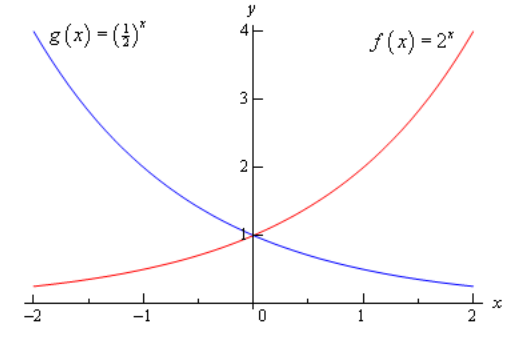
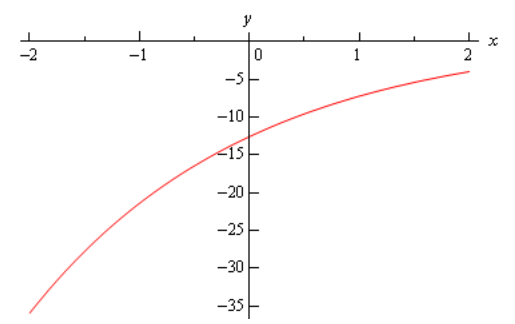
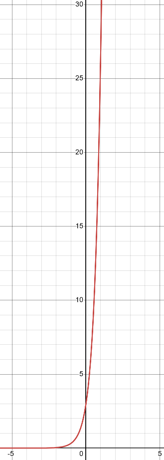
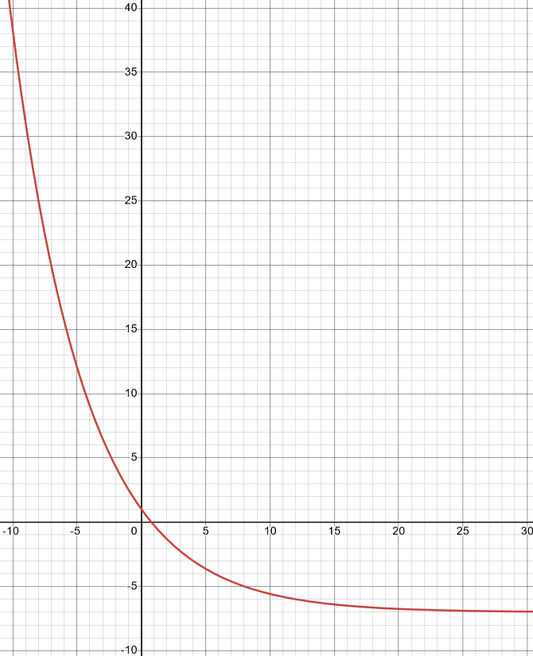
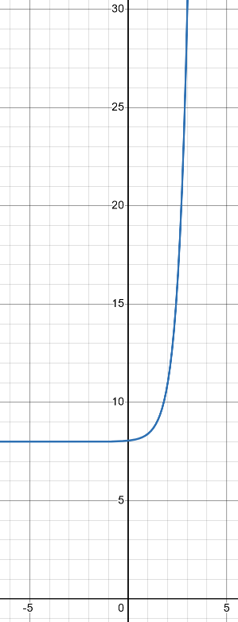
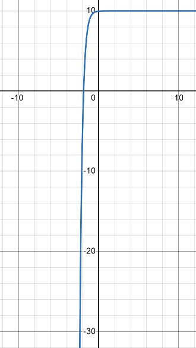
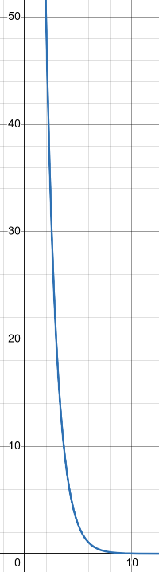
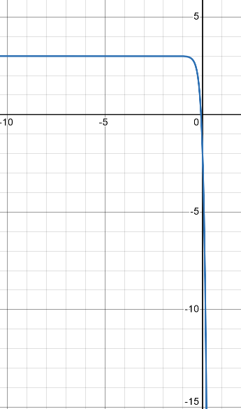
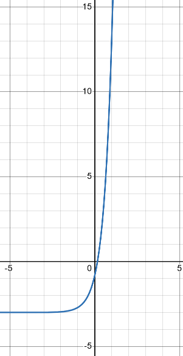
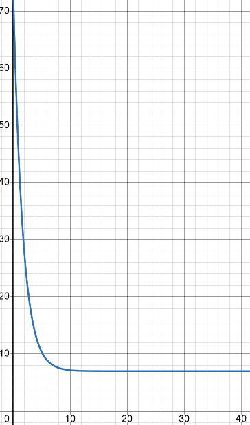

# Section 1.7 : Exponential Functions

In this section we’re going to review one of the more common functions in both
calculus and the sciences. However, before getting to this function let’s take a
much more general approach to things.

Let's start with $b > 0, b \neq 1$. An exponential function is then a function
the form,

$$ f(x) = b^x $$

Note that we avoid $b = 1$ because that would give the constant function,
$f(x) = 1$. We avoid $b = 0$ since this would also give a constant function and
we avoid negative values of $b$ for the following reason.

Let’s, for a second, suppose that we did allow $b$ to be negative and look at
the following function.

$$ g(x) = (-4)^x $$

Let's do some evaluation.

$$ g(2) = (-4)^2 = 16 \quad \quad g\left(\frac{1}{2}\right) = (-4)^{\frac{1}{2}} = \sqrt{-4} = 2i $$

So, for some values of $x$ we will get real numbers and for other values of $x$
we will get complex numbers. We want to avoid this so if we require $b > 0$ this
will not be a problem.

Let’s take a look at a couple of exponential functions.

---

**Example 1** Sketch the graph of $f(x) = 2^x$ and
$g(x) = \left(\dfrac{1}{2}\right)^x$.

Let's first get a table of values for these two functions.

| $x$  | $f(x)$                          | $g(x)$                                              |
| ---- | ------------------------------- | --------------------------------------------------- |
| $-2$ | $f() = 2^{-2} = \dfrac{1}{4}$   | $g(-2) = \left(\dfrac{1}{2}\right)^{-2} = 4$        |
| $-1$ | $f(-1) = 2^{-1} = \dfrac{1}{2}$ | $g(-1) = \left(\dfrac{1}{2}\right)^{-1} = 2$        |
| $0$  | $f(0) = 2^0 = 1$                | $g(0) = \left(\dfrac{1}{2}\right)^0 = 1$            |
| $1$  | $f(1) = 2^1 = 2$                | $g(1) = \left(\dfrac{1}{2}\right)^1 = \dfrac{1}{2}$ |
| $2$  | $f(2) = 2^2 = 4$                | $g(2) = \left(\dfrac{1}{2}\right)^2 = \dfrac{1}{4}$ |

Here's the sketch of both of these functions.

---

This graph illustrates some very nice properties about exponential functions in
general.

**Properties of** $f(x) = b^x$

> 1. $f(0) = 1$. The function will always take the value of $1$ at $x = 0$.
> 2. $f(x) \neq 0$. An exponential function will never be zero.
> 3. $f(x) > 0$. An exponential function is always positive.
> 4. The previous two properties can be summarized by saying that the range of
>    an exponential function is $(0, \infty)$.
> 5. The domain of an exponential function is $(-\infty, \infty)$. In other
>    words, you can plug every $x$ into an exponential function.
> 6. If $0 < b < 1$ then,
>
>> a. $f(x) \rightarrow 0$ as $x \rightarrow \infty$
>
>> b. $f(x) \rightarrow \infty$ as $x \rightarrow -\infty$
>
> 7. If $b > 1$ then,
>
>> a. $f(x) \rightarrow \infty$ as $x \rightarrow \infty$
>
>> b. $f(x) \rightarrow 0$ as $x \rightarrow -\infty$

These will all be very useful properties to recall at times as we move
throughout this course (and later Calculus courses for that matter...).

There is a very important exponential function that arises naturally in many
places. This function is called the **natural exponential function**. However,
for most people, this is simply the exponential function.

> **Definition** : The **natural exponential function** is $f(x) = \mathbf{e}^x$
> where $\mathbf{e} = 2.71828182845905 \dots$

So, since $\mathbf{e} > 1$ we know that $\mathbf{e}^x \rightarrow \infty$ as
$x \rightarrow \infty$ and $\mathbf{e}^x \rightarrow 0$ as
$x \rightarrow -\infty$.

Let's take a quick look at an example.

---

**Example 2** Sketch the graph of $h(t) = 1 - 5\mathbf{e}^{1 - \frac{t}{2}}$.

Let's first get a table of values for this function.

| $t$  | $h(t)$     |
| ---- | ---------- |
| $-2$ | $-35.9453$ |
| $-1$ | $-21.4094$ |
| $0$  | $-12.5914$ |
| $1$  | $-7.2436$  |
| $2$  | $-4$       |
| $3$  | $-2.02327$ |

Here is the sketch.

---

The main point behind this problem is to make sure you can do this type of
evaluation so make sure that you can get the values that we graphed in this
example. You will be asked to do this kind of evaluation on occasion in this
class.

You will be seeing exponential functions in pretty much every chapter in this
class so make sure that you are comfortable with them.

---

## Practice Problems

Sketch the graphs of each of the following functions.

**1.** $f(x) = 3^{1 + 2x}$

**Solution**

Let's table some values out:

| $x$  | $f(x)$                                           |
| ---- | ------------------------------------------------ |
| $-2$ | $f(-2) = 3^{1 + 2(-2)} = 3^{-3} = \dfrac{1}{27}$ |
| $-1$ | $f(-1) = 3^{1 + 2(-1)} = 3^{-1} = \dfrac{1}{3}$  |
| $0$  | $f(0) = 3^{1 + 2(0)} = 3^1 = 3$                  |
| $1$  | $f(1) = 3^{1 + 2(1)} = 3^3 = 27$                 |
| $2$  | $f(2) = 3^{1 + 2(2)} = 3^5 = 243 $               |

And now let's graph it:

**2.** $h(x) = 2^{3 - \frac{x}{4}} - 7$

**Solution**

Let's table some values out:

| $x$  | $h(x)$                                                           |
| ---- | ---------------------------------------------------------------- |
| $-2$ | $h(-2) = 2^{3 - \frac{(-2)}{4}} - 7 = 8\sqrt{2} - 7 = 4.3137$    |
| $-1$ | $h(-1) = 2^{3 - \frac{(-1)}{4}} - 7 = 8\sqrt[4]{2} - 7 = 2.5137$ |
| $0$  | $h(0) = 2^{3 - \frac{(0)}{4}} - 7 = 1$                           |
| $1$  | $h(1) = 2^{3 - \frac{(1)}{4}} - 7 = 4\sqrt[4]{2} - 7 = -2.2432$  |
| $2$  | $h(2) = 2^{3 - \frac{(2)}{4}} - 7 = 4\sqrt{2} - 7 = -1.3431$     |

Note that since we have a fraction in our exponent, we likely wanted to pick
larger numbers here.

Now graph:

**3.** $h(t) = 8 + 3\mathbf{e}^{2t - 4}$

**Solution**

| $t$  | $h(t)$                                         |
| ---- | ---------------------------------------------- |
| $-2$ | $h(-2) = 8 + 3\mathbf{e}^{2(-2) - 4} = 8.0010$ |
| $-1$ | $h(-1) = 8 + 3\mathbf{e}^{2(-1) - 4} = 8.0074$ |
| $0$  | $h(0) = 8 + 3\mathbf{e}^{2(0) - 4} = 8.0549$   |
| $1$  | $h(1) = 8 + 3\mathbf{e}^{2(1) - 4} = 8.4060$   |
| $2$  | $h(2) = 8 + 3\mathbf{e}^{2(2) - 4} = 11$       |
| $3$  | $h(3) = 8 + 3\mathbf{e}^{2(3) - 4} = 30.1672$  |

**4.** $g(z) = 10 - \dfrac{1}{4}\mathbf{e}^{-2 - 3z}$

**Solution**

| $z$  | $g(z)$                                                       |
| ---- | ------------------------------------------------------------ |
| $-2$ | $g(-2) = 10 - \dfrac{1}{4}\mathbf{e}^{-2 - 3(-2)} = -3.6495$ |
| $-1$ | $g(-1) = 10 - \dfrac{1}{4}\mathbf{e}^{-2 - 3(-1)} = 9.3204 $ |
| $0$  | $g(0) = 10 - \dfrac{1}{4}\mathbf{e}^{-2 - 3(0)} = 9.9662$    |
| $1$  | $g(1) = 1 - \dfrac{1}{4}\mathbf{e}^{-2 - 3(1)} = 9.9983$     |
| $2$  | $g(2) = 10 - \dfrac{1}{4}\mathbf{e}^{-2 - 3(2)} = 9.9999$    |

---

## Assignment Problems

Sketch the graphs of each of the following functions.

**1.** $g(t) = 7^{3 - \frac{t}{2}}$

**Solution**

| $t$  | $g(t)$                                      |
| ---- | ------------------------------------------- |
| $-2$ | $g(-2) = 7^{3 - \frac{(-2)}{2}} = 2401$     |
| $-1$ | $g(-1) = 7^{3 - \frac{(-1)}{2}} = 907.4927$ |
| $0$  | $g(0) = 7^{3 - \frac{(0)}{2}} = 343$        |
| $1$  | $g(1) = 7^{3 - \frac{(1)}{2}} = 129.6418$   |
| $2$  | $g(2) = 7^{3 - \frac{(2)}{2}} = 49$         |

**2.** $f(x) = 3 - 5^{4x + 1}$

**Solution**

| $x$  | $f(x)$                               |
| ---- | ------------------------------------ |
| $-2$ | $f(-2) = 3 - 5^{4(-2) + 1} = 2.9999$ |
| $-1$ | $f(-1) = 3 - 5^{4(-1) + 1} = 2.992$  |
| $0$  | $f(0) = 3 - 5^{4(0) + 1} = -2$       |
| $1$  | $f(1) = 3 - 5^{4(1) + 1} = -3122$    |
| $2$  | $f(2) = 3 - 5^{4(2) + 1} = -1953122$ |

**3.** $h(x) = 6\mathbf{e}^{2x - 1} - 3$

**Solution**

| $x$  | $h(x)$                                          |
| ---- | ----------------------------------------------- |
| $-2$ | $h(-2) = 6\mathbf{e}^{2(-2) - 1} - 3 = -2.9596$ |
| $-1$ | $h(-1) = 6\mathbf{e}^{2(-1) - 1} - 3 = -2.7013$ |
| $0$  | $h(0) = 6\mathbf{e}^{2(0) - 1} - 3 = -0.7927$   |
| $1$  | $h(1) = 6\mathbf{e}^{2(1) - 1} - 3 = 13.3097$   |
| $2$  | $h(2) = 6\mathbf{e}^{2(2) - 1} - 3 = 117.5132$  |

**4.** $f(t) = 7 + 9\mathbf{e}^{2 - \frac{3t}{5}}$

**Solution**

| $t$  | $f(t)$                                                     |
| ---- | ---------------------------------------------------------- |
| $-2$ | $f(-2) = 7 + 9\mathbf{e}^{2 - \frac{3(-2)}{5}} = 227.7928$ |
| $-1$ | $f(-1) = 7 + 9\mathbf{e}^{2 - \frac{3(-1)}{5}} = 128.1736$ |
| $0$  | $f(0) = 7 + 9\mathbf{e}^{2 - \frac{3(0)}{5}} = 73.5015$    |
| $1$  | $f(1) = 7 + 9\mathbf{e}^{2 - \frac{3(1)}{5}} = 43.4968$    |
| $2$  | $f(2) = 7 + 9\mathbf{e}^{2 - \frac{3(2)}{5}} = 27.0299$    |

