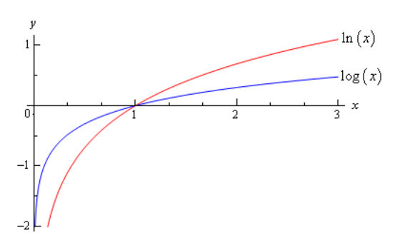

# Section 1.8 : Logarithm Functions

In this section we’ll take a look at a function that is related to the
exponential functions we looked at in the last section. We will look at
logarithms in this section. Logarithms are one of the functions that students
fear the most. The main reason for this seems to be that they simply have never
really had to work with them. Once they start working with them, students come
to realize that they aren’t as bad as they first thought.

We’ll start with $b > 0$ , $b \neq 1$ just as we did in the last section. Then
we have

$$ y = \log_{b}x \quad \quad \text{ is equivalent to } \quad \quad x = b^y $$

The first is called logarithmic form and the second is called the exponential
form. Remembering this equivalence is the key to evaluating logarithms. The
number, $b$ , is called the base.

Let's do some quick evaluations.

---

**Example 1** Without a calculator give the exact value of each of the following
logarithms.

To quickly evaluate logarithms the easiest thing to do is to convert the
logarithm to exponential form. So, let’s take a look at the first one.

**(a)** $\log_{2}16$

**Solution**

First, let’s convert to exponential form.

$$ \log_{2}16 = \text{ ?} hi \quad \quad \text{ is equivalent to } \quad \quad 2^{?} = 16 $$

So, we're really asking $2$ raised to what gives $16$. Since $2$ raised to $4$
is $16$ we get,

$$ \log_{2} 16 = 4 \quad \quad \text{ because } 2^4 = 16 $$

We’ll not do the remaining parts in quite this detail, but they will all work in
this way.

**(b)** $\log_{4}16$

**Solution**

$$ \log_{4}16 = 2 \quad \quad text{ because } \quad \quad 4^2 = 16 $$

Note the difference between the first and second logarithm! The base is
important! It can completely change the answer.

**\(c\)** $\log_{5}625$

**Solution**

$$ \log_{5}625 = 4 \quad \quad \text{ because } \quad \quad 5^4 = 625 $$

**(d)** $\log_{9}\frac{1}{531441}$

**Solution**

$$ \log_{9}\frac{1}{531441} = -6 \quad \quad \text{ because } \quad \quad 9^{-6} = \frac{1}{9^6} = \frac{1}{531441} $$

**(e)** $\log_{\frac{1}{6}}36$

**Solution**

$$ \log_{\frac{1}{6}}36 = -2 \quad \quad \text{ because } \quad \quad \left(\frac{1}{6}\right)^{-2} = 6^2 = 36 $$

**(f)** $\log_{\frac{3}{2}}\frac{27}{8}$

**Solution**

$$ \log_{\frac{3}{2}}\frac{27}{8} = 3 \quad \quad \text{ because } \quad \quad \left(\frac{3}{2}\right)^3 = \frac{27}{8} $$

---

There are a couple of special logarithms that arise in many places. These are,

$$ \ln x = \log_{\mathbf{e}}x \quad \quad \text{ This log is called the natural logarithm} $$

$$ \log x = \log_{10}x \quad \quad \text{ This log is called the common logarithm} $$

In the natural logarithm the base $\mathbf{e}$ is the same number as in the
natural exponential function that we saw in the last
[section](https://tutorial.math.lamar.edu/Classes/CalcI/ExpFunctions.aspx#Exp_Defn).
Here is a sketch of both of these logarithms.

From this graph we can get a couple of very nice properties about the natural
logarithm that we will use many times in this and later Calculus courses.

$$ \ln x \rightarrow \infty \text{ as } x \rightarrow \infty $$

$$ \ln x \rightarrow -\infty \text{ as } x \rightarrow 0, x > 0 $$

Let’s take a look at a couple of more logarithm evaluations. Some of which deal
with the natural or common logarithm and some of which don’t.

**Example 2** Without a calculator give the exact value of each of the following
logarithms.

These work exactly the same as previous example so we won’t put in too many
details.

**(a)** $\ln \sqrt[3]{\mathbf{e}}$

**Solution**

$$ \ln \sqrt[3]{\mathbf{e}} = \frac{1}{3} \quad \quad \text{ because } \quad \quad \mathbf{e}^{\frac{1}{3}} = \sqrt[3]{\mathbf{e}} $$

**(b)** $\log 1000$

**Solution**

$$ \log 1000 = 3 \quad \quad \text{ because } \quad \quad 10^3 = 1000 $$

**\(c\)** $\log_{16}16$

**Solution**

$$ \log_{16}16 = 1 \quad \quad \text{ because } \quad \quad 16^1 = 16 $$

**(d)** $\log_{23}1$

**Solution**

$$ \log_{23}1 = 0 \quad \quad \text{ because } \quad \quad 23^0 = 1 $$

**(e)** $\log_{2}\sqrt[7]{32}$

**Solution**

$$ \log_{2}\sqrt[7]{32} = \frac{5}{7} \quad \quad \text{ because } \quad \quad \sqrt[7]{32} = 32^{\frac{1}{7}} = (2^5)^{\frac{1}{7}} = 2^{\frac{5}{7}} $$

---

This last set of examples leads us to some of the basic properties of
logarithms.

**Properties**

> 1. The domain of the logarithm function is $(0, \infty)$. In other words, we
>    can only plug positive values into a logarithm! We can't plug in zero or a
>    negative number.
> 2. The range of the logarithm function is $(-\infty, \infty)$.
> 3. $\log_{b}b = 1$
> 4. $\log_{b}1 = 0$
> 5. $\log_{b}b^x = x$
> 6. $b^{\log_{b}x} = x$

The last two properties will be especially useful in the next
[section](https://tutorial.math.lamar.edu/Classes/CalcI/ExpLogEqns.aspx). Notice
as well that these last two properties tell us that,

$$ f(x) = b^x \quad \quad \text{ and } \quad \quad g(x) = \log_{b}x $$

are
[inverses](https://tutorial.math.lamar.edu/Classes/CalcI/InverseFunctions.aspx)
of each other.

Here are some more properties that are useful in the manipulation of logarithms.

**More Properties**

> 7. $\log_{b}(xy) = \log_{b}(x) + \log_{b}(y)$
> 8. $\log_b\left(\dfrac{x}{y}\right) = \log_{b}(x) - \log_{b}(y)$
> 9. $\log_{b}(x^r) = r\log_{b}(x)$

Note that there is no equivalent property to the first two for sums and
differences. In other words,

$$ \log_{b}(x + y) \neq \log_{b}x + \log_{b}y $$

$$ \log_{b}(x - y) \neq \log_{b}x - \log_{b}y $$

---

**Example 3** Write each of the following in terms of simpler logarithms.

What the instructions really mean here is to use as many of the properties of
logarithms as we can to simplify things down as much as we can.

**(a)** $\ln(x^3y^4z^5)$

**Solution**

Property 7 above can be extended to products of more than two functions. Once
we’ve used Property 7 we can then use Property 9.

$$ \ln(x^3y^4z^5) = \ln(x^3) + \ln(y^4) + \ln(z^5) = 3\ln(x) + 4\ln(y) + 5\ln(z) $$

**(b)** $\log_{3}\left(\dfrac{9x^4}{\sqrt{y}}\right)$

**Solution**

When using property 8 above make sure that the logarithm that you subtract is
the one that contains the denominator as its argument. Also, note that that
we’ll be converting the root to fractional exponents in the first step.

$$ \log\left(\frac{9x^4}{\sqrt{y}}\right) = \log_{3}(9x^4) - \log_{3}(y^{\frac{1}{2}}) $$

$$ \log\left(\frac{9x^4}{\sqrt{y}}\right) = \log_{3}(9) + \log_{3}(x^4) - \log_{3}(y^{\frac{1}{2}})$$

$$ \log\left(\frac{9x^4}{\sqrt{y}}\right) = 2 + 4\log_{3}(x) - \frac{1}{2}\log_{3}(y) $$

**\(c\)** $\log\left(\dfrac{x^2 + y^2}{(x - y)^3}\right)$

**Solution**

The point to this problem is mostly the correct use of property 9 above.

$$ \log\left(\frac{x^2 + y^2}{(x - y)^3}\right) = \log(x^2 + y^2) - \log(x - y)^3 $$

$$ \log\left(\frac{x^2 + y^2}{(x - y)^3}\right) = \log(x^2 + y^2) - 3\log(x - y) $$

You can use Property 9 on the second term because the WHOLE term was raised to
the 3, but in the first logarithm, only the individual terms were squared and
not the term as a whole so the 2’s must stay where they are!

---

The last topic that we need to look at in this section is the **change of base**
formula for logarithms. The change of base formula is,

$$ \log_{b}x = \frac{\log_{a}x}{\log_{a}b} $$

This is the most general change of base formula and will convert from base $b$
to base $a$. However, the usual reason for using the change of base formula is
to compute the value of a logarithm that is in a base that you can’t easily deal
with. Using the change of base formula means that you can write the logarithm in
terms of a logarithm that you can deal with. The two most common change of base
formulas are

$$ \log_{b}x = \frac{\ln x}{\ln b} \quad \quad \text{ and } \quad \quad \log_{b}x = \frac{\log x}{\log b} $$

In fact, often you will see one or the other listed as THE change of base
formula!

In the first part of this section we computed the value of a few logarithms, but
we could do these without the change of base formula because all the arguments
could be written in terms of the base to a power. For instance,

$$ \log_{7}49 = 2 \quad \quad \text{ because } \quad \quad 7^2 = 49 $$

However, this only works because $49$ can be written as a power of $7$! We would
need to change the base formula to compute $\log_{7}50$.

$$ \log_{7}50 = \frac{\ln 50}{\ln 7} = \frac{3.91202300543}{1.94591014906} = 2.0103821378 $$

OR

$$ \log_{7}50 = \frac{\log 50}{\log 7} = \frac{1.69897000434}{0.845098040014} = 2.0103821378 $$

So, it doesn’t matter which we use, we will get the same answer regardless of
the logarithm that we use in the change of base formula.

Note as well that we could use the change of base formula on $\log_{7}49$ if we
wanted to as well.

$$ \log_{7}49 = \frac{\ln 49}{\ln 7} = \frac{3.89182029811}{1.94591014906} n= 2 $$

This is a lot of work however, and is probably not the best way to deal with
this.

So, in this section we saw how logarithms work and took a look at some of the
properties of logarithms. We will run into logarithms on occasion so make sure
that you can deal with them when we do run into them.

---

## Practice Problems

Without using a calculator determine the exact value of each of the following.

**1.** $\log_{3}81$

**Solution**

**2.** $\log_{5}125$

**Solution**

**3.** $\log_{2}\dfrac{1}{8}$

**Solution**

**4.** $\log_{\frac{1}{4}}16$

**Solution**

**5.** $\ln\mathbf{e}^4$

**Solution**

**6.** $\log\dfrac{1}{100}$

**Solution**

Write each of the following in terms of simpler logarithms.

**7.** $\log(3x^4y^{-7})$

**Solution**

**8.** $\ln\left(x\sqrt{y^2 + z^2}\right)$

**Solution**

**9.** $\log_{4}\left(\dfrac{x - 4}{y^2\sqrt[5]{z}}\right)$

**Solution**

Combine each of the following into a single logarithm with a coefficient of one.

**10.** $2\log_{4}x + 5\log_{4}y - \dfrac{1}{2}\log_{4}z$

**Solution**

**11.** $3\ln(t + 5) - 4\ln t - 2\ln(s - 1)$

**Solution**

**12.** $\dfrac{1}{3}\log a - 6\log b + 2$

**Solution**

Use the change of base formula and a calculator to find the value of each of the
following.

**13.** $\log_{12}35$

**Solution**

**14.** $\log_{\frac{2}{3}}53$

**Solution**

---

## Assignment Problems

Without using a calculator determine the exact value of each of the following.

**1.** $\log_{7}343$

**Solution**

**2.** $\log_{4}1024$

**Solution**

**3.** $\log_{\frac{3}{8}}\dfrac{27}{512}$

**Solution**

**4.** $\log_{11}\dfrac{1}{121}$

**Solution**

**5.** $\log_{0.1}0.0001$

**Solution**

**6.** $\log_{16}4$

**Solution**

**7.** $\log 10000$

**Solution**

**8.** $\ln \frac{1}{\sqrt[5]{\mathbf{e}}}$

**Solution**

Write each of the following in terms of simpler logarithms

**9.** $\log_{7}(10a^7b^3c^{-8})$

**Solution**

**10.** $\log\left[z^2(x^2 + 4)^3\right]$

**Solution**

**11.** $\ln\left(\dfrac{w^2\sqrt[4]{t^3}}{\sqrt{t + w}}\right)$

**Solution**

Combine each of the following into a single logarithm with a coefficient of one.

**12.** $7\ln t - 6\ln s + 5\ln w$

**Solution**

**13.** $\dfrac{1}{2}\log(z + 1) - 2\log x - 4\log y - 3\log z$

**Solution**

**14.** $2\log_{3}(x + y) + 6\log^{3}x - \dfrac{1}{3}$

**Solution**

Use the change of base formula and a calculator to find the value of each of the
following.

**15.** $\log_{7}100$

**Solution**

**16.** $\log_{\frac{5}{7}}\dfrac{1}{8}$

**Solution**
