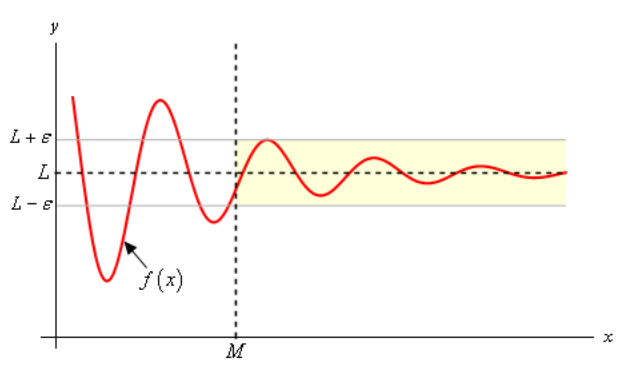

# Section 2.10 : The Definition Of The Limit

In this section we’re going to be taking a look at the precise, mathematical
definition of the three kinds of limits we looked at in this chapter. We’ll be
looking at the precise definition of limits at finite points that have finite
values, limits that are infinity and limits at infinity. We’ll also give the
precise, mathematical definition of continuity.

Let’s start this section out with the definition of a limit at a finite point
that has a finite value.

**Definition 1**

> Let $f(x)$ be a function defined on an interval that contains $x = a$, except
> possible at $x = a$. Then we say that,
>
> $$ \lim\limits_{x \to a}f(x) = L $$
>
> if for every $\varepsilon > 0$ there is some number $\delta > 0$ such that
>
> $$ \mid f(x) - L \mid < \varepsilon \quad \text{ whenever } \quad 0 < \mid x - a \mid < \delta $$

Wow. That’s a mouth full. Now that it’s written down, just what does this mean?

Let’s take a look at the following graph and let’s also assume that the limit
does exist.

What the definition is telling us is that for **any** number $\varepsilon > 0$
that we pick we can go to our graph and sketch two horizontal lines at
$L + \varepsilon$ and $L - \varepsilon$ as shown on the graph above. Then
somewhere out there in the world is another number $\delta > 0$, which we will
need to determine, that will allow us to add in two vertical lines to our graph
at $a + \delta$ and $a - \delta$.

If we take any $x$ in the pink region, _i.e._ between $a + \delta$ and
$a - \delta$, then this $x$ will be closer to $a$ than either of $a + \delta$
and $a - \delta$. Or,

$$ \mid x - a \mid < \delta $$

If we now identify the point on the graph that our choice of $x$ gives, then
this point on the graph **will** lie in the intersection of the pink and yellow
region. This means that this function value $f(x)$ will be closer to $L$ than
either $L + \varepsilon$ and $L - \varepsilon$. Or,

$$ \mid f(x) - L \mid < \varepsilon $$

If we take any value of $x$ in the pink region then the graph for those values
of $x$ will lie in the yellow region.

Notice that there are actually an infinite number of possible $\delta$'s that we
can choose. In fact, if we go back and look at the graph above it looks like we
could have taken a slightly larger $\delta$ and still gotten the graph from the
pink region to be completely contained in the yellow region.

Also, notice that as the definition points out we only need to make sure that
the function is defined in some interval around $x = a$ but we don’t really care
if it is defined at $x = a$. Remember that limits do not care what is happening
at the point, they only care what is happening around the point in question.

Okay, now that we’ve gotten the definition out of the way and made an attempt to
understand it let’s see how it’s actually used in practice.

These are a little tricky sometimes and it can take a lot of practice to get
good at these so don’t feel too bad if you don’t pick up on this stuff right
away. We’re going to be looking at a couple of examples that work out fairly
easily.

---

**Example 1** Use the definition of the limit to prove the following limit.

$$ \lim\limits_{x \to 0}x^2 = 0 $$

**Solution**

In this case both $L$ and $a$ are zero. So, let $\varepsilon > 0$ be any number.
Don't worry about what the number is, $\varepsilon$ is just some arbitrary
number. Now according to the definition of the limit, if this limit is to be
true we will need to find some other number $\delta > 0$ so that the following
will be true.

$$ \mid x^2 - 0 \mid < \varepsilon  \quad \text{ whenever } \quad 0 < \mid x - 0 \mid < \delta $$

Or upon simplifying things we need,

$$ \mid x^2 \mid < \varepsilon \quad \text{ whenever } \quad 0 < \mid x \mid < \delta $$

Often the way to go through these is to start with the left inequality and do a
little simplification and asee if that suggests a choice for $\delta$. We'll
start by bringing the exponent out of the absolute value bars and then taking
the square root of both sides.

$$ \mid x \mid^2 \quad \Rightarrow \quad \mid x \mid < \sqrt{\varepsilon} $$

Now, the results of this simplification looks an awful lot like
$0 < \mid x \mid < \delta$ with the exception of the "$0 <$" part. Missing that
however isn't a problem, it is just telling us that we can't take $x = 0$. So,
it looks like if we choose $\delta = \sqrt{\varepsilon}$ we should get what we
want.

We'll next need to verify that our choice of $\delta$ will give us what we want,
_i.e._,

$$ \mid x^2 \mid < \varepsilon \quad \text{ whenever } \quad 0 < \mid x \mid < \sqrt{\varepsilon} $$

Verification is in fact pretty much the same work that we did to get our guess.
First, let's again let $\varepsilon > 0$ be any number and then choose
$\delta = \sqrt{\varepsilon}$. Now, assume that
$0 < \mid x \mid < \sqrt{\varepsilon}$. We need to show that by choosing $x$ to
satisfy this we will get,

$$ \mid x^2 \mid < \varepsilon $$

To start the verification process, we'll start with $\mid x^2 \mid$ and then
first strip out the exponent from the absolute values. Once this is done we'll
use our assumption on $x$, namely that $\mid x \mid < \sqrt{\varepsilon}$. Doing
all this gives,

$$ \mid x^2 \mid = \mid x \mid^2 \quad \quad \text{ strip exponents out of absolute value bars} $$

$$ \quad < \left(\sqrt{\varepsilon}\right)^2 \quad \quad \text{ use the assumption that } \mid x \mid < \sqrt{\varepsilon} $$

$$ \quad = \varepsilon \quad \quad \text{ simplify} $$

Or, upon taking the middle terms out, if we assume that
$0 < \mid x \mid < \sqrt{\varepsilon}$ then we will get,

$$ \mid x^2 \mid < \varepsilon $$

and this is exactly what we needed to show.

So, just what have we done? We've shown that if we choose $\varepsilon > 0$ then
we can find a $\delta > 0$ so that we have,

$$ \mid x^2 - 0 \mid < \varepsilon \quad \text{ whenever } 0 < \mid x - 0 \mid < \sqrt{\varepsilon} $$

and according to our definition this means that,

$$ \lim\limits_{x \to 0}x^2 = 0 $$

---

These can be a little tricky the first couple times through. Especially when it
seems like we’ve got to do the work twice. In the previous example we did some
simplification on the left-hand inequality to get our guess for $\delta$ and
then seemingly went through exactly the same work to then prove that our guess
was correct. This is often how these work, although we will see an example here
in a bit where things don’t work out quite so nicely.

So, having said that let’s take a look at a slightly more complicated limit,
although this one will still be fairly similar to the first example.

---

**Example 2** Use the definition of the limit to prove the following limit.

$$ \lim\limits_{x \to 2}5x - 4 = 6 $$

**Solution**

We’ll start this one out the same way that we did the first one. We won’t be
putting in quite the same amount of explanation however.

Let’s start off by letting $\varepsilon > 0$ be any number then we need to find
a number $\delta > 0$ so that the following will be true.

$$ \mid (5x - 4) - 6 \mid < \varepsilon \quad \text{ whenever } \quad 0 < \mid x - 2 \mid < \delta $$

We’ll start by simplifying the left inequality in an attempt to get a guess for
$\delta$. Doing this gives,

$$ \mid (5x - 4) - 6 \mid = \mid 5x - 10 \mid = 5 \mid x - 2 \mid < \varepsilon \quad \Rightarrow \quad \mid x - 2 \mid < \frac{\varepsilon}{5} $$

So, as with the first example it looks like if we do enough simplification on
the left inequality we get something that looks an awful lot like the right
inequality and this leads us to choose $\delta = \dfrac{\varepsilon}{5}$.

Let's now verify this guess. So, again let $\varepsilon > 0$ be any number and
then choose $\delta = \dfrac{\varepsilon}{5}$. Next, assume that
$0 < \mid x - 2 \mid < \delta = \dfrac{\varepsilon}{5}$ and we get the
following,

$$ \mid (5x - 4) - 6 \mid = \mid 5x - 10 \mid \quad \quad \text{ simplify things a little} $$

$$ \quad = 5 \mid x - 2 \mid \quad \quad \text{ more simplfication....} $$

$$ \quad < 5\left(\frac{\varepsilon}{5}\right) \quad \quad \text{ use the assumption } \delta = \frac{\varepsilon}{5} $$

$$ \quad = \varepsilon \quad \quad \text{ and some more simplification} $$

So, we've shown that

$$ \mid (5x - 4) - 6 \mid < \varepsilon \quad \text{ whenever } 0 < \mid x - 2 \mid < \frac{\varepsilon}{5} $$

and so by our definition we have,

$$ \lim\limits_{x \to 2}5x - 4 = 6 $$

---

Okay, so again the process seems to suggest that we have to essentially redo all
our work twice, once to make the guess for $\delta$ and then another time to
prove our guess. Let’s do an example that doesn’t work out quite so nicely.

---

**Example 3** Use the definition of the limit to prove the following limit,

$$ \lim\limits_{x \to 4}x^2 + x - 11 = 9 $$

**Solution**

So, let's get started. Let $\varepsilon > 0$ be any number then we need to find
a number $\delta > 0$ so that the following will be true.

$$ \mid (x^2 + x - 11) - 9 \mid < \varepsilon \quad \text{ whenever } 0 < \mid x - 4 \mid < \delta $$

We’ll start the guess process in the same manner as the previous two examples.

$$ \mid \left(x^2 + x - 11\right) - 9 \mid = \mid x^2 + x - 20 \mid = \mid (x + 5)(x - 4) \mid = \mid x + 5 \mid \mid x - 4 \mid < \varepsilon $$

Okay, we've managed to show that
$\mid \left(x^2 + x - 11\right) - 9 \mid < \varepsilon$ is equivalent to
$\mid x + 5 \mid \mid x - 4 \mid < \varepsilon$. However, unlike the previous
two examples, we’ve got an extra term in here that doesn’t show up in the right
inequality above. If we have any hope of proceeding here we’re going to need to
find some way to deal with the $\mid x + 5 \mid$.

To do this let’s just note that if, by some chance, we can show that
$\mid x + 5 \mid < K$ for some number $K$ then, we'll have the following,

$$ \mid x + 5 \mid \mid x - 4 \mid < K \mid x - 4 \mid $$

If we now assume that what we really want to show is
$K\mid x - 4\mid < \varepsilon$ instead of
$\mid x + 5 \mid \mid x - 4 \mid < \varepsilon$ we get the following,

$$ \mid x - 4 \mid < \frac{\varepsilon}{K} $$

This is starting to seem familiar isn’t it?

All this work however, is based on the assumption that we can show that
$\mid x + 5 \mid < K$ for some $K$. Without this assumption we can’t do anything
so let’s see if we can do this.

Let’s first remember that we are working on a limit here and let’s also remember
that limits are only really concerned with what is happening around the point in
question, $x = 4$ in this case. So, it is safe to assume that whatever $x$ is,
it must be close to $x = 4$. This means we can safely assume that whatever $x$
is, it is within a distance of, say one of $x = 4$. Or in terms of an
inequality, we can assume that,

$$ \mid x - 4 \mid < 1 $$

Why choose 1 here? There is no reason other than it's a nice number to work
with. We could just have easily chosen 2, or 5, or $\dfrac{1}{3}$. The only
difference our choice will make is on the actual value of $K$ that we end up
with. You might want to go through this process with another choice of $K$ and
see if you can do it.

So, let's start with $\mid x - 4 \mid < 1$ and get rid of the absolute value
bars and this solve the resulting inequality for $x$ as follows,

$$ -1 < x - 4 < 1 \quad \Rightarrow \quad 3 < x < 5 $$

If we now add 5 to all parts of this inequality we get,

$$ 8 < x + 5 < 10 $$

Now, since $x + 5 > 8 > 0$ (the positive part is important here) we can say
that, provided $\mid x - 4 \mid < 1$ we know that $x + 5 = \mid x + 5 \mid$. Or,
if take the double inequality above we have,

$$ 8 < x + 5 = \mid x + 5 \mid < 10 \quad \Rightarrow \quad \mid x + 5 \mid < 10 \quad \Rightarrow \quad K = 10 $$

So, provided $\mid x - 4 \mid < 1$ we can see that $\mid x + 5 \mid < 10$ which
in turn gives us,

$$ \mid x - 4  \mid < \frac{\varepsilon}{K} = \frac{\varepsilon}{10} $$

So, to this point we make two assumptions about $\mid x - 4 \mid$ We've assumed
that,

$$ \mid x - 4 \mid < \frac{\varepsilon}{10} \quad \text{ AND } \quad \mid x - 4 \mid < 1 $$

It may not seem like it, but we’re now ready to choose a $\delta$. In the
previous examples we had only a single assumption and we used that to give us
$\delta$. In this case we’ve got two and they BOTH need to be true. So, we’ll
let $\delta$ be the smaller of the two assumptions, $1$ and
$\dfrac{\varepsilon}{10}$. Mathematically, this is written as,

$$ \delta = \min \left\{{1, \frac{\varepsilon}{10}}\right\} $$

By doing this we can guarantee that,

$$ \delta \leq \frac{\varepsilon}{10} \quad \text{ AND } \quad \delta \leq 1 $$

Now that we've made our choice for $\delta$ we need to verify it. So,
$\varepsilon > 0$ be any number and then choose
$\delta = \min \left\{{1, \dfrac{\varepsilon}{10}}\right\}$. Assume that
$0 < \mid x - 4 \mid < \delta = \min \left\{{1, \dfrac{\varepsilon}{10}}\right\}$.
First, we get that,

$$ 0 < \mid x - 4 \mid < \delta \leq \frac{\varepsilon}{10} \quad \Rightarrow \quad \mid x - 4 \mid < \frac{\varepsilon}{10} $$

We also get,

$$ 0 < \mid x - 4 \mid < \delta \leq 1 \quad \Rightarrow \quad \mid x - 4 \mid < 1 \quad \Rightarrow \quad \mid x + 5 \mid < 10 $$

Finally, all we need to do is,

$$ \mid \left(x^2 + x - 11\right) - 9 \mid = \mid x^2 + x - 20 \mid \quad \quad \text{ simplify things a little} $$

$$ \quad = \mid x + 5 \mid \mid x - 4 \mid \quad \quad \text{ factor} $$

$$ \quad < 10\mid x - 4 \mid \quad \quad \text{ use the assumption that } \mid x + 5 \mid < 10 $$

$$ \quad < 10\left(\frac{\varepsilon}{10}\right) \quad \quad \text{ use the assumption that } \mid x - 4 \mid < \frac{\varepsilon}{10} $$

$$ \quad = \varepsilon \quad \quad \text{ a little final simplification} $$

We've now managed to show that,

$$ \mid \left(x^2 + x - 11\right) - 9 \mid < \varepsilon \quad \text{ whenever } \quad 0 < \mid x - 4 \mid < \min \left\{{1, \frac{\varepsilon}{10}}\right\} $$

and so by our definition we have,

$$ \lim\limits_{x \to 4}x^2 + x - 11 = 9 $$

---

Okay, that was a lot more work that the first two examples and unfortunately, it
wasn’t all that difficult of a problem. Well, maybe we should say that in
comparison to some of the other limits we could have tried to prove it wasn’t
all that difficult. When first faced with these kinds of proofs using the
precise definition of a limit they can all seem pretty difficult.

Do not feel bad if you don’t get this stuff right away. It’s very common to not
understand this right away and to have to struggle a little to fully start to
understand how these kinds of limit definition proofs work.

Next, let’s give the precise definitions for the right- and left-handed limits.

**Definition 2**

> For the right-hand limit we say that,
>
> $$ \lim\limits_{x \to a^+}f(x) = L $$
>
> if for every number $\varepsilon > 0$ there is some number $\delta > 0$ such
> that
>
> $$ \mid f(x) - L \mid < \varepsilon \quad \text{ whenever } \quad 0 < x - a < \delta \quad \left(\text{or } a < x < a + \delta\right) $$

**Definition 3**

> For the left-hand limit we say that,
>
> $$ \lim\limits_{x \to a^-}f(x) = L $$
>
> if for every number $\varepsilon > 0$ there is some number $\delta > 0$ such
> that
>
> $$ \mid f(x) - L \mid < \varepsilon \quad \text{ whenever } \quad -\delta < x - a < 0 \quad \left(\text{or } a - \delta < x < a\right) $$

Note that with both of these definitions there are two ways to deal with the
restriction on $x$ and the one in parenthesis is probably the easier to use,
although the main one given more closely matches the definition of the normal
limit above.

Let’s work a quick example of one of these, although as you’ll see they work in
much the same manner as the normal limit problems do.

---

**Example 4** Use the definition of the limit to prove the following limit.

$$ \lim\limits_{x \to 0^+}\sqrt{x} = 0 $$

**Solution**

Let $\varepsilon > 0$ be any number then we need to find a number $\delta > 0$
so that the following will be true.

$$ \mid \sqrt{x} - 0 \mid < \varepsilon \quad \text{ whenever } \quad 0 < x - 0 < \delta $$

Or upon a little simplification we need to show,

$$ \sqrt{x} < \varepsilon \quad \text{ whenever } \quad 0 < x < \delta $$

As with the previous problems let’s start with the left-hand inequality and see
if we can’t use that to get a guess for $\delta$. The only simplification that
we really need to do here is to square both sides.

$$ \sqrt{x} < \varepsilon \quad \Rightarrow \quad x < \varepsilon^2 $$

So, it looks like we can choose $\delta = \varepsilon^2$.

Let's verify this. Let $\varepsilon > 0$ be any number and chose
$\delta = \varepsilon^2$. Next assume that $0 < x < \varepsilon^2$. This gives,

$$ \mid \sqrt{x} - 0 \mid = \sqrt{x} \quad \quad \text{ some quick simplification} $$

$$ \quad < \sqrt{\varepsilon^2} \quad \quad \text{ use the assumption that } x < \varepsilon^2 $$

$$ \quad < \varepsilon \quad \quad \text{ one final simplification} $$

We've now shown that,

$$ \mid \sqrt{x} - 0 \mid < \varepsilon \quad \text{ whenever } \quad 0 < x - 0 < \varepsilon^2 $$

and so by the definition of the right-hand limit we have,

$$ \lim\limits_{x \to 0^+}\sqrt{x} = 0 $$

---

Let’s now move onto the definition of infinite limits. Here are the two
definitions that we need to cover both possibilities, limits that are positive
infinity and limits that are negative infinity.

**Definition 4**

> Let $f(x)$ be a function defined on an interval that contains $x = a$, except
> possibly at $x = a$. Then we say that,
>
> $$ \lim\limits_{x \to a}f(x) = \infty $$
>
> if for every number $M > 0$ there is some number $\delta > 0$ such that
>
> $$ f(x) > M \quad \text{ whenever } \quad 0 < \mid x - a \mid < \delta $$

**Definition 5**

> Let $f(x)$ be a function defined on an interval that contains $x = a$, except
> possibly at $x = a$. Then we say that,
>
> $$ \lim\limits_{x \to a}f(x) = -\infty $$
>
> if for every number $N < 0$ there is some number $\delta > 0$ such that
>
> $$ f(x) < N \quad \text{ whenever } \quad 0 < \mid x - a \mid < \delta $$

In these two definitions note that $M$ must be a positive number and that $N$
must be a negative number. That’s an easy distinction to miss if you aren’t
paying close attention.

Also note that we could also write down definitions for one-sided limits that
are infinity if we wanted to. We’ll leave that to you to do if you’d like to.

Here is a quick sketch illustrating Definition 4.

What Definition 4 is telling us is that no matter how large we choose $M$ to be
we can always find an interval around $x = a$, given by
$0 < \mid x - a \mid < \delta$ for some number $\delta$, so that as long as we
stay within that interval the graph of the function will be above the line
$y = M$ as shown in the graph above. Also note that we don't need the function
to actually exist at $x = a$ in order fo the definition to hold. This is also
illustrated in the graph above.

Note as well that the larger $M$ is the smaller we're probably going to need to
make $\delta$.

To see an illustration of Definition 5 reflect the above graph about the
$x$-axis and you’ll see a sketch of Definition 5.

Let’s work a quick example of one of these to see how these differ from the
previous examples.

---

**Example 5** Use the definition of the limit to prove the following limit.

$$ \lim\limits_{x \to 0}\frac{1}{x^2} = \infty $$

**Solution**

These work in pretty much the same manner as the previous set of examples do.
The main difference is that we're working with an $M$ now instead of an
$\varepsilon$. So, let's get going.

Let $M > 0$ be any number and we'll need to choose a $\delta > 0$ so that,

$$ \frac{1}{x^2} > M \quad \text{ whenever } \quad 0 < \mid x - 0 \mid = \mid x \mid < \delta $$

As with the all the previous problems we’ll start with the left inequality and
try to get something in the end that looks like the right inequality. To do this
we’ll basically solve the left inequality for x and we’ll need to recall that
$\sqrt{x^2} = \mid x \mid$. So, here's that work.

$$ \frac{1}{x^2} > M \quad \Rightarrow \quad x^2 < \frac{1}{M} \quad \Rightarrow \quad \mid x \mid < \frac{1}{\sqrt{M}} $$

So, it looks like we can choose $\delta = \dfrac{1}{\sqrt{M}}$ and assume that
$0 < \mid x \mid < \dfrac{1}{\sqrt{M}}$.

In the previous examples we tried to show that our assumptions satisfied the
left inequality by working with it directly. However, in this, the function and
our assumption on x that we’ve got actually will make this easier to start with
the assumption on $x$ and show that we can get the left inequality out of that.
Note that this is being done this way mostly because of the function that we’re
working with and not because of the type of limit that we’ve got.

Doing this work gives,

$$ \mid x \mid < \frac{1}{\sqrt{M}} $$

$$ \mid x \mid^2 < \frac{1}{M} \quad \quad \text{ square both sides} $$

$$ x^2 < \frac{1}{M} \quad \quad \text{ acknowledges that } \mid x \mid^2 = x^2 $$

$$ \frac{1}{x^2} > M \quad \quad \text{ solve for } M $$

So, we've managed to show that

$$ \frac{1}{x^2} > M \quad \text{ whenever } \quad 0 < \mid x - 0 \mid < \frac{1}{\sqrt{M}} $$

and so by the definition of the limit we have,

$$ \lim\limits_{x \to 0}\frac{1}{x^2} = \infty $$

---

For our next set of limit definitions let’s take a look at the two definitions
for limits at infinity. Again, we need one for a limit at plus infinity and
another for negative infinity.

**Definition 6**

> Let $f(x)$ be a function defined on $x > K$ for some $K$. Then we say that,
>
> $$ \lim\limits_{x \to \infty}f(x) = L $$
>
> if for every number $\varepsilon > 0$ there is some number $M > 0$ such that
>
> $$ \mid f(x) - L \mid < \varepsilon \quad \text{ whenever } \quad x > M $$

**Definition 7**

> Let $f(x)$ be a function defined on $x < K$ for some $K$. Then we say that,
>
> $$ \lim\limits_{x \to -\infty}f(x) = L $$
>
> if for every number $\varepsilon > 0$ there is some number $N < 0$ such that
>
> $$ \mid f(x) - L \mid < \varepsilon \quad \text{ whenever } \quad x < N $$

To see what these definitions are telling us here is a quick sketch illustrating
Definition 6. Definition 6 tells us is that no matter how close to $L$ we want
to get, mathematically this is given by $\mid f(x) - L \mid < \varepsilon$ for
any chosen $\varepsilon$, we can find another number $M$ such that provided we
take any $x$ bigger than $M$, then the graph of the function for that $x$ will
be closer to $L$ than either $L - \varepsilon$ and $L + \varepsilon$. Or, in
other words, the graph willbe in the shaded region in the sketch below.

Finally, note that the smaller we make $\varepsilon$ the larger we'll probably
need to make $M$.

Here's a quick example of one of these limits.

---

**Example 6** Use the definition of the limit to prove the following limit.

$$ \lim\limits_{x \to -\infty}\frac{1}{x} = 0 $$

**Solution**

Let $\varepsilon > 0$ be any number that we'll need to choose a $N < 0$ so that,

$$ \left\lvert \frac{1}{x} - 0 \right\rvert = \frac{1}{\mid x \mid} < \varepsilon \quad \text{ whenever } \quad  x < N $$

Getting our guess for $N$ isn't too bad here.

$$ \frac{1}{\mid x \mid} < \varepsilon \quad \Rightarrow \quad \mid x \mid > \frac{1}{\varepsilon} $$

Since we’re heading out towards negative infinity it looks like we can choose
$N = -\dfrac{1}{\varepsilon}$. Note that we need the "-" to make sure that $N$
is negative (recall that $\varepsilon > 0$).

Let's verify that our guess will work. Let $\varepsilon > 0$ and choose
$N = -\dfrac{1}{\varepsilon}$ and assume that $x < -\dfrac{1}{\varepsilon}$. As
with the previous example the function that we’re working with here suggests
that it will be easier to start with this assumption and show that we can get
the left inequality out of that.

$$ x < -\frac{1}{\varepsilon} $$

$$ \mid x \mid > \left\lvert -\frac{1}{\varepsilon} \right\rvert \quad \quad \text{ take the absolute value} $$

$$ \mid x \mid > \frac{1}{\varepsilon} \quad \quad \text{ do a little simplification} $$

$$ \frac{1}{\mid x \mid} < \varepsilon \quad \quad \text{ solve for } \mid x \mid $$

$$ \left\lvert \frac{1}{x} - 0 \right\rvert < \varepsilon \quad \quad \text{ rewrite things a little} $$

Note that when we took the absolute value of both sides we changed both sides
from negative numbers to positive numbers and so also had to change the
direction of the inequality.

So, we’ve shown that,

$$ \left\lvert \frac{1}{x} - 0 \right\rvert = \frac{1}{\mid x \mid} < \varepsilon \quad \text{ whenever } \quad x < -\frac{1}{\varepsilon}$$

and so by the definition of the limit we have,

$$ \lim\limits_{x \to -\infty}\frac{1}{x} = 0 $$

---

For our final limit definition let’s look at limits at infinity that are also
infinite in value. There are four possible limits to define here. We’ll do one
of them and leave the other three to you to write down if you’d like to.

**Definition 8**

> Let $f(x)$ be a function defined on $x > K$ for some $K$. Then we say that,
>
> $$ \lim\limits_{x \to \infty}f(x) = \infty $$
>
> if for every $N > 0$ there is some number $M > 0$ such that
>
> $$ f(x) > N \quad \text{ whenever } \quad x > M $$

The other three definitions are almost identical. The only differences are the
signs of $M$ and/or $N$ and the corresponding inequality directions.

As a final definition in this section let’s recall that we previously said that
a function was continuous if,

$$ \lim\limits_{x \to a}f(x) = f(a) $$

So, since continuity, as we previously defined it, is defined in terms of a
limit we can also now give a more precise definition of continuity. Here it is,

**Definition 9**

> Let $f(x)$ be a function defined on an interval that contains $x = a$. Then we
> say that $f(x)$ is continuous at $x = a$ if for every number $\varepsilon > 0$
> there is some number $\delta > 0$ such that
>
> $$ \mid f(x) - f(a) \mid < \varepsilon \quad \text{ whenever } 0 < \mid x - a \mid < \delta $$

This definition is very similar to the first definition in this section and of
course that should make some sense since that is exactly the kind of limit that
we’re doing to show that a function is continuous. The only real difference is
that here we need to make sure that the function is actually defined at $x = a$,
while we didn’t need to worry about that for the first definition since limits
don’t really care what is happening at the point.

We won’t do any examples of proving a function is continuous at a point here
mostly because we’ve already done some examples. Go back and look at the first
three examples. In each of these examples the value of the limit was the value
of the function evaluated at $x = a$ and so in each of these examples not only
did we prove the value of the limit we also managed to prove that each of these
functions are continuous at the point in question.

---

## Practice Problems

Use the definition of the limit to prove the following limits.

**1.** $\lim\limits_{x \to 3}x = 3$

**Solution**

**2.** $\lim\limits_{x \to -1}(x + 7) = 6$

**Solution**

**3.** $\lim\limits_{x \to 2}x^2 = 4$

**Solution**

**4.** $\lim\limits_{x \to -3}\left(x^2 + 4x + 1\right) = -2$

**Solution**

**5.** $\lim\limits_{x \to 1}\dfrac{1}{(x - 1)^2} = \infty$

**Solution**

**6.** $\lim\limits_{x \to 0^-}\dfrac{1}{x} = -\infty$

**Solution**

**7.** $\lim\limits_{x \to \infty}\dfrac{1}{x^2} = 0$

**Solution**

---

## Assignment Problems

Use the definition of the limit to prove the following limits.

**1.** $\lim\limits_{x \to -4}(2x) = -8$

**Solution**

**2.** $\lim\limits_{x \to 1}(-7x) = -7$

**Solution**

**3.** $\lim\limits_{x \to 3}(2x + 8) = 14$

**Solution**

**4.** $\lim\limits_{x \to 2}(5 - x) = 3$

**Solution**

**5.** $\lim\limits_{x \to -2}x^2 = 4$

**Solution**

**6.** $\lim\limits_{x \to 4}x^2 = 16$

**Solution**

**7.** $\lim\limits_{x \to 1}\left(x^2 + x + 6\right) = 8$

**Solution**

**8.** $\lim\limits_{x \to -2}\left(x^2 + 3x - 1\right) = -3$

**Solution**

**9.** $\lim\limits_{x \to 1}x^4 = 1$

**Solution**

**10.** $\lim\limits_{x \to -6}\dfrac{1}{(x + 6)^2} = \infty$

**Solution**

**11.** $\lim\limits_{x \to 0}\dfrac{-3}{x^2} = -\infty$

**Solution**

**12.** $\lim\limits_{x \to 0^+}\dfrac{1}{x} = \infty$

**Solution**

**13.** $\lim\limits_{x \to 1^-}\dfrac{1}{x - 1} = -\infty$

**Solution**

**14.** $\lim\limits_{x \to -\infty}\dfrac{1}{x^2} = 0$

**Solution**

**15.** $\lim\limits_{x \to \infty}\dfrac{1}{x^3} = 0$

**Solution**
