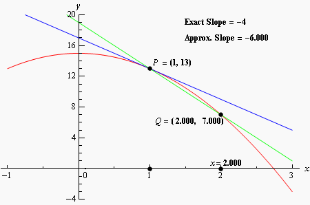

# Section 2.1 : Tangent Lines And Rates Of Change

In this section we are going to take a look at two fairly important problems in
the study of calculus. There are two reasons for looking at these problems now.

First, both of these problems will lead us into the study of limits, which is
the topic of this chapter after all. Looking at these problems here will allow
us to start to understand just what a limit is and what it can tell us about a
function.

Secondly, the rate of change problem that we’re going to be looking at is one of
the most important concepts that we’ll encounter in the second chapter of this
course. In fact, it’s probably one of the most important concepts that we’ll
encounter in the whole course. So, looking at it now will get us to start
thinking about it from the very beginning.

---

**Tangent Lines**

The first problem that we’re going to take a look at is the tangent line
problem. Before getting into this problem it would probably be best to define a
tangent line.

A tangent line to the function $f(x)$ at the point $x = a$ is a line that just
touches the graph of the function at the point in question and is “parallel” (in
some way) to the graph at that point. Take a look at the graph below.

In this graph the line is a tangent line at the indicated point because it just
touches the graph at that point and is also “parallel” to the graph at that
point. Likewise, at the second point shown, the line does just touch the graph
at that point, but it is not “parallel” to the graph at that point and so it’s
not a tangent line to the graph at that point.

At the second point shown (the point where the line isn’t a tangent line) we
will sometimes call the line a **secant line**.

We’ve used the word parallel a couple of times now and we should probably be a
little careful with it. In general, we will think of a line and a graph as being
parallel at a point if they are both moving in the same direction at that point.
So, in the first point above the graph and the line are moving in the same
direction and so we will say they are parallel at that point. At the second
point, on the other hand, the line and the graph are not moving in the same
direction so they aren’t parallel at that point.

Okay, now that we’ve gotten the definition of a tangent line out of the way
let’s move on to the tangent line problem. That’s probably best done with an
example.

---

**Example 1** Find the tangent line to $f(x) = 15 - 2x^2$ at $x = 1$.

**Solution**

We know from algebra that to find the equation of a line we need either two
points on the line or a single point on the line and the slope of the line.
Since we know that we are after a tangent line we do have a point that is on the
line. The tangent line and the graph of the function must touch at $x = 1$ so
the point $(1, f(1)) = (1, 13)$ must be on the line.

Now we reach the problem. This is all that we know about the tangent line. In
order to find the tangent line we need either a second point or the slope of the
tangent line. Since the only reason for needing a second point is to allow us to
find the slope of the tangent line let’s just concentrate on seeing if we can
determine the slope of the tangent line.

At this point in time all that we’re going to be able to do is to get an
estimate for the slope of the tangent line, but if we do it correctly we should
be able to get an estimate that is in fact the actual slope of the tangent line.
We’ll do this by starting with the point that we’re after, let’s call it
$P = (1, 13)$. We will then pick another point that lies on the graph of the
function, let’s call that point $Q = (x, f(x))$.

For the sake of argument let’s take $x = 2$ and so the second point will be
$Q = (2, 7)$. Below is a graph of the function, the tangent line and the secant
line that connects $P$ and $Q$.

We can see from this graph that the secant and tangent lines are somewhat
similar and so the slope of the secant line should be somewhat close to the
actual slope of the tangent line. So, as an estimate of the slope of the tangent
line we can use the slope of the secant line, let’s call it $m_{PQ}$, which is,

$$ m_{PQ} = \frac{f(2) - f(1)}{2 - 1} = \frac{7 - 13}{1} = -6 $$

Now, if we weren’t too interested in accuracy we could say this is good enough
and use this as an estimate of the slope of the tangent line. However, we would
like an estimate that is at least somewhat close the actual value. So, to get a
better estimate we can take an $x$ that is closer to $x = 1$ and redo the work
above to get a new estimate on the slope. We could then take a third value of
$x$ even closer yet and get an even better estimate.

In other words, as we take $Q$ closer and closer to $P$ the slope of the secant
line connecting $Q$ and $P$ should be getting closer and closer to the slope of
the tangent line. If you are viewing this on the web, the image below shows this
process.

As you can see (animation won't work on all pdf viewers unfortunately) as we
moved $Q$ in closer and closer to $P$ the secant lines does start to look more
and more like the tangent line and so the approximate slopes (i.e. the slopes of
the secant lines) are getting closer and closer to the exact slope. Also, do not
worry about how I got the exact or approximate slopes. We’ll be computing the
approximate slopes shortly and we’ll be able to compute the exact slope in a few
sections.

In this figure we only looked at $Q$'s that were to the right of $P$, but we
could have just as easily used $Q$'s that were to the left of $P$ and we would
have received the same results. In fact, we should always take a look at $Q$'s
that are on both sides of $P$. In this case the same thing is happening on both
sides of $P$. However, we will eventually see that doesn’t have to happen.
Therefore, we should always take a look at what is happening on both sides of
the point in question when doing this kind of process.

So, let’s see if we can come up with the approximate slopes we showed above, and
hence an estimation of the slope of the tangent line. In order to simplify the
process a little let’s get a formula for the slope of the line between $P$ and
$Q$, $m_{PQ}$, that will work for any x that we choose to work with. We can get
a formula by finding the slope between $P$ and $Q$ using the “general” form of
$Q = (x, f(x))$.

$$ m_{PQ} = \frac{f(x) - f(1)}{x - 1} = \frac{15 - 2x^2 - 13}{x - 1} = \frac{2 - 2x^2}{x - 1} $$

Now, let’s pick some values of $x$ getting closer and closer to $x = 1$, plug in
and get some slopes.

| $x$      | $m_{PQ}$  | $x$      | $m_{PQ}$  |
| -------- | --------- | -------- | --------- |
| $2$      | $-6$      | $0$      | $-2$      |
| $1.5$    | $-5$      | $0.5$    | $-3$      |
| $1.1$    | $-4.2$    | $0.9$    | $-3.8$    |
| $1.01$   | $-4.02$   | $0.99$   | $-3.98$   |
| $1.001$  | $-4.002$  | $0.999$  | $-3.998$  |
| $1.0001$ | $-4.0002$ | $0.9999$ | $-3.9998$ |

So, if we take $x$'s to the right of $1$ and move them in very close to $1$ it
appears that the slope of the secant lines appears to be approaching $-4$.
Likewise, if we take $x$'s to the left of $1$ and move them in very close to $1$
the slope of the secant lines again appears to be approaching $-4$.

Based on this evidence it seems that the slopes of the secant lines are
approaching $-4$ as we move in towards $x = 1$, so we will estimate that the
slope of the tangent line is also -4. As noted above, this is the correct value
and we will be able to prove this eventually.

Now, the equation of the line that goes through

$$ (a, f(a)) $$

is given by

$$ y = f(a) + m(x - a) $$

Therefore, the equation of the tangent line to $f(x) = 15 - 2x^2$ at $x = 1$ is

$$ y = 13 - 4(x - 1) = -4x + 17 $$

---

There are a couple of important points to note about our work above. First, we
looked at points that were on both sides of $x = 1$. In this kind of process it
is important to never assume that what is happening on one side of a point will
also be happening on the other side as well. We should always look at what is
happening on both sides of the point. In this example we could sketch a graph
and from that guess that what is happening on one side will also be happening on
the other, but we will usually not have the graphs in front of us or be able to
easily get them.

Next, notice that when we say we’re going to move in close to the point in
question we do mean that we’re going to move in very close and we also used more
than just a couple of points. We should never try to determine a trend based on
a couple of points that aren’t really all that close to the point in question.

The next thing to notice is really a warning more than anything. The values of
$m_{PQ}$ in this example were fairly “nice” and it was pretty clear what value
they were approaching after a couple of computations. In most cases this will
not be the case. Most values will be far “messier” and you’ll often need quite a
few computations to be able to get an estimate. You should always use at least
four points, on each side to get the estimate. Two points is never sufficient to
get a good estimate and three points will also often not be sufficient to get a
good estimate. Generally, you keeping picking points closer and closer to the
point you are looking at until the change in the value between two successive
points is getting very small.

Last, we were after something that was happening at $x = 1$ and we couldn’t
actually plug $x = 1$ into our formula for the slope. Despite this limitation we
were able to determine some information about what was happening at $x = 1$
simply by looking at what was happening around $x = 1$. This is more important
than you might at first realize and we will be discussing this point in detail
in later sections.

Before moving on let’s do a quick review of just what we did in the above
example. We wanted the tangent line to $f(x)$ at a point $x = a$. First, we know
that the point $P = (a, f(a))$ will be on the tangent line. Next, we’ll take a
second point that is on the graph of the function, call it $Q = (x, f(x))$ and
compute the slope of the line connecting $P$ and $Q$ as follows,

$$ m_{PQ} = \frac{f(x) - f(a)}{x - a} $$

We then take values of $x$ that get closer and closer to $x = a$ (making sure to
look at $x$'s on both sides of $x = a$ and use this list of values to estimate
the slope of the tangent line, $m$.

The tangent line will then be,

$$ y = f(a) + m(x - a) $$

---

**Rates of Change**

The next problem that we need to look at is the rate of change problem. As
mentioned earlier, this will turn out to be one of the most important concepts
that we will look at throughout this course.

Here we are going to consider a function, $f(x)$, that represents some quantity
that varies as $x$ varies. For instance, maybe $f(x)$ represents the amount of
water in a holding tank after $x$ minutes. Or maybe $f(x)$ is the distance
traveled by a car after $x$ hours. In both of these example we used $x$ to
represent time. Of course $x$ doesn’t have to represent time, but it makes for
examples that are easy to visualize.

What we want to do here is determine just how fast $f(x)$ is changing at some
point, say $x = a$. This is called the **instantaneous rate of change** or
sometimes just **rate of change** of $f(x)$ at $x = a$.

As with the tangent line problem all that we’re going to be able to do at this
point is to estimate the rate of change. So, let’s continue with the examples
above and think of $f(x)$ as something that is changing in time and $x$ being
the time measurement. Again, $x$ doesn’t have to represent time but it will make
the explanation a little easier. While we can’t compute the instantaneous rate
of change at this point we can find the average rate of change.

To compute the average rate of change of $f(x)$ at $x = a$ all we need to do is
to choose another point, say $x$, and then the average rate of change will be,

$$ A.R.C = \frac{\text{change in } f(x)}{\text{change in } x} $$

$$ \quad \quad = \frac{f(x) - f(a)}{x - a} $$

Then to estimate the instantaneous rate of change at $x = a$ all we need to do
is to choose values of $x$ getting closer and closer to $x = a$ (don’t forget to
choose them on both sides of $x = a$) and compute values of $A.R.C.$ We can then
estimate the instantaneous rate of change from that.

Let’s take a look at an example.

---

**Example 2** Suppose that the amount of air in a balloon after $t$ hours is
given by

$$ V(t) = t^3 - 6t^2 + 35 $$

Estimate the instantaneous rate of change of the volume after $5$ hours.

**Solution**

Okay. The first thing that we need to do is get a formula for the average rate
of change of the volume. In this case this is,

$$ A.R.C. = \frac{V(t) - V(5)}{t - 5} = \frac{t^3 - 6t^2 + 35 - 10}{t - 5} = \frac{t^3 - 6t^2 + 25}{t - 5} $$

To estimate the instantaneous rate of change of the volume at $t = 5$ we just
need to pick values of $t$ that are getting closer and closer to $t = 5$. Here
is a table of values of $t$ and the average rate of change for those values.

| $t$      | $A.R.C.$      | $t$      | $A.R.C.$      |
| -------- | ------------- | -------- | ------------- |
| $6$      | $25.0$        | $4$      | $7.0$         |
| $5.5$    | $19.75$       | $4.5$    | $10.75$       |
| $5.1$    | $15.91$       | $4.9$    | $14.11$       |
| $5.01$   | $15.0901$     | $4.99$   | $14.9101$     |
| $5.001$  | $15.009001$   | $4.999$  | $14.991001$   |
| $5.0001$ | $15.00090001$ | $4.9999$ | $14.99910001$ |

So, from this table it looks like the average rate of change is approaching $15$
and so we can estimate that the instantaneous rate of change is $15$ at this
point.

---

So, just what does this tell us about the volume at $t = 5$? Let’s put some
units on the answer from above. This might help us to see what is happening to
the volume at this point. Let’s suppose that the units on the volume were in
cm3. The units on the rate of change (both average and instantaneous)
are then cm3/hr.

We have estimated that at $t = 5$ the volume is changing at a rate of 15
cm3/hr. This means that at $t = 5$ the volume is changing in such a
way that, if the rate were constant, then an hour later there would be 15
cm3 more air in the balloon than there was at $t = 5$.

We do need to be careful here however. In reality there probably won’t be 15
cm3 more air in the balloon after an hour. The rate at which the
volume is changing is generally not constant so we can’t make any real
determination as to what the volume will be in another hour. What we can say is
that the volume is increasing, since the instantaneous rate of change is
positive, and if we had rates of change for other values of $t$ we could compare
the numbers and see if the rate of change is faster or slower at the other
points.

For instance, at $t = 4$ the instantaneous rate of change is 0 cm3/hr
and at $t = 3$ the instantaneous rate of change is -9 cm3/hr. We’ll
leave it to you to check these rates of change. In fact, that would be a good
exercise to see if you can build a table of values that will support our claims
on these rates of change.

Anyway, back to the example. At $t = 4$ the rate of change is zero and so at
this point in time the volume is not changing at all. That doesn’t mean that it
will not change in the future. It just means that exactly at $t = 4$ the volume
isn’t changing. Likewise, at $t = 3$ the volume is decreasing since the rate of
change at that point is negative. We can also say that, regardless of the
increasing/decreasing aspects of the rate of change, the volume of the balloon
is changing faster at $t = 5$ than it is at $t = 3$ since 15 is larger than 9.

We will be talking a lot more about rates of change when we get into the next
chapter.

---

**Velocity Problem**

Let’s briefly look at the velocity problem. Many calculus books will treat this
as its own problem. We however, like to think of this as a special case of the
rate of change problem. In the velocity problem we are given a position function
of an object, $f(t)$, that gives the position of an object at time $t$. Then to
compute the instantaneous velocity of the object we just need to recall that the
velocity is nothing more than the rate at which the position is changing.

In other words, to estimate the instantaneous velocity we would first compute
the average velocity,

$$ A.V. = \frac{\text{change in position}}{\text{time traveled}} $$

$$ \quad \quad = \frac{f(t) - f(a)}{t - a} $$

and then take values of $t$$ closer and closer to $t = a$ and use these values
to estimate the instantaneous velocity.

---

**Change of Notation**

There is one last thing that we need to do in this section before we move on.
The main point of this section was to introduce us to a couple of key concepts
and ideas that we will see throughout the first portion of this course as well
as get us started down the path towards limits.

Before we move into limits officially let’s go back and do a little work that
will relate both (or all three if you include velocity as a separate problem)
problems to a more general concept.

First, notice that whether we wanted the tangent line, instantaneous rate of
change, or instantaneous velocity each of these came down to using exactly the
same formula. Namely,

$$ \frac{f(x) - f(a)}{x - a} $$

This should suggest that all three of these problems are then really the same
problem. In fact this is the case as we will see in the next chapter. We are
really working the same problem in each of these cases the only difference is
the interpretation of the results.

In preparation for the next section where we will discuss this in much more
detail we need to do a quick change of notation. It’s easier to do here since
we’ve already invested a fair amount of time into these problems.

In all of these problems we wanted to determine what was happening at $x = a$.
To do this we chose another value of $x$ and plugged into
[(1)](https://tutorial.math.lamar.edu/Classes/CalcI/Tangents_Rates.aspx#mjx-eqn-eqeq1).
For what we were doing here that is probably most intuitive way of doing it.
However, when we start looking at these problems as a single problem
[(1)](https://tutorial.math.lamar.edu/Classes/CalcI/Tangents_Rates.aspx#mjx-eqn-eqeq1)
will not be the best formula to work with.

What we’ll do instead is to first determine how far from $x = a$ we want to move
and then define our new point based on that decision. So, if we want to move a
distance of h from $x = a$ the new point would be $x = a + h$. This is shown in
the sketch below.

As we saw in our work above it is important to take values of $x$ that are both
sides of $x = a$. This way of choosing new value of $x$ will do this for us as
we can see in the sketch above. If $h > 0$ we will get value of $x$ that are to
the right of $x = a$ and if $h < 0$ we will get values of $x$ that are to the
left of $x = a$ and both are given by $x = a + h$.

Now, with this new way of getting a second value of $x$
[(1)](https://tutorial.math.lamar.edu/Classes/CalcI/Tangents_Rates.aspx#mjx-eqn-eqeq1)
will become,

$$ \frac{f(x) - f(a)}{x - a} = \frac{f(a + h) - f(a)}{a + h - a} = \frac{f(a + h) -f(a)}{h} $$

Now, this is for a specific value of $x$, _i.e._ $x = a$ and we’ll rarely be
looking at these at specific values of $x$. So, we take the final step in the
above equation and replace the a with $x$ to get,

$$ \frac{f(x + h) - f(x)}{h} $$

This gives us a formula for a general value of $x$ and on the surface it might
seem that this is going to be an overly complicated way of dealing with this
stuff. However, as we will see it will often be easier to deal with this form
than it will be to deal with the original form,
[(1)](https://tutorial.math.lamar.edu/Classes/CalcI/Tangents_Rates.aspx#mjx-eqn-eqeq1).

---

## Practice Problems

**1.** For the function $f(x) = 3(x + 2)^2$ and the point $P$ given by $x = -3$
answer each of the following questions.

**(a)** For the points $Q$ given by the following values of $x$ compute
(accurate to at least 8 decimal places) the slope, $m_{PQ}$, of the secant line
through points $P$ and $Q$.

**(i)** -3. 5 **(ii)** -3.1 **(iii)** -3.01 **(iv)** -3.001 **(v)** -3.0001

**(vi)** -2.5 **(vii)** -2.9 **(viii)** -2.99 **(ix)** -2.999 **(x)** -2.9999

**(b)** Use the information from (a) to estimate the slope of the tangent line
to $f(x)$ at $x = -3$ and write down the equation of the tangent line.

**Solution**

**2.** For the function $g(x) = \sqrt{4x + 8}$ and the point $P$ given by
$x = 2$ answer each of the following questions.

**(a)** For the points $Q$ given by the following values of $x$ compute
(accurate to at least 8 decimal places) the slope, $m_{PQ}$, of the secant line
through points $P$ and $Q$.

**(i)** 2. 5 **(ii)** 2.1 **(iii)** 2.01 **(iv)** 2.001 **(v)** 2.0001

**(vi)** 1.5 **(vii)** 1.9 **(viii)** 1.99 **(ix)** 1.999 **(x)** 1.9999

**(b)** Use the information from (a) to estimate the slope of the tangent line
to $g(x)$ at $x = 2$ and write down the equation of the tangent line.

**Solution**

**3.** For the function $W(x) = \ln(x + x^4)$ and the point $P$ given by $x = 1$
answer each of the following questions.

**(a)** For the points $Q$ given by the following values of $x$ compute
(accurate to at least 8 decimal places) the slope, $m_{PQ}$, of the secant line
through points $P$ and $Q$.

**(i)** 1. 5 **(ii)** 1.1 **(iii)** 1.01 **(iv)** 1.001 **(v)** 1.0001

**(vi)** 0.5 **(vii)** 0.9 **(viii)** 0.99 **(ix)** 0.999 **(x)** 0.9999

**(b)** Use the information from (a) to estimate the slope of the tangent line
to $W(x)$ at $x = 1$ and write down the equation of the tangent line.

**Solution**

**4.** The volume of air in a balloon is given by $V(t) = \frac{6}{4t + 1}$
answer each of the following questions.

**(a)** Compute (accurate to at least 8 decimal places) the average rate of
change of the volume of air in the balloon between $t = 0.25$ and the following
values of $t$.

**(i)** 1 **(ii)** 0.5 **(iii)** 0.251 **(iv)** 0.2501 **(v)** 0.25001

**(vi)** 0 **(vii)** 0.1 **(viii)** 0.249 **(ix)** 0.2499 **(x)** 0.24999

**(b)** Use the information from (a) to estimate the instantaneous rate of
change of the volume of air in the balloon at $t = 0.25$.

**5.** The population (in hundreds) of fish in a pond is given by
$P(t) = 2t + \sin(2t - 10)$ answer each of the following questions.

**(a)** Compute (accurate to at least 8 decimal places) the average rate of
change of the population of fish between $t = 5$ and the following values of
$t$. Make sure your calculator is set to radians for the computations.

**(i)** 5.5 **(ii)** 5.1 **(iii)** 5.01 **(iv)** 5.001 **(v)** 5.0001

**(vi)** 4.5 **(vii)** 4.9 **(viii)** 4.99 **(ix)** 4.999 **(x)** 4.9999

**(b)** Use the information from (a) to estimate the instantaneous rate of
change of the population of the fish at $t = 5$

**Solution**

**6.** The position of an object is given by
$s(t) = \cos^2\left(\dfrac{3t - 6}{2}\right)$ answer each of the following
questions.

**(a)** Compute (accurate to at least 8 decimal places) the average velocity of
the object between $t = 2$ and the following values of $t$. Make sure your
calculator is set to radians for the computations.

**(i)** 2.5 **(ii)** 2.1 **(iii)** 2.01 **(iv)** 2.001 **(v)** 2.0001

**(vi)** 1.5 **(vii)** 1.9 **(viii)** 1.99 **(ix)** 1.999 **(x)** 1.9999

**(b)** Use the information from (a) to estimate the instantaneous velocity of
the object at $t = 2$ and determine if the object is moving to the right (_i.e._
the instantaneous velocity is positive), moving to the left (_i.e._ the
instantaneous velocity is negative), or not moving (_i.e._ the instantaneous
velocity is zero).

**Solution**

**7.** The position of an object is given by
$s(t) = (8 - t)(t + 6)^{\frac{3}{2}}$. Note that a negative position here simply
means that the position is to the left of the "zero position" and is perfectly
acceptable. Answer each of the following questions.

**(a)** Compute (accurate to at least 8 decimal places) the average velocity of
the object between $t = 10$ and the following values of $t$.

**(i)** 10. 5 **(ii)** 10.1 **(iii)** 10.01 **(iv)** 10.001 **(v)** 10.0001

**(vi)** 9.5 **(vii)** 9.9 **(viii)** 9.99 **(ix)** 9.999 **(x)** 9.9999

**(b)** Use the information from (a) to estimate the instantaneous velocity of
the object at $t = 10$ and determine if the object is moving to the right
(_i.e._ the instantaneous velocity is positive), moving to the left (_i.e._ the
instantaneous velocity is negative), or not moving (_i.e._ the instantaneous
velocity is zero).

**Solution**

---

## Assignment Problems

**1.** For the function $f(x) = x^3 - 3x^2$ and the point $P$ given by $x = 3$
answer each of the following questions.

**(a)** For the points $Q$ given by the following values of $x$ compute
(accurate to at least 8 decimal places) the slope, $m_{PQ}$, of the secant line
through points $P$ and $Q$.

**(i)** 3.5 **(ii)** 3.1 **(iii)** 3.01 **(iv)** 3.001 **(v)** 3.0001

**(vi)** 2.5 **(vii)** 2.9 **(viii)** 2.99 **(ix)** 2.999 **(x)** 2.9999

**(b)** Use the information from (a) to estimate the slope of the tangent line
to $f(x)$ at $x = 3$ and write down the equation of the tangent line.

**Solution**

**2.** For the function $g(x) = \dfrac{x}{x^2 + 4}$ and the point $P$ given by
$x = 0$ answer each of the following questions.

**(a)** For the points $Q$ given by the following values of $x$ compute
(accurate to at least 8 decimal places) the slope, $m_{PQ}$, of the secant line
through points $P$ and $Q$.

**(i)** 1 **(ii)** 0.5 **(iii)** 0.1 **(iv)** 0.01 **(v)** 0.001

**(vi)** -1 **(vii)** -0.5 **(viii)** -0.1 **(ix)** -0.01 **(x)** -0.001

**(b)** Use the information from (a) to estimate the slope of the tangent line
to $g(x)$ at $x = 0$ and write down the equation of the tangent line.

**Solution**

**3.** For the function $h(x) = 2 - (x + 2)^2$ and the point $P$ given by
$x = -2$ answer each of the following questions.

**(a)** For the points $Q$ given by the following values of $x$ compute
(accurate to at least 8 decimal places) the slope, $m_{PQ}$, of the secant line
through points $P$ and $Q$.

**(i)** -2.5 **(ii)** -2.1 **(iii)** -2.01 **(iv)** -2.001 **(v)** 0.001

**(vi)** -1.5 **(vii)** -1.9 **(viii)** -1.99 **(ix)** -1.999 **(x)** -1.9999

**(b)** Use the information from (a) to estimate the slope of the tangent line
to $h(x)$ at $x = -2$ and write down the equation of the tangent line.

**Solution**

**4.** For the function $P(x) = \mathbf{e}^{2 - 8x^2}$ and the point $P$ given
by $x = 0.5$ answer each of the following questions.

**(a)** For the points $Q$ given by the following values of $x$ compute
(accurate to at least 8 decimal places) the slope, $m_{PQ}$, of the secant line
through points $P$ and $Q$.

**(i)** 1 **(ii)** 0.51 **(iii)** 0.501 **(iv)** 0.5001 **(v)** 0.50001

**(vi)** 0 **(vii)** 0.49 **(viii)** 0.499 **(ix)** 0.4999 **(x)** 0.49999

**(b)** Use the information from (a) to estimate the slope of the tangent line
to $P(x)$ at $x = 0.5$ and write down the equation of the tangent line.

**Solution**

**5.** The amount of grain in a bin is given by $V(t) = \dfrac{11t + 4}{t + 4}$
answer each of the following questions.

**(a)** Compute (accurate to at least 8 decimal places) the average rate of
change of the amount of grain in the bin between $t = 6$ and the following
values of $t$.

**(i)** 6.5 **(ii)** 6.1 **(iii)** 6.01 **(iv)** 6.001 **(v)** 6.0001

**(vi)** 5.5 **(vii)** 5.9 **(viii)** 5.99 **(ix)** 5.999 **(x)** 5.9999

**(b)** Use the information from (a) to estimate the instantaneous rate of
change of the volume of grain in the bin at $t = 6$.

**Solution**

**6.** The population (in thousands) of insects is given by
$P(t) = 2 - \dfrac{1}{\pi}\cos(3\pi t)\sin\left(\dfrac{\pi t}{2}\right)$ answer
each of the following questions.

**(a)** Compute (accurate to at least 8 decimal places) the average rate of
change of the population of insects between $t = 4$ and the following values of
$t$. Make sure your calculator is set to radians for the computations.

**(i)** 4.5 **(ii)** 4.1 **(iii)** 4.01 **(iv)** 4.001 **(v)** 4.0001

**(vi)** 3.5 **(vii)** 3.9 **(viii)** 3.99 **(ix)** 3.999 **(x)** 3.9999

**(b)** Use the information from (a) to estimate the instantaneous rate of
change of insects at $t = 4$.

**Solution**

**7.** The amount of water in a holding tank is given by $V(t) = 8t^4 - t^2 + 7$
answer each of the following questions.

**(a)** Compute (accurate to at least 8 decimal places) the average rate of
change of the amount of grain in the bin between $t = 0.25$ and the following
values of $t$.

**(i)** 1 **(ii)** 0.5 **(iii)** 0.251 **(iv)** 0.2501 **(v)** 0.25001

**(vi)** 0 **(vii)** 0.1 **(viii)** 0.249 **(ix)** 0.2499 **(x)** 0.24999

**(b)** Use the information from (a) to estimate the instantaneous rate of
change of the volume of wtaer in the tank at $t = 0.25$.

**Solution**

**8.** The position of an object is given by $s(t) = x^2 + \dfrac{72}{x + 1}$
answer each of the following questions.

**(a)** Compute (accurate to at least 8 decimal places) the average velocity of
the object between $t = 5$ and the following values of $t$.

**(i)** 5.5 **(ii)** 5.1 **(iii)** 5.01 **(iv)** 5.001 **(v)** 5.0001

**(vi)** 4.5 **(vii)** 4.9 **(viii)** 4.99 **(ix)** 4.999 **(x)** 4.9999

**(b)** Use the information from (a) to estimate the instantaneous velocity of
the object at $t = 5$ and determine if the objects is moving to the right
(_i.e._ the instantaneous velocity is positive), moving to the left (_i.e._ the
instantaneous velocity is negative), or not moving (_i.e._ the instantaneous
velocity is zero).

**Solution**

**9.** The position of an object is given by
$s(t) = 2\cos(4t - 8) - 7\sin(t - 2)$. Note that a negative position here simply
means that the position is to the left of the "zero position" and is perfectly
acceptable. Answer each of the following questions.

**(a)** Compute (accurate to at least 8 decimal places) the average velocity of
the object between $t = 2$ and the following values of $t$. Make sure your
calculator is set to radians for the computations.

**(i)** 2.5 **(ii)** 2.1 **(iii)** 2.01 **(iv)** 2.001 **(v)** 2.0001

**(vi)** 1.5 **(vii)** 1.9 **(viii)** 1.99 **(ix)** 1.999 **(x)** 1.9999

**(b)** Use the information from (a) to estimate the instantaneous velocity of
the object at $t = 2$ and determine if the objects is moving to the right
(_i.e._ the instantaneous velocity is positive), moving to the left (_i.e._ the
instantaneous velocity is negative), or not moving (_i.e._ the instantaneous
velocity is zero).

**10.** The position of an object is given by $s(t) = t^2 - 10t + 11$. Note that
a negative position here simply means that the position is to the left of the
"zero position" and is perfectly acceptable. Answer each of the following
questions.

**(a)** Determine the time(s) in which the position of the object is at
$s = -5$.

**(b)** Estimate the instantaneous velocity of the object at each of the time(s)
found in part (a) using the method discussed in this section.
