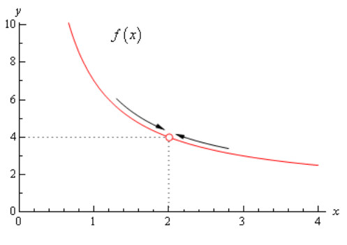
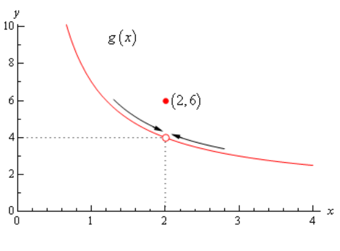
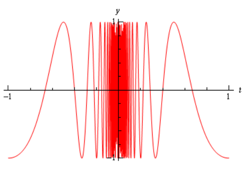
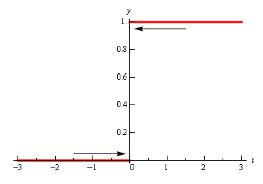
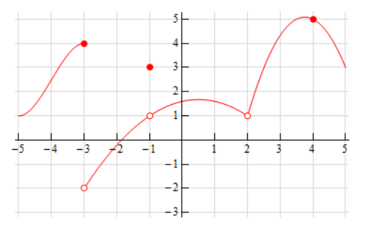
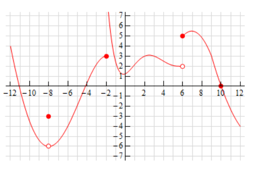
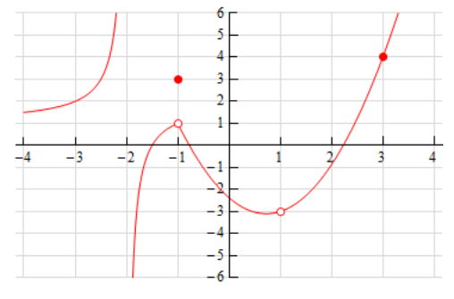
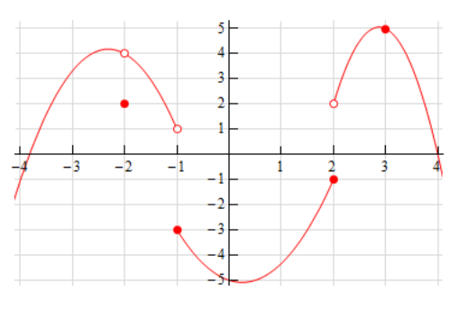
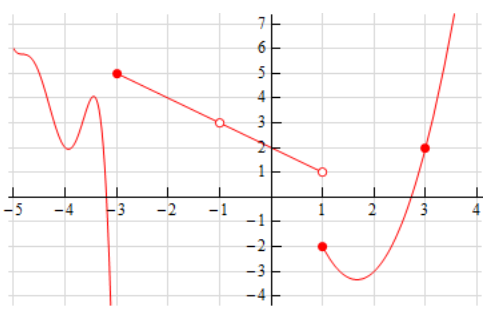
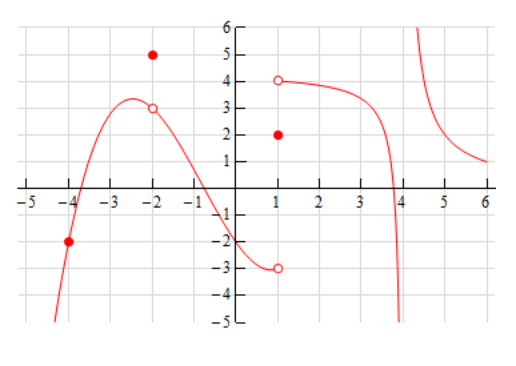

# Section 2.2 : The Limit

In the previous
[section](https://tutorial.math.lamar.edu/Classes/CalcI/Tangents_Rates.aspx) we
looked at a couple of problems and in both problems we had a function (slope in
the tangent problem case and average rate of change in the rate of change
problem) and we wanted to know how that function was behaving at some point
$x = a$. At this stage of the game we no longer care where the functions came
from and we no longer care if we’re going to see them down the road again or
not. All that we need to know or worry about is that we’ve got these functions
and we want to know something about them.

To answer the questions in the last section we choose values of $x$ that got
closer and closer to x=a and we plugged these into the function. We also made
sure that we looked at values of $x$ that were on both the left and the right of
$x = a$. Once we did this we looked at our table of function values and saw what
the function values were approaching as $x$ got closer and closer to $x = a$ and
used this to guess the value that we were after.

This process is called **taking a limit** and we have some notation for this.
The limit notation for the two problems from the last section is,

$$ \lim\limits_{x \to 1}\frac{2 - 2x^2}{x - 1} = -4 \quad \quad \lim\limits_{t \to 5}\frac{t^3 - 6t^2 + 25}{15} $$

In this notation we will note that we always give the function that we’re
working with and we also give the value of $x$ (or $t$) that we are moving in
towards.

In this section we are going to take an intuitive approach to limits and try to
get a feel for what they are and what they can tell us about a function. With
that goal in mind we are not going to get into how we actually compute limits
yet. We will instead rely on what we did in the previous section as well as
another approach to guess the value of the limits.

Both approaches that we are going to use in this section are designed to help us
understand just what limits are. In general, we don’t typically use the methods
in this section to compute limits and in many cases can be very difficult to use
to even estimate the value of a limit and/or will give the wrong value on
occasion. We will look at actually computing limits in a couple of sections.

Let’s first start off with the following “definition” of a limit.

---

**Definition**

> We say that the limit of $f(x)$ is $L$ as $x$ approaches $a$ and write this as
>
> $$ \lim\limits_{x \to a}f(x) = L $$
>
> provided we can make $f(x)$ as close to $L$ as we want for all $x$
> sufficiently close to $a$, from both sides, without actually letting $x$ be
> $a$.

---

This is not the exact, precise definition of a limit. If you would like to see
the more precise and mathematical definition of a limit you should check out the
[The Definition of a Limit](https://tutorial.math.lamar.edu/Classes/CalcI/DefnOfLimit.aspx)
section at the end of this chapter. The definition given above is more of a
“working” definition. This definition helps us to get an idea of just what
limits are and what they can tell us about functions.

So just what does this definition mean? Well let’s suppose that we know that the
limit does in fact exist. According to our “working” definition we can then
decide how close to $L$ that we’d like to make $f(x)$. For sake of argument
let’s suppose that we want to make $f(x)$ no more than 0.001 away from $L$. This
means that we want one of the following

$$ f(x) - L < 0.001 \quad \quad \text{ if } f(x) \text{ is larger than } L $$

$$ L - f(x) < 0.001 \quad \quad \text{ if } f(x) \text{ is smaller than } L $$

Now according to the “working” definition this means that if we get $x$
sufficiently close to $a$ we can make one of the above true. However, it
actually says a little more. It says that somewhere out there in the world is a
value of $x$, say $X$, so that for all $x$'s that are closer to a than $X$ then
one of the above statements will be true.

This is a fairly important idea. There are many functions out there in the world
that we can make as close to $L$ for specific values of $x$ that are close to
$a$, but there will be other values of $x$ closer to a that give functions
values that are nowhere near close to $L$. In order for a limit to exist once we
get $f(x)$ as close to $L$ as we want for some $x$ then it will need to stay in
that close to $L$ (or get closer) for all values of $x$ that are closer to $a$.
We’ll see an
[example](https://tutorial.math.lamar.edu/Classes/CalcI/TheLimit.aspx#Limit_Limit_Ex4)
of this later in this section.

In somewhat simpler terms the definition says that as $x$ gets closer and closer
to $x = a$ (from both sides of course...) then $f(x)$ **must** be getting closer
and closer to $L$. Or, as we move in towards $x = a$ then $f(x)$ **must** be
moving in towards $L$.

It is important to note once again that we must look at values of $x$ that are
on both sides of $x = a$. We should also note that we are not allowed to use
$x = a$ in the definition. We will often use the information that limits give us
to get some information about what is going on right at $x = a$, but the limit
itself is not concerned with what is actually going on at $x = a$. The limit is
only concerned with what is going on around the point $x = a$. This is an
important concept about limits that we need to keep in mind.

An alternative notation that we will occasionally use in denoting limits is

$$ f(x) \rightarrow L \quad \text{ as } \quad x \rightarrow a $$

How do we use this definition to help us estimate limits? We do exactly what we
did in the previous
[section](https://tutorial.math.lamar.edu/Classes/CalcI/Tangents_Rates.aspx). We
take $x$'s on both sides of $x = a$ that move in closer and closer to $a$ and we
plug these into our function. We then look to see if we can determine what
number the function values are moving in towards and use this as our estimate.

Let’s work an example.

---

**Example 1** Estimate the value of the following limit.

$$ \lim\limits_{x \to 2}\frac{x^2 + 4x - 12}{x^2 - 2x} $$

**Solution**

Notice that we did say estimate the value of the limit. Again, we are not going
to directly compute limits in this section. The point of this section is to give
us a better idea of how limits work and what they can tell us about the
function.

So, with that in mind we are going to work this in pretty much the same way that
we did in the last section. We will choose values of $x$ that get closer and
closer to $x = 2$ and plug these values into the function. Doing this gives the
following table of values.

| $x$       | $f(x)$        | $x$       | $f(x)$        |
| --------- | ------------- | --------- | ------------- |
| $2.5$     | $3.4$         | $1.5$     | $5.0$         |
| $2.1$     | $3.857142857$ | $1.9$     | $4.157894737$ |
| $2.01$    | $3.985074627$ | $1.99$    | $4.015075377$ |
| $2.001$   | $3.998500750$ | $1.999$   | $4.001500750$ |
| $2.0001$  | $3.999850007$ | $1.9999$  | $4.000150008$ |
| $2.00001$ | $3.999985000$ | $1.99999$ | $4.000015000$ |

Note that we made sure and picked values of $x$ that were on both sides of
$x = 2$ and that we moved in very close to $x = 2$ to make sure that any trends
that we might be seeing are in fact correct.

Also notice that we can’t actually plug in $x = 2$ into the function as this
would give us a division by zero error. This is not a problem since the limit
doesn’t care what is happening at the point in question.

From this table it appears that the function is going to $4$ as $x$ approaches
$2$, so

$$ \lim\limits_{x \to 2}\frac{x^2 + 4x - 12}{x^2 - 2x} = 4 $$

---

Let’s think a little bit more about what’s going on here. Let’s graph the
function from the last example. The graph of the function in the range of $x$'s
that were interested in is shown below.

First, notice that there is a rather large open dot at $x = 2$. This is there to
remind us that the function (and hence the graph) doesn’t exist at $x = 2$.

As we were plugging in values of $x$ into the function we are in effect moving
along the graph in towards the point as $x = 2$. This is shown in the graph by
the two arrows on the graph that are moving in towards the point.

When we are computing limits the question that we are really asking is what $y$
value is our graph approaching as we move in towards $x = a$ on our graph. We
are **NOT** asking what $y$ value the graph takes at the point in question. In
other words, we are asking what the graph is doing **around** the point $x = a$.
In our case we can see that as $x$ moves in towards 2 (from both sides) the
function is approaching $y = 4$ even though the function itself doesn’t even
exist at $x = 2$. Therefore, we can say that the limit is in fact 4.

So, what have we learned about limits? Limits are asking what the function is
doing **around** $x = a$ and are not concerned with what the function is
actually doing at $x = a$. This is a good thing as many of the functions that
we’ll be looking at won’t even exist at $x = a$ as we saw in our last example.

Let’s work another example to drive this point home.

---

**Example 2** Estimate the value of the following limit.

$$ \lim\limits_{x \to 2}g(x) \quad \quad \text{ where, } \quad \quad g(x) =  \begin{cases} \dfrac{x^2 + 4x - 12}{x^2 - 2x} & \text{if } x \neq 2 \\ 6 & \text{if } x = 2 \end{cases} $$

**Solution**

The first thing to note here is that this is exactly the same function as the
first example with the exception that we’ve now given it a value for $x = 2$.
So, let’s first note that

$$ g(2) = 6 $$

As far as estimating the value of this limit goes, nothing has changed in
comparison to the first example. We could build up a table of values as we did
in the first example or we could take a quick look at the graph of the function.
Either method will give us the value of the limit.

Let’s first take a look at a table of values and see what that tells us. Notice
that the presence of the value for the function at $x = 2$ will not change our
choices for $x$. We only choose values of $x$ that are getting closer to $x = 2$
but we never take $x = 2$. In other words, the table of values that we used in
the first example will be exactly the same table that we’ll use here. So, since
we’ve already got it down once there is no reason to redo it here.

From this table it is again clear that the limit is,

$$ \lim\limits_{x \to 2}g(x) = 4 $$

The limit is **NOT** 6! Remember from the discussion after the first example
that limits do not care what the function is actually doing at the point in
question. Limits are only concerned with what is going on **around** the point.
Since the only thing about the function that we actually changed was its
behavior at $x = 2$ this will not change the limit.

Let’s also take a quick look at this function’s graph to see if this says the
same thing.

Again, we can see that as we move in towards $x = 2$ on our graph the function
is still approaching a $y$ value of $4$. Remember that we are only asking what
the function is doing around $x = 2$ and we don’t care what the function is
actually doing at $x = 2$. The graph then also supports the conclusion that the
limit is,

$$ \lim\limits_{x \to 2}g(x) = 4 $$

---

Let’s make the point one more time just to make sure we’ve got it. Limits are
**not** concerned with what is going on at $x = a$. Limits are only concerned
with what is going on **around** $x = a$. We keep saying this, but it is a very
important concept about limits that we must always keep in mind. So, we will
take every opportunity to remind ourselves of this idea.

Since limits aren’t concerned with what is actually happening at $x = a$ we
will, on occasion, see situations like the previous example where the limit at a
point and the function value at a point are different. This won’t always happen
of course. There are times where the function value and the limit at a point are
the same and we will eventually see some examples of those. It is important
however, to not get excited about things when the function and the limit do not
take the same value at a point. It happens sometimes so we will need to be able
to deal with those cases when they arise.

Let’s take a look another example to try and beat this idea into the ground.

---

**Example 3** Estimate the value of the following limit.

$$ \lim\limits_{\theta \to 0}\frac{1 - \cos(\theta)}{\theta} $$

**Solution**

First don’t get excited about the $\theta$ in function. It’s just a letter, just
like $x$ is a letter! It’s a Greek letter, but it’s a letter and you will be
asked to deal with Greek letters on occasion so it’s a good idea to start
getting used to them at this point.

Now, also notice that if we plug in $\theta = 0$ that we will get division by
zero and so the function doesn’t exist at this point. Actually, we get 0/0 at
this point, but because of the division by zero this function does not exist at
$\theta = 0$.

So, as we did in the first example let’s get a table of values and see what if
we can guess what value the function is heading in towards.

| $\theta$ | $f(\theta)$  | $\theta$ | $f(\theta)$   |
| -------- | ------------ | -------- | ------------- |
| $1$      | $0.45969769$ | $-1$     | $-0.45969769$ |
| $0.1$    | $0.04995835$ | $-0.1$   | $-0.04995835$ |
| $0.01$   | $0.00499996$ | $-0.01$  | $-0.00499996$ |
| $0.001$  | $0.00049999$ | $-0.001$ | $-0.00049999$ |

Okay, it looks like the function is moving in towards a value of zero as
$\theta$ moves in towards 0, from both sides of course.

Therefore, the we will guess that the limit has the value,

$$ \lim\limits_{\theta \to 0}\frac{1 - \cos(\theta)}{\theta} = 0 $$

---

So, once again, the limit had a value even though the function didn’t exist at
the point we were interested in.

It’s now time to work a couple of more examples that will lead us into the next
idea about limits that we’re going to want to discuss.

---

**Example 4** Estimate the value of the following limit.

$$ \lim\limits_{t \to 0}\left(\frac{\pi}{t}\right) $$

**Solution**

Let’s build up a table of values and see what’s going on with our function in
this case.

| $t$     | $f(t)$ | $t$      | $f(t)$ |
| ------- | ------ | -------- | ------ |
| $1$     | $-1$   | $-1$     | $-1$   |
| $0.1$   | $1$    | $-0.1$   | $1$    |
| $0.01$  | $1$    | $-0.01$  | $1$    |
| $0.001$ | $1$    | $-0.001$ | $1$    |

Now, if we were to guess the limit from this table we would guess that the limit
is 1. However, if we did make this guess we would be wrong. Consider any of the
following function evaluations.

$$ f\left(\frac{1}{2001}\right) = -1 \quad \quad f\left(\frac{2}{2001}\right) = 0 \quad \quad f\left(\frac{4}{4001}\right) = \frac{\sqrt{2}}{2} $$

In all three of these function evaluations we evaluated the function at a number
that is less than 0.001 and got three totally different numbers. Recall that the
definition of the limit that we’re working with requires that the function be
approaching a single value (our guess) as $t$ gets closer and closer to the
point in question. It doesn’t say that only some of the function values must be
getting closer to the guess. It says that all the function values must be
getting closer and closer to our guess.

To see what’s happening here a graph of the function would be convenient.

From this graph we can see that as we move in towards $t = 0$ the function
starts oscillating wildly and in fact the oscillations increases in speed the
closer to $t = 0$ that we get. Recall from our definition of the limit that in
order for a limit to exist the function must be settling down in towards a
single value as we get closer to the point in question.

This function clearly does not settle in towards a single number and so this
limit **does not exist**!

---

This last example points out the drawback of just picking values of the variable
and using a table of function values to estimate the value of a limit. The
values of the variable that we chose in the previous example were valid and in
fact were probably values that many would have picked. In fact, they were
exactly the same values we used in the problem before this one and they worked
in that problem!

When using a table of values there will always be the possibility that we aren’t
choosing the correct values and that we will guess incorrectly for our limit.
This is something that we should always keep in mind when doing this to guess
the value of limits. In fact, this is such a problem that after this section we
will never use a table of values to guess the value of a limit again.

This last example also has shown us that limits do not have to exist. To that
point we’ve only seen limits that existed, but that just doesn’t always have to
be the case.

Let’s take a look at one more example in this section.

---

*_Example 5_ Estimate the value of the following limit.

$$ \lim\limits_{t \to 0}H(t) \quad \quad \text{ where, } \quad \quad H(t) =  \begin{cases} 0 & \text{if } t < 0 \\ 1 & \text{if } t \geq 0 \end{cases} $$

**Solution**

This function is often called either the **Heaviside** or **step** function. We
could use a table of values to estimate the limit, but it’s probably just as
quick in this case to use the graph so let’s do that. Below is the graph of this
function.

We can see from the graph that if we approach $t = 0$ from the right side the
function is moving in towards a $y$ value of 1. Well actually it’s just staying
at 1, but in the terminology that we’ve been using in this section it’s moving
in towards 1…

Also, if we move in towards $t = 0$ from the left the function is moving in
towards a $y$ value of 0.

According to our definition of the limit the function needs to move in towards a
single value as we move in towards $t = a$ (from both sides). This isn’t
happening in this case and so in this example we will also say that the limit
doesn’t exist.

Note that the limit in this example is a little different from the previous
example. In the previous example the function did not settle down to a single
number as we moved in towards $t = 0$ . In this example however, the function
does settle down to a single number as $t = 0$ on either side. The problem is
that the number is different on each side of $t = 0$. This is an idea that we’ll
look at in a little more detail in the next section.

---

Let’s summarize what we (hopefully) learned in this section. In the first three
examples we saw that limits do not care what the function is actually doing at
the point in question. They only are concerned with what is happening around the
point. In fact, we can have limits at $x = a$ even if the function itself does
not exist at that point. Likewise, even if a function exists at a point there is
no reason (at this point) to think that the limit will have the same value as
the function at that point. Sometimes the limit and the function will have the
same value at a point and other times they won’t have the same value.

Next, in the third and fourth examples we saw the main reason for not using a
table of values to guess the value of a limit. In those examples we used exactly
the same set of values, however they only worked in one of the examples. Using
tables of values to guess the value of limits is simply not a good way to get
the value of a limit. This is the only section in which we will do this. Tables
of values should always be your last choice in finding values of limits.

The last two examples showed us that not all limits will in fact exist. We
should not get locked into the idea that limits will always exist. In most
calculus courses we work with limits that almost always exist and so it’s easy
to start thinking that limits always exist. Limits don’t always exist and so
don’t get into the habit of assuming that they will.

Finally, we saw in the fourth example that the only way to deal with the limit
was to graph the function. Sometimes this is the only way, however this example
also illustrated the drawback of using graphs. In order to use a graph to guess
the value of the limit you need to be able to actually sketch the graph. For
many functions this is not that easy to do.

There is another drawback in using graphs. Even if you have the graph it’s only
going to be useful if the y value is approaching an integer. If the $y$ value is
approaching say $\frac{-15}{123}$ there is no way that you’re going to be able
to guess that value from the graph and we are usually going to want exact values
for our limits.

So, while graphs of functions can, on occasion, make your life easier in
guessing values of limits they are again probably not the best way to get values
of limits. They are only going to be useful if you can get your hands on it and
the value of the limit is a “nice” number.

The natural question then is why did we even talk about using tables and/or
graphs to estimate limits if they aren’t the best way. There were a couple of
reasons.

First, they can help us get a better understanding of what limits are and what
they can tell us. If we don’t do at least a couple of limits in this way we
might not get all that good of an idea on just what limits are.

The second reason for doing limits in this way is to point out their drawback so
that we aren’t tempted to use them all the time!

We will eventually talk about how we really do limits. However, there is one
more topic that we need to discuss before doing that. Since this section has
already gone on for a while we will talk about this in the next section.

---

## Practice Problems

**1.** For the function $f(x) = \dfrac{8 - x^3}{x^2 - 4}$ answer each of the
following questions.

**(a)** Evaluate the function at the following values of $x$ compute (accurate
to at least 8 decimal places).

**(i)** $2.5$ **(ii)** $2.1$ **(iii)** $2.01$ **(iv)** $2.001$ **(v)** $2.0001$

**(vi)** $1.5$ **(vii)** $1.9$ **(viii)** $1.99$ **(ix)** $1.999$ **(x)**
$1.9999$

**Solution**

**(b)** Use the information from **(a)** to estimate the value of
$\lim\limits_{\to 2}\dfrac{8 - x^3}{x^2 - 4}$.

**Solution**

**2.** For the function $R(t) = \dfrac{2 - \sqrt{t^2 + 3}}{t + 1}$ answer each
of the following questions.

**(a)** Evaluate the function at the following values of $t$ compute (accurate
to at least 8 decimal places).

**(i)** $-0.5$ **(ii)** $-0.9$ **(iii)** $-0.99$ **(iv)** $-0.999$ **(v)**
$-0.9999$

**(vi)** $-1.5$ **(vii)** $-1.1$ **(viii)** $-1.01$ **(ix)** $-1.001$ **(x)**
$-1.0001$

**Solution**

**(b)** Use the information from **(a)** to estimate the value of
$\lim\limits_{t \to -1}\dfrac{2 - \sqrt{t^2 + 3}}{t + 1}$.

**Solution**

**3.** For the function $g(\theta) = \dfrac{\sin(7\theta)}{\theta}$ answer each
of the following questions.

**(a)** Evaluate the function at the following values of $\theta$ compute
(accurate to at least 8 decimal places).

**(i)** $0.5$ **(ii)** $0.1$ **(iii)** $0.01$ **(iv)** $0.001$ **(v)** $0.0001$

**(vi)** $-0.5$ **(vii)** $-0.1$ **(viii)** $-0.01$ **(ix)** $-0.001$ **(x)**
$-0.0001$

**Solution**

**(b)** Use the information from **(a)** to estimate the value of
$\lim\limits_{\theta \to 0}\dfrac{\sin(7\theta)}{\theta}$.

**Solution**

**4.** Below is the graph of $f(x)$. For each of the given points determine the
value of $f(a)$ and $\lim\limits_{x \to a}f(x)$. If any of the quantities do not
exist clearly explain why.

**(a)** $a = -3$

**Solution**

**(b)** a = -1$$

**Solution**

**\(c\)** $a = 2$

**Solution**

**(d)** $a = 4$

**5.** Below is the graph of $f(x)$. For each of the given points determine the
value of $f(a)$ and $\lim\limits_{x \to a}f(x)$. If any of the quantities do not
exist clearly explain why.

**(a)** $a = -8$

**Solution**

**(b)** a = -2$$

**Solution**

**\(c\)** $a = 6$

**Solution**

**(d)** $a = 10$

**6.** Below is the graph of $f(x)$. For each of the given points determine the
value of $f(a)$ and $\lim\limits_{x \to a}f(x)$. If any of the quantities do not
exist clearly explain why.

**(a)** $a = -2$

**Solution**

**(b)** a = -1$$

**Solution**

**\(c\)** $a = 1$

**Solution**

**(d)** $a = 3$

---

## Assignment Problems

**1.** For the function $g(x) = \dfrac{x^2 + 6x + 9}{x^2 + 3x}$ answer each of
the following questions.

**(a)** Evaluate the function at the following values of $x$ compute (accurate
to at least 8 decimal places).

**(i)** $-2.5$ **(ii)** $-2.9$ **(iii)** $-2.99$ **(iv)** $-2.999$ **(v)**
$-2.9999$

**(vi)** $-3.5$ **(vii)** $-3.1$ **(viii)** $-3.01$ **(ix)** $-3.001$ **(x)**
$-3.0001$

**Solution**

**(b)** Use the information from **(a)** to estimate the value of
$\lim\limits_{x \to -3}\dfrac{x^2 + 6x + 9}{x^2 + 3x}$.

**Solution**

**2.** For the function $f(z) = \dfrac{10z - 9 - z^2}{z^2 - 1}$ answer each of
the following questions.

**(a)** Evaluate the function at the following values of $z$ compute (accurate
to at least 8 decimal places).

**(i)** $1.5$ **(ii)** $1.1$ **(iii)** $1.01$ **(iv)** $1.001$ **(v)** $1.0001$

**(vi)** $0.5$ **(vii)** $0.9$ **(viii)** $0.99$ **(ix)** $0.999$ **(x)**
$0.9999$

**Solution**

**(b)** Use the information from **(a)** to estimate the value of
$\lim\limits_{z \to 1}\dfrac{10z - 9 - z^2}{z^2 - 1}$.

**Solution**

**3.** For the function $h(t) = \dfrac{2 - \sqrt{4 + 2t}}{t}$ answer each of the
following questions.

**(a)** Evaluate the function at the following values of $t$ compute (accurate
to at least 8 decimal places).

**(i)** $0.5$ **(ii)** $0.1$ **(iii)** $0.01$ **(iv)** $0.001$ **(v)** $0.0001$

**(vi)** $-0.5$ **(vii)** $-0.1$ **(viii)** $-0.01$ **(ix)** $-0.001$ **(x)**
$-0.0001$

**Solution**

**(b)** Use the information from **(a)** to estimate the value of
$\lim\limits_{t \to 0}\dfrac{2 - \sqrt{4 + 2t}}{t}$.

**Solution**

**4.** For the function $g(\theta) = \dfrac{\cos(\theta - 4) - 1}{2\theta - 8}$
answer each of the following questions.

**(a)** Evaluate the function at the following values of $\theta$ compute
(accurate to at least 8 decimal places). Make sure your calculator is set to
radians for the computations.

**(i)** $4.5$ **(ii)** $4.1$ **(iii)** $4.01$ **(iv)** $4.001$ **(v)** $4.0001$

**(vi)** $3.5$ **(vii)** $3.9$ **(viii)** $3.99$ **(ix)** $3.999$ **(x)**
$3.9999$

**Solution**

**(b)** Use the information from **(a)** to estimate the value of
$\lim\limits_{\theta \to 4}\dfrac{\cos(\theta - 4) - 1}{2\theta - 8}$.

**Solution**

**5.** Below is the graph of $f(x)$. For each of the given points determine the
value of $f(a)$ and $\lim\limits_{x \to a}f(x)$. If any of the quantities do not
exist clearly explain why.

**(a)** $a = -2$

**Solution**

**(b)** a = -1$$

**Solution**

**\(c\)** $a = 2$

**Solution**

**(d)** $a = 3$

**6.** Below is the graph of $f(x)$. For each of the given points determine the
value of $f(a)$ and $\lim\limits_{x \to a}f(x)$. If any of the quantities do not
exist clearly explain why.

**(a)** $a = -3$

**Solution**

**(b)** a = -1$$

**Solution**

**\(c\)** $a = 1$

**Solution**

**(d)** $a = 3$

**7.** Below is the graph of $f(x)$. For each of the given points determine the
value of $f(a)$ and $\lim\limits_{x \to a}f(x)$. If any of the quantities do not
exist clearly explain why.

**(a)** $a = -4$

**Solution**

**(b)** a = -2$$

**Solution**

**\(c\)** $a = 1$

**Solution**

**(d)** $a = 4$

**8.** Explain in your own words what the following equation means.

$$ \lim\limits_{x \to 12}f(x) = 6 $$

**9.** Suppose we know that $\lim\limits_{x \to -7}f(x) = 18$. If possible,
determine the value of $f(-7)$. If it is not possible to determine the value
explain why not.

**10.** Is it possible to have $\lim\limits_{x \to 1}f(x) = -23$ and
$f(1) = 107$? Explain your answer.
