# Section 2.3 : One-Sided Limits

In the final two examples in the previous
[section](https://tutorial.math.lamar.edu/Classes/CalcI/TheLimit.aspx#Limit_Limit_Ex4)
we saw two limits that did not exist. However, the reason for each of the limits
not existing was different for each of the examples.

We saw that

$$ \lim\limits_{t \to 0}\cos\left(\frac{\pi}{t}\right) $$

did not exist because the function did not settle down to a single value as $t$
approached $t = 0$. The closer to $t = 0$ we moved the more wildly the function
oscillated and in order for a limit to exist the function must settle down to a
single value.

However, we saw that

$$ \lim\limits_{t \to 0}H(t) \quad \quad \text{ where, } \quad \quad H(t) = \begin{cases} 0 & \text{if } t < 0 \\ 1 & \text{if } t \geq 0 \end{cases} $$

did not exist not because the function didn’t settle down to a single number as
we moved in towards $t = 0$, but instead because it settled into two different
numbers depending on which side of $t = 0$ we were on.

In this case the function was a very well-behaved function, unlike the first
function. The only problem was that, as we approached $t = 0$, the function was
moving in towards different numbers on each side. We would like a way to
differentiate between these two examples.

We do this with **one-sided limits**. As the name implies, with one-sided limits
we will only be looking at one side of the point in question. Here are the
definitions for the two one sided limits.

---

**Right-handed limit**

> We say
>
> $$ \lim\limits_{x \to a^+}f(x) = L $$
>
> provided we can make $f(x)$ as close to $L$ as we want for all $x$
> sufficiently close to $a$ with $x > a$ without actually letting $x$ be $a$.

---

**Left-handed limit**

> We say
>
> $$ \lim\limits_{x \to a^-}f(x) = L $$
>
> provided we can make $f(x)$ as close to $L$ as we want for all $x$
> sufficiently close to $a$ with $x < a$ without actually letting $x$ be $a$.

---

Note that the change in notation is very minoir and in fact might be missed if
you aren't paying attention. The only difference is the bit that is under the
"lim" part of the limit. For the right-handed limit we now have
$x \rightarrow a^+$ (note the "+") which means that we will only look at
$x > a$. Likewise, for the left-handed limit we haev $x \rightarrow a^-$ (note
the "-") which means that we will only be looking at $x < a$.

Also, note that as with the “normal” limit (_i.e._ the limits from the previous
section) we still need the function to settle down to a single number in order
for the limit to exist. The only difference this time is that the function only
needs to settle down to a single number on either the right side of $x = a$ or
the left side of $x = a$ depending on the one‑sided limit we’re dealing with.

So, when we are looking at limits it’s now important to pay very close attention
to see whether we are doing a normal limit or one of the one-sided limits. Let’s
now take a look at the some of the problems from the last section and look at
one-sided limits instead of the normal limit.

---

**Example 1** Estimate the value of the following limits.

$$ \lim\limits_{t \to 0^+}H(t) \quad \quad \text{ and } \quad \quad \lim\limits_{t \to 0^-}H(t) \quad \quad \text{ where } \quad \quad H(t) = \begin{cases} 0 & \text{if } t < 0 \\ 1 & \text{if } t \geq 0 \end{cases} $$

**Solution**;

To remind us what this function looks like here’s the graph.

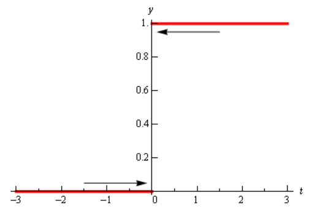

So, we can see that if we stay to the right of $t = 0$ (_i.e._ $t > 0$) then the
function is moving in towards a value of 1 as we get closer and closer to
$t = 0$, but staying to the right. We can therefore say that the right-handed
limit is,

$$ \lim\limits_{t \to 0^-}H(t) = 0 $$

In this example we do get one-sided limits even though the normal limit itself
doesn’t exist.

---

**Example 2** Estimate the value of the following limits.

$$ \lim\limits_{t \to 0^+}\cos\left(\frac{\pi}{t}\right) \quad \quad \lim\limits_{t \to 0^-}\cos\left(\frac{\pi}{t}\right) $$

**Solution**

From the graph of this function shown below,

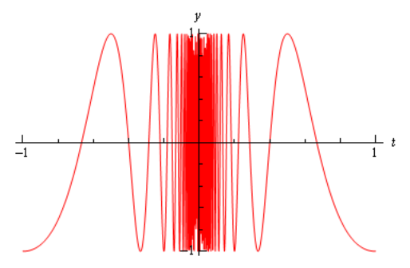

we can see that both of the one-sided limits suffer the same problem that the
normal limit did in the previous section. The function does not settle down to a
single number on either side of $t = 0$. Therefore, neither the left-handed nor
the right-handed limit will exist in this case.

---

So, one-sided limits don’t have to exist just as normal limits aren’t guaranteed
to exist.

Let’s take a look at another example from the previous section.

---

**Example 3** Estimate the value of the following limits.

$$ \lim\limits_{x \to 2^+}g(x) \quad \quad \text{ and } \quad \quad \lim\limits_{x \to 2^-}g(x) \quad \quad \text{ where } \quad \quad g(x) = \begin{cases} \dfrac{x^2 + 4x - 12 }{x^2 - 2x}& \text{if } x \neq 2 \\ 6 & \text{if } x = 2 \end{cases} $$

**Solution**

So, as we’ve done with the previous two examples, let’s remind ourselves of the
graph of this function.

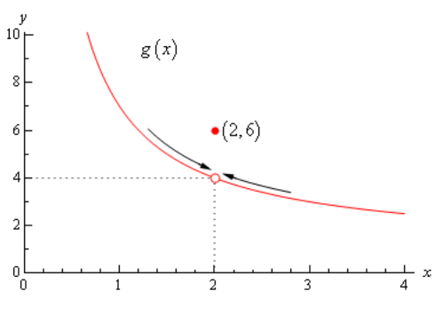

In this case regardless of which side of $x = 2$ we are on the function is
always approaching a value of 4 and so we get,

$$ \lim\limits_{x \to 2^+}g(x) = 4 \quad \quad \lim\limits_{x \to 2^-}g(x) = 4 $$

---

Note that one-sided limits do not care about what’s happening at the point any
more than normal limits do. They are still only concerned with what is going on
around the point. The only real difference between one-sided limits and normal
limits is the range of $x$'s that we look at when determining the value of the
limit.

Now let’s take a look at the first and last example in this section to get a
very nice fact about the relationship between one-sided limits and normal
limits. In the last example the one-sided limits as well as the normal limit
existed and all three had a value of 4. In the first example the two one-sided
limits both existed, but did not have the same value and the normal limit did
not exist.

The relationship between one-sided limits and normal limits can be summarized by
the following fact.

---

**Fact**

> Given a function $f(x)$ if,
>
> $$ \lim\limits_{x \to a^+}f(x) = \lim\limits_{x \to a^-}f(x) = L $$
>
> then the normal limit will exist and
>
> $$ \lim\limits_{x \to a}f(x) = L $$
>
> Likewise, if
>
> $$ \lim\limits_{x \to a}f(x) = L $$
>
> then,
>
> $$ \lim\limits_{x \to a^+}f(x) = \lim\limits_{x \to a^-}f(x) = L $$

---

This fact can be turned around to also say that if the two one-sided limits have
different values, _i.e._,

$$ \lim\limits_{x \to a^+}f(x) \neq \lim\limits_{x \to a^-}f(x) $$

then the normal limit will not exist.

This should make some sense. If the normal limit did exist then by the fact the
two one-sided limits would have to exist and have the same value by the above
fact. So, if the two one-sided limits have different values (or don’t even
exist) then the normal limit simply can’t exist.

Let’s take a look at one more example to make sure that we’ve got all the ideas
about limits down that we’ve looked at in the last couple of sections.

---

**Example 4** Given the following graph,

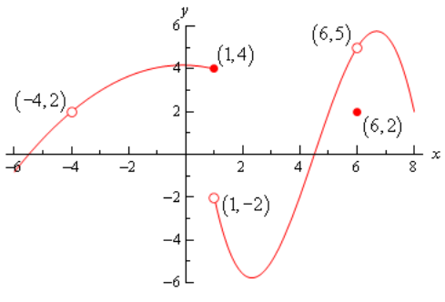

compute each of the following.

**(a)** $f(-4)$ **(b)** $\lim\limits_{x \to 4^-}f(x)$ **\(c\)**
$\lim\limits_{x \to -4^+}f(x)$ **(d)** $\lim\limits_{x \to -4}f(x)$

**(e)** $f(1)$ **(f)** $\lim\limits_{x \to 1^-}f(x)$ **(g)**
$\lim\limits_{x \to 1^+}f(x)$ **(h)** $\lim\limits_{x \to 1}f(x)$

**(i)** $f(6)$ **(j)** $\lim\limits_{x \to 6^-}f(x)$ **(k)**
$\lim\limits_{x \to 6^+}f(x)$ **(l)** $\lim\limits_{x \to 6}f(x)$

**Solution**

**(a)** $f(−4)$ doesn’t exist. There is no closed dot for this value of $x$ and
so the function doesn’t exist at this point.

**(b)** $\lim\limits_{x \to -4^-}f(x) = 2$ The function is approaching a value
of 2 as $x$ moves in towards -4 from the left.

**\(c\)** $\lim\limits_{x \to -4^+}f(x) = 2$ The function is approaching a value
of 2 as $x$ moves in towards -4 from the right.

**(d)** $\lim\limits_{x \to -4}f(x) = 2$ We can do this one of two ways. Either
we can use the fact here and notice that the two one-sided limits are the same
and so the normal limit must exist and have the same value as the one-sided
limits or just get the answer from the graph.

Also recall that a limit can exist at a point even if the function doesn’t exist
at that point.

**(e)** $f(1) = 4$. The function will take on the $y$ value where the closed dot
is.

**(f)** $\lim\limits_{x \to 1^-}f(x) = 4$ The function is approaching a value of
4 as $x$ moves in towards 1 from the left.

**(g)** $\lim\limits_{x \to 1^+}f(x) = -2$ The function is approaching a value
of -2 as $x$ moves in towards 1 from the right. Remember that the limit does NOT
care about what the function is actually doing at the point, it only cares about
what the function is doing around the point. In this case, always staying to the
right of $x = 1$, the function is approaching a value of -2 and so the limit is
-2. The limit is not 4, as that is value of the function at the point and again
the limit doesn’t care about that!

**(h)** $\lim\limits_{x \to 1}f(x)$ doesn’t exist. The two one-sided limits both
exist, however they are different and so the normal limit doesn’t exist.

**(i)** $f(6) = 2$. The function will take on the $y$ value where the closed dot
is.

**(j)** $\lim\limits_{x \to 6^-}f(x) = 5$ The function is approaching a value of
5 as $x$ moves in towards 6 from the left.

**(k)** $\lim\limits_{x \to 6^+}f(x) = 5$ The function is approaching a value of
5 as $x$ moves in towards 6 from the right.

**(l)** $\lim\limits_{x \to 6}f(x) = 5$ Again, we can use either the graph or
the fact to get this. Also, once more remember that the limit doesn’t care what
is happening at the point and so it’s possible for the limit to have a different
value than the function at a point. When dealing with limits we’ve always got to
remember that limits simply do not care about what the function is doing at the
point in question. Limits are only concerned with what the function is doing
around the point.

---

Hopefully over the last couple of sections you’ve gotten an idea on how limits
work and what they can tell us about functions. Some of these ideas will be
important in later sections so it’s important that you have a good grasp on
them.

---

## Practice Problems

**1.** Below is the graph of $f(x)$. For each of the given points determine the
value of $f(a)$, $\lim\limits_{x \to a^-}f(x)$, $\lim\limits_{x \to a^+}f(x)$,
and $\lim\limits_{x \to a}f(x)$. If any of the quantities do not exist clearly
explain why.

**(a)** $a = -4$ **(b)** $a = -1$ **\(c\)** $a = 2$ **(d)** $a = 4$

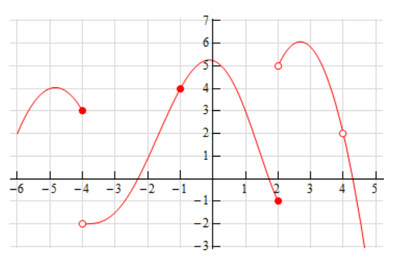

**Solution**

**(a)** $a = -4$

$$ f(-4) = 3 $$

$$ \lim\limits_{x \to -4^-}f(x) = 3 $$

$$ \lim\limits_{x \to -4^+}f(x) = -2 $$

$$ \lim\limits_{x \to -4}f(x) = \text{does not exist}$$

Explanation:

There is a break in the graph's line at $f(-4)$, and while the line does exist
to the left and right as $x \rightarrow -4$, it is not continuous and therefore
there is no meaningful limit to be derived. It does not exist.

**(b)** $a = -1$

$$ f(-1) = 4 $$

$$ \lim\limits_{x \to -1^-}f(x) = 4 $$

$$ \lim\limits_{x \to -1^+}f(x) = 4 $$

$$ \lim\limits_{x \to -1}f(x) = 4 $$

**\(c\)** $a = 2$

$$ f(2) = -1 $$

$$ \lim\limits_{x \to 2^-}f(x) = -1 $$

$$ \lim\limits_{x \to 2^+}f(x) = 5 $$

$$ \lim\limits_{x \to 2}f(x) = \text{does not exist} $$

Explanation:

Like in part **(a)**, the graph's line breaks, this time at $f(2)$. While there
are defined one-sided limits coming from the graph on both the left and right
sides, as $x \rightarrow 2$, due to the break in the graph's line, this limit is
not defined.

**(d)** $a = 4$

$$ f(4) = \text{does not exist}$$

Explanation: There is a hole at $f(4)$ breaking a continuous line, indicating
that this point does not exist along $f(x)$.

$$ \lim\limits_{x \to 4^-}f(x) = 2 $$

$$ \lim\limits_{x \to 4^+}f(x) = 2 $$

$$ \lim\limits_{x \to 4}f(x) = 2 $$

**2.** Below is the graph of $f(x)$. For each of the given points determine the
value of $f(a)$, $\lim\limits_{x \to a^-}f(x)$, $\lim\limits_{x \to a^+}f(x)$,
and $\lim\limits_{x \to a}f(x)$. If any of the quantities do not exist clearly
explain why.

**(a)** $a = -2$ **(b)** $a = 1$ **\(c\)** $a = 3$ **(d)** $a = 5$

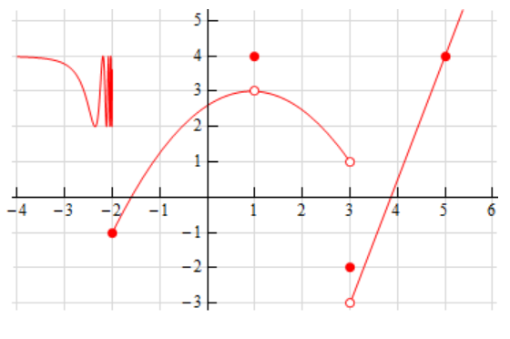

**Solution**

**(a)** $a = -2$

$$ f(-2) = -1 $$

$$ \lim\limits_{x \to -2^-}f(x) = \text{does not exist} $$

Explanation: As $x \to -2^-$, the graph oscillates indicating some sort of
trigonometric component to our function at this interval. This makes a
consistent behavior impossible to ascertain and therefore the left sided limit
does not exist.

$$ \lim\limits_{x \to -2^+}f(x) = -1 $$

$$ \lim\limits_{x \to -2}f(x) = \text{does not exist}$$

Explanation: In order for a limit to be defined, both of its one-sided limits
must have the same value, which is not the case here. Therefore the limit does
not exist.

**(b)** $a = 1$

$$ f(1) = 4 $$

$$ \lim\limits_{x \to 1^-}f(x) = 3 $$

$$ \lim\limits_{x \to 1^+}f(x) = 3 $$

$$ \lim\limits_{x \to 1}f(x) = 3 $$

**\(c\)** $a = 3$

$$ f(3) = -2 $$

$$ \lim\limits_{x \to 3^-}f(x) = 1 $$

$$ \lim\limits_{x \to 3^+}f(x) = -3 $$

$$ \lim\limits_{x \to 3}f(x) = \text{does not exist} $$

Explanation: The left and right hand sided limits have differing values, which
negates the fact mentioned in the notes that for a limit to exist, both of its
one-sided limits must have the same value. Therefore, this limit does not exist.

**(d)** $a = 5$

$$ f(5) = 4 $$

$$ \lim\limits_{x \to 5^-}f(x) = 4 $$

$$ \lim\limits_{x \to 5^+}f(x) = 4 $$

$$ \lim\limits_{x \to 5}f(x) = 4 $$

**3.** Sketch a graph of a function that satisfies each of the following
conditions.

$$ \lim\limits_{x \to 2^-}f(x) = 1 \quad \quad \lim\limits_{x \to 2^+}f(x) = -4 \quad \quad f(2) = 1 $$

**Solution**

Note that you can sketch this anyway you like as long as the constraints of the
problem are followed.

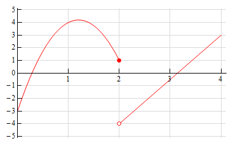

**4.** Sketch a graph of a function that satisfies each of the following
conditions.

$$ \lim\limits_{x \to 3^-}f(x) = 0 \quad \quad \lim\limits_{x \to 3^+}f(x) = 4 \quad \quad f(3) \text{ does not exist} $$

$$ \lim\limits_{x \to -1}f(x) = -3 \quad \quad f(-1) = 2 $$

**Solution**

Note that you can sketch this anyway you like as long as the constraints of the
problem are followed.

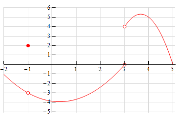

---

## Assignment Problems

**1.** Below is the graph of $f(x)$. For each of the given points determine the
value of $f(a)$, $\lim\limits_{x \to a^-}f(x)$, $\lim\limits_{x \to a^+}f(x)$,
and $\lim\limits_{x \to a}f(x)$. If any of the quantities do not exist clearly
explain why.

**(a)** $a = -5$ **(b)** $a = -2$ **\(c\)** $a = 1$ **(d)** $a = 4$

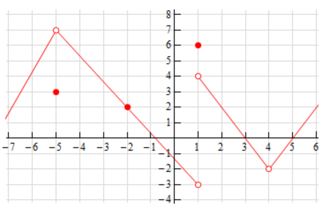

**Solution**

**(a)** $a = -5$

$$ f(-5) = 3 $$

$$ \lim\limits_{x \to -5^-}f(x) = 7 $$

$$ \lim\limits_{x \to -5^+}f(x) = 7 $$

$$ \lim\limits_{x \to -5}f(x) = 7 $$

**(b)** $a = -2$

$$ f(-2) = 2 $$

$$ \lim\limits_{x \to -2^-}f(x) = 2 $$

$$ \lim\limits_{x \to -2^+}f(x) = 2 $$

$$ \lim\limits_{x \to -2}f(x) = 2 $$

**\(c\)** $a = 1$

$$ f(1) = 6 $$

$$ \lim\limits_{x \to 1^-}f(x) = -3 $$

$$ \lim\limits_{x \to 1^+}f(x) = 4 $$

$$ \lim\limits_{x \to 1}f(x) = \text{does not exist} $$

Explanation: The graph's line breaks at $f(1)$, and while there is a
one-sided-limit coming from the left and a one-sided-limit coming from the
right, and there is even a point at $f(1)$, there is no consistent limit
behavior coming from **both** sides of the limit (_i.e._ both one-sided limits
are not equal), and therefore this limit does not exist.

**(d)** $a = 4$

$$ f(4) = \text{does not exist} $$

Explanation: There is a hole at this point in the graph with no other point at
$f(4)$. Therefore this point does not exist.

$$ \lim\limits_{x \to 4^-}f(x) = -2 $$

$$ \lim\limits_{x \to 4^+}f(x) = -2 $$

$$ \lim\limits_{x \to 4}f(x) = -2 $$

**2.** Below is the graph of $f(x)$. For each of the given points determine the
value of $f(a)$, $\lim\limits_{x \to a^-}f(x)$, $\lim\limits_{x \to a^+}f(x)$,
and $\lim\limits_{x \to a}f(x)$. If any of the quantities do not exist clearly
explain why.

**(a)** $a = -1$ **(b)** $a = 1$ **\(c\)** $a = 3$

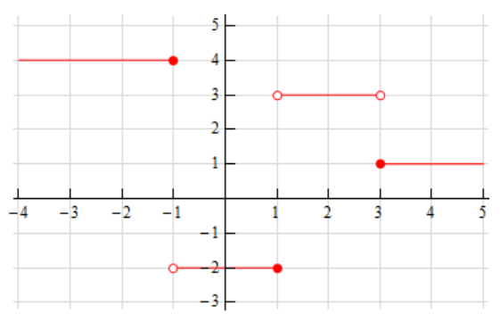

**Solution**

**(a)** $a = -1$

$$ f(-1) = 4 $$

$$ \lim\limits_{x \to -1^-}f(x) = 4 $$

$$ \lim\limits_{x \to -1^+}f(x) = -2 $$

$$ \lim\limits_{x \to -1}f(x) = \text{does not exist} $$

Explanation: The graph's line breaks at $f(-1)$, and while there are indeed both
left and right one-sided limits at $f(-1)$, they are not equivalent, and so
therefore the limit does not exist.

**(b)** $a = 1$

$$ f(1) = -2 $$

$$ \lim\limits_{x \to 1^-}f(x) = -2 $$

$$ \lim\limits_{x \to 1^+}f(x) = 3 $$

$$ \lim\limits_{x \to 1}f(x) = \text{does not exist} $$

Explanation: Much like in part **(a)**, we have a break in the graph's line.
This time at $f(1)$, and again, while we have both defined left and right
one-sided-limits, they are not equivalent, so therefore the limit does not
exist.

**\(c\)** $a = 3$

$$ f(3) = 1 $$

$$ \lim\limits_{x \to 3^-}f(x) = 3 $$

$$ \lim\limits_{x \to 3^+}f(x) = 1 $$

$$ \lim\limits_{x \to 3}f(x) = \text{does not exist} $$

Explanation: This is for the same reasons mentioned in parts **(a)** and
**(b)**. Once again we have a break in the graph's line, this time at $f(3)$,
and again, while we have both left and right one-sided-limits, they are not
equivalent, and so therefore the limit does not exist.

**3.** Below is the graph of $f(x)$. For each of the given points determine the
value of $f(a)$, $\lim\limits_{x \to a^-}f(x)$, $\lim\limits_{x \to a^+}f(x)$,
and $\lim\limits_{x \to a}f(x)$. If any of the quantities do not exist clearly
explain why.

**(a)** $a = -3$ **(b)** $a = -1$ **\(c\)** $a = 1$ **(d)** $a = 2$

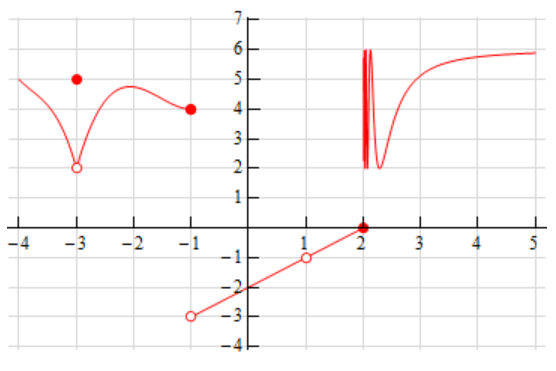

**Solution**

**(a)** $a = -3$

$$ f(-3) = 5 $$

$$ \lim\limits_{x \to -3^-}f(x) = 2 $$

$$ \lim\limits_{x \to -3^+}f(x) = 2 $$

$$ \lim\limits_{x \to -3}f(x) = 2 $$

**(b)** $a = -1$

$$ f(-1) = 4 $$

$$ \lim\limits_{x \to -1^-}f(x) = 4 $$

$$ \lim\limits_{x \to -1^+}f(x) = -3 $$

$$ \lim\limits_{x \to -1}f(x) = \text{does not exist} $$

Explanation: While we have a point that exists for $f(-1)$, and two
one-sided-limits that exist for $x \to -1$, the two one-sided limits differ in
their values, and therefore the limit does not exist.

**\(c\)** $a = 1$

$$ f(1) = \text{ does not exist} $$

Explanation: There is a hole in the graph at $f(1)$, and therefore the point
does not exist.

$$ \lim\limits_{x \to 1^-}f(x) = -1 $$

$$ \lim\limits_{x \to 1^+}f(x) = -1 $$

$$ \lim\limits_{x \to 1}f(x) = -1 $$

**(d)** $a = 2$

$$ f(2) = 0 $$

$$ \lim\limits_{x \to 2^-}f(x) = 0 $$

$$ \lim\limits_{x \to 2^+}f(x) = \text{does not exist} $$

Explanation: As $x \to 2^+$, the graph oscillates, indicating some kind of
trigonometric function perhaps. This means that there is no consistent behavior
to the graph as $x \to 2^+$, and therefore this one-sided-limit does not exist.

$$ \lim\limits_{x \to 2}f(x) = \text{does not exist} $$

Explanation: Because the left and right side limits are not the same value
(_i.e._ one is 0 and the other does not exist), we can therefore ascertain that
the limit does not exist.

**4.** Sketch a graph of a function that satisfies each of the following
conditions.

$$ \lim\limits_{x \to 1^-}f(x) = -2 \quad \quad \lim\limits_{x \to 1^+}f(x) = 3 \quad \quad f(1) = 6 $$

**Solution**

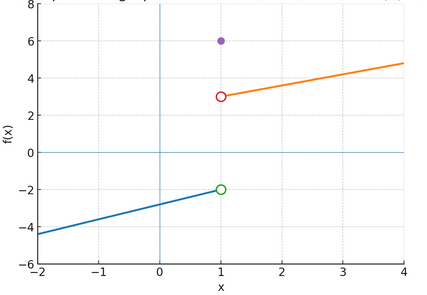

**5.** Sketch a graph of a function that satisfies each of the following
conditions.

$$ \lim\limits_{x \to -3^-}f(x) = 1 \quad \quad \lim\limits_{x \to -3^+}f(x) = 1 \quad \quad f(-3) = 4 $$

**Solution**

Done in sketchbook.

**6.** Sketch a graph of a function that satisfies each of the following
conditions.

$$ \lim\limits_{x \to -5^-}f(x) = -1 \quad \quad \lim\limits_{x \to -5^+}f(x) = 7 \quad \quad f(-5) = 4 $$

$$ \lim\limits_{x \to 4}f(x) = 6 \quad \quad f(4) \text{ does not exist } $$

**Solution**

Done in sketchbook.

**7.** Explain in your own words what each of the following equations mean.

$$ \lim\limits_{x \to 8^-}f(x) = 3 \quad \quad \lim\limits_{x \to 8^+}f(x) = -1 $$

**Solution**

These are two one-sided-limits. The first one-sided limit essentially says "As
$x$ approaches $8$ from the left side of the graph for the function $f(x)$, the
function appears to approach the value of $3$". The second one-sided limit
essentially says, "As $x$ approaches $8$ from the right side of the graph for
the function $f(x)$, the function appears to appraoch the value of $-1$."

**8.** Suppose we know that $\lim\limits_{x \to -7}f(x) = 18$. If possible,
determine the value of $\lim\limits_{x \to -7^-}f(x)$ and the value of
$\lim\limits_{x \to -7^+}f(x)$. If it is not possible to determine one or both
of these values explain why not.

**Solution**

This is possible, whenever a limit can be successfully ascertained, as is
expressed here, it means unequivocally that both the left and right handed
one-sided-limits will have the same value as well. In fact, a limit cannot exist
unless both its one-sided-limits have the same value. This means that:

$$ \lim\limits_{x \to -7^-}f(x) = 18 $$

And also that:

$$ \lim\limits_{x \to -7^+}f(x) = 18 $$

**9.** Suppose we know that $f(6) = -53$. If possible, determine the value of
$\lim\limits_{x \to 6^-}f(x)$ and the value of $\lim\limits_{x \to 6^+}f(x)$. If
it is not possible to determine one or both of these values explain why not.

**Solution**

This is not possible. Just because we know the value of a specific point for
$f(x)$, specifically that $f(6) = -53$ does not mean that we know anything about
the limit of that function as $x \to 6$. If we don't know anything about the
behavior of $f(x)$ as $x \to 6$, we certainly don't know anything about the
behavior of its one-sided-limits without additional data points.
