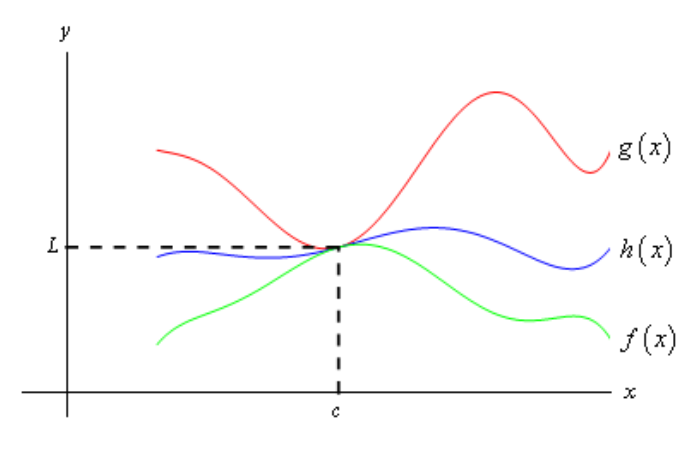
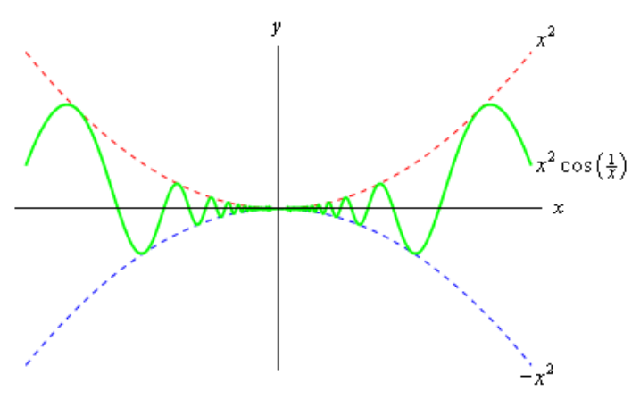

# Section 2.5 Computing Limits

In the previous
[section](https://tutorial.math.lamar.edu/Classes/CalcI/LimitsProperties.aspx#Cts_Fcns_List)
we saw that there is a large class of functions that allows us to use

$$ \lim\limits_{x \to a}f(x) = f(a) $$

to compute limits. However, there are also many limits for which this won’t work
easily. The purpose of this section is to develop techniques for dealing with
some of these limits that will not allow us to just use this fact.

Let’s first go back and take a look at one of the first limits that we looked at
and compute its exact value and verify our guess for the limit.

---

**Example 1** Evaluate the following limit.

$$ \lim\limits_{x \to 2}\frac{x^2 + 4x - 12}{x^2 - 2x} $$

**Solution**

First let’s notice that if we try to plug in $x = 2$ we get,

$$ \lim\limits_{x \to 2}\frac{x^2 + 4x - 12}{x^2 - 2x} = \frac{0}{0} $$

So, we can’t just plug in $x = 2$ to evaluate the limit. So, we’re going to have
to do something else.

The first thing that we should always do when evaluating limits is to simplify
the function as much as possible. In this case that means factoring both the
numerator and denominator. Doing this gives,o, we can’t just plug in $x = 2$ to
evaluate the limit. So, we’re going to have to do something else.

The first thing that we should always do when evaluating limits is to simplify
the function as much as possible. In this case that means factoring both the
numerator and denominator. Doing this gives,

$$ \lim\limits_{x \to 2}\frac{x^2 + 4x - 12}{x^2 - 2x} = \lim\limits_{x \to 2}\frac{(x - 2)(x + 6)}{x(x - 2)}$$

$$ \quad \quad = \lim\limits_{x \to 2}\frac{x + 6}{x}$$

So, upon factoring we saw that we could cancel an $x - 2$ from both the
numerator and the denominator. Upon doing this we now have a new rational
expression that we can plug $x = 2$ into because we lost the division by zero
problem. Therefore, the limit is

$$ \lim\limits_{x \to 2}\frac{x^2 + 4x - 12}{x^2 - 2x} = \lim\limits_{x \to 2}\frac{x + 6}{x} = \frac{8}{2} = 4 $$

Note that this is in fact what we guessed the limit to be.

Before leaving this example let’s discuss the fact that we couldn’t plug $x = 2$
into our original limit but once we did the simplification we just plugged in
$x = 2$ to get the answer. At first glance this may appear to be a
contradiction.

In the original limit we couldn’t plug in $x = 2$ because that gave us the 0/0
situation that we couldn’t do anything with. Upon doing the simplification we
can note that,

$$ \frac{x^2 + 4x - 12}{x^2 - 2x} = \frac{x + 6}{x} \quad \text{ provided } x \neq 2  $$

In other words, the two equations give identical values except at $x = 2$ and
because limits are only concerned with that is going on around the point $x = 2$
the limit of the two equations will be equal. More importantly, in the
simplified version we get a “nice enough” equation and so what is happening
around $x = 2$ is identical to what is happening at $x = 2$.

We can therefore take the limit of the simplified version simply by plugging in
$x = 2$ even though we couldn’t plug $x = 2$ into the original equation and the
value of the limit of the simplified equation will be the same as the limit of
the original equation.

---

On a side note, the 0/0 we initially got in the previous example is called an
**indeterminate form**. This means that we don’t really know what it will be
until we do some more work. Typically, zero in the denominator means it’s
undefined. However, that will only be true if the numerator isn’t also zero.
Also, zero in the numerator usually means that the fraction is zero, unless the
denominator is also zero. Likewise, anything divided by itself is 1, unless
we’re talking about zero.

So, there are really three competing "rules" here and it’s not clear which one
will win out. It’s also possible that none of them will win out and we will get
something totally different from undefined, zero, or one. We might, for
instance, get a value of 4 out of this, to pick a number completely at random.

When simply evaluating an equation 0/0 is undefined. However, in taking the
limit, if we get 0/0 we can get a variety of answers and the only way to know
which one is correct is to actually compute the limit.

There are many more kinds of indeterminate forms and we will be discussing
indeterminate forms at length in the next chapter.

Let’s take a look at a couple of more examples.

---

**Example 2** Evaluate the following limit.

$$ \lim\limits_{h \to 0}\frac{2(-3 + h)^2 - 18}{h} $$

**Solution**

In this case we also get 0/0 and factoring is not really an option. However,
there is still some simplification that we can do.

$$ \lim\limits_{h \to 0}\frac{2(-3 + h)^2 - 18}{h} = \lim\limits_{h \to 0}\frac{2(9 - 6h + h^2) - 18}{h} $$

$$ \quad \quad = \lim\limits_{h \to 0}\frac{18 - 12h + 2h^2 - 18}{h} $$

$$ \quad \quad = \lim\limits_{h \to 0}\frac{-12h + 2h^2}{h} $$

So, upon multiplying out the first term we get a little cancellation and now
notice that we can factor an $h$ out of both terms in the numerator which will
cancel against the $h$ in the denominator and the division by zero problem goes
away and we can then evaluate the limit.

$$ \lim\limits_{h \to 0}\frac{2(-3 + h)^2 - 18}{h} = \lim\limits_{h \to 0}\frac{-12h + 2h^2}{h} $$

$$ \quad \quad = \lim\limits_{h \to 0}\frac{h(-12 + 2h)}{h} $$

$$ \quad \quad = -12 + 2h = -12 $$

---

**Example 3** Evaluate the following limit.

$$ \lim\limits_{t \to 4}\frac{t - \sqrt{3t - 4}}{4 - t} $$

**Solution**

This limit is going to be a little more work than the previous two. Once again
however note that we get the indeterminate form 0/0 if we try to just evaluate
the limit. Also note that neither of the two examples will be of any help here,
at least initially. We can’t factor the equation and we can’t just multiply
something out to get the equation to simplify.

When there is a square root in the numerator or denominator we can try to
rationalize and see if that helps. Recall that rationalizing makes use of the
fact that

$$ (a + b)(a - b) = a^2 - b^2 $$

So, if either the first and/or the second term have a square root in them the
rationalizing will eliminate the root(s). This _might_ help in evaluating the
limit.

Let’s try rationalizing the numerator in this case.

$$ \lim\limits_{t \to 4}\frac{t - \sqrt{3t - 4}}{4 - t} = \lim\limits_{t \to 4}\frac{(t - \sqrt{3t + 4})}{(4 - t)}\frac{(t + \sqrt{3t + 4})}{(t + \sqrt{3t + 4})} $$

Remember that to rationalize we just take the numerator (since that’s what we’re
rationalizing), change the sign on the second term and multiply the numerator
and denominator by this new term.

Next, we multiply the numerator out being careful to watch minus signs.

$$ \lim\limits_{t \to 4}\frac{t - \sqrt{3t - 4}}{4 - t} = \lim\limits_{t \to 4}\frac{t^2 - (3t + 4)}{(4 - t)(t + \sqrt{3t + 4})}$$

$$ \quad \quad = \lim\limits_{t \to 4}\frac{t^2 - 3t - 4}{(4 - t)(t + \sqrt{3t + 4})}$$

Notice that we didn’t multiply the denominator out as well. Most students come
out of an Algebra class having it beaten into their heads to always multiply
this stuff out. However, in this case multiplying out will make the problem very
difficult and in the end you’ll just end up factoring it back out anyway.

At this stage we are almost done. Notice that we can factor the numerator so
let’s do that.

$$ \lim\limits_{t \to 4}\frac{t - \sqrt{3t - 4}}{4 - t} = \lim\limits_{t \to 4} \frac{(t - 4)(t + 1)}{(4 - t)(t + \sqrt{3t + 4})}$$

Now all we need to do is notice that if we factor a "-1" out of the first term
in the denominator we can do some canceling. At that point the division by zero
problem will go away and we can evaluate the limit.

$$ \lim\limits_{t \to 4}\frac{t - \sqrt{3t - 4}}{4 - t} = \lim\limits_{t \to 4} \frac{(t - 4)(t + 1)}{-(t - 4)(t + \sqrt{3t + 4})}$$

$$ \quad \quad = \lim\limits_{t \to 4} \frac{t + 1}{-(t + \sqrt{3t + 4})}$$

$$ \quad \quad = -\frac{5}{8} $$

Note that if we had multiplied the denominator out we would not have been able
to do this canceling and in all likelihood would not have even seen that some
canceling could have been done.

---

So, we’ve taken a look at a couple of limits in which evaluation gave the
indeterminate form 0/0 and we now have a couple of things to try in these cases.

Let’s take a look at another kind of problem that can arise in computing some
limits involving piecewise functions.

---

**Example 4** Given the function,

$$
g(x) =
\begin{cases}
y^2 + 5 & \text{if } y < -2 \\
1 - 3y & \text{if } y \geq -2
\end{cases}
$$

Compute the following limits.

**(a)** $\lim\limits_{y \to 6}g(y)$

**(b)** $\lim\limits_{y \to -2}g(y)$

**Solution**

**(a)** $\lim\limits_{y \to 6}g(y)$

In this case there really isn’t a whole lot to do. In doing limits recall that
we must always look at what’s happening on both sides of the point in question
as we move in towards it. In this case $y = 6$ is completely inside the second
interval for the function and so there are values of y on both sides of $y = 6$
that are also inside this interval. This means that we can just use the fact to
evaluate this limit.

$$ \lim\limits_{y \to 6}g(y) = \lim\limits_{y \to 6}(1 - 3y) $$

$$ \quad \quad = -17 $$

**(b)** $\lim\limits_{y \to -2}g(y)$

This part is the real point to this problem. In this case the point that we want
to take the limit for is the cutoff point for the two intervals. In other words,
we can’t just plug $y = -2$ into the second portion because this interval does
not contain values of y to the left of $y = -2$ and we need to know what is
happening on both sides of the point.

To do this part we are going to have to remember the fact from the section on
[one-sided limits](https://tutorial.math.lamar.edu/Classes/CalcI/OneSidedLimits.aspx#Limit_Fact)
that says that if the two one-sided limits exist and are the same then the
normal limit will also exist and have the same value.

Notice that both of the one-sided limits can be done here since we are only
going to be looking at one side of the point in question. So, let’s do the two
one-sided limits and see what we get.

$$ \lim\limits_{y \to -2^{-}}g(y) = \lim\limits_{y \to -2^{-}}(y^2 + 5) \quad \text{ since } \quad y \to -2^{-} \quad \text{ implies } \quad y < -2 $$

$$ \lim\limits_{y \to -2^{+}}g(y) = \lim\limits_{y \to -2^{+}}(1 - 3y) \quad \text{ since } \quad y \to -2^{+} \quad \text{ implies } \quad y > -2 $$

So, in this case we can see that,

$$ \lim\limits_{y \to -2^{-}}g(y) = 9 \neq 7 = \lim\limits_{y \to -2^{+}}g(y) $$

and so since the two one sided limits aren’t the same

$$ \lim\limits_{y \to -2}g(y) $$

doesn't exist.

---

Note that a very simple change to the function will make the limit at $y = -2$
exist so don’t get in into your head that limits at these cutoff points in
piecewise function don’t ever exist as the following example will show.

---

**Example 5** Evaluate the following limit.

$$ \lim\limits_{y \to -2}g(y) \quad \text{ where, } \quad g(x) = \begin{cases} y^w + 5 & \text{if } y < -2 \\ 3 - 3y & \text{if } y \geq -2 \end{cases} $$

**Solution**

The two one-sided limits this time are,

$$ \lim\limits_{y \to -2^{-}}g(y) = \lim\limits_{y \to -2^{-}}(y^2 + 5) \quad \text{ since } \quad y \to -2^{-} \quad \text{ implies } \quad y < -2 $$

$$ \lim\limits_{y \to -2^{+}}g(y) = \lim\limits_{y \to -2^{+}}(3 - 3y) \quad \text{ since } \quad y \to -2^{+} \quad \text{ implies } \quad y > -2 $$

The one-sided limits are the same so we get,

$$ \lim\limits_{y \to -2}g(y) = 9 $$

---

There is one more limit that we need to do. However, we will need a new fact
about limits that will help us to do this.

**Fact**

> If $f(x) \leq g(x)$ for all $x$ on $[a, b]$ (except possibly at $x = c$) and
> $a \leq c \leq b$ then,
>
> $$ \lim\limits_{x \to c}f(x) \leq \lim\limits_{x \to c}g(x) $$

Note that this fact should make some sense to you if we assume that both
functions are nice enough. If both of the functions are “nice enough” to use the
limit evaluation
[fact](https://tutorial.math.lamar.edu/Classes/CalcI/LimitsProperties.aspx#Cts_Fcns)
then we have,

$$ \lim\limits_{x \to c}f(x) = f(c) \leq g(c) = \lim\limits_{x \to c}g(x) $$

The inequality is true because we know that $c$ is somewhere between $a$ and $b$
and in that range we also know $f(x) \leq g(x)$.

Note that we don’t really need the two functions to be nice enough for the fact
to be true, but it does provide a nice way to give a quick “justification” for
the fact.

Also, note that we said that we assumed that $f(x) \leq g(x)$ for all $x$ on
$[a, b]$ (except possibly at $x = c$).

Because limits do not care what is actually happening at $x = c$ we don’t really
need the inequality to hold at that specific point. We only need it to hold
around $x = c$ since that is what the limit is concerned about.

We can take this fact one step farther to get the following theorem.

**Squeeze Theorem**

> Suppose that for all $x$ on $[a, b]$ (except possibly at $x = c$) we have,
>
> $$ f(x) \leq h(x) \leq g(x) $$
>
> Also suppose that,
>
> $$ \lim\limits_{x \to c}f(x) = \lim\limits_{x \to c}g(x) = L $$
>
> for some $a \leq c \leq b$. Then,
>
> $$ \lim\limits_{x \to c}h(x) = L $$

As with the previous fact we only need to know that $f(x) \leq h(x) \leq g(x)$
is true around $x = c$ because we are working with limits and they are only
concerned with what is going on around $x = c$ and not what is actually
happening at $x = c$.

Now, if we again assume that all three functions are nice enough (again this
isn’t required to make the Squeeze Theorem true, it only helps with the
visualization) then we can get a quick sketch of what the Squeeze Theorem is
telling us. The following figure illustrates what is happening in this theorem.

From the figure we can see that if the limits of $f(x)$ and $g(x)$ are equal at
$x = c$ then the function values must also be equal at $x = c$ (this is where
we're using the fact that we assumed the functions were "nice enough", which
isn’t really required for the Theorem). However, because $h(x)$ is "squeezed"
between $f(x)$ and $g(x)$ at this point then $h(x)i$ must have the same value.
Therefore, the limit of $h(x)$ at this point must also be the same.

The Squeeze theorem is also known as the Sandwich Theorem and the Pinching
Theorem.

So, how do we use this theorem to help us with limits? Let’s take a look at the
following example to see the theorem in action.

---

**Example 6** Evaluate the following limit.

$$ \lim\limits_{x \to 0}x^2\cos\left(\frac{1}{x}\right) $$

**Solution**

In this example none of the previous examples can help us. There’s no factoring
or simplifying to do. We can’t rationalize and one-sided limits won’t work.
There’s even a question as to whether this limit will exist since we have
division by zero inside the cosine at $x = 0$.

The first thing to notice is that we know the following fact about cosine.

$$ -1 \leq \cos(x) \leq 1 $$

Our function doesn’t have just an $x$ in the cosine, but as long as we avoid
$x = 0$ we can say the same thing for our cosine.

$$ -1 \leq \cos\left(\frac{1}{x}\right) \leq 1 $$

1≤cos(1x)≤1

It’s okay for us to ignore $x = 0$ here because we are taking a limit and we
know that limits don’t care about what’s actually going on at the point in
question, $x = 0$ in this case.

Now if we have the above inequality for our cosine we can just multiply
everything by an $x^2$ and get the following.

$$ -x^2 \leq x^2\cos\left(\frac{1}{x}\right) \leq x^2 $$

In other words we’ve managed to squeeze the function that we were interested in
between two other functions that are very easy to deal with. So, the limits of
the two outer functions are.

$$ \lim\limits_{x \to 0}x^2 = 0 \quad \quad \lim\limits_{x \to 0}(-x^2) = 0 $$

These are the same and so by the Squeeze theorem we must also have,

$$ \lim\limits_{x \to 0}x^2\cos\left(\frac{1}{x}\right) = 0 $$

We can verify this with the graph of the three functions. This is shown below.

---

In this section we’ve seen several tools that we can use to help us to compute
limits in which we can’t just evaluate the function at the point in question. As
we will see many of the limits that we’ll be doing in later sections will
require one or more of these tools.

---

## Practice Problems

For problems 1 - 9 evaluate the limits, if it exists.

**1.** $\lim\limits_{x \to 2}(8 - 3x + 12x^2)$

**Solution**

$$ \lim\limits_{x \to 2}(8 - 3x + 12x^2) = \lim\limits_{x \to 2}8 - \lim\limits_{x \to 2}3x + \lim\limits_{x \to 2}12x^2 $$

$$ \lim\limits_{x \to 2}(8 - 3x + 12x^2) = \lim\limits_{x \to 2}8 - 3\lim\limits_{x \to 2}x + 12\lim\limits_{x \to 2}x^2 $$

$$ \lim\limits_{x \to 2}(8 - 3x + 12x^2) = 8 - 3(2) + 12(2)^2 $$

$$ \lim\limits_{x \to 2}(8 - 3x + 12x^2) = 8 - 6 + 12(4) $$

$$ \lim\limits_{x \to 2}(8 - 3x + 12x^2) = 8 - 6 + 48 $$

$$ \boxed{\lim\limits_{x \to 2}(8 - 3x + 12x^2) = 50} $$

**2.** $\lim\limits_{t \to -3}\dfrac{6 + 4t}{t^2 + 1}$

**Solution**

$$ \lim\limits_{t \to -3}\dfrac{6 + 4t}{t^2 + 1} = \frac{\lim\limits_{t \to -3}(6 + 4t)}{\lim\limits_{t \to -3}(t^2 + 1)} $$

$$ \lim\limits_{t \to -3}\dfrac{6 + 4t}{t^2 + 1} = \frac{\lim\limits_{t \to -3}6 + \lim\limits_{t \to -3}4t}{\lim\limits_{t \to -3}t^2 + \lim\limits_{t \to -3}1} $$

$$ \lim\limits_{t \to -3}\dfrac{6 + 4t}{t^2 + 1} = \frac{\lim\limits_{t \to -3}6 + 4\lim\limits_{t \to -3}t}{\lim\limits_{t \to -3}t^2 + \lim\limits_{t \to -3}1} $$

$$ \lim\limits_{t \to -3}\dfrac{6 + 4t}{t^2 + 1} = \frac{6 + 4(-3)}{(-3)^2 + 1} $$

$$ \lim\limits_{t \to -3}\dfrac{6 + 4t}{t^2 + 1} = \frac{6 - 12}{9 + 1} $$

$$ \lim\limits_{t \to -3}\dfrac{6 + 4t}{t^2 + 1} = \frac{-6}{10} $$

$$ \boxed{\lim\limits_{t \to -3}\dfrac{6 + 4t}{t^2 + 1} = -\frac{3}{5}} $$

**3.** $\lim\limits_{x \to -5}\dfrac{x^2 - 25}{x^2 + 2x - 15}$

**Solution**

Testing denominator with limit value:

$$ x^2 + 2x - 15 = (-5)^2 + 2(-5) - 15 = 25 - 10 - 15 = 0 $$

Denominator will be $0$, in final answer, $x \neq -5$.

$$ \lim\limits_{x \to -5}\dfrac{x^2 - 25}{x^2 + 2x - 15} = \lim\limits_{x \to -5}\frac{(x + 5)(x - 5)}{(x + 5)(x - 3)} $$

$$ \lim\limits_{x \to -5}\dfrac{x^2 - 25}{x^2 + 2x - 15} = \lim\limits_{x \to -5}\frac{x - 5}{x - 3} $$

$$ \lim\limits_{x \to -5}\dfrac{x^2 - 25}{x^2 + 2x - 15} = \frac{\lim\limits_{x \to -5}x - \lim\limits_{x \to -5}5}{\lim\limits_{x \to -5}x - \lim\limits_{x \to -5}3} $$

$$ \lim\limits_{x \to -5}\dfrac{x^2 - 25}{x^2 + 2x - 15} = \frac{(-5) - 5}{(-5) - 3} $$

$$ \lim\limits_{x \to -5}\dfrac{x^2 - 25}{x^2 + 2x - 15} = \frac{-10}{-8} $$

$$ \boxed{\lim\limits_{x \to -5}\dfrac{x^2 - 25}{x^2 + 2x - 15} = \frac{5}{4} \quad \quad \text{ where } \quad \quad x \neq -5} $$

**4.** $\lim\limits_{z \to 8}\dfrac{2z^2 - 17z + 8}{8 - z}$

**Solution**

Note that $z \neq 8$.

$$ \frac{2z^2 - 17z + 8}{8 - z} $$

$$ \frac{(2z - 1)(z - 8)}{8 - z} $$

$$ \frac{(2z - 1)(z - 8)}{-1(z - 8)} $$

$$ \frac{(2z - 1)\cancel{(z - 8)}}{-1\cancel{(z - 8)}} $$

$$ \frac{(2z - 1)}{-1} $$

$$ 1 - 2z $$

$$ \lim\limits_{z \to 8}\dfrac{2z^2 - 17z + 8}{8 - z} = \lim\limits_{z \to 8}(1 - 2z) $$

$$ \lim\limits_{z \to 8}\dfrac{2z^2 - 17z + 8}{8 - z} = \lim\limits_{z \to 8}1 - \lim\limits_{z \to 8}2z $$

$$ \lim\limits_{z \to 8}\dfrac{2z^2 - 17z + 8}{8 - z} = \lim\limits_{z \to 8}1 - 2\lim\limits_{z \to 8}z $$

$$ \lim\limits_{z \to 8}\dfrac{2z^2 - 17z + 8}{8 - z} = 1 - 2(8) $$

$$ \lim\limits_{z \to 8}\dfrac{2z^2 - 17z + 8}{8 - z} = 1 - 16 $$

$$ \boxed{\lim\limits_{z \to 8}\dfrac{2z^2 - 17z + 8}{8 - z} = -15 \quad \quad \text{ where } \quad \quad z \neq 8} $$

**5.** $\lim\limits_{y \to 7}\dfrac{y^2 - 4y - 21}{3y^2 - 17y - 28}$

**Solution**

$$ 3(7)^2 - 17(7) - 28 = 0 $$

$$ y \neq 7 $$

$$ \frac{y^2 - 4y - 21}{3y^2 - 17y - 28} = \frac{(y + 3)(y - 7)}{(3y + 4)(y - 7)} $$

$$ \frac{y^2 - 4y - 21}{3y^2 - 17y - 28} = \frac{(y + 3)\cancel{(y - 7)}}{(3y + 4)\cancel{(y - 7)}} $$

$$ \frac{y^2 - 4y - 21}{3y^2 - 17y - 28} = \frac{y + 3}{3y + 4} $$

$$ \lim\limits_{y \to 7}\dfrac{y^2 - 4y - 21}{3y^2 - 17y - 28} = \lim\limits_{y \to 7}\frac{y + 3}{3y + 4} $$

$$ \lim\limits_{y \to 7}\dfrac{y^2 - 4y - 21}{3y^2 - 17y - 28} = \frac{\lim\limits_{y \to 7}y + \lim\limits_{y \to 7}3}{\lim\limits_{y \to 7}3y + \lim\limits_{y \to 7}4} $$

$$ \lim\limits_{y \to 7}\dfrac{y^2 - 4y - 21}{3y^2 - 17y - 28} = \frac{(7) + 3}{3(7) + 4} $$

$$ \lim\limits_{y \to 7}\dfrac{y^2 - 4y - 21}{3y^2 - 17y - 28} = \frac{10}{21 + 4} $$

$$ \lim\limits_{y \to 7}\dfrac{y^2 - 4y - 21}{3y^2 - 17y - 28} = \frac{10}{25} $$

$$ \boxed{\lim\limits_{y \to 7}\dfrac{y^2 - 4y - 21}{3y^2 - 17y - 28} = \frac{2}{5} \quad \quad \text{ where } \quad \quad y \neq 7} $$

**6.** $\lim\limits_{h \to 0}\dfrac{(6 + h)^2 - 36}{h}$

**Solution**

Note that $h \neq 0$.

Cannot factor out, let's evaluate further:

$$ \frac{(6 + h)^2 - 36}{h} = \frac{(6 + h)(6 + h) - 36}{h} $$

$$ \frac{(6 + h)^2 - 36}{h} = \frac{36 + 12h + h^2 - 36}{h} $$

$$ \frac{(6 + h)^2 - 36}{h} = \frac{12h + h^2}{h} $$

$$ \frac{(6 + h)^2 - 36}{h} = \frac{h(12 + h)}{h} $$

$$ \frac{(6 + h)^2 - 36}{h} = 12 + h $$

$$ \lim\limits_{h \to 0}\dfrac{(6 + h)^2 - 36}{h} = \lim\limits_{h \to 0}(12 + h) $$

$$ \lim\limits_{h \to 0}\dfrac{(6 + h)^2 - 36}{h} = \lim\limits_{h \to 0}12 + \lim\limits_{h \to 0}h $$

$$ \lim\limits_{h \to 0}\dfrac{(6 + h)^2 - 36}{h} = 12 + 0 $$

$$ \boxed{\lim\limits_{h \to 0}\dfrac{(6 + h)^2 - 36}{h} = 12 \quad \quad \text{ where } \quad \quad h \neq 0} $$

**7.** $\lim\limits_{z \to 4}\dfrac{\sqrt{z} - 2}{z - 4}$

**Solution**

Note that $z \neq 4$

Cannot factor, try and multiply by $1$ in form of rationalization.

$$ \frac{\sqrt{z} - 2}{z - 4}\frac{\sqrt{z} + 2}{\sqrt{z} + 2} $$

$$ \frac{(\sqrt{z} - 2)(\sqrt{z} + 2)}{(z - 4)(\sqrt{z} + 2)} $$

$$ \frac{(z - 4)}{(z - 4)(\sqrt{z} + 2)} $$

$$ \frac{1}{\sqrt{z} + 2} $$

$$ \lim\limits_{z \to 4}\dfrac{\sqrt{z} - 2}{z - 4} = \lim\limits_{z \to 4}\left(\frac{1}{\sqrt{z} + 2}\right) $$

$$ \lim\limits_{z \to 4}\dfrac{\sqrt{z} - 2}{z - 4} = \frac{1}{\sqrt{4} + 2} $$

$$ \lim\limits_{z \to 4}\dfrac{\sqrt{z} - 2}{z - 4} = \frac{1}{2 + 2} $$

$$ \boxed{\lim\limits_{z \to 4}\dfrac{\sqrt{z} - 2}{z - 4} = \frac{1}{4} \quad \quad \text{ where } \quad \quad z \neq 4} $$

**8.** $\lim\limits_{x \to -3}\dfrac{\sqrt{2x + 22} - 4}{x + 3}$

**Solution**

Note that $x \neq -3$.

Rationalize to solve.

$$ \frac{\sqrt{2x + 22} - 4}{x + 3}\frac{\sqrt{2x + 22} + 4}{\sqrt{2x + 22} + 4} $$

$$ \frac{(\sqrt{2x + 22} - 4)(\sqrt{2x + 22} + 4)}{(x + 3)(\sqrt{2x + 22} + 4)} $$

$$ \frac{2x + 22 - 16}{(x + 3)(\sqrt{2x + 22} + 4)} $$

$$ \frac{2x + 6}{(x + 3)(\sqrt{2x + 22} + 4)} $$

$$ \frac{2(x + 3)}{(x + 3)(\sqrt{2x + 22} + 4)} $$

$$ \frac{2}{\sqrt{2x + 22} + 4} $$

$$ \lim\limits_{x \to -3}\dfrac{\sqrt{2x + 22} - 4}{x + 3} = \lim\limits_{x \to -3}\frac{2}{\sqrt{2x + 22} + 4} $$

$$ \lim\limits_{x \to -3}\dfrac{\sqrt{2x + 22} - 4}{x + 3} = \frac{2}{\sqrt{2(-3) + 22} + 4} $$

$$ \lim\limits_{x \to -3}\dfrac{\sqrt{2x + 22} - 4}{x + 3} = \frac{2}{\sqrt{-6 + 22} + 4} $$

$$ \lim\limits_{x \to -3}\dfrac{\sqrt{2x + 22} - 4}{x + 3} = \frac{2}{\sqrt{16} + 4} $$

$$ \lim\limits_{x \to -3}\dfrac{\sqrt{2x + 22} - 4}{x + 3} = \frac{2}{4 + 4} $$

$$ \lim\limits_{x \to -3}\dfrac{\sqrt{2x + 22} - 4}{x + 3} = \frac{2}{8} $$

$$ \boxed{\lim\limits_{x \to -3}\dfrac{\sqrt{2x + 22} - 4}{x + 3} = \frac{1}{4} \quad \quad \text{ where } \quad \quad x \neq -3} $$

**9.** $\lim\limits_{x \to 0} \dfrac{x}{3 - \sqrt{x + 9}}$

**Solution**

Note that $x \neq 0$.

Rationalize denominator.

$$ \frac{x}{3 - \sqrt{x + 9}}\frac{3 + \sqrt{x + 9}}{3 + \sqrt{x + 9}} $$

$$ \frac{(x)(3 + \sqrt{x + 9})}{(3 - \sqrt{x + 9})(3 + \sqrt{x + 9})} $$

$$ \frac{(x)(3 + \sqrt{x + 9})}{9 - (x + 9)} $$

$$ \frac{(x)(3 + \sqrt{x + 9})}{-x} $$

$$ \frac{(x)(3 + \sqrt{x + 9})}{-1(x)} $$

$$ \frac{(3 + \sqrt{x + 9})}{-1} $$

$$ -3 - \sqrt{x + 9} $$

$$ \lim\limits_{x \to 0} \dfrac{x}{3 - \sqrt{x + 9}} = \lim\limits_{x \to 0}(-3 - \sqrt{x + 9}) $$

$$ \lim\limits_{x \to 0} \dfrac{x}{3 - \sqrt{x + 9}} = -3 - \sqrt{(0) + 9} $$

$$ \lim\limits_{x \to 0} \dfrac{x}{3 - \sqrt{x + 9}} = -3 - \sqrt{9} $$

$$ \lim\limits_{x \to 0} \dfrac{x}{3 - \sqrt{x + 9}} = -3 - 3 $$

$$ \boxed{\lim\limits_{x \to 0} \dfrac{x}{3 - \sqrt{x + 9}} = -6 \quad \quad \text{ where } \quad \quad x \neq 0} $$

**10.** Given the function

$$
f(x) =
\begin{cases}
7 - 4x & \text{if } x < 1 \\
x^2 + 2 & \text{if } x \geq 1
\end{cases}
$$

Evaluate the following limits, if they exist.

**(a)** $\lim\limits_{x \to -6}f(x)$

**Solution**

$$ \lim\limits_{x \to -6^{-}}f(x) = \lim\limits_{x \to -6^{-}}(7 - 4x) \quad \text{ since } x \to -6^{-} \quad \text{ implies } \quad x < 1 $$

$$ \quad = (7 - 4(-6)) = 7 + 24 = 31 $$

$$ \boxed{\lim\limits_{x \to -6} = \lim\limits_{x \to -6}(7 - 4x) = 31} $$

**(b)** $\lim\limits_{x \to 1}f(x)$

**Solution**

$$ \lim\limits_{x \to 1^{+}}f(x) = \lim\limits_{x \to 1^{+}}(x^2 + 2) \quad \text{ since } x \to 1^{+} \quad \text{ implies } \quad x \geq 1 $$

$$ \quad = ((1)^2 + 2) = (1 + 2) = 3 $$

$$ \boxed{\lim\limits_{x \to 1^{+}}f(x) = \lim\limits_{x \to 1^{+}}(x^2 + 2) = 3} $$

**11.** Given

$$
h(z) =
\begin{cases}
6z & \text{if } z \leq -4 \\
1 - 9z & \text{if } z > -4
\end{cases}
$$

Evaluate the following limits, if they exist.

**(a)** $\lim\limits_{z \to 7}h(z)$

**Solution**

$$ \lim\limits_{z \to 7^{+}}h(z) = \lim\limits_{z \to 7^{+}}(1 - 9z) \quad \text{ since } \quad z \to 7^{+} \quad \text{ implies } \quad z > -4 $$

$$ \quad = (1 - 9(7)) = 1 - 63 = -62 $$

$$ \boxed{\lim\limits_{z \to 7^{+}}h(z) = \lim\limits_{z \to 7^{+}}(1 - 9z) = -62} $$

**(b)** $\lim\limits_{z \to -4}h(z)$

**Solution**

$$ \lim\limits_{z \to -4^{-}}h(z) = \lim\limits_{z \to -4^{-}}(6z) \quad \text{ since } \quad z \to -4^{-} \quad \text{ implies } \quad z \leq -4 $$

$$ \quad = 6(-4) = -24 $$

Because $z \to -4$ lies on the boundary of $z \leq -4$, we have to check the
righthand side one-sided-limit as well:

$$ \lim\limits_{z \to -4^{+}}h(z) = \lim\limits_{z \to -4^{+}}(1 - 9z) \quad \text{ since } \quad z \to -4^{+} \quad \text{ implies } \quad z > -4 $$

$$ \quad = 1 - 9(-4) = 1 + 36 = 37 $$

And since the two one-sided-limits are not equal:

$$ -24 \neq 37 $$

The limit does not exist.

$$ \boxed{\text{LIMIT DOES NOT EXIST}} $$

For problems 12 & 13 evaluate the limit, if it exists.

**12.** $\lim\limits_{x \to 5}(10 + \mid x - 5 \mid)$

**Solution**

An absolute value is just a piecewise function:

$$
\mid x - 5 \mid =
\begin{cases}
x - 5  & \text{if } x \geq 5 \\
-(x - 5) & \text{if } x < 5
\end{cases}
$$

We can then check to see if the limit exists by checking both one-sided-limits:

$$ \lim\limits_{x \to 5^{-}}(10 + \mid x - 5 \mid) = \lim\limits_{x \to 5^{-}}(10 - (x - 5)) = \lim\limits_{x \to 5^{-}}(15 - x) = 15 - 5 = 10  $$

$$ \lim\limits_{x \to 5^{+}}(10 + \mid x - 5 \mid) = \lim\limits_{x \to 5^{+}}(10 + (x - 5)) = \lim\limits_{x \to 5^{+}}(5 + x) = 5 + 5 = 10 $$

And since they are both equal, we know this limit exists:

$$ \boxed{\lim\limits_{x \to 5^{+}}(10 + \mid x - 5 \mid) = 10} $$

**13.** $\lim\limits_{t \to -1}\dfrac{t + 1}{\mid t + 1 \mid}$

**Solution**

$$
\mid t + 1 \mid =
\begin{cases}
t + 1 & \text{if } t \geq -1 \\
-(t + 1) & \text{if } t < -1
\end{cases}
$$

$$ \lim\limits_{t \to -1^{-}}\dfrac{t + 1}{\mid t + 1 \mid} = \lim\limits_{t \to -1^{-}}\dfrac{t + 1}{-(t + 1)} = -1 $$

$$ \lim\limits_{t \to -1^{+}}\dfrac{t + 1}{\mid t + 1 \mid} = \lim\limits_{t \to -1^{+}}\dfrac{t + 1}{t + 1} = 1 $$

Note that the division by zero does not matter here, as we are only concerned
about what the limit is doing **around** the function, not the value of the
function itself.

The two one-sided-limits are not equal, and therefore this limit does not exist.

$$ \boxed{\text{LIMIT DOES NOT EXIST}} $$

**14.** Given that $x^3 - 6x^2 + 12x - 3 \leq f(x) \leq x^2 - 4x + 9$ for
$x \leq 3$ determine the value of $\lim\limits_{x \to 2}f(x)$.

**Solution**

Since $2 \leq 3$, we can simply plug in $2$ into the inequality above to find
our answer:

$$ (2)^3 - 6(2)^2 + 12(2) - 3 \leq f(x) \leq (2)^2 - 4(2) + 9 $$

$$ 8 - 6(4) + 24 - 3 \leq f(x) \leq 4 - 8 + 9 $$

$$ 8 - 24 + 24 - 3 \leq f(x) \leq 4 - 8 + 9 $$

$$ 5 \leq f(x) \leq 5 $$

Which is a true inequality, therefore our answer is:

$$ \boxed{\lim\limits_{x \to 2}f(x) = 5} $$

**15.** Use the Squeeze Theorem to determine the value of
$\lim\limits_{x \to 0}x^4\sin\left(\dfrac{\pi}{x}\right)$.

**Solution**

$$ -1 \leq \sin x \leq 1 $$

If we avoid $x = 0$:

$$ -1 \leq \sin\left(\frac{\pi}{x}\right) \leq 1 $$

Multiply by $x^4$ and all sides:

$$ -1(x^4) \leq x^4\sin\left(\frac{\pi}{x}\right) \leq 1(x^4) $$

$$ \lim\limits_{x \to 0}\left[-1(x^4)\right] = 0 $$

$$ \lim\limits_{x \to 0}\left[1(x^4)\right] = 0 $$

Even though plugging in $0$ would give us a division by $0$ error, this is only
at the actualy point of the function where $x = 0$. Again, with limits, we are
only interested in what is happening **around** the function, and since both
left and right side of the function are equal, we can say that this limit
exists, and our answer is:

$$ \boxed{\lim\limits_{x \to 0}x^4\sin\left(\dfrac{\pi}{x}\right) = 0} $$

---

## Assignment Problems

For problems 1 - 20 evaluate the limit, if it exists.

**1.** $\lim\limits_{x \to -9}(1 - 4x^3)$

**Solution**

**2.** $\lim\limits_{y \to 1}(6y^4 - 7y^3 + 12y + 25)$

**Solution**

**3.** $\lim\limits_{t \to 0}\dfrac{t^2 + 6}{t^2 - 3}$

**Solution**

**4.** $\lim\limits_{z \to 4}\dfrac{6z}{2 + 3z^2}$

**Solution**

**5.** $\lim\limits_{w \to -2}\dfrac{w + 2}{w^2 - 6w - 16}$

**Solution**

**6.** $\lim\limits_{t \to -5}\dfrac{t^2 + 6t + 5}{t^2+ 2t - 15}$

**Solution**

**7.** $\lim\limits_{x \to 3}\dfrac{5x^2 - 16x + 3}{9 - x^2}$

**Solution**

**8.** $\lim\limits_{z \to 1}\dfrac{10 - 9z - z^2}{3z^2 + 4z - 7}$

**Solution**

**9.** $\lim\limits_{x \to -2}\dfrac{x^3 + 8}{x^2 + 8x + 12}$

**Solution**

**10.** $\lim\limits_{t \to 8}\dfrac{t(t - 5) - 24}{t^2 - 8t}$

**Solution**

**11.** $\lim\limits_{w \to -4}\dfrac{w^2 - 16}{(w - 2)(w + 3) - 6}$

**Solution**

**12.** $\lim\limits_{h \to 0}\dfrac{(2 + h)^3 - 8}{h}$

**Solution**

**13.** $\lim\limits_{h \to 0}\dfrac{(1 + h)^4 - 1}{h}$

**Solution**

**14.** $\lim\limits_{t \to 25}\dfrac{5 - \sqrt{t}}{t - 25}$

**Solution**

**15.** $\lim\limits_{x \to 2}\dfrac{x - 2}{\sqrt{2} - \sqrt{x}}$

**Solution**

**16.** $\lim\limits_{z \to 6}\dfrac{z - 6}{\sqrt{3z - 2} - 4}$

**Solution**

**17.** $\lim\limits_{z \to -2}\dfrac{3 - \sqrt{1 - 4z}}{2z + 4}$

**Solution**

**18.** $\lim\limits_{t \to 3}\dfrac{3 - t}{\sqrt{t + 1} - \sqrt{5t - 11}}$

**Solution**

**19.** $\lim\limits_{x \to 7}\dfrac{\frac{1}{7} - \frac{1}{x}}{x - 7}$

**Solution**

**20.** $\lim\limits_{y \to -1}\dfrac{\frac{1}{4 + 3y} + \frac{1}{y}}{y + 1}$

**Solution**

**21.** Given the function

$$
f(x) =
\begin{cases}
15 & \text{if } x < -4 \\
6 - 2x & \text{if } x \geq -4
\end{cases}
$$

Evaluate the following limits, if they exist.

**(a)** $\lim\limits_{x \to -7}f(x)$

**Solution**

**(b)** $\lim\limits_{x \to -4}f(x)$

**Solution**

**22.** Given the function

$$
g(t) =
\begin{cases}
t^2 - t^3 & \text{if } t < 2 \\
5t - 14 & \text{if } t \geq 2
\end{cases}
$$

Evaluate the following limits, if they exist.

**(a)** $\lim\limits_{t \to -3}g(t)$

**Solution**

**(b)** $\lim\limits_{t \to 2}g(t)$

**Solution**

**23.** Given the function

$$
h(w) =
\begin{cases}
2w^2 & \text{if } w \leq 6 \\
w - 8 & \text{if } w > 6
\end{cases}
$$

Evaluate the following limits, if they exist.

**(a)** $\lim\limits_{w \to 6}h(w)$

**Solution**

**(b)** $\lim\limits_{w \to 2}h(w)$

**Solution**

**24.** Given the function

$$
g(x) =
\begin{cases}
5x + 24 & \text{if } x < -3 \\
x^2 & \text{if } -3 \leq x < 4 \\
1 - 2x & \text{if } x \geq 4
\end{cases}
$$

Evaluate the following limits, if they exist.

**(a)** $\lim\limits_{x \to -3}g(x)$

**Solution**

**(b)** $\lim\limits_{x \to 0}g(x)$

**Solution**

**\(c\)** $\lim\limits_{x \to 4}g(x)$

**Solution**

**(d)** $\lim\limits_{x \to 12}g(x)$

**Solution**

For problems 25 – 30 evaluate the limit, if it exists.

**25.** $\lim\limits_{z \to -10}\left(\mid t + 10 \mid + 3\right)$

**Solution**

**26.** $\lim\limits_{x \to 4}\left(9 + \mid 8 - 2x \mid \right)$

**Solution**

**27.** $\lim\limits_{h \to 0}\dfrac{\mid h \mid}{h}$

**Solution**

**28.** $\lim\limits_{t \to 2}\dfrac{2 - t}{\mid t - 2 \mid}$

**Solution**

**29.** $\lim\limits_{w \to -5}\dfrac{\mid 2w + 10 \mid}{w + 5}$

**Solution**

**30.** $\lim\limits_{x \to 4}\dfrac{\mid x - 4 \mid}{x^2 - 16}$

**Solution**

**31.** Given that $3 + 2x \leq f(x) \leq x - 1$ for all $x$ determine the value
of $\lim\limits_{x \to -4}f(x)$.

**Solution**

**32.** Given that $\sqrt{x + 7} \leq f(x) \leq \dfrac{x - 1}{2}$ for all $x$
determine the value of $\lim\limits_{x \to 9}f(x)$.

**Solution**

**33.** Use the Squeeze Theorem to determine the value of
$\lim\limits_{x \to 0}x^4\cos\left(\dfrac{3}{x}\right)$.

**Solution**

**34.** Use the Squeeze Theorem to determine the value of
$\lim\limits_{x \to 0}x\cos\left(\dfrac{1}{x}\right)$.

**Solution**

**35.** Use the Squeeze Theorem to determine the value of
$\lim\limits_{x \to 1}(x - 1)^2\cos\left(\dfrac{1}{x - 1}\right)$.

**Solution**
