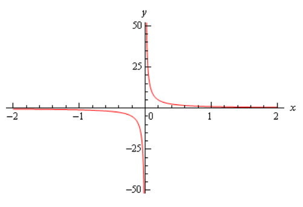
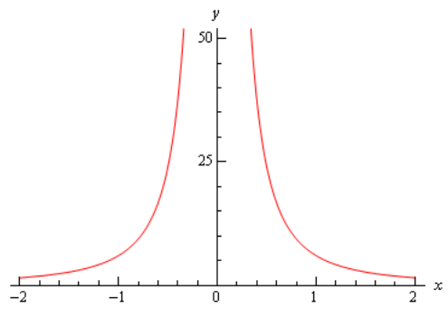
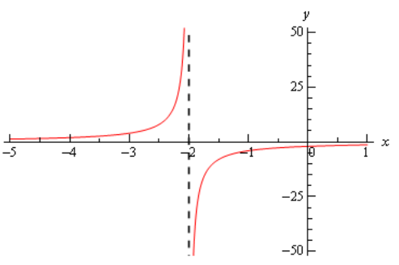
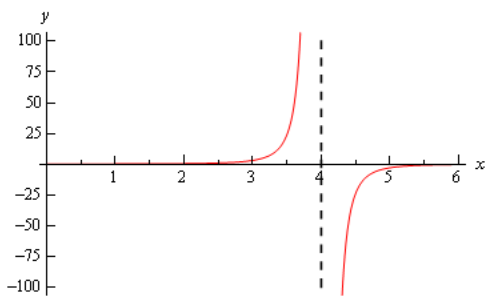
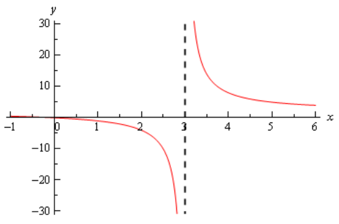
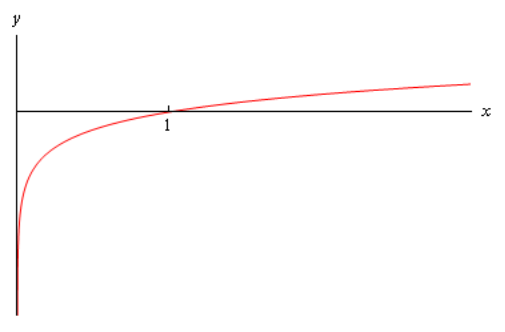
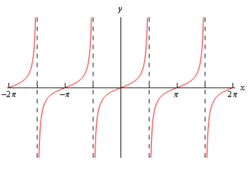

# Section 2.6 : Infinite Limits

In this section we will take a look at limits whose value is infinity or minus
infinity. These kinds of limit will show up fairly regularly in later sections
and in other courses and so you’ll need to be able to deal with them when you
run across them.

The first thing we should probably do here is to define just what we mean when
we say that a limit has a value of infinity or minus infinity.

**Definition**

> We say
>
> $$ \lim\limits_{x \to a}f(x) = \infty $$
>
> if we can make $f(x)$ arbitrarily large for all $x$ sufficiently close to
> $x = a$, from both sides, without actually letting $x = a$.
>
> We say
>
> $$ \lim\limits_{x \to a}f(x) = -\infty $$
>
> if we can make $f(x)$ arbitrarily large and negative for all $x$ sufficiently
> close to $x = a$, from both sides, without actually letting $x = a$.

These definitions can be appropriately modified for the one-sided limits as
well. To see a more precise and mathematical definition of this kind of limit
see the
[The Definition of the Limit](https://tutorial.math.lamar.edu/Classes/CalcI/DefnOfLimit.aspx)
section at the end of this chapter.

Let’s start off with a fairly typical example illustrating infinite limits.

---

**Example 1** Evaluate each of the following limits.

$$ \lim\limits_{x \to 0^{+}}\frac{1}{x} \quad \quad \lim\limits_{x \to 0^{-}}\frac{1}{x} \quad \quad \lim\limits_{x \to 0}\frac{1}{x} $$

**Solution**

So, we’re going to be taking a look at a couple of one-sided limits as well as
the normal limit here. In all three cases notice that we can’t just plug in
$x = 0$. If we did we would get division by zero. Also recall that the
definitions above can be easily modified to give similar definitions for the two
one-sided limits which we’ll be needing here.

Now, there are several ways we could proceed here to get values for these
limits. One way is to plug in some points and see what value the function is
approaching. In the preceding section we said that we were no longer going to do
this, but in this case it is a good way to illustrate just what’s going on with
this function.

So, here is a table of values of $x$'s from both the left and the right. Using
these values we’ll be able to estimate the value of the two one-sided limits and
once we have that done we can use the
[fact](https://tutorial.math.lamar.edu/Classes/CalcI/OneSidedLimits.aspx#Limit_Fact)
that the normal limit will exist only if the two one-sided limits exist and have
the same value.

| $x$       | $\dfrac{1}{x}$ | $x$      | $\dfrac{1}{x}$ |
| --------- | -------------- | -------- | -------------- |
| $-0.1$    | $-10$          | $0.1$    | $10$           |
| $-0.01$   | $-100$         | $0.01$   | $100$          |
| $-0.001$  | $-1000$        | $0.001$  | $1000$         |
| $-0.0001$ | $-10000$       | $0.0001$ | $10000$        |

From this table we can see that as we make $x$ smaller and smaller the function
$\frac{1}{x}$ gets larger and larger and will retain the same sign that $x$
originally had. It should make sense that this trend will continue for any
smaller value of $x$ that we chose to use. The function is a constant (one in
this case) divided by an increasingly small number. The resulting fraction
should be an increasingly large number and as noted above the fraction will
retain the same sign as $x$.

We can make the function as large and positive as we want for all $x$'s
sufficiently close to zero while staying positive (_i.e._ on the right).
Likewise, we can make the function as large and negative as we want for all
$x$'s sufficiently close to zero while staying negative (_i.e._ on the left).
So, from our definition above it looks like we should have the following values
for the two one sided limits.

$$ \lim\limits_{x \to 0^{+}}\frac{1}{x} = \infty \quad \quad \lim\limits_{x \to 0^{-}}\frac{1}{x} = -\infty $$

Another way to see the values of the two one sided limits here is to graph the
function. Again, in the previous section we mentioned that we won’t do this too
often as most functions are not something we can just quickly sketch out as well
as the problems with accuracy in reading values off the graph. In this case
however, it’s not too hard to sketch a graph of the function and, in this case
as we’ll see accuracy is not really going to be an issue. So, here is a quick
sketch of the graph.

So, we can see from this graph that the function does behave much as we
predicted that it would from our table values. The closer $x$ gets to zero from
the right the larger (in the positive sense) the function gets, while the closer
$x$ gets to zero from the left the larger (in the negative sense) the function
gets.

Finally, the normal limit, in this case, will not exist since the two one-sided
limits have different values.

So, in summary here are the values of the three limits for this example.

$$ \lim\limits_{x \to 0^{+}}\frac{1}{x} = \infty \quad \quad \lim\limits_{x \to 0^{-}}\frac{1}{x} = -\infty \quad \quad \lim\limits_{x \to 0}\frac{1}{x} \text{ does not exist} $$

---

For most of the remaining examples in this section we’ll attempt to “talk our
way through” each limit. This means that we’ll see if we can analyze what should
happen to the function as we get very close to the point in question without
actually plugging in any values into the function. For most of the following
examples this kind of analysis shouldn’t be all that difficult to do. We’ll also
verify our analysis with a quick graph.

So, let’s do a couple more examples.

---

**Example 2** Evaluate each of the following limits.

$$ \lim\limits_{x \to 0^{+}}\frac{6}{x^2} \quad \quad \lim\limits_{x \to 0^{-}}\frac{6}{x^2} \quad \quad \lim\limits_{x \to 0}\frac{6}{x^2} $$

**Solution**

As with the previous example let’s start off by looking at the two one-sided
limits. Once we have those we’ll be able to determine a value for the normal
limit.

So, let’s take a look at the right-hand limit first and as noted above let’s see
if we can figure out what each limit will be doing without actually plugging in
any values of $x$ into the function. As we take smaller and smaller values of
$x$, while staying positive, squaring them will only make them smaller (recall
squaring a number between zero and one will make it smaller) and of course it
will stay positive. So, we have a positive constant divided by an increasingly
small positive number. The result should then be an increasingly large positive
number. It looks like we should have the following value for the right-hand
limit in this case,

$$ \lim\limits_{x \to 0^{+}}\frac{6}{x^2} = \infty $$

Now, let’s take a look at the left-hand limit. In this case we’re going to take
smaller and smaller values of $x$, while staying negative this time. When we
square them they’ll get smaller, but upon squaring the result is now positive.
So, we have a positive constant divided by an increasingly small positive
number. The result, as with the right-hand limit, will be an increasingly large
positive number and so the left-hand limit will be,

$$ \lim\limits_{x \to 0^{-}}\frac{6}{x^2} = \infty $$

Now, in this example, unlike the first one, the normal limit will exist and be
infinity since the two one-sided limits both exist and have the same value. So,
in summary here are all the limits for this example as well as a quick graph
verifying the limits.

$$ \lim\limits_{x \to 0^{+}}\frac{6}{x^2} = \infty \quad \quad \lim\limits_{x \to 0^{-}}\frac{6}{x^2} = \infty \quad \quad \lim\limits_{x \to 0}\frac{6}{x^2} = \infty  $$

---

With this next example we’ll move away from just an $x$ in the denominator, but
as we’ll see in the next couple of examples they work pretty much the same way.

---

**Example 3** Evaluate each of the following limits.

$$ \lim\limits_{x \to -2^+}\frac{-4}{x + 2} \quad \quad \lim\limits_{x \to -2^-}\frac{-4}{x + 2} \quad \quad \lim\limits_{x \to -2}\frac{-4}{x + 2} $$

Let’s again start with the right-hand limit. With the right-hand limit we know
that we have,

$$ x > -2 \quad \quad \Rightarrow \quad \quad x + 2 > 0 $$

Also, as $x$ gets closer and closer to -2 then $x + 2$ will be getting closer
and closer to zero, while staying positive as noted above. So, for the
right-hand limit, we’ll have a negative constant divided by an increasingly
small positive number. The result will be an increasingly large and negative
number. So, it looks like the right-hand limit will be negative infinity.

For the left-hand limit we have,

$$ x < -2 \quad \quad \Rightarrow \quad \quad x + 2 < 0 $$

and $x + 2$ will get closer and closer to zero (and be negative) as $x$ gets
closer and closer to -2. In this case then we’ll have a negative constant
divided by an increasingly small negative number. The result will then be an
increasingly large positive number and so it looks like the left-hand limit will
be positive infinity.

Finally, since two one sided limits are not the same the normal limit won’t
exist.

Here are the official answers for this example as well as a quick graph of the
function for verification purposes.

$$ \lim\limits_{x \to -2^+}\frac{-4}{x + 2} = -\infty \quad \quad \lim\limits_{x \to -2^-}\frac{-4}{x + 2} = \infty \quad \quad \lim\limits_{x \to -2}\frac{-4}{x + 2} \text{ doesn't exist} $$

---

At this point we should briefly acknowledge the idea of vertical asymptotes.
Each of the three previous graphs have had one. Recall from an Algebra class
that a vertical asymptote is a vertical line (the dashed line at $x = -2$ in the
previous example) in which the graph will go towards infinity and/or minus
infinity on one or both sides of the line.

In an Algebra class they are a little difficult to define other than to say
pretty much what we just said. Now that we have infinite limits under our belt
we can easily define a vertical asymptote as follows,

**Definition**

> The function $f(x)$ will have a vertical asymptote at $x = a$ if we have any
> of the following limits at $x = a$.
>
> $$ \lim\limits_{x \to a^-}f(x) = \pm \infty \quad \quad \lim\limits_{x \to a^+}f(x) = \pm \infty \quad \quad \lim\limits_{x \to a}f(x) = \pm \infty $$

Note that it only requires one of the above limits for a function to have a
vertical asymptote at $x = a$.

Using this definition we can see that the first two examples had vertical
asymptotes at $x = 0$ while the third example had a vertical asymptote at
$x = -2$.

We aren’t really going to do a lot with vertical asymptotes here but wanted to
mention them at this point since we’d reached a good point to do that.

Let’s now take a look at a couple more examples of infinite limits that can
cause some problems on occasion.

---

**Example 4** Evaluate each of the following limits.

$$ \lim\limits_{x \to 4^+}\frac{3}{(4 - x)^3} \quad \quad \lim\limits_{x \to 4^-}\frac{3}{(4 - x)^3} \quad \quad \lim\limits_{x \to 4}\frac{3}{(4 - x)^3} $$

**Solution**

Let’s start with the right-hand limit. For this limit we have,

$$ x > 4 \quad \quad \Rightarrow \quad \quad 4 - x < 0 \quad \quad \Rightarrow \quad \quad (4 - x)^3 < 0 $$

also, $4 - x \rightarrow 0$ as $x \rightarrow 4$. So, we have a positive
constant divided by an increasingly small negative number. The results will be
an increasingly large negative number and so it looks like the right-hand limit
will be negative infinity.

For the left-handed limit we have,

$$ x < 4 \quad \quad \Rightarrow \quad \quad 4 - x > 0 \quad \quad \Rightarrow \quad \quad (4 - x)^3 > 0 $$

and we still have, $4 - x \rightarrow 0$ as $x \rightarrow 4$. In this case we
have a positive constant divided by an increasingly small positive number. The
results will be an increasingly large positive number and so it looks like the
left-hand limit will be positive infinity.

The normal limit will not exist since the two one-sided limits are not the same.
The official answers to this example are then,

$$ \lim\limits_{x \to 4^+}\frac{3}{(4 - x)^3} = -\infty \quad \quad \lim\limits_{x \to 4^-}\frac{3}{(4 - x)^3} = \infty \quad \quad \lim\limits_{x \to 4}\frac{3}{(4 - x)^3} \text{ doesn't exist} $$

---

All the examples to this point have had a constant in the numerator and we
should probably take a quick look at an example that doesn’t have a constant in
the numerator.

---

**Example 5** Evaluate each of the following limits.

$$ \lim\limits_{x \to 3^+}\frac{2x}{x - 3} \quad \quad \lim\limits_{x \to 3^-}\frac{2x}{x - 3} \quad \quad \lim\limits_{x \to 3}\frac{2x}{x - 3} $$

**Solution**

Let’s take a look at the right-handed limit first. For this limit we’ll have,

$$ x > 3 \quad \quad \Rightarrow \quad \quad x - 3 > 0 $$

The main difference here with this example is the behavior of the numerator as
we let $x$ get closer and closer to 3. In this case we have the following
behavior for both the numerator and denominator.

$$ x - 3 \rightarrow 0 \quad \text{ and } \quad 2x \rightarrow 6 \quad \text{ as } \quad x \rightarrow 3 $$

So, as we let $x$ get closer and closer to 3 (always staying on the right of
course) the numerator, while not a constant, is getting closer and closer to a
positive constant while the denominator is getting closer and closer to zero and
will be positive since we are on the right side.

This means that we’ll have a numerator that is getting closer and closer to a
non-zero and positive constant divided by an increasingly smaller positive
number and so the result should be an increasingly larger positive number. The
right-hand limit should then be positive infinity.

For the left-hand limit we’ll have,

$$ x < 3 \quad \quad \Rightarrow \quad \quad x - 3 < 0 $$

As with the right-hand limit we’ll have the following behaviors for the
numerator and the denominator,

$$ x - 3 \rightarrow 0 \quad \text{ and } \quad 2x \rightarrow -6 \quad \text{ as } \quad x \rightarrow 3 $$

The main difference in this case is that the denominator will now be negative.
So, we’ll have a numerator that is approaching a positive, non-zero constant
divided by an increasingly small negative number. The result will be an
increasingly large and negative number.

The formal answers for this example are then,

$$ \lim\limits_{x \to 3^+}\frac{2x}{x - 3} = \infty \quad \quad \lim\limits_{x \to 3^-}\frac{2x}{x - 3} = -\infty \quad \quad \lim\limits_{x \to 3^+}\frac{2x}{x - 3} \text{ doesn't exist} $$

As with most of the examples in this section the normal limit does not exist
since the two one-sided limits are not the same.

Here’s a quick graph to verify our limits.

---

So far all we’ve done is look at limits of rational expressions, let’s do a
couple of quick examples with some different functions.

---

**Example 6** Evaluate

$$ \lim\limits_{x \to 0^+}\ln(x) $$

**Solution**

First, notice that we can only evaluate the right-handed limit here. We know
that the domain of any logarithm is only the positive numbers and so we can’t
even talk about the left-handed limit because that would necessitate the use of
negative numbers. Likewise, since we can’t deal with the left-handed limit then
we can’t talk about the normal limit.

This limit is pretty simple to get from a quick sketch of the graph.

From this we can see that,

$$ \lim\limits_{x \to 0^+}\ln(x) = -\infty $$

---

**Example 7** Evaluate both of the following limits.

$$ \lim\limits_{x \to \frac{\pi}{2}^+}\tan(x) \quad \quad \lim\limits_{x \to \frac{\pi}{2}^-}\tan(x) $$

**Solution**

Here’s a quick sketch of the graph of the tangent function.

From this it’s easy to see that we have the following values for each of these
limits,

$$ \lim\limits_{x \to \frac{\pi}{2}^+}\tan(x) = -\infty \quad \quad \lim\limits_{x \to \frac{\pi}{2}^-}\tan(x) = \infty $$

Note that the normal limit will not exist because the two one-sided limits are
not the same.

---

We’ll leave this section with a few facts about infinite limits.

**Facts**

> Given the functions $f(x)$ and $g(x)$ suppose we have,
>
> $$ \lim\limits_{x \to c}f(x) = \infty \quad \quad \lim\limits_{x \to c}g(x) = L $$
>
> for some real numbers $c$ and $L$. Then,
>
> 1. $\lim\limits_{x \to c}\left[f(x) \pm g(x)\right] = \infty$
> 2. If $L > 0$ then $\lim\limits_{x \to c}\left[f(x)g(x)\right] = \infty$
> 3. If $L < 0$ then $\lim\limits_{x \to c}\left[f(x)g(x)\right] = -\infty$
> 4. $\lim\limits_{x \to c}\dfrac{g(x)}{f(x)} = 0$

To see the proof of this set of facts see the
[Proof of Various Limit Properties](https://tutorial.math.lamar.edu/Classes/CalcI/LimitProofs.aspx#Extras_Limit_InfLimitFacts)
section in the Extras chapter.

Note as well that the above set of facts also holds for one-sided limits. They
will also hold if $\lim\limits_{x \to c}f(x) = -\infty$ , with a change of sign
on the infinities in the first three parts. The proofs of these changes to the
facts are nearly identical to the proof of the original facts and so are left to
the you.

---

## Practice Problems

For problems 1 – 6 evaluate the indicated limits, if they exist.

**1.** For $f(x) = \dfrac{9}{(x - 3)^5}$ evaluate,

**(a)** $\lim\limits_{x \to 3^-}f(x)$

**Solution**

**(b)** $\lim\limits_{x \to 3^+}f(x)$

**Solution**

**\(c\)** $\lim\limits_{x \to 3}f(x)$

**Solution**

**2.** For $h(t) = \dfrac{2t}{6 + t}$ evaluate,

**(a)** $\lim\limits_{t \to -6^-}h(t)$

**Solution**

**(b)** $\lim\limits_{t \to -6^+}h(t)$

**Solution**

**\(c\)** $\lim\limits_{t \to -6}h(t)$

**Solution**

**3.** For $g(z) = \dfrac{z + 3}{(z + 1)^2}$ evaluate,

**(a)** $\lim\limits_{z \to -1^-}g(z)$

**Solution**

**(b)** $\lim\limits_{z \to -1^+}g(z)$

**Solution**

**\(c\)** $\lim\limits_{z \to -1}g(z)$

**Solution**

**4.** For $g(x) = \dfrac{x + 7}{x^2 - 4}$ evaluate,

**(a)** $\lim\limits_{x \to 2^-}g(x)$

**Solution**

**(b)** $\lim\limits_{x \to 2^+}g(x)$

**Solution**

**\(c\)** $\lim\limits_{x \to 2}g(x)$

**Solution**

**5.** For $h(x) = \ln(-x)$ evaluate,

**(a)** $\lim\limits_{x \to 0^-}h(x)$

**Solution**

**(b)** $\lim\limits_{x \to 0^+}h(x)$

**Solution**

**\(c\)** $\lim\limits_{x \to 0}h(x)$

**Solution**

**6.** For $R(y) = \tan(y)$ evaluate,

**(a)** $\lim\limits_{y \to \frac{3\pi}{2}^-}R(y)$

**Solution**

**(b)** $\lim\limits_{y \to \frac{3\pi}{2}^+}R(y)$

**Solution**

**\(c\)** $\lim\limits_{y \to \frac{3\pi}{2}}R(y)$

**Solution**

For problems 7 & 8 find all the vertical asymptotes of the given function.

**7.** $\dfrac{7x}{(10 - 3x)^4}$

**Solution**

**8.** $g(x) = \dfrac{-8}{(x + 5)(x - 9)}$

**Solution**

---

## Assignment Problems

For problems 1 – 8 evaluate the indicated limits, if they exist.

**1.** For $g(x) = \dfrac{-4}{(x - 1)^2}$ evaluate,

**(a)** $\lim\limits_{x \to 1^-}g(x)$

**Solution**

**(b)** $\lim\limits_{x \to 1^+}g(x)$

**Solution**

**\(c\)** $\lim\limits_{x \to 1}g(x)$

**Solution**

**2.** For $h(z) = \dfrac{17}{(4 - z)^3}$ evaluate,

**(a)** $\lim\limits_{z \to 4^-}h(z)$

**Solution**

**(b)** $\lim\limits_{z \to 4^+}h(z)$

**Solution**

**\(c\)** $\lim\limits_{z \to 4}h(z)$

**Solution**

**3.** For $g(t) = \dfrac{4t^2}{(t + 3)^7}$ evaluate,

**(a)** $\lim\limits_{t \to -3^-}g(t)$

**Solution**

**(b)** $\lim\limits_{t \to -3^+}g(t)$

**Solution**

**\(c\)** $\lim\limits_{t \to -3}g(t)$

**Solution**

**4.** For $f(x) = \dfrac{1 + x}{x^3 + 8}$ evaluate,

**(a)** $\lim\limits_{x \to -2^-}f(x)$

**Solution**

**(b)** $\lim\limits_{x \to -2^+}f(x)$

**Solution**

**\(c\)** $\lim\limits_{x \to -2}f(x)$

**Solution**

**5.** For $f(x) = \dfrac{x - 1}{(x^2 - 9)^4}$ evaluate,

**(a)** $\lim\limits_{x \to 3^-}f(x)$

**Solution**

**(b)** $\lim\limits_{x \to 3^+}f(x)$

**Solution**

**\(c\)** $\lim\limits_{x \to 3}f(x)$

**Solution**

**6.** For $W(t) = \ln(t + 8)$ evaluate,

**(a)** $\lim\limits_{t \to -8^-}W(t)$

**Solution**

**(b)** $\lim\limits_{t \to -8^+}W(t)$

**Solution**

**\(c\)** $\lim\limits_{t \to -8}W(t)$

**Solution**

**7.** For $h(z) = \ln \mid z \mid$ evaluate,

**(a)** $\lim\limits_{z \to 0^-}h(z)$

**Solution**

**(b)** $\lim\limits_{z \to 0^+}h(z)$

**Solution**

**\(c\)** $\lim\limits_{z \to 0}h(z)$

**Solution**

**8.** For $R(y) = \cot(y)$ evaluate,

**(a)** $\lim\limits_{y \to \pi^-}R(y)$

**Solution**

**(b)** $\lim\limits_{y \to \pi^+}R(y)$

**Solution**

**\(c\)** $\lim\limits_{y \to \pi}R(y)$

**Solution**

For problems 9 – 12 find all the vertical asymptotes of the given function.

**9.** $h(x) = \dfrac{-6}{9 - x}$

**Solution**

**10.** $f(x) = \dfrac{x + 8}{x^2(5 - 2x)^3}$

**Solution**

**11.** $g(t) = \dfrac{5t}{t(t + 7)(t - 12)}$

**Solution**

**12.** $g(z) = \dfrac{z^2 + 1}{(z^2 - 1)^5(z + 15)^6}$

**Solution**
