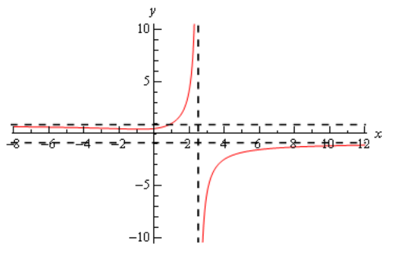

# Section 2.7 : Limits At Infinity, Part I

In the previous section we saw limits that were infinity and it’s now time to
take a look at limits at infinity. By limits at infinity we mean one of the
following two limits.

$$ \lim\limits_{x \to \infty}f(x) \quad \quad \lim\limits_{x \to -\infty}f(x) $$

In other words, we are going to be looking at what happens to a function if we
let $x$ get very large in either the positive or negative sense. Also, as we’ll
soon see, these limits may also have infinity as a value.

First, let’s note that the set of
[Facts](https://tutorial.math.lamar.edu/Classes/CalcI/InfiniteLimits.aspx#Limit_LimAtInt_InfFacts)
from the Infinite Limit section also hold if we replace the
$\lim\limits_{x \to c}$ with c\lim\limits_{x \to \infty} or
$\lim\limits_{x \to -\infty}$.

The proof of this is nearly identical to the
[proof](https://tutorial.math.lamar.edu/Classes/CalcI/LimitProofs.aspx#Extras_Limit_InfLimitFacts)
of the original set of facts with only minor modifications to handle the change
in the limit and so is left to you. We won’t need these facts much over the next
couple of sections but they will be required on occasion.

In fact, many of the limits that we’re going to be looking at we will need the
following two facts.

**Fact 1**

> 1. If $r$ is a positive rational number and $c$ is any real number then,
>
> $$ \lim\limits_{x \to \infty}\frac{c}{x^r} = 0 $$
>
> 2. If $r$ is a positive rational number, $c$ is any real number and $x^r$ is
>    defined for $x < 0$ then,
>
> $$ \lim\limits_{x \to -\infty}\frac{c}{x^r} = 0 $$

The first part of this fact should make sense if you think about it. Because we
are requiring $r > 0$ we know that $x^r$ will stay in the denominator. Next as
we increase $x$ then $x^r$ will also increase.

So, we have a constant divided by an increasingly large number and so the result
will be increasingly small. Or, in the limit we will get zero.

The second part is nearly identical except we need to worry about $x^r$ being
defined for negative $x$. This condition is here to avoid cases such as
$r = \dfrac{1}{2}$. If this $r$ were allowed we'd be taking the square root of
negative numbers which would be complex and we want to avoid that at this level.

Note as well that the sign of $c$ will not affect the answer. Regardless of the
sign of $c$ we'll still have a constant divided by a very large number which
will result in a very small number and the larger $x$ get the smaller the
fraction gets. The sign of $c$ will affect which direction the fraction
approaches zero (_i.e._ from the positive or negative side) but it still
approaches zero.

If you think about it this is really a special case of the last Fact from the
[Facts](https://tutorial.math.lamar.edu/Classes/CalcI/InfiniteLimits.aspx#Limit_LimAtInt_InfFacts)
in the previous section. However, to see a direct proof of this fact see the
[Proof of Various Limit Properties](https://tutorial.math.lamar.edu/Classes/CalcI/LimitProofs.aspx#Extras_Limit_InfRatLim)
section in the Extras chapter.

Let’s start off the examples with one that will lead us to a nice idea that
we’ll use on a regular basis about limits at infinity for polynomials.

---

**Example 1** Evaluate each of the following limits.

**(a)** $\lim\limits_{x \to \infty}(2x^4 - x^2 - 8x)$

**Solution**

Our first thought here is probably to just “plug” infinity into the polynomial
and “evaluate” each term to determine the value of the limit. It is pretty
simple to see what each term will do in the limit and so this seems like an
obvious step, especially since we’ve been doing that for other limits in
previous sections.

So, let’s see what we get if we do that. As x$$ approaches infinity, then $x$ to
a power can only get larger and the coefficient on each term (the first and
third) will only make the term even larger. So, if we look at what each term is
doing in the limit we get the following,

$$ \lim\limits_{x \to \infty}(2x^4 - x^2 - 8x) = \infty - \infty - \infty $$

Now, we’ve got a small, but easily fixed, problem to deal with. We are probably
tempted to say that the answer is zero (because we have an infinity minus an
infinity) or maybe $-\infty$ (because we’re subtracting two infinities off of
one infinity). However, in both cases we’d be wrong. This is one of those
**indeterminate forms** that we first started seeing in a previous
[section](https://tutorial.math.lamar.edu/Classes/CalcI/ComputingLimits.aspx).

Infinities just don’t always behave as real numbers do when it comes to
arithmetic. Without more work there is simply no way to know what
$\infty - \infty$ will be and so we really need to be careful with this kind of
problem. To read a little more about this see the
[Types of Infinity](https://tutorial.math.lamar.edu/Classes/CalcI/TypesOfInfinity.aspx)
section in the Extras chapter.

So, we need a way to get around this problem. What we’ll do here is factor the
largest power of x out of the whole polynomial as follows,

$$ \lim\limits_{x \to \infty}(2x^4 - x^2 - 8x) = \lim\limits_{x \to \infty}\left[x^4\left(2 - \frac{1}{x^2} - \frac{8}{x^3}\right)\right] $$

If you’re not sure you agree with the factoring above (there’s a chance you
haven’t really been asked to do this kind of factoring prior to this) then
recall that to check all you need to do is multiply the $x^4$ back through the
parenthesis to verify it was done correctly. Also, an easy way to remember how
to do this kind of factoring is to note that the second term is just the
original polynomial divided by $x^4$. This will always work when factoring a
power of $x$ out of a polynomial.

Now for each of the terms we have,

$$ \lim\limits_{x \to \infty}x^4 = \infty \quad \quad \lim\limits_{x \to \infty}\left(2 - \frac{1}{x^2} - \frac{8}{x^3}\right) = 2 $$

The first limit is clearly infinity and for the second limit we’ll use the fact
above on the last two terms. Therefore using
[Fact 2](https://tutorial.math.lamar.edu/Classes/CalcI/InfiniteLimits.aspx#Limit_LimAtInt_InfFacts)
from the previous section we see value of the limit will be,

$$ \lim\limits_{x \to \infty}(2x^4 - x^2 - 8x) = \infty $$

**(b)**
$\lim\limits_{t \to -\infty}\left(\dfrac{1}{3}t^5 + 2t^3 - t^2 + 8\right)$

**Solution**

We’ll work this part much quicker than the previous part. All we need to do is
factor out the largest power of t to get the following,

$$ \lim\limits_{t \to -\infty}\left(\frac{1}{3}t^5 + 2t^3 - t^2 + 8\right) = \lim\limits_{t \to -\infty}\left[t^5\left(\frac{1}{3} + \frac{2}{t^2} - \frac{1}{t^3} + \frac{8}{t^5}\right)\right] $$

Remember that all you need to do to get the factoring correct is divide the
original polynomial by the power of $t$ we're factoring out, $t^5$ in this case.

Now all we need to do is take the limit of the two terms. In the first don’t
forget that since we’re going out towards $-\infty$ and we're raising $t$ to the
5th power that the limit will be negative (negative number raised to
an odd power is still negative). In the second term we'll again make heavy use
of the fact above to see that is a finite number.

Therefore, using a modification of the
[Facts](https://tutorial.math.lamar.edu/Classes/CalcI/InfiniteLimits.aspx#Limit_LimAtInt_InfFacts)
from the previous sectioin teh value of the limit is,

$$ \lim\limits_{t \to -\infty}\left(\frac{1}{3}t^5 + 2t^3 - t^2 + 8\right) = -\infty $$

---

Okay, now that we’ve seen how a couple of polynomials work we can give a simple
fact about polynomials in general.

**Fact 2**

> If $p(x) = a_{n}x^n + a_{n - 1}x^{n - 1} + \dots + a_{1}x + a_{0}$ is a
> polynomial of degree $n$ (_i.e._ $a_{n} \neq 0$) then,
>
> $$ \lim\limits_{x \to \infty}p(x) = \lim\limits_{x \to \infty}a_{n}x^n \quad \quad \lim\limits_{x \to -\infty}p(x) = \lim\limits_{x \to -\infty}a_{n}x^n $$

What this fact is really saying is that when we take a limit at infinity for a
polynomial all we need to really do is look at the term with the largest power
and ask what that term is doing in the limit since the polynomial will have the
same behavior.

You can see the proof in the
[Proof of Various Limit Properties](https://tutorial.math.lamar.edu/Classes/CalcI/LimitProofs.aspx#Extras_Limit_InfPolyLim)
section in the Extras chapter.

Let’s now move into some more complicated limits.

---

**Example 2** Evaluate both of the following limits.

$$ \lim\limits_{x \to \infty}\frac{2x^4 - x^2 + 8x}{-5x^4 + 7} \quad \quad \lim\limits_{x \to -\infty}\frac{2x^4 - x^2 + 8x}{-5x^4 + 7} $$

**Solution**

First, the only difference between these two is that one is going to positive
infinity and the other is going to negative infinity. Sometimes this small
difference will affect the value of the limit and at other times it won’t.

Let’s start with the first limit and as with our first set of examples it might
be tempting to just “plug” in the infinity. Since both the numerator and
denominator are polynomials we can use the above fact to determine the behavior
of each. Doing this gives,

$$ \lim\limits_{x \to \infty}\frac{2x^4 - x^2 + 8x}{-5x^4 + 7} = \frac{\infty}{-\infty} $$

This is yet another indeterminate form. In this case we might be tempted to say
that the limit is infinity (because of the infinity in the numerator), zero
(because of the infinity in the denominator) or -1 (because something divided by
itself is one). There are three separate arithmetic “rules” at work here and
without work there is no way to know which “rule” will be correct and to make
matters worse it’s possible that none of them may work and we might get a
completely different answer, say $-\dfrac{2}{5}$ to pick a number completely at
random.

So, when we have a polynomial divided by a polynomial we’re going to proceed
much as we did with only polynomials. We first identify the largest power of $x$
in the denominator (and yes, we only look at the denominator for this) and we
then factor this out of both the numerator and denominator. Doing this for the
first limit gives,

$$ \lim\limits_{x \to \infty}\frac{2x^4 - x^2 + 8x}{-5x^4 + 7} = \lim\limits_{x \to \infty}\frac{x^4\left(2 - \dfrac{1}{x^2} + \dfrac{8}{x^3}\right)}{x^4\left(-5 + \dfrac{7}{x^4}\right)} $$

Once we’ve done this we can cancel the $x^4$ from both the numerator and the
denominator and then use the Fact 1 above to take the limit of all the remaining
terms. This gives,

$$ \lim\limits_{x \to \infty}\frac{2x^4 - x^2 + 8x}{-5x^4 + 7} = \lim\limits_{x \to \infty}\frac{2 - \dfrac{1}{x^2} + \dfrac{8}{x^3}}{-5 + \dfrac{7}{x^4}} $$

$$ \quad = \frac{2 + 0 + 0}{-5 + 0} $$

$$ \quad = -\frac{2}{5} $$

In this case the indeterminate form was neither of the “obvious” choices of
infinity, zero, or -1 so be careful with make these kinds of assumptions with
this kind of indeterminate forms.

The second limit is done in a similar fashion. Notice however, that nowhere in
the work for the first limit did we actually use the fact that the limit was
going to plus infinity. In this case it doesn’t matter which infinity we are
going towards we will get the same value for the limit.

$$ \lim\limits_{x \to -\infty}\frac{2x^4 - x^2 + 8x}{-5x^4 + 7} = -\frac{2}{5} $$

---

In the previous example the infinity that we were using in the limit didn’t
change the answer. This will not always be the case so don’t make the assumption
that this will always be the case.

Let’s take a look at an example where we get different answers for each limit.

---

**Example 3** Evaluate each of the following limits.

$$ \lim\limits_{x \to \infty}\frac{\sqrt{3x^2 + 6}}{5 - 2x} \quad \quad \lim\limits_{x \to -\infty}\frac{\sqrt{3x^2 + 6}}{5 - 2x} $$

**Solution**

Let’s start with the first limit. In this case the largest power of $x$ in the
denominator is just an $x$. So, we need to factor an $x$ out of the numerator
and the denominator. When we are done factoring the $x$ out we will need an $x$
in both of the numerator and the denominator. To get this in the numerator we
will have to factor an $x^2$ out of the square root so that after we take the
square root we will get an $x$.

This is probably not something you’re used to doing, but just remember that when
it comes out of the square root it needs to be an $x$ and the only way have an
$x$ come out of a square root is to take the square root of $x^2$ and so that is
what we’ll need to factor out of the term under the radical. Here’s the
factoring work for this part,

$$ \lim\limits_{x \to \infty}\frac{\sqrt{3x^2 + 6}}{5 - 2x} = \lim\limits_{x \to \infty}\frac{\sqrt{x^2\left(3 + \dfrac{6}{x^2}\right)}}{x\left(\dfrac{5}{x} - 2\right)} $$

$$ \quad = \lim\limits_{x \to \infty}\frac{\sqrt{x^2}\sqrt{3 + \dfrac{6}{x^2}}}{x\left(\dfrac{5}{x} - 2\right)} $$

This is where we need to be really careful with the square root in the problem.
Don’t forget that

$$ \sqrt{x^2} = \mid x \mid $$

Square roots are ALWAYS positive and so we need the absolute value bars on the
$x$ to make sure that it will give a positive answer. This is not something that
most people ever remember seeing in an Algebra class and in fact it’s not always
given in an Algebra class. However, at this point it becomes absolutely vital
that we know and use this fact. Using this fact the limit becomes,

$$ \lim\limits_{x \to \infty}\frac{\sqrt{3x^2 + 6}}{5 - 2x} = \lim\limits_{x \to \infty}\frac{\mid x \mid \sqrt{3 + \dfrac{6}{x^2}}}{x\left(\dfrac{5}{x} - 2\right)} $$

Now, we can’t just cancel the $x$'s. We first will need to get rid of the
absolute value bars. To do this let’s recall the definition of absolute value.

$$
\mid x \mid =
\begin{cases}
x & \text{if } x \geq 0 \\
-x & \text{if } x < 0
\end{cases}
$$

In this case we are going out to plus infinity so we can safely assume that the
$x$ will be positive and so we can just drop the absolute value bars. The limit
is then,

$$ \lim\limits_{x \to \infty}\frac{\sqrt{3x^2 + 6}}{5 - 2x} = \lim\limits_{x \to \infty}\frac{x\sqrt{3 + \dfrac{6}{x^2}}}{x\left(\dfrac{5}{x} - 2\right)} $$

$$ \quad = \lim\limits_{x \to \infty}\frac{\sqrt{3 + \dfrac{6}{x^2}}}{\dfrac{5}{x} - 2} = \frac{\sqrt{3 + 0}}{0 - 2} = -\frac{\sqrt{3}}{2} $$

Let’s now take a look at the second limit (the one with negative infinity). In
this case we will need to pay attention to the limit that we are using. The
initial work will be the same up until we reach the following step.

$$ \lim\limits_{x \to -\infty}\frac{\sqrt{3x^2 + 6}}{5 - 2x} = \lim\limits_{x \to -\infty}\frac{\mid x \mid \sqrt{3 + \dfrac{6}{x^2}}}{x\left(\dfrac{5}{x} - 2\right)} $$

In this limit we are going to minus infinity so in this case we can assume that
$x$ is negative. So, in order to drop the absolute value bars in this case we
will need to tack on a minus sign as well. The limit is then,

$$ \lim\limits_{x \to -\infty}\frac{\sqrt{3x^2 + 6}}{5 - 2x} = \lim\limits_{x \to -\infty}\frac{-x\sqrt{3 + \dfrac{6}{x^2}}}{x\left(\dfrac{5}{x} - 2\right)} $$

$$ \quad = \lim\limits_{x \to -\infty}\frac{-\sqrt{3 + \dfrac{6}{x^2}}}{\dfrac{5}{x} - 2} $$

$$ \quad = \frac{\sqrt{3}}{2} $$

---

So, as we saw in the last two examples sometimes the infinity in the limit will
affect the answer and other times it won’t. Note as well that it doesn’t always
just change the sign of the number. It can on occasion completely change the
value. We’ll see an example or two of this in the next section.

Before moving on to a couple of more examples let’s revisit the idea of
asymptotes that we first saw in the previous section. Just as we can have
vertical asymptotes defined in terms of limits we can also have horizontal
asymptotes defined in terms of limits.

**Definition**

> The function $f(x)$ will have a horizontal asymptote at $y = L$ if either of
> the following are true.
>
> $$ \lim\limits_{x \to \infty}f(x) = L \quad \quad \lim\limits_{x \to -\infty}f(x) = L $$

We’re not going to be doing much with asymptotes here, but it’s an easy fact to
give and we can use the previous example to illustrate all the asymptote ideas
we’ve seen in the both this section and the previous section. The function in
the last example will have two horizontal asymptotes. It will also have a
vertical asymptote. Here is a graph of the function showing these.

Let’s work another couple of examples involving rational expressions.

---

**Example 4** Evaluate each of the following limits.

$$ \lim\limits_{z \to \infty}\frac{4z^2 + z^6}{1 - 5z^3} \quad \quad \lim\limits_{x \to -\infty}\frac{4z^2 + z^6}{1 - 5z^3} $$

Let’s do the first limit and in this case it looks like we will factor a $z^3$
out of both the numerator and denominator. Remember that we only look at the
denominator when determining the largest power of $z$ here. There is a larger
power of $z$ in the numerator but we ignore it. We ONLY look at the denominator
when doing this! So, doing the factoring gives,

$$ \lim\limits_{z \to \infty}\frac{4z^2 + z^6}{1 - 5z^3} = \lim\limits_{z \to \infty}\frac{z^3\left(\dfrac{4}{z} + z^3\right)}{z^3\left(\dfrac{1}{z^3} - 5\right)} $$

$$ \quad \lim\limits_{z \to \infty}\frac{\dfrac{4}{z} + z^3}{\dfrac{1}{z^3} - 5} $$

When we take the limit we’ll need to be a little careful. The first term in the
numerator and denominator will both be zero. However, the $z^3$ in the numerator
will be going to plus infinity in the limit and so the limit is,

$$ \lim\limits_{z \to \infty}\frac{4z^2 + z^6}{1 - 5z^3} = \frac{\infty}{-5} = -\infty $$

The final limit is negative because we have a quotient of positive quantity and
a negative quantity.

Now, let’s take a look at the second limit. Note that the only different in the
work is at the final “evaluation” step and so we’ll pick up the work there.

$$ \lim\limits_{z \to -\infty}\frac{4z^2 + z^6}{1 - 5z^3} = \lim\limits_{z \to -\infty}\frac{\dfrac{4}{z} + z^3}{\dfrac{1}{z^3} - 5} = \frac{-\infty}{-5} = \infty $$

In this case the $z^3$ in the numerator gives negative infinity in the limit
since we are going out to minus infinity and the power is odd. The answer is
positive since we have a quotient of two negative numbers.

---

**Example 5** Evaluate the following limit.

$$ \lim\limits_{t \to -\infty}\frac{t^2 - 5t - 9}{2t^4 + 3t^3} $$

**Solution**

In this case it looks like we will factor a $t^4$ out of both the numerator and
denominator. Doing this gives,

$$ \lim\limits_{t \to -\infty}\frac{t^2 - 5t - 9}{2t^4 + 3t^3} = \lim\limits_{t \to -\infty}\frac{t^4\left(\dfrac{1}{t^2} - \dfrac{5}{t^3} - \dfrac{9}{t^4}\right)}{t^4\left(2 + \dfrac{3}{t}\right)} $$

$$ \quad = \lim\limits_{t \to -\infty}\frac{\dfrac{1}{t^2} - \dfrac{5}{t^3} - \dfrac{9}{t^4}}{2 + \dfrac{3}{t}} $$

$$ \quad = \frac{0}{2} $$

$$ \quad = 0 $$

In this case using Fact 1 we can see that the numerator is zero and so since the
denominator is also not zero the fraction, and hence the limit, will be zero.

---

In this section we concentrated on limits at infinity with functions that only
involved polynomials and/or rational expression involving polynomials. There are
many more types of functions that we could use here. That is the subject of the
next section.

To see a precise and mathematical definition of this kind of limit see the The
[Definition of the Limit](https://tutorial.math.lamar.edu/Classes/CalcI/DefnOfLimit.aspx)
section at the end of this chapter.

---

## Practice Problems

**1.** For $f(x) = 4x^7 - 18x^3 + 9$ evaluate each of the following limits.

**(a)** $\lim\limits_{x \to -\infty}f(x)$

**Solution**

We can't just plug in $-\infty$ or $\infty$ for these kinds of $x \to \infty$
limits. Instead we factor out the greatest exponent variable from the function
(on the denominator only, if it exists), and then evaluate the resulting
function.

$$ \lim\limits_{x \to -\infty}(4x^7 - 18x^3 + 9) $$

$$ \lim\limits_{x \to -\infty}\left[x^7\left(4 - \frac{18}{x^4} + \frac{9}{x^7}\right)\right] $$

We can then "distribute" the limit:

$$ \lim\limits_{x \to -\infty}x^7\lim\limits_{x \to -\infty}\left(4 - \frac{18}{x^4} + \frac{9}{x^7}\right) $$

And evaluate individually:

$$ \lim\limits_{x \to -\infty}x^7 = -\infty $$

And:

$$ \lim\limits_{x \to -\infty}\left(4 - \frac{18}{x^4} + \frac{9}{x^7}\right) $$

With this we could "distribute" the limit further, but we know that each of the
fractions gets infinitely smaller as $x \to -\infty$, and basically becomes $0$.
So this becomes:

$$ \lim\limits_{x \to -\infty}(4 - 0 + 0) $$

$$ \lim\limits_{x \to -\infty}(4) = 4 $$

So we go to:

$$ \lim\limits_{x \to -\infty}x^7 = -\infty $$

$$ \lim\limits_{x \to -\infty}(4) = 4 $$

Which when multiplied together become $-\infty$. Thusly our final answer is:

$$ \boxed{\lim\limits_{x \to -\infty}f(x) = -\infty} $$

**(b)** $\lim\limits_{x \to \infty}f(x)$

**Solution**

This will be similar to part **(a)**, so we'll explain less and just
demonstrate:

$$ \lim\limits_{x \to \infty}(4x^7 - 18x^3 + 9) $$

$$ \lim\limits_{x \to \infty}(4x^7 - 18x^3 + 9) $$

$$ \lim\limits_{x \to \infty}\left[x^7\left(4 - \frac{18}{x^4} + \frac{9}{x^7}\right)\right] $$

$$ \lim\limits_{x \to \infty}x^7 = \infty $$

$$ \lim\limits_{x \to \infty}\left(4 - \frac{18}{x^4} + \frac{9}{x^7}\right) $$

$$ \lim\limits_{x \to \infty}\left(4 - 0 + 0\right) $$

$$ \lim\limits_{x \to \infty}(4) = 4 $$

$$ \infty \cdot 4 = \infty $$

$$ \boxed{\lim\limits_{x \to \infty}f(x) = \infty} $$

**2.** For $h(t) = \sqrt[3]{t} + 12t - 2t^2$ evaluate each of the following
limits.

**(a)** $\lim\limits_{t \to -\infty}h(t)$

**Solution**

$$ \lim\limits_{t \to -\infty}\sqrt[3]{t} + 12t - 2t^2 $$

$$ \lim\limits_{t \to -\infty}t^{\frac{1}{3}} + 12t - 2t^2 $$

$$ \lim\limits_{t \to -\infty}\left[t^2\left(\frac{1}{t^{\frac{5}{3}}} +
\frac{12}{t} - 2\right)\right] $$

$$ \lim\limits_{t \to -\infty}t^2 = \infty $$

$$ \lim\limits_{t \to -\infty}\left(\frac{1}{t^{\frac{5}{3}}} + \frac{12}{t} - 2\right) $$

$$ \lim\limits_{t \to -\infty}(0 + 0 - 2) $$

$$ \lim\limits_{t \to -\infty}(-2) = -2 $$

$$ \infty \cdot -2 = -\infty $$

$$ \boxed{\lim\limits_{t \to -\infty}h(t) = -\infty} $$

**(b)** $\lim\limits_{t \to \infty}h(t)$

**Solution**

$$ \lim\limits_{t \to \infty}\sqrt[3]{t} + 12t - 2t^2 $$

$$ \lim\limits_{t \to \infty}t^{\frac{1}{3}} + 12t - 2t^2 $$

$$ \lim\limits_{t \to \infty}\left[t^2\left(\frac{1}{t^{\frac{5}{3}}} +
\frac{12}{t} - 2\right)\right] $$

$$ \lim\limits_{t \to \infty}t^2 = \infty $$

$$ \lim\limits_{t \to \infty}\left(\frac{1}{t^{\frac{5}{3}}} + \frac{12}{t} - 2\right) $$

$$ \lim\limits_{t \to -\infty}(-2) $$

$$ \infty \cdot -2 = -\infty $$

$$ \boxed{\lim\limits_{t \to \infty}h(t) = -\infty} $$

For problems 3 – 10 answer each of the following questions.

**(a)** Evaluate $\lim\limits_{x \to -\infty}f(x)$

**(b)** Evaluate $\lim\limits_{x \to \infty}f(x)$

**\(c\)** Write down the equation(s) of any horizontal asymptotes for the
function.

**3.** $f(x) = \dfrac{8 - 4x^2}{9x^2 + 5x}$

**(a)** Evaluate $\lim\limits_{x \to -\infty}f(x)$

**Solution**

$$ \lim\limits_{x \to -\infty}\left(\frac{8 - 4x^2}{9x^2 + 5x}\right) $$

$$ \lim\limits_{x \to -\infty}\left[\frac{x^2}{x^2}\left(\frac{\frac{8}{x^2} - 4}{9 + \frac{5}{x}}\right)\right] $$

$$ \lim\limits_{x \to -\infty}\left(\frac{\frac{8}{x^2} - 4}{9 + \frac{5}{x}}\right) $$

$$ \lim\limits_{x \to -\infty}\left(\frac{0 - 4}{9 + 0}\right) $$

$$ \lim\limits_{x \to -\infty}\left(-\frac{4}{9}\right) = -\frac{4}{9} $$

$$ \boxed{\lim\limits_{x \to -\infty}f(x) = -\frac{4}{9}} $$

**(b)** Evaluate $\lim\limits_{x \to \infty}f(x)$

**Solution**

$$ \lim\limits_{x \to \infty}\left(\frac{8 - 4x^2}{9x^2 + 5x}\right) $$

$$ \lim\limits_{x \to \infty}\left[\frac{x^2}{x^2}\left(\frac{\frac{8}{x^2} - 4}{9 + \frac{5}{x}}\right)\right]$$

$$ \lim\limits_{x \to \infty}\left(\frac{\frac{8}{x^2} - 4}{9 + \frac{5}{x}}\right) $$

$$ \lim\limits_{x \to \infty}\left(\frac{0 - 4}{9 + 0}\right) $$

$$ \lim\limits_{x \to \infty}\left(-\frac{4}{9}\right) = -\frac{4}{9} $$

$$ \boxed{\lim\limits_{x \to \infty}f(x) = -\frac{4}{9}} $$

**\(c\)** Write down the equation(s) of any horizontal asymptotes for the
function.

**Solution**

There will be a horizontal asymptote at $x \to -\infty$ if
$\lim\limits_{x \to -\infty}f(x)$ exists and is a finite number. Same for
$x \to \infty$.

Here that is the case, so we have:

$$ \boxed{\text{HORIZONTAL ASYMPTOTE AT }y = -\frac{4}{9} \text{ FOR } x \to -\infty \text{ AND } x \to \infty} $$

**4.** $f(x) = \dfrac{3x^7 - 4x^2 + 1}{5 - 10x^2}$

**(a)** Evaluate $\lim\limits_{x \to -\infty}f(x)$

**Solution**

$$ \lim\limits_{x \to -\infty}\dfrac{3x^7 - 4x^2 + 1}{5 - 10x^2} $$

$$ \lim\limits_{x \to -\infty}\left[\frac{x^2}{x^2}\left(\frac{3x^5 - 4 + \frac{1}{x^2}}{\frac{5}{x^2} - 10}\right)\right] $$

$$ \lim\limits_{x \to -\infty}\left[\left(\frac{-\infty - 4 + 0}{0 - 10}\right)\right] $$

$$ \lim\limits_{x \to -\infty}\left(\frac{-\infty}{-10}\right) = \infty $$

$$ \boxed{\lim\limits_{x \to -\infty}f(x) = \infty} $$

**(b)** Evaluate $\lim\limits_{x \to \infty}f(x)$

**Solution**

$$ \lim\limits_{x \to \infty}\dfrac{3x^7 - 4x^2 + 1}{5 - 10x^2} $$

$$ \lim\limits_{x \to \infty}\left[\frac{x^2}{x^2}\left(\frac{3x^5 - 4 + \frac{1}{x^2}}{\frac{5}{x^2} - 10}\right)\right] $$

$$ \lim\limits_{x \to \infty}\left[\left(\frac{\infty - 4 + 0}{0 - 10}\right)\right] $$

$$ \lim\limits_{x \to \infty}\left(\frac{\infty}{-10}\right) = -\infty $$

$$ \boxed{\lim\limits_{x \to \infty}f(x) = -\infty} $$

**\(c\)** Write down the equation(s) of any horizontal asymptotes for the
function.

**Solution**

Horizontal asymptotes exist only at $\lim\limits_{x \to -\infty}f(x) = L$ where
$L$ is any finite number, likewise for $\lim\limits_{x \to \infty} = L$.

Since both of our limits as they approach $\pm \infty$ don't reach finite
numbers, there are:

$$ \boxed{\text{NO HORIZONTAL ASYMPTOTES}} $$

**5.** $f(x) = \dfrac{20x^4 - 7x^3}{2x + 9x^2 + 5x^4}$

**(a)** Evaluate $\lim\limits_{x \to -\infty}f(x)$

**Solution**

$$ \lim\limits_{x \to -\infty}\dfrac{20x^4 - 7x^3}{2x + 9x^2 + 5x^4} $$

$$ \lim\limits_{x \to -\infty}\left[\frac{x^4}{x^4}\left(\frac{20 - \frac{7}{x}}{\frac{2}{x^3} + \frac{9}{x^2} + 5}\right)\right]$$

$$ \lim\limits_{x \to -\infty}\left(\frac{20 - 0}{0 + 0 + 5}\right) $$

$$ \lim\limits_{x \to -\infty}\left(\frac{20}{5}\right) $$

$$ \lim\limits_{x \to -\infty}4 = 4 $$

$$ \boxed{\lim\limits_{x \to -\infty}f(x) = 4} $$

**(b)** Evaluate $\lim\limits_{x \to \infty}f(x)$

**Solution**

$$ \lim\limits_{x \to \infty}\dfrac{20x^4 - 7x^3}{2x + 9x^2 + 5x^4} $$

$$ \lim\limits_{x \to \infty}\left[\frac{x^4}{x^4}\left(\frac{20 - \frac{7}{x}}{\frac{2}{x^3} + \frac{9}{x^2} + 5}\right)\right]$$

$$ \lim\limits_{x \to \infty}\left(\frac{20 - 0}{0 + 0 + 5}\right) $$

$$ \lim\limits_{x \to \infty}\left(\frac{20}{5}\right) $$

$$ \lim\limits_{x \to \infty}4 = 4 $$

$$ \boxed{\lim\limits_{x \to \infty}f(x) = 4} $$

**\(c\)** Write down the equation(s) of any horizontal asymptotes for the
function.

Indeed, we do have the same constant for both our limits approaching
$\pm \infty$, therefore we have:

$$ \boxed{\text{HORIZONTAL ASYMPTOTE AT: } y = 4 \text{ FOR } x \to -\infty \text{ AND } x \to \infty} $$

**Solution**

**6.** $f(x) = \dfrac{x^3 - 2x + 11}{3 - 6x^5}$

**(a)** Evaluate $\lim\limits_{x \to -\infty}f(x)$

**Solution**

$$ \lim\limits_{x \to -\infty}\dfrac{x^3 - 2x + 11}{3 - 6x^5} $$

$$ \lim\limits_{x \to -\infty}\left[\frac{x^5}{x^5}\left(\frac{\frac{1}{x^2} - \frac{2}{x^4} + \frac{11}{x^5}}{\frac{3}{x^5} - 6}\right)\right] $$

$$ \lim\limits_{x \to -\infty}\left(\frac{\frac{1}{x^2} - \frac{2}{x^4} + \frac{11}{x^5}}{\frac{3}{x^5} - 6}\right) $$

$$ \lim\limits_{x \to -\infty}\left(\frac{0 - 0 + 0}{0 - 6}\right) $$

$$ \lim\limits_{x \to -\infty}\left(\frac{0}{-6}\right) = 0 $$

$$ \boxed{\lim\limits_{x \to -\infty}f(x) = 0} $$

**(b)** Evaluate $\lim\limits_{x \to \infty}f(x)$

**Solution**

$$ \lim\limits_{x \to \infty}\dfrac{x^3 - 2x + 11}{3 - 6x^5} $$

$$ \lim\limits_{x \to \infty}\left[\frac{x^5}{x^5}\left(\frac{\frac{1}{x^2} - \frac{2}{x^4} + \frac{11}{x^5}}{\frac{3}{x^5} - 6}\right)\right] $$

$$ \lim\limits_{x \to \infty}\left(\frac{\frac{1}{x^2} - \frac{2}{x^4} + \frac{11}{x^5}}{\frac{3}{x^5} - 6}\right) $$

$$ \lim\limits_{x \to \infty}\left(\frac{0 - 0 + 0}{0 - 6}\right) $$

$$ \lim\limits_{x \to \infty}\left(\frac{0}{-6}\right) = 0 $$

$$ \boxed{\lim\limits_{x \to \infty}f(x) = 0} $$

**\(c\)** Write down the equation(s) of any horizontal asymptotes for the
function.

We have a finite number for both $x \to \pm \infty$:

$$ \boxed{\text{HORIZONTAL ASYMPTOTE AT: } y = 0 \text{ FOR } x \to \pm \infty} $$

**Solution**

**7.** $f(x) = \dfrac{x^6 - x^4 + x^2 - 1}{7x^6 + 4x^3 + 10}$

**(a)** Evaluate $\lim\limits_{x \to -\infty}f(x)$

**Solution**

$$ \lim\limits_{x \to -\infty}\dfrac{x^6 - x^4 + x^2 - 1}{7x^6 + 4x^3 + 10} $$

$$ \lim\limits_{x \to -\infty}\left[\frac{x^6}{x^6}\left(\frac{1 - \frac{1}{x^2} - \frac{1}{x^6}}{7 + \frac{4}{x^3} + \frac{10}{x^6}}\right)\right] $$

$$ \lim\limits_{x \to -\infty}\left(\frac{1 - \frac{1}{x^2} - \frac{1}{x^6}}{7 + \frac{4}{x^3} + \frac{10}{x^6}}\right) $$

$$ \lim\limits_{x \to -\infty}\left(\frac{1 - 0 - 0}{7 + 0 + 0}\right) $$

$$ \lim\limits_{x \to -\infty}\left(\frac{1}{7}\right) = \frac{1}{7} $$

$$ \boxed{\lim\limits_{x \to -\infty}f(x) = \frac{1}{7}} $$

**(b)** Evaluate $\lim\limits_{x \to \infty}f(x)$

**Solution**

$$ \lim\limits_{x \to \infty}\dfrac{x^6 - x^4 + x^2 - 1}{7x^6 + 4x^3 + 10} $$

$$ \lim\limits_{x \to \infty}\left[\frac{x^6}{x^6}\left(\frac{1 - \frac{1}{x^2} - \frac{1}{x^6}}{7 + \frac{4}{x^3} + \frac{10}{x^6}}\right)\right] $$

$$ \lim\limits_{x \to \infty}\left(\frac{1 - \frac{1}{x^2} - \frac{1}{x^6}}{7 + \frac{4}{x^3} + \frac{10}{x^6}}\right) $$

$$ \lim\limits_{x \to \infty}\left(\frac{1 - 0 - 0}{7 + 0 + 0}\right) $$

$$ \lim\limits_{x \to \infty}\left(\frac{1}{7}\right) = \frac{1}{7} $$

$$ \boxed{\lim\limits_{x \to \infty}f(x) = \frac{1}{7}} $$

**\(c\)** Write down the equation(s) of any horizontal asymptotes for the
function.

We have a finite number for both $x \to \pm \infty$. Therefore:

$$ \boxed{\text{HORIZONTAL ASYMPTOTE AT: } y = \frac{1}{7} \text{ FOR } x \to \pm \infty} $$

**Solution**

**8.** $f(x) = \dfrac{\sqrt{7 + 9x^2}}{1 - 2x}$

**(a)** Evaluate $\lim\limits_{x \to -\infty}f(x)$

**Solution**

$$ \lim\limits_{x \to -\infty}\dfrac{\sqrt{7 + 9x^2}}{1 - 2x} $$

$$ \lim\limits_{x \to -\infty}\left[\left(\frac{\sqrt{x^2\left(\frac{7}{x^2} + 9\right)}}{x\left(\frac{1}{x} - 2\right)}\right)\right] $$

$$ \lim\limits_{x \to -\infty}\left[\left(\frac{\sqrt{x^2}\sqrt{\left(\frac{7}{x^2} + 9\right)}}{x\left(\frac{1}{x} - 2\right)}\right)\right] $$

$$ \lim\limits_{x \to -\infty}\left[\left(\frac{\mid x \mid\sqrt{\left(\frac{7}{x^2} + 9\right)}}{x\left(\frac{1}{x} - 2\right)}\right)\right] $$

$$
\mid x \mid =
\begin{cases}
x & \text{if } x \geq 0 \\
-x & \text{if } x < 0
\end{cases}
$$

$$ x \to -\infty \quad \Rightarrow \quad x < 0 $$

$$ \lim\limits_{x \to -\infty}\left[\left(\frac{-x\sqrt{\left(\frac{7}{x^2} + 9\right)}}{x\left(\frac{1}{x} - 2\right)}\right)\right] $$

$$ \lim\limits_{x \to -\infty}\left[\left(\frac{-\sqrt{\left(\frac{7}{x^2} + 9\right)}}{\left(\frac{1}{x} - 2\right)}\right)\right] $$

$$ \lim\limits_{x \to -\infty}\left(\frac{-\sqrt{0 + 9}}{0 - 2}\right) $$

$$ \lim\limits_{x \to -\infty}\left(\frac{-\sqrt{9}}{-2}\right) $$

$$ \lim\limits_{x \to -\infty}\left(\frac{-3}{-2}\right) $$

$$ \lim\limits_{x \to -\infty}\left(\frac{3}{2}\right) = \frac{3}{2} $$

$$ \boxed{\lim\limits_{x \to -\infty}f(x) = \frac{3}{2}} $$

**(b)** Evaluate $\lim\limits_{x \to \infty}f(x)$

**Solution**

$$ \lim\limits_{x \to \infty}\dfrac{\sqrt{7 + 9x^2}}{1 - 2x} $$

$$ \lim\limits_{x \to \infty}\left[\left(\frac{\sqrt{x^2\left(\frac{7}{x^2} + 9\right)}}{x\left(\frac{1}{x} - 2\right)}\right)\right] $$

$$ \lim\limits_{x \to \infty}\left[\left(\frac{\sqrt{x^2}\sqrt{\left(\frac{7}{x^2} + 9\right)}}{x\left(\frac{1}{x} - 2\right)}\right)\right] $$

$$ \lim\limits_{x \to \infty}\left[\left(\frac{\mid x \mid\sqrt{\left(\frac{7}{x^2} + 9\right)}}{x\left(\frac{1}{x} - 2\right)}\right)\right] $$

$$
\mid x \mid =
\begin{cases}
x & \text{if } x \geq 0 \\
-x & \text{if } x < 0
\end{cases}
$$

$$ x \to \infty \quad \Rightarrow \quad x > 0 $$

$$ \lim\limits_{x \to \infty}\left[\left(\frac{x\sqrt{\left(\frac{7}{x^2} + 9\right)}}{x\left(\frac{1}{x} - 2\right)}\right)\right] $$

$$ \lim\limits_{x \to \infty}\left[\left(\frac{\sqrt{\left(\frac{7}{x^2} + 9\right)}}{\left(\frac{1}{x} - 2\right)}\right)\right] $$

$$ \lim\limits_{x \to \infty}\left(\frac{\sqrt{0 + 9}}{0 - 2}\right) $$

$$ \lim\limits_{x \to \infty}\left(\frac{\sqrt{9}}{-2}\right) $$

$$ \lim\limits_{x \to \infty}\left(\frac{3}{-2}\right) $$

$$ \lim\limits_{x \to \infty}\left(-\frac{3}{2}\right) = -\frac{3}{2} $$

$$ \boxed{\lim\limits_{x \to \infty}f(x) = -\frac{3}{2}} $$

**\(c\)** Write down the equation(s) of any horizontal asymptotes for the
function.

**Solution**

We have two different horizontal asymptotes this time:

$$ \boxed{\text{HORIZONTAL ASYMPTOTE AT: } y = \frac{3}{2} \text{ FOR } x \to -\infty} $$

$$ \boxed{\text{HORIZONTAL ASYMPTOTE AT: } y = -\frac{3}{2} \text{ FOR } x \to \infty} $$

**9.** $f(x) = \dfrac{x + 8}{\sqrt{2x^2 + 3}}$

**(a)** Evaluate $\lim\limits_{x \to -\infty}f(x)$

**Solution**

$$ \lim\limits_{x \to -\infty}\dfrac{x + 8}{\sqrt{2x^2 + 3}} $$

$$ \lim\limits_{x \to -\infty}\left[\frac{x + 8}{\sqrt{x^2\left(2 + \frac{3}{x^2}\right)}}\right]$$

$$ \lim\limits_{x \to -\infty}\left[\frac{x + 8}{\mid x \mid\sqrt{2 + \frac{3}{x^2}}}\right]$$

$$
\mid x \mid =
\begin{cases}
x & \text{if } x \geq 0 \\
-x & \text{if } x < 0
\end{cases}
$$

$$ x \to -\infty \quad \Rightarrow \quad x < 0 $$

$$ \lim\limits_{x \to -\infty}\left[\frac{x + 8}{-x\sqrt{2 + \frac{3}{x^2}}}\right] $$

$$ \lim\limits_{x \to -\infty}\left[\frac{x\left(1 + \frac{8}{x}\right)}{-x\sqrt{2 + \frac{3}{x^2}}}\right] $$

$$ \lim\limits_{x \to -\infty}\left[\frac{1 + \frac{8}{x}}{-\sqrt{2 + \frac{3}{x^2}}}\right] $$

$$ \lim\limits_{x \to -\infty}\left[\frac{1 + 0}{-\sqrt{2 + 0}}\right] $$

$$ \lim\limits_{x \to -\infty}\left[\frac{1}{-\sqrt{2}}\right] $$

$$ \lim\limits_{x \to -\infty}\left(-\frac{1}{\sqrt{2}}\right) = -\frac{1}{\sqrt{2}} $$

$$ \boxed{\lim\limits_{x \to -\infty}f(x) = -\frac{1}{\sqrt{2}}} $$

**(b)** Evaluate $\lim\limits_{x \to \infty}f(x)$

**Solution**

$$ \lim\limits_{x \to \infty}\dfrac{x + 8}{\sqrt{2x^2 + 3}} $$

$$ \lim\limits_{x \to \infty}\left[\frac{x + 8}{\sqrt{x^2\left(2 + \frac{3}{x^2}\right)}}\right]$$

$$ \lim\limits_{x \to \infty}\left[\frac{x + 8}{\mid x \mid\sqrt{2 + \frac{3}{x^2}}}\right]$$

$$
\mid x \mid =
\begin{cases}
x & \text{if } x \geq 0 \\
-x & \text{if } x < 0
\end{cases}
$$

$$ x \to \infty \quad \Rightarrow \quad x > 0 $$

$$ \lim\limits_{x \to \infty}\left[\frac{x + 8}{x\sqrt{2 + \frac{3}{x^2}}}\right] $$

$$ \lim\limits_{x \to \infty}\left[\frac{x\left(1 + \frac{8}{x}\right)}{x\sqrt{2 + \frac{3}{x^2}}}\right] $$

$$ \lim\limits_{x \to \infty}\left[\frac{1 + \frac{8}{x}}{\sqrt{2 + \frac{3}{x^2}}}\right] $$

$$ \lim\limits_{x \to \infty}\left[\frac{1 + 0}{\sqrt{2 + 0}}\right] $$

$$ \lim\limits_{x \to \infty}\left[\frac{1}{\sqrt{2}}\right] $$

$$ \lim\limits_{x \to \infty}\left(\frac{1}{\sqrt{2}}\right) = \frac{1}{\sqrt{2}} $$

$$ \boxed{\lim\limits_{x \to \infty}f(x) = \frac{1}{\sqrt{2}}} $$

**\(c\)** Write down the equation(s) of any horizontal asymptotes for the
function.

**Solution**

We have two horizontal asymptotes:

$$ \boxed{\text{HORIZONTAL ASYMPTOTE AT: } y = -\frac{1}{\sqrt{2}} \text{ FOR } x \to -\infty} $$

$$ \boxed{\text{HORIZONTAL ASYMPTOTE AT: } y = \frac{1}{\sqrt{2}} \text{ FOR } x \to \infty} $$

**10.** $f(x) = \dfrac{8 + x - 4x^2}{\sqrt{6 + x^2 + 7x^4}}$

**(a)** Evaluate $\lim\limits_{x \to -\infty}f(x)$

**Solution**

$$ \lim\limits_{x \to -\infty}\dfrac{8 + x - 4x^2}{\sqrt{6 + x^2 + 7x^4}} $$

$$ \lim\limits_{x \to -\infty}\left(\frac{8 + x - 4x^2}{\sqrt{x^4\left(\frac{6}{x^4} + \frac{1}{x^2} + 7\right)}}\right) $$

$$ \lim\limits_{x \to -\infty}\left(\frac{8 + x - 4x^2}{\mid x^2 \mid\sqrt{\frac{6}{x^4} + \frac{1}{x^2} + 7}}\right) $$

$$ \mid x^2 \mid \quad \Rightarrow \quad x > 0 $$

$$ \lim\limits_{x \to -\infty}\left(\frac{x^2\left(\frac{8}{x^2} + \frac{1}{x} - 4\right)}{x^2\sqrt{\frac{6}{x^4} + \frac{1}{x^2} + 7}}\right) $$

$$ \lim\limits_{x \to -\infty}\left(\frac{\frac{8}{x^2} + \frac{1}{x} - 4}{\sqrt{\frac{6}{x^4} + \frac{1}{x^2} + 7}}\right) $$

$$ \lim\limits_{x \to -\infty}\left(\frac{0 + 0 - 4}{\sqrt{0 + 0 + 7}}\right) $$

$$ \lim\limits_{x \to -\infty}\left(\frac{-4}{\sqrt{7}}\right) $$

$$ \lim\limits_{x \to -\infty}\left(\frac{-4}{\sqrt{7}}\right) = -\frac{4}{\sqrt{7}} $$

$$ \boxed{\lim\limits_{x \to -\infty}f(x) = -\frac{4}{\sqrt{7}}} $$

**(b)** Evaluate $\lim\limits_{x \to \infty}f(x)$

$$ \lim\limits_{x \to \infty}\dfrac{8 + x - 4x^2}{\sqrt{6 + x^2 + 7x^4}} $$

$$ \lim\limits_{x \to \infty}\left(\frac{8 + x - 4x^2}{\sqrt{x^4\left(\frac{6}{x^4} + \frac{1}{x^2} + 7\right)}}\right) $$

$$ \lim\limits_{x \to \infty}\left(\frac{8 + x - 4x^2}{\mid x^2 \mid\sqrt{\frac{6}{x^4} + \frac{1}{x^2} + 7}}\right) $$

$$ \mid x^2 \mid \quad \Rightarrow \quad x > 0 $$

$$ \lim\limits_{x \to \infty}\left(\frac{x^2\left(\frac{8}{x^2} + \frac{1}{x} - 4\right)}{x^2\sqrt{\frac{6}{x^4} + \frac{1}{x^2} + 7}}\right) $$

$$ \lim\limits_{x \to \infty}\left(\frac{\frac{8}{x^2} + \frac{1}{x} - 4}{\sqrt{\frac{6}{x^4} + \frac{1}{x^2} + 7}}\right) $$

$$ \lim\limits_{x \to \infty}\left(\frac{0 + 0 - 4}{\sqrt{0 + 0 + 7}}\right) $$

$$ \lim\limits_{x \to \infty}\left(\frac{-4}{\sqrt{7}}\right) $$

$$ \lim\limits_{x \to \infty}\left(\frac{-4}{\sqrt{7}}\right) = -\frac{4}{\sqrt{7}} $$

$$ \boxed{\lim\limits_{x \to \infty}f(x) = -\frac{4}{\sqrt{7}}} $$

**Solution**

**\(c\)** Write down the equation(s) of any horizontal asymptotes for the
function.

**Solution**

We have a single horizontal asymptote:

$$ \boxed{\text{HORIZONTAL ASYMPTOTE AT: } y = -\frac{4}{\sqrt{7}} \text{ FOR } x \to \pm \infty} $$

---

## Assignment Problems

**1.** For $f(x) = 8x + 9x^3 - 11x^5$ evaluate each of the following limits.

**(a)** $\lim\limits_{x \to -\infty}f(x)$

**Solution**

$$ \lim\limits_{x \to -\infty}(8x + 9x^3 - 11x^5) $$

$$ \lim\limits_{x \to -\infty}\left[\frac{x^5}{1}\left(\frac{8}{x^4} + \frac{9}{x^2} - 11\right)\right] $$

$$ \lim\limits_{x \to -\infty}x^5 = -\infty $$

$$ \lim\limits_{x \to -\infty}\left(\frac{8}{x^4} + \frac{9}{x^2} - 11\right) $$

$$ \lim\limits_{x \to -\infty}\left(0 + 0 - 11\right) $$

$$ \lim\limits_{x \to -\infty}(-11) = -11 $$

$$ -\infty \cdot -11 = \infty $$

$$ \boxed{\lim\limits_{x \to -\infty}f(x) = \infty} $$

**(b)** $\lim\limits_{x \to \infty}f(x)$

**Solution**

$$ \lim\limits_{x \to \infty}(8x + 9x^3 - 11x^5) $$

$$ \lim\limits_{x \to \infty}\left[\frac{x^5}{1}\left(\frac{8}{x^4} + \frac{9}{x^2} - 11\right)\right] $$

$$ \lim\limits_{x \to \infty}x^5 = \infty $$

$$ \lim\limits_{x \to \infty}\left(\frac{8}{x^4} + \frac{9}{x^2} - 11\right) $$

$$ \lim\limits_{x \to \infty}\left(0 + 0 - 11\right) $$

$$ \lim\limits_{x \to \infty}(-11) = -11 $$

$$ \infty \cdot -11 = -\infty $$

$$ \boxed{\lim\limits_{x \to \infty}f(x) = -\infty} $$

**2.** For $h(t) = 10t^2 + t^4 + 6t - 2$ evaluate each of the following limits.

**(a)** $\lim\limits_{t \to -\infty}h(t)$

**Solution**

$$ \lim\limits_{t \to -\infty}(10t^2 + t^4 + 6t - 2) $$

$$ \lim\limits_{t \to -\infty}\left[\frac{t^4}{1}\left(\frac{10}{t^2} + 1 + \frac{6}{t^3} - \frac{2}{t^4}\right)\right] $$

$$ \lim\limits_{t \to -\infty}t^4 = \infty $$

$$ \lim\limits_{t \to -\infty}\left(\frac{10}{t^2} + 1 + \frac{6}{t^3} - \frac{2}{t^4}\right) $$

$$ \lim\limits_{t \to -\infty}(0 + 1 + 0 - 0) $$

$$ \lim\limits_{t \to -\infty}(1) = 1 $$

$$ \infty \cdot 1 = \infty $$

$$ \boxed{\lim\limits_{t \to -\infty}h(t) = \infty} $$

**(b)** $\lim\limits_{t \to \infty}h(t)$

**Solution**

$$ \lim\limits_{t \to \infty}(10t^2 + t^4 + 6t - 2) $$

$$ \lim\limits_{t \to \infty}\left[\frac{t^4}{1}\left(\frac{10}{t^2} + 1 + \frac{6}{t^3} - \frac{2}{t^4}\right)\right] $$

$$ \lim\limits_{t \to \infty}t^4 = \infty $$

$$ \lim\limits_{t \to \infty}\left(\frac{10}{t^2} + 1 + \frac{6}{t^3} - \frac{2}{t^4}\right) $$

$$ \lim\limits_{t \to \infty}(0 + 1 + 0 - 0) $$

$$ \lim\limits_{t \to \infty}(1) = 1 $$

$$ \infty \cdot 1 = \infty $$

$$ \boxed{\lim\limits_{t \to \infty}h(t) = \infty} $$

**3.** For $g(z) = 7 + 8z + \sqrt[3]{z^4}$ evaluate each of the following
limits.

**(a)** $\lim\limits_{z \to -\infty}g(z)$

**Solution**

$$ \lim\limits_{z \to -\infty}\left(7 + 8z + \sqrt[3]{z^4}\right) $$

$$ \lim\limits_{z \to -\infty}\left(7 + 8z + z^{\frac{4}{3}}\right) $$

$$ \lim\limits_{z \to -\infty}\left[\frac{z^{\frac{4}{3}}}{1}\left(\frac{7}{z^{\frac{4}{3}}} + \frac{8}{z^\frac{1}{3}} + 1 \right)\right] $$

$$ \lim\limits_{z \to -\infty}z^{\frac{4}{3}} = \lim\limits_{z \to -\infty}\sqrt[3]{z^4} = infty $$

Because $z^4$ will always be positive, taking the cube root has no effect on
sign, this will always be positive.

$$ \lim\limits_{z \to -\infty}\left(\frac{7}{z^{\frac{4}{3}}} + \frac{8}{z^\frac{1}{3}} + 1 \right) $$

$$ \lim\limits_{z \to -\infty}(0 + 0 + 1) $$

$$ \lim\limits_{z \to -\infty}1 = 1 $$

$$ \infty \cdot 1 = \infty $$

$$ \boxed{\lim\limits_{z \to -\infty}g(z) = \infty} $$

**(b)** $\lim\limits_{z \to \infty}g(z)$

**Solution**

$$ \lim\limits_{z \to \infty}\left(7 + 8z + \sqrt[3]{z^4}\right) $$

$$ \lim\limits_{z \to \infty}\left(7 + 8z + z^{\frac{4}{3}}\right) $$

$$ \lim\limits_{z \to \infty}\left[\frac{z^{\frac{4}{3}}}{1}\left(\frac{7}{z^{\frac{4}{3}}} + \frac{8}{z^\frac{1}{3}} + 1 \right)\right] $$

$$ \lim\limits_{z \to \infty}z^{\frac{4}{3}} = \infty $$

$$ \lim\limits_{z \to \infty}\left(\frac{7}{z^{\frac{4}{3}}} + \frac{8}{z^\frac{1}{3}} + 1 \right) $$

$$ \lim\limits_{z \to \infty}(0 + 0 + 1) $$

$$ \lim\limits_{z \to \infty}1 = 1 $$

$$ \infty \cdot 1 = \infty $$

$$ \boxed{\lim\limits_{z \to \infty}g(z) = \infty} $$

For problems 4 – 17 answer each of the following questions.

**(a)** Evaluate $\lim\limits_{x \to -\infty}f(x)$

**(b)** Evaluate $\lim\limits_{x \to \infty}f(x)$

**\(c\)** Write down the equation(s) of any horizontal asymptotes for the
function.

**4.** $f(x) = \dfrac{10x^3 - 6x}{7x^3 + 9}$

**(a)** Evaluate $\lim\limits_{x \to -\infty}f(x)$

**Solution**

$$ \lim\limits_{x \to -\infty}\dfrac{10x^3 - 6x}{7x^3 + 9} $$

$$ \lim\limits_{x \to -\infty}\left[\frac{x^3}{x^3}\left(\frac{10 - \frac{6}{x^2}}{7 + \frac{9}{x^3}}\right)\right] $$

$$ \lim\limits_{x \to -\infty}\left(\frac{10 - \frac{6}{x^2}}{7 + \frac{9}{x^3}}\right) $$

$$ \lim\limits_{x \to -\infty}\left(\frac{10 - 0}{7 + 0}\right) $$

$$ \lim\limits_{x \to -\infty}\left(\frac{10}{7}\right) = \frac{10}{7} $$

$$ \boxed{\lim\limits_{x \to -\infty}f(x) = \frac{10}{7}} $$

**(b)** Evaluate $\lim\limits_{x \to \infty}f(x)$

**Solution**

$$ \lim\limits_{x \to \infty}\dfrac{10x^3 - 6x}{7x^3 + 9} $$

$$ \lim\limits_{x \to \infty}\left[\frac{x^3}{x^3}\left(\frac{10 - \frac{6}{x^2}}{7 + \frac{9}{x^3}}\right)\right] $$

$$ \lim\limits_{x \to \infty}\left(\frac{10 - \frac{6}{x^2}}{7 + \frac{9}{x^3}}\right) $$

$$ \lim\limits_{x \to \infty}\left(\frac{10 - 0}{7 + 0}\right) $$

$$ \lim\limits_{x \to \infty}\left(\frac{10}{7}\right) = \frac{10}{7} $$

$$ \boxed{\lim\limits_{x \to \infty}f(x) = \frac{10}{7}} $$

**\(c\)** Write down the equation(s) of any horizontal asymptotes for the
function.

**Solution**

Horizontal Asymptotes occur whever $\lim\limits_{x \to \pm \infty}f(x)$ that
result in a finite constant. This is the case here.

$$ \boxed{\text{HORIZONTAL ASYMPTOTE AT: } y = \frac{10}{7} \text{ FOR } x \to \pm \infty} $$

**5.** $f(x) = \dfrac{12 + x}{3x^2 - 8x + 23}$

**(a)** Evaluate $\lim\limits_{x \to -\infty}f(x)$

**Solution**

$$ \lim\limits_{x \to -\infty}\dfrac{12 + x}{3x^2 - 8x + 23} $$

$$ \lim\limits_{x \to -\infty}\left[\frac{x^2}{x^2}\left(\frac{\frac{12}{x^2} + \frac{1}{x}}{3 - \frac{8}{x} + \frac{23}{x^2}}\right)\right] $$

$$ \lim\limits_{x \to -\infty}\left(\frac{\frac{12}{x^2} + \frac{1}{x}}{3 - \frac{8}{x} + \frac{23}{x^2}}\right) $$

$$ \lim\limits_{x \to -\infty}\left(\frac{0 + 0}{3 - 0 + 0}\right) $$

$$ \lim\limits_{x \to -\infty}\left(\frac{0}{3}\right) $$

$$ \lim\limits_{x \to -\infty}0 = 0 $$

$$ \boxed{\lim\limits_{x \to -\infty}f(x) = 0} $$

**(b)** Evaluate $\lim\limits_{x \to \infty}f(x)$

**Solution**

$$ \lim\limits_{x \to \infty}\dfrac{12 + x}{3x^2 - 8x + 23} $$

$$ \lim\limits_{x \to \infty}\left[\frac{x^2}{x^2}\left(\frac{\frac{12}{x^2} + \frac{1}{x}}{3 - \frac{8}{x} + \frac{23}{x^2}}\right)\right] $$

$$ \lim\limits_{x \to \infty}\left(\frac{\frac{12}{x^2} + \frac{1}{x}}{3 - \frac{8}{x} + \frac{23}{x^2}}\right) $$

$$ \lim\limits_{x \to \infty}\left(\frac{0 + 0}{3 - 0 + 0}\right) $$

$$ \lim\limits_{x \to \infty}\left(\frac{0}{3}\right) $$

$$ \lim\limits_{x \to \infty}0 = 0 $$

$$ \boxed{\lim\limits_{x \to \infty}f(x) = 0} $$

**\(c\)** Write down the equation(s) of any horizontal asymptotes for the
function.

**Solution**

$$ \boxed{\text{HORIZONTAL ASYMPTOTE AT: } y = 0 \text{ FOR } x \to \pm \infty} $$

**6.** $f(x) = \dfrac{5x^8 - 9}{x^3 + 10x^5 - 3x^8}$

**(a)** Evaluate $\lim\limits_{x \to -\infty}f(x)$

**Solution**

$$ \lim\limits_{x \to -\infty}\dfrac{5x^8 - 9}{x^3 + 10x^5 - 3x^8} $$

$$ \lim\limits_{x \to -\infty}\left[\frac{x^8}{x^8}\left(\frac{5 - \frac{9}{x^8}}{\frac{1}{x^5} + \frac{10}{x^3} - 3}\right)\right] $$

$$ \lim\limits_{x \to -\infty}\left(\frac{5 - \frac{9}{x^8}}{\frac{1}{x^5} + \frac{10}{x^3} - 3}\right) $$

$$ \lim\limits_{x \to -\infty}\left(\frac{5 - 0}{0 + 0 - 3}\right) $$

$$ \lim\limits_{x \to -\infty}\left(\frac{5}{-3}\right) $$

$$ \lim\limits_{x \to -\infty}\left(-\frac{5}{3}\right) = -\frac{5}{3} $$

$$ \boxed{\lim\limits_{x \to -\infty}f(x) = -\frac{5}{3}} $$

**(b)** Evaluate $\lim\limits_{x \to \infty}f(x)$

**Solution**

$$ \lim\limits_{x \to \infty}\dfrac{5x^8 - 9}{x^3 + 10x^5 - 3x^8} $$

$$ \lim\limits_{x \to \infty}\left[\frac{x^8}{x^8}\left(\frac{5 - \frac{9}{x^8}}{\frac{1}{x^5} + \frac{10}{x^3} - 3}\right)\right] $$

$$ \lim\limits_{x \to \infty}\left(\frac{5 - \frac{9}{x^8}}{\frac{1}{x^5} + \frac{10}{x^3} - 3}\right) $$

$$ \lim\limits_{x \to \infty}\left(\frac{5 - 0}{0 + 0 - 3}\right) $$

$$ \lim\limits_{x \to \infty}\left(\frac{5}{-3}\right) $$

$$ \lim\limits_{x \to \infty}\left(-\frac{5}{3}\right) = -\frac{5}{3} $$

$$ \boxed{\lim\limits_{x \to \infty}f(x) = -\frac{5}{3}} $$

**\(c\)** Write down the equation(s) of any horizontal asymptotes for the
function.

**Solution**

$$ \boxed{\text{HORIZONTAL ASYMPTOTE AT: } y = -\frac{5}{3} \text{ FOR } x \to \pm \infty} $$

**7.** $f(x) = \dfrac{2 - 6x - 9x^2}{15x^2 + x - 4}$

**(a)** Evaluate $\lim\limits_{x \to -\infty}f(x)$

**Solution**

$$ \lim\limits_{x \to -\infty}\dfrac{2 - 6x - 9x^2}{15x^2 + x - 4} $$

$$ \lim\limits_{x \to -\infty}\left[\frac{x^2}{x^2}\left(\frac{\frac{2}{x^2} - \frac{6}{x} - 9}{15 + \frac{1}{x} - \frac{4}{x^2}}\right)\right] $$

$$ \lim\limits_{x \to -\infty}\left(\frac{\frac{2}{x^2} - \frac{6}{x} - 9}{15 + \frac{1}{x} - \frac{4}{x^2}}\right) $$

$$ \lim\limits_{x \to -\infty}\left(\frac{0 - 0 - 9}{15 + 0 - 0}\right) $$

$$ \lim\limits_{x \to -\infty}\left(\frac{-9}{15}\right) $$

$$ \lim\limits_{x \to -\infty}\left(-\frac{9}{15}\right) = -\frac{9}{15} $$

$$ \boxed{\lim\limits_{x \to -\infty}f(x) = -\frac{9}{15}} $$

**(b)** Evaluate $\lim\limits_{x \to \infty}f(x)$

**Solution**

$$ \lim\limits_{x \to \infty}\dfrac{2 - 6x - 9x^2}{15x^2 + x - 4} $$

$$ \lim\limits_{x \to \infty}\left[\frac{x^2}{x^2}\left(\frac{\frac{2}{x^2} - \frac{6}{x} - 9}{15 + \frac{1}{x} - \frac{4}{x^2}}\right)\right] $$

$$ \lim\limits_{x \to \infty}\left(\frac{\frac{2}{x^2} - \frac{6}{x} - 9}{15 + \frac{1}{x} - \frac{4}{x^2}}\right) $$

$$ \lim\limits_{x \to \infty}\left(\frac{0 - 0 - 9}{15 + 0 - 0}\right) $$

$$ \lim\limits_{x \to \infty}\left(\frac{-9}{15}\right) $$

$$ \lim\limits_{x \to \infty}\left(-\frac{9}{15}\right) = -\frac{9}{15} $$

$$ \boxed{\lim\limits_{x \to \infty}f(x) = -\frac{9}{15}} $$

**\(c\)** Write down the equation(s) of any horizontal asymptotes for the
function.

**Solution**

$$ \boxed{\text{HORIZONTAL ASYMPTOTE AT: } y = -\frac{9}{15} \text{ FOR } x \to \pm \infty} $$

**8.** $f(x) = \dfrac{5x + 7x^4}{4 - x^2}$

**(a)** Evaluate $\lim\limits_{x \to -\infty}f(x)$

**Solution**

$$ \lim\limits_{x \to -\infty}\dfrac{5x + 7x^4}{4 - x^2} $$

$$ \lim\limits_{x \to -\infty}\left[\frac{x^2}{x^2}\left(\frac{\frac{5}{x} + 7x^2}{\frac{4}{x^2} - 1}\right)\right] $$

$$ \lim\limits_{x \to -\infty}\left(\frac{\frac{5}{x} + 7x^2}{\frac{4}{x^2} - 1}\right) $$

$$ \lim\limits_{x \to -\infty}\left(\frac{0 + \infty}{0 - 1}\right) $$

$$ \lim\limits_{x \to -\infty}\left(\frac{\infty}{-1}\right) $$

$$ \lim\limits_{x \to -\infty}\left(-\frac{\infty}{1}\right) = -\infty $$

$$ \boxed{\lim\limits_{x \to -\infty}f(x) = -\infty} $$

**(b)** Evaluate $\lim\limits_{x \to \infty}f(x)$

**Solution**

$$ \lim\limits_{x \to \infty}\dfrac{5x + 7x^4}{4 - x^2} $$

$$ \lim\limits_{x \to \infty}\left[\frac{x^2}{x^2}\left(\frac{\frac{5}{x} + 7x^2}{\frac{4}{x^2} - 1}\right)\right] $$

$$ \lim\limits_{x \to \infty}\left(\frac{\frac{5}{x} + 7x^2}{\frac{4}{x^2} - 1}\right) $$

$$ \lim\limits_{x \to \infty}\left(\frac{0 + \infty}{0 - 1}\right) $$

$$ \lim\limits_{x \to \infty}\left(\frac{\infty}{-1}\right) $$

$$ \lim\limits_{x \to \infty}\left(-\frac{\infty}{1}\right) = -\infty $$

$$ \boxed{\lim\limits_{x \to \infty}f(x) = -\infty} $$

**\(c\)** Write down the equation(s) of any horizontal asymptotes for the
function.

**Solution**

There are no horizontal asymptotes as both $\lim\limits_{x \to \pm \infty}f(x)$
equal non-finite numbers.

$$ \boxed{\text{NO HORIZONTAL ASYMPTOTES}} $$

**9.** $f(x) = \dfrac{4x^3 - 3x^2 + 2x - 1}{10 - 5x + x^3}$

**(a)** Evaluate $\lim\limits_{x \to -\infty}f(x)$

**Solution**

$$ \lim\limits_{x \to -\infty}\dfrac{4x^3 - 3x^2 + 2x - 1}{10 - 5x + x^3} $$

$$ \lim\limits_{x \to -\infty}\left[\frac{x^3}{x^3}\left(\frac{4 - \frac{3}{x} + \frac{2}{x^2} - \frac{1}{x^3}}{\frac{10}{x^3} - \frac{5}{x^2} + 1}\right)\right] $$

$$ \lim\limits_{x \to -\infty}\left(\frac{4 - \frac{3}{x} + \frac{2}{x^2} - \frac{1}{x^3}}{\frac{10}{x^3} - \frac{5}{x^2} + 1}\right) $$

$$ \lim\limits_{x \to -\infty}\left(\frac{4 - 0 + 0 - 0}{0 - 0 + 1}\right) $$

$$ \lim\limits_{x \to -\infty}\left(\frac{4}{1}\right) $$

$$ \lim\limits_{x \to -\infty}(4) = 4 $$

$$ \boxed{\lim\limits_{x \to -\infty}f(x) = 4} $$

**(b)** Evaluate $\lim\limits_{x \to \infty}f(x)$

**Solution**

$$ \lim\limits_{x \to \infty}\dfrac{4x^3 - 3x^2 + 2x - 1}{10 - 5x + x^3} $$

$$ \lim\limits_{x \to \infty}\left[\frac{x^3}{x^3}\left(\frac{4 - \frac{3}{x} + \frac{2}{x^2} - \frac{1}{x^3}}{\frac{10}{x^3} - \frac{5}{x^2} + 1}\right)\right] $$

$$ \lim\limits_{x \to \infty}\left(\frac{4 - \frac{3}{x} + \frac{2}{x^2} - \frac{1}{x^3}}{\frac{10}{x^3} - \frac{5}{x^2} + 1}\right) $$

$$ \lim\limits_{x \to \infty}\left(\frac{4 - 0 + 0 - 0}{0 - 0 + 1}\right) $$

$$ \lim\limits_{x \to \infty}\left(\frac{4}{1}\right) $$

$$ \lim\limits_{x \to \infty}(4) = 4 $$

$$ \boxed{\lim\limits_{x \to \infty}f(x) = 4} $$

**\(c\)** Write down the equation(s) of any horizontal asymptotes for the
function.

**Solution**

$$ \boxed{\text{HORIZONTAL ASYMPTOTE AT: } y = 4 \text{ FOR } x \to \pm \infty} $$

**10.** $f(x) = \dfrac{5 - x^8}{2x^3 - 7x + 1}$

**(a)** Evaluate $\lim\limits_{x \to -\infty}f(x)$

**Solution**

$$ \lim\limits_{x \to -\infty}\dfrac{5 - x^8}{2x^3 - 7x + 1} $$

$$ \lim\limits_{x \to -\infty}\left[\frac{x^3}{x^3}\left(\frac{\frac{5}{x^3} - x^5}{2 - \frac{7}{x^2} + \frac{1}{x^3}}\right)\right] $$

$$ \lim\limits_{x \to -\infty}\left(\frac{\frac{5}{x^3} - x^5}{2 - \frac{7}{x^2} + \frac{1}{x^3}}\right) $$

$$ \lim\limits_{x \to -\infty}\left(\frac{0 - (-\infty)}{2 - 0 + 0}\right) $$

$$ \lim\limits_{x \to -\infty}\left(\frac{\infty}{2}\right) = \infty $$

$$ \boxed{\lim\limits_{x \to -\infty}f(x) = \infty} $$

**(b)** Evaluate $\lim\limits_{x \to \infty}f(x)$

**Solution**

$$ \lim\limits_{x \to \infty}\dfrac{5 - x^8}{2x^3 - 7x + 1} $$

$$ \lim\limits_{x \to \infty}\left[\frac{x^3}{x^3}\left(\frac{\frac{5}{x^3} - x^5}{2 - \frac{7}{x^2} + \frac{1}{x^3}}\right)\right] $$

$$ \lim\limits_{x \to \infty}\left(\frac{\frac{5}{x^3} - x^5}{2 - \frac{7}{x^2} + \frac{1}{x^3}}\right) $$

$$ \lim\limits_{x \to \infty}\left(\frac{0 - \infty}{2 - 0 + 0}\right) $$

$$ \lim\limits_{x \to \infty}\left(\frac{-\infty}{2}\right) = -\infty $$

$$ \boxed{\lim\limits_{x \to \infty}f(x) = -\infty} $$

**\(c\)** Write down the equation(s) of any horizontal asymptotes for the
function.

**Solution**

These limits do not equal finite numbers, and therefore:

$$ \boxed{\text{NO HORIZONTAL ASYMPTOTES}} $$

**11.** $f(x) = \dfrac{1 + 4\sqrt[3]{x^2}}{9 + 10x}$

**(a)** Evaluate $\lim\limits_{x \to -\infty}f(x)$

**Solution**

$$ \lim\limits_{x \to -\infty}\dfrac{1 + 4\sqrt[3]{x^2}}{9 + 10x} $$

$$ \lim\limits_{x \to -\infty}\dfrac{1 + 4x^{\frac{2}{3}}}{9 + 10x} $$

$$ \lim\limits_{x \to -\infty}\left[\frac{x}{x}\left(\frac{\frac{1}{x} + \frac{4}{x^{\frac{1}{3}}}}{\frac{9}{x} + 10}\right)\right] $$

$$ \lim\limits_{x \to -\infty}\left(\frac{\frac{1}{x} + \frac{4}{x^{\frac{1}{3}}}}{\frac{9}{x} + 10}\right) $$

$$ \lim\limits_{x \to -\infty}\left(\frac{0 + 0}{0 + 10}\right) $$

$$ \lim\limits_{x \to -\infty}\left(\frac{0}{10}\right) $$

$$ \lim\limits_{x \to -\infty}0 = 0 $$

$$ \boxed{\lim\limits_{x \to -\infty}f(x) = 0} $$

**(b)** Evaluate $\lim\limits_{x \to \infty}f(x)$

**Solution**

$$ \lim\limits_{x \to \infty}\dfrac{1 + 4\sqrt[3]{x^2}}{9 + 10x} $$

$$ \lim\limits_{x \to \infty}\dfrac{1 + 4x^{\frac{2}{3}}}{9 + 10x} $$

$$ \lim\limits_{x \to \infty}\left[\frac{x}{x}\left(\frac{\frac{1}{x} + \frac{4}{x^{\frac{1}{3}}}}{\frac{9}{x} + 10}\right)\right] $$

$$ \lim\limits_{x \to \infty}\left(\frac{\frac{1}{x} + \frac{4}{x^{\frac{1}{3}}}}{\frac{9}{x} + 10}\right) $$

$$ \lim\limits_{x \to \infty}\left(\frac{0 + 0}{0 + 10}\right) $$

$$ \lim\limits_{x \to \infty}\left(\frac{0}{10}\right) $$

$$ \lim\limits_{x \to \infty}0 = 0 $$

$$ \boxed{\lim\limits_{x \to \infty}f(x) = 0} $$

**\(c\)** Write down the equation(s) of any horizontal asymptotes for the
function.

**Solution**

$$ \boxed{\text{HORIZONTAL ASYMPTOTE AT: } y = 0 \text{ FOR } x \to \pm \infty} $$

**12.** $f(x) = \dfrac{25x + 7}{\sqrt{5x^2 + 2}}$

**(a)** Evaluate $\lim\limits_{x \to -\infty}f(x)$

**Solution**

$$ \lim\limits_{x \to -\infty}\dfrac{25x + 7}{\sqrt{5x^2 + 2}} $$

$$ \lim\limits_{x \to -\infty}\left(\frac{25x + 7}{\sqrt{x^2\left(5 + \frac{2}{x^2}\right)}}\right) $$

$$ \lim\limits_{x \to -\infty}\left(\frac{25x + 7}{\mid x \mid\sqrt{5 + \frac{2}{x^2}}}\right) $$

$$
\mid x \mid =
\begin{cases}
x & \text{if } x \geq 0 \\
-x & \text{if } x < 0
\end{cases}
$$

$$ x \to -\infty \quad \Rightarrow \quad x < 0 $$

$$ \lim\limits_{x \to -\infty}\left(\frac{25x + 7}{-x\sqrt{5 + \frac{2}{x^2}}}\right) $$

$$ \lim\limits_{x \to -\infty}\left(\frac{x\left(25 + \frac{7}{x}\right)}{-x\sqrt{5 + \frac{2}{x^2}}}\right) $$

$$ \lim\limits_{x \to -\infty}\left(\frac{25 + \frac{7}{x}}{-\sqrt{5 + \frac{2}{x^2}}}\right) $$

$$ \lim\limits_{x \to -\infty}\left(\frac{25 + 0}{-\sqrt{5 + 0}}\right) $$

$$ \lim\limits_{x \to -\infty}\left(\frac{25}{-\sqrt{5}}\right) $$

$$ \lim\limits_{x \to -\infty}\left(-\frac{25\sqrt{5}}{5}\right) $$

$$ \lim\limits_{x \to -\infty}\left(-5\sqrt{5}\right) = -5\sqrt{5} $$

$$ \boxed{\lim\limits_{x \to -\infty}f(x) = -5\sqrt{5}} $$

**(b)** Evaluate $\lim\limits_{x \to \infty}f(x)$

**Solution**

$$ \lim\limits_{x \to \infty}\dfrac{25x + 7}{\sqrt{5x^2 + 2}} $$

$$ \lim\limits_{x \to \infty}\left(\frac{25x + 7}{\sqrt{x^2\left(5 + \frac{2}{x^2}\right)}}\right) $$

$$ \lim\limits_{x \to \infty}\left(\frac{25x + 7}{\mid x \mid\sqrt{5 + \frac{2}{x^2}}}\right) $$

$$
\mid x \mid =
\begin{cases}
x & \text{if } x \geq 0 \\
-x & \text{if } x < 0
\end{cases}
$$

$$ x \to \infty \quad \Rightarrow \quad x > 0 $$

$$ \lim\limits_{x \to \infty}\left(\frac{25x + 7}{x\sqrt{5 + \frac{2}{x^2}}}\right) $$

$$ \lim\limits_{x \to \infty}\left(\frac{x\left(25 + \frac{7}{x}\right)}{x\sqrt{5 + \frac{2}{x^2}}}\right) $$

$$ \lim\limits_{x \to \infty}\left(\frac{25 + \frac{7}{x}}{\sqrt{5 + \frac{2}{x^2}}}\right) $$

$$ \lim\limits_{x \to \infty}\left(\frac{25 + 0}{\sqrt{5 + 0}}\right) $$

$$ \lim\limits_{x \to \infty}\left(\frac{25}{\sqrt{5}}\right) $$

$$ \lim\limits_{x \to \infty}\left(\frac{25\sqrt{5}}{5}\right) $$

$$ \lim\limits_{x \to \infty}\left(5\sqrt{5}\right) = 5\sqrt{5} $$

$$ \boxed{\lim\limits_{x \to \infty}f(x) = 5\sqrt{5}} $$

**\(c\)** Write down the equation(s) of any horizontal asymptotes for the
function.

**Solution**

We have two finite numbers, so two different horizontal asymptotes.

$$ \boxed{\text{HORIZONTAL ASYMPTOTE AT: } y = -5\sqrt{5} \text{ FOR } x \to -\infty} $$

$$ \boxed{\text{HORIZONTAL ASYMPTOTE AT: } y = 5\sqrt{5} \text{ FOR } x \to \infty} $$

**13.** $f(x) = \dfrac{\sqrt{8 + 11x^2}}{-9 - x}$

**(a)** Evaluate $\lim\limits_{x \to -\infty}f(x)$

**Solution**

$$ \lim\limits_{x \to -\infty}\left(\frac{\sqrt{8 + 11x^2}}{-9 - x}\right) $$

$$ \lim\limits_{x \to -\infty}\left(\frac{\sqrt{x^2\left(\frac{8}{x^2} + 11\right)}}{x\left(-\frac{9}{x} - 1\right)}\right) $$

$$ \lim\limits_{x \to -\infty}\left(\frac{\mid x \mid\sqrt{\frac{8}{x^2} + 11}}{x\left(-\frac{9}{x} - 1\right)}\right) $$

$$
\mid x \mid =
\begin{cases}
x & \text{if } x \geq 0 \\
-x & \text{if } x < 0
\end{cases}
$$

$$ x \to -\infty \quad \Rightarrow \quad x < 0 $$

$$ \lim\limits_{x \to -\infty}\left(\frac{-x\sqrt{\frac{8}{x^2} + 11}}{x\left(-\frac{9}{x} - 1\right)}\right) $$

$$ \lim\limits_{x \to -\infty}\left(\frac{-\sqrt{\frac{8}{x^2} + 11}}{\left(-\frac{9}{x} - 1\right)}\right) $$

$$ \lim\limits_{x \to -\infty}\left(\frac{-\sqrt{0 + 11}}{\left(0 - 1\right)}\right) $$

$$ \lim\limits_{x \to -\infty}\left(\frac{-\sqrt{11}}{\left(-1\right)}\right) $$

$$ \lim\limits_{x \to -\infty}\left(\sqrt{11}\right) = \sqrt{11} $$

$$ \boxed{\lim\limits_{x \to -\infty}f(x) = \sqrt{11}} $$

**(b)** Evaluate $\lim\limits_{x \to \infty}f(x)$

**Solution**

$$ \lim\limits_{x \to \infty}\left(\frac{\sqrt{8 + 11x^2}}{-9 - x}\right) $$

$$ \lim\limits_{x \to \infty}\left(\frac{\sqrt{x^2\left(\frac{8}{x^2} + 11\right)}}{x\left(-\frac{9}{x} - 1\right)}\right) $$

$$ \lim\limits_{x \to \infty}\left(\frac{\mid x \mid\sqrt{\frac{8}{x^2} + 11}}{x\left(-\frac{9}{x} - 1\right)}\right) $$

$$
\mid x \mid =
\begin{cases}
x & \text{if } x \geq 0 \\
-x & \text{if } x < 0
\end{cases}
$$

$$ x \to \infty \quad \Rightarrow \quad x > 0 $$

$$ \lim\limits_{x \to \infty}\left(\frac{x\sqrt{\frac{8}{x^2} + 11}}{x\left(-\frac{9}{x} - 1\right)}\right) $$

$$ \lim\limits_{x \to \infty}\left(\frac{\sqrt{\frac{8}{x^2} + 11}}{\left(-\frac{9}{x} - 1\right)}\right) $$

$$ \lim\limits_{x \to \infty}\left(\frac{\sqrt{0 + 11}}{\left(0 - 1\right)}\right) $$

$$ \lim\limits_{x \to \infty}\left(\frac{\sqrt{11}}{\left(-1\right)}\right) $$

$$ \lim\limits_{x \to \infty}\left(-\sqrt{11}\right) = -\sqrt{11} $$

$$ \boxed{\lim\limits_{x \to -\infty}f(x) = -\sqrt{11}} $$

**\(c\)** Write down the equation(s) of any horizontal asymptotes for the
function.

**Solution**

We have two different finite values, so we have two horizontal asymptotes:

$$ \boxed{\text{HORIZONTAL ASYMPTOTE AT: } y = \sqrt{11} \text{ FOR } x \to -\infty} $$

$$ \boxed{\text{HORIZONTAL ASYMPTOTE AT: } y = -\sqrt{11} \text{ FOR } x \to \infty} $$

**14.** $f(x) = \dfrac{\sqrt{9x^4 + 2x^2 + 3}}{5x - 2x^2}$

**(a)** Evaluate $\lim\limits_{x \to -\infty}f(x)$

**Solution**

$$ \lim\limits_{x \to -\infty}\left(\dfrac{\sqrt{9x^4 + 2x^2 + 3}}{5x - 2x^2}\right) $$

$$ \lim\limits_{x \to -\infty}\left(\dfrac{\sqrt{x^4\left(9 + \frac{2}{x^2} + \frac{3}{x^4}\right)}}{x^2\left(\frac{5}{x} - 2\right)}\right) $$

$$ \lim\limits_{x \to -\infty}\left(\dfrac{\mid x^2 \mid\sqrt{\left(9 + \frac{2}{x^2} + \frac{3}{x^4}\right)}}{x^2\left(\frac{5}{x} - 2\right)}\right) $$

$$ \mid x^2 \mid \quad \Rightarrow \quad x^2 > 0 $$

$$ \lim\limits_{x \to -\infty}\left(\dfrac{x^2\sqrt{\left(9 + \frac{2}{x^2} + \frac{3}{x^4}\right)}}{x^2\left(\frac{5}{x} - 2\right)}\right) $$

$$ \lim\limits_{x \to -\infty}\left(\dfrac{\sqrt{9 + \frac{2}{x^2} + \frac{3}{x^4}}}{\frac{5}{x} - 2}\right) $$

$$ \lim\limits_{x \to -\infty}\left(\dfrac{\sqrt{9 + 0 + 0}}{0 - 2}\right) $$

$$ \lim\limits_{x \to -\infty}\left(\dfrac{\sqrt{9}}{-2}\right) $$

$$ \lim\limits_{x \to -\infty}\left(\dfrac{3}{-2}\right) $$

$$ \lim\limits_{x \to -\infty}\left(-\dfrac{3}{2}\right) = -\frac{3}{2} $$

$$ \boxed{\lim\limits_{x \to -\infty}f(x) = -\frac{3}{2}} $$

**(b)** Evaluate $\lim\limits_{x \to \infty}f(x)$

**Solution**

$$ \lim\limits_{x \to \infty}\left(\dfrac{\sqrt{9x^4 + 2x^2 + 3}}{5x - 2x^2}\right) $$

$$ \lim\limits_{x \to \infty}\left(\dfrac{\sqrt{x^4\left(9 + \frac{2}{x^2} + \frac{3}{x^4}\right)}}{x^2\left(\frac{5}{x} - 2\right)}\right) $$

$$ \lim\limits_{x \to \infty}\left(\dfrac{\mid x^2 \mid\sqrt{\left(9 + \frac{2}{x^2} + \frac{3}{x^4}\right)}}{x^2\left(\frac{5}{x} - 2\right)}\right) $$

$$ \mid x^2 \mid \quad \Rightarrow \quad x^2 > 0 $$

$$ \lim\limits_{x \to \infty}\left(\dfrac{x^2\sqrt{\left(9 + \frac{2}{x^2} + \frac{3}{x^4}\right)}}{x^2\left(\frac{5}{x} - 2\right)}\right) $$

$$ \lim\limits_{x \to \infty}\left(\dfrac{\sqrt{9 + \frac{2}{x^2} + \frac{3}{x^4}}}{\frac{5}{x} - 2}\right) $$

$$ \lim\limits_{x \to \infty}\left(\dfrac{\sqrt{9 + 0 + 0}}{0 - 2}\right) $$

$$ \lim\limits_{x \to \infty}\left(\dfrac{\sqrt{9}}{-2}\right) $$

$$ \lim\limits_{x \to \infty}\left(\dfrac{3}{-2}\right) $$

$$ \lim\limits_{x \to \infty}\left(-\dfrac{3}{2}\right) = -\frac{3}{2} $$

$$ \boxed{\lim\limits_{x \to \infty}f(x) = -\frac{3}{2}} $$

**\(c\)** Write down the equation(s) of any horizontal asymptotes for the
function.

**Solution**

We have a single finite value for both limits, and one horizontal asymptote:

$$ \boxed{\text{HORIZONTAL ASYMPTOTE AT: } y = -\frac{3}{2} \text{ FOR } x \to \pm \infty} $$

**15.** $f(x) = \dfrac{6 + x^3}{\sqrt{8 + 4x^6}}$

**(a)** Evaluate $\lim\limits_{x \to -\infty}f(x)$

**Solution**

$$ \lim\limits_{x \to -\infty}\left(\frac{6 + x^3}{\sqrt{8 + 4x^6}}\right) $$

$$ \lim\limits_{x \to -\infty}\left(\frac{x^3\left(\frac{6}{x^3} + 1\right)}{\sqrt{x^6\left(\frac{8}{x^6} + 4\right)}}\right) $$

$$ \lim\limits_{x \to -\infty}\left(\frac{x^3\left(\frac{6}{x^3} + 1\right)}{\mid x^3 \mid\sqrt{\left(\frac{8}{x^6} + 4\right)}}\right) $$

$$ x \to -\infty \quad \Rightarrow \quad x^3 < 0 $$

$$ \lim\limits_{x \to -\infty}\left(\frac{x^3\left(\frac{6}{x^3} + 1\right)}{-x^3\sqrt{\left(\frac{8}{x^6} + 4\right)}}\right) $$

$$ \lim\limits_{x \to -\infty}\left(\frac{\frac{6}{x^3} + 1}{-\sqrt{\frac{8}{x^6} + 4}}\right) $$

$$ \lim\limits_{x \to -\infty}\left(\frac{0 + 1}{-\sqrt{0 + 4}}\right) $$

$$ \lim\limits_{x \to -\infty}\left(\frac{1}{-\sqrt{4}}\right) $$

$$ \lim\limits_{x \to -\infty}\left(\frac{1}{-2}\right) $$

$$ \lim\limits_{x \to -\infty}\left(-\frac{1}{2}\right) = -\frac{1}{2} $$

$$ \boxed{\lim\limits_{x \to -\infty}f(x) = -\frac{1}{2}} $$

**(b)** Evaluate $\lim\limits_{x \to \infty}f(x)$

**Solution**

$$ \lim\limits_{x \to \infty}\left(\frac{6 + x^3}{\sqrt{8 + 4x^6}}\right) $$

$$ \lim\limits_{x \to \infty}\left(\frac{x^3\left(\frac{6}{x^3} + 1\right)}{\sqrt{x^6\left(\frac{8}{x^6} + 4\right)}}\right) $$

$$ \lim\limits_{x \to \infty}\left(\frac{x^3\left(\frac{6}{x^3} + 1\right)}{\mid x^3 \mid\sqrt{\left(\frac{8}{x^6} + 4\right)}}\right) $$

$$ x \to \infty \quad \Rightarrow \quad x^3 > 0 $$

$$ \lim\limits_{x \to \infty}\left(\frac{x^3\left(\frac{6}{x^3} + 1\right)}{x^3\sqrt{\left(\frac{8}{x^6} + 4\right)}}\right) $$

$$ \lim\limits_{x \to \infty}\left(\frac{\frac{6}{x^3} + 1}{\sqrt{\frac{8}{x^6} + 4}}\right) $$

$$ \lim\limits_{x \to \infty}\left(\frac{0 + 1}{\sqrt{0 + 4}}\right) $$

$$ \lim\limits_{x \to \infty}\left(\frac{1}{\sqrt{4}}\right) $$

$$ \lim\limits_{x \to \infty}\left(\frac{1}{2}\right) $$

$$ \lim\limits_{x \to \infty}\left(\frac{1}{2}\right) = \frac{1}{2} $$

$$ \boxed{\lim\limits_{x \to \infty}f(x) = \frac{1}{2}} $$

**\(c\)** Write down the equation(s) of any horizontal asymptotes for the
function.

**Solution**

We have two finite values for these limits, so we have two horizontal
asymptotes:

$$ \boxed{\text{HORIZONTAL ASYMPTOTE AT: } y = -\frac{1}{2} \text{ FOR } x \to -\infty} $$

$$ \boxed{\text{HORIZONTAL ASYMPTOTE AT: } y = \frac{1}{2} \text{ FOR } x \to \infty} $$

**16.** $f(x) = \dfrac{\sqrt[3]{2 - 8x^3}}{4 + 7x}$

**(a)** Evaluate $\lim\limits_{x \to -\infty}f(x)$

**Solution**

$$ \lim\limits_{x \to -\infty}\left(\frac{\sqrt[3]{2 - 8x^3}}{4 + 7x}\right) $$

$$ \lim\limits_{x \to -\infty}\left(\frac{\sqrt[3]{x^3\left(\frac{2}{x^3} - 8\right)}}{x\left(\frac{4}{x} + 7\right)}\right) $$

$$ \lim\limits_{x \to -\infty}\left(\frac{\mid x \mid\sqrt[3]{\frac{2}{x^3} - 8}}{x\left(\frac{4}{x} + 7\right)}\right) $$

$$ x \to -\infty \quad \Rightarrow \quad x < 0 $$

$$ \lim\limits_{x \to -\infty}\left(\frac{-x\sqrt[3]{\frac{2}{x^3} - 8}}{x\left(\frac{4}{x} + 7\right)}\right) $$

$$ \lim\limits_{x \to -\infty}\left(\frac{-\sqrt[3]{\frac{2}{x^3} - 8}}{\frac{4}{x} + 7}\right) $$

$$ \lim\limits_{x \to -\infty}\left(\frac{-\sqrt[3]{0 - 8}}{0 + 7}\right) $$

$$ \lim\limits_{x \to -\infty}\left(\frac{-\sqrt[3]{-8}}{7}\right) $$

$$ \lim\limits_{x \to -\infty}\left(\frac{-(-2)}{7}\right) $$

$$ \lim\limits_{x \to -\infty}\left(\frac{2}{7}\right) = \frac{2}{7} $$

$$ \boxed{\lim\limits_{x \to -\infty}f(x) = \frac{2}{7}} $$

**(b)** Evaluate $\lim\limits_{x \to \infty}f(x)$

**Solution**

$$ \lim\limits_{x \to \infty}\left(\frac{\sqrt[3]{2 - 8x^3}}{4 + 7x}\right) $$

$$ \lim\limits_{x \to \infty}\left(\frac{\sqrt[3]{x^3\left(\frac{2}{x^3} - 8\right)}}{x\left(\frac{4}{x} + 7\right)}\right) $$

$$ \lim\limits_{x \to \infty}\left(\frac{\mid x \mid\sqrt[3]{\frac{2}{x^3} - 8}}{x\left(\frac{4}{x} + 7\right)}\right) $$

$$ x \to \infty \quad \Rightarrow \quad x > 0 $$

$$ \lim\limits_{x \to \infty}\left(\frac{x\sqrt[3]{\frac{2}{x^3} - 8}}{x\left(\frac{4}{x} + 7\right)}\right) $$

$$ \lim\limits_{x \to \infty}\left(\frac{\sqrt[3]{\frac{2}{x^3} - 8}}{\frac{4}{x} + 7}\right) $$

$$ \lim\limits_{x \to \infty}\left(\frac{\sqrt[3]{0 - 8}}{0 + 7}\right) $$

$$ \lim\limits_{x \to \infty}\left(\frac{\sqrt[3]{-8}}{7}\right) $$

$$ \lim\limits_{x \to \infty}\left(\frac{(-2)}{7}\right) $$

$$ \lim\limits_{x \to \infty}\left(-\frac{2}{7}\right) = -\frac{2}{7} $$

$$ \boxed{\lim\limits_{x \to \infty}f(x) = -\frac{2}{7}} $$

**\(c\)** Write down the equation(s) of any horizontal asymptotes for the
function.

**Solution**

We have two finite values for our limits, and therefore two horizontal
asymptotes:

$$ \boxed{\text{HORIZONTAL ASYMPTOTE AT: } y = \frac{2}{7} \text{ AT } x \to -\infty} $$

$$ \boxed{\text{HORIZONTAL ASYMPTOTE AT: } y = -\frac{2}{7} \text{ AT } x \to \infty} $$

**17.** $f(x) = \dfrac{1 + x}{\sqrt[4]{5 + 2x^4}}$

**(a)** Evaluate $\lim\limits_{x \to -\infty}f(x)$

**Solution**

$$ \lim\limits_{x \to -\infty}\left(\frac{1 + x}{\sqrt[4]{5 + 2x^4}}\right) $$

$$ \lim\limits_{x \to -\infty}\left(\frac{1 + x}{\sqrt[4]{x^4\left(\frac{5}{x^4} + 2\right)}}\right) $$

$$ \lim\limits_{x \to -\infty}\left(\frac{1 + x}{\mid x \mid\sqrt[4]{\left(\frac{5}{x^4} + 2\right)}}\right) $$

$$ x \to -\infty \quad \Rightarrow \quad x < 0 $$

$$ \lim\limits_{x \to -\infty}\left(\frac{1 + x}{-x\sqrt[4]{\left(\frac{5}{x^4} + 2\right)}}\right) $$

$$ \lim\limits_{x \to -\infty}\left(\frac{x\left(\frac{1}{x} + 1\right)}{-x\sqrt[4]{\left(\frac{5}{x^4} + 2\right)}}\right) $$

$$ \lim\limits_{x \to -\infty}\left(\frac{\left(\frac{1}{x} + 1\right)}{-\sqrt[4]{\left(\frac{5}{x^4} + 2\right)}}\right) $$

$$ \lim\limits_{x \to -\infty}\left(\frac{0 + 1}{-\sqrt[4]{0 + 2}}\right) $$

$$ \lim\limits_{x \to -\infty}\left(\frac{1}{-\sqrt[4]{2}}\right) $$

$$ \lim\limits_{x \to -\infty}\left(-\frac{\sqrt[4]{2}}{2}\right) = -\frac{\sqrt[4]{2}}{2} $$

$$ \boxed{\lim\limits_{x \to -\infty}f(x) = -\frac{\sqrt[4]{2}}{2}} $$

**(b)** Evaluate $\lim\limits_{x \to \infty}f(x)$

**Solution**

$$ \lim\limits_{x \to \infty}\left(\frac{1 + x}{\sqrt[4]{5 + 2x^4}}\right) $$

$$ \lim\limits_{x \to \infty}\left(\frac{1 + x}{\sqrt[4]{x^4\left(\frac{5}{x^4} + 2\right)}}\right) $$

$$ \lim\limits_{x \to \infty}\left(\frac{1 + x}{\mid x \mid\sqrt[4]{\left(\frac{5}{x^4} + 2\right)}}\right) $$

$$ x \to \infty \quad \Rightarrow \quad x > 0 $$

$$ \lim\limits_{x \to \infty}\left(\frac{1 + x}{x\sqrt[4]{\left(\frac{5}{x^4} + 2\right)}}\right) $$

$$ \lim\limits_{x \to \infty}\left(\frac{x\left(\frac{1}{x} + 1\right)}{x\sqrt[4]{\left(\frac{5}{x^4} + 2\right)}}\right) $$

$$ \lim\limits_{x \to \infty}\left(\frac{\left(\frac{1}{x} + 1\right)}{\sqrt[4]{\left(\frac{5}{x^4} + 2\right)}}\right) $$

$$ \lim\limits_{x \to \infty}\left(\frac{0 + 1}{\sqrt[4]{0 + 2}}\right) $$

$$ \lim\limits_{x \to \infty}\left(\frac{1}{\sqrt[4]{2}}\right) $$

$$ \lim\limits_{x \to \infty}\left(\frac{\sqrt[4]{2}}{2}\right) = \frac{\sqrt[4]{2}}{2} $$

$$ \boxed{\lim\limits_{x \to \infty}f(x) = \frac{\sqrt[4]{2}}{2}} $$

**\(c\)** Write down the equation(s) of any horizontal asymptotes for the
function.

**Solution**

We have two finite numbers for these limits and therefore two horizontal
asymptotes.

$$ \boxed{\text{HORIZONTAL ASYMPTOTE AT: } y = -\frac{\sqrt[4]{2}}{2} \text{ FOR } x \to -\infty} $$

$$ \boxed{\text{HORIZONTAL ASYMPTOTE AT: } y = \frac{\sqrt[4]{2}}{2} \text{ FOR } x \to \infty} $$
