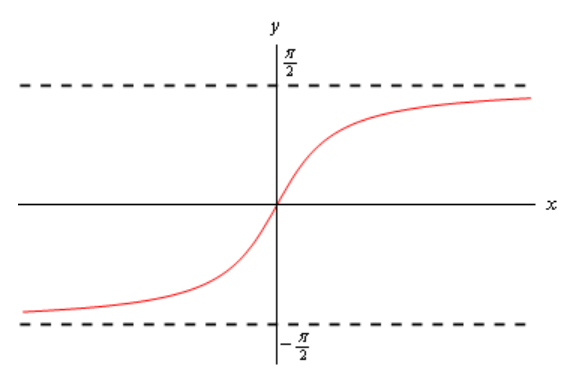

# Section 2.8 : Limits At Infinity, Part II

In the previous section we looked at limits at infinity of polynomials and/or
rational expression involving polynomials. In this section we want to take a
look at some other types of functions that often show up in limits at infinity.
The functions we’ll be looking at here are exponentials, natural logarithms and
inverse tangents.

Let’s start by taking a look at a some of very basic examples involving
exponential functions.

---

**Example 1** Evaluate each of the following limits.

$$ \lim\limits_{x \to \infty}\mathbf{e}^x \quad \quad \lim\limits_{x \to -\infty}\mathbf{e}^x \quad \quad \lim\limits_{x \to \infty}\mathbf{e}^{-x} \quad \quad \lim\limits_{x \to -\infty}\mathbf{e}^{-x} $$

There are really just restatements of facts given in the
[basic exponential section](https://tutorial.math.lamar.edu/Classes/CalcI/ExpFunctions.aspx)
of the review so we’ll leave it to you to go back and verify these.

$$ \lim\limits_{x \to \infty}\mathbf{e}^x = \infty \quad \quad \lim\limits_{x \to -\infty}\mathbf{e}^x = 0 \quad \quad \lim\limits_{x \to \infty}\mathbf{e}^{-x} = 0 \quad \quad \lim\limits_{x \to -\infty}\mathbf{e}^{-x} = \infty $$

---

The main point of this example was to point out that if the exponent of an
exponential goes to infinity in the limit then the exponential function will
also go to infinity in the limit. Likewise, if the exponent goes to minus
infinity in the limit then the exponential will go to zero in the limit.

Note as well, that in the last section the value of the limit did not depend on
whether we went to plus or minus infinity. We’ve already seen in the above
example that changing the sign on the infinity can change the answer so do not
get locked into any assumptions you may have made from the work in the last
section!

Here’s a quick set of examples to illustrate these ideas.

---

**Example 2** Evaluate each of the following limits.

**(a)** $\lim\limits_{x \to \infty}\mathbf{e}^{2 - 4x - 8x^2}$

**Solution**

In this part what we need to note (using Fact 2 above) is that in the limit the
exponent of the exponential does the following,

$$ \lim\limits_{x \to \infty}(2 - 4x - 8x^2) = -\infty $$

So, the exponent goes to minus infinity in the limit and so the exponential must
go to zero in the limit using the ideas from the previous set of examples. So,
the answer here is,

$$ \lim\limits_{x \to \infty}\mathbf{e}^{2 - 4x - 8x^2} = 0 $$

**(b)** $\lim\limits_{t \to -\infty}\mathbf{e}^{t^4 - 5t^2 + 1}$

**Solution**

Here let’s first note that,

$$ \lim\limits_{t \to -\infty}(t^4 - 5t^2 + 1) = \infty $$

The exponent goes to infinity in the limit and so the exponential will also need
to go to infinity in the limit. Or,

$$ \lim\limits_{t \to -\infty}\mathbf{e}^{t^4 - 5t^2 + 1} = \infty $$

**\(c\)** $\lim\limits_{z \to 0^+}\mathbf{e}^{\frac{1}{z}}$

**Solution**

On the surface this part doesn’t appear to belong in this section since it isn’t
a limit at infinity. However, it does fit into the ideas we’re examining in this
set of examples.

So, let’s first note that using the idea from the previous section we have,

$$ \lim\limits_{z \to 0^+}\frac{1}{z} = \infty $$

Remember that in order to do this limit here we do need to do a right-hand
limit.

So, the exponent goes to infinity in the limit and so the exponential must also
go to infinity.

Here’s the answer to this part.

$$ \lim\limits_{z \to 0^+}\mathbf{e}^{\frac{1}{z} } = \infty $$

---

Let’s work some more complicated examples involving exponentials. In the
following set of examples it won’t be that the exponents are more complicated,
but instead that there will be more than one exponential function to deal with.

---

**Example 3** Evaluate each of the following limits.

So, the only difference between these two limits is the fact that in the first
we’re taking the limit as we go to plus infinity and in the second we’re going
to minus infinity. To this point we’ve been able to “reuse” work from the first
limit in the at least a portion of the second limit. With exponentials that will
often not be the case, we’re going to treat each of these as separate problems.

**(a)**
$\lim\limits_{x \to \infty}\left(\mathbf{e}^{10x} - 4\mathbf{e}^{6x} + 3\mathbf{e}^x + 2\mathbf{e}^{-2x} - 9\mathbf{e}^{-15x}\right)$

**Solution**

Let’s start by just taking the limit of each of the pieces and see what we get.

$$ \lim\limits_{x \to \infty}\left(\mathbf{e}^{10x} - 4\mathbf{e}^{6x} + 3\mathbf{e}^x + 2\mathbf{e}^{-2x} - 9\mathbf{e}^{-15x}\right) = \infty - \infty + \infty + 0 - 0 $$

The last two terms aren’t any problem (they will be in the next part however; do
you see that?). The first three are a problem however as they present us with
another indeterminate form.

When dealing with polynomials we factored out the term with the largest exponent
in it. Let’s do the same thing here. However, we now have to deal with both
positive and negative exponents and just what do we mean by the “largest”
exponent. When dealing with these here we look at the terms that are causing the
problems and ask “what is the largest exponent in those terms?”. So, since only
the first three terms are causing us problems (_i.e._ they all evaluate to an
infinity in the limit) we’ll look only at those.

So, since 10x is the largest of the three exponents there we’ll “factor” an
$\mathbf{e}^{10x}$ out of the whole thing. Just as with polynomials we do the
factoring by, in essence, dividing each term by $\mathbf{e}^{10x}$ and
remembering that to simplify the division all we need to do is subtract the
exponents. For example, let’s just take a look at the last term,

$$ \frac{-9\mathbf{e}^{-15x}}{\mathbf{e}^{10x}} = -9\mathbf{e}^{-15x - 10x} = -9\mathbf{e}^{-25x} $$

Doing factoring on all terms then gives,

$$ \lim\limits_{x \to \infty}\left(\mathbf{e}^{10x} - 4\mathbf{e}^{6x} + 3\mathbf{e}^x + 2\mathbf{e}^{-2x} - 9\mathbf{e}^{-15x}\right) = \lim\limits_{x \to \infty}\left[\mathbf{e}^{10x}\left(1 - 4\mathbf{e}^{-4x} + 3\mathbf{e}^{-9x} + 2\mathbf{e}^{-12x} - 9\mathbf{e}^{-25x}\right)\right]$$

Notice that in doing this factoring all the remaining exponentials now have
negative exponents and we know that for this limit (_i.e._ going out to positive
infinity) these will all be zero in the limit and so will no longer cause
problems.

We can now take the limit of the two factors. The first is clearly infinity and
the second is clearly a finite number (one in this case) and so the
[Facts](https://tutorial.math.lamar.edu/Classes/CalcI/InfiniteLimits.aspx#Limit_LimAtInt_InfFacts)
from the Infinite Limits section gives us the following limit,

$$ \lim\limits_{x \to \infty}\left(\mathbf{e}^{10x} - 4\mathbf{e}^{6x} + 3\mathbf{e}^x + 2\mathbf{e}^{-2x} - 9\mathbf{e}^{-15x}\right) = \infty $$

To simplify the work here a little all we really needed to do was factor the
$\mathbf{e}^{10x}$ out of the "problem" terms (the first three in this case) as
follows,

$$ \lim\limits_{x \to \infty}\left(\mathbf{e}^{10x} - 4\mathbf{e}^{6x} + 3\mathbf{e}^x\right) = \lim\limits_{x \to \infty}\left[\mathbf{e}^{10x}\left(1 - 4\mathbf{e}^{-4x} + 3\mathbf{e}^{-9x}\right) + 2\mathbf{e}^{-2x} - 9\mathbf{e}^{-15x}\right] $$

$$ \quad = (\infty)(1) + 0 - 0 $$

$$ \quad = \infty $$

We factored the $\mathbf{e}^{10x}$ out of all terms for the practice of doing
the factoring and to avoid any issues with having the extra terms at the end.
Note as well that while we wrote $(\infty)(1)$ for the limit of the first term
we are really using the
[Facts](https://tutorial.math.lamar.edu/Classes/CalcI/InfiniteLimits.aspx#Limit_LimAtInt_InfFacts)
from the Infinite Limit section to do that limit.

**(b)**
$\lim\limits_{x \to -\infty}\left(\mathbf{e}^{10x} - 4\mathbf{e}^{6x} + 3\mathbf{e}^x + 2\mathbf{e}^{-2x} - 9\mathbf{e}^{-15x}\right)$

**Solution**

Let’s start this one off in the same manner as the first part. Let’s take the
limit of each of the pieces. This time note that because our limit is going to
negative infinity the first three exponentials will in fact go to zero (because
their exponents go to minus infinity in the limit). The final two exponentials
will go to infinity in the limit (because their exponents go to plus infinity in
the limit).

Taking the limits gives,

$$ \lim\limits_{x \to -\infty}\left(\mathbf{e}^{10x} - 4\mathbf{e}^{6x} + 3\mathbf{e}^x + 2\mathbf{e}^{-2x} - 9\mathbf{e}^{-15x}\right) = 0 - 0 + 0 + \infty - \infty $$

So, the last two terms are the problem here as they once again leave us with an
indeterminate form. As with the first example we’re going to factor out the
"largest" exponent in the last two terms. This time however, "largest" doesn't
refer to the bigger of the two numbers (-2 is bigger than -15). Instead we're
going to use "largest" to refer to the exponent that is farther away from zero.
Using this definition of "largest" means that we're going to factor an
$\mathbf{e}^{-15x}$ out.

Again, remember that to factor this out all we really are doing is dividing each
term by $\mathbf{e}^{-15x}$ and then subtracting exponents. Here’s the work for
the first term as an example,

$$ \frac{\mathbf{e}^{10x}}{\mathbf{e}^{-15x}} = \mathbf{e}^{10x - (-15x)} = \mathbf{e}^{25x} $$

As with the first part we can either factor it out of only the "problem" terms
(_i.e._ the last two terms), or all the terms. For the practice we’ll factor it
out of all the terms. Here is the factoring work for this limit,

$$ \lim\limits_{x \to -\infty}\left(\mathbf{e}^{10x} - 4\mathbf{e}^{6x} + 3\mathbf{e}^x + 2\mathbf{e}^{-2x} - 9\mathbf{e}^{-15x}\right) = \lim\limits_{x \to -\infty}\left[\mathbf{e}^{-15x}\left(\mathbf{e}^{25x} - 4\mathbf{e}^{21x} + 3\mathbf{e}^{16x} + 2\mathbf{e}^{13x} - 9\right)\right] $$

Finally, after taking the limit of the two terms (the first is infinity and the
second is a negative, finite number) and recalling the Facts from the Infinite
Limit section we see that the limit is,

$$ \lim\limits_{x \to -\infty}\left(\mathbf{e}^{10x} - 4\mathbf{e}^{6x} + 3\mathbf{e}^x + 2\mathbf{e}^{-2x} - 9\mathbf{e}^{-15x}\right) = -\infty $$

---

So, when dealing with sums and/or differences of exponential functions we look
for the exponential with the "largest" exponent and remember here that "largest"
means the exponent farthest from zero. Also remember that if we’re looking at a
limit at plus infinity only the exponentials with positive exponents are going
to cause problems so those are the only terms we look at in determining the
largest exponent. Likewise, if we are looking at a limit at minus infinity then
only exponentials with negative exponents are going to cause problems and so
only those are looked at in determining the largest exponent.

Finally, as you might have been able to guess from the previous example when
dealing with a sum and/or difference of exponentials all we need to do is look
at the largest exponent to determine the behavior of the whole expression.
Again, remembering that if the limit is at plus infinity we only look at
exponentials with positive exponents and if we’re looking at a limit at minus
infinity we only look at exponentials with negative exponents.

Let’s next take a look at some rational functions involving exponentials.

---

**Example 4** Evaluate each of the following limits.

As with the previous example, the only difference between the first two parts is
that one of the limits is going to plus infinity and the other is going to minus
infinity and just as with the previous example each will need to be worked
differently.

**(a)**
$\lim\limits_{x \to \infty}\dfrac{6\mathbf{e}^{4x} - \mathbf{e}^{-2x}}{8\mathbf{e}^{4x} - \mathbf{e}^{2x} + 3\mathbf{e}^{-x}}$

**Solution**

The basic concept involved in working this problem is the same as with rational
expressions in the previous section. We look at the denominator and determine
the exponential function with the "largest" exponent which we will then factor
out from both numerator and denominator. We will use the same reasoning as we
did with the previous example to determine the "largest" exponent. In the case
since we are looking at a limit at plus infinity we only look at exponentials
with positive exponents.

So, we’ll factor an $\mathbf{e}^{4x}$ out of both then numerator and
denominator. Once that is done we can cancel the e4x and then take the limit of
the remaining terms. Here is the work for this limit,

$$ \lim\limits_{x \to \infty}\dfrac{6\mathbf{e}^{4x} - \mathbf{e}^{-2x}}{8\mathbf{e}^{4x} - \mathbf{e}^{2x} + 3\mathbf{e}^{-x}} = \lim\limits_{x \to \infty}\frac{\mathbf{e}^{4x}\left(6 - \mathbf{e}^{-6x}\right)}{\mathbf{e}^{4x}\left(8 - \mathbf{e}^{-2x} + 3\mathbf{e}^{-5x}\right)} $$

$$ \quad = \lim\limits_{x \to \infty}\frac{6 - \mathbf{e}^{-6x}}{8 - \mathbf{e}^{-2x} + 3\mathbf{e}^{-5x}} $$

$$ \quad = \frac{6 - 0}{8 - 0 + 0} $$

$$ \quad = \frac{3}{4} $$

**(b)**
$\lim\limits_{x \to -\infty}\dfrac{6\mathbf{e}^{4x} - \mathbf{e}^{-2x}}{8\mathbf{e}^{4x} - \mathbf{e}^{2x} + 3\mathbf{e}^{-x}}$

**Solution**

In this case we’re going to minus infinity in the limit and so we’ll look at
exponentials in the denominator with negative exponents in determining the
"largest" exponent. There’s only one however in this problem so that is what
we’ll use.

Again, remember to only look at the denominator. Do NOT use the exponential from
the numerator, even though that one is "larger" than the exponential in the
denominator. We always look only at the denominator when determining what term
to factor out regardless of what is going on in the numerator.

Here is the work for this part.

$$ \lim\limits_{x \to -\infty}\dfrac{6\mathbf{e}^{4x} - \mathbf{e}^{-2x}}{8\mathbf{e}^{4x} - \mathbf{e}^{2x} + 3\mathbf{e}^{-x}} = \lim\limits_{x \to -\infty}\frac{\mathbf{e}^{-x}\left(6\mathbf{e}^{5x} - \mathbf{e}^{-x}\right)}{\mathbf{e}^{-x} \left(8\mathbf{e}^{5x} - \mathbf{e}^{3x} + 3\right)} $$

$$ \quad = \lim\limits_{x \to -\infty}\frac{6\mathbf{e}^{5x} - \mathbf{e}^{-x}}{8\mathbf{e}^{5x} - \mathbf{e}^{3x} + 3} $$

$$ \quad = \frac{0 - \infty}{0 - 0 + 3} $$

$$ \quad = -\infty $$

**\(c\)**
$\lim\limits_{t \to -\infty}\dfrac{\mathbf{e}^{6t} - 4\mathbf{e}^{-6t}}{2\mathbf{e}^{3t} - 5\mathbf{e}^{-9t} + \mathbf{e}^{-3t}}$

**Solution**

We’ll do the work on this part with much less detail.

$$ \lim\limits_{t \to -\infty}\dfrac{\mathbf{e}^{6t} - 4\mathbf{e}^{-6t}}{2\mathbf{e}^{3t} - 5\mathbf{e}^{-9t} + \mathbf{e}^{-3t}} = \lim\limits_{t \to -\infty}\frac{\mathbf{e}^{-9t}\left(\mathbf{e}^{15t} - 4\mathbf{e}^{3t}\right)}{\mathbf{e}^{-9t}\left(2\mathbf{e}^{12t} - 5 + \mathbf{e}^{6t}\right)} $$

$$ \quad = \lim\limits_{t \to -\infty}\frac{\mathbf{e}^{15t} - 4\mathbf{e}^{3t}}{2\mathbf{3}^{12t} - 5 + \mathbf{e}^{6t}} $$

$$ \quad = \frac{0 - 0}{0 - 5 + 0} $$

$$ \quad = 0 $$

---

Next, let’s take a quick look at some basic limits involving logarithms.

---

**Example 5** Evaluate each of the following limits.

$$ \lim\limits_{x \to 0^+}\ln x \quad \quad \lim\limits_{x \to \infty} \ln x $$

**Solution**

As with the last example I’ll leave it to you to verify these restatements from
the
[basic logarithm section](https://tutorial.math.lamar.edu/Classes/CalcI/LogFcns.aspx).

$$ \lim\limits_{x \to 0^+}\ln x = -\infty \quad \quad \lim\limits_{x \to \infty}\ln x = \infty $$

Note that we had tod a right-handed limit for the first one since we can't plug
negative $x$'s into a logarithm. This means that the normal limit won't exist
since we must look at $x$'s from both sides of the point in question and $x$'s
to the left of zero are negative.

---

From the previous example we can see that if the argument of a log (the stuff
we’re taking the log of) goes to zero from the right (_i.e._ always positive)
then the log goes to negative infinity in the limit while if the argument goes
to infinity then the log also goes to infinity in the limit.

Note as well that we can’t look at a limit of a logarithm as x

approaches minus infinity since we can’t plug negative numbers into the
logarithm.

Let’s take a quick look at some logarithm examples.

---

**Example 6** Evaluate each of the following limits.

**(a)** $\lim\limits_{x \to \infty}\left(7x^3 - x^2 + 1\right)$

So, let’s first look to see what the argument of the log is doing,

$$ \lim\limits_{x \to \infty}\left(7x^3 - x^2 + 1\right) = \infty $$

The argument of the log is going to infinity and so the log must also be going
to infinity in the limit. The answer to this part is then,

$$ \lim\limits_{x \to \infty}\left(7x^3 - x^2 + 1\right) = \infty $$

**Solution**

**(b)** $\lim\limits_{t \to -\infty}\ln\left(\dfrac{1}{t^2 - 5t}\right)$

**Solution**

First, note that the limit going to negative infinity here isn’t a violation
(necessarily) of the fact that we can’t plug negative numbers into the
logarithm. The real issue is whether or not the argument of the log will be
negative or not.

Using the techniques from earlier in this section we can see that,

$$ \lim\limits_{t \to -\infty}\frac{1}{t^2 - 5t} = 0 $$

and let’s also note that for negative numbers (which we can assume we’ve got
since we’re going to minus infinity in the limit) the denominator will always be
positive and so the quotient will also always be positive. Therefore, not only
does the argument go to zero, it goes to zero from the right. This is exactly
what we need to do this limit.

So, the answer here is,

$$ \lim\limits_{t \to -\infty}\ln\left(\dfrac{1}{t^2 - 5t}\right) = -\infty $$

---

As a final set of examples let’s take a look at some limits involving inverse
tangents.

---

**Example 7** Evaluate each of the following limits.

The first two parts here are really just the basic limits involving inverse
tangents and can easily be found by examining the following sketch of inverse
tangents. The remaining two parts are more involved but as with the exponential
and logarithm limits really just refer back to the first two parts as we’ll see.

**(a)** $\lim\limits_{x \to \infty}\tan^{-1}x$

**Solution**

As noted above all we really need to do here is look at the graph of the inverse
tangent. Doing this shows us that we have the following value of the limit.

$$ \lim\limits_{x \to \infty}\tan^{-1}x = \frac{\pi}{2} $$

**(b)** $\lim\limits_{x \to -\infty}\tan^{-1}x$

**Solution**

Again, not much to do here other than examine the graph of the inverse tangent.

$$ \lim\limits_{x \to -\infty}\tan^{-1}x = -\frac{\pi}{2} $$

**\(c\)** $\lim\limits_{x \to \infty}\tan^{-1}\left(x^3 - 5x + 6\right)$

**Solution**

Okay, in part (a) above we saw that if the argument of the inverse tangent
function (the stuff inside the parenthesis) goes to plus infinity then we know
the value of the limit. In this case (using the techniques from the previous
section) we have,

$$ \lim\limits_{x \to \infty}x^3 - 5x + 6 = \infty $$

So, this limit is,

$$ \lim\limits_{x \to \infty}\tan^{-1}\left(x^3 - 5x + 6\right) = \frac{\pi}{2} $$

**(d)** $\lim\limits_{x \to 0^-}\tan^{-1}\left(\dfrac{1}{x}\right)$

**Solution**

Even though this limit is not a limit at infinity we’re still looking at the
same basic idea here. We’ll use part (b) from above as a guide for this limit.
We know from the
[Infinite Limits](https://tutorial.math.lamar.edu/Classes/CalcI/InfiniteLimits.aspx#Limit_InfLimit_Ex1)
section that we have the following limit for the argument of this inverse
tangent,

$$ \lim\limits_{x \to 0^-}\frac{1}{x} = -\infty $$

So, since the argument goes to minus infinity in the limit we know that this
limit must be,

$$ \lim\limits_{x \to 0^-}\tan^{-1}\left(\dfrac{1}{x}\right) = -\frac{\pi}{2} $$

---

To see a precise and mathematical definition of this kind of limit see the The
[Definition of the Limit](https://tutorial.math.lamar.edu/Classes/CalcI/DefnOfLimit.aspx)
section at the end of this chapter.

---

## Practice Problems

For problems 1 - 6 evaluate **(a)** $\lim\limits_{x \to -\infty}f(x)$ and
**(b)** $\lim\limits_{x \to \infty}f(x)$.

**1.** $f(x) = \mathbf{e}^{8 + 2x - x^3}$

**(a)** $\lim\limits_{x \to -\infty}f(x)$

$$ \lim\limits_{x \to -\infty}\mathbf{e}^{8 + 2x - x^3} $$

$$ \lim\limits_{x \to -\infty}(8 + 2x - x^3) = \infty $$

$$ \boxed{\lim\limits_{x \to -\infty}\mathbf{e}^{8 + 2x - x^3} = \infty} $$

**Solution**

**(b)** $\lim\limits_{x \to \infty}f(x)$

**Solution**

$$ \lim\limits_{x \to \infty}\mathbf{e}^{8 + 2x - x^3} $$

$$ \lim\limits_{x \to \infty}(8 + 2x - x^3) = -\infty $$

$$ \boxed{\lim\limits_{x \to \infty}\mathbf{e}^{8 + 2x - x^3} = 0} $$

**2.** $f(x) = \mathbf{e}^{\frac{6x^2 + x}{5 + 3x}}$

**(a)** $\lim\limits_{x \to -\infty}f(x)$

**Solution**

$$ \lim\limits_{x \to -\infty}\mathbf{e}^{\frac{6x^2 + x}{5 + 3x}} $$

$$ \lim\limits_{x \to -\infty}\left(\frac{6x^2 + x}{5 + 3x}\right) $$

$$ \lim\limits_{x \to -\infty}\left(\frac{x\left(6x + 1\right)}{x\left(\frac{5}{x} + 3\right)}\right) $$

$$ \lim\limits_{x \to -\infty}\left(\frac{6x + 1}{\frac{5}{x} + 3}\right) $$

$$ \lim\limits_{x \to -\infty}\left(\frac{-\infty + 1}{0 + 3}\right) $$

$$ \lim\limits_{x \to -\infty}\left(\frac{-\infty}{3}\right) $$

$$ \lim\limits_{x \to -\infty}-\infty = -\infty $$

$$ \lim\limits_{x \to -\infty}\mathbf{e}^{\frac{6x^2 + x}{5 + 3x}} = \lim\limits_{x \to -\infty}\mathbf{e}^{-\infty} = 0 $$

$$ \boxed{\lim\limits_{x \to -\infty}\mathbf{e}^{\frac{6x^2 + x}{5 + 3x}} = 0} $$

**(b)** $\lim\limits_{x \to \infty}f(x)$

$$ \lim\limits_{x \to \infty}\mathbf{e}^{\frac{6x^2 + x}{5 + 3x}} $$

$$ \lim\limits_{x \to \infty}\left(\frac{6x^2 + x}{5 + 3x}\right) $$

$$ \lim\limits_{x \to \infty}\left(\frac{x\left(6x + 1\right)}{x\left(\frac{5}{x} + 3\right)}\right) $$

$$ \lim\limits_{x \to \infty}\left(\frac{6x + 1}{\frac{5}{x} + 3}\right) $$

$$ \lim\limits_{x \to \infty}\left(\frac{\infty + 1}{0 + 3}\right) $$

$$ \lim\limits_{x \to \infty}\left(\frac{\infty}{3}\right) $$

$$ \lim\limits_{x \to \infty}\infty = \infty $$

$$ \lim\limits_{x \to \infty}\mathbf{e}^{\frac{6x^2 + x}{5 + 3x}} = \lim\limits_{x \to \infty}\mathbf{e}^{\infty} = \infty $$

$$ \boxed{\lim\limits_{x \to \infty}\mathbf{e}^{\frac{6x^2 + x}{5 + 3x}} = \infty} $$

**Solution**

**3.** $f(x) = 2\mathbf{e}^{6x} - \mathbf{e}^{-7x} - 10\mathbf{e}^{4x}$

**(a)** $\lim\limits_{x \to -\infty}f(x)$

**Solution**

$$ \lim\limits_{x \to -\infty}2\mathbf{e}^{6x} - \mathbf{e}^{-7x} - 10\mathbf{e}^{4x} $$

$$ \lim\limits_{x \to -\infty}\left[\mathbf{e}^{-7x}\left(2\mathbf{e}^{13x} - 1 - 10\mathbf{e}^{11x}\right)\right] $$

$$ \lim\limits_{x \to -\infty}\left[\mathbf{e}^{-7x}\left(2(0)- 1 - 10(0)\right)\right] $$

$$ \lim\limits_{x \to -\infty}\left[\mathbf{e}^{-7x}\left(-1\right)\right] $$

$$ \lim\limits_{x \to -\infty}(\infty)(-1) $$

$$ \lim\limits_{x \to -\infty}(-\infty) = -\infty $$

$$ \boxed{\lim\limits_{x \to -\infty}f(x) = -\infty} $$

**(b)** $\lim\limits_{x \to \infty}f(x)$

**Solution**

$$ \lim\limits_{x \to \infty}2\mathbf{e}^{6x} - \mathbf{e}^{-7x} - 10\mathbf{e}^{4x} $$

$$ \lim\limits_{x \to \infty}\left[\mathbf{e}^{6x}\left(2 - \mathbf{e}^{-13x} - 10\mathbf{e}^{-2x}\right)\right] $$

$$ \lim\limits_{x \to \infty}\left[\mathbf{e}^{6x}\left(2 - 0 - 0\right)\right] $$

$$ \lim\limits_{x \to \infty}\left[\mathbf{e}^{6x}\left(2\right)\right] $$

$$ \lim\limits_{x \to \infty}\left[\infty\left(2\right)\right] $$

$$ \lim\limits_{x \to \infty}\infty = \infty $$

$$ \boxed{\lim\limits_{x \to \infty}f(x) = \infty} $$

**4.** $f(x) = 3\mathbf{e}^{-x} - 8\mathbf{e}^{-5x} - \mathbf{e}^{10x}$

**(a)** $\lim\limits_{x \to -\infty}f(x)$

**Solution**

$$ \lim\limits_{x \to -\infty}\left(3\mathbf{e}^{-x} - 8\mathbf{e}^{-5x} - \mathbf{e}^{10x}\right) $$

$$ \lim\limits_{x \to -\infty}\left[\mathbf{e}^{-5x}\left(3\mathbf{e}^{4x} - 8 - \mathbf{e}^{15x}\right)\right] $$

$$ \lim\limits_{x \to -\infty}\left[\mathbf{e}^{-5x}\left(3(0) - 8 - 0\right)\right] $$

$$ \lim\limits_{x \to -\infty}\left[\mathbf{e}^{-5x}\left(0 - 8 - 0\right)\right] $$

$$ \lim\limits_{x \to -\infty}\left[\mathbf{e}^{-5x}\left(-8\right)\right] $$

$$ \lim\limits_{x \to -\infty}\left[\infty\left(-8\right)\right] $$

$$ \lim\limits_{x \to -\infty}-\infty = -\infty $$

$$ \boxed{\lim\limits_{x \to -\infty}f(x) = -\infty} $$

**(b)** $\lim\limits_{x \to \infty}f(x)$

**Solution**

$$ \lim\limits_{x \to \infty}\left(3\mathbf{e}^{-x} - 8\mathbf{e}^{-5x} - \mathbf{e}^{10x}\right) $$

$$ \lim\limits_{x \to \infty}\left[\mathbf{e}^{10x}\left(3\mathbf{e}^{-11x} - 8\mathbf{e}^{-15x} - 1\right)\right] $$

$$ \lim\limits_{x \to \infty}\left[\mathbf{e}^{10x}\left(0 - 0 - 1\right)\right] $$

$$ \lim\limits_{x \to \infty}\left[\mathbf{e}^{10x}\left(-1\right)\right] $$

$$ \lim\limits_{x \to \infty}\left[\infty\left(-1\right)\right] $$

$$ \lim\limits_{x \to \infty}-\infty = -\infty $$

$$ \boxed{\lim\limits_{x \to \infty}f(x) = -\infty} $$

**5.**
$f(x) = \dfrac{\mathbf{e}^{-3x} - 2\mathbf{e}^{8x}}{9\mathbf{e}^{8x} - 7\mathbf{e}^{-3x}}$

**(a)** $\lim\limits_{x \to -\infty}f(x)$

**Solution**

$$ \lim\limits_{x \to -\infty}\left(\frac{\mathbf{e}^{-3x} - 2\mathbf{e}^{8x}}{9\mathbf{e}^{8x} - 7\mathbf{e}^{-3x}}\right) $$

$$ \lim\limits_{x \to -\infty}\left[\frac{\mathbf{e}^{-3x}\left(1 - 2\mathbf{e}^{11x}\right)}{\mathbf{e}^{-3x}\left(9\mathbf{e}^{11x} - 7\right)}\right] $$

$$ \lim\limits_{x \to -\infty}\left[\frac{1 - 0}{0 - 7}\right] $$

$$ \lim\limits_{x \to -\infty}\left[\frac{1}{-7}\right] = -\frac{1}{7} $$

$$ \boxed{\lim\limits_{x \to -\infty}f(x) = -\frac{1}{7}} $$

**(b)** $\lim\limits_{x \to \infty}f(x)$

**Solution**

$$ \lim\limits_{x \to \infty}\left(\frac{\mathbf{e}^{-3x} - 2\mathbf{e}^{8x}}{9\mathbf{e}^{8x} - 7\mathbf{e}^{-3x}}\right) $$

$$ \lim\limits_{x \to \infty}\left[\frac{\mathbf{e}^{8x}\left(\mathbf{e}^{-11x} - 2\right)}{\mathbf{e}^{8x}\left(9 - 7\mathbf{e}^{-11x}\right)}\right] $$

$$ \lim\limits_{x \to \infty}\left[\frac{0 - 2}{9 - 0}\right] $$

$$ \lim\limits_{x \to \infty}\left(\frac{-2}{9}\right) $$

$$ \lim\limits_{x \to \infty}\left(-\frac{2}{9}\right) = -\frac{2}{9} $$

$$ \boxed{\lim\limits_{x \to \infty}f(x) = -\frac{2}{9}} $$

**6.**
$f(x) = \dfrac{\mathbf{e}^{-7x} - 2\mathbf{e}^{3x} - \mathbf{e}^x}{\mathbf{e}^{-x} + 16\mathbf{e}^{10x} + 2\mathbf{e}^{-4x}}$

**(a)** $\lim\limits_{x \to -\infty}f(x)$

**Solution**

$$ \lim\limits_{x \to -\infty}\left(\frac{\mathbf{e}^{-7x} - 2\mathbf{e}^{3x} - \mathbf{e}^x}{\mathbf{e}^{-x} + 16\mathbf{e}^{10x} + 2\mathbf{e}^{-4x}}\right) $$

$$ \lim\limits_{x \to -\infty}\left[\frac{\mathbf{e}^{-4x}\left(\mathbf{e}^{-3x} - 2\mathbf{e}^{7x} - \mathbf{e}^{5x}\right)}{\mathbf{e}^{-4x}\left(\mathbf{e}^{3x} + 16\mathbf{e}^{14x} + 2\right)}\right] $$

$$ \lim\limits_{x \to -\infty}\left[\frac{\infty - 0 - 0}{0 + 0 + 2}\right] $$

$$ \lim\limits_{x \to -\infty}\left[\frac{\infty}{2}\right] $$

$$ \lim\limits_{x \to -\infty}\infty = \infty $$

$$ \boxed{\lim\limits_{x \to -\infty}f(x) = \infty} $$

**(b)** $\lim\limits_{x \to \infty}f(x)$

**Solution**

$$ \lim\limits_{x \to \infty}\left(\frac{\mathbf{e}^{-7x} - 2\mathbf{e}^{3x} - \mathbf{e}^x}{\mathbf{e}^{-x} + 16\mathbf{e}^{10x} + 2\mathbf{e}^{-4x}}\right) $$

$$ \lim\limits_{x \to \infty}\left[\frac{\mathbf{e}^{10x}\left(\mathbf{e}^{-17x} -2\mathbf{e}^{-7x} - \mathbf{e}^{-9x}\right)}{\mathbf{e}^{10x}\left(\mathbf{e}^{-11x} + 16 + 2\mathbf{e}^{-14x}\right)}\right] $$

$$ \lim\limits_{x \to \infty}\left[\frac{0 - 0 - 0}{0 + 16 + 0}\right] $$

$$ \lim\limits_{x \to \infty}\left(\frac{0}{16}\right) $$

$$ \lim\limits_{x \to \infty}0 = 0 $$

$$ \boxed{\lim\limits_{x \to \infty}f(x) = 0} $$

For problems 7 - 12 evaluate the given limit.

**7.** $\lim\limits_{t \to -\infty}\ln\left(4 - 9t - t^3\right)$

**Solution**

$$ \lim\limits_{t \to -\infty}\ln\left(4 - 9t - t^3\right) $$

$$ \lim\limits_{t \to -\infty}\left(4 - 9t - t^3\right) $$

$$ \lim\limits_{t \to -\infty}\left(4 - 9(-\infty) - (-\infty)\right) $$

$$ \lim\limits_{t \to -\infty}\left(4 + \infty +\infty\right) $$

$$ \lim\limits_{t \to -\infty}\infty = \infty $$

$$ \lim\limits_{t \to -\infty}\ln\left(4 - 9t - t^3\right) = \lim\limits_{t \to -\infty}\ln(\infty) = \infty $$

$$ \boxed{\lim\limits_{t \to -\infty}\ln\left(4 - 9t - t^3\right) = \infty} $$

**8.** $\lim\limits_{z \to -\infty}\ln\left(\dfrac{3z^4 - 8}{2 + z^2}\right)$

**Solution**

$$ \lim\limits_{z \to -\infty}\ln\left(\dfrac{3z^4 - 8}{2 + z^2}\right) $$

$$ \lim\limits_{z \to -\infty}\left(\dfrac{3z^4 - 8}{2 + z^2}\right) $$

$$ \lim\limits_{z \to -\infty}\left[\dfrac{z^2\left(3z^2 - \frac{8}{z^2}\right)}{z^2\left(\frac{2}{z^2} + 1\right)}\right] $$

$$ \lim\limits_{z \to -\infty}\left[\dfrac{3z^2 - \frac{8}{z^2}}{\frac{2}{z^2} + 1}\right] $$

$$ \lim\limits_{z \to -\infty}\left[\dfrac{\infty - 0}{0 + 1}\right] $$

$$ \lim\limits_{z \to -\infty}\infty = \infty $$

$$ \lim\limits_{z \to -\infty}\ln\left(\dfrac{3z^4 - 8}{2 + z^2}\right) = \lim\limits_{z \to -\infty}\ln(\infty) = \infty $$

$$ \boxed{\lim\limits_{z \to -\infty}\ln\left(\dfrac{3z^4 - 8}{2 + z^2}\right) = \infty} $$

**9.** $\lim\limits_{x \to \infty}\ln\left(\dfrac{11 + 8x}{x^3 + 7x}\right)$

**Solution**

$$ \lim\limits_{x \to \infty}\ln\left(\dfrac{11 + 8x}{x^3 + 7x}\right) $$

$$ \lim\limits_{x \to \infty}\left(\dfrac{11 + 8x}{x^3 + 7x}\right) $$

$$ \lim\limits_{x \to \infty}\left[\dfrac{x^3\left(\frac{11}{x^3} + \frac{8}{x^2}\right)}{x^3\left(1 + \frac{7}{x^2}\right)}\right] $$

$$ \lim\limits_{x \to \infty}\left[\dfrac{0 + 0}{1 + 0}\right] $$

$$ \lim\limits_{x \to \infty}\left[\dfrac{0}{1}\right] $$

$$ \lim\limits_{x \to \infty}0 = 0 $$

$$ \lim\limits_{x \to \infty}\ln\left(\dfrac{11 + 8x}{x^3 + 7x}\right) = \lim\limits_{x \to \infty}\ln(0) = -\infty $$

We can only ensure that this is true because if we look at the denominator
$x^3 + 7x$ is guaranteed to never be negative because of $x \to \infty$ being
the limit. Therefore we're always approaching $0$ from the righthand side here,
$0^+$.

$$ \frac{11 + 8x}{x^3 + 7x} \to 0^+ $$

$$ \boxed{\lim\limits_{x \to \infty}\ln\left(\dfrac{11 + 8x}{x^3 + 7x}\right) = -\infty} $$

**10.** $\lim\limits_{x \to -\infty}\tan^{-1}\left(7 - x + 3x^5\right)$

**Solution**

$$ \lim\limits_{x \to -\infty}\tan^{-1}\left(7 - x + 3x^5\right) $$

$$ \lim\limits_{x \to -\infty}\left(7 - x + 3x^5\right) $$

$$ \lim\limits_{x \to -\infty}\left[x\left(\frac{7}{x} - 1 + 3x^4\right)\right] $$

$$ \lim\limits_{x \to -\infty}\left[-\infty\left(-\infty - 1 + \infty\right)\right] $$

$$ \lim\limits_{x \to -\infty}\left[-\infty\left(-\infty + \infty\right)\right] $$

$$ \lim\limits_{x \to -\infty}\left[-\infty\left(\infty\right)\right] $$

$$ \lim\limits_{x \to -\infty}-\infty = -\infty$$

$$ \lim\limits_{x \to -\infty}\tan^{-1}\left(7 - x + 3x^5\right) = \lim\limits_{x \to -\infty}\tan^{-1}(-\infty) = -\frac{\pi}{2} $$

$$ \boxed{\lim\limits_{x \to -\infty}\tan^{-1}\left(7 - x + 3x^5\right) = -\frac{\pi}{2}} $$

**11.** $\lim\limits_{t \to \infty}\tan^{-1}\left(\dfrac{4 + 7t}{2 - t}\right)$

**Solution**

$$ \lim\limits_{t \to \infty}\tan^{-1}\left(\dfrac{4 + 7t}{2 - t}\right) $$

$$ \lim\limits_{t \to \infty}\left(\dfrac{4 + 7t}{2 - t}\right) $$

$$ \lim\limits_{t \to \infty}\left[\dfrac{t\left(\frac{4}{t} + 7\right)}{t\left(\frac{2}{t} - 1\right)}\right] $$

$$ \lim\limits_{t \to \infty}\left[\dfrac{\frac{4}{t} + 7}{\frac{2}{t} - 1}\right] $$

$$ \lim\limits_{t \to \infty}\left[\dfrac{0 + 7}{0 - 1}\right] $$

$$ \lim\limits_{t \to \infty}\left[\dfrac{7}{-1}\right] $$

$$ \lim\limits_{t \to \infty}-7 = -7 $$

$$ \boxed{\lim\limits_{t \to \infty}\tan^{-1}\left(\dfrac{4 + 7t}{2 - t}\right) = \tan^{-1}(-7)} $$

**12.**
$\lim\limits_{w \to \infty}\tan^{-1}\left(\dfrac{3w^2 - 9w^4}{4w - w^3}\right)$

**Solution**

$$ \lim\limits_{w \to \infty}\tan^{-1}\left(\dfrac{3w^2 - 9w^4}{4w - w^3}\right) $$

$$ \lim\limits_{w \to \infty}\left(\dfrac{3w^2 - 9w^4}{4w - w^3}\right) $$

$$ \lim\limits_{w \to \infty}\left[\dfrac{w^3\left(\frac{3}{w} - 9w\right)}{w^3\left(\frac{4}{w^2} - 1\right)}\right] $$

$$ \lim\limits_{w \to \infty}\left[\dfrac{0 - \infty}{0 - 1}\right] $$

$$ \lim\limits_{w \to \infty}\left[\dfrac{-\infty}{-1}\right] $$

$$ \lim\limits_{w \to \infty}\infty = \infty $$

$$ \lim\limits_{w \to \infty}\tan^{-1}\left(\dfrac{3w^2 - 9w^4}{4w - w^3}\right) = \lim\limits_{w \to \infty}\tan^{-1}(\infty) = \frac{\pi}{2} $$

$$ \boxed{\lim\limits_{w \to \infty}\tan^{-1}\left(\dfrac{3w^2 - 9w^4}{4w - w^3}\right) = \frac{\pi}{2}} $$

---

## Assignment Problems

For problems 1 - 11 evaluate **(a)** $\lim\limits_{x \to -\infty}f(x)$ and
**(b)** $\lim\limits_{x \to \infty}f(x)$.

**1.** $f(x) = \mathbf{e}^{x^4 + 8x}$

**(a)** $\lim\limits_{x \to -\infty}f(x)$

**Solution**

$$ \lim\limits_{x \to -\infty}\left(\mathbf{e}^{x^4 + 8x}\right) $$

$$ \lim\limits_{x \to -\infty}\left(x^4 + 8x\right) $$

$$ \lim\limits_{x \to -\infty}\left[x^4\left(1 + \frac{8}{x^3}\right)\right] $$

$$ \lim\limits_{x \to -\infty}\left[\infty\left(1 + 0\right)\right] $$

$$ \lim\limits_{x \to -\infty}\left[\infty\left(1\right)\right] $$

$$ \lim\limits_{x \to -\infty}\infty = \infty $$

$$ \lim\limits_{x \to -\infty}\left(\mathbf{e}^{x^4 + 8x}\right) = \lim\limits_{x \to -\infty}\left(\mathbf{e}^{\infty}\right) = \infty $$

$$ \boxed{\lim\limits_{x \to -\infty}\left(\mathbf{e}^{x^4 + 8x}\right) = \infty} $$

**(b)** $\lim\limits_{x \to \infty}f(x)$

**Solution**

$$ \lim\limits_{x \to \infty}\left(\mathbf{e}^{x^4 + 8x}\right) $$

$$ \lim\limits_{x \to \infty}\left(x^4 + 8x\right) $$

$$ \lim\limits_{x \to \infty}\left(x^4\left(1 + \frac{8}{x^3}\right)\right) $$

$$ \lim\limits_{x \to \infty}\left(\infty\left(1 + 0\right)\right) $$

$$ \lim\limits_{x \to \infty}\left(\infty\left(1\right)\right) $$

$$ \lim\limits_{x \to \infty}\infty = \infty $$

$$ \lim\limits_{x \to \infty}\left(\mathbf{e}^{x^4 + 8x}\right) = \lim\limits_{x \to \infty}\left(\mathbf{e}^{\infty}\right) = \infty $$

$$ \boxed{\lim\limits_{x \to \infty}\left(\mathbf{e}^{x^4 + 8x}\right) = \infty} $$

**2.** $f(x) = \mathbf{e}^{2x + 4x^2 + 2x^5}$

**(a)** $\lim\limits_{x \to -\infty}f(x)$

**Solution**

$$ \lim\limits_{x \to -\infty}\left(\mathbf{e}^{2x + 4x^2 + 2x^5}\right) $$

$$ \lim\limits_{x \to -\infty}\left(2x + 4x^2 + 2x^5\right) $$

$$ \lim\limits_{x \to -\infty}\left[x^5\left(\frac{2}{x^4} + \frac{4}{x^3} + 2\right)\right] $$

$$ \lim\limits_{x \to -\infty}\left[-\infty\left(0 + 0 + 2\right)\right] $$

$$ \lim\limits_{x \to -\infty}\left[-\infty\left(2\right)\right] $$

$$ \lim\limits_{x \to -\infty}-\infty = -\infty $$

$$ \lim\limits_{x \to -\infty}\left(\mathbf{e}^{2x + 4x^2 + 2x^5}\right) = \lim\limits_{x \to -\infty}\left(\mathbf{e}^{-\infty}\right) = 0 $$

$$ \boxed{\lim\limits_{x \to -\infty}\left(\mathbf{e}^{2x + 4x^2 + 2x^5}\right) = 0} $$

**(b)** $\lim\limits_{x \to \infty}f(x)$

**Solution**

$$ \lim\limits_{x \to \infty}\left(\mathbf{e}^{2x + 4x^2 + 2x^5}\right) $$

$$ \lim\limits_{x \to \infty}\left(2x + 4x^2 + 2x^5\right) $$

$$ \lim\limits_{x \to \infty}\left[x^5\left(\frac{2}{x^4} + \frac{4}{x^3} + 2\right)\right] $$

$$ \lim\limits_{x \to \infty}\left[\infty\left(0 + 0 + 2\right)\right] $$

$$ \lim\limits_{x \to \infty}\left[\infty\left(2\right)\right] $$

$$ \lim\limits_{x \to \infty}\infty = \infty $$

$$ \lim\limits_{x \to \infty}\left(\mathbf{e}^{2x + 4x^2 + 2x^5}\right) = \lim\limits_{x \to \infty}\left(\mathbf{e}^{\infty}\right) = \infty $$

$$ \boxed{\lim\limits_{x \to \infty}\left(\mathbf{e}^{2x + 4x^2 + 2x^5}\right) = \infty} $$

**3.** $f(x) = \mathbf{e}^{\frac{3 - x^3}{x + x^2}}$

**(a)** $\lim\limits_{x \to -\infty}f(x)$

**Solution**

$$ \lim\limits_{x \to -\infty}\left(\mathbf{e}^{\frac{3 - x^3}{x + x^2}}\right) $$

$$ \lim\limits_{x \to -\infty}\left(\frac{3 - x^3}{x + x^2}\right) $$

$$ \lim\limits_{x \to -\infty}\left[\frac{x^2\left(\frac{3}{x^2} - x\right)}{x^2\left(\frac{1}{x} + 1\right)}\right] $$

$$ \lim\limits_{x \to -\infty}\left[\frac{0 - (-\infty)}{0 + 1}\right] $$

$$ \lim\limits_{x \to -\infty}\left[\frac{\infty}{1}\right] $$

$$ \lim\limits_{x \to -\infty}\infty = \infty $$

$$ \lim\limits_{x \to -\infty}\left(\mathbf{e}^{\frac{3 - x^3}{x + x^2}}\right) = \lim\limits_{x \to -\infty}\left(\mathbf{e}^{\infty}\right) = \infty $$

$$ \boxed{\lim\limits_{x \to -\infty}f(x) = \infty} $$

**(b)** $\lim\limits_{x \to \infty}f(x)$

**Solution**

$$ \lim\limits_{x \to \infty}\left(\mathbf{e}^{\frac{3 - x^3}{x + x^2}}\right) $$

$$ \lim\limits_{x \to \infty}\left(\frac{3 - x^3}{x + x^2}\right) $$

$$ \lim\limits_{x \to \infty}\left[\frac{x^2\left(\frac{3}{x^2} - x\right)}{x^2\left(\frac{1}{x} + 1\right)}\right] $$

$$ \lim\limits_{x \to \infty}\left[\frac{0 - \infty}{0 + 1}\right] $$

$$ \lim\limits_{x \to \infty}\left[\frac{-\infty}{1}\right] $$

$$ \lim\limits_{x \to \infty}-\infty = -\infty $$

$$ \lim\limits_{x \to \infty}\left(\mathbf{e}^{\frac{3 - x^3}{x + x^2}}\right) = \lim\limits_{x \to \infty}\left(\mathbf{e}^{-\infty}\right) = 0 $$

$$ \boxed{\lim\limits_{x \to \infty}f(x) = 0} $$

**4.** $f(x) = \mathbf{e}^{\frac{5 - 9x}{7 + 3x}}$

**(a)** $\lim\limits_{x \to -\infty}f(x)$

**Solution**

$$ \lim\limits_{x \to -\infty}\mathbf{e}^{\frac{5 - 9x}{7 + 3x}} $$

$$ \lim\limits_{x \to -\infty}\left(\frac{5 - 9x}{7 + 3x}\right) $$

$$ \lim\limits_{x \to -\infty}\left[\frac{x\left(\frac{5}{x} - 9\right)}{x\left(\frac{7}{x} + 3\right)}\right] $$

$$ \lim\limits_{x \to -\infty}\left[\frac{0 - 9}{0 + 3}\right] $$

$$ \lim\limits_{x \to -\infty}\left[\frac{-9}{3}\right] $$

$$ \lim\limits_{x \to -\infty}-3 = -3 $$

$$ \lim\limits_{x \to -\infty}\mathbf{e}^{\frac{5 - 9x}{7 + 3x}} = \lim\limits_{x \to -\infty}\mathbf{e}^{-3}  $$

$$ \boxed{\lim\limits_{x \to -\infty}f(x) = \mathbf{e}^{-3}} $$

**(b)** $\lim\limits_{x \to \infty}f(x)$

**Solution**

$$ \lim\limits_{x \to \infty}\mathbf{e}^{\frac{5 - 9x}{7 + 3x}} $$

$$ \lim\limits_{x \to \infty}\left(\frac{5 - 9x}{7 + 3x}\right) $$

$$ \lim\limits_{x \to \infty}\left[\frac{x\left(\frac{5}{x} - 9\right)}{x\left(\frac{7}{x} + 3\right)}\right] $$

$$ \lim\limits_{x \to \infty}\left[\frac{0 - 9}{0 + 3}\right] $$

$$ \lim\limits_{x \to \infty}\left[\frac{-9}{3}\right] $$

$$ \lim\limits_{x \to \infty}-3 = -3 $$

$$ \lim\limits_{x \to \infty}\mathbf{e}^{\frac{5 - 9x}{7 + 3x}} = \lim\limits_{x \to \infty}\mathbf{e}^{-3}  $$

$$ \boxed{\lim\limits_{x \to \infty}f(x) = \mathbf{e}^{-3}} $$

**5.** $f(x) = \mathbf{e}^{\frac{5 + 2x^6}{x - 8x^4}}$

**(a)** $\lim\limits_{x \to -\infty}f(x)$

**Solution**

$$ \lim\limits_{x \to -\infty}\mathbf{e}^{\frac{5 + 2x^6}{x - 8x^4}} $$

$$ \lim\limits_{x \to -\infty}\left(\frac{5 + 2x^6}{x - 8x^4}\right) $$

$$ \lim\limits_{x \to -\infty}\left[\frac{x^4\left(\frac{5}{x^4} + 2x^2\right)}{x^4\left(\frac{1}{x^3} - 8\right)}\right] $$

$$ \lim\limits_{x \to -\infty}\left[\frac{0 + \infty}{0 - 8}\right] $$

$$ \lim\limits_{x \to -\infty}\left[\frac{\infty}{-8}\right] $$

$$ \lim\limits_{x \to -\infty}-\infty = -\infty $$

$$ \lim\limits_{x \to -\infty}\mathbf{e}^{\frac{5 + 2x^6}{x - 8x^4}} = \lim\limits_{x \to -\infty}\mathbf{e}^{-\infty} = 0  $$

$$ \boxed{\lim\limits_{x \to -\infty}f(x) = 0} $$

**(b)** $\lim\limits_{x \to \infty}f(x)$

**Solution**

$$ \lim\limits_{x \to \infty}\mathbf{e}^{\frac{5 + 2x^6}{x - 8x^4}} $$

$$ \lim\limits_{x \to \infty}\left(\frac{5 + 2x^6}{x - 8x^4}\right) $$

$$ \lim\limits_{x \to \infty}\left[\frac{x^4\left(\frac{5}{x^4} + 2x^2\right)}{x^4\left(\frac{1}{x^3} - 8\right)}\right] $$

$$ \lim\limits_{x \to \infty}\left[\frac{0 + \infty}{0 - 8}\right] $$

$$ \lim\limits_{x \to \infty}\left[\frac{\infty}{-8}\right] $$

$$ \lim\limits_{x \to \infty}-\infty = -\infty $$

$$ \lim\limits_{x \to \infty}\mathbf{e}^{\frac{5 + 2x^6}{x - 8x^4}} = \lim\limits_{x \to \infty}\mathbf{e}^{-\infty} = 0  $$

$$ \boxed{\lim\limits_{x \to \infty}f(x) = 0} $$

Note: Moving to more robust form (factoring largest out of both numerator and
denominator leaves numerator in determinant form).

**6.** $f(x) = \mathbf{e}^x + 12\mathbf{e}^{-3x} - 2\mathbf{e}^{-10x}$

**(a)** $\lim\limits_{x \to -\infty}f(x)$

**Solution**

$$ \lim\limits_{x \to -\infty}\mathbf{e}^x + 12\mathbf{e}^{-3x} - 2\mathbf{e}^{-10x} $$

$$ \lim\limits_{x \to -\infty}\left[\mathbf{e}^{-10x}\left(\mathbf{e}^{9x} + 12\mathbf{e}^{7x} - 2\right)\right] $$

$$ \lim\limits_{x \to -\infty}\left[\infty\left(0 + 0 - 2\right)\right] $$

$$ \lim\limits_{x \to -\infty}\left[\infty\left(-2\right)\right] $$

$$ \lim\limits_{x \to -\infty}-\infty = -\infty $$

$$ \boxed{\lim\limits_{x \to -\infty}f(x) = -\infty} $$

**(b)** $\lim\limits_{x \to \infty}f(x)$

**Solution**

$$ \lim\limits_{x \to \infty}\mathbf{e}^x + 12\mathbf{e}^{-3x} - 2\mathbf{e}^{-10x} $$

$$ \lim\limits_{x \to \infty}\left[\mathbf{e}^{x}\left(1 + 12\mathbf{e}^{-2x} - 2\mathbf{e}^{-11x}\right)\right] $$

$$ \lim\limits_{x \to \infty}\left[\infty\left(1 + 0 - 0\right)\right] $$

$$ \lim\limits_{x \to \infty}\left[\infty\left(1\right)\right] $$

$$ \lim\limits_{x \to \infty}\infty = \infty $$

$$ \boxed{\lim\limits_{x \to \infty}f(x) = \infty} $$

**7.** $f(x) = \mathbf{e}^{2x} - 7\mathbf{e}^{-14x} - \mathbf{e}^x$

**(a)** $\lim\limits_{x \to -\infty}f(x)$

**Solution**

$$ \lim\limits_{x \to -\infty}\mathbf{e}^{2x} - 7\mathbf{e}^{-14x} - \mathbf{e}^x $$

$$ \lim\limits_{x \to -\infty}\left[\mathbf{e}^{-14x}\left(\mathbf{e}^{16x} - 7 - \mathbf{e}^{15x}\right)\right]$$

$$ \lim\limits_{x \to -\infty}\left[\infty\left(0 - 7 - 0\right)\right] $$

$$ \lim\limits_{x \to -\infty}\left[\infty\left(-7\right)\right] $$

$$ \lim\limits_{x \to -\infty}-\infty = -\infty $$

$$ \boxed{\lim\limits_{x \to -\infty}f(x) = -\infty} $$

**(b)** $\lim\limits_{x \to \infty}f(x)$

**Solution**

$$ \lim\limits_{x \to \infty}\mathbf{e}^{2x} - 7\mathbf{e}^{-14x} - \mathbf{e}^x $$

$$ \lim\limits_{x \to \infty}\left[\mathbf{e}^{2x}\left(1 - 7\mathbf{e}^{-16x} - \mathbf{e}^{-x}\right)\right] $$

$$ \lim\limits_{x \to \infty}\left[\infty\left(1 - 0 - 0\right)\right] $$

$$ \lim\limits_{x \to \infty}\left[\infty\left(1\right)\right] $$

$$ \lim\limits_{x \to \infty}\infty = \infty $$

$$ \boxed{\lim\limits_{x \to \infty}f(x) = \infty} $$

**8.**
$f(x) = 20\mathbf{e}^{-8x} - \mathbf{e}^{5x} + 3\mathbf{e}^{2x} - \mathbf{e}^{-7x}$

**(a)** $\lim\limits_{x \to -\infty}f(x)$

**Solution**

$$ \lim\limits_{x \to -\infty}20\mathbf{e}^{-8x} - \mathbf{e}^{5x} + 3\mathbf{e}^{2x} - \mathbf{e}^{-7x} $$

$$ \lim\limits_{x \to -\infty}\left[\mathbf{e}^{-8x}\left(20 - \mathbf{e}^{3x} + 3\mathbf{e}^{6x} - \mathbf{e}^x\right)\right] $$

$$ \lim\limits_{x \to -\infty}\left[\infty\left(20 - 0 + 0 - 0\right)\right] $$

$$ \lim\limits_{x \to -\infty}\left[\infty\left(20\right)\right] $$

$$ \lim\limits_{x \to -\infty}\infty = \infty $$

$$ \boxed{\lim\limits_{x \to -\infty}f(x) = \infty} $$

**(b)** $\lim\limits_{x \to \infty}f(x)$

**Solution**

$$ \lim\limits_{x \to \infty}20\mathbf{e}^{-8x} - \mathbf{e}^{5x} + 3\mathbf{e}^{2x} - \mathbf{e}^{-7x} $$

$$ \lim\limits_{x \to \infty}\left[\mathbf{e}^{5x}\left(20\mathbf{e}^{-13x} - 1 + 3\mathbf{e}^{-3x} - \mathbf{e}^{-12x}\right)\right] $$

$$ \lim\limits_{x \to \infty}\left[\infty\left(0 - 1 + 0 - 0 \right)\right] $$

$$ \lim\limits_{x \to \infty}\left[\infty\left(-1\right)\right] $$

$$ \lim\limits_{x \to \infty}-\infty = -\infty $$

$$ \boxed{\lim\limits_{x \to \infty}f(x) = -\infty} $$

**9.**
$f(x) = \dfrac{6\mathbf{e}^{4x} + \mathbf{e}^{-15x}}{11\mathbf{e}^{4x} + 6\mathbf{e}^{-15x}}$

**(a)** $\lim\limits_{x \to -\infty}f(x)$

**Solution**

$$ \lim\limits_{x \to -\infty}\dfrac{6\mathbf{e}^{4x} + \mathbf{e}^{-15x}}{11\mathbf{e}^{4x} + 6\mathbf{e}^{-15x}} $$

$$ \lim\limits_{x \to -\infty}\left[\frac{\mathbf{e}^{-15x}\left(\frac{6}{\mathbf{e}^{-11x}} + 1\right)}{\mathbf{e}^{-15x}\left(\frac{11}{\mathbf{e}^{-11x}} + 6\right)}\right] $$

$$ \lim\limits_{x \to -\infty}\left(\frac{\frac{6}{\mathbf{e}^{-11x}} + 1}{\frac{11}{\mathbf{e}^{-11x}} + 6}\right) $$

$$ \lim\limits_{x \to -\infty}\left(\frac{0 + 1}{0 + 6}\right) $$

$$ \lim\limits_{x \to -\infty}\left(\frac{1}{6}\right) $$

$$ \boxed{\lim\limits_{x \to -\infty}f(x) = \frac{1}{6}} $$

**(b)** $\lim\limits_{x \to \infty}f(x)$

**Solution**

$$ \lim\limits_{x \to \infty}\dfrac{6\mathbf{e}^{4x} + \mathbf{e}^{-15x}}{11\mathbf{e}^{4x} + 6\mathbf{e}^{-15x}} $$

$$ \lim\limits_{x \to \infty}\left[\frac{\mathbf{e}^{4x}\left(6 + \mathbf{e}^{-19x}\right)}{\mathbf{e}^{4x}\left(11 + 6\mathbf{e}^{-19x}\right)}\right] $$

$$ \lim\limits_{x \to \infty}\left[\frac{6 + \mathbf{e}^{-19x}}{11 + 6\mathbf{e}^{-19x}}\right] $$

$$ \lim\limits_{x \to \infty}\left[\frac{6 + 0}{11 + 0}\right] $$

$$ \lim\limits_{x \to \infty}\left[\frac{6}{11}\right] = \frac{6}{11} $$

$$ \boxed{\lim\limits_{x \to \infty}f(x) = \frac{6}{11}} $$

**10.**
$f(x) = \dfrac{\mathbf{e}^{3x} + 9\mathbf{e}^{-x} - 4\mathbf{e}^{10x}}{2\mathbf{e}^{7x} - \mathbf{e}^{-x}}$

**(a)** $\lim\limits_{x \to -\infty}f(x)$

**Solution**

$$ \lim\limits_{x \to -\infty}\dfrac{\mathbf{e}^{3x} + 9\mathbf{e}^{-x} - 4\mathbf{e}^{10x}}{2\mathbf{e}^{7x} - \mathbf{e}^{-x}} $$

$$ \lim\limits_{x \to -\infty}\left[\frac{\mathbf{e}^{3x} + 9\mathbf{e}^{-x} - 4\mathbf{e}^{10x}}{2\mathbf{e}^{7x} - \mathbf{e}^{-x}}\right] $$

$$ \lim\limits_{x \to -\infty}\left[\frac{\mathbf{e}^{-x}\left(\mathbf{e}^{4x} + 9 - 4\mathbf{e}^{11x}\right)}{\mathbf{e}^{-x}\left(2\mathbf{e}^{8x} - 1\right)}\right] $$

$$ \lim\limits_{x \to -\infty}\left[\frac{\mathbf{e}^{4x} + 9 - 4\mathbf{e}^{11x}}{2\mathbf{e}^{8x} - 1}\right] $$

$$ \lim\limits_{x \to -\infty}\left[\frac{0 + 9 - 0}{0 - 1}\right] $$

$$ \lim\limits_{x \to -\infty}\left[\frac{9}{-1}\right] $$

$$ \lim\limits_{x \to -\infty}-9 = -9 $$

$$ \boxed{\lim\limits_{x \to -\infty}f(x) = -9} $$

**(b)** $\lim\limits_{x \to \infty}f(x)$

**Solution**

$$ \lim\limits_{x \to \infty}\frac{\mathbf{e}^{3x} + 9\mathbf{e}^{-x} - 4\mathbf{e}^{10x}}{2\mathbf{e}^{7x} - \mathbf{e}^{-x}} $$

$$ \lim\limits_{x \to \infty}\left[\frac{\mathbf{e}^{10x}\left(\mathbf{e}^{-7x} + 9\mathbf{e}^{-11x} - 4\right)}{\mathbf{e}^{7x}\left(2 - \mathbf{e}^{-8x}\right)}\right] $$

$$ \lim\limits_{x \to \infty}\left[\frac{\mathbf{e}^{3x}\left(\mathbf{e}^{-7x} + 9\mathbf{e}^{-11x} - 4\right)}{2 - \mathbf{e}^{-8x}}\right] $$

$$ \lim\limits_{x \to \infty}\left[\frac{\infty\left(0 + 0 - 4\right)}{2 - 0}\right] $$

$$ \lim\limits_{x \to \infty}\left[\frac{\infty\left(-4\right)}{2}\right] $$

$$ \lim\limits_{x \to \infty}\left[\frac{-\infty}{2}\right] $$

$$ \lim\limits_{x \to \infty}-\infty = -\infty $$

$$ \boxed{\lim\limits_{x \to \infty}f(x) = -\infty} $$

**11.**
$f(x) = \dfrac{3\mathbf{e}^{-14x} - \mathbf{e}^{18x}}{\mathbf{e}^{-x} - 2\mathbf{e}^{20x} - \mathbf{e}^{-9x}}$

**(a)** $\lim\limits_{x \to -\infty}f(x)$

**Solution**

$$ \lim\limits_{x \to -\infty}\dfrac{3\mathbf{e}^{-14x} - \mathbf{e}^{18x}}{\mathbf{e}^{-x} - 2\mathbf{e}^{20x} - \mathbf{e}^{-9x}} $$

$$ \lim\limits_{x \to -\infty}\left[\frac{\mathbf{e}^{-14x}\left(3 - \mathbf{e}^{32x}\right)}{\mathbf{e}^{-9x}\left(\mathbf{e}^{8x} - 2\mathbf{e}^{29x} - 1\right)}\right] $$

$$ \lim\limits_{x \to -\infty}\left[\frac{\mathbf{e}^{-5x}\left(3 - \mathbf{e}^{32x}\right)}{\mathbf{e}^{8x} - 2\mathbf{e}^{29x} - 1}\right] $$

$$ \lim\limits_{x \to -\infty}\left[\frac{\infty\left(3 - 0\right)}{0 - 0 - 1}\right] $$

$$ \lim\limits_{x \to -\infty}\left[\frac{\infty\left(3\right)}{-1}\right] $$

$$ \lim\limits_{x \to -\infty}\left[\frac{\infty}{-1}\right] $$

$$ \lim\limits_{x \to -\infty}-\infty = -\infty $$

$$ \boxed{\lim\limits_{x \to -\infty}f(x) = -\infty} $$

**(b)** $\lim\limits_{x \to \infty}f(x)$

**Solution**

$$ \lim\limits_{x \to \infty}\dfrac{3\mathbf{e}^{-14x} - \mathbf{e}^{18x}}{\mathbf{e}^{-x} - 2\mathbf{e}^{20x} - \mathbf{e}^{-9x}} $$

$$ \lim\limits_{x \to \infty}\left[\frac{\mathbf{e}^{18x}\left(3\mathbf{e}^{-32x} - 1\right)}{\mathbf{e}^{20x}\left(\mathbf{e}^{-21x} - 2 - \mathbf{e}^{-29x}\right)}\right] $$

$$ \lim\limits_{x \to \infty}\left[\frac{\mathbf{e}^{-2x}\left(3\mathbf{e}^{-32x} - 1\right)}{\mathbf{e}^{-21x} - 2 - \mathbf{e}^{-29x}}\right] $$

$$ \lim\limits_{x \to \infty}\left[\frac{0\left(0 - 1\right)}{0 - 2 - 0}\right] $$

$$ \lim\limits_{x \to \infty}\left[\frac{0\left(-1\right)}{-2}\right] $$

$$ \lim\limits_{x \to \infty}0 = 0 $$

$$ \boxed{\lim\limits_{x \to \infty}f(x) = 0} $$

For problems 12 – 20 evaluate the given limit.

**12.** $\lim\limits_{x \to \infty}\ln\left(5x^2 + 12x - 6\right)$

**Solution**

$$ \lim\limits_{x \to \infty}\ln\left(5x^2 + 12x - 6\right) $$

$$ \lim\limits_{x \to \infty}\left(5x^2 + 12x - 6\right) $$

$$ \lim\limits_{x \to \infty}\left[x^2\left(5 + \frac{12}{x} - \frac{6}{x^2}\right)\right] $$

$$ \lim\limits_{x \to \infty}\left[\infty\left(5 + 0 - 0\right)\right] $$

$$ \lim\limits_{x \to \infty}\left[\infty\left(5\right)\right] $$

$$ \lim\limits_{x \to \infty}\infty = \infty $$

$$ \lim\limits_{x \to \infty}\ln\left(5x^2 + 12x - 6\right) = \lim\limits_{x \to \infty}\ln(\infty) = \infty $$

$$ \boxed{\lim\limits_{x \to \infty}\ln\left(5x^2 + 12x - 6\right) = \infty} $$

**13.** $\lim\limits_{y \to -\infty}\ln\left(5 - 7y^5\right)$

**Solution**

$$ \lim\limits_{y \to -\infty}\ln\left(5 - 7y^5\right) $$

$$ \lim\limits_{y \to -\infty}\left(5 - 7y^5\right) $$

$$ \lim\limits_{y \to -\infty}\left[y^5\left(\frac{5}{y^5} - 7\right)\right] $$

$$ \lim\limits_{y \to -\infty}\left[-\infty\left(0 - 7\right)\right] $$

$$ \lim\limits_{y \to -\infty}\left[-\infty\left(-7\right)\right] $$

$$ \lim\limits_{y \to -\infty}\infty = \infty $$

$$ \lim\limits_{y \to -\infty}\ln\left(5 - 7y^5\right) = \lim\limits_{y \to -\infty}\ln(\infty) = \infty $$

$$ \boxed{\lim\limits_{y \to -\infty}\ln\left(5 - 7y^5\right) = \infty} $$

**14.** $\lim\limits_{x \to \infty}\ln\left(\dfrac{3 + x}{1 + 5x^3}\right)$

**Solution**

$$ \lim\limits_{x \to \infty}\ln\left(\dfrac{3 + x}{1 + 5x^3}\right) $$

$$ \lim\limits_{x \to \infty}\left(\dfrac{3 + x}{1 + 5x^3}\right) $$

$$ \lim\limits_{x \to \infty}\left[\dfrac{x\left(\frac{3}{x} + 1\right)}{x^3\left(\frac{1}{5x^3} + 1\right)}\right] $$

$$ \lim\limits_{x \to \infty}\left[\dfrac{x^{-2}\left(\frac{3}{x} + 1\right)}{\frac{1}{5x^3} + 1}\right] $$

$$ \lim\limits_{x \to \infty}\left[\dfrac{0\left(0 + 1\right)}{0 + 1}\right] $$

$$ \lim\limits_{x \to \infty}\left[\dfrac{0\left(1\right)}{1}\right] $$

$$ \lim\limits_{x \to \infty}0 = 0 $$

$$ \lim\limits_{x \to \infty}\ln\left(\dfrac{3 + x}{1 + 5x^3}\right) = \lim\limits_{x \to \infty}\ln(0) = -\infty $$

We can ensure our function will always return a positive value because
$x \to \infty \Rightarrow x > 0$. Thusly:

$$ \frac{2t - 5t^3}{4 + 3t^2} \to 0^+ $$

And we can safely say our answer is:

$$ \boxed{\lim\limits_{x \to \infty}\ln\left(\dfrac{3 + x}{1 + 5x^3}\right) = -\infty} $$

**15.** $\lim\limits_{t \to -\infty}\ln\left(\dfrac{2t - 5t^3}{4 + 3t^2}\right)$

**Solution**

$$ \lim\limits_{t \to -\infty}\ln\left(\dfrac{2t - 5t^3}{4 + 3t^2}\right) $$

$$ \lim\limits_{t \to -\infty}\left[\dfrac{2t - 5t^3}{4 + 3t^2}\right] $$

$$ \lim\limits_{t \to -\infty}\left[\dfrac{t^3\left(\frac{2}{t^2} - 5\right)}{t^2\left(\frac{4}{t^2} + 3\right)}\right] $$

$$ \lim\limits_{t \to -\infty}\left[\dfrac{t\left(\frac{2}{t^2} - 5\right)}{\frac{4}{t^2} + 3}\right] $$

$$ \lim\limits_{t \to -\infty}\left[\dfrac{-\infty\left(0 - 5\right)}{0 + 3}\right] $$

$$ \lim\limits_{t \to -\infty}\left[\dfrac{-\infty\left(-5\right)}{3}\right] $$

$$ \lim\limits_{t \to -\infty}\left[\dfrac{\infty}{3}\right] $$

$$ \lim\limits_{t \to -\infty}\infty = \infty $$

$$ \lim\limits_{t \to -\infty}\ln\left(\dfrac{2t - 5t^3}{4 + 3t^2}\right) = \lim\limits_{t \to -\infty}\ln(\infty) = \infty $$

$$ \boxed{\lim\limits_{t \to -\infty}\ln\left(\dfrac{2t - 5t^3}{4 + 3t^2}\right) = \infty} $$

**16.** $\lim\limits_{z \to \infty}\ln\left(\dfrac{10z + 8z^2}{z^2 - 1}\right)$

**Solution**

$$ \lim\limits_{z \to \infty}\ln\left(\dfrac{10z + 8z^2}{z^2 - 1}\right) $$

$$ \lim\limits_{z \to \infty}\left[\dfrac{10z + 8z^2}{z^2 - 1}\right] $$

$$ \lim\limits_{z \to \infty}\left[\dfrac{z^2\left(\frac{10}{z} + 8\right)}{z^2\left(1 - \frac{1}{z^2}\right)}\right] $$

$$ \lim\limits_{z \to \infty}\left[\dfrac{\frac{10}{z} + 8}{1 - \frac{1}{z^2}}\right] $$

$$ \lim\limits_{z \to \infty}\left[\dfrac{0 + 8}{1 - 0}\right] $$

$$ \lim\limits_{z \to \infty}\left[\dfrac{8}{1}\right] $$

$$ \lim\limits_{z \to \infty}8 = 8 $$

$$ \lim\limits_{z \to \infty}\ln\left(\dfrac{10z + 8z^2}{z^2 - 1}\right) = \lim\limits_{z \to \infty}\ln(8) = \ln(8) $$

$$ \boxed{\lim\limits_{z \to \infty}\ln\left(\dfrac{10z + 8z^2}{z^2 - 1}\right) = \ln(8)} $$

**17.** $\lim\limits_{x \to -\infty}\tan^{-1}\left(7 + 4x - x^3\right)$

**Solution**

$$ \lim\limits_{x \to -\infty}\tan^{-1}\left(7 + 4x - x^3\right) $$

$$ \lim\limits_{x \to -\infty}\left[7 + 4x - x^3\right] $$

$$ \lim\limits_{x \to -\infty}\left[x^3\left(\frac{7}{x^3} + \frac{4}{x^2} - 1\right)\right] $$

$$ \lim\limits_{x \to -\infty}\left[-\infty\left(0 + 0 - 1\right)\right] $$

$$ \lim\limits_{x \to -\infty}\left[-\infty\left(-1\right)\right] $$

$$ \lim\limits_{x \to -\infty}\infty $$

$$ \lim\limits_{x \to -\infty}\tan^{-1}\left(7 + 4x - x^3\right) = \lim\limits_{x \to -\infty}\tan^{-1}(\infty) = \frac{\pi}{2} $$

$$ \boxed{\lim\limits_{x \to -\infty}\tan^{-1}\left(7 + 4x - x^3\right) = \frac{\pi}{2}} $$

**18.** $\lim\limits_{w \to \infty}\tan^{-1}\left(4w^2 - w^6\right)$

**Solution**

$$ \lim\limits_{w \to \infty}\tan^{-1}\left(4w^2 - w^6\right) $$

$$ \lim\limits_{w \to \infty}\left[4w^2 - w^6\right] $$

$$ \lim\limits_{w \to \infty}\left[w^6\left(\frac{4}{w^4} - 1\right)\right] $$

$$ \lim\limits_{w \to \infty}\left[\infty\left(0 - 1\right)\right] $$

$$ \lim\limits_{w \to \infty}\left[\infty\left(-1\right)\right] $$

$$ \lim\limits_{w \to \infty}-\infty = -\infty$$

$$ \lim\limits_{w \to \infty}\tan^{-1}\left(4w^2 - w^6\right) = \lim\limits_{w \to \infty}\tan^{-1}(-\infty) = -\frac{\pi}{2} $$

$$ \boxed{\lim\limits_{w \to \infty}\tan^{-1}\left(4w^2 - w^6\right) = -\frac{\pi}{2}} $$

**19.**
$\lim\limits_{t \to \infty}\tan^{-1}\left(\dfrac{4t^3 + t^2}{1 + 3t}\right)$

**Solution**

$$ \lim\limits_{t \to \infty}\tan^{-1}\left(\dfrac{4t^3 + t^2}{1 + 3t}\right) $$

$$ \lim\limits_{t \to \infty}\left[\dfrac{4t^3 + t^2}{1 + 3t}\right] $$

$$ \lim\limits_{t \to \infty}\left[\dfrac{t^3\left(4 + \frac{1}{t}\right)}{t\left(\frac{1}{t} + 3\right)}\right] $$

$$ \lim\limits_{t \to \infty}\left[\dfrac{t^2\left(4 + \frac{1}{t}\right)}{\frac{1}{t} + 3}\right] $$

$$ \lim\limits_{t \to \infty}\left[\dfrac{\infty\left(4 + 0\right)}{0 + 3}\right] $$

$$ \lim\limits_{t \to \infty}\left[\dfrac{\infty\left(4\right)}{3}\right] $$

$$ \lim\limits_{t \to \infty}\left[\dfrac{\infty}{3}\right] $$

$$ \lim\limits_{t \to \infty}\infty = \infty $$

$$ \lim\limits_{t \to \infty}\tan^{-1}\left(\dfrac{4t^3 + t^2}{1 + 3t}\right) = \lim\limits_{t \to \infty}\tan^{-1}(\infty) = \frac{\pi}{2} $$

$$ \boxed{\lim\limits_{t \to \infty}\tan^{-1}\left(\dfrac{4t^3 + t^2}{1 + 3t}\right) = \frac{\pi}{2}} $$

**20.**
$\lim\limits_{z \to -\infty}\tan^{-1}\left(\dfrac{z^4 + 4}{3z^2 + 5z^3}\right)$

**Solution**

$$ \lim\limits_{z \to -\infty}\tan^{-1}\left(\dfrac{z^4 + 4}{3z^2 + 5z^3}\right) $$

$$ \lim\limits_{z \to -\infty}\left[\dfrac{z^4 + 4}{3z^2 + 5z^3}\right] $$

$$ \lim\limits_{z \to -\infty}\left[\dfrac{z^4\left(1 + \frac{4}{z^4}\right)}{z^3\left(\frac{3}{z} + 5\right)}\right] $$

$$ \lim\limits_{z \to -\infty}\left[\dfrac{z\left(1 + \frac{4}{z^4}\right)}{\frac{3}{z} + 5}\right] $$

$$ \lim\limits_{z \to -\infty}\left[\dfrac{-\infty\left(1 + 0\right)}{0 + 5}\right] $$

$$ \lim\limits_{z \to -\infty}\left[\dfrac{-\infty\left(1\right)}{5}\right] $$

$$ \lim\limits_{z \to -\infty}\left[\dfrac{-\infty}{5}\right] $$

$$ \lim\limits_{z \to -\infty}-\infty = -\infty $$

$$ \lim\limits_{z \to -\infty}\tan^{-1}\left(\dfrac{z^4 + 4}{3z^2 + 5z^3}\right) = \lim\limits_{z \to -\infty}\tan^{-1}(-\infty) = -\frac{\pi}{2} $$

$$ \boxed{\lim\limits_{z \to -\infty}\tan^{-1}\left(\dfrac{z^4 + 4}{3z^2 + 5z^3}\right) = -\frac{\pi}{2}} $$
