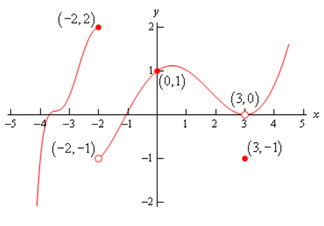
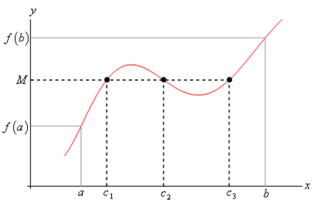
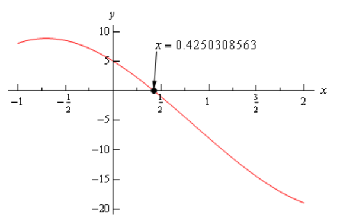
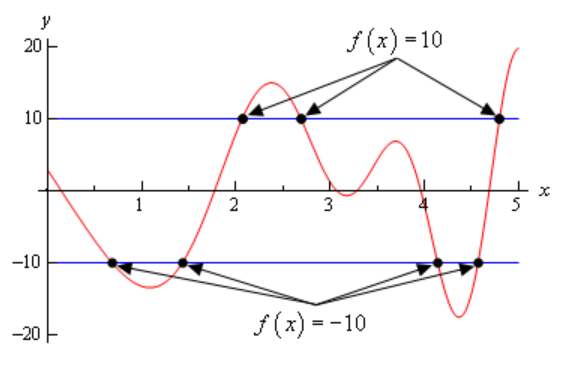
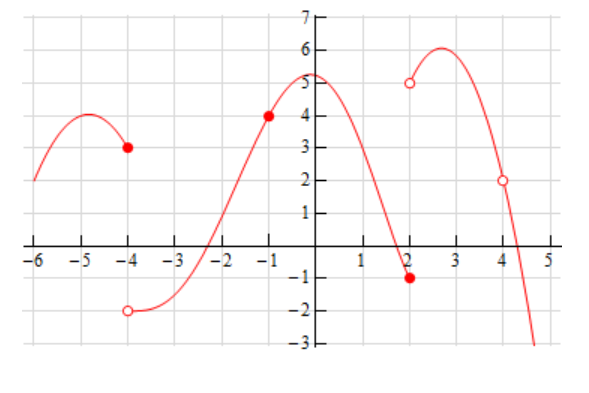
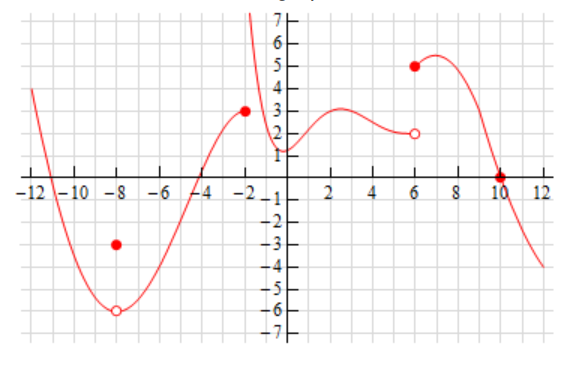
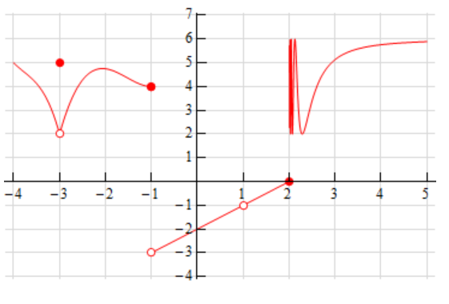
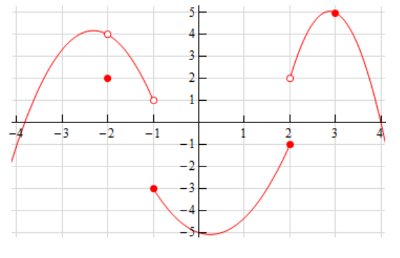
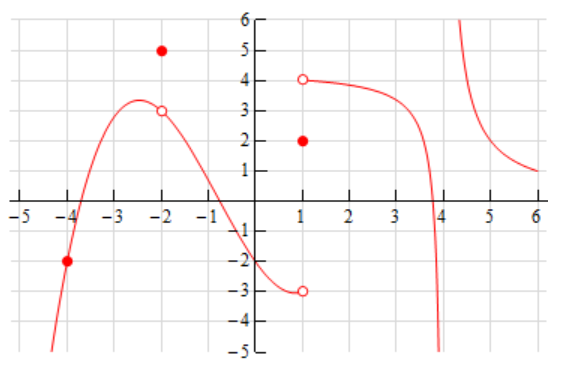

# Section 2.9 : Continuity

Over the last few sections we’ve been using the term "nice enough" to define
those functions that we could evaluate limits by just evaluating the function at
the point in question. It’s now time to formally define what we mean by "nice
enough".

**Definition**

> A function $f(x)$ is said to be **continuous** at $x = a$ if
>
> $$ \lim\limits_{x \to a}f(x) = f(a) $$
>
> A function is said to be continuous on the interval $[a, b]$ if it is
> continuous at each point in the interval.

Note that this definition is also implicitly assuming that both $f(a)$ and
$\lim\limits_{x \to a}f(x)$ exist. If either of these do not exist the function
will not be continuous at $x = a$.

This definition can be turned around into the following fact.

**Fact I**

> If $f(x) is continuous at $x = a$ then,
>
> $$ \lim\limits_{x \to a}f(x) = f(a) \quad \quad \lim\limits_{x \to a^-}f(x) = f(a) \quad \quad \lim\limits_{x \to a^+}f(x) = f(a) $$

This is exactly the same fact that we first put down
[back](https://tutorial.math.lamar.edu/Classes/CalcI/LimitsProperties.aspx#Cts_Fcns)
when we started looking at limits with the exception that we have replaced the
phrase "nice enough" with continuous.

It’s nice to finally know what we mean by "nice enough", however, the definition
doesn’t really tell us just what it means for a function to be continuous. Let’s
take a look at an example to help us understand just what it means for a
function to be continuous.

---

**Example 1** Given the graph $f(x)$, shown below, determine if $f(x)$ is
continuous at $x = -2$, $x = 0$, and $x = 3$.

**Solution**

To answer the question for each point we’ll need to get both the limit at that
point and the function value at that point. If they are equal the function is
continuous at that point and if they aren’t equal the function isn’t continuous
at that point.

First $x = -2$.

$$ f(-2) = 2 \quad \quad \lim\limits_{x \to -2}f(x) \text{ doesn't exist} $$

The function value and the limit aren't the same and so the function is not
continuous at this point. This kind of discontinuity in a graph is called a
**jump discontinuity**. Jump discontinuities occur where the graph has a break
in it as this graph does and the values of the function to either side of the
break are finite (_i.e._ the function doesn’t go to infinity).

Now $x = 0$.

$$ f(0) = 1 \quad \quad \lim\limits_{x \to 0}f(x) = 1 $$

The function is continuous at this point since the function and limit have the
same value.

Finally $x = 3$.

$$ f(3)  = -1 \quad \quad \lim\limits_{x \to 3}f(x) = 0 $$

The function is not continuous at this point. This kind of discontinuity is
called a **removable discontinuity**. Removable discontinuities are those where
there is a hole in the graph as there is in this case.

---

From this example we can get a quick "working" definition of continuity. A
function is continuous on an interval if we can draw the graph from start to
finish without ever once picking up our pencil. The graph in the last example
has only two discontinuities since there are only two places where we would have
to pick up our pencil in sketching it.

In other words, a function is continuous if its graph has no holes or breaks in
it.

For many functions it’s easy to determine where it won’t be continuous.
Functions won’t be continuous where we have things like division by zero or
logarithms of zero. Let’s take a quick look at an example of determining where a
function is not continuous.

---

**Example 2** Determine where the function below is not continuous.

$$ h(t) = \frac{4t + 10}{t^2 - 2t - 15} $$

**Solution**

Rational functions are continuous everywhere except where we have division by
zero. So all that we need to is determine where the denominator is zero. That’s
easy enough to determine by setting the denominator equal to zero and solving.

$$ t^2 - 2t - 15 = (t - 5)(t + 3) = 0 $$

So, the function will not be continuous at $t = -3$ and $t = 5$.

---

A nice consequence of continuity is the following fact.

**Fact 2**

> If $f(x)$ is continuous at $x = b$ and $\lim\limits_{x \to a}g(x) = b$ then,
>
> $$ \lim\limits_{x \to a}f(g(x)) = f\left(\lim\limits_{x \to a}g(x)\right) $$

To see a proof of this fact see the
[Proof of Various Limit Properties](https://tutorial.math.lamar.edu/Classes/CalcI/LimitProofs.aspx#Extras_Limit_LimComp)
section in the Extras chapter. With this fact we can now do limits like the
following example.

---

**Example 3** Evaluate the following limit.

$$ \lim\limits_{x \to 0}\mathbf{e}^{\sin x} $$

**Solution**

Since we know that exponentials are continuous everywhere we can use the fact
above.

$$ \lim\limits_{x \to 0}\mathbf{e}^{\sin x} = \mathbf{e}^{\lim\limits_{x \to 0}\sin x} = \mathbf{e}^0 = 1 $$

---

Another very nice consequence of continuity is the Intermediate Value Theorem.

**Intermediate Value Theorem**

> Suppose that $f(x)$ is continuous on $[a, b]$ and let $M$ be any number
> between $f(a)$ and $f(b)$. Then there exists a number $c$ such that,
>
> 1. $a < c < b$
> 2. $f(c) = M$

All the Intermediate Value Theorem is really saying is that a continuous
function will take on all values between $f(a)$ and $f(b)$. Below is a graph of
a continuous function that illustrates the Intermediate Value Theorem.

As we can see from this image if we pick any value, $M$, that is between the
value of $f(b)$ and the value of $f(b)$ and draw a line straight out from this
point the line will hit the graph in at least one point. In other words,
somewhere between $a$ and $b$ the function will take on the value of $M$. Also,
as the figure shows the function may take on the value at more than one place.

It’s also important to note that the Intermediate Value Theorem only says that
the function will take on the value of $M$ somewhere between $a$ and $b$. It
doesn’t say just what that value will be. It only says that it exists.

So, the Intermediate Value Theorem tells us that a function will take the value
of $M$ somewhere between $a$ and $b$ but it doesn’t tell us where it will take
the value nor does it tell us how many times it will take the value. These are
important ideas to remember about the Intermediate Value Theorem.

A nice use of the Intermediate Value Theorem is to prove the existence of roots
of equations as the following example shows.

---

**Example 4** Show that $p(x) = 2x^3 - 5x^2 - 10x + 5$ has a root somewhere in
the interval $[-1, 2]$.

**Solution**

What we’re really asking here is whether or not the function will take on the
value

$$ p(x) = 0 $$

somewhere between -1 and 2. In other words, we want to show that there is a
number $c$ such that $-1 < c < 2$ and $p(c) = 0$. However if we define $M = 0$
and acknowledge that $a = -1$ and $b = 2$ we can see that these two condition on
$c$ are exactly the connclusioins of the Intermediate Value Theorem.

So, this problem is set up to use the Intermediate Value Theorem and in fact,
all we need to do is to show that the function is continuous and that $M = 0$ is
between $p(-1)$ and $p(2)$ (_i.e._ $p(-1) < 0 < p(2)$ or $p(2) < 0 < p(-1)$) and
we'll be done.

To do this all we need to do is compute,

$$ p(-1) = 8 \quad \quad p(2) = -19 $$

So, we have,

$$ -19 = p(2) < 0 < p(-1) = 8 $$

Therefore $M = 0$ is between $p(-1)$ and $p(2)$ and since $p(x)$ is a polynomial
it’s continuous everywhere and so in particular it’s continuous on the interval
$[-1, 2]$. So by the Intermediate Value Theorem there must be a number
$-1 < c < 2$ so that,

$$ p(c) = 0 $$

Therefore, the polynomial does have a root between -1 and 2.

For the sake of completeness here is a graph showing the root that we just
proved existed. Note that we used a computer program to actually find the root
and that the Intermediate Value Theorem did not tell us what this value was.

---

Let’s take a look at another example of the Intermediate Value Theorem.

---

**Example 5** If possible, determine if
$f(x) = 20\sin(x + 3)\cos\left(\dfrac{x^2}{2}\right)$ takes the following values
in the interval $[0, 5]$.

Okay, so as with the previous example, we’re being asked to determine, if
possible, if the function takes on either of the two values above in the
interval $[0,5]$. First, let’s notice that this is a continuous function and so
we know that we can use the Intermediate Value Theorem to do this problem.

Now, for each part we will let M be the given value for that part and then we’ll
need to show that M lives between $f(0)$ and $f(5)$. If it does, then we can use
the Intermediate Value Theorem to prove that the function will take the given
value.

So, since we’ll need the two function evaluations for each part let’s give them
here,

$$ f(0) = 2.8224 \quad \quad f(5) = 19.7436 $$

Now, let's take a look at each part.

**(a)** Does $f(x) = 10$?

**Solution**

Okay, in this case we'll define $M = 10$ and we can see that,

$$ f(0) = 2.8224 < 10 < 19.7436 = f(5) $$

SO, by the Intermediate Value Theorem there must be a number $0 \leq c \leq 5$
such that

$$ f(c) = 10 $$

**(b)** Does $f(x) = -10$?

**Solution**

In this part we'll define $M = -10$. We now have a problem. In this part $M$
does not live between $f(0)$ and $f(5)$. So, what does this mean for us? Does
this mean that $f(x) \neq -10$ in $[0, 5]$?

Unfortunately for us, this doesn't mean anything. It is possible that
$f(x) \neq -10$ in $[0, 5]$, but is it also possible that $f(x) = -10$ in
$[0, 5]$. The Intermediate Value Theorem will only tell us that $c$'s will
exist. The theorem will NOT tell us that $c$'s don't exist.

In this case it is not possible to determine if $f(x) = -10$ in $[0, 5]$ using
the Intermediate Value Theorem.

---

Okay, as the previous example has shown, the Intermediate Value Theorem will not
always be able to tell us what we want to know. Sometimes we can use it to
verify that a function will take some value in a given interval and in other
cases we won’t be able to use it.

For completeness sake here is the graph of
$f(x) = 20\sin(x + 3)\cos\left(\dfrac{x^2}{2}\right)$ in the interval $[0, 5]$.

From this graph we can see that not only does $f(x) = -10$ in $[0, 5]$ it does
so a total of 4 times! Also note that as we verified in the first part of the
previous example $f(x) = 10$ in $[0, 5]$ and in fact it does so a total of 3
times.

So, remember that the Intermediate Value Theorem will only verify that a
function will take on a given value. It will never exclude a value from being
taken by the function. Also, if we can use the Intermediate Value Theorem to
verify that a function will take on a value it never tells us how many times the
function will take on the value, it only tells us that it does take the value.

---

## Practice Problems

**1.** The graph of $f(x)$ is given below. Based on this graph determine where
the function si discontinuous.

**Solution**

At $f(-4)$, the graph has a jump discontinuity, as there is no limit here.

$$ \lim\limits_{x \to -4^-}f(x) = 3 $$

$$ \lim\limits_{x \to -4^+}f(x) = -4 $$

$$ f(-4) = 3 $$

$$ \lim\limits_{x \to -4}f(x) \text{ doesn't exist} $$

Therefore there is a **jump discontinuity** at $f(-4)$.

There is another jump discontinuity at $f(2)$ for similar reasons.

$$ \lim\limits_{x \to 2^-}f(x) = -1 $$

$$ \lim\limits_{x \to 2^+}f(x) = 5 $$

$$ \lim\limits_{x \to 2}f(x) \text{ does not exit} $$

$$ f(2) = -1 $$

Therefore there is a **jump discontinuity** at $f(2)$.

There is also a removable discontinuity at $f(4)$.

$$ \lim\limits_{x \to 4^-}f(x) = 2 $$

$$ \lim\limits_{x \to 4^+}f(x) = 2 $$

$$ \lim\limits_{x \to 4}f(x) = 2 $$

$$ f(2) = \text{ doesn't exist} $$

Although the limit exists, there is a hole at $f(2)$, and therefore there is a
**removable discontinuity** at $f(2)$.

**2.** The graph of $f(x)$ is given below. Based on this graph determine where
the function si discontinuous.

**Solution**

There is a **removable discontinuity** at $f(-8)$:

$$ \lim\limits_{x \to -8^+}f(x) = -6 = \lim\limits_{x \to -8^-}f(x)  $$

$$ \lim\limits_{x \to -8}f(x) = -6 $$

$$ f(-8) = -3 $$

For a function to be continuous, the function at that point and the limit as the
input appraoches that point must have the same value. That is not the case here
and so therefore there is a **removable discontinuity** at $f(-8)$.

Moving on, there is a **jump discontinuity** at $f(-2)$.

$$ \lim\limits_{x \to -2^-}f(x) = 3 $$

$$ \lim\limits_{x \to -2^+}f(x) = \infty $$

$$ \lim\limits_{x \to -2}f(x) \text{ does not exist} $$

Because there is no limit at $f(-2)$, we can ascertain that there is a **jump
discontinuity** at $f(-2)$.

Moving on, there is another **jump discontinuity** at $f(6)$.

$$ \lim\limits_{x \to 6^-}f(x) = 2 $$

$$ \lim\limits_{x \to 6^+}f(x) = 5 $$

$$ \lim\limits_{x \to 6}f(x) \text{ does not exist} $$

Again, because there is no limit at $f(6)$, we can ascertain that there is a
**jump discontinuity** at $f(6)$.

For problems 3 – 7 using only Properties 1 – 9 from the
[Limit Properties](https://tutorial.math.lamar.edu/Classes/CalcI/LimitsProperties.aspx)
section, one-sided limit properties (if needed) and the definition of continuity
determine if the given function is continuous or discontinuous at the indicated
points.

**3.** $f(x) = \dfrac{4x + 5}{9 - 3x}$

**(a)** $x = -1$

**Solution**

We can determine if the function $f(x)$ is discontinuous at $x = -1$ by simply
plugging in $x = -1$ and seeing if it gives us any holes or asymptotes.
Essentially, if there are any division by zero errors that occur during
evaluation of $f(-1)$, we'll know that the function is discontinuous $x = -1$.

$$ f(-1) = \dfrac{4(-1) + 5}{9 - 3(-1)} $$

$$ f(-1) = \dfrac{-4 + 5}{9 + 3} $$

$$ f(-1) = \dfrac{1}{12} $$

So we know that the function $f(x)$ is **continuous** at $x = -1$.

**(b)** $x = 0$

**Solution**

$$ f(0) = \dfrac{4(0) + 5}{9 - 3(0)} $$

$$ f(0) = \dfrac{0 + 5}{9 - 0} $$

$$ f(0) = \dfrac{5}{9} $$

So we know that the function $f(x)$ is **continuous** at $x = 0$.

**\(c\)** $x = 3$

**Solution**

$$ f(3) = \dfrac{4(3) + 5}{9 - 3(3)} $$

$$ f(3) = \dfrac{12 + 5}{9 - 9} $$

$$ f(3) = \dfrac{17}{0} $$

And here we have a division by zero error, indicating a vertical asymptote in
our graph.

So we know that the function $f(x)$ is **discontinuous** at $x = 3$.

**4.** $g(z) = \dfrac{6}{z^2 - 3z - 10}$

Here, we'll have an easier time knowing where our graph is discontinuous by
factoring the denominator.

$$ z^2 - 3z - 10 = 0 $$

$$ (z - 5)(z + 2) = 0 $$

So we have vertical asymptotes, and therefore discontinuities, at these two
points:

$$ z = 5 \text{, } z = -2 $$

**(a)** $z = -2$

**Solution**

Yep, we have a vertical asymptote here, so we know that we have a
**discontinuity** for the function $g(z)$ at $z = -2$.

**(b)** $z = 0$

**Solution**

We should be continuous here, but let's evaluate to be sure:

$$ g(0) = \dfrac{6}{(0)^2 - 3(0) - 10} $$

$$ g(0) = \dfrac{6}{0 - 0 - 10} $$

$$ g(0) = -\dfrac{3}{5} $$

Note that we can prove the limit exists and is equivalent to the point:

$$ \lim\limits_{z \to 0}g(z) = \lim\limits_{z \to 0}\frac{6}{z^2 - 3z - 10} $$

$$ \lim\limits_{z \to 0}g(z) = \frac{\lim\limits_{z \to 0}6}{\lim\limits_{z \to 0}z^2 - \lim\limits_{z \to 0}3z - \lim\limits_{z \to 0}10} $$

$$ \lim\limits_{z \to 0}g(z) = \frac{6}{(0)^2 - 3(0) - 10} $$

$$ \lim\limits_{z \to 0}g(z) = -\frac{3}{5} = g(0) $$

The point exists, the limit exists, they're both the same, therefore the graph
$g(z)$ is **continuous** at $z = 0$.

**\(c\)** $z = 5$

**Solution**

And we established earlier that we have a vertical asymptote at $z = 5$.
Therefore there is no limit, and the point doesn't exist. Therefore the graph
$g(z)$ is **discontinuous** at $z = 5$.

**5.** $g(x) = \begin{cases} 2x & x < 6 \\ x - 1 & x \geq 6 \end{cases}$

**(a)** $x = 4$

**Solution**

At $x = 4$, the piecewise function $g(x)$ tells us that if $x < 6$, the output
of $g(x) = 2x$.

Let's just evaluate this point quickly:

$$ g(4) = 2(4) = 8 $$

And the limit:

$$ \lim\limits_{x \to 4^-} = 8 $$

$$ \lim\limits_{x \to 4^+} = 8 $$

$$ \lim\limits_{x \to 4} = 8 $$

All signs point to $g(x)$ being **continuous** at $x = 4$.

**(b)** $x = 6$

**Solution**

$$ g(6) = 6 - 1 $$

Since $x \geq 6$.

$$ g(6) = 5 $$

However:

$$ \lim\limits_{x \to 6^-}g(x) = 2(6) = 12 $$

$$ \lim\limits_{x \to 6^+}g(x) = 6 - 1 = 5 $$

$$ 12 = \lim\limits_{x \to 6^-}g(x) \neq \lim\limits_{x \to 6^+}g(x) = 5 $$

$$ \lim\limits_{x \to 6}g(x) \text{ does not exist} $$

There is a **jump discontinuity** here. The limit from $x \to 6$ for $ does not
exist, and therefore cannot equal the point for $g(x)$ at $x = 6$. There is a
**discontinuity** at $g(x)$ where $x = 4$.

**6.** $h(t) = \begin{cases} t^2 & t < -2 \\ t + 6  & t \geq -2 \end{cases}$

**(a)** $t = -2$

**Solution**

$$ h(-2) = (-2) + 6 $$

Since $t \geq -2$.

$$ h(-2) = 4 $$

Interestingly:

$$ \lim\limits_{t \to -2^-}h(t) = (-2)^2 = 4 $$

$$ \lim\limits_{t \to -2^+}h(t) = (-2) + 6 = 4 $$

Although the evaluations are different, the output is the same, the limit here
exists:

$$ \lim\limits_{t \to -2}h(t) = 4 $$

And:

$$ \lim\limits_{t \to -2}h(t) = 4 = h(-2) $$

The function $h(t)$ is **continuous** at $t = -2$.

**(b)** $t = 10$

**Solution**

$$ h(10) = 10 + 6 $$

Since $t \geq -2$.

$$ h(10) = 16 $$

And evaluating the limit reveals no different:

$$ \lim\limits_{t \to 10^-} = 16 $$

$$ \lim\limits_{t \to 10^+} = 16 $$

$$ \lim\limits_{t \to 10} = 16 = h(10) $$

The limit and the point are the same, the function $h(t)$ is **continuous** at
$t = 10$.

**7.**
$g(x) = \begin{cases} 1 - 3x &  x < -6 \\ 7 & x = -6 \\ x^3 & -6 < x < 1 \\ 1 & x = 1 \\ 2 - x & x > 1 \end{cases}$

**(a)** $x = -6$

**Solution**

Plugging in:

$$ g(-6) = 7 $$

Since:

$$ x = -6 $$

However:

$$ \lim\limits_{x \to -6^-}g(x) = 1 - 3(-6) = 1 + 18 = 19 $$

$$ \lim\limits_{x \to -6^+}g(x) = (-6)^3 = -216 $$

$$ 19 = \lim\limits_{x \to -6^-}g(x) \neq \lim\limits_{x \to -6^+}g(x) = -216 $$

$$ \lim\limits_{x \to -6}g(x) \text{ doesn't exist} $$

Since the limit doesn't exist, it cannot also equal the point at $g(-6)$, and
therefore the function $g(x)$ is **discontinuous** at $x = -6$.

**(b)** $x = 1$

**Solution**

First plug in:

$$ g(1) = 1 $$

Since $x = 1$.

Interestingly:

$$ \lim\limits_{x \to 1^-}g(x) = (1)^3 = 1 $$

$$ \lim\limits_{x \to 1^+}g(x) = 2 - (1) = 1 $$

$$ \lim\limits_{x \to 1}g(x) = 1 = g(1) $$

The limit exists, the point exists, they are both the same, therefore the
function $g(x)$ is **continuous** at $x = 1$.

For problems 8 – 12 determine where the given function is discontinuous.

**8.** $f(x) = \dfrac{x^2 - 9}{3x^2 + 2x - 8}$

**Solution**

Factoring this will make it more clear:

$$ f(x) = \dfrac{x^2 - 9}{3x^2 + 2x - 8} $$

$$ f(x) = \dfrac{(x + 3)(x - 3)}{(3x - 4)(x + 2)} $$

We cannot cancel out either factor from the numerator, so there is no hole, but
we do have vertical asymptotes at the two denominator factors:

$$ 3x - 4 = 0 $$

$$ 3x = 4 $$

$$ x = \frac{4}{3} $$

$$ x + 2 = 0 $$

$$ x = -2 $$

So therefore the function $f(x)$ will be **discontinuous** at $x = \dfrac{4}{3}$
and also at $x = -2$.

**9.** $R(t) = \dfrac{8t}{t^2 - 9t - 1}$

**Solution**

$$ R(t) = \dfrac{8t}{t^2 - 9t - 1} $$

Since this doesn't factor nicely, let's use the quadratic formula.

$$ t = \frac{-((-9) \pm \sqrt{((-9)^2 - 4(1)(-1)}}{2(1)} $$

$$ t = \frac{9 \pm \sqrt{85}}{2} $$

So therefore the function $R(t)$ will be **discontinuous** at
$t = \dfrac{9 + \sqrt{85}}{2}$ and also at $t = \dfrac{9 - \sqrt{85}}{2}$.

**10.** $h(z) = \dfrac{1}{2 - 4\cos(3z)}$

**Solution**

We can find this by evaluating where $4\cos(3z) = 2$

$$ 4\cos(3z) = 2 $$

$$ \cos(3z) = \frac{1}{2} $$

$$ \cos^{-1}\left(\frac{1}{2}\right) = 3z $$

$$ \frac{\pi}{3} = 3z $$

$$ 3z = \frac{\pi}{3} + 2\pi n $$

This occurs every $2\pi$, so:

$$ 2\pi - \frac{\pi}{3} = \frac{6\pi}{3} - \frac{\pi}{3} = \frac{5\pi}{3} $$

This means we can express this interval also as:

$$ 3z = \frac{5\pi}{3} + 2\pi n \quad \quad n = 0, \pm 1, \pm 2, \dots $$

$$ z = \frac{5\pi}{9} + \frac{2\pi}{3} n \quad \quad n = 0, \pm 1, \pm 2, \dots $$

So this mean $h(z)$ will have a **discontinuity** at every $n$ interval for:

$$ z = \frac{5\pi}{9} + \frac{2\pi}{3} n \quad \quad n = 0, \pm 1, \pm 2, \dots $$

**11.** $y(x) = \dfrac{x}{7 - \mathbf{e}^{2x + 3}}$

**Solution**

$$ \mathbf{e}^{2x + 3} = 7 $$

$$ \ln\left(\mathbf{e}^{2x + 3}\right) = \ln(7) $$

$$ 2x + 3 = \ln(7) $$

$$ 2x = \ln(7) - 3 $$

$$ x = \frac{\ln(7) - 3}{2} $$

Therefore the graph of $y(x)$ will be **discontinuous** at
$x = \dfrac{\ln(7) - 3}{2}$.

**12.** $g(x) = \tan(2x)$

**Solution**

Recall that tangent is undefined at $\dfrac{\pi}{2}$ or $\dfrac{3\pi}{2}$ for
every $2\pi$ interval (anywhere that cosine is $0$).

$$ 2x = \frac{\pi}{2} + 2\pi n $$

Or:

$$ 2x = \frac{3\pi}{2} + 2\pi n $$

Then we can simplify by dividing by $2$ and defining $n$ as intervals:

$$ x = \frac{\pi}{4} + \pi n \quad \quad n = 0, \pm 1, \pm 2, \dots $$

Or:

$$ x = \frac{3\pi}{4} + \pi n \quad \quad n = 0, \pm 1, \pm 2, \dots $$

Therefore the function $g(x)$ will have a **discontinuity** for every $n$
interval at:

$$ x = \frac{\pi}{4} + \pi n \quad \quad n = 0, \pm 1, \pm 2, \dots $$

Or:

$$ x = \frac{3\pi}{4} + \pi n \quad \quad n = 0, \pm 1, \pm 2, \dots $$

For problems 13 – 15 use the Intermediate Value Theorem to show that the given
equation has at least one solution in the indicated interval. Note that you are
NOT asked to find the solution only show that at least one must exist in the
indicated interval.

**13.** $25 - 8x^2 - x^3 = 0$ on $[-2, 4]$

**Solution**

We're looking for roots ($x$-intercepts) that lie within the interval $[-2, 4]$.

Let $c$ be the constant we're looking for $x$. Let's define the expression as a
function to get an idea:

$$ f(x) = 25 - 8x^2 - x^3 $$

Since $f(x) = 0$ We can assum that:

$$ -2 < c < 4 $$

And we are looking for either:

$$ f(-2) < 0 < f(4) $$

Or:

$$ f(4) < 0 < f(-2) $$

If we simply evaluate these two evaluations for $x$, we'll find out if there
exists such a number $c$:

$$ f(-2) = 25 - 8(-2)^2 - (-2)^3 = 1 $$

$$ f(4) = 25 - 8(4)^2 - (4)^3 = -167 $$

This exemplifies the latter case from above:

$$ f(4) < 0 < f(-2) $$

Therefore there exists at least one solution for $c$ where $f(c)$ lies within
the interval $[-2, 4]$.

$$ -2 < c < 4 $$

$$ f(c) = 0 $$

**14.** $w^2 - 4\ln(5w + 2) = 0$ on $[0, 4]$

**Solution**

Once again, defining this as a function makes this easier:

$$ f(w) = w^2 - 4\ln(5w + 2) $$

We're just trying to show that there exists at least one constant $c$ which lies
within the given interval $[0, 4]$.

$$ 0 < c < 4 $$

$$ f(0) < f(c) < f(4) $$

Or:

$$ f(4) < f(c) < f(0) $$

Let's evaluate each function:

$$ f(0) = (0)^2 - 4\ln(5(0) + 2) $$

$$ f(0) = 0 - 4\ln(2) $$

$$ f(0) = -4\ln(2) \approx -2.772588722 $$

$$ f(4) = (4)^2 - 4\ln(5(4) + 2) $$

$$ f(4) = 16 - 4\ln(22) \approx 3.635830187 $$

This exemplifies the first case from above:

$$ f(0) < f(c) < f(4) $$

And thusly we have proven there is at least one $c$ for the function $f(c)$
within the interval of $[0, 4]$.

$$ 0 < c < 4 $$

$$ f(c) = 0 $$

**15.** $4t + 10\mathbf{e}^t - \mathbf{e}^{2t} = 0$ on $[1, 3]$

**Solution**

$$ f(t) = 4t + 10\mathbf{e}^t - \mathbf{e}^{2t} $$

$$ 1 < c < 3 $$

$$ f(1) < 0 < f(3) $$

Or:

$$ f(3) < 0 < f(1) $$

$$ f(1) = 4(1) + 10\mathbf{e}^{(1)} - \mathbf{e}^{2(1)} $$

$$ f(1) = 4 + 10\mathbf{e} - \mathbf{e}^2 = \approx 23.79376219 $$

$$ f(3) = 4(3) + 10\mathbf{e}^{(3)} - \mathbf{e}^{2(3)} $$

$$ f(3) = 12 + 10\mathbf{e}^3 - \mathbf{e}^6 \approx -190.5734243 $$

This exemplifies the latter case. Therefore we have proven that there exists
some $c$ for $f(c)$ that lies within the interval, $[1, 3]$.

$$ 1 < c < 3 $$

$$ f(c) = 0 $$

---

## Assignment Problems

**1.** The graph of $f(x)$ is given below. Based on this graph determine where
the function is discontinuous.

**Solution**

For a function to be continuous at a certain point, the limit must exist and be
equal to the output of the function at that point (essentially everything has to
line up).

The graph is discontinuous at $f(-3)$, this is a **removable discontinuity**,
where the limit exists, but there is a hole in the graph, either because the
point doesn't exist or doesn't match the limit.

$$ \lim\limits_{x \to -3^-}f(x) = 2 $$

$$ \lim\limits_{x \to -3^+}f(x) = 2 $$

$$ \lim\limits_{x \to -3}f(x) = 2 $$

$$ f(-3) = 5 $$

Therefore there is a **discontinuity** for $f(x)$ at $x = -3$.

Moving on, we have a **jump discontinuity** at $f(-1)$, where the limit doesn't
exist, and therefore cannot equal the point.

$$ \lim\limits_{x \to -1^-}f(x) = 4 $$

$$ \lim\limits_{x \to -1^+}f(x) = -3 $$

$$ \lim\limits_{x \to -1}f(x) \text{ does not exist} $$

$$ f(-1) = 4 $$

Therefore there is a **discontinuity** for $f(x)$ at $x = -1$.

Moving on we have a **removable discontinuity** at $f(1)$ as the point doesn't
exist, while the limit does:

$$ \lim\limits_{x \to 1^-}f(x) = -1 $$

$$ \lim\limits_{x \to 1^+}f(x) = -1 $$

$$ \lim\limits_{x \to 1}f(x) = -1 $$

$$ f(-1) \text{ does not exist} $$

Therefore there is a **discontinuity** for $f(x)$ at $x = 1$.

Lastly, we have a **jump discontinuity** at $f(2)$, the limit doesn't exist even
for one of the one sided limit at this point:

$$ \lim\limits_{x \to 2^-}f(x) = 0 $$

$$ \lim\limits_{x \to 2^+}f(x) \text{does not exist} $$

$$ \lim\limits_{x \to 2}f(x) \text{does not exist} $$

$$ f(2) = 0 $$

The graph's limit behavior becomes impossible to ascertain on the right hand
side as it becomes similar to a sine or cosine wave function at $x = 2$.

Therefore there is a **discontinuity** for $f(x)$ at $x = 2$.

**2.** The graph of $f(x)$ is given below. Based on this graph determine where
the function is discontinuous.

**Solution**

There is a **removable discontinuity** at $f(-2)$:

$$ \lim\limits_{x \to -2^-}f(x) = 4 $$

$$ \lim\limits_{x \to -2^+}f(x) = 4 $$

$$ \lim\limits_{x \to -2}f(x) = 4 $$

$$ f(-2) = 2 $$

Therefore there is a **discontinuity** for $f(x)$ at $x = -2$.

Moving on, there is a **jump discontinuity** at $f(-1)$:

$$ \lim\limits_{x \to -1^-}f(x) = 1 $$

$$ \lim\limits_{x \to -1^+}f(x) = -3 $$

$$ \lim\limits_{x \to -1}f(x) \text{ doesn't exist} $$

$$ f(-1) = -3 $$

Therefore there is a **discontinuity** for $f(x)$ at $x = -1$.

Lastly, there is a **jump discontinuity** at $f(2)$:

$$ \lim\limits_{x \to 2^-} = -1 $$

$$ \lim\limits_{x \to 2^+} = 2 $$

$$ \lim\limits_{x \to 2^+} \text{ doesn't exist} $$

$$ f(2) = -1 $$

Therefore there is a **discontinuity** for $f(x)$ at $x = 2$.

The point at $f(3)$ is **continuous** and thrown in to confuse me.

**3.** The graph of $f(x)$ is given below. Based on this graph determine where
the function is discontinuous.

**Solution**

There is a **removable discontinuity** at $f(-2)$.

$$ \lim\limits_{x \to -2^-}f(x) = 3 $$

$$ \lim\limits_{x \to -2^+}f(x) = 3 $$

$$ \lim\limits_{x \to -2}f(x) = 3 $$

$$ f(-2) = 5 $$

Therefore there is a **discontinuity** for $f(x)$ at $x = -2$.

Moving on, we have a **jump discontinuity** at $f(1)$:

$$ \lim\limits_{x \to 1^-}f(x) = -3 $$

$$ \lim\limits_{x \to 1^+}f(x) = 4 $$

$$ \lim\limits_{x \to 1}f(x) \text{ does not exist} $$

$$ f(1) = 2 $$

Therefore there is a **discontinuity** for $f(x)$ at $x = 1$.

Lastly, we might think we have a discontinuity at $f(4)$, but in truth this is
not a jump discontinuity, as both sides of the function approach $-\infty$ and
$\infty$. However, _this still is a discontinuity_, just not one that Paul
covers in his notes. This is called an **infinite discontinuity**. You can find
out more about infinite discontinuities
[here](https://en.wikipedia.org/wiki/Classification_of_discontinuities?useskin=vector#Essential_discontinuity).

Therefore there is a **discontinuity** for $f(x)$ at $f(4)$.

For problems 4 – 13 using only Properties 1- 9 from the
[Limit Properties](https://tutorial.math.lamar.edu/Classes/CalcI/LimitsProperties.aspx)
section, one-sided limit properties (if needed) and the definition of continuity
determine if the given function is continuous or discontinuous at the indicated
points.

**4.** $f(x) = \dfrac{6 + 2x}{7x - 14}$

**(a)** $x = -3$

**Solution**

We can just plug this in as both the actual point and the limit and see if they
match:

$$ \lim\limits_{x \to -3}f(x) = \lim\limits_{x \to -3}\frac{6 + 2x}{7x - 14} $$

$$ \lim\limits_{x \to -3}f(x) = \frac{\lim\limits_{x \to -3}6 + \lim\limits_{x \to -3}2x}{\lim\limits_{x \to -3}7x - \lim\limits_{x \to -3}14} $$

$$ \lim\limits_{x \to -3}f(x) = \frac{6 + 2(-3)}{7(-3) - 14} $$

$$ \lim\limits_{x \to -3}f(x) = \frac{0}{-35} $$

$$ \lim\limits_{x \to -3}f(x) = 0 $$

$$ f(-3) = \frac{6 + 2(-3)}{7(-3) - 14} $$

$$ f(-3) = \frac{0}{-35} $$

$$ f(-3) = 0 $$

$$ 0 = \lim\limits_{x \to -3}f(x) = f(-3) = 0  $$

Therefore the function $f(x)$ is **continuous** at $x = -3$.

**(b)** $x = 0$

**Solution**

We'll go through this one much more quickly with the same concepts as above.

$$ \lim\limits_{x \to 0}f(x) = \lim\limits_{x \to 0}\frac{6 + 2x}{7x - 14} $$

$$ \lim\limits_{x \to 0}f(x) = \frac{\lim\limits_{x \to 0}6 + \lim\limits_x{ \to 0}2x}{\lim\limits_{x \to 0}7x - \lim\limits_{x \to 0}14} $$

$$ \lim\limits_{x \to 0}f(x) = \frac{6 + 2(0)}{7(0) - 14}  $$

$$ \lim\limits_{x \to 0}f(x) = \frac{6}{-24} $$

$$ \lim\limits_{x \to 0}f(x) = -\frac{1}{4} $$

$$ f(0) = \frac{6 + 2(0)}{7(0) - 14} $$

$$ f(0) = \frac{6}{-24} $$

$$ f(0) = -\frac{1}{4} $$

$$ -\frac{1}{4} = \lim\limits_{x \to 0}f(x) = f(0) = -\frac{1}{4} $$

Therefore the function $f(x)$ is **continuous** at $x = 0$.

**\(c\)** $x = 2$

**Solution**

This one should be relatively obvious, as we'll have a discontinuity wherever
the denominator is $0$ (and we have a vertical asymptote or hole).

$$ \lim\limits_{x \to 2}f(x) = \lim\limits_{x \to 2}\frac{6 + 2x}{7x - 14} $$

$$ \lim\limits_{x \to 2}f(x) = \frac{\lim\limits_{x \to 2}6 + \lim\limits_{x \to 2}2x}{\lim\limits_{x \to 2}7x - \lim\limits_{x \to 2}14} $$

$$ \lim\limits_{x \to 2}f(x) = \frac{6 + 2(2)}{7(2) - 14}$$

$$ \lim\limits_{x \to 2}f(x) = \frac{10}{0}$$

$$ f(2) = \frac{6 + 2(2)}{7(2) - 14} $$

$$ f(2) = \frac{10}{0} $$

Both exemplify division by zero errors, indicating both the limit and the point,
while the same...don't exist. So therefore the function $f(x)$ is
**discontinuous** at $x = 2$.

**5.** $R(y) = \dfrac{2y}{y^2 - 25}$

**(a)** $y = -5$

**Solution**

Again, we'll move through these quicker now that we've established basic
patterns in problem **4**.

$$ \lim\limits_{y \to -5}R(y) = \lim\limits_{y \to -5}\frac{2y}{y^2 - 25} $$

$$ \lim\limits_{y \to -5}R(y) = \frac{\lim\limits_{y \to -5}2y}{\lim\limits_{y \to -5}y^2 - \lim\limits_{y \to -5}25} $$

$$ \lim\limits_{y \to -5}R(y) = \dfrac{2(-5)}{(-5)^2 - 25} $$

$$ \lim\limits_{y \to -5}R(y) = \dfrac{-10}{0} $$

$$ R(-5) = \dfrac{2(-5)}{(-5)^2 - 25} $$

$$ R(-5) = \dfrac{-10}{0} $$

Both exemplify division by zero errors.

There is a **discontinuity** for the function $R(y)$ at $y = -5$.

**(b)** $y = -1$

**Solution**

$$ \lim\limits_{y \to -1}R(y) = \lim\limits_{y \to -1}\frac{2y}{y^2 - 25} $$

$$ \lim\limits_{y \to -1}R(y) = \frac{\lim\limits_{y \to -1}2y}{\lim\limits_{y \to -1}y^2 - \lim\limits_{y \to -1}25} $$

$$ \lim\limits_{y \to -1}R(y) = \dfrac{2(-1)}{(-1)^2 - 25} $$

$$ \lim\limits_{y \to -1}R(y) = \dfrac{1}{12}  $$

$$ R(-1) = \dfrac{2(-1)}{(-1)^2 - 25} $$

$$ R(-1) = \dfrac{-2}{1 - 25} $$

$$ R(-1) = \dfrac{-2}{-24} $$

$$ R(-1) = \dfrac{1}{12} $$

$$ \frac{1}{12} = \lim\limits_{y \to -1}R(y) = R(-1) = \frac{1}{12} $$

Therefore the function $R(y)$ is **continuous** at $y = -1$

**\(c\)** $y = 3$

**Solution**

$$ \lim\limits_{y \to 3}R(y) = \lim\limits_{y \to 3}\frac{2y}{y^2 - 25} $$

$$ \lim\limits_{y \to 3}R(y) = \frac{\lim\limits_{y \to 3}2y}{\lim\limits_{y \to 3}y^2 - \lim\limits_{y \to 3}25} $$

$$ \lim\limits_{y \to 3}R(y) = \frac{2(3)}{(3)^2 - 25} $$

$$ \lim\limits_{y \to 3}R(y) = -\frac{3}{8} $$

$$ R(3) = \frac{2(3)}{(3)^2 - 25} $$

$$ R(3) = \frac{6}{9 - 25} $$

$$ R(3) = \frac{6}{9 - 25} $$

$$ R(3) = \frac{6}{-16} $$

$$ R(3) = -\frac{3}{8} $$

$$ -\frac{3}{8} = \lim\limits_{y \to 3}R(y) = R(3) = -\frac{3}{8} $$

Therefore the function $R(y)$ is **continuous** at $y = 3$.

**6.** $g(z) = \dfrac{5z - 20}{z^2 - 12z}$

**Solution**

Prior to further evaluation, it would be useful if we factor:

$$ g(z) = \frac{5z - 20}{z^2 - 12z} $$

$$ g(z) = \frac{5(z - 4)}{z(z - 12)} $$

There are no holes, but asymptotes are at $z = 0$ and $z = 12$.

**(a)** $z = -1$

**Solution**

$$ g(-1) = \frac{5(-1) - 20}{(-1)^2 - 12(-1)} $$

$$ g(-1) = \frac{-5 - 20}{1 + 12} $$

$$ g(-1) = -\frac{25}{13} $$

Rational functions are **continuous** along their domain.

Therefore the function $g(z)$ is **continuous** at $z = -1$.

**(b)** $z = 0$

**Solution**

$$ g(0) = \frac{5(0) - 20}{(0)^2 - 12(0)} $$

$$ g(0) = \frac{-20}{0} $$

We have a division by zero error, and as described above, this is one of the
vertical asymptote factors that falls outside of the rational functions domain.

Therefore the function $g(z)$ is **discontinuous** at $z = 0$.

**\(c\)** $z = 4$

**Solution**

$$ g(4) = \frac{5(4) - 20}{(4)^2 - 12(4)} $$

$$ g(4) = \frac{20 - 20}{16 - 48} $$

$$ g(4) = \frac{0}{-32} $$

$$ g(4) = 0 $$

Rational functions are continuous within their domain.

Therefore the function $g(z)$ is **continuous** at $z = 4$.

**7.** $W(x) = \dfrac{2 + x}{x^2 + 6x - 7}$

**Solution**

Again, useful if we factor here:

$$ W(x) = \dfrac{2 + x}{x^2 + 6x - 7} $$

$$ W(x) = \dfrac{2 + x}{(x + 7)(x - 1)} $$

No holes, just asymptotes at $x = -7$ and $x = 1$.

**(a)** $x = -7$

**Solution**

This is one we factored out earlier, but to be sure, let's plug in:

$$ W(-7) = \dfrac{2 + (-7)}{(-7)^2 + 6(-7) - 7} $$

$$ W(-7) = \dfrac{-5}{49 - 42 - 7} $$

$$ W(-7) = \dfrac{-5}{7 - 7} $$

$$ W(-7) = \dfrac{-5}{0} $$

And as we can see, we have a division by zero error, showing that this falls
outside our domain and not continuous.

Therefor the function $W(x)$ is **discontinuous** at $x = -7$.

**(b)** $x = 0$

**Solution**

$$ W(0) = \dfrac{2 + (0)}{(0)^2 + 6(0) - 7} $$

$$ W(0) = -\dfrac{2}{7} $$

This falls within our domain.

Therefore the function $W(x)$ is **continuous** at $x = 0$.

**\(c\)** $x = 1$

**Solution**

Again, we established this earlier. This should produce a division by zero error
and be discontinuous.

$$ W(1) = \dfrac{2 + (1)}{(1)^2 + 6(1) - 7} $$

$$ W(1) = \dfrac{3}{1 + 6 - 7} $$

$$ W(1) = \dfrac{3}{7 - 7} $$

$$ W(1) = \dfrac{3}{0} $$

Therefore the function $W(x)$ is **discontinuous** at $x = 1$.

**8.** $h(z) = \begin{cases} 2z^2 &  z < -1 \\ 4z + 6 & z \geq -1 \end{cases}$

**(a)** $z = -6$

**Solution**

Piecewise functions require us to be a bit more careful and inspect one-sided
limits in order to be sure.

$$ h(-6) = 2(-6)^2 $$

Since $z < -1$.

$$ h(-6) = 2(36) $$

$$ h(-6) = 72 $$

If the limit is equal to this, then we know it is continuous.

$$ \lim\limits_{z \to -6^-}h(z) = 2(-6)^2 = 72 $$

$$ \lim\limits_{z \to -6^+}h(z) = 2(-6)^2 = 72 $$

$$ \lim\limits_{z \to -6}h(z) = 2(-6)^2 = 72 $$

$$ 72 = \lim\limits_{z \to -6}h(z) = h(-6) = 72 $$

Therefore the function $h(z)$ is **continuous** at $z = -6$.

**(b)** $z = -1$

**Solution**

$$ h(-1) = 4(-1) + 6 $$

Since $z \geq -1$.

$$ h(-1) = -4 + 6 $$

$$ h(-1) = 2 $$

$$ \lim\limits_{z \to -1^-}h(z) = 2(-1)^2 = 2(1) = 2 $$

$$ \lim\limits_{z \to -1^+}h(z) = 2(-1)^2 = 4(-1) + 6 = -4 + 6 = 2 $$

$$ \lim\limits_{z \to -1}h(z) = 2 $$

$$ 2 = \lim\limits_{z \to -1}h(z) = h(-1) = 2 $$

Therefore the function $h(z)$ is **continuous** at $z = -1$.

**9.**
$g(x) = \begin{cases} x + \mathbf{e}^x &  x < 0\\ x^2 & x \geq 0 \end{cases}$

**(a)** $x = 0$

**Solution**

We'll move more quickly now.

$$ g(0) = (0)^2 $$

Since $x \geq 0$.

$$ g(0) = 0 $$

$$ \lim\limits_{x \to 0^-} = (0) + \mathbf{e}^{(0)} = 1 $$

$$ \lim\limits_{x \to 0^+} = (0)^2 = 0 $$

$$ \lim\limits_{x \to 0} \text{ doesn't exist} $$

And since the limit doesn't exist, it can't equal $g(0)$.

Therefore the function $g(x)$ is **discontinuous** at $x = 0$.

**(b)** $x = 4$

**Solution**

$$ g(4) = (4)^2 $$

Since $x \geq 0$.

$$ g(4) = 16 $$

$$ \lim\limits_{x \to 4^-}g(x) = (4)^2 = 16  $$

$$ \lim\limits_{x \to 4^+}g(x) = (4)^2 = 16  $$

$$ \lim\limits_{x \to 4}g(x) = (4)^2 = 16  $$

$$ 16 = \lim\limits_{x \to 4}g(x) = g(4) = 16 $$

Therefore the function $g(x)$ is **continuous** at $x = 4$.

**10.** $Z(t) = \begin{cases} 8 &  t < 5 \\ 1 - 6t & t \geq 5 \end{cases}$

**(a)** $t = 0$

**Solution**

$$ Z(0) = 8 $$

Since $t < 5$.

$$ \lim\limits_{t \to 0^-}Z(t) = 8 $$

$$ \lim\limits_{t \to 0^+}Z(t) = 8 $$

$$ \lim\limits_{t \to 0}Z(t) = 8 $$

$$ 8 = \lim\limits_{t \to 0}Z(t) =  Z(0) = 8 $$

Therefore the function $Z(t)$ is **continuous** at $t = 0$.

**(b)** $t = 5$

**Solution**

$$ Z(5) = 1 - 6(5) = 1 - 30 = -29 $$

Since $t \geq 5$.

$$ \lim\limits_{t \to 5^-} = 8 $$

$$ \lim\limits_{t \to 5^+} = 1 - 6(5) = -29 $$

$$ \lim\limits_{t \to 5} \text{ doesn't exist} $$

Since the limit doesn't exist, it can't equal $Z(5)$.

Therefore the function $Z(t)$ is **discontinuous** at $t = 5$.

**11.**
$h(z) = \begin{cases} z + 2 &  z < -4 \\ 0 &  z = -4 \\ 18 - z^2 &  z > -4 \end{cases}$

**(a)** $z = -4$

**Solution**

$$ h(-4) = 0 $$

Since $z = -4.

$$ \lim\limits_{z \to -4^-}h(z) = (-4) + 2 = -2 $$

$$ \lim\limits_{z \to -4^+}h(z) = 18 - (-4)^2 = 18 + 16 = 34 $$

$$ \lim\limits_{z \to -4}h(z) \text{ doesn't exist} $$

Therefore the function $h(z)$ is **discontinuous** at $z = -4$.

**(b)** $z = 2$

**Solution**

$$ h(2) = 18 - (2)^2 = 18 - 4 = 14 $$

$$ \lim\limits_{z \to 2^-}h(z) = 18 - (2)^2 = 14 $$

$$ \lim\limits_{z \to 2^+}h(z) = 18 - (2)^2 = 14 $$

$$ \lim\limits_{z \to 2}h(z) = 18 - (2)^2 = 14 $$

$$  14 = \lim\limits_{z \to 2}h(z) = h(2) = 14 $$

Therefore the function $h(z)$ is **continuous** at $z = 2$.

**12.**
$f(x) = \begin{cases} 1 - x^2 & x < 2 \\ -3 & x = 2 \\ 2x - 7 & 2 < x < 7 \\ 0 & 2 < x = 7 \\ x^2 & x > 7 \\ \end{cases}$

**(a)** $x = 2$

**Solution**

$$ f(2) = -3 $$

Since $x = 2$.

$$ \lim\limits_{x \to 2^-}f(x) = 1 - (2)^2 = 1 - 4 = -3 $$

$$ \lim\limits_{x \to 2^+}f(x) = 2(2) - 7 = 4 - 7 = -3 $$

$$ \lim\limits_{x \to 2}f(x) = -3 $$

$$ -3 = \lim\limits_{x \to 2}f(x) = f(2) = -3 $$

Therefore the function $f(x)$ is **continuous** at $x = 2$.

**(b)** $x = 7$

**Solution**

$$ f(7) = 0 $$

Since $x = 7$.

$$ \lim\limits_{x \to 7^-}f(x) = 2(7) - 7 = 14 - 7 = 7 $$

$$ \lim\limits_{x \to 7^+}f(x) = (7)^2 = 49 $$

$$ \lim\limits_{x \to 7}f(x) \text{ doesn't exist} $$

Therefore the function $f(x)$ is **discontinuous** at $x = 7$.

**13.**
$g(w) = \begin{cases} 3w &  w < 0 \\ 0 &  w = 0 \\ w + 6 &  0 < w < 8 \\ 14 &  w = 8 \\ 22 - w &  w > 8 \\ \end{cases}$

**(a)** $w = 0$

$$ g(0) = 0 $$

Since $w = 0$.

$$ \lim\limits_{w \to 0^-}g(w) = 3(0) = 0 $$

$$ \lim\limits_{w \to 0^+}g(w) = (0) + 6 = 6 $$

$$ \lim\limits_{w \to 0}g(w) \text{ doesn't exist} $$

Therefore the function $g(w)$ is **discontinuous** at $w = 0$.

**Solution**

**(b)** $w = 8$

**Solution**

$$ g(8) = 14 $$

Since $w = 8$.

$$ \lim\limits_{w \to 8^-}g(w) = (8) + 6 = 14 $$

$$ \lim\limits_{w \to 8^+}g(w) = 22 - (8) = 14 $$

$$ \lim\limits_{w \to 8}g(w) = 14 $$

$$ 14 = \lim\limits_{w \to 8}g(w) = g(8) = 14 $$

Therefore the function $g(w)$ is **continuous** at $w = 8$.

For problems 14 – 22 determine where the given function is discontinuous.

**14.** $f(x) = \dfrac{11 - 2x}{2x^2 - 13x - 7}$

**Solution**

$$ f(x) = \dfrac{11 - 2x}{2x^2 - 13x - 7} $$

The function will be discontinuous wherever the denominator's factors equal $0$,
creating a division by zero error.

$$ 2x^2 - 13x - 7 = 0 $$

$$ (2x + 1)(x - 7) = 0 $$

$$ 2x + 1 = 0 $$

$$ 2x = -1 $$

$$ x = -\frac{1}{2} $$

$$ x - 7 = 0 $$

$$ x = 7 $$

Therefore the function $f(x)$ will be **discontinuous** at $x = -\dfrac{1}{2}$
and at $x = 7$.

**15.** $Q(z) = \dfrac{3}{2z^2 + 3z - 4}$

**Solution**

$$ 2z^2 + 3z - 4 = 0 $$

$$ z = \frac{-(3) \pm \sqrt{(3)^2 - 4(2)(-4)}}{2(2)} $$

$$ z = \frac{-3 \pm \sqrt{41}}{4} $$

Therefore the function $Q(z)$ will be **discontinuous** at
$z = \dfrac{-3 + \sqrt{41}}{4}$ and at $z = \dfrac{-3 - \sqrt{41}}{4}$.

**16.** $h(t) = \dfrac{t^2 - 1}{t^3 + 6t^2 + t}$

**Solution**

$$ t^3 + 6t^2 + t = 0 $$

$$ t(t^2 + 6t + 1) = 0 $$

$$ t = 0 $$

$$ t^2 + 6t + 1 = 0 $$

$$ t = \frac{-(6) \pm \sqrt{(6)^2 - 4(1)(1)}}{2(1)} $$

$$ t = \frac{-6 \pm 4\sqrt{2}}{2} $$

$$ t = -3 \pm 2\sqrt{2} $$

Therefore the function $h(t)$ will be **discontinuous** at $t = -3 + 2\sqrt{2}$
and $t = -3 - 2\sqrt{2}$.

**17.** $f(z) = \dfrac{4z + 1}{5\cos\left(\dfrac{z}{2}\right) + 1}$

**Solution**

$$ 5\cos\left(\dfrac{z}{2}\right) + 1 = 0 $$

$$ 5\cos\left(\dfrac{z}{2}\right) = -1 $$

$$ \cos\left(\dfrac{z}{2}\right) = -\frac{1}{5} $$

$$ \frac{z}{2} = \cos^{-1}\left(-\frac{1}{5}\right) $$

This would also occur at:

$$ 2\pi - \cos^{-1}\left(-\frac{1}{5}\right) $$

If we think of this in every $n$ intervals, we get:

$$ \frac{z}{2} = \cos^{-1}\left(-\frac{1}{5}\right) + 2\pi n $$

or

$$ \frac{z}{2} = 2\pi - \cos^{-1}\left(-\frac{1}{5}\right) + 2\pi n $$

Evaluated further we have:

$$ z = 2\cos^{-1}\left(-\frac{1}{5}\right) + 4\pi n \quad \quad n = 0, \pm 1, \pm 2, \dots $$

or

$$ z = 4\pi - 2\cos^{-1}\left(-\frac{1}{5}\right) + 4\pi n \quad n = 0, \pm 1, \pm 2, \dots $$

Therefore the function $f(z)$ is discontinuous at every $n$ interval where:

$$ z = 2\cos^{-1}\left(-\frac{1}{5}\right) + 4\pi n \quad \quad n = 0, \pm 1, \pm 2, \dots $$

or

$$ z = 4\pi - 2\cos^{-1}\left(-\frac{1}{5}\right) + 4\pi n \quad n = 0, \pm 1, \pm 2, \dots $$

**18.** $h(x) = \dfrac{1 - x}{x\sin(x - 1)}$

**Solution**

$$ x\sin(x - 1) = 0 $$

Note that since we factor off the $x$, one of our answers automatically is:

$$ x = 0 $$

$$ \sin(x - 1) = 0 $$

$$ \sin^{-1}(0) = x - 1 $$

$$ \sin^{-1}(0) + 1 = x $$

This actually evaluates to:

$$ 0 + 1 = x $$

$$ 1 = x $$

But we know that this occurs every $2\pi$ cycles, therefore we have to evaluate
further. We know this also occurs at every $\pi$ radians.

For every $n$ interval:

$$ x - 1 = \sin^{-1}(0) + \pi n $$

$$ x = 1 + \sin^{-1}(0) + \pi n \quad \quad n = 0, \pm 1, \pm 2, \dots $$

Which is further evaluated as:

$$ x = 1 + \pi n \quad \quad n = 0, \pm 1, \pm 2, \dots $$

Therefore for the function $h(x)$ a **discontinuity** occurs every $n$ intervals
at:

$$ x = 1 + \pi n \quad \quad n = 0, \pm 1, \pm 2, \dots $$

And also at:

$$ x = 0 $$

**19.** $f(x) = \dfrac{3}{4\mathbf{e}^{x - 7} - 1}$

**Solution**

$$ 4\mathbf{e}^{x - 7} - 1 = 0 $$

$$ 4\mathbf{e}^{x - 7} = 1 $$

$$ \mathbf{e}^{x - 7} = \frac{1}{4} $$

$$ \ln\left(\mathbf{e}^{x - 7}\right) = \ln\left(\frac{1}{4}\right) $$

$$ x - 7 = \ln\left(\frac{1}{4}\right) $$

$$ x = \ln\left(\frac{1}{4}\right) + 7 \approx 5.613705639 $$

Therefore the function $f(x)$ is **discontinuous** at $x =
\ln\left(\dfrac{1}{4}\right) + 7$.

**20.**
$R(w) = \dfrac{\mathbf{e}^{w^2 + 1}}{\mathbf{e}^w - 2\mathbf{e}^{1 - w}}$

**Solution**

$$ \mathbf{e}^w - 2\mathbf{e}^{1 - w} = 0 $$

$$ \mathbf{e}^w = 2\mathbf{e}^{1 - w} $$

$$ \ln\left(\mathbf{e}^w\right) = \ln\left(2\mathbf{e}^{1 - w}\right) $$

$$ w = \ln(2) + \ln\left(\mathbf{e}^{1 - w}\right) $$

$$ w = \ln(2) + 1 - w $$

$$ 2w = \ln(2) + 1 $$

$$ w = \frac{\ln(2) + 1}{2} \approx 0.8465735903 $$

Therefore the function $R(w)$ is **discontinuous** at
$w = \dfrac{\ln(2) + 1}{2}$.

**21.** $g(x) = \cot(4x)$

**Solution**

$$ \cot(4x) = \text{ undefined} $$

$$ \cot\theta = \frac{\cos\theta}{\sin\theta} $$

$$ \sin\theta = 0 \text{ at every } \pi $$

$$ 4x = \pi n \text{, } \quad \quad n = 0, \pm 1, \pm 2, \dots $$

Simplified to:

$$ x = \frac{\pi n}{4} \text{, } \quad \quad n = 0, \pm 1, \pm 2, \dots $$

Therefore for the function $g(x)$ there is a **discontinuity** at every $n$
interval where:

$$ x = \frac{\pi n}{4} \text{, } \quad \quad n = 0, \pm 1, \pm 2, \dots $$

**22.** $f(t) = \sec\left(\sqrt{t}\right)$

**Solution**

$$\sec\left(\sqrt{t}\right) = \text{ undefined} $$

$$ \sec\theta = \frac{1}{\cos\theta} $$

$$ \cos\theta = 0 \text{ at every} \frac{\pi}{2} $$

Therefore:

$$ \sqrt{t} = \frac{\pi}{2} + \pi n $$

Note that since we're now squaring a square root, we know that to be within the
domain of real numbers, we can't have negative numbers, so our interval, $n$,
cannot be negative.

$$ t = \left(\frac{\pi}{2} + \pi n\right)^2 \text{, } \quad \quad n = 0, 1, 2, \dots $$

Therefore the function $f(t)$ has a **discontinuity** at every $n$ interval
where:

$$ t = \left(\frac{\pi}{2} + \pi n\right)^2 \text{, } \quad \quad n = 0, 1, 2, \dots $$

For problems 23 – 27 use the Intermediate Value Theorem to show that the given
equation has at least one solution in the indicated interval. Note that you are
NOT asked to find the solution only show that at least one must exist in the
indicated interval.

**23.** $1 + 7x^3 - x^4 = 0$ on $[4, 8]$

**Solution**

It's best to define this as a function first:

$$ f(x) = 1 + 7x^3 - x^4 $$

Now, to show that for some number $c$ is within the interval $[4, 8]$, we can
think of this in the inequality expression as:

$$ 4 < c < 8  $$

And if we then think of the outputs we would ascertain that:

$$ f(4) < 0 < f(8) $$

Or:

$$ f(8) < 0 < f(4) $$

Let's evaluate and see if one of these is true:

$$ f(4) = 1 + 7(4)^3 - (4)^4 = 193 $$

$$ f(8) = 1 + 7(8)^3 - (8)^4 = -511 $$

This evaluates to our latter inequality above:

$$ f(8) < 0 < f(4) $$

Therefore we have demonstrated that there exists some $c$ for $x$ within $f(x)$
that lies within the interval of $[4, 8]$.

**24.** $z^2 + 11z = 3$ on $[-15, -5]$

**Solution**

$$ z^2 + 11z = 3 $$

The fact that this doesn't evaluate to $0$ just changes what we need to look for
in our outputs. Let's set this to a function once again to see:

$$ f(z) = z^2 + 11z $$

For some number $c$ to lie in $[-15, -5]$:

$$ -15 < c < -5 $$

Therefore:

$$ f(-15) < 3 < f(-5) $$

Or:

$$ f(-5) < 3 < f(-15) $$

To mean there is some $c$ in the given interval.

Let's evaluate:

$$ f(-5) = (-5)^2 + 11(-5) = -30 $$

$$ f(-15) = (-15)^2 + 11(-15) = 60 $$

This demonstrates our latter inequality:

$$ f(-5) < 3 < f(-15) $$

Therefore we have demonstrated there is some $c$ of $x$ for $f(z)$ that exists
within the interval $[-15, -5]$.

**25.** $\dfrac{t^2 + t - 15}{t - 8}$ on $[-5, 1]$

**Solution**

Remember, we don't need to solve for $t$ here, we just have to know that there
is some $c$ of $t$ that exists within the interval.

$$ f(t) = \dfrac{t^2 + t - 15}{t - 8} $$

$$ -5 < c < 1 $$

$$ f(-5) < 0 < f(1) $$

Or:

$$ f(1) < 0 < f(-5) $$

$$ f(-5) = \dfrac{(-5)^2 + (-5) - 15}{(-5) - 8} = -\frac{5}{13}  $$

$$ f(1) = \dfrac{(1)^2 + (1) - 15}{(1) - 8} = \frac{13}{7}  $$

This demonstrates our first inequality:

$$ f(-5) < 0 < f(1) $$

Therefore there exists some $c$ in $t$ for $f(t)$ in the interval $[-5, 1]$.

**26.** $\ln\left(2t^2 + 1\right) - \ln\left(t^2 + 4\right) = 0$ on $[-1, 2]$

**Solution**

Don't let the natural logs fool you, this is essentially the same problem as the
others.

$$ f(t) = \ln\left(2t^2 + 1\right) - \ln\left(t^2 + 4\right) $$

We are trying to prove/disprove that there exists some $c$ of $t$ in the
interval $[-1, 2]$.

$$ -1 < c < 2 $$

$$ f(-1) < 0 < f(2) $$

Or:

$$ f(2) < 0 < f(-1) $$

$$ f(-1) = \ln\left(2(-1)^2 + 1\right) - \ln\left((-1)^2 + 4\right) \approx -0.5108256238 $$

$$ f(2) = \ln\left(2(2)^2 + 1\right) - \ln\left((2)^2 + 4\right) \approx 0.1177830357 $$

This demonstrates the former inequality from above:

$$ f(-1) < 0 < f(2) $$

Therefore there exists some $c$ in $t$ for the function $f(t)$ that exists in
the interval $[-1, 2]$.

**27.** $10 = w^3 + w^2\mathbf{e}^{-w} - 5$ on $[0, 4]$

**Solution**

Again, the fact that it evaluates to $10$ only adjusts our methods slightly when
we check our outputs, as we must compare it to $10$ instead of $0$.

$$ f(w) = w^3 + w^2\mathbf{e}^{-w} - 5 $$

For any $c$ in $w$, we are trying to prove/disprove $c$ exists within $[0, 4]$.

$$ 0 < c < 4 $$

$$ f(0) < 10 < f(4) $$

Or:

$$ f(4) < 10 < f(0) $$

$$ f(0) = (0)^3 + (0)^2\mathbf{e}^{-(0)} - 5 = -5 $$

$$ f(4) = (4)^3 + (4)^2\mathbf{e}^{-(4)} - 5 \approx 59.29305022 $$

This demonstrates our former inequality:

$$ f(0) < 10 < f(4) $$

Therefore there exists some $c$ in $w$ for the function $f(w)$ within the
interval $[0, 4]$.

For problems 28 – 33 assume that $f(x)$ is continuous everywhere unless
otherwise indicated in some way. From the given information is it possible to
determine if there is a root of $f(x)$ in the given interval?

If it is possible to determine that there is a root in the given interval
clearly explain how you know that a root must exist. If it is not possible to
determine if there is a root in the interval sketch a graph of two functions
each of which meets the given information and one will have a root in the given
interval and the other will not have a root in the given interval.

**28.** $f(-5) = 12$ and $f(0) = -3$ on the interval $[-5, 0]$.

**Solution**

Since $f(x)$ is continuous and not indicated in any way not to be, we can
ascertain that it is indeed possible to determine a root from the given interval
and output values.

We're essentially asking if there is some $x$ for $f(x)$ within $[-5, 0]$ that
exists.

$$ -5 < x < 0 $$

$$ f(-5) < f(x) < f(0) $$

Or:

$$ f(0) < f(x) < f(-5) $$

Since we already have the outputs, the latter is the case:

$$ -3 < f(x) < 12 $$

If the function is continuous, and it has points $0$ and $(-5)$ as stated in the
problem statement, there must therefore also exist an $x$ for $f(x)$ that lies
between them. Since a root is just an $x$-intercept, this means $f(x) = 0$, and
this makes our inequality true:

$$ -3 < 0 < 12 $$

And we therefore can ascertain that there exists at least one root in the given
interval of $[-5, 0]$ for $f(x)$.

**29.** $f(1) = 30$ and $f(9) = 6$ on the interval $[1, 9]$.

**Solution**

Let's go quicker now.

This question is asking is if there exists some $x$ in the given interval:

$$ 1 < x < 9 $$

Aand if there is a root inbetween the outputs:

$$ f(1) < 0 < f(9) $$

Or:

$$ f(9) < 0 < f(1) $$

We know the outputs already, and neither can be fulfilled:

Neither of these are true:

$$ 30 < 0 < 6 $$

Nor:

$$ 6 < 0 < 30 $$

You might be tempted to ascertain that therefore there are no roots, however as
Paul mentions in Example 5 of the notes, this doesn't tell us whether or not
there are any roots. It actually just means we cannot know.

Therefore there is no way of ascertaining whether or not there are any roots for
the function $f(x)$ in the given interval of $[1, 9]$.

**30.** $f(20) = -100$ and $f(40) = -100$ on the interval $[20, 40]$.

**Solution**

Let's just try and see if there's an $x$ in $[20, 40]$.

$$ 20 < x < 40 $$

$$ f(20) < 0 < f(40) $$

Or:

$$ f(40) < 0 < f(20) $$

But notice that $f(20) = f(40) = -100$. These means that neither inequality can
be true and therefore, once again, we have no way of knowing whether there
exists some $x$ for $f(x)$ that lies within the given interval of $[20, 40]$.

**31.** $f(-4) = -10$, $f(5) = 17$, $\lim\limits_{x \to 1^-}f(x) = -2$, and
$\lim\limits_{x \to 1^+}f(x) = 4$ on the interval $[-4, 5]$.

**Solution**

This doesn't quite fit, because the two one-sided limits aren't equal, this
means that:

$$ \lim\limits_{x \to 1}f(x) \text{ doesn't exist} $$

Which is fine if we're just trying to ascertain a root within a **continuous**
interval, but this point of $x = 1$ exists within the interval $[-4, 5]$, and
therefore this discontinuity within the interval indicates that $f(x)$ is not
continuous within the interval. The Intermediate Value Theorem requires that our
function be continuous within the given interval to be applied.

Therefore we have no way of ascertaining if there is a root for $f(x)$ that
exists within the given interval of $[-4, 5]$.

**32.** $f(-8) = 2$, $f(1) = 23$, $\lim\limits_{x \to -4^-}f(x) = 35$, and
$\lim\limits_{x \to -4^+}f(x) = 1$ on the interval $[-8, 1]$.

**Solution**

This is very similar to **31**. Here we are trying to prove/disprove that we can
find a root in the interval of $[-8, 1]$ for $f(x)$. However we have two
one-sided limits that are not equal, indicating a discontinuity at $x = -4$ due
to the limit as $x \to -4$ being non-existent. Since $-4$ lies within the
interval of $[-8, 1]$, we can ascertain that the function $f(x)$ is _not_
continuous within said interval, and therefore we have no way of ascertaining
whether a root exists within the interval using the Intermediate Value Theorem.

**33.** $f(0) = -1$, $f(9) = 10$, $\lim\limits_{x \to 2^-}f(x) = -12$, and
$\lim\limits_{x \to 2^+}f(x) = -3$ on the interval $[0, 9]$.

**Solution**

And once again, we have a discontinuity that occurs within our given interval.
Because $2$ exists in the interval of $[0, 9]$, and there is a discontinuity
there as indicated by the two unequal one-sided limits for $x \to 2$, we can
therefore conclude there is no way of finding roots within the given interval
using the Intermediate Value Theorem.
