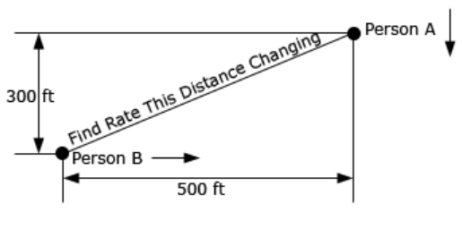
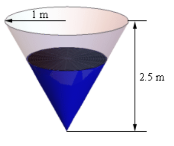

# Section 3.11 : Related Rates

In this section we are going to look at an application of implicit
differentiation. Most of the applications of derivatives are in the next chapter
however there are a couple of reasons for placing it in this chapter as opposed
to putting it into the next chapter with the other applications. The first
reason is that it's an application of implicit differentiation and so putting it
right after that section means that we won't have forgotten how to do implicit
differentiation. The other reason is simply that after doing all these
derivatives we need to be reminded that there really are actual applications to
derivatives. Sometimes it is easy to forget there really is a reason that we're
spending all this time on derivatives.

For these related rates problems, it's usually best to just jump right into some
problems and see how they work.

---

**Example 1** Air is being pumped into a spherical balloon at a rate of 5
cm3/min. Determine the rate at which the radius of the balloon is
increasing when the diameter of the balloon is 20 cm.

**Solution**

The first thing that we'll need to do here is to identify what information that
we’ve been given and what we want to find. Before we do that let's notice that
both the volume of the balloon and the radius of the balloon will vary with time
and so are really functions of time, _i.e._ $V(t)$ and $r(t)$.

We know that air is being pumped into the balloon at a rate of 5
cm3/min. This is the rate at which the volume is increasing. Recall
that rates of change are nothing more than derivatives and so we know that,

$$ V'(t) = 5 $$

We want to determine the rate at which the radius is changing. Again, rates are
derivatives and so it looks like we want to determine,

$$ r'(t) = \text{ ?} \quad \text{ when } \quad r(t) = \frac{d}{2} = 10 \text{ cm} $$

Note that we needed to convert the diameter to a radius.

Now that we've identified what we have been given and what we want to find we
need to relate these two quantities to each other. In this case we can relate
the volume and the radius with the formula for the volume of a sphere.

$$ V(t) = \frac{4}{3}\pi\left[r(t)\right]^3 $$

As in the previous section when we looked at implicit differentiation, we will
typically not use the $(t)$ part of things in the formulas, but since this is
the first time through one of these we will do that to remind ourselves that
they are really functions of $t$.

Now we don't really want a relationship between the volume and the radius. What
we really want is a relationship between their derivatives. We can do this by
differentiating both sides with respect to $t$. In other words, we will need to
do implicit differentiation on the above formula. Doing this gives,

$$ V' = 4\pi r^2r' $$

Note that at this point we went ahead and dropped the $(t)$ from each of the
terms. Now all that we need to do is plug in what we know and solve for what we
want to find.

$$ 5 = 4\pi\left(10^2\right)r' \quad \Rightarrow \quad r' = \frac{1}{80\pi} \text{ cm/min} $$

---

We can get the units of the derivative by recalling that,

$$ r' = \frac{dr}{dt} $$

The units of the derivative will be the units of the numerator (cm in the
previous example) divided by the units of the denominator (min in the previous
example).

Let's work some more examples.

---

**Example 2** A 15 foot ladder is resting against the wall. The bottom is
initially 10 feet away from the wall and is being pushed towards the wall at a
rate of $\dfrac{1}{4}$ ft/sec. How fast is the top of the ladder moving up the
wall 12 seconds after we start pushing?

**Solution**

The first thing to do in this case is to sketch picture that shows us what is
going on.

We've defined the distance of the bottom of the ladder from the wall to be $x$
and the distance of the top of the ladder from the floor to be $y$. Note as well
that these are changing with time and so we really should write $x(t)$ and
$y(t)$. However, as is often the case with related rates/implicit
differentiation problems we don't write the $(t)$ part just try to remember this
in our heads as we proceed with the problem.

Next, we need to identify what we know and what we want to find. We know that
the rate at which the bottom of the ladder is moving towards the wall. This is,

$$ x' = -\frac{1}{4} $$

Note as well that the rate is negative since the distance from the wall, $x$, is
decreasing. We always need to be careful with signs with these problems.

We want to find the rate at which the top of the ladder is moving away from the
floor. This is $y'$. Note as well that this quantity should be positive since
$y$ will be increasing.

As with the first example we first need a relationship between $x$ and $y$. We
can get this using Pythagorean theorem.

$$ x^2 + y^2 = (15)^2 = 225 $$

All that we need to do at this point is to differentiate both sides with respect
to $t$, remembering that $x$ and $y$ are really functions of $t$ and so we'll
need to do implicit differentiation. Doing this gives an equation that shows the
relationship between the derivatives.

$$ 2xx' + 2yy' = 0 \quad \quad (1) $$

Next, let's see which of the various parts of this equation that we know and
what we need to find. We know $x'$ and are being asked to determine $y'$ so it's
okay that we don't know that. However, we still need to determine $x$ and $y$.

Determining $x$ and $y$ is actually fairly simple. We know that initially
$x = 10$ and the end is being pushed in towards the wall at a rate of
$\dfrac{1}{4}$ ft/sec and that we are interested in what has happened after 12
seconds. We know that,

$$ \text{distance } = \text{ rate } \times \text{ time} $$

$$ \quad = \left(\frac{1}{4}\right)(12) = 3 $$

So, the end of the ladder has been pushed in 3 feet and so after 12 seconds we
must have $x = 7$. Note that we could have computed this in one step as follows,

$$ x = 10 - \frac{1}{4}(12) = 7 $$

To find $y$ (after 12 seconds) all that we need to do is reuse the Pythagorean
Theorem with the values of $x$ that we just found above.

$$ y = \sqrt{225 - x^2} = \sqrt{225 - 49} = \sqrt{176} $$

Now all that we need to do is plug into
[**($1$)**](https://tutorial.math.lamar.edu/Classes/CalcI/RelatedRates.aspx#mjx-eqn-eqeq1)
and solve for $y'$.

$$ 2(7)\left(-\frac{1}{4}\right) + 2\left(\sqrt{176}\right)y' = 0 \Rightarrow y' = \frac{\dfrac{7}{4}}{\sqrt{176}} = \frac{7}{4\sqrt{176}} = 0.1319 \text{ ft/sec} $$

Notice that we got the correct sign for $y'$. If we'd gotten a negative value
we'd have known that we had made a mistake and we could go back and look for it.

---

Before working another example, we need to make a comment about the set up of
the previous problem. When we labeled our sketch, we acknowledged that the
hypotenuse is constant and so just called it 15 ft. A common mistake that
students will sometimes make here is to also label the hypotenuse as a letter,
say $z$, in this case.

Well, it's not really a mistake to label with a letter, but it will often lead
to problem down the road. Had we labeled the hypotenuse $z$ then the Pythagorean
theorem and its derivative would have been,

$$ x^2 + y^2 = z^2 \quad \rightarrow \quad 2xx' + 2yy' = 2zz' $$

Again, there is nothing wrong with doing this but it does require that we
acknowledge the values of two more quantities, $z$ and $z'$. Because $z$ is just
the hypotenuse that is clearly $z = 15$. The problem that some students then
sometimes run into is determining the value of $z'$. In this case, we have to
remember that because the ladder, and hence the hypotenuse has a fixed length,
its length can't be changinga nd so $z' = 0$.

Plugging both of these values into the derivative give us same equation that we
got in the example but required a little more effort to get to. It would have
been easier to just label the hypotenuse 15 to start off with and not have to
worry about remembering that $z' = 0$.

When labeling a fixed quantity (the length of the ladder in this example) with a
letter it is sometimes easy to forget that it is a fixed quantity and so it's
derivative must be zero. If you don't remember this, the problem becomes
impossible to finish as you will have two unknown quantities that you have to
deal with. In any problem were a quantity is fixed and will never over the
course of the problem change it is always best to just acknowledge that and
label it with its value rather than with a letter.

Of course, if we'd had a sliding ladder that was allowed to change length then
we would have to label it with a letter. However, for that kind of problem we
would also need some more information in the problem statement in order to
actually do the problem. The practice problems in this section have several
problems in which all three sides of a right triangle are changing. You should
check them out and see if you can work them.

---

**Example 3** Two people are 50 feet apart. One of them starts walking north at
a rate so that the angle shown in the diagram below is changing at a constant
rate of 0.01 rad/min. At what rate is distance between the two people changing
when $\theta = 0.5$ radians?

**Solution**

This example is not as tricky as it might at first appear. Let’s call the
distance between them at any point in time $x$ as noted above. We can then
relate all the known quantities by one of two trig formulas.

$$ \cos\theta = \frac{50}{x} \quad \quad \sec\theta = \frac{x}{50} $$

We want to find $x'$ and we could find $x$ if we wanted to at the point in
question using cosine since we also know the angle at that point in time.
However, if we use the second formula we won't need to know $x$ as you’ll see.
So, let's differentiate that formula.

$$ \sec\theta\tan\theta\theta' = \frac{x'}{50} $$

As noted, there are no $x$'s in this formula. We want to determine $x'$ and we
know that $\theta = 0.5$ and $\theta' = 0.01$ (do you agree with it being
positive?). So, just plug in and solve.

$$ (50)(0.01)\sec(0.5)\tan(0.5) = x' \quad \Rightarrow \quad x' = 0.311254 \text{ ft/ min} $$

---

So far we we've seen three related rates problems. While each one was worked in
a very different manner the process was essentially the same in each. In each
problem we identified what we were given and what we wanted to find. We next
wrote down a relationship between all the various quantities and used implicit
differentiation to arrive at a relationship between the various derivatives in
the problem. Finally, we plugged the known quantities into the equation to find
the value we were after.

So, in a general sense each problem was worked in pretty much the same manner.
The only real difference between them was coming up with the relationship
between the known and unknown quantities. This is often the hardest part of the
problem. In many problems the best way to come up with the relationship is to
sketch a diagram that shows the situation. This often seems like a silly step
but can make all the difference in whether we can find the relationship or not.

Let's work another problem that uses some different ideas and shows some of the
different kinds of things that can show up in related rates problems.

---

**Example 4** A tank of water in the shape of a cone is leaking water at a
constant rate of $2$ ft3 /hour. The base radius of the tank is 5 ft
and the height of the tank is 14 ft.

**(a)** At what rate is the depth of the water in the tank changing when the
depth of the water is 6 ft?

**(b)** At what rate is the radius of the top of the water in the tank changing
when the depth of the water is 6 ft?

**Solution**

Okay, we should probably start off with a quick sketch (probably not to scale)
of what is going on here. We'll also be doing the sketch as if we were looking
at the tank from directly in front of it (and so the 3D of the tank will not be
visible) as this will help a little with seeing what is going on. Showing the 3D
nature of the tank is liable to just get in the way. So here is the sketch of
the tank with some water in it.

As we can see, the water in the tank actually forms a smaller cone/triangle
(depending on which image we are looking at) with the same central angle as the
tank itself. The radius of the "water" cone at any time is given by $r$ and the
height of the "water" cone at any time is given by $h$. The volume of water in
the tank at any time $t$ is given by,

$$ V = \frac{1}{3}\pi r^2h $$

and we've been given that $V' = -2$.

**(a)** At what rate is the depth of the water in the tank changing when the
depth of the water is 6 ft?

**Solution**

For this part we need to determine $h'$ when $h = 6$ and now we have a problem.
The only formula that we've got that will relate the volume to the height also
includes the radius and so if we were to differentiate this with respect to $t$
we would get,

$$ V' =\frac{2}{3}\pi rr'h + \frac{1}{3}\pi r^2h' $$

So, in this equation we know $V'$ and $h$ and want to find $h'$, but we don't
know $r$ and $r'$. As we'll see finding $r$ isn't too bad, but we just don't
have enough information, at this point, that will allow us to find $r'$ and $h'$
simulataneously.

To fix this we'll need to eliminate the $r$ from the volume formula in some way.
This is actually easier than it might at first look. If we go back to our sketch
above and look at just the right half of the tank we see that we have two
similar triangles and when we say similar we mean similar in the geometric
sense. Recall that two triangles are called similar if their angles are
identical, which is the case here. When we have two similar triangles then
ratios of any two sides will be equal. For our set this means that we have,

$$ \frac{r}{h} = \frac{15}{14} \quad \Rightarrow \quad r = \frac{5}{14}h $$

If we take this and plug it into our volume formula we have,

$$ V = \frac{1}{3}\pi r^2h = \frac{1}{3}\pi\left(\frac{5}{14}h\right)^2h = \frac{25}{588}\pi h^3 $$

This gives us a volume formula that only involved the volume and the height of
the water. Note however that this volume formula is only valid for our cone, so
don't be tempted to use it for other cones! If we now differentiate this we
have,

$$ V' = \frac{25}{196}\pi h^2h' $$

At this point all we need to do is plug in what we know and solve for $h'$.

$$ -2 = \frac{25}{196}\pi\left(6^2\right)h' \quad \Rightarrow \quad h' =\frac{-98}{225\pi} = -0.1386 $$

So, it looks like the height is decreasing at a rate of 0.1386 ft/hr.

**(b)** At what rate is the radius of the top of the water in the tank changing
when the depth of the water is 6 ft?

**Solution**

In this case we are asking for $r'$ and there is an easy way to do this part and
a difficult (well, more difficult than the easy way anyway....) way to do it.
The "difficult" way is to redo the work in part (a) above only this time use,

$$ \frac{h}{r} =\frac{14}{5} \quad \Rightarrow \quad h =\frac{14}{5}r  $$

to get the volume in terms of $V$ and $r$ and then proceed as before.

That's not terribly difficult, but it is more work that we need to do. Recall
from the first part that we have,

$$ r = \frac{5}{14}h \quad \Rightarrow \quad r' = \frac{5}{14}h' $$

So, as we can see if we take the relationship that relates $r$ and $h$ that we
used in the first part and differentiate it we get a relationship between $r'$
and $h'$. At this point all we need to do here is use the result from the first
part to get,

$$ r' =\frac{5}{14}\left(\frac{-98}{225\pi}\right) = -\frac{7}{45\pi} = -0.04951 $$

Much easier that redoing all of the first part. Note however, that we were only
able to do this the "easier" way because it was asking for $r'$ at exactly the
same time that we asked for $h'$ in the first part. If we hadn't been using the
same time then we would have had no choice but to do this the "difficult" way.

---

In the second part of the previous problem we saw an important idea in dealing
with related rates. In order to find the asked for rate all we need is an
equation that relates the rate we're looking for to a rate that we already know.
Sometimes there are multiple equations that we can use and sometimes one will be
easier than another.

Also, this problem showed us that we will often have an equation that contains
more variables that we have information about and so, in these cases, we will
need to eliminate one (or more) of the variables. In this problem we eliminated
the extra variable using the idea of similar triangles. This will not always be
how we do this, but many of these problems do use similar triangles so make sure
you can use that idea.

Let's work some more problems.

---

**Example 5** A trough of water is 8 meters in length and its ends are in the
shape of isosceles triangles whose width is 5 meters and height is 2 meters. If
water is being pumped in at a constant rate of $6\text{m}$3/sec. At
what rate is the height of the water changing when the water has a height of 120
cm? At what rate is the width of the water changing when the water has a height
of 120cm?

**Solution**

Note that an isosceles triangle is just a triangle in which two of the sides are
the same length. In our case sides of the tank have the same length.

Let's add in some dimensions for the water to the sketch from above.

Now, in this problem we know that $V' = 6\text{ m}$3/sec and we want
to determine $h'$ and $h = 1.2\text{ m}$. Note that because $V'$ is in terms of
meters we need to convert $h$ into meters as well. So, we need an equation that
will relate these two quantities and the volume of the tank will do it.

The volume of this kind of tank is simple to compute. The volume is the area of
the end times the depth. For our case the volume of the water in the tank is,

$$ V = \left(\text{Area of End}\right)\left(\text{depth}\right) $$

$$ \quad = \left(\frac{1}{2}\text{base} \times \text{height}\right)\left(\text{depth}\right) $$

$$ \quad =\frac{1}{2}hw(8)  $$

$$ \quad = 4hw $$

As with the previous example we’ve got an extra quantity here, $w$, that is also
changing with time and so we need to eliminate it from the problem. To do this
we'll again make use of the idea of similar triangles. If we look at the end of
the tank we'll see that we again have two similar triangles. One for the tank
itself and one formed by the water in the tank. Again, remember that with
similar triangles ratios of sides must be equal. In our case we'll use,

$$ \frac{w}{5} = \frac{h}{2} \quad \Rightarrow \quad w = \frac{5}{2}h $$

Plugging this into the volume gives a formula for the volume (and only for this
tank) that only involved the height of the water.

$$ V = 4hw = 4h\left(\frac{5}{2}h\right) = 10h^2 $$

We can now differentiate this to get,

$$ V' = 20hh' $$

Finally, all we need to do is plug in and solve for $h'$.

$$ 6 = 20(1.2)h' \quad \Rightarrow \quad h' = 0.25 \text{ m/ sec} $$

So, the height of the water is rising at a rate of 0.25 m/sec.

In order to answer the second part of this question is not all that difficult.

We will need $w'$ to answer this part and we have the following equation from
the similar triangle that relate the width to the height and we can quickly
differentiate it to get a relationship between $w'$ and $h'$.

$$ w = \frac{5}{2}h \quad \Rightarrow \quad w' = \frac{5}{2}h' $$

From the first part we know the value of $h'$ and so all we need to do is plug
that into this equation and we'll have the answer.

$$ w' =\frac{5}{2}(0.25) = 0.625 \text{ m/sec}  $$

Therefore the width is increasing at a rate of 0.625 m/sec.

---

**Example 6** A light is on the top of a 12 ft tall pole and a 5ft 6in tall
person is walking away from the pole at a rate of 2 ft/sec.

**(a)** At what rate is the tip of the shadow moving away from the pole when the
person is 25 ft from the pole?

**(b)** At what rate is the tip of the shadow moving away from the person when
the person is 25 ft from the pole?

**Solution**

Let's start off with putting all the relevant quantities into the sketch from
above.

Here $x$ is the distance of the tip of the shadow from the pole, $x_p$ is the
distance of the person from the pole and $x_s$ is the length of the shadow. Also
note that we converted the persons height over to 5.5 feet since all the other
measurements are in feet.

The tip of the shadow is defined by the rays of light just getting past the
person and so we can see they form a set of similar triangles. This will be
useful down the road.

**(a)** At what rate is the tip of the shadow moving away from the pole when the
person is 25 ft from the pole?

**Solution**

In this case we want to determine $x'$ when $x_p = 25$ given that $x'_p = 2$.

The equation we'll need here is,

$$ x = x_p + x_s $$

but we'll need to eliminate $x_s$ from the equation in order to get an answer.
To do this we can again make use of the fact that the two triangles are similar
to get,

$$ \frac{5.5}{12} = \frac{x_s}{x} \quad \text{ Note : } \frac{5.5}{12} = \frac{\dfrac{11}{2}}{12} = \frac{11}{24} $$

From this we can quickly see that,

$$ x_s = \frac{11}{24}x $$

We can then plug this into the equation above and solve for $x$ as follows.

$$ x = x_p + x_s = x_p + \frac{11}{24}x \quad \Rightarrow \quad x = \frac{24}{13}x_p $$

Now all that we need to do is differentiate this, plug in and solve for $x'$.

$$ x' =\frac{24}{13}x'_p \quad \Rightarrow \quad x' = \frac{24}{13}(2) = 3.6923 \text{ ft/sec}  $$

The tip of the shadow is then moving away from the pole at a rate of 3.6923
ft/sec. Notice as well that we never actually had to use the fact that
$x_p = 25$ for this problem. That will happen on rare occassions.

**(b)** At what rate is the tip of the shadow moving away from the person when
the person is 25 ft from the pole?

**Solution**

This part is actually quite simple if we have the answer from (a) in hand, which
we do of course. In this case we know that $x_s$ represents the length of the
shadow, or the distance of the tip of the shadow from the person so it looks
like we want to determine $x'_s$ when $x_p = 25$.

Again, we can use $x = x_p + x_s$, however unlike the first part we now know
that $x'_p = 2$ and $x' = 3.6923 \text{ ft/sec}$ so in this case all we need to
do is differentiate the equation and plug in for all the known quantities.

$$ x' = x'_p + x'_s $$

$$ 3.6923 = 2 + x'_s \quad x'_s = 1.6923 \text{ ft/sec} $$

The tip of the shadow is then moving away from the person at a rate of 1.6923
ft/sec.

---

**Example 7** A spot light is on the ground 20 ft away from a wall and a 6 ft
tall person is walking towards the wall at a rate of 2.5 ft/sec. How fast is the
height of the shadow changing when the person is 8 feet from the wall? Is the
shadow increasing or decreasing in height at this time?

**Solution**

Below is a copy of the sketch in the problem statement with all the relevant
quantities added in. The top of the shadow will be defined by the light rays
going over the head of the person and so we again get yet another set of similar
triangles.

In this case we want to determine $y'$ when the person is 8 ft from wall or
$x = 12\text{ ft}$. Also, if the person is moving towards the wall at 2.5 ft/sec
then the person must be moving away from the spotlight at 2.5 ft/sec and so we
also know that $x' = 2.5$.

In all the previous problems that used similar triangles we used the similar
triangles to eliminate one of the variables from the equation we were working
with. In this case however, we can get the equation that relates $x$ and $y$
directly from the two similar triangles. In this case the equation we're going
to work with is,

$$ \frac{y}{6} = \frac{20}{x} \quad \Rightarrow \quad y = \frac{120}{x} $$

Now all that we need to do is differentiate and plug values into solve to get
$y'$.

$$ y' = -\frac{120}{x^2}x' \quad \Rightarrow \quad y' = -\frac{120}{12^2}(2.5) = -2.0833 \text{ ft/sec} $$

The height of the shadow is then decreasing at a rate of 2.0833 ft/sec.

---

Okay, we've worked quite a few problems now that involved similar triangles in
one form or another so make sure you can do these kinds of problems.

It's now time to do a problem that while similar to some of the problems we've
done to this point is also sufficiently different that it can cause problems
until you’ve seen how to do it.

---

**Example 8** Two people on bikes are separated by 350 meters. Person A starts
riding north at a rate of 5 m/sec and 7 minutes later Person B starts riding
south at 3 m/sec. At what rate is the distance separating the two people
changing 25 minutes after Person A starts riding?

**Solution**

There is a lot to digest here with this problem. Let's start off with a sketch
of the situation that shows each person's location sometime after both people
start riding.

Now we are after $z'$ and we know that $x' = 5$ and $y' = 3$. We want to know
$z'$ after Person A had been riding for 25 minutes and Person B has been riding
for $25 - 7 = 18$ minutes. After converting these times to seconds (because our
rates are all in m/sec) this means that at the time we’re interested in each of
the bike riders has rode,

$$ x = 5(25 \times 60) = 7500 \text{m} \quad y = 3(18 \times 60) = 3240\text{m} $$

Next, the Pythagorean theorem tells us that,

$$ z^2 = (x + y)^2 + 350^2 $$

Therefore, 25 minutes after Person A starts riding the two bike riders are

$$ z = \sqrt{(x + y)^2 + 350^2} = \sqrt{(7500 + 3240)^2 + 350^2} = 10745.7015\text{ m} $$

apart.

To determine the rate at which the two riders are moving apart all we need to do
then is differentiate
[**($2$)**](https://tutorial.math.lamar.edu/Classes/CalcI/RelatedRates.aspx#mjx-eqn-eqeq2)
and plug in all the quantities that we know to find $z'$.

$$ 2zz' = 2(x + y)\left(x' + y'\right) $$

$$ 2(10745.7015)z' = 2(7500 + 3240)(5 + 3) $$

$$ z' = 7.9958 \text{m/sec} $$

So, the two riders are moving apart at a rate of 7.9958 m/sec.

---

Every problem that we've worked to this point has come down to needing a
geometric formula and we should probably work a quick problem that is not
geometric in nature.

---

**Example 9** Suppose that we have two resistors connected in parallel with
resistances $R_1$ and $R_2$ measured in ohms ($\Omega$). The total resistance,
$R$, is then given by,

$$ \frac{1}{R} = \frac{1}{R_1} + \frac{1}{R_2} $$

Suppose that $R_1$ is increasing at a rate of 0.4 $\Omega$/min and $R_2$ is
decreasing at a rate of 0.7 $\Omega$/min. At what rate is $R$ changing when
$R_1 = 80\Omega$ and $R_2 = 105\Omega$?

**Solution**

Okay, unlike the previous problems there really isn't a whole lot to do here.
First, let's note that we're looking for $R'$ and that we know $R'_1 = 0.4$ and
$R'_2 = -0.7$. Be careful with the signs here.

Also, since we'll eventually need it let's determine $R$ at the time we're
interested in.

$$ \frac{1}{R} = \frac{1}{80} + \frac{1}{105} = \frac{37}{1680} \quad \Rightarrow \quad R =\frac{1680}{37} = 45.4054\Omega  $$

Next, we need to differentiate the equation given in the problem statement.

$$ -\frac{1}{R^2}R' = -\frac{1}{\left(R_1\right)^2}R'_1 - \frac{1}{\left(R_2\right)^2}R'_2 $$

$$ R' = R^2\left(\frac{1}{\left(R_1\right)^2}R'_1 + \frac{1}{\left(R_2\right)^2}R'_2\right) $$

Finally, all we need to do is plug into this and do some quick computations.

$$ R' = (45.4054)^2\left(\frac{1}{80^2}(0.4) + \frac{1}{105^2}(-0.7)\right) = -0.002045 $$

So, it looks like $R$ is decreasing at a rate of 0.002045$\Omega$/min.

---

We've seen quite a few related rates problems in this section that cover a wide
variety of possible problems. There are still many more different kinds of
related rates problems out there in the world, but the ones that we've worked
here should give you a pretty good idea on how to at least start most of the
problems that you're liable to run into.

---

## Practice Problems

**1.** In the following assume that $x$ and $y$ are both functions of $t$. Given
$x = -2$, $y = 1$ and $x' = -4$ determine $y'$ for the following equation.

$$ 6y^2 + x^2 = 2 - x^3\mathbf{e}^{4 - 4y} $$

**Solution**

$$ 12yy' + 2xx' = 0 - \left[\left(x^3\right)'\left(\mathbf{e}^{4 - 4y}\right) + \left(x^3\right)\left(\mathbf{e}^{4 - 4y}\right)'\right] $$

$$ 12yy' + 2xx' = -\left[\left(3x^2x'\right)\left(\mathbf{e}^{4 - 4y}\right) + \left(x^3\right)\left(\mathbf{e}^{4 - 4y}\right)(4 - 4y)'\right] $$

$$ 12yy' + 2xx' = -\left[\left(3x^2x'\right)\left(\mathbf{e}^{4 - 4y}\right) + \left(x^3\right)\left(\mathbf{e}^{4 - 4y}\right)(0 - 4y')\right] $$

$$ y'12y + x'2x = -x'3x^2\mathbf{e}^{4 - 4y} + y'4x^3\mathbf{e}^{4 - 4y} $$

$$ y'12y - y'4x^3\mathbf{e}^{4 - 4y} = -x'3x^2\mathbf{e}^{4 - 4y} - x'2x $$

$$ y'\left(12y - 4x^3\mathbf{e}^{4 - 4y}\right) = -x'3x^2\mathbf{e}^{4 - 4y} - x'2x $$

$$ y' = \frac{-x'3x^2\mathbf{e}^{4 - 4y} - x'2x}{12y - 4x^3\mathbf{e}^{4 - 4y}} $$

$$ y' = \frac{-(-4)3(-2)^2\mathbf{e}^{4 - 4(1)} - (-4)2(-2)}{12(1) - 4(-2)^3\mathbf{e}^{4 - 4(1)}} $$

$$ y' = \frac{(4)3(4)\mathbf{e}^{0} + (4)(-4)}{12 - 4(-8)\mathbf{e}^{0}} $$

$$ y' = \frac{48(1) + (-16)}{12 + 32(1)} $$

$$ y' = \frac{32}{44} $$

$$ \boxed{y' = \frac{8}{11}} $$

**2.** In the following assume that $x$, $y$ and $z$ are all functions of $t$.
Given $x = 4$, $y = -2$, $z = 1$, $x' = 9$ and $y' = -3$ determine $z'$ for the
following equation.

$$ x(1 - y) + 5z^3 = y^2z^2 + x^2 - 3 $$

**Solution**

$$ \left[(x)'(1 - y) + (x)(1 - y)'\right] + 15z^2z' = \left[\left(y^2\right)'\left(z^2\right) + \left(y^2\right)\left(z^2\right)'\right]  + 2xx' - 0 $$

$$ \left[x'(1 - y) + (x)(0 - y')\right] + 15z^2z' = \left[\left(2yy'\right)\left(z^2\right) + \left(y^2\right)\left(2zz'\right)\right]  + 2xx' $$

$$ x'- x'y - y'x + 15z^2z' = 2yy'z^2 + y^22zz'  + 2xx' $$

$$ 15z^2z'- y^22zz' = 2yy'z^2 + 2xx' - x' + x'y + y'x  $$

$$ z'\left(15z^2- y^22z\right) = 2yy'z^2 + 2xx' - x' + x'y + y'x  $$

$$ z' = \frac{2yy'z^2 + 2xx' - x' + x'y + y'x}{15z^2- y^22z}  $$

$$ z' = \frac{2(-2)(-3)(1)^2 + 2(4)(9) - (9) + (9)(-2) + (-3)(4)}{15(1)^2- (-2)^22(1)}  $$

$$ z' = \frac{12 + 72 - 9 - 18 - 12}{15 - 8}  $$

$$ \boxed{z' = \frac{45}{7}}  $$

**3.** For a certain rectangle the length of one side is always three times the
length of the other side.

**(a)** If the shorter side is decreasing at a rate of 2 inches/minute at what
rate is the longer side decreasing?

**Solution**

We can say the shorter side is $x$, and that $x' = -2$, we can also say that $y$
is the longer side and $y = 3x$. Therefore we need to find $y'$:

$$ y = 3x $$

$$ y' = 3x' $$

$$ y' = 3(-2) $$

$$ \boxed{y' = -6} $$

**(b)** At what rate is the enclosed area decreasing when the shorter side is 6
inches long and is decreasing at a rate of 2 inches/minute?

**Solution**

we can solve in terms of $x$:

$$ A = 3x^2 $$

$$ A' = 6xx' $$

$$ A' = 6(6)(-2) $$

$$ A' = -72 $$

We can also solve in terms of $xy$:

$$ A = xy $$

$$ A' = (x)'(y) + (x)(y)' $$

$$ A' = (-2)(18) + (6)(-6) $$

$$ A' = -72 $$

**4.** A thin sheet of ice is in the form of a circle. If the ice is melting in
such a way that the area of the sheet is decreasing at a rate of 0.5
m2/sec at what rate is the radius decreasing when the area of the
sheet is 12 m2?

**Solution**

Let's establish what we know:

The area of a circle is found via the formula:

$$ A = \pi r^2 $$

The area of the circle sheet of ice is decreasing by $0.5$ m2/sec:

$$ A' = -0.5 $$

And we know the Area is $12$ m2:

$$ A = 12 $$

Therefore we know the derivative can be found by simply taking the derivative on
both sides:

$$ A' = (\pi)'\left(r^2\right) + (\pi)\left(r^2\right)' $$

$$ A' = (0)\left(r^2\right) + (\pi)\left(2rr'\right) $$

$$ A' = 2\pi rr' $$

And we can then solve for $r'$:

$$ r' = \frac{A'}{2\pi r} $$

We can fill in for $A'$:

$$ r' = \frac{-0.5}{2\pi r} $$

But still need $r$ to solve. We can find that with the Area of the circle
formula and the given Area:

$$ A = \pi r^2 $$

$$ A = 12 $$

$$ r = \sqrt{\frac{A}{\pi}} $$

$$ r = \sqrt{\frac{12}{\pi}} $$

$$ r \approx 1.9544 $$

We can plug this in now to solve for $r'$:

$$ r' \approx \frac{-0.5}{2\pi(1.9544)} $$

$$ r' \approx -0.0407 \text{ m}^2\text{/sec}  $$

**5.** A person is standing 350 feet away from a model rocket that is fired
straight up into the air at a rate of 15 ft/sec. At what rate is the distance
between the person and the rocket increasing **(a)** 20 seconds after liftoff?
**(b)** 1 minute after liftoff?

**Solution**

Firstly, this is a pythagorean problem. the rocket going up 15 ft/sec is a rate
of change, let's say it is represented by $y'$. We only know that the person is
a fixed 350 ft away from the rocket.

$$ x^2 + y^2 = z^2 $$

Let's fill in $x = 350$:

$$ (350)^2 + y^2 = z^2 $$

$$ z^2  = y^2 + 122500 $$

Then we can differentiate $z$ as it relates to time, let's call that $t$:

$$ 2zz' = 2yy' + 0 $$

And solve for $z'$, which will help us find solutions to both **(a)** and
**(b)**.

$$ z' = \frac{2yy'}{2z} $$

$$ z' = \frac{yy'}{z} $$

For part **(a)** we know that the rocket is travelling 15 ft/sec and that we
have already gone for $20$ seconds after liftoff. This gives us a value for the
height of our rocket in the air, the value of $y$:

$$ y = 20(15) = 300 $$

We can then plug that into the pythagorean theorem formula to solve for $z$:

$$ z^2 = x^2 + y^2 $$

$$ z^2 = (350)^2 + (300)^2 $$

$$ z = \sqrt{(350)^2 + (300)^2} \approx 460.9772 $$

We can then use these values in our formula derived for $z'$ to find the rate of
change after 20 seconds:

$$ z' = \frac{yy'}{z} $$

$$ z' \approx \frac{(300)(15)}{(460.9772)} $$

$$ \boxed{z' \approx 9.7619 \text{ ft/sec}} $$

For part **(b)** we just have to be careful and remember we're measuring in
seconds. Once we take that into account, the formula is the same:

$$ y = 60(15) = 900 $$

$$ z^2 = (350)^2 + (900)^2 $$

$$ z = \sqrt{(350)^2 + (900)^2} \approx 965.6604 $$

$$ \boxed{z' = \frac{(900)(15)}{(965.6604)} \approx 13.9801 \text{ ft/sec}} $$

**6.** A plane is 750 meters in the air flying parallel to the ground at a speed
of 100 m/s and is initially 2.5 kilometers away from a radar station. At what
rate is the distance between the plane and the radar station changing **(a)**
initially and **(b)** 30 seconds after it passes over the radar station?

**Solution**

Let's say that $x$ is the distance from the plane to the radar station on the
ground, which when adjusted to be meters is $2500$ meters, which we'll say is
represented by $y$. We also know that $x' = -100$ as we are closing the distance
of 100 m/sec to the radar station as the plane travels along its course. Let's
then say that the distance between the plane and the radar station in the air is
the hypotenuse of the right triangle from and we can represent that as $z$:

$$ z^2 = x^2 + y^2 $$

$$ z^2 = (2500)^2 + (750)^2 $$

$$ z = \sqrt{(2500)^2 + (750)^2} \approx 2610.07663 $$

But we're looking for $z'$ in both parts **(a)** and **(b)**. Let's find the
formula then as it relates to $x$, since we know $x'$:

$$ z^2 = x^2 + y^2 $$

$$ 2zz' = 2xx' + (2500)' $$

$$ 2zz' = 2xx' + 0 $$

$$ z' = \frac{xx'}{z} $$

Since we're looking for the rate of change at this instant, we can plug in our
values

$$ \boxed{z' = \frac{(2500)(-100}{2610.07663} \approx -95.7826 \text{ m/sec}} $$

For part **(b)** the plane has already passed over the radar station 30 seconds
ago, so we need to take the speed of 100 m/s and just for that:

$$ y = 30(100) = 3000 $$

$$ z^2 = x^2 + y^2 $$

$$ z^2 = (750)^2 + (3000)^2 $$

$$ z = \sqrt{(750)^2 + (3000)^2} \approx 3092.3292  $$

And again, we're trying to find $z'$, keep in mind that $x' = 100$ is positive
now because our distance from the radar station is increasing. Also note that
$x = 3000$ because that is the new distance we are away from the radar station
(just in the other direction).

$$ z' = \frac{xx'}{z} $$

$$ z' \approx \frac{(3000)(100)}{3092.3292} $$

$$ \boxed{z' \approx 97.0143 \text{ m/sec}} $$

**7.** Two people are at an elevator. At the same time one person starts to walk
away from the elevator at a rate of 2 ft/sec and the other person starts going
up in the elevator at a rate of 7 ft/sec. What rate is the distance between the
two people changing 15 seconds later?

**Solution**

Let's first work with what we know.

$$ x = \text{ distance of first person leaving the elevator} $$

$$ y = \text{ distance of second person in the elevator} $$

$$ z = \text{distance between the two persons} $$

$$ t = \text{ time that has elapsed in seconds} $$

We actually initially don't know $x$, $y$, or $z$, but we do know $x'$ and $y'$:

$$ x' = 2 \text{ ft/sec} $$

$$ y' = 7 \text{ ft/sec} $$

And we also know that:

$$ t = 15 $$

From this we can easily calculate $x$, $y$, and $z$:

$$ x = 15(2) = 30 $$

$$ y = 15(7) = 105 $$

$$ z = \sqrt{(30)^2 + (105)^2} \approx 109.2016 $$

And we are looking for $z'$. Let' find the formula for that as it relates to $t$
first:

$$ (z^2)' = (x^2)' + (y^2)' $$

$$ 2zz' = 2xx' + 2yy' $$

$$ z' = \frac{xx' + yy'}{z} $$

And we know all the values for this here, we just have to plug them in:

$$ z' \approx \frac{(30)(2) + (105)(7)}{(109.2016)} $$

$$ \boxed{z' \approx 7.2801 \text{ ft/sec}} $$

**8.** Two people on bikes are at the same place. One of the bikers starts
riding directly north at a rate of 8 m/sec. Five seconds after the first biker
started riding north the second starts to ride directly east at a rate of 5
m/sec. At what rate is the distance between the two riders increasing 20 seconds
after the second person started riding?

**Solution**

This can seem confusing at first, but firstly we have to establish a few
variables:

$$ y = \text{ distance of northern travelling biker} $$

$$ x = \text{ distance of eastern travelling biker} $$

$$ z = \text{ distance between the two bikers} $$

We know that:

$$ x' = 8 \text{ m/sec} $$

$$ y' = 5 \text{ m/sec} $$

The only issue is that they start at different times. So:

$$ t = \text{ time that has elapsed in seconds} $$

So, we know that at $t = 5$, the northernmost biker has already traveled:

$$ y = (5)(8) = 40 $$

While the easternmost biker hasn't travelled at all (but starts):

$$ x = (5)(0) = 0 $$

20 seconds elapse, bringing our total time to:

$$ t = 5 + 20 = 25 $$

This actually establishes two times that each biker has traveled. Let's
establish their respective distances travelled as:

$$ x_{t = 25} = 25(8) = 200 $$

And:

$$ y_{t = 20} = 20(5) = 100 $$

And this can give us $z$ at $t = 25$:

$$ z = \sqrt{(200)^2 + (100)^2} $$

$$ z \approx 223.6068 $$

And like our previous problem, we can find $z'$ by implicit differentiation:

$$ (z^2)' = (x^2)' + (y^2)' $$

$$ 2zz' = 2xx' + 2yy' $$

$$ z' = \frac{xx' + yy'}{z} $$

And we can now solve for $z'$ by plugging in our values:

$$ z' \approx \frac{(200)(8) + (100)(5)}{(223.6068)} $$

$$ \boxed{z' \approx 9.3915 \text{ m/sec}} $$

**9.** A light is mounted on a wall 5 meters above the ground. A 2 meter tall
person is initially 10 meters from the wall and is moving towards the wall at a
rate of 0.5 m/sec. After 4 seconds of moving is the tip of the shadow moving
**(a)** towards or away from the person and **(b)** towards or away from the
wall?

**Solution**

To resolve this, it is best we divide the given diagram up a bit further:

We know that initially $x_p = 10$. We also know that $(x_p)' = -0.5$ since the
person is travelling towards the wall (closing the distance, hence the negative
value) at 0.5 m/sec.

For part **(a)** then, we can calculate what $x_p$ will be after 4 seconds by:

$$ x_p = 10 - 4(0.5) = 8 $$

This will help us, as part **(a)** is asking us what $x_s$ is after 4 seconds of
the person moving toward the wall.

Notice that we have two triangles with the same angles, just one's lengths are
smaller. These are similar triangles and we can equate the ratios of their legs
using the following equation:

$$ \frac{2}{5} = \frac{x_s}{x} = \frac{x_s}{x_p + x_s} $$

Notice here we are saying the ratio of the heights of both the person and the
lamp on the wall are comparable to the distance between the person and the base
of the wall and the shadow's tip and the base of the wall.

We now can solve for $x_s$:

$$ \frac{2}{5}\left(x_p + x_s\right) = x_s $$

$$ \frac{2}{5}x_p + \frac{2}{5}x_s = x_s $$

$$ \frac{2}{5}x_p = \frac{3}{5}x_s $$

$$ 2x_p = 3x_s $$

$$ x_s = \frac{2}{3}x_p $$

And we can use this to find the derivative $x_s'$, which is what we are looking
for for part **(a)**

$$ x_s' = \frac{2}{3}x_p' $$

$$ x_s' = \frac{2}{3}(-0.5) = -\frac{1}{3} $$

$$ x_s' = -\frac{1}{3} \text{ m/sec} $$

So we know that the tip of the shadow is moving towards the person at a rate of
$\dfrac{1}{3} \text{ m/sec}$

For part **(b)**, we instead what to find $x'$, the rate of change of the total
distance from the base of the wall to the tip of the shadow at $t = 4$.

Recall that:

$$ x = x_p + x_s $$

So basic differentation with respect to $t$ gives us:

$$ x' = x_p' + x_s' $$

Since $t$ is the same from part **(a)**, we can use the value of $x_s'$ here:

$$ x_s' = -\frac{1}{3} $$

And we know that $x_p'$ is $-0.5$. so we can just plug in for $x'$:

$$ x' = -\frac{1}{2} + \left(-\frac{1}{3}\right) = -\frac{5}{6} $$

So we can say that the tip of the shadow is moving towards the wall at a rate of
$\dfrac{5}{6}$ m/sec.

**10.** A tank of water in the shape of a cone is being filled with water at a
rate of 12 m3/sec. The base radius of the tank is 26 meters and the
height of the tank is 8 meters. At what rate is the depth of the water in the
tank changing when the radius of the top of the water is 10 meters? Note the
image below is not completely to scale….

**Solution**

This is a volume problem. Recall that Volume for a cone can be given by the
following formula:

$$ V = \frac{1}{3}\pi r^2h $$

Let's establish a few terms:

$$ V = \text{ Volume of water in the tank} $$

$$ r = \text{ radius of the water/tank} $$

$$ h = \text{ height of the water/tank} $$

We also know that the rate of change for the Volume is:

$$ V' = 12 $$

What' we're looking for is the rate at which the depth of the water in the tank
is changing when the radius of the top of the water is 10 meters. This means
we're looking for $h'$ when $r = 10$.

Because the radius and height of the tank create a right triangle, and so does
the radius and height of the water, this creates similar triangles that we can
use to find $r$ and $h$ at this specific time.

$$ \frac{r}{h} = \frac{26}{8} \quad \Rightarrow \quad r = \frac{13}{4}h $$

This changes our Volume equation to:

$$ V = \frac{1}{3}\pi r^2h $$

$$ V = \frac{1}{3}\pi\left(\frac{13}{4}h\right)^2h $$

$$ V = \frac{169}{48}\pi h^3  $$

Now let's establish what we know about $V'$ via implicit differentiation:

$$ V' = \frac{169}{48}\pi 3h^2h' $$

$$ V' = \frac{169}{16}\pi h^2h' $$

Now we just need to find $h$, but we know $h$ can be found in a similar way we
found the radius earlier:

$$ \frac{r}{h} = \frac{26}{8} \quad \Rightarrow \quad h = \frac{4}{13}r  $$

And we know that at the time we are interested, $r = 10$, so to find $h$ at that
time we just plug in for $r$:

$$ h = \frac{4}{13}(10) = \frac{40}{13} $$

We now have all the necessary inputs to find $h'$:

$$ V' = \frac{169}{16}\pi h^2h' $$

$$ 12 = \frac{169}{16}\pi\left(\frac{40}{13}\right)^2h' $$

$$ h' = \frac{12}{\dfrac{169}{16}\pi\left(\dfrac{40}{13}\right)^2} $$

$$ \boxed{h' = \frac{3}{25\pi} \approx 0.0382 \text{ m}} $$

**11.** The angle of elevation is the angle formed by a horizontal line and a
line joining the observer’s eye to an object above the horizontal line. A person
is 500 feet way from the launch point of a hot air balloon. The hot air balloon
is starting to come back down at a rate of 15 ft/sec. At what rate is the angle
of elevation, $\theta$, changing when the hot air balloon is 200 feet above the
ground. See the (probably bad) sketch below to help visualize the angle of
elevation if you are having trouble seeing it.

**Solution**

Let's establish a few variables:

$$ y = \text{ height of the balloon from the ground} $$

$$ x = \text{ the distance from the obeserver's eye to the ground point where the balloon will land} $$

$$ \theta = \text{ the angle of elevation from the observer's eye to the balloon} $$

We also know that the balloon is descending at 15ft/sec, filling all this in, at
a particular time $t$, we have:

$$ y = 200 $$

$$ x = 500 $$

$$ \theta = ? $$

$$ y' = -15 $$

And we're looking for the rate of change of the angle $\theta$:

$$ \theta' = \text{ ?} $$

There are a variety of trigonometric functions we can use, but tangent is likely
the best to use in this case since we know both the $x$ and $y$ legs. Therefore
We know in this case that:

$$ \tan\theta = \frac{y}{x} $$

$x$ is a constant here so:

$$ \tan\theta = \frac{y}{500} $$

And by using implicit differentiation as it relates to $t$, we find:

$$ (\tan\theta)' = \left(\frac{y}{500}\right)' $$

$$ \sec^2\theta\theta' = \left(\frac{1}{500}\right)'(y) + \left(\frac{1}{500}\right)y' $$

$$ \sec^2\theta\theta' = (0)(y) + \frac{y'}{500} $$

$$ \sec^2\theta\theta' = \frac{y'}{500} $$

And ultimately we're looking for $\theta'$, so let's isolate that:

$$ \theta' = \frac{y'}{500\sec^2\theta} $$

$$ \theta' = \frac{y'}{500}\cos^2\theta $$

While we know that $y' = -15$, we don't know what $\theta$ is, but again, we can
solve that using trigonomety:

$$ \tan\theta = \frac{y}{x} $$

$$ \tan\theta = \frac{200}{500} = \frac{2}{5} $$

$$ \theta = \tan^{-1}\left(\frac{2}{5}\right) $$

$$ \theta \approx 0.3805 \text{ radians} $$

And now we have everything we need to solve for $\theta'$:

$$ \theta' = \frac{y'}{500}\cos^2\theta $$

$$ \boxed{\theta' \approx \frac{-15}{500}\cos^2(0.3805) \approx -0.0259 \text{ radians/sec}} $$

---

## Assignment Problems

**1.** In the following assume that $x$ and $y$ are both functions of $t$. Given
$x = 3$, $y = 2$ and $y' = 7$ determine $x'$ for the following equation.

$$ x^3 - y^4 = x^2y - 7 $$

**Solution**

$$ 3x^2x' - 4y^3y' = \left(x^2\right)'(y) + \left(x^2\right)(y)' - 0 $$

$$ 3x^2x' - 4y^3y' = 2xx'y + x^2y' $$

$$ x'3x^2 - 4y^3y' = x'2xy + x^2y' $$

$$ x'3x^2 - x'2xy = x^2y' + 4y^3y' $$

$$ x'\left(3x^2 - 2xy\right) = x^2y' + 4y^3y' $$

$$ x' = \frac{x^2y' + 4y^3y'}{3x^2 - 2xy} $$

$$ x' = \frac{(3)^2(7) + 4(2)^3(7)}{3(3)^2 - 2(3)(2)} $$

$$ x' = \frac{(9)(7) + 4(8)(7)}{3(9) - 12} $$

$$ x' = \frac{63 + 224}{27 - 12} $$

$$ \boxed{x' = \frac{287}{15}} $$

**2.** In the following assume that $x$ and $y$ are both functions of $t$. Given
$x = \dfrac{\pi}{6}$, $y = -4$ and $x' = 12$ determine $y'$ for the following
equation.

$$ x^2\left(y^2 - 16\right) - 6\cos(2x) = 1 + y $$

**Solution**

$$ \left[\left(x^2\right)'\left(\left(y^2 - 16\right)\right) + \left(x^2\right)\left(\left(y^2 - 16\right)\right)'\right] - \left[(6)'(\cos(2x)) + (6)(\cos(2x))'\right] = 0 + y' $$

$$ \left[(2xx')\left(y^2 - 16\right) + \left(x^2\right)\left(2yy' - 0\right)\right] - \left[(0)(\cos(2x)) + (6)(-\sin(2x)(2x)')\right] = y' $$

$$ 2xx'\left(y^2 - 16\right) + x^22yy' - \left[-6\sin(2x)(2x')\right] = y' $$

$$ 2xx'\left(y^2 - 16\right) + x^22yy' - \left[-12x'\sin(2x)\right] = y' $$

$$ 2xx'\left(y^2 - 16\right) + x^22yy' + 12x'\sin(2x) = y' $$

$$ 2xx'\left(y^2 - 16\right) + 12x'\sin(2x) = y' - x^22yy' $$

$$ 2xx'\left(y^2 - 16\right) + 12x'\sin(2x) = y'\left(1 - 2yx^2\right) $$

$$ y' = \frac{2xx'\left(y^2 - 16\right) + 12x'\sin(2x)}{1 - 2yx^2} $$

$$ y' = \frac{2\left(\dfrac{\pi}{6}\right)(12)\left((-4)^2 - 16\right) + 12(12)\sin\left(2\left(\dfrac{\pi}{6}\right)\right)}{1 - 2(-4)\left(\dfrac{\pi}{6}\right)^2} $$

$$ y' = \frac{\left(\dfrac{12\pi}{3}\right)\left(16 - 16\right) + 144\sin\left(\left(\dfrac{\pi}{3}\right)\right)}{1 + \left(\dfrac{8\pi^2}{36}\right)} $$

$$ y' = \frac{72\sqrt{3}}{1 + \left(\dfrac{2\pi^2}{9}\right)} $$

$$ \boxed{y' \approx 39.0536} $$

**3.** In the following assume that $x$, $y$ and $z$ are all functions of $t$.
Given $x = -1$, $y = 8$, $z = 2$, $x' = -4$ and $y' = 7$ determine $z'$ for the
following equation.

$$ x^4 + \frac{y}{z} = 2x^2z^2 - 3 $$

**Solution**

$$ 4x^3x' + \frac{(y)'(z) - (y)(z)'}{(z)^2} = \left[(2)'\left(x^2\right)\left(z^2\right) + (2)\left(x^2\right)'\left(z^2\right) + (2)\left(x^2\right)\left(z^2\right)'\right] - 0 $$

$$ 4x^3x' + \frac{y'z - yz'}{z^2} = \left[(0)\left(x^2\right)\left(z^2\right) + (2)(2xx')\left(z^2\right) + (2)\left(x^2\right)(2zz')\right] $$

$$ 4x^3x' + \frac{y'z}{z^2} - \frac{yz'}{z^2} = 4xx'z^2 + 4x^2zz' $$

$$ 4x^3x' + \frac{y'}{z} - 4xx'z^2 = 4x^2zz' + \frac{yz'}{z^2} $$

$$ 4x^3x' + \frac{y'}{z} - 4xx'z^2 = z'\left(4x^2z + \frac{y}{z^2}\right) $$

$$ z' = \frac{4x^3x' + \dfrac{y'}{z} - 4xx'z^2}{4x^2z + \dfrac{y}{z^2}} $$

$$ z' = \frac{4(-1)^3(-4) + \dfrac{(7)}{(2)} - 4(-1)(-4)(2)^2}{4(-1)^2(2) + \dfrac{(8)}{(2)^2}} $$

$$ z' = \frac{4(-1)(-4) + \dfrac{(7)}{(2)} - 4(-1)(-4)(4)}{4(1)(2) + \dfrac{8}{4}} $$

$$ z' = \frac{16 + \dfrac{7}{2} - 64}{8 + 2} $$

$$ z' = \frac{-48 + \dfrac{7}{2}}{10} $$

$$ \boxed{z' = -\frac{89}{20} = -4.45} $$

**4.** In the following assume that $x$, $y$ and $z$ are all functions of $t$.
Given $x = -2$, $y = 3$, $z = 4$, $y' = 6$ and $z' = 0$ determine $x'$ for the
following equation.

$$ xy^2z^2 = x^3 - z^4 - 8y $$

**Solution**

$$ \left[(x)'(y^2)(z^2) + (x)(y^2)'(z^2) + (x)(y^2)(z^2)'\right] = 3x^2x' - 4z^3z' - 8y' $$

$$ x'y^2z^2 + x2yy'z^2 + xy^22zz' = 3x^2x' - 4z^3z' - 8y' $$

$$ x'y^2z^2 - 3x^2x' = -4z^3z' - 8y' - x2yy'z^2 - xy^22zz' $$

$$ x'\left(y^2z^2 - 3x^2\right) = -4z^3z' - 8y' - x2yy'z^2 - xy^22zz' $$

$$ x' = \frac{-4z^3z' - 8y' - x2yy'z^2 - xy^22zz'}{y^2z^2 - 3x^2} $$

$$ x' = \frac{-4(4)^3(0) - 8(6) - (-2)2(3)(6)(4)^2 - (-2)(3)^22(4)(0)}{(3)^2(4)^2 - 3(-2)^2} $$

$$ x' = \frac{-48 - (-2)2(3)(6)(16)}{(9)(16) - 3(4)} $$

$$ x' = \frac{-48 + 1152}{144 - 12} $$

$$ x' = \frac{1104}{132} $$

$$ \boxed{x' = \frac{92}{11}} $$

**5.** The sides of a square are increasing at a rate of 10 cm/sec. How fast is
the area enclosed by the square increasing when the area is 150 cm2.

**Solution**

Let's establish some variables:

$$ w = \text{ side of the square} $$

$$ w' = \text{ rate at which the square is increasing in cm/sec} $$

$$ A = \text{ area of the square} $$

$$ A' = \text{ the rate at which the square is increasing in size} $$

We know the area of a square is simply:

$$ A = w^2 $$

We can find the derivative of the Area with simple implicit differentiation.

$$ A' = 2ww' $$

We want to find $A'$, but we don't know the value of $w$, we can find that
relatively easily though:

$$ A = w^2 $$

$$ 150 = w^2 $$

$$ \sqrt{150} = w $$

$$ w = 5\sqrt{6} \approx 12.2474  $$

From here we can plug in everything else and find our answer:

$$ A' = 2ww' $$

$$ A' = 2\left(5\sqrt{6}\right)(10) = 100\sqrt{6} $$

$$ \boxed{A' \approx 244.9490 \text{ cm}^2\text{/sec}} $$

**6.** The sides of an equilateral triangle are decreasing at a rate of 3 in/hr.
How fast is the area enclosed by the triangle decreasing when the sides are 2
feet long?

**Solution**

Firstly let's remind ourselves that an area of a triangle can be calculated
using the following formula:

$$ A = \frac{1}{2}bh $$

But since our problem statement declares us to be working with an equilateral
triangle, all three sides are equal in length, and we can simplify this to:

$$ A = \frac{\sqrt{3}}{4}h^2 $$

Let's now establish some variables:

$$ h = \text{ the length of each side of the triangle} $$

$$ A = \text{ the area of the triangle} $$

$$ h' = \text{ the rate the sides of the triangle are increasing in in/hr} $$

$$ A' = \text{ the rate at which the triangle's area is increasing in in}^2\text{/hr} $$

Firstly let's establish the formula for $A'$:

$$ A = \frac{\sqrt{3}}{4}h^2 $$

$$ A' = \frac{2\sqrt{3}}{4}hh' $$

$$ A' = \frac{\sqrt{3}}{2}hh' $$

Now, we know the value for $h$, note the conversion from feet to inches here:

$$ h = 24 $$

And we know that the rate for $h'$ is:

$$ h' = -3 $$

Note the negative value as the problem statement says that the sides are
decreasing.

We have everything we need to determine $A'$:

$$ A' = \frac{\sqrt{3}}{2}(24)(-3) = -36\sqrt{3} $$

$$ A' \approx -62.3538 \text{ in}^2\text{/hr} $$

**7.** A spherical balloon is being filled in such a way that the surface area
is increasing at a rate of 20 cm2/sec when the radius is 2 meters. At
what rate is air being pumped in the balloon when the radius is 2 meters?

**Solution**

We are given the surface area, but are asked to solve for the rate of change of
the volume.

The surface area of a sphere is calculated by the following formula:

$$ A = 4\pi r^2 $$

And the volume of a sphere is calculated by:

$$ V = \frac{4}{3}\pi r^3 $$

Let's establish some variables:

$$ A = \text{ surface area of the spherical balloon} $$

$$ V = \text{ the volume of the spherical balloon} $$

$$ r = \text{ radius of the balloon} $$

$$ A' = \text{ the rate at which the surface area of the balloon is increasing/decreasing} $$

$$ r' = \text{ the rate at which the radius of the balloon is increasing/decreasing} $$

$$ V' = \text{ the rate at which the volume of the balloon is increasing/decreasing} $$

We are looking for $V'$, but we'll need $r'$ first, let's establish the formula
for the change in surface area first:

$$ A = 4\pi r^2 $$

$$ A' = (4\pi)'(r^2) + (4\pi)(r^2)' $$

$$ A' = (0)(r^2) + (4\pi)(2rr') $$

$$ A' = 8\pi rr' $$

And also let's establish the formula for the change in Volume:

$$ V = \frac{4}{3}\pi r^3 $$

$$ V' = \frac{12}{3}\pi r^2r' $$

$$ V' = 4\pi r^2r' $$

We want to solve for $r'$, so let's rewrite the change of surface volume rate
as:

$$ r' = \frac{A'}{8\pi r} $$

We know that $A' = 20 \text{ cm}^2\text{/sec}$. We can solve for $r'$ by
plugging in our known values, note that $2\text{ m} = 200\text{ cm}$:

$$ r' = \frac{20}{8\pi(200)} $$

$$ r' = \frac{20}{1600\pi} $$

$$ r' = \frac{1}{80\pi} $$

We can now solve for $V'$:

$$ V' = 4\pi r^2r' $$

$$ V' = 4\pi(200)^2\left(\frac{1}{80\pi}\right) $$

$$ V' = 4\pi(40000)\left(\frac{1}{80\pi}\right) $$

$$ V' = \left(\frac{160000\pi}{80\pi}\right) $$

$$ \boxed{V' = 2000 \text{ cm}^3\text{/sec}} $$

**8.** A cylindrical tank of radius 2.5 feet is being drained of water at a rate
of 0.25 ft3/sec. How fast is the height of the water decreasing?

**Solution**

Recall that a cylinder's volume can be calculated as:

$$ V = \pi r^2h $$

Let's establish some variables:

$$ V = \text{ volume of the cylindrical tank} $$

$$ r = \text{ radius of the cylindrical tank} $$

$$ h = \text{ height of the cylindrical tank} $$

$$ V' = \text{ the rate at which the volume of the cylindrical tank is increasing/decreasing} $$

$$ r' = \text{ the rate at which the radius of the cylindrical tank is increasing/decreasing} $$

$$ h' = \text{ the rate at which the height of the cylindrical tank is increasing/decreasing} $$

We are looking for $h'$. Let's first start with what we know:

$$ r = 2.5 $$

$$ V' = -0.25 $$

We can find the formula for $h'$ like so:

$$ V = \pi r^2h $$

$$ V' = (\pi)'(r^2)(h) + (\pi)(r^2)'(h) + (\pi)(r^2)(h)' $$

$$ V' = (0)(r^2)(h) + (\pi)(2rr')(h) + (\pi)(r^2)(h') $$

Recall in Paul's notes on the subject that when you have a constant value, you
should not create extra "unknown" variables that you aren't trying to solve for.
In this case we know $r = 2.5$ and therefore it's a constant, any constant has a
$0$ derivative, _i.e._ $r' = 0$. We also know $V' = -0.25$:

$$ -0.25 = 2\pi (2.5)(0)h + \pi (2.5)^2h' $$

$$ -0.25 = \pi (2.5)^2h' $$

$$ h' = \frac{-0.25}{(2.5)^2\pi} $$

$$ \boxed{h' \approx -0.0127 \text{ ft/sec}} $$

**9.** A hot air balloon is attached to a spool of rope that is 125 feet away
from the balloon when it is on the ground. The hot air balloon rises straight up
in such a way that the length of rope increases at a rate of 15 ft/sec. How fast
is the hot air balloon rising 20 seconds after it lifts off?

**Solution**

Let's establish some variables:

$$ y = \text{ the height of the hot air balloon} $$

$$ x = \text{ the distance the spool of rope is away from the hot air balloon when it was on the ground} $$

$$ z = \text{ the length of the spool of rope to the hot air ballon when it is in the air} $$

$$ y' = \text{ the rate at which the hot air balloon is rising} $$

$$ z' = \text{ the rate at which the length of rope to the hot air balloon is increasing} $$

$$ t = \text{ the amount of time that has elapsed after the balloon lifted off} $$

This is a classic pythagorean theorem formula problem.

$$ x^2 + y^2 = z^2 $$

We are trying to find $y'$, but we only know $z'$, and $x$:

$$ x = 125 $$

$$ z' = 15 $$

But since $z$ is a function of $t$, we can apply $z'$ to know exactly how much
it has increased at $t = 20$:

$$ z(20) = 15(20) = 300 $$

And $x$ is a constant, so we now have two of our three legs to the triangle:

$$ x^2 + y^2 = z^2 $$

$$ (125)^2 + y^2 = (300)^2 $$

$$ y = \sqrt{(300)^2 - (125)^2} $$

$$ y = 25\sqrt{119} $$

$$ y \approx 272.7178 $$

We can find the formula for $y'$ like so:

$$ x^2 + y^2 = z^2 $$

$$ 2xx' + 2yy' = 2zz' $$

$$ 2yy' = 2zz' - 2xx' $$

$$ y' = \frac{2zz' - 2xx'}{2y} $$

$$ y' = \frac{zz' - xx'}{y} $$

But we know $x$ is a constant, $x = 125$ and therefore $x' = 0$, so:

$$ y' = \frac{zz' - (125)(0)}{y} $$

$$ y' = \frac{zz'}{y} $$

But we still don't know $z$, let's calculate that real quick as well:

$$ x^2 + y^2 = z^2 $$

$$ z = \sqrt{x^2 + y^2} $$

$$ z = \sqrt{(125)^2 + (25\sqrt{119})^2} $$

$$ z = 300 $$

We now have all we need to solve for $y'$:

$$ y' = \frac{zz'}{y} $$

$$ y' = \frac{(300)(15)}{25\sqrt{119}} $$

$$ y' = \frac{4500}{25\sqrt{119}} $$

$$ y' = \frac{180}{\sqrt{119}} $$

$$ \boxed{y' \approx 16.5006 \text{ ft/sec}} $$

**10.** A rock is dropped straight off a bridge that is 50 meters above the
ground and falls at a speed of 10 m/sec. Another person is 7 meters away on the
same bridge. At what rate is the distance between the rock and the second person
increasing just as the rock hits the ground?

**Solution**

Let's establish some variables:

$$ y = \text{ the distance from the position of the rock to the ground} $$

$$ x = \text{ the distance from the person along the bridge to the person dropping the rock} $$

$$ z = \text{ the distance from the person along the bridge to the falling rock} $$

$$ y' = \text{ the rate at which the rock is falling} $$

$$ z' = \text{ the rate at which the distance from the person along the bridge to the falling rock is increasing} $$

$$ t = \text{ the time that has elapsed since the drop was dropped} $$

We are trying to solve for $z'$. Here's what we know so far:

$$ y = 50 $$

$$ x = 7 $$

$$ y' = 10 $$

This is another pythagorean problem. Again, we're trying to solve for $z'$.
Let's establish a couple things first:

$$ x^2 + y^2 = z^2 $$

Therefore the derivative of $z'$ can be found like so:

$$ 2xx' + 2yy' = 2zz' $$

$$ \frac{2xx' + 2yy'}{2z} = z' $$

$$ z' = \frac{xx' + yy'}{z} $$

We know that $x$ is a constant, $x = 7$, so $x' = 0$:

$$ z' = \frac{xx' + yy'}{z} $$

$$ z' = \frac{(7)(0) + yy'}{z} $$

$$ z' = \frac{yy'}{z} $$

And we even know both $y$ and $y'$:

$$ z' = \frac{(50)(10)}{z} $$

So now we just need to know $z$, luckily for us we know two sides of our
triangle, so we just have to solve for $z$:

$$ x^2 + y^2 = z^2 $$

$$ z = \sqrt{x^2 + y^2} $$

$$ z = \sqrt{(7)^2 + (50)^2} $$

$$ z = \sqrt{49 + 2500} $$

$$ z = \sqrt{2549} $$

$$ z \approx 50.4876 $$

We now have everything we need to solve for $z'$:

$$ z' = \frac{(50)(10)}{z} $$

$$ z' = \frac{(50)(10)}{\sqrt{2549}} $$

$$ z' = \frac{500}{\sqrt{2549}} $$

$$ \boxed{z' \approx 9.9034 \text{ m/sec}} $$

**11.** A person is 550 meters away from a road and there is a car that is
initially 800 meters away approaching the person at a speed of 45 m/sec. At what
rate is the distance between the person and the car changing **(a)** 5 seconds
after the start, **(b)** when the car is directly in front of the person and
**\(c\)** 10 seconds after the car has passed the person.

**Solution**

Again, this is similar to the last two problems. Let's establish some variables.

$$ y = \text{ the distance the person is away from the road} $$

$$ x = \text{ the distance the car is away from the the position of the person along the road} $$

$$ z = \text{ the distance between the person and the car} $$

$$ x' = \text{ the rate at which the car is approaching/leaving the position of the person along the road} $$

$$ z' = \text{ the rate at which the distance between the person and the car is increasing/decreasing} $$

$$ t = \text{ the time that has elapsed since the car started approaching the person} $$

In all **(a)**, **(b)**, and **\(c\)**, we are asked to find $z'$ at different
times for $t$. The only values that are changing is the distance from the car to
the person along the road, _i.e._ $x$, and the distance from the person to the
car, _i.e._ $z$. Both of these variables change depending on the value of $t$.

Let's establish first the formula for $z'$:

$$ x^2 + y^2 = z^2 $$

$$ 2xx' + 2yy' = 2zz' $$

$$ \frac{2xx' + 2yy'}{2z} = z' $$

$$ z' = \frac{xx' + yy'}{z} $$

Because we know $y$ is a constant, $y = 550$, we then know that $y' = 0$.
Therefore:

$$ z' = \frac{xx' + (550)(0)}{z} $$

$$ z' = \frac{xx'}{z} $$

The issue is that we need to know $x$ and $z$ to find $z'$. They are a function
of $t$ and $x'$ is the rate given of $45 \text{ m/sec}$.

Let's start answering for part **(a)**:

We know that the distance from the person to the car along the road at
$5 \text{ sec}$ can be found with the aforementioned rate:

$$ x = 800 - 45(5) $$

$$ x = 800 - 225 $$

$$ x = 575 $$

So we know that at 5 seconds, the car is $575 \text{ m}$ from the person along
the road, what about the distance from the person to the car directly, _i.e._
$z$? For that we'll need distance for $z$ at $t = 5$:

$$ x^2 + y^2 = z^2 $$

$$ z = \sqrt{x^2 + y^2} $$

$$ z = \sqrt{(575)^2 + (550)^2} $$

$$ z = 25\sqrt{1013} $$

$$ z \approx 795.6915 $$

So now we have everything we need to answer **(a)**:

$$ z' = \frac{xx'}{z} $$

$$ z' = \frac{(575)(-45)}{25\sqrt{1013}} $$

Note our use of a negative for $-45$ since the car is closing the distance
between the person and the car.

$$ z' = -\frac{25875}{25\sqrt{1013}} $$

$$ z' = -\frac{1035}{\sqrt{1013}} $$

$$ \boxed{z' \approx -32.5189 \text{ m/sec}} $$

Let's now answer part **(b)**. Since the car is directly in front of the person,
this means the distance between the person and the car along the road is $0$. Or
$x = 0$. This adjusts our calculation for both $z$ and $z'$:

$$ x^2 + y^2 = z^2 $$

$$ z = \sqrt{x^2 + y^2} $$

$$ z = \sqrt{(0)^2 + (550)^2} $$

$$ z = 550 $$

$$ z' = \frac{xx'}{z} $$

$$ z' = \frac{0(-45)}{550} $$

$$ \boxed{z' = 0} $$

Which makes sense since the car is directly in front of the person, there is no
rate of change at this point in time.

Finally let's solve for **\(c\)**

Because the car is now moving away from the person, the rate at which the car is
closing the distance is actually opening the distance, so we multiply by a
positive rate instead of a negative.

$$ x = 0 + 45(10) $$

$$ x = 450 $$

$$ z = \sqrt{x^2 + y^2} $$

$$ z = \sqrt{(450)^2 + (550)^2} $$

$$ z = 50\sqrt{202} $$

$$ z \approx 710.6335 $$

And now we can solve for $z'$:

$$ z' = \frac{xx'}{z} $$

$$ z' = \frac{(450)(45)}{50\sqrt{202}} $$

$$ z' = \frac{20250}{50\sqrt{202}} $$

$$ z' = \frac{405}{\sqrt{202}} $$

$$ \boxed{z' \approx 28.4957 \text{ m/sec}} $$

**12.** Two cars are initially 1200 miles apart. At the same time Car A starts
driving at 35 mph to the east while Car B starts driving at 55 mph to the north
(see sketch below for this initial setup). At what rate is the distance between
the two cars changing after **(a)** 5 hours of travel, **(b)** 20 hours of
travel and **\(c\)** 40 hours of travel?

**Solution**

Let's establish a couple of variables:

$$ x = \text{ the distance Car A has traveled plus the initial distance between the two cars} $$

$$ y = \text{ distance Car B has traveled from its initial starting point} $$

$$ z = \text{ the current distance between the two cars} $$

For each parts, **(a)**, **(b)**, and **\(c\)**, the two legs of the triangle
formed from the two cars will have lengthened, with $x$ being the total distance
Car A has traveled, and $y$ being the total distance Car B has traveled.

So, for part **(a)**:

$$ x = 1200 + 5(35) =  1375 $$

$$ y = 5(55) = 275 $$

We now have two legs of the triangle, let's solve for $z$:

$$ z^2 = x^2 + y^2 $$

$$ z = \sqrt{x^2 + y^2} $$

$$ z = \sqrt{(1375)^2 + (275)^2} $$

$$ z = 275\sqrt{26} $$

$$ z \approx 1402.2304 $$

Now, the formula for finding $z'$, which is what we're after, is found like so:

$$ x^2 + y^2 = z^2 $$

$$ 2xx' + 2yy' = 2zz' $$

$$ \frac{2xx' + 2yy'}{2z} = z' $$

$$ z' = \frac{xx' + yy'}{z} $$

Unlike our previous problems, we cannot say that either $x$ nor $y$ are
constant, as both legs of the triangle are changing over time (_i.e._ both legs
are the paths of the moving cars). Luckily, we know all the values to fidn $z'$:

$$ z' = \frac{(1375)(35) + (275)(55)}{(275\sqrt{26})} $$

$$ \boxed{z' \approx 45.1067 \text{ mi/hr}} $$

Let's now solve part **(b)** in a similar manner:

$$ x = 1200 + 20(35) = 1900 $$

$$ y = 20(55) = 1100 $$

$$ z = \sqrt{(1900)^2 + (1100)^2} $$

$$ z = 100\sqrt{482} $$

$$ z \approx 2195.4498 $$

$$ z' = \frac{xx' + yy'}{z} $$

$$ z' = \frac{(1900)(35) + (1100)(55)}{(100\sqrt{482})} $$

$$ \boxed{z' \approx 57.8469 \text{ mi/hr}} $$

And now let's solve part **\(c\)** in a similar manner:

$$ x = 1200 + 40(35) = 2600 $$

$$ y = 40(55) = 2200 $$

$$ z = \sqrt{(2600)^2 + (2200)^2} $$

$$ z = 200\sqrt{290} $$

$$ z \approx 3405.8773 $$

$$ z' = \frac{xx' + yy'}{z} $$

$$ z' = \frac{(2600)(35) + (2200)(55)}{(200\sqrt{290})} $$

$$ \boxed{z' \approx 62.2453 \text{ mi/hr}} $$

**13.** Repeat problem 12 above except for this problem assume that Car A starts
traveling 4 hours after Car B starts traveling. For parts **(a)**, **(b)** and
**\(c\)** assume that these are travel times for Car B.

**Solution**

This means that our calculations for $x$ will always be subtracting the
multiplier by $4$.

So for part **(a)**:

$$ x = 1200 + (5 - 4)(35) =  1235 $$

$$ y = 5(55) = 275 $$

$$ z = \sqrt{(1235)^2 + (275)^2} $$

$$ z = 5\sqrt{64034} $$

$$ z \approx 1265.2470 $$

$$ z' = \frac{xx' + yy'}{z} $$

$$ z' = \frac{(1235)(35) + (275)(55)}{(5\sqrt{64034})} $$

$$ \boxed{z' \approx 46.1175 \text{ mi/hr}} $$

And part **(b)**:

$$ x = 1200 + (20 - 4)(35) =  1760 $$

$$ y = 20(55) = 1100 $$

$$ z = \sqrt{(1760)^2 + (1100)^2} $$

$$ z = 220\sqrt{89} $$

$$ z \approx 2075.4758 $$

$$ z' = \frac{xx' + yy'}{z} $$

$$ z' = \frac{(1760)(35) + (1100)(55)}{(220\sqrt{89})} $$

$$ \boxed{z' \approx 58.8299 \text{ mi/hr}} $$

And part **\(c\)**:

$$ x = 1200 + (40 - 4)(35) = 2460 $$

$$ y = 40(55) = 2200 $$

$$ z = \sqrt{(2460)^2 + (2200)^2} $$

$$ z = 20\sqrt{27229} $$

$$ z \approx 3300.2424 $$

$$ z' = \frac{xx' + yy'}{z} $$

$$ z' = \frac{(2460)(35) + (2200)(55)}{(20\sqrt{27229})} $$

$$ \boxed{z' \approx 62.7530 \text{ mi/hr}} $$

**14.** Two people are on a city block. See the sketch below for placement and
distances. Person A is on the northeast corner and Person B is on the southwest
corner. Person A starts walking towards the southeast corner at a rate of 3
ft/sec. Four seconds later Person B starts walking towards the southeast corner
at a rate of 2 ft/sec. At what rate is the distance between them changing
**(a)** 10 seconds after Person A starts walking and **(b)** after Person A has
covered half the distance?

**Solution**

Let's establish some variables:

$$ y = \text{ the distance Person A is from the southeast corner} $$

$$ x = \text{ the distance Person B is from the southeast corner} $$

$$ z = \text{ the distance between Person A and Person B} $$

We are trying to find $z'$. Here's what we know:

$$ y' = -3 $$

$$ x' = -2 $$

Note that the rate of change is negative since both persons are closing the
distance towards the southeast corner, in effect shortening the legs of the
triangle formed by their positions and the southeast corner. The sketch also
gives us the initial distances:

$$ y = 300 $$

$$ x = 500 $$

We can now start solving for part **(a)** given this information, note the $4$
second delay in the problem statement:

$$ x = 500 + (10 - 4)(-2) = 488 $$

$$ y = 300 + (10)(-3) = 270 $$

Let's also find $z$ as this will help us find $z'$ later:

$$ z = \sqrt{x^2 + y^2} $$

$$ z = \sqrt{(488)^2 + (270)^2} $$

$$ z = 2\sqrt{77761} $$

$$ z \approx 557.7132 $$

Finding $z'$ is similar to the previous couple of problems, as both legs of our
formed triangle are changing, just this time they are shrinking instead of
lengthening.

$$ z' = \frac{xx' + yy'}{z} $$

$$ z' = \frac{(488)(-2) + (270)(-3)}{(2\sqrt{77761})} $$

$$ \boxed{z' \approx -3.2024 \text{ ft/sec}} $$

Part **(b)** requires us to think a bit.

If Person A has covered half the distance, we know that simply:

$$ y = 150 $$

But we don't know how much time has elapsed and thusly we don't know how to
calculate $x$ for Person B's covered distance. We can calculate how much time
has passed by dividing the miles covered by the speed of person A:

$$ \frac{150}{3} = 50 \text{ sec} $$

And now we can calculate $x$:

$$ x = 500 + (50 - 4)(-2) = 408  $$

And then we use the same methods as before to solve:

$$ z = \sqrt{(408)^2 + (150)^2} $$

$$ z = 6\sqrt{5249} $$

$$ z \approx 434.6999 $$

$$ z' = \frac{xx' + yy'}{z} $$

$$ z' = \frac{(408)(-2) + (150)(-3)}{(6\sqrt{5249})} $$

$$ \boxed{z' \approx -2.9124 \text{ ft/sec}} $$

**15.** A person is standing 75 meters away from a kite and has a spool of
string attached to the kite. The kite starts to rise straight up in the air at a
rate of 2 m/sec and at the same time the person starts to move towards the kites
launch point at a rate of 0.75 m/sec. Is the length string increasing or
decreasing after **(a)** 4 seconds and **(b)** 20 seconds.

**Solution**

Let's establish some variables:

$$ x = \text{ the distance between the person and the kite's launch point} $$

$$ y = \text{ the distance the kite has travelled straight up into the air} $$

$$ z = \text{ the length of the string between the person (with the spool) and the kite} $$

We are trying to find $z'$ in both parts **(a)** and **(b)**.

We know:

$$ x' = -0.75 $$

$$ y' = 2 $$

We also know the initial starting points for both $x$ and $y$:

$$ x = 75 $$

$$ y = 0 $$

Let's now solve part **(a)**:

Let's first determine where both the person and the kite are at $4$ seconds:

$$ x = 75 + (4)(-0.75) = 72 $$

$$ y = 0 + (4)(2) = 8 $$

Let's also solve for $z$ at this point in time:

$$ z = \sqrt{(72)^2 + (8)^2} $$

$$ z = 8\sqrt{82} $$

$$ z \approx 72.4431 $$

Now let's solve for $z'$, the formula is the same as in our previous problems,
it's just that in this case, one leg is increasing, the other is decreasing.

$$ z' = \frac{xx' + yy'}{z} $$

$$ z' = \frac{(72)(-0.75) + (8)(2)}{(8\sqrt{82})} $$

$$ z' \approx -0.5245 \text{ m/sec} $$

So we can say taht the length of string is **decreasing** at 4 seconds.

Let's now solve part **(b)**:

$$ x = 75 + (20)(-0.75) = 60 $$

$$ y = 0 + (20)(2) = 40 $$

$$ z = \sqrt{(60)^2 + (40)^2} $$

$$ z = 20\sqrt{13} $$

$$ z \approx 72.1110 $$

$$ z' = \frac{xx' + yy'}{z} $$

$$ z' = \frac{(60)(-0.75) + (40)(2)}{(20\sqrt{13})} $$

$$ z' \approx 0.4854 $$

So we can say that the length of string is **increasing** at 20 seconds.

**16.** A person lights the fuse on a model rocket and starts to move away from
the rocket at a rate of 3 ft/sec. Five seconds after lighting the fuse the
rocket launches straight up into the air at a rate of 10 ft/sec. Is the distance
between the person and the rocket increasing or decreasing **(a)** 6 seconds
after launch and **(b)** 12 seconds after launch?

**Solution**

Let's establish a few variables:

$$ x = \text{ distance between the person and the initial location of rocket launch} $$

$$ y = \text{ distance between the rocket and the initial location of rocket launch} $$

$$ z = \text{ distance between the person and the rocket} $$

We are looking for $z'$. Let's establish what we know:

$$ x' = 3 $$

$$ y' = 10 $$

Note that both rates of change are positive as both the person and the rocket
are moving away from the initial location of the rocket launch. We also know
that both the rocket and the person start at the initial location of the rocket
launch:

$$ x = 0 $$

$$ y = 0 $$

Also important to note is that the rocket launches $5$ seconds after lighting
the fuse. So we'll have to keep that in mind when calculating the position of
the rocket at a specific point in time.

Let's now solve for **(a)**:

Let's establish where both the person and the rocket are at $6$ seconds after
launch:

$$ x = 0 + (6)(3) = 18 $$

$$ y = 0 + (6 - 5)(10) = 10 $$

Let's now find $z$:

$$ z = \sqrt{(18)^2 + (10)^2} $$

$$ z = 2\sqrt{106} $$

$$ z \approx 20.5913 $$

Let's now solve for $z'$. Again, this is similar to problem 12 in that both
objects are moving away from each other.

$$ z' = \frac{xx' + yy'}{z} $$

$$ z' = \frac{(18)(3) + (10)(10)}{(2\sqrt{106})} $$

$$ z' \approx 7.4789 \text{ ft/sec} $$

So we can say that the distance between the person and the rocket is
**increasing** at $6$ seconds after launch.

Let's solve for part **(b)**:

$$ x = 0 + (12)(3) = 36 $$

$$ y = 0 + (12 - 5)(10) = 70 $$

$$ z = \sqrt{(36)^2 + (70)^2} $$

$$ z = 2\sqrt{1549} $$

$$ z \approx 78.7147 $$

$$ z' = \frac{(36)(3) + (70)(10)}{(2\sqrt{1549})} $$

$$ z' \approx 10.2649 \text{ ft/sec} $$

And we can say that the distance between the person and the rocket is
**increasing** at $12$ seconds after launch.

**17.** A light is on a pole and is being lowered towards the ground at a rate
of 9 in/sec. A 6 foot tall person is on the ground and 8 feet away from the
pole. At what rate is the persons shadow increasing then the light is 15 feet
above the ground?

**Solution**

Let's establish some variables:

$$ x = \text{ the distance from the point on the ground where the lamp is being lowered to the tip of the shadow} $$

$$ x_p = \text{ the distance from the point on the ground where the lamp is being lowered to where the person is standing} $$

$$ x_s = \text{ the distance from where the person is standing to the tip of the shadow} $$

$$ y = \text{ the distance between the light and the ground} $$

$$ y_p = \text{ the height of the person} $$

Let's establish what we know:

$$ y = 15(12) = 180 $$

$$ y_p = 6(12) = 72 $$

$$ x_p = 8(12) = 96 $$

$$ y' = -9 $$

Note the multiplication is to express all measurements in inches as the rate of
change $y'$ is measured in inches per second. Also note that $y'$ is negative
since we are lowering the lamp to teh ground and closing a distance.

We are looking for the rate of change for the person's shadow. Therefore we are
looking for $x_s'$

We know this is a problem probably solved using the ratio of similar triangles
formula:

$$ \frac{y}{x_p + x_s} = \frac{y_p}{x_s} $$

Let's plug in what we know:

$$ \frac{15}{96 + x_s} = \frac{6}{x_s} $$

Ah! this means we can solve for $x_s$, that's good:

$$ \frac{15x_s}{96 + x_s} = 6$$

$$ 15x_s = 6(96 + x_s) $$

$$ 15x_s = 576 + 6x_s $$

$$ 9x_s = 576 $$

$$ x_s = \frac{576}{9} $$

$$ x_s = 64 $$

Now, to find $x_s'$, we'll need to differentiate our similar triangles formula
from before:

$$ \frac{y}{x_p + x_s} = \frac{y_p}{x_s} $$

Cross multiplying will make differentiation easier:

$$ yx_s = y_p(x_p + x_s) $$

$$ (y)'(x_s) + (y)(x_s)' = (y_p)'(x_p + x_s) + (y_p)(x_p + x_s)' $$

Let's plug in what we know so we avoid confusion:

$$ y = 15(12) = 180 $$

$$ y_p = 6(12) = 72 $$

$$ x_p = 8(12) = 96 $$

$$ y' = -9 $$

$$ (-9)(64) + (180)(x_s)' = (72)'(96 + 64) + (72)(96 + x_s)' $$

$$ -576 + 180x_s' = (0)(96 + 64) + (72)(0 + x_s') $$

$$ -576 + 180x_s' = 72x_s' $$

$$ 108x_s' = 576 $$

$$ x_s' = \frac{576}{108} $$

$$ x_s' = \frac{16}{3} $$

$$ x_s' \approx 5.3333 \text{ in/sec} $$

**18.** A light is fixed on a wall 10 metes above the floor. Twelve meters away
from the wall a pole is being raised straight up at a rate of 45 cm/sec. When
the pole is 6 meters tall at what rate is the tip of the shadow moving **(a)**
away from the pole and **(b)** away from the wall? Note the sketch below is not
to scale…

**Solution**

Let's establish some variables:

$$ y = \text{ the height of the light above the floor} $$

$$ y_p = \text{ the height of the pole} $$

$$ x = \text{ the distance from the wall to the tip of the shadow} $$

$$ x_p = \text{ the distance from the wall to the base of the pole} $$

$$ x_s = \text{ the distance from the base of the pole to the tip of the shadow} $$

Let's establish what we know:

$$ y = 10 * 100 = 1000 $$

$$ x_p = 12 * 100 = 1200 $$

$$ y_p = 6 * 100 = 600 $$

$$ y_p' = 45 $$

Note the conversion of meters to centimeters because our rate for $y_p'$ is in
centimeters.

In part **(a)** we are trying to find $x_s'$, in part **(b)** we are trying to
find $x'$.

Let's start with part **(a)** and try to find $x_s$. We know this is a similar
triangles ratio problem.

$$ \frac{y}{x_s + x_p} = \frac{y_p}{x_s} $$

Let's fill in what we know:

$$ \frac{1000}{x_s + 1200} = \frac{600}{x_s} $$

So we can solve for $x_s$:

$$ 1000 = \frac{600(x_s + 1200)}{x_s} $$

$$ 1000x_s = 600(x_s + 1200) $$

$$ 1000x_s = 600x_s + 720000 $$

$$ 400x_s = 720000 $$

$$ x_s = \frac{720000}{400} $$

$$ x_s = 1800 $$

We can now used our established similar triangles ratio formula from before to
find the derivative $x_s'$:

$$ \frac{y}{x_s + x_p} = \frac{y_p}{x_s} $$

Once again, cross multiplying here will make differentiation easier down the
road (product rule is easier than quotient rule sometimes).

$$ yx_s = y_p(x_s + x_p) $$

$$ (y)'(x_s) + (y)(x_s)' = (y_p)'(x_s + x_p) + (y_p)(x_s + x_p)' $$

Let's now fill in what we know:

$$ (1000)'(1800) + (1000)(x_s)' = (45)(1800 + 1200) + (600)(x_s + 1200)' $$

$$ (0)(1800) + 1000x_s' = (45)(1800 + 1200) + (600)(x_s' + 0) $$

$$ 1000x_s' = 135000 + 600x_s' $$

$$ 400x_s' = 135000 $$

$$ x_s' = \frac{135000}{400} $$

$$ x_s' = \frac{675}{2} $$

$$ \boxed{x_s' = 337.5 \text{ cm/sec}} $$

Let's now solve for part **(b)** which we can use part **(a)** to help solve.

We are now looking for $x'$. Let's establish what $x$ is then:

$$ x = x_p + x_s $$

We know both $x_p$ and $x_s$ at this point in time now. $x_p$ is a constant, and
$x_s$ we got from part **(a)**:

$$ x = 1200 + 1800 = 3000 $$

Now set up the ratio again:

$$ \frac{y}{x} = \frac{y_p}{x_s} $$

And differentiate it, first cross multiplying for ease:

$$ yx_s = y_px $$

$$ (y)'(x_s) + (y)(x_s)' = (y_p)'(x) + (y_p)(x)' $$

And plug in and solve for $x'$:

$$ (1000)'(1800) + (1000)\left(\frac{675}{2}\right) = (45)(3000) + (600)(x') $$

$$ (0)(1800) + 337500 = 135000 + 600x' $$

$$ 337500 = 135000 + 600x' $$

$$ 202500 = 600x' $$

$$ x' = \frac{202500}{600} $$

$$ x' = \frac{675}{2} $$

$$ \boxed{x' = 337.5 \text{ cm/sec}} $$

**19.** A light is on the top of a 15 foot tall pole. A 5 foot tall person
starts at the pole and moves away from the pole at a rate of 2.5 ft/sec. After
moving for 8 seconds at what rate is the tip of the shadow moving **(a)** away
from the person and **(b)** away from the pole?

**Solution**

Let's establish some variables:

$$ y = \text{ the height of the pole} $$

$$ y_p = \text{ the height of the person} $$

$$ x = \text{ the distance from the base of the pole to the tip of the shadow} $$

$$ x_p = \text{the distance from the base of the pole to where the person is standing} $$

$$ x_s = \text{ the distance from where the person is standing to the tip of the shadow} $$

Let's also establish what we know:

$$ y = 15 $$

$$ y_p = 5 $$

$$ x_p' = \pm 2.5 $$

Note the $\pm$ for $x_p'$, that is because for part **(a)**, this will be
negative, as we are closing the distance on the tip of the shadow, but for part
**(b)**, this will be positive as we are moving away from the pole and opening
the distance.

We also know that after 8 seconds, the person will have started from the pole
and moved 2.5 ft/sec away from the pole and towards the tip of the shadow, so:

$$ x_p = 0 + 2.5(8) = 20 $$

This is what we know, let's first solve part **(a)**:

We are looking for $x_s'$. Let's see if we can first find $x_s$:

$$ \frac{y}{x_p + x_s} = \frac{y_p}{x_s} $$

Let's fill in what we know:

$$ \frac{15}{20 + x_s} = \frac{5}{x_s} $$

We can solve for $x_s$:

$$ 15x_s = 5(20 + x_s) $$

$$ 15x_s = 100 + 5x_s $$

$$ 10x_s = 100 $$

$$ x_s = 10 $$

Let's now differentiate our similarity of triangles formula, cross multiplying
for ease:

$$ \frac{y}{x_p + x_s} = \frac{y_p}{x_s} $$

$$ yx_s = y_p(x_p + x_s) $$

$$ (y)'(x_s) + (y)(x_s)' = (y_p)'(x_p + x_s) + (y_p)(x_p + x_s)' $$

And fill in what we know:

$$ (15)'(10) + (15)(x_s') = (5)'(5 + 10) + (5)(-2.5 + x_s') $$

Note the use of negative for $x_p'$, as we are looking for $x_s$ and we know the
person is closing the distance on the tip of the shadow.

$$ (0)(10) + 15x_s' = (0)(5 + 10) + 5(-2.5 + x_s') $$

$$ 15x_s' = 5(-2.5 + x_s') $$

$$ 15x_s' = -12.5 + 5x_s' $$

$$ 10x_s' = -12.5 $$

$$ \boxed{x_s' = -1.25 \text{ ft/sec}} $$

Let's now solve for part **(b)**

This time we are trying to solve for $x'$, and we can solve it similar to part
**(a)**, and we will use the values of $x_p$ and $x_s$ to solve for $x$ right
off the bat:

$$ x = x_p + x_s $$

$$ x = 20 + 10 = 30 $$

We know the similar triangles formula here will look like:

$$ \frac{y}{x} = \frac{y_p}{x_s} $$

First though, We'll have to recompute $x_s'$ as it is based off of $x_p'$:

$$ (15)'(10) + (15)(x_s') = (5)'(5 + 10) + (5)(2.5 + x_s') $$

$$ (0)(10) + 15x_s' = (0)(5 + 10) + 5(2.5 + x_s') $$

$$ 15x_s' = 5(2.5 + x_s') $$

$$ 15x_s' = 12.5 + 5x_s' $$

$$ 10x_s' = 12.5 $$

$$ x_s' = \frac{12.5}{10} $$

$$ x_s' = 1.25 $$

Now let's cross multiply and differentiate our similarity of triangles formula:

$$ \frac{y}{x} = \frac{y_p}{x_s} $$

$$ yx_s = y_px $$

$$ (y)'(x_s) + (y)(x_s)' = (y_p)'(x) + (y_p)(x)' $$

And plug in what we know:

$$ (15)'(10) + (15)(1.25) = (5)'(30) + (5)(x)' $$

$$ (0)(10) + 18.75 = (0)(30) + 5x' $$

$$ 18.75 = 5x' $$

$$ x' = \frac{18.75}{5} $$

$$ \boxed{x' = 3.75 \text{ ft/sec}} $$

**20.** A tank of water is in the shape of a cone (assume the "point" of the
cone is pointing downwards) and is leaking water at a rate of 35
cm3/sec. The base radius of the tank is 1 meter and the height of the
tank is 2.5 meters. When the depth of the water is 1.25 meters at what rate is
the **(a)** depth changing and **(b)** the radius of the top of the water
changing?

**Solution**

Let's establish some variables:

$$ R = \text{ the base radius of the tank} $$

$$ H = \text{ the depth of the tank} $$

$$ V = \text{ the volume of the water} $$

$$ r = \text{ the radius of the top of the water} $$

$$ h = \text{ the depth of the water} $$

Let's establish what we already know:

$$ R =  1 * 100 = 100 $$

$$ H = 2.5 * 100 = 250 $$

$$ h = 1.25 * 100 = 125 $$

$$ V' = -35 $$

Note the multiplication of our established measurements is because the rate of
change is in cubic centimeters, not meters.

Let's now solve part **(a)**:

We are tasked with finding $h'$.

Recall that the volume of a cone can be found by the following formula:

$$ V = \frac{1}{3}\pi r^2h $$

We actually already know V', but let's differentiate this formula and see what
we get:

$$ V = \frac{1}{3}\pi r^2h $$

We can simplify our differentiation slightly by rewriting this as:

$$ V = \frac{\pi}{3}r^2h $$

$$ V' = \left(\frac{\pi}{3}\right)'\left(r^2\right)(h) + \left(\frac{\pi}{3}\right)\left(r^2\right)'(h) + \left(\frac{\pi}{3}\right)\left(r^2\right)(h)' $$

$$ V' = (0)\left(r^2\right)(h) + \left(\frac{\pi}{3}\right)\left(2rr'\right)(h) + \left(\frac{\pi}{3}\right)\left(r^2\right)(h') $$

$$ V' = \left(\frac{\pi}{3}\right)\left(2rr'\right)(h) + \left(\frac{\pi}{3}\right)\left(r^2\right)(h') $$

Which is more succinctly written as:

$$ V' = \frac{2}{3}\pi rr'h + \frac{1}{3}\pi r^2h' $$

But hold on, what do we know so far? :

$$ R =  1 * 100 = 100 $$

$$ H = 2.5 * 100 = 250 $$

$$ h = 1.25 * 100 = 125 $$

$$ V' = -35 $$

We don't know $r$, $r'$, and we're trying to find $h'$. Recall that this was the
same issue that came up in **Example 4**. If we think of the cone from the side,
we realize though that we have a similar triangles problem, where the base
radius, $R$, and base height, $H$ form a larger triangle around the radius of
the surface of the water $r$ and the depth of the water $h$. This means:

$$ \frac{R}{H} = \frac{r}{h} $$

And we can use this to find $r$:

$$ r = \frac{Rh}{H} $$

We'll want to leave $h$ alone here as we are plugging this into a derivative
formula and it changes, the other's however, are constants, so:

$$ r = \frac{(100)h}{(250)} $$

$$ r = \frac{2}{5}h $$

If we now revisit our Volume formula and replace all $r$'s with this, we'll have
a Volume formula specific to this problem that will only express Volume in terms
of $h$:

$$ V = \frac{1}{3}\pi r^2h $$

$$ V = \frac{1}{3}\pi \left(\frac{2}{5}h\right)^2h $$

$$ V = \frac{1}{3}\pi \left(\frac{4}{25}h^2\right)h $$

$$ V = \frac{1}{3}\pi \frac{4}{25}h^3 $$

$$ V = \frac{4}{75}\pi h^3 $$

And if we now differentiate this we get:

$$ V' = \left(\frac{4\pi}{75}\right)'\left(h^3\right) + \left(\frac{4\pi}{75}\right)\left(h^3\right)' $$

$$ V' = (0)\left(h^3\right) + \left(\frac{4\pi}{75}\right)\left(3h^2h'\right) $$

$$ V' = \frac{4}{25}\pi h^2h' $$

Now here we can plug in what we know for $V'$ and $h$ to find $h'$:

$$ -35 = \frac{4}{25}\pi (125)^2h' $$

$$ -35 = \frac{4}{25}\pi (15625)h' $$

$$ -35 = 2500\pi h' $$

$$ h' = \frac{-35}{2500\pi} $$

$$ h' = -\frac{7}{500\pi} $$

$$ \boxed{h' \approx -0.0045 \text{ cm/sec}} $$

Let's now solve part **(b)**, in which we are tasked with finding $r'$.

We can use our similar triangles idea as before, except now we want to represent
$h$ in terms of $r$:

$$ \frac{R}{H} = \frac{r}{h} $$

$$ h = \frac{rH}{R} $$

Again, we leave $r$ alone here and calculate the rest:

$$ h = \frac{250}{100}r $$

$$ h = \frac{5}{2}r $$

Let's calculate the value of $r$ as it relates to our current value for $h$,
we'll need the value of $r$ later:

$$ 125 = \frac{5}{2}r $$

$$ r = 125\left(\frac{2}{5}\right) $$

$$ r = 50 $$

Let's plug this into our Volume formula for a cone:

$$ V = \frac{1}{3}\pi r^2h $$

$$ V = \frac{1}{3}\pi r^2\left(\frac{5}{2}r\right) $$

$$ V = \frac{5}{6}\pi r^3 $$

And differentiate this:

$$ V' = \left(\frac{5\pi}{6}\right)'\left(r^3\right) + \left(\frac{5\pi}{6}\right)\left(r^3\right)' $$

$$ V' = (0)\left(r^3\right) + \left(\frac{5\pi}{6}\right)\left(3r^2r'\right) $$

$$ V' = \frac{5}{2}\pi r^2r' $$

And plug in our known values to solve for $r'$:

$$ -35 = \frac{5}{2}\pi (50)^2r' $$

$$ -35 = \frac{5}{2}\pi (2500)r' $$

$$ -35 = 6250\pi r' $$

$$ r' = \frac{-35}{6250\pi} $$

$$ r' = -\frac{7}{1250\pi} $$

$$ \boxed{r' \approx -0.0018 \text{ cm/sec}} $$

**21.** A trough of water is 20 meters in length and its ends are in the shape
of an isosceles triangle whose width is 7 meters and height is 10 meters. Assume
that the two equal length sides of the triangle are the sides of the water tank
and the other side of the triangle is the top of the tank and is parallel to the
ground. Water is being pumped into the tank at a rate of 2 m3/min.
When the water is 6 meters deep at what rate is **(a)** depth changing and
**(b)** the width of the top of the water changing? Note the sketch below is not
to scale…

**Solution**

Let's establish some variables

$$ W = \text{ the width of the trough} $$

$$ L = \text{ the length of the trough} $$

$$ H = \text{ the depth of the trough} $$

$$ w = \text{ the width of the water in the trough} $$

$$ l = \text{ the length of the water in the trough} $$

$$ h = \text{ the depth of the water in the trough} $$

$$ V = \text{ the volume of water in the trough} $$

Here's what we know:

$$ L = 20 $$

$$ W = 7 $$

$$ H = 10 $$

$$ V' = 2 $$

$$ h = 6 $$

Let's start solving part **(a)** in which we are tasked to find $h'$.

We can find the area of an isosceles triangle by the formula:

$$ A = \frac{1}{2}hw $$

Where $w$ is the width/base of the triangle and $h$ is the height of the
triangle. Since our trough's ends are isoscoles triangles, this means we can
multiply this area by the length to get the volume of the trough. Additionally,
the water's volume can also be multiplied by this length as it is a constant.
Thusly our Volume formula for the water in the trough becomes:

$$ V = \frac{1}{2}hwL $$

Since $L$ is a constant (note that $h$ and $w$ are NOT constants), let's make
this formula specific to this problem:

$$ V = \frac{1}{2}hw(20) $$

$$ V = 10hw $$

If we differentiate this, we'll get what we want, except that we'll have $w$ and
$w'$ to contend with and we are trying to solve for $h'$ in this part. We'll
need to express $w$ in terms of $h$. Recall that these are similar triangles
when viewed from the side here, so we can relate ratios like so:

$$ \frac{W}{H} = \frac{w}{h} $$

$$ Wh = wH $$

$$ w = \frac{Wh}{H} $$

And let's use the constants for $H$ and $W$:

$$ w = \frac{7}{10}h $$

And plug this into our Volume formula:

$$ V = 10hw $$

$$ V = 10h\left(\frac{7}{10}h\right) $$

$$ V = 7h^2 $$

Now we differentiate this:

$$ V' = 14hh' $$

And we know the values for $V'$ and $h$, so let's plug those in to find $h'$:

$$ 2 = 14(6)h' $$

$$ 2 = 84h' $$

$$ h' = \frac{2}{84} $$

$$ h' = \frac{1}{42} $$

$$ \boxed{h' \approx 0.0238 \text{ m/min}} $$

Let's now solve part **(b)** in which we are tasked with finding $w'$.

We can start off somewhat halfway through part **(a)** to solve our problem
here. Recall that:

$$ \frac{W}{H} = \frac{w}{h} $$

This time, let's express $h$ in terms of $w$:

$$ Wh = wH $$

$$ h = \frac{wH}{W} $$

$$ h = \frac{10}{7}w $$

We need $w$ for later, so let's use the fact that we know $h$ and solve.

$$ 6 = \frac{10}{7}w $$

$$ 6\left(\frac{7}{10}\right) = w $$

$$ w = \frac{21}{5} $$

Now let's revisit our volume formula from part **(a)** as well:

$$ V = 10hw $$

Plug in for $h$ in terms of $w$:

$$ V = 10\left(\frac{10}{7}w\right)w $$

$$ V = \frac{100}{7}w^2 $$

Differentiate it:

$$ V' = \frac{200}{7}ww' $$

And plug in what we already know and solve for $w'$:

$$ 2 = \frac{200}{7}\left(\frac{21}{5}\right)w' $$

$$ 2 = 120w' $$

$$ \frac{2}{120} = w' $$

$$ w' = \frac{1}{60} $$

$$ \boxed{w' \approx 0.0167 \text{ m/min}} $$

**22.** A trough of water is 9 feet long and its ends are in the shape of an
equilateral triangle whose sides are 1.5 feet long. Assume that the top of the
tank is parallel to the ground. If water is being pumped out of the tank at a
rate of 2 ft3/s at what rate is the depth of the water changing when
the depth is 0.75 feet?

**Solution**

Let's establish some variables

$$ W = \text{ the width of the trough} $$

$$ L = \text{ the length of the trough} $$

$$ H = \text{ the depth of the trough} $$

$$ w = \text{ the width of the water in the trough} $$

$$ l = \text{ the length of the water in the trough} $$

$$ h = \text{ the depth of the water in the trough} $$

$$ V = \text{ the volume of water in the trough} $$

Here's what we know:

$$ L = 9 $$

$$ W = 1.5 $$

$$ V' = -2 $$

$$ h = 0.75 $$

We are tasked with finding $h'$. This is slightly different from the previous in
that the sides are equilateral triangles. The area for an equilateral triangle
can be found by the following formula:

$$ A = \frac{\sqrt{3}}{4}a^2 $$

In which $A$ is the area of the triangle, and $a$ is the length of one of the
sides of the triangle. In this case, $a$ is interchangeable with our $w$:

$$ A = \frac{\sqrt{3}}{4}w^2 $$

And we can determine the Volume by multiplying the entire thing by L.

$$ V = \frac{\sqrt{3}}{4}w^2L $$

Let's multiply by the constant $L$:

$$ V = \frac{\sqrt{3}}{4}w^2(9) $$

$$ V = \frac{9\sqrt{3}}{4}w^2 $$

The issue is that this doesn't yet relate to $h$, so how can we do that? The
only relation we have is based off the similar triangle formula:

$$ \frac{W}{H} = \frac{w}{h} $$

$$ wH = Wh $$

$$ w = \frac{W}{H}h $$

And we don't know $H$ either, But we can solve for $H$ with another formula
specific to equilateral triangles.

$$ H = \frac{W\sqrt{3}}{2} $$

So if we plug that in we get:

$$ w = \frac{W}{H}h $$

$$ w = \frac{W}{\dfrac{W\sqrt{3}}{2}}h $$

$$ w = \frac{2W}{W\sqrt{3}}h $$

$$ w = \frac{2}{\sqrt{3}}h $$

Let's now revisit our Volume formula:

$$ V = \frac{9\sqrt{3}}{4}w^2 $$

And plug in for $w$ in terms of $h$:

$$ V = \frac{9\sqrt{3}}{4}\left(\frac{2}{\sqrt{3}}h\right)^2 $$

$$ V = \frac{9\sqrt{3}}{4}\left(\frac{4}{3}h^2\right) $$

$$ V = \frac{36\sqrt{3}}{12}h^2 $$

$$ V = 3\sqrt{3}h^2 $$

And now differentiate:

$$ V' = 6\sqrt{3}hh' $$

And fill in what we know and solve for $h'$:

$$ -2 = 6\sqrt{3}(0.75)h' $$

$$ h' = \frac{-2}{6\sqrt{3}(0.75)} $$

$$ \boxed{h' \approx -0.2566 \text{ ft/sec}} $$

**23.** The angle of elevation (depression) is the angle formed by a horizontal
line and a line joining the observer’s eye to an object above (below) the
horizontal line. Two people are on the roof of buildings separated by at 25 foot
wide road. Person A is 100 feet above Person B and drops a rock off the roof of
their building and it falls at a rate of 3 ft/sec. The sketches below are not to
scale….

**(a)** At what rate is the angle of elevation changing as Person B watches the
rock fall when the rock is 35 feet above Person B?

**Solution**

Let's establish some variables:

$$ x = \text{ the width of the road separating the two buildings} $$

$$ y = \text{ the the difference in height between the rock and Person B} $$

$$ \theta = \text{ the angle of elevation from Person B's viewpoint and the falling rock} $$

$$ t = \text{ the time that has elapsed as it relates to } y \text{ and } \theta $$

Here's what we know:

$$ x = 25 $$

$$ y(0) = 100 $$

$$ y' = -3 $$

Here, we are tasked with finding $\theta'$ when the rock is $35$ feet above
Person B. In other words when:

$$ y(t) = 35 $$

This is a trigonometric problem, and the easiest way to establish a relationship
between $x$, $y$, and $\theta$ is using tangent:

$$ \tan\theta = \frac{y}{x} $$

$$ \tan\theta = \frac{y}{25} $$

The reason we're leaving $y$ is because it is not a constant, and that will be
important when we differentiate this:

$$ \sec^2\theta\theta' = \frac{y'}{25} $$

Now solve for $\theta'$:

$$ \theta' = \frac{y'}{25\sec^2\theta} $$

$$ \theta' = \frac{y'}{25}\cos^2\theta $$

And fill in for $y'$:

$$ \theta' = \frac{-3}{25}\cos^2\theta $$

The only issue is we still don't know $\theta$, but we can find that out using
arctangent:

$$ \tan\theta = \frac{y}{x} $$

And here we can input for $y$ as well as $x$ since we're calculating for
$\theta$ as it relates to $t$:

$$ \tan\theta = \frac{35}{25} $$

$$ \tan\theta = \frac{7}{5} $$

$$ \theta = \tan^{-1}\left(\frac{7}{5}\right) $$

$$ \theta \approx 0.9505 \text{ radians} $$

Plugging this into our equation from earlier, we can now find $\theta'$:

$$ \theta' = \frac{-3}{25}\cos^2\left[\tan^{-1}\left(\frac{7}{5}\right)\right] $$

$$ \boxed{\theta' \approx -0.0405 \text{ radians/sec}} $$

**(b)** At what rate is the angle of depression changing as Person B watches the
rock fall when the rock is 65 feet below Person B?

**Solution**

This changes things in that now the angle and distance is increasing, not
decreasing. So a couple things about what we know change:

$$ x = 25 $$

$$ y(0) = 100 $$

$$ y' = 3 $$

$$ y(t) = 65 $$

Note that $y(t)$ is still positive, as we're simply concerned with using it to
find $\theta'$.

This still can be solved using tangent:

$$ \tan\theta = \frac{y}{x} $$

$$ \tan\theta = \frac{y}{25} $$

Again, we're leaving $y$ for now as it is changing and not a constant. Let's
differentiate:

$$ \sec^2\theta\theta' = \frac{y'}{25} $$

$$ \theta' = \frac{y'}{25\sec^2\theta} $$

$$ \theta' = \frac{y'}{25}\cos^2\theta $$

And fill in for $y'$:

$$ \theta' = \frac{3}{25}\cos^2\theta $$

Now let's solve for $\theta$:

$$ \tan\theta = \frac{y}{25} $$

Again, we can fill in now:

$$ \tan\theta = \frac{65}{25} $$

$$ \tan\theta = \frac{13}{5} $$

$$ \theta = \tan^{-1}\left(\frac{13}{5}\right) $$

$$ \theta \approx 1.2036 \text{ radians} $$

And plug in to find $\theta'$:

$$ \theta' = \frac{3}{25}\cos^2\left[\tan^{-1}\left(\frac{13}{5}\right)\right] $$

$$ \boxed{\theta' \approx 0.0155 \text{ radians/sec}} $$

**24.** The angle of elevation is the angle formed by a horizontal line and a
line joining the observer's eye to an object above the horizontal line. A person
is standing 15 meters away from a building and watching an outside elevator move
down the face of the building. When the angle of elevation is 1 radians it is
changing at a rate of 0.15 radians/sec. At this point in time what is the speed
of the elevator?

**Solution**

Let's establish some variables:

$$ x = \text{ the distance from the Person to the face of the building} $$

$$ y = \text{ the height of the elevator from the face of the building where the Person is observing from} $$

$$ y' = \text{ the speed of the elevator} $$

$$ \theta = \text{ the angle of the elevation between the Person and the elevator} $$

$$ \theta' = \text{ the rate of change of the angle of elevation between the Person and elevator} $$

$$ t = \text{ the time that has elapsed since the Person started observing the elevator as it relates to } y \text{ and } \theta  $$

Here's what we know:

$$ x = 15 $$

$$ \theta(t) = 1 \text{ radians}  $$

$$ \theta' = -0.15 \text{ radians/sec} $$

Note the negative value of $\theta'$, that is because the elevator is moving
down, closing the distance between the observer's eye and where they are level
with the face of the building. In essence, $\theta$ is decreasing/closing.

We are tasked with finding $y'$.

This is actually similar to the previous problem, we're just solving for $y'$
instead of $\theta'$.

We can still use tangent here:

$$ \tan\theta = \frac{y}{x} $$

$$ \tan\theta = \frac{y}{15} $$

Again, we leave $y$ alone here as it is not constant. Let's now look at how this
shapes up for $y'$:

$$ \sec^2\theta\theta' = \frac{y'}{15} $$

Let's now solve for $y'$ instead since that is what we are trying to find:

$$ y' = 15\sec^2\theta\theta' $$

Note we can also write this like this which some calculators would be able to
input easier:

$$ y' = \frac{15\theta'}{\cos^2\theta} $$

And since we know $\theta$ and $\theta'$, we can just plug those in:

$$ y' = \frac{15(-0.15)}{\cos^2(1)} $$

$$ \boxed{y' \approx -7.7074 \text{ m/sec}} $$

**25.** The angle of elevation is the angle formed by a horizontal line and a
line joining the observer’s eye to an object above the horizontal line. A person
is 24 feet away from a building and watching an outside elevator move up the
face of the building. The elevator is moving up at a rate of 4 ft/sec and the
person is moving towards the building at a rate of 0.75 ft/sec. Assuming that
the elevator started moving from the ground at the same time that the person
started walking is the angle of elevation increasing or decreasing after 10
seconds?

**Solution**

Let's establish some variables:

$$ x = \text{ the distance between the person and the face of the building} $$

$$ y = \text{ the height of the elevator} $$

$$ \theta = \text{ the angle of elevation between the person and the elevator} $$

$$ x' = \text{ the rate at which the person is moving towards the building} $$

$$ y' = \text{ the rate at which the elevator is moving up} $$

$$ t = \text{ the elapsed time since both the person and the elevator started moving as it relates to } x \text{ and } y \text{ and } \theta $$

Here's what we know:

$$ x = 24 $$

$$ y(10) = 10(4) = 40 $$

$$ x(10) = 24 + 10(-0.75) = 16.5 $$

$$ y' = 4 $$

$$ x' = -0.75 $$

Note the negative value for $x'$, but the positive value for $y'$. This is
because the elevator is moving away from the base of the building, increasing
the distance and $\theta$, while simulatenously the person is moving towards the
base of the building, decreasing the distance and thusly decreasing $\theta$.

We are tasked with finding $\theta'$ and determining if $\theta$ is therefore
increasing/decreasing when $t = 10$.

This is another tangent problem, let's set it up:

$$ \tan\theta = \frac{y}{x} $$

But we can't input anything yet as both $y$ and $x$ are not constants, nothing
is constant here.

$$ \sec^2\theta\theta' = \frac{(y)'(x) - (y)(x)'}{(x)^2} $$

$$ \theta' = \frac{y'x - yx'}{x^2\sec^2\theta} $$

$$ \theta' = \frac{y'x - yx'}{x^2}\cos^2\theta $$

Now we are set up to plug in what we know, though we still have to solve for
$\theta$ before doing so. Let's do that first:

$$ \tan\theta = \frac{y}{x} $$

$$ \tan\theta = \frac{40}{16.5} $$

$$ \theta = \tan^{-1}\left(\frac{40}{16.5}\right) $$

$$ \theta \approx 1.1796 $$

Now let's plug this in and with our other known variables and find $\theta'$:

$$ \theta' = \frac{y'x - yx'}{x^2}\cos^2\theta $$

$$ \theta' = \frac{(4)(16.5) - (40)(-0.75)}{(16.5)^2}\cos^2\left[\tan^{-1}\left(\frac{40}{16.5}\right)\right] $$

$$ \theta' \approx 0.0513 \text{ radians/sec} $$

Thusly we can say that at $t = 10$, $\theta$ is **increasing**.
