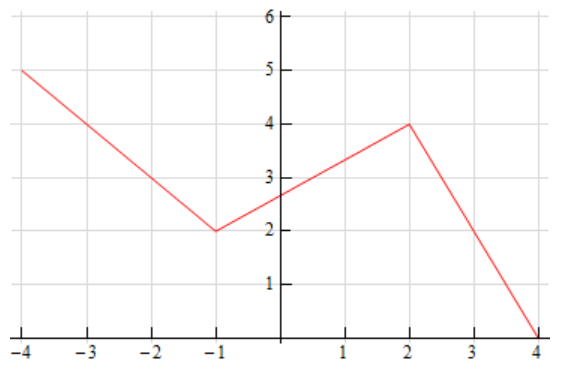

# Section 3.2 : Interpretation Of The Derivative

Before moving on to the section where we learn how to compute derivatives by
avoiding the limits we were evaluating in the previous section we need to take a
quick look at some of the interpretations of the derivative. All of these
interpretations arise from recalling how our definition of the derivative came
about. The definition came about by noticing that all the problems that we
worked in the first
[section](https://tutorial.math.lamar.edu/Classes/CalcI/Tangents_Rates.aspx) in
the Limits chapter required us to evaluate the same limit.

**Rate of Change**

The first interpretation of a derivative is rate of change. This was not the
first problem that we looked at in the Limits chapter, but it is the most
important interpretation of the derivative. If $f(x)$ represents a quantity at
any $x$ then the derivative $f'(a)$ represents the instantaneous rate of change
of $f(x)$ at $x = a$.

---

**Example 1** Suppose that the amount of water in a holding tank at $t$ minutes
is given by $V(t) = 2t^2 - 16t + 35$. Determine each of the following.

**(a)** Is the volume of water in the tank increasing or decreasing at $t = 1$
minute?

**(b)** Is the volume of water in the tank increasing or decreasing at $t = 5$
minutes?

**\(c\)** Is the volume of water in the tank changing faster at $t = 1$ or
$t = 5$ minutes?

**(d)** Is the volume of water in the tank ever not changing? If so, when?

**Solution**

In the solution to this example we will use both notations for the derivative
just to get you familiar with the different notations.

We are going to need the rate of change of the volume to answer these questions.
This means that we will need the derivative of this function since that will
give us a formula for the rate of change at any time $t$. Now, notice that the
function giving the volume of water in the tank is the same function that we saw
in Example 1 in the last
[section](https://tutorial.math.lamar.edu/Classes/CalcI/DefnOfDerivative.aspx#Deriv_Defn_Ex1)
except the letters have changed. The change in letters between the function in
this example versus the function in the example from the last section won’t
affect the work and so we can just use the answer from that example with an
appropriate change in letters.

The derivative is.

$$ V'(t) = 4t - 16 \quad \text{ OR } \quad \frac{dV}{dt} = 4t - 16 $$

Recall from our work in the first limits section that we determined that if the
rate of change was positive then the quantity was increasing and if the rate of
change was negative then the quantity was decreasing.

We can now work the problem.

**(a)** Is the volume of water in the tank increasing or decreasing at $t = 1$
minute?

In this case all that we need is the rate of change of the volume at $t = 1$ or,

$$ V'(1) = -12 \quad \text{ OR } \quad \left. {\frac{dV}{dt}}\right|_{t = 1} = -12 $$

So, at $t = 1$ the rate of change is negative and so the volume must be
decreasing at this time.

**(b)** Is the volume of water in the tank increasing or decreasing at $t = 5$
minutes?

Again, we will need the rate of change at $t = 5$.

$$ V'(5) = 4 \quad \text{ OR } \quad \left. {\frac{dV}{dt}}\right|_{t = 5} = 4 $$

In this case the rate of change is positive and so the volume must be increasing
at $t = 5$.

**\(c\)** Is the volume of water in the tank changing faster at $t = 1$ or
$t = 5$ minutes?

To answer this question all that we look at is the size of the rate of change
and we don’t worry about the sign of the rate of change. All that we need to
know here is that the larger the number the faster the rate of change. So, in
this case the volume is changing faster at $t = 1$ than at $t = 5$.

**(d)** Is the volume of water in the tank ever not changing? If so, when?

The volume will not be changing if it has a rate of change of zero. In order to
have a rate of change of zero this means that the derivative must be zero. So,
to answer this question we will then need to solve

$$ V'(t) = 0 \quad \text{ OR } \quad \frac{dV}{dt} = 0 $$

This is easy enough to do.

$$ 4t - 16 = 0 \quad \Rightarrow \quad t = 4 $$

So at $t = 4$ the volume isn’t changing. Note that all this is saying is that
for a brief instant the volume isn’t changing. It doesn’t say that at this point
the volume will quit changing permanently.

If we go back to our answers from parts (a) and (b) we can get an idea about
what is going on. At $t = 1$ the volume is decreasing and at $t = 5$ the volume
is increasing. So, at some point in time the volume needs to switch from
decreasing to increasing. That time is $t = 4$.

This is the time in which the volume goes from decreasing to increasing and so
for the briefest instant in time the volume will quit changing as it changes
from decreasing to increasing.

---

Note that one of the more common mistakes that students make in these kinds of
problems is to try and determine increasing/decreasing from the function values
rather than the derivatives. In this case if we took the function values at
$t = 0$, $t = 1$, $t = 5$ we would get,

$$ V(0) = 35 \quad V(1) = 21 \quad V(5) = 5 $$

Clearly as we go from $t = 0$ to $t = 1$ the volume has decreased. This might
lead us to decide that AT $t = 1$ the volume is decreasing. However, we just
can’t say that. All we can say is that between $t = 0$ and $t = 1$ the volume
has decreased at some point in time. The only way to know what is happening
right at $t = 1$ is to compute $V'(1)$ and look at its sign to determine
increasing/decreasing. In this case $V'(1)$ is negative and so the volume really
is decreasing at $t = 1$.

Now, if we’d plugged into the function rather than the derivative we would have
gotten the correct answer for $t = 1$ even though our reasoning would have been
wrong. It’s important to not let this give you the idea that this will always be
the case. It just happened to work out in the case of $t = 1$.

To see that this won’t always work let’s now look at $t = 5$. If we plug $t = 1$
and $t = 5$ into the volume we can see that again as we go from $t = 1$ to
$t = 5$ the volume has decreased. Again, however all this says is that the
volume HAS decreased somewhere between $t = 1$ and $t = 5$. It does NOT say that
the volume is decreasing at $t = 5$. The only way to know what is going on right
at $t = 5$ is to compute $V'(5)$ and in this case $V'(5)$ is positive and so the
volume is actually increasing at $t = 5$.

So, be careful. When asked to determine if a function is increasing or
decreasing at a point make sure and look at the derivative. It is the only sure
way to get the correct answer. We are not looking to determine is the function
has increased/decreased by the time we reach a particular point. We are looking
to determine if the function is increasing/decreasing at that point in question.

**Slope of Tangent Line**

This is the next major interpretation of the derivative. The slope of the
tangent line to $f(x)$ at $x = a$ is $f'(a)$. The tangent line then is given by,

$$ y = f(a) + f'(a)(x - a) $$

---

**Example 2** Find the tangent line to the following function at $z = 3$.

$$ R(z) = \sqrt{5z - 8} $$

**Solution**

We first need the derivative of the function and we found that in Example 3 in
the last
[section](https://tutorial.math.lamar.edu/Classes/CalcI/DefnOfDerivative.aspx#Deriv_Defn_Ex3).
The derivative is,

$$ R'(z) = \frac{5}{2\sqrt{5z - 8}} $$

Now all that we need is the function value and derivative (for the slope) at
$z = 3$.

$$ R(3) = \sqrt{7} \quad m = R'(3) = \frac{5}{2\sqrt{7}} $$

The tangent line is then,

$$ y = \sqrt{7} = \frac{5}{2\sqrt{7}}(z - 3) $$

---

**Velocity**

Recall that this can be thought of as a special case of the rate of change
interpretation. If the position of an object is given by $f(t)$ after $t$ units
of time the velocity of the object at $t = a$ is given by $f'(a)$.

---

**Example 3** Suppose that the position of an object after $t$ hours is given
by,

$$ g(t) = \frac{t}{t + 1} $$

Answer both of the following about this object.

**(a)** Is the object moving to the right or the left at $t = 10$ hours?

**(b)** Does the object ever stop moving?

**Solution**

Once again, we need the derivative and we found that in Example 2 in the last
[section](https://tutorial.math.lamar.edu/Classes/CalcI/DefnOfDerivative.aspx#Deriv_Defn_Ex2).
The derivative is,

$$ g'(t) = \frac{1}{(t + 1)^2} $$

**(a)** Is the object moving to the right or the left at $t = 10$ hours?

To determine if the object is moving to the right (velocity is positive) or left
(velocity is negative) we need the derivative at $t = 10$.

$$ g'(10) = \frac{1}{121} $$

So, the velocity at $t = 10$ is positive and so the object is moving to the
right at $t = 10$.

**(b)** Does the object ever stop moving?

The object will stop moving if the velocity is ever zero. However, note that the
only way a rational expression will ever be zero is if the numerator is zero.
Since the numerator of the derivative (and hence the speed) is a constant it
can’t be zero.

Therefore, the object will never stop moving.

In fact, we can say a little more here. The object will always be moving to the
right since the velocity is always positive.

---

We’ve seen three major interpretations of the derivative here. You will need to
remember these, especially the rate of change, as they will show up continually
throughout this course.

Before we leave this section let’s work one more example that encompasses some
of the ideas discussed here and is just a nice example to work.

---

**Example 4** Below is the sketch of a function $f(x)$. Sketch the graph of the
derivative of this function, $f'(x)$

At first glance this seems to an all but impossible task. However, if you have
some basic knowledge of the interpretations of the derivative you can get a
sketch of the derivative. It will not be a perfect sketch for the most part, but
you should be able to get most of the basic features of the derivative in the
sketch.

Let’s start off with the following sketch of the function with a couple of
additions.

Notice that at $x = -3$, $x = -1$, $x = 2$ and $x = 4$ the tangent line to the
function is horizontal. This means that the slope of the tangent line must be
zero. Now, we know that the slope of the tangent line at a particular point is
also the value of the derivative of the function at that point. Therefore, we
now know that,

$$ f'(-3) = 0 \quad f'(-1) = 0 \quad f'(2) = 0 \quad f'(4) = 0 $$

This is a good starting point for us. It gives us a few points on the graph of
the derivative. It also breaks the domain of the function up into regions where
the function is increasing and decreasing. We know, from our discussions above,
that if the function is increasing at a point then the derivative must be
positive at that point. Likewise, we know that if the function is decreasing at
a point then the derivative must be negative at that point.

We can now give the following information about the derivative.

$$ x < -3 \quad \quad f'(x) < 0 $$

$$ -3 < x < -1 \quad \quad f'(x) > 0 $$

$$ -1 < x < 2 \quad \quad f'(x) < 0 $$

$$ 2 < x < 4 \quad \quad f'(x) < 0 $$

$$ x > 4 \quad \quad f'(x) > 0 $$

Remember that we are giving the signs of the derivatives here and these are
solely a function of whether the function is increasing or decreasing. The sign
of the function itself is completely immaterial here and will not in any way
effect the sign of the derivative.

This may still seem like we don’t have enough information to get a sketch, but
we can get a little bit more information about the derivative from the graph of
the function. In the range $x < -3$ we know that the derivative must be
negative, however we can also see that the derivative needs to be increasing in
this range. It is negative here until we reach $x = -3$ and at this point the
derivative must be zero. The only way for the derivative to be negative to the
left of $x = -3$ and zero at $x = -3$ is for the derivative to increase as we
increase $x$ towards $x = -3$.

Now, in the range $-3 < x < -1$ we know that the derivative must be zero at the
endpoints and positive in between the two endpoints. Directly to the right of
$x = -3$ the derivative must also be increasing (because it starts at zero and
then goes positive – therefore it must be increasing). So, the derivative in
this range must start out increasing and must eventually get back to zero at
$x = -1$. So, at some point in this interval the derivative must start
decreasing before it reaches $x = -1$. Now, we have to be careful here because
this is just general behavior here at the two endpoints. We won’t know where the
derivative goes from increasing to decreasing and it may well change between
increasing and decreasing several times before we reach $x = -1$. All we can
really say is that immediately to the right of $x = -3$ the derivative will be
increasing and immediately to the left of $x = -1$ the derivative will be
decreasing.

Next, for the ranges $-1 < x < 2$ and $2 < x < 4$ we know the derivative will be
zero at the endpoints and negative in between. Also, following the type of
reasoning given above we can see in each of these ranges that the derivative
will be decreasing just to the right of the left-hand endpoint and increasing
just to the left of the right hand endpoint.

Finally, in the last region $x > 4$ we know that the derivative is zero at
$x = 4$ and positive to the right of $x = 4$. Once again, following the
reasoning above, the derivative must also be increasing in this range.

Putting all of this material together (and always taking the simplest choices
for increasing and/or decreasing information) gives us the following sketch for
the derivative.

Note that this was done with the actual derivative and so is in fact accurate.
Any sketch you do will probably not look quite the same. The “humps” in each of
the regions may be at different places and/or different heights for example.
Also, note that we left off the vertical scale because given the information
that we’ve got at this point there was no real way to know this information.

That doesn’t mean however that we can’t get some ideas of specific points on the
derivative other than where we know the derivative to be zero. To see this let’s
check out the following graph of the function (not the derivative, but the
function).

At $x = -2$ and $x = 3$ we’ve sketched in a couple of tangent lines. We can use
the basic rise/run slope concept to estimate the value of the derivative at
these points.

Let’s start at $x = 3$. We’ve got two points on the line here. We can see that
each seem to be about one-quarter of the way off the grid line. So, taking that
into account and the fact that we go through one complete grid we can see that
the slope of the tangent line, and hence the derivative, is approximately -1.5.

At $x = -2$ it looks like (with some heavy estimation) that the second point is
about 6.5 grids above the first point and so the slope of the tangent line here,
and hence the derivative, is approximately 6.5.

Here is the sketch of the derivative with the vertical scale included and from
this we can see that in fact our estimates are pretty close to reality.

Note that this idea of estimating values of derivatives can be a tricky process
and does require a fair amount of (possible bad) approximations so while it can
be used, you need to be careful with it.

---

We’ll close out this section by noting that while we’re not going to include an
example here we could also use the graph of the derivative to give us a sketch
of the function itself. In fact, in the next chapter where we discuss some
applications of the derivative we will be looking using information the
derivative gives us to sketch the graph of a function.

---

## Practice Problems

For problems 1 and 2 use the graph of the function, $f(x)$, estimate the value
of $f'(a)$ for the given values of $a$.

**1.**

**(a)** $a = -2$

**(b)** $a = 3$

**(a)** $a = -2$

**Solution**

**(b)** $a = 3$

**Solution**

**2.**

**(a)** $a = 1$

**(b)** $a = 4$

**(a)** $a = 1$

**Solution**

**(b)** $a = 4$

**Solution**

For problems 3 and 4 sketch the graph of a function that satisfies the given
conditions.

**3.** $f(1) = 3$, $f'(1) = 1$, $f(4) = 5$, $f'(4) = -2$

**Solution**

**4.** $f(-3) = 5$, $f'(-3) = -2$, $f(1) = 2$, $f'(1) = 0$, $f(4) = -2$,
$f'(4) = -3$

For problems 5 and 6 the graph of a function, $f(x)$, is given. Use this to
sketch the graph of the derivative, $f'(x)$.

**5.**

**Solution**

**6.**

**Solution**

**7.** Answer the following questions about the function $W(z) = 4z^2 - 9z$.

**(a)** Is the function increasing or decreasing at $z = -1$ ?

**Solution**

**(b)** Is the function increasing or decreasing at $z = 2$ ?

**Solution**

**\(c\)** Does the function ever stop changing? If yes, at what value(s) of $z$
does the function stop changing?

**Solution**

**8.** What is the equation of the tangent line to $f(x) = 3 - 14x$ at $x = 8$.

**Solution**

**9.** The position of an object at any time $t$ is given by
$s(t) = \dfrac{t + 1}{t + 4}$.

**(a)** Determine the velocity of the object at any time $t$.

**Solution**

**(b)** Does the object ever top moving? If yes, at what time(s) does the object
stop moving?

**Solution**

**10.** What is the equation of the tangent line to $f(x) = \dfrac{5}{x}$ at
$x = \dfrac{1}{2}$ ?

**Solution**

**11.** Determine where, if anywhere, the function $g(x) = x^3 - 2x^2 + x - 1$
stops changing.

**Solution**

**12.** Determine if the function $Z(t) = \sqrt{3t - 4}$ is increasing or
decreasing at the given points.

**(a)** $t = 5$

**Solution**

**(b)** $t = 10$

**Solution**

**\(c\)** $t = 300$

**Solution**

**13.** Suppose that the volume of water in a tank for $0 \leq t \leq 6$ is
given by $Q(t) = 10 + 5t - t^2$.

**(a)** Is the volume of water increasing or decreasing at $t = 0$ ?

**Solution**

**(b)** Is the volume of water increasing or decreasing at $t = 6$ ?

**Solution**

**\(c\)** Does the volume of water ever stop changing? If yes, at what time(s)
does the volume stop changing?

**Solution**

---

## Assignment Problems

For problems 1 - 3 use the graph of the function, $f(x)$, estimate the value of
$f'(a)$ for the given avlues of $a$.

**1.**

**(a)** $a = -5$

**Solution**

**(b)** $a = 1$

**Solution**

**2.**

**(a)** $a = -2$

**Solution**

**(b)** $a = 3$

**Solution**

**3.**

**(a)** $a = -3$

**Solution**

**(b)** $a = 4$

**Solution**

For problems 4 – 6 sketch the graph of a function that satisfies the given
conditions.

**4.** $f(-7) = 5$, $f'(-7) = -3$, $f(4) = -1$, $f'(4) = 1$

**Solution**

**5.** $f(1) = 2$, $f'(1) = 4$, $f(6) = 2$, $f'(6) = 3$

**Solution**

**6.** $f(-1) = -9$, $f'(-1) = 0$, $f(2) = -1$, $f'(2) = 3$, $f(5) = 4$
$f'(5) = -1$

**Solution**

For problems 7 - 9 the graph of a function, $f(x)$, is given. Use this to sketch
the graph of the derivative, $f'(x)$.

**7.**

**Solution**

**8.**

**Solution**

**9.**

**Solution**

**10.** Answer the following questions about the function
$g(z) = 1 + 10z - 7z^2$.

**(a)** Is the function increasing or decreasing at $z = 0$ ?

**Solution**

**(b)** Is the function increasing or decreasing at $z = 2$ ?

**Solution**

**\(c\)** Does the function ever stop changing? If yes, at what value(s) of $z$
does the function stop changing?

**Solution**

**11.** What is the equation of the tangent line to $f(x) = 5x - x^3$ at
$x = 1$.

**Solution**

**12.** The position of an object at any time $t$ is given by
$s(t) = 2t^2 - 8t + 10$.

**(a)** Determine the velocity of the object at any time $t$.

**Solution**

**(b)** Is the object moving to the right or left at $t = 1$ ?

**Solution**

**\(c\)** Is the object moving to the right or left at $t = 4$ ?

**Solution**

**(d)** Does the object ever stop moving? If so, at what time(s) does the object
stop moving?

**Solution**

**13.** Does the function $R(w) = w^2 - 8w + 20$ ever stop changing? If yes, at
what value(s) of $w$ does the function stop changing?

**Solution**

**14.** Suppose that the volume 9f air in a balloon for $0 \leq t \leq 6$ is
given by $V(t) = 6t - t^2$.

**(a)** Is the volume of air increasing or decreasing at $t = 2$ ?

**Solution**

**(b)** Is the volume of air increasing or decreasing at $t = 5$ ?

**Solution**

**\(c\)** Does the volume of air ever stop changing? If yes, at what time(s)
does the volume stop changing?

**Solution**

**15.** What is the equation of the tangent line to $f(x) = 5x + 7$ at $x = -4$
?

**Solution**

**16.** Answer the following questions about the function
$Z(x) = 2x^3 - x^2 - x$.

**(a)** Is the function increasing or decreasing at $x = -1$ ?

**Solution**

**(b)** Is the function increasing or decreasing at $x = 2$ ?

**Solution**

**\(c\)** Does the function ever stop changing? If yes, at what value(s) of $x$
does the function stop changing?

**Solution**

**17.** Determine of the function $V(t) = \sqrt{14 + 3t}$ is increasing or
decreasing at the given points.

**(a)** $t = 0$

**Solution**

**(b)** $t = 5$

**Solution**

**\(c\)** $t = 100$

**Solution**

**18.** Suppose that the volume of 2ater in a tank for $t \geq 0$ is given by
$Q(t) = \dfrac{t^2}{t + 2}$.

**(a)** Is the volume of water increasing or decreasing at $t = 0$ ?

**Solution**

**(b)** Is the volume of water increasing or decreasing at $t = 3$ ?

**Solution**

**\(c\)** Does the volume of water ever stop changing? If so, at what time(s)
does the volume stop changing?

**Solution**

**19.** What is the equation of the tangent line to $g(x) = 10$ at $x = 16$ ?

**Solution**

**20.** The position of an object at any time $t$ is given by
$Q(t) = \sqrt{1 + 4t}$.

**(a)** Determine the velocity of the object at any time $t$.

**Solution**

**(b)** Does the obejct ever stop moving? If so, at what time(s) does the object
stop moving?

**Solution**

**21.** Does the function $Y(t) = 2t^3 + 9t + 5$ ever stop changing? If yes, at
what value(s) of $t$ does the function stop changing?

**Solution**
