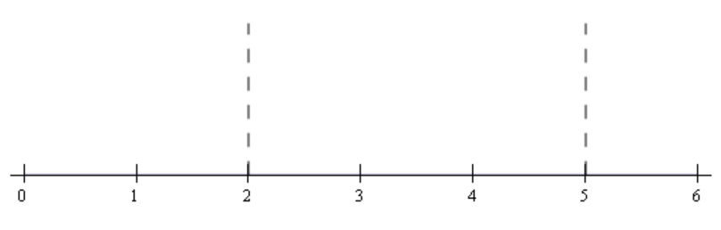
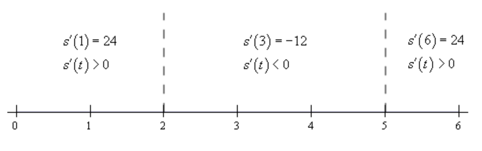

# Section 3.3 : Differentiation Formulas

In the first section of this chapter we saw the
[**definition of the derivative**](https://tutorial.math.lamar.edu/Classes/CalcI/DefnOfDerivative.aspx#Defn_Deriv)
and we computed a couple of derivatives using the definition. As we saw in those
examples there was a fair amount of work involved in computing the limits and
the functions that we worked with were not terribly complicated.

For more complex functions using the definition of the derivative would be an
almost impossible task. Luckily for us we won’t have to use the definition
terribly often. We will have to use it on occasion, however we have a large
collection of formulas and properties that we can use to simplify our life
considerably and will allow us to avoid using the definition whenever possible.

We will introduce most of these formulas over the course of the next several
sections. We will start in this section with some of the basic properties and
formulas. We will give the properties and formulas in this section in both
“prime” notation and "fraction" notation.

**Properties**

> 1. $\left(f(x) \pm g(x)\right)' = f'(x) \pm g'(x) \quad \text{ OR } \quad \dfrac{d}{dx}\left(f(x) \pm g(x)\right) = \dfrac{df}{dx} \pm \dfrac{dg}{dx}$
>
> In other words, to differentiate a sum or difference all we need to do is
> differentiate the individual terms and then put them back together with the
> appropriate signs. Note as well that this property is not limited to two
> functions.
>
> See the
> [**Proof of Various Derivative Formulas**](https://tutorial.math.lamar.edu/Classes/CalcI/DerivativeProofs.aspx#Extras_DerPf_Sum)
> section of the Extras chapter to see the proof of this property. It’s a very
> simple proof using the definition of the derivative.
>
> 2. $\left(cf(x)\right)' = cf'(x) \quad \text{ OR } \quad \dfrac{d}{dx}\left(cf(x)\right) = c\dfrac{df}{x}, c \text{ is any number}$
>
> In other words, we can "factor" a multiplicative constant out of a derivative
> if we need to. See the
> [**Proof of Various Derivative Formulas**](https://tutorial.math.lamar.edu/Classes/CalcI/DerivativeProofs.aspx#Extras_DerPf_cf)
> section of the Extras chapter to see the proof of this property.

Note that we have not included formulas for the derivative of products or
quotients of two functions here. The derivative of a product or quotient of two
functions is not the product or quotient of the derivatives of the individual
pieces. We will take a look at these in the next section.

Next, let’s take a quick look at a couple of basic "computation" formulas that
will allow us to actually compute some derivatives.

**Formulas**

> 1. If $f(x) = c$ then $f'(x) = 0 \quad \text{ OR } \quad \dfrac{d}{dx}(c) = 0$
>
> The derivative of a constant is zero. See the
> [**Proof of Various Derivative Formulas**](https://tutorial.math.lamar.edu/Classes/CalcI/DerivativeProofs.aspx#Extras_DerPf_c)
> section of the Extras chapter to see the proof of this formula.
>
> 2. If $f(x) = x^n$ then
>    $f'(x) = nx^{n - 1} \quad \text{ OR } \quad \dfrac{d}{dx}\left(x^n\right) = nx^{n - 1}, n \text{ is any number}$.
>
> This formula is sometimes called the **power rule**. All we are doing here is
> bringing the original exponent down in front and multiplying and then
> subtracting one from the original exponent.
>
> Note as well that in order to use this formula $n$ must be a number, it can’t
> be a variable. Also note that the base, the $x$, must be a variable, it can’t
> be a number. It will be tempting in some later sections to misuse the Power
> Rule when we run in some functions where the exponent isn’t a number and/or
> the base isn’t a variable.
>
> See the
> [**Proof of Various Derivative Formulas**](https://tutorial.math.lamar.edu/Classes/CalcI/DerivativeProofs.aspx#Extras_DerPf_c)
> section of the Extras chapter to see the proof of this formula. There are
> actually three different proofs in this section. The first two restrict the
> formula to n being an integer because at this point that is all that we can do
> at this point. The third proof is for the general rule but does suppose that
> you’ve read most of this chapter.

These are the only properties and formulas that we’ll give in this section.
Let’s compute some derivatives using these properties.

---

**Example 1** Differentiate each of the following functions.

**(a)** $f(x) = 15x^{100} - 3x^{12} + 5x - 46$

**Solution**

In this case we have the sum and difference of four terms and so we will
differentiate each of the terms using the first property from above and then put
them back together with the proper sign. Also, for each term with a
multiplicative constant remember that all we need to do is "factor" the constant
out (using the second property) and then do the derivative.

$$ f'(x) = 15(100)x^{99} - 3(12)x^{11} + 5(1)x^0 - 0 $$

$$ \quad = 1500x^{99} - 36x^{11} + 5 $$

Notice that in the third term the exponent was a one and so upon subtracting 1
from the original exponent we get a new exponent of zero. Now recall that
$x^0 = 1$. Don’t forget to do any basic arithmetic that needs to be done such as
any multiplication and/or division in the coefficients.

**(b)** $g(t) = 2t^6 + 7t^{-6}$

**Solution**

The point of this problem is to make sure that you deal with negative exponents
correctly. Here is the derivative.

$$ g'(t) = 2(6)t^5 + 7(-6)t^{-7} $$

$$ \quad = 12t^5 - 42t^{-7} $$

Make sure that you correctly deal with the exponents in these cases, especially
the negative exponents. It is an easy mistake to "go the other way" when
subtracting one off from a negative exponent and get $-6t^{-5}$ instead of the
correct $-6t^{-7}$.

**\(c\)** $y = 8z^3 - \dfrac{1}{3z^5} + z - 23$

**Solution**

Now in this function the second term is not correctly set up for us to use the
power rule. The power rule requires that the term be a variable to a power only
and the term must be in the numerator. So, prior to differentiating we first
need to rewrite the second term into a form that we can deal with.

$$ y = 8z^3 - \frac{1}{3}z^{-5} + z - 23 $$

Note that we left the 3 in the denominator and only moved the variable up to the
numerator. Remember that the only thing that gets an exponent is the term that
is immediately to the left of the exponent. If we’d wanted the three to come up
as well we'd have written,

$$ \frac{1}{(3z)^5} $$

so be careful with this! It’s a very common mistake to bring the 3 up into the
numerator as well at this stage.

Now that we’ve gotten the function rewritten into a proper form that allows us
to use the Power Rule we can differentiate the function. Here is the derivative
for this part.

$$ y' = 24z^2 + \frac{5}{3}z^{-6} + 1 $$

**(d)** $T(x) = \sqrt{x} + 9\sqrt[3]{x^7} - \dfrac{2}{\sqrt[5]{x^2}}$

**Solution**

All of the terms in this function have roots in them. In order to use the power
rule we need to first convert all the roots to fractional exponents. Again,
remember that the Power Rule requires us to have a variable to a number and that
it must be in the numerator of the term. Here is the function written in
"proper" form.

$$ T(x) = x^{\frac{1}{2}} + 9\left(x^7\right)^{\frac{1}{3}} - \frac{2}{\left(x^2\right)^{\frac{1}{5}}} $$

$$ \quad = x^{\frac{1}{2}} + 9x^{\frac{7}{3}} - \frac{2}{x^{\frac{2}{5}}} $$

$$ \quad = x^{\frac{1}{2}} + 9x^{\frac{7}{3}} - 2x^{-\frac{2}{5}} $$

In the last two terms we combined the exponents. You should always do this with
this kind of term. In a later section we will learn of a technique that would
allow us to differentiate this term without combining exponents, however it will
take significantly more work to do. Also, don’t forget to move the term in the
denominator of the third term up to the numerator. We can now differentiate the
function.

$$ T'(x) = \frac{1}{2}x^{-\frac{1}{2}} + 9\left(\frac{7}{3}\right)x^{\frac{4}{3}} - 2\left(-\frac{2}{5}\right)x^{-\frac{7}{5}} $$

$$ \quad = \frac{1}{2}x^{-\frac{1}{2}} + 21x^{\frac{4}{3}} + \frac{4}{5}x^{-\frac{7}{5}} $$

Make sure that you can deal with fractional exponents. You will see a lot of
them in this class.

**(e)** $h(x) = x^{\pi} - x^{\sqrt{2}}$

**Solution**

In all of the previous examples the exponents have been nice integers or
fractions. That is usually what we’ll see in this class. However, the exponent
only needs to be a number so don’t get excited about problems like this one.
They work exactly the same.

$$ h'(x) = \pi x^{\pi - 1} - \sqrt{2}x^{\sqrt{2} - 1} $$

The answer is a little messy and we won’t reduce the exponents down to decimals.
However, this problem is not terribly difficult it just looks that way
initially.

---

There is a general rule about derivatives in this class that you will need to
get into the habit of using. When you see radicals you should always first
convert the radical to a fractional exponent and then simplify exponents as much
as possible. Following this rule will save you a lot of grief in the future.

Back when we first put down the properties we noted that we hadn’t included a
property for products and quotients. That doesn’t mean that we can’t
differentiate any product or quotient at this point. There are some that we can
do.

---

**Example 2** Differentiate each of the following functions.

**(a)** $y = \sqrt[3]{x^2}\left(2x - x^2\right)$

**Solution**

In this function we can't just differentiate the first term, differentiate the
second term and then multiply the two back together. That just won't work. We
will discuss this in detail in the next section so if you’re not sure you
believe that hold on for a bit and we'll be looking at that soon as well as
showing you an example of why it won't work.

It is still possible to do this derivative however. All that we need to do is
convert the radical to fractional exponents (as we should anyway) and then
multiply this through the parenthesis.

$$ y = x^{\frac{2}{3}}\left(2x - x^2\right) = 2x^{\frac{5}{3}} - x^{\frac{8}{3}} $$

Now we can differentiate the function.

$$ y' = \frac{10}{3}x^{\frac{2}{3}} - \frac{8}{3}x^{\frac{5}{3}} $$

**(b)** $h(t) = \dfrac{2t^5 + t^2 - 5}{t^2}$

**Solution**

As with the first part we can't just differentiate the numerator and the
denominator and the put it back together as a fraction. Again, if you're not
sure you believe this hold on until the next section and we’ll take a more
detailed look at this.

We can simplify this rational expression however as follows.

$$ h(t) = \frac{2t^5}{t^2} + \frac{t^2}{t^2} - \frac{5}{t^2} = 2t^3 + 1 - 5t^{-2} $$

This is a function that we can differentiate.

$$ h'(t) = 6t^2 + 10t^{-3} $$

---

So, as we saw in this example there are a few products and quotients that we can
differentiate. If we can first do some simplification the functions will
sometimes simplify into a form that can be differentiated using the properties
and formulas in this section.

Before moving on to the next section let’s work a couple of examples to remind
us once again of some of the interpretations of the derivative.

---

**Example 3** If $f(x) = 2x^3 + \dfrac{300}{x^3} + 4$ increasing, deacreasing or
not changing at $x = -2$?

**Solution**

We know that the rate of change of a function is given by the functions
derivative so all we need to do is it rewrite the function (to deal with the
second term) and then take the derivative.

$$ f(x) = 2x^3 + 300x^{-3} + 4 \quad \Rightarrow \quad f'(x) = 6x^2 - 900x^{-4} = 6x^2 - \frac{900}{x^4} $$

Note that we rewrote the last term in the derivative back as a fraction. This is
not something we've done to this point and is only being done here to help with
the evaluation in the next step. It's often easier to do the evaluation with
positive exponents.

So, upon evaluating the derivative we get

$$ f'(-2) = 6(4) - \frac{900}{16} = -\frac{129}{4} = -32.25 $$

So, at $x = -2$ the derivative is negative and so the function is decreasing at
$x = -2$.

---

**Example 4** Find the equation of the tangent line to $f(x) = 4x - 8\sqrt{x}$
at $x = 16$.

**Solution**

We know that the equation of a tangent line is given by,

$$ y = f(a) + f'(a)(x - a) $$

So, we will need the derivative of the function (don’t forget to get rid of the
radical).

$$ f(x) = 4x - 8x^{\frac{1}{2}} \quad \Rightarrow \quad f'(x) = 4 - 4x^{-\frac{1}{2}} = 4 - \frac{4}{x^{\frac{1}{2}}} $$

Again, notice that we eliminated the negative exponent in the derivative solely
for the sake of the evaluation. All we need to do then is evaluate the function
and the derivative at the point in question, $x = 16$.

$$ f(16) = 64 - 8(4) = 32 \quad f'(16) = 4 - \frac{4}{3} = 3 $$

The tangent line is then,

$$ y = 32 + 3(x - 16) = 3x - 16 $$

---

**Example 5** The position of an object at any time $t$ (in hours) is given by,

$$ s(t) = 2t^3 - 21t^2 + 60t - 10 $$

Determine when the object is moving to the right and when the object is moving
to the left.

**Solution**

he only way that we'll know for sure which direction the object is moving is to
have the velocity in hand. Recall that if the velocity is positive the object is
moving off to the right and if the velocity is negative then the object is
moving to the left.

We need the derivative in order to get the velocity of the object. The
derivative, and hence the velocity, is,

$$ s'(t) = 6t^2 - 42t + 60 = 6\left(t^2 - 7t + 10\right) = 6(t - 2)(t - 5) $$

Now, we need to determine where the derivative is positive and where the
derivative is negative. There are several ways to do this. The method that we
tend to prefer is the following.

Since polynomials are continuous we know from the
[**Intermediate Value Theorem**](https://tutorial.math.lamar.edu/Classes/CalcI/Continuity.aspx#IVT)
that if the polynomial ever changes sign then it must have first gone through
zero. So, if we knew where the derivative was zero we would know the only points
where the derivative _might_ change sign.

We can see from the factored form of the derivative that the derivative will be
zero at $t = 2$ and $t = 5$. Let’s graph these points on a number line.

Now, we can see that these two points divide the number line into three distinct
regions. In each of these regions we **know** that the derivative will be the
same sign. Recall the derivative can only change sign at the two points that are
used to divide the number line up into the regions.

Therefore, all that we need to do is to check the derivative at a test point in
each region and the derivative in that region will have the same sign as the
test point. Here is the number line with the test points and results shown.

Here are the intervals in which the derivative is positive and negative.

$$ \text{positive: } \quad -\infty < t < 2 \quad \& \quad 5 < t < \infty $$

$$ \text{negative: } \quad 2 < t < 5 $$

We included negative $t$'s here because we could even though they may not make
much sense for this problem. Once we know this we also can answer the question.
The object is moving to the right and left in the following intervals.

$$ \text{moving to the right : } \quad -\infty < t < 2 \quad \& \quad 5 < t < \infty $$

$$ \text{moving to the left : } \quad 2 < t < 5 $$

---

Make sure that you can do the kind of work that we just did in this example. You
will be asked numerous times over the course of the next two chapters to
determine where functions are positive and/or negative. If you need some review
or want to practice these kinds of problems you should check out the
[**Solving Inequalities**](https://tutorial.math.lamar.edu/Extras/AlgebraTrigReview/SolveIneq.aspx)
section of the
[**Algebra/Trig Review**](https://tutorial.math.lamar.edu/Extras/AlgebraTrigReview/AlgebraTrig.aspx).

---

## Practice Problems

For problems 1 – 12 find the derivative of the given function.

**1.** $f(x) = 6x^3 - 9x + 4$

**Solution**

$$ f'(x) = 3(6)x^{3 - 1} - 9(1)x^{1 - 1} + 0 $$

$$ \boxed{f'(x) = 18x^2 - 9} $$

**2.** $y = 2t^4 - 10t^2 + 13t$

**Solution**

$$ y' = 2(4)t^{4 - 1} - 10(2)t^{2 - 1} + 13(1)t^{1 - 1} $$

$$ \boxed{y' = 8t^3 - 20t + 13} $$

**3.** $g(z) = 4z^7 - 3z^{-7} + 9z$

**Solution**

$$ g'(z) = (4)(7)z^{7 - 1} - (3)(-7)z^{-7 -1} + (9)(1)z^{1 - 1} $$

$$ \boxed{g'(z) = 28z^6 + 21z^{-8} + 9} $$

**4.** $h(y) = y^{-4} - 9y^{-3} + 8y^{-2} + 12$

**Solution**

$$ h'(y) = (-4)(1)y^{-4 - 1} - (9)(-3)y^{-3 - 1} + (8)(-2)y^{-2 - 1} + 0 $$

$$ \boxed{h'(y) = -4y^{-5} + 27y^{-4} - 16y^{-3}} $$

**5.** $y = \sqrt{x} + 8\sqrt[3]{x} - 2\sqrt[4]{x}$

**Solution**

Rewrite in "proper" form first:

$$ y = \sqrt{x} + 8\sqrt[3]{x} - 2\sqrt[4]{x} $$

$$ y = x^{\frac{1}{2}} + 8x^{\frac{1}{3}} - 2x^{\frac{1}{4}}$$

Now find the derivative via differentiation:

$$ y' = (1)\left(\frac{1}{2}\right)x^{\frac{1}{2} - 1} + (8)\left(\frac{1}{3}\right)x^{\frac{1}{3} - 1} - (2)\left(\frac{1}{4}\right)x^{\frac{1}{4} - 1} $$

$$ \boxed{y' = \frac{1}{2}x^{-\frac{1}{2}} + \frac{8}{3}x^{-\frac{2}{3}} - \frac{1}{2}x^{-\frac{3}{4}}} $$

**6.** $f(x) = 10\sqrt[5]{x^3} - \sqrt{x^7} + 6\sqrt[3]{x^8} - 3$

**Solution**

Rewrite in "proper" form first:

$$ f(x) = 10x^{\frac{3}{5}}- x^{\frac{7}{2}} + 6x^{\frac{8}{3}} - 3 $$

Now find the derivative via differentiation:

$$ f'(x) = (10)\left(\frac{3}{5}\right)x^{\frac{3}{5} - 1} - (1)\left(\frac{7}{2}\right)x^{\frac{7}{2} - 1} + (6)\left(\frac{8}{3}\right)x^{\frac{8}{3} - 1} $$

$$ f'(x) = \frac{30}{5}x^{-\frac{2}{5}} - \frac{7}{2}x^{\frac{5}{2}} + \frac{48}{3}x^{\frac{5}{3}} $$

$$ \boxed{f'(x) = 6x^{-\frac{2}{5}} - \frac{7}{2}x^{\frac{5}{2}} + 16x^{\frac{5}{3}}} $$

**7.** $f(t) = \dfrac{4}{t} - \dfrac{1}{6t^3} + \dfrac{8}{t^5}$

**Solution**

Rewrite in "proper" form first:

$$ f(t) = \dfrac{4}{t} - \dfrac{1}{6t^3} + \dfrac{8}{t^5} $$

$$ f(t) = 4t^{-1} - \frac{1}{6}t^{-3} + 8t^{-5} $$

Now find the derivative via differentiation:

$$ f'(t) = (4)(-1)t^{-1 - 1} - \left(\frac{1}{6}\right)(-3)t^{-3 - 1} + (8)(-5)t^{-5 - 1} $$

$$ \boxed{f'(t) = -4t^{-2} + \frac{1}{2}t^{-4} - 40t^{-6}} $$

**8.** $R(z) = \dfrac{6}{\sqrt{z^3}} + \dfrac{1}{8z^4} - \dfrac{1}{3z^{10}}$

**Solution**

Rewrite in "proper" form first:

$$ R(z) = \dfrac{6}{\sqrt{z^3}} + \dfrac{1}{8z^4} - \dfrac{1}{3z^{10}} $$

$$ R(z) = 6z^{-\frac{3}{2}} + \frac{1}{8}z^{-4} - \frac{1}{3}z^{-10} $$

Now find the derivative via differentiation:

$$ R'(z) = (6)\left(-\frac{3}{2}\right)z^{-\frac{3}{2} - 1} + \left(\frac{1}{8}\right)(-4)z^{-4 - 1} - \left(\frac{1}{3}\right)(-10)z^{-10 - 1} $$

$$ \boxed{R'(z) = -9z^{-\frac{5}{2}} - \frac{1}{2}z^{-5} + \frac{10}{3}z^{-11}} $$

**9.** $z = x\left(3x^2 - 9\right)$

**Solution**

Rewrite in "proper" form first:

$$ z = x\left(3x^2 - 9\right) $$

$$ z = x^1\left(3x^2 - 9\right) $$

$$ z = 3x^3 - 9x $$

Now find the derivative via differentiation:

$$ \frac{dz}{dx} = (3)(3)x^{3 - 1} - (9)(1)x^{1 - 1} $$

$$ \boxed{\frac{dz}{dx} = 9x^2 - 9} $$

**10.** $g(y) = (y - 4)\left(2y + y^2\right)$

**Solution**

Rewrite in "proper" form first:

$$ g(y) = (y - 4)\left(2y + y^2\right) $$

$$ g(y) = 2y^2 - 8y + y^3 - 4y^2 $$

$$ g(y) = y^3 - 2y^2 - 8y $$

Now find the derivative via differentiation:

$$ g'(y) = (1)(3)y^{3 - 1} - (2)(2)y^{2 - 1} - (8)(1)y^{1 - 1} $$

$$ \boxed{g'(y) = 3y^2 - 4y - 8} $$

**11.** $h(x) = \dfrac{4x^3 - 7x + 8}{x}$

**Solution**

Rewrite in "proper" form first:

$$ h(x) = \dfrac{4x^3 - 7x + 8}{x} $$

$$ h(x) = \frac{4x^3}{x} - \frac{7x}{x} + \frac{8}{x} $$

$$ h(x) = 4x^2 - 7 + 8x^{-1} $$

Now find the derivative via differentiation:

$$ h'(x) = (4)(2)x^{2 - 1} - 0 + (8)(-1)x^{-1 - 1} $$

$$ \boxed{h'(x) = 8x - 8x^{-2}} $$

**12.** $f(y) = \dfrac{y^5 - 5y^3 + 2y}{y^3}$

**Solution**

Rewrite in "proper" form first:

$$ f(y) = \dfrac{y^5 - 5y^3 + 2y}{y^3} $$

$$ f(y) = \frac{y^5}{y^3} - \frac{5y^3}{y^3} + \frac{2y}{y^3} $$

$$ f(y) = y^2 - 5 + 2y^{-2} $$

Now find the derivative via differentiation:

$$ f'(y) = (1)(2)y^{2 - 1} - 0 + (2)(-2)y^{-2 - 1} $$

$$ \boxed{f'(y) = 2y - 4y^{-3}} $$

**13.** Determine where, if anywhere, the function $f(x) = x^3 + 9x^2 - 48x + 2$
is not changing.

**Solution**

We know that to find the rate of change for any function, we have to first find
it's derivative. Anywhere this derivative is equal to $0$ is where the function
from which it is derived is not changing.

$$ f'(x) = (1)(3)x^{3 - 1} + (9)(2)x^{2 - 1} - (48)(1)x^{1 - 1} + 0 $$

$$ f'(x) = 3x^2 + 18x - 48 $$

Now we use standard quadratics/factoring to solve for $f'(x) = 0$:

$$ 3x^2 + 18x - 48 = 0 $$

$$ (3x - 6)(x + 8) = 0 $$

$$ 3x - 6 = 0 $$

$$ 3x = 6 $$

$$ x = 2 $$

$$ x + 8 = 0 $$

$$ x = -8 $$

Thusly we can say that the function $f(x)$ is not changaing at $x = 2$ and
$x = -8$.

**14.** Determine where, if anywhere, the function $y = 2z^4 - z^3 - 3z^2$ is
not changing.

**Solution**

$$ \frac{dy}{dx} = (2)(4)z^{4 - 1} - (1)(3)z^{3 - 1} - (3)(2)z^{2 - 1} $$

$$ \frac{dy}{dx} = 8z^3 - 3z^2 - 6z $$

$$ \frac{dy}{dx} = z(8z^2 - 3z - 6)$$

$$ z = 0 $$

$$ z = \frac{-(-3) \pm \sqrt{(-3)^2 - 4(8)(-6)}}{2(8)} $$

$$ z = \frac{3 \pm \sqrt{201}}{16} $$

Thusly the function $y$ is not changing at $z = 0$ and also at the two points,
$z = \dfrac{3 \pm \sqrt{201}}{16}$.

**15.** Find the tangent line to $g(x) = \dfrac{16}{x} - 4\sqrt{x}$ at $x = 4$.

**Solution**

Recall that the tangent line can be found by the following formula:

$$ y = f(a) + f'(a)(x - a) $$

So we'll need to find $g'(x)$ first. Let's start by rewriting $g(x)$ in "proper"
form:

$$ g(x) = \dfrac{16}{x} - 4\sqrt{x} $$

$$ g(x) = 16x^{-1} - 4x^{\frac{1}{2}} $$

Now we can find $g'(x)$ via differentiation:

$$ g'(x) = (16)(-1)x^{-1 - 1} - (4)\left(\frac{1}{2}\right)x^{\frac{1}{2} - 1} $$

$$ g'(x) = -16x^{-2} - 2x^{-\frac{1}{2}} $$

Now we plug in our value of $x = 4$ to both $g(x)$ and $g'(x)$:

$$ g(4) = \frac{16}{4} - 4\sqrt{4} $$

$$ g(4) = 4 - 4(2) $$

$$ g(4) = 4 - 8 $$

$$ g(4) = -4 $$

$$ g'(4) = -16(4)^{-2} - 2(4)^{-\frac{1}{2}} $$

$$ g'(4) = -1 - 1 $$

$$ g'(4) = -2 $$

Now we use the tangent line formula:

$$ y = (-4) + (-2)(x - 4) $$

$$ y = -4 - 2(x - 4) $$

$$ y = -4 - 2x + 8 $$

$$ \boxed{y = 4 - 2x} $$

**16.** Find the tangent line to $f(x) = 7x^4 + 8x^{-6} + 2x$ at $x = -1$.

**Solution**

$$ f'(x) = (7)(4)x^{4 - 1} + (8)(-6)x^{-6 - 1} + (2)(1)x^{1 - 1} $$

$$ f'(x) = 28x^3 - 48x^{-7} + 2 $$

$$ f(-1) = 7(-1)^4 + 8(-1)^{-6} + 2(-1) $$

$$ f(-1) = 7(1) + 8(1) - 2 $$

$$ f(-1) = 13 $$

$$ f'(-1) = 28(-1)^3 - 48(-1)^{-7} + 2 $$

$$ f'(-1) = 28(-1) - 48(-1) + 2 $$

$$ f'(-1) = -28 + 48 + 2 $$

$$ f'(-1) = 22 $$

$$ y = 13 + 22(x - (-1)) $$

$$ y = 13 + 22(x + 1) $$

$$ y = 13 + 22x + 22 $$

$$ \boxed{y = 22x + 35} $$

**17.** The position of an object at any time $t$ is given by
$s(t) = 3t^4 - 40t^3 + 126t^2 - 9$.

**(a)** Determine the velocity of any object at any time $t$.

**Solution**

The velocity of any object at any time $t$ can be expressed by the derivative of
the given function:

$$ s'(t) = (3)(4)t^{4 - 1} - (40)(3)t^{3 - 1} + (126)(2)t^{2 - 1} - 0 $$

$$ \boxed{s'(t) = 12t^3 - 120t^2 + 252t} $$

**(b)** Does the object ever stop moving?

**Solution**

By finding all values for $t$ where $s'(t) = 0$, we can find the times where the
object stops moving if they exist:

$$ 12t^3 - 120t^2 + 252t = 0 $$

$$ 12t(t^2 - 10t + 21) = 0 $$

$$ 12t(t - 7)(t - 3) = 0 $$

Thusly our object stops moving at the following times for $t$:

$$ t = 0 \text{, } t = 7 \text{, } t = 3 $$

**\(c\)** When is the object moving to the right and when is the object moving
to the left?

**Solution**

The object is moving to the right if the output of $s'(t)$ is positive, and is
moving to the left if the output of $s'(t)$ is negative.

We can find the intervals rather easily since we have found when the object has
stopped moving, as we know that this is the transition where the object is
changing directions. This is know via the Intermediate Value Theorem. Thusly if
we take some sample values, we can find the intervals like so:

$$ -\infty < t < 0 \quad \text{ negative} $$

$$ 0 < t < 3 \quad \text{ positive} $$

$$ 3 < t < 7 \quad \text{ negative} $$

$$ 7 < t < \infty \quad \text{ positive} $$

Put more succinctly we know that:

$$ \text{moving to the right : } 0 < t < 3 \quad \& \quad 7 < t < \infty $$

$$ \text{moving to the left : } -\infty < t < 0 \quad \& \quad 3 < t < 7 $$

**18.** Determine where the function $h(z) = 6 + 40z^3 - 5z^4 - 4z^5$ is
increasing and decreasing.

**Solution**

$$ h'(z) = 0 + (40)(3)z^{3 - 1} - (5)(4)z^{4 - 1} - (4)(5)z^{5 - 1} $$

$$ h'(z) = 120z^2 - 20z^3 - 20z^4 $$

$$ h'(z) = -20z^2(-6 + z + z^2) $$

$$ h'(z) = -20z^2(z^2 + z - 6) $$

$$ h'(z) = -20z^2(z - 2)(z + 3) $$

$$ z = 0 \text{, } z = 2 \text{, } z = -3 $$

$$ -\infty < z < -3 \quad \text{ negative} $$

$$ -3 < z < 0 \quad \text{ positive} $$

$$ 0 < z < 2 \quad \text{ positive} $$

$$ 2 < z < \infty \quad \text{ negative} $$

$$ \text{increasing : } -3 < z < 0 \quad \& \quad 0 < z < 2 $$

$$ \text{decreasing : } -\infty < z < -3 \quad \& \quad 2 < z < \infty $$

**19.** Determine where the function $R(x) = (x + 1)(x - 2)^2$ is increasing and
decreasing.

**Solution**

Paul attempts to trick us here, remember we need to find $R'(x)$ prior to
factoring.

$$ R(x) = (x + 1)(x - 2)^2 $$

$$ R(x) = x^3 + x^2 - 4x^2 - 4x + 4x + 4 $$

$$ R(x) = x^3 - 3x^2 + 4 $$

$$ R'(x) = (1)(3)x^{3 - 1} - (3)(2)x^{2 - 1} + 0 $$

$$ R'(x) = 3x^2 - 6x $$

$$ R'(x) = 3x(x - 2) $$

$$ x = 0 \text{, } x = 2 $$

$$ -\infty < x < 0 \quad \text{ positive} $$

$$ 0 < x < 2 \quad \text{ negative} $$

$$ 2 < x < \infty \quad \text{ positive} $$

$$ \text{increasing : } -\infty < x < 0 \quad \& \quad 2 < x < \infty $$

$$ \text{decreasing : } 0 < x < 2 $$

**20.** Determine where, if anywhere, the tangent line to
$f(x) = x^3 - 5x^2 + x$ is parallel to the line $y = 4x + 23$.

**Solution**

Interesting. To do this we'll first need to find the tangent lines for both
$f(x)$ and $y$.

$$ f'(x) = (1)(3)x^{3 - 1} - (5)(2)x^{2 - 1} + (1)(1)x^{1 - 1} $$

$$ f'(x) = 3x^2 - 10x + 1 $$

Recall that the slope for a graph can be given in the form of:

$$ y = mx + b $$

Thusly, we can determine the slope for the given function $y$ is $4$.

If a graph runs parallel to another, this means they have the same slope. Thusly
we can take the derivative $f'(x)$ and set it to $4$ to find the points where
$f(x)$ runs parallel to $y$:

$$ 3x^2 - 10x + 1 = 4 $$

$$ 3x^2 - 10x - 3 = 0 $$

$$ x = \frac{-(-10) \pm \sqrt{(-10)^2 - 4(3)(-3)}}{2(3)} $$

$$ x = \frac{10 \pm 2\sqrt{34}}{6} $$

$$ x = \frac{5 \pm \sqrt{34}}{3} $$

So we can say that $f(x)$ is parallel to $y$ at the points of
$x = \dfrac{5 \pm \sqrt{34}}{3}$.

---

## Assignment Problems

For problems 1 – 20 find the derivative of the given function.

**1.** $g(x) = 8 - 4x^3 + 2x^8$

**Solution**

$$ g'(x) = 0 - (4)(3)x^{3 - 1} + (2)(8)x^{8 - 1} $$

$$ \boxed{g'(x) = -12x^2 + 16x^7} $$

**2.** $f(z) = z^{10} - 7z^5 + 2z^3 - z^2$

**Solution**

$$ f'(z) = (1)(10)z^{10 - 1} - (7)(5)z^{5 - 1} + (2)(3)z^{3 - 1} - (1)(2)z^{2 - 1} $$

$$ \boxed{f'(z) = 10z^9 - 35z^4 + 6z^2 - 2z} $$

**3.** $y = 8x^4 - 10x^3 - 9x + 4$

**Solution**

$$ \frac{dy}{dx} = (8)(4)x^{4 - 1} - (10)(3)x^{3 - 1} - (9)(1)x^{1 - 1} + 0 $$

$$ \boxed{\frac{dy}{dx} = 32x^3 - 30x^2 - 9} $$

**4.** $f(x) = 3x^{-4} + x^4 - 3x$

**Solution**

$$ f'(x) = (3)(-4)x^{-4 - 1} + (1)(4)x^{4 - 1} - (3)(1)x^{1 - 1} $$

$$ \boxed{f'(x) = -12x^{-5} + 4x^3 - 3} $$

**5.** $R(t) = 9t^{10} + 8t^{-10} + 12$

**Solution**

$$ R'(t) = (9)(10)t^{10 - 1} + (8)(-10)t^{-10 - 1} + 0 $$

$$ \boxed{R'(t) = 90t^9 - 80t^{-11}} $$

**6.** $h(y) = 3y^{-6} - 8y^{-3} + 9y^{-1}$

**Solution**

$$ h'(y) = (3)(-6)y^{-6 - 1} - (8)(-3)y^{-3 - 1} + (9)(-1)y^{-1 - 1} $$

$$ \boxed{h'(y) = -18y^{-7} + 24y^{-4} - 9y^{-2}} $$

**7.** $g(t) = t^{-7} + 2t^{-3} - 6t^{-2} + 8t^4 - 1$

**Solution**

$$ g'(t) = (1)(-7)t^{-7 - 1} + (2)(-3)t^{-3 - 1} - (6)(-2)t^{-2 - 1} + (8)(4)t^{4 - 1} - 0 $$

$$ \boxed{g'(t) = -7t^{-8} - 6t^{-4} + 12t^{-3} + 24t^{3}} $$

**8.** $z = \sqrt[6]{x} - 7\sqrt[4]{x} + 3\sqrt{x}$

**Solution**

Rewrite in "proper" form first:

$$ z = \sqrt[6]{x} - 7\sqrt[4]{x} + 3\sqrt{x} $$

$$ z = x^{\frac{1}{6}} - 7x^{\frac{1}{4}} + 3x^{\frac{1}{2}} $$

And now find the derivative via differentiation:

$$ \frac{dz}{dx} = (1)\left(\frac{1}{6}\right)x^{\frac{1}{6} - 1} - (7)\left(\frac{1}{4}\right)x^{\frac{1}{4} - 1} + (3)\left(\frac{1}{2}\right)x^{\frac{1}{2} - 1} $$

$$ \boxed{\frac{dz}{dx} = \frac{1}{6}x^{-\frac{5}{6}} - \frac{7}{4}x^{-\frac{3}{4}} + \frac{3}{2}x^{-\frac{1}{2}}} $$

**9.** $f(x) = 7\sqrt[9]{x^4} - 2\sqrt[2]{x^7} + \sqrt[3]{x^4}$

**Solution**

Rewrite in "proper" form first:

$$ f(x) = 7\sqrt[9]{x^4} - 2\sqrt[2]{x^7} + \sqrt[3]{x^4} $$

$$ f(x) = 7x^{\frac{4}{9}}- 2x^{\frac{7}{2}} + x^{\frac{4}{3}} $$

And now find the derivative via differentiation:

$$ f'(x) = (7)\left(\frac{4}{9}\right)x^{\frac{4}{9} - 1} - (2)\left(\frac{7}{2}\right)x^{\frac{7}{2} - 1} + (1)\left(\frac{4}{3}\right)x^{\frac{4}{3} - 1} $$

$$ \boxed{f'(x) = \frac{28}{9}x^{-\frac{5}{9}} - 7x^{\frac{5}{2}} + \frac{4}{3}x^{\frac{1}{3}}} $$

**10.** $h(y) = 6\sqrt{y} + \sqrt[6]{y^5} + \dfrac{7}{\sqrt[9]{y^2}}$

**Solution**

Rewrite in "proper" form first:

$$ h(y) = 6\sqrt{y} + \sqrt[6]{y^5} + \dfrac{7}{\sqrt[9]{y^2}} $$

$$ h(y) = 6y^{\frac{1}{2}}+ y^{\frac{5}{6}} + \dfrac{7}{y^{\frac{2}{9}}} $$

$$ h(y) = 6y^{\frac{1}{2}}+ y^{\frac{5}{6}} + 7y^{-\frac{2}{9}} $$

And now find the derivative via differentiation:

$$ h'(y) = (6)\left(\frac{1}{2}\right)y^{\frac{1}{2} - 1} + (1)\left(\frac{5}{6}\right)y^{\frac{5}{6} - 1} + (7)\left(-\frac{2}{9}\right)y^{-\frac{2}{9} - 1} $$

$$ \boxed{h'(y) = 3y^{-\frac{1}{2}} + \frac{5}{6}y^{-\frac{1}{6}} - \frac{14}{9}y^{-\frac{11}{9}}} $$

**11.** $g(z) = \dfrac{4}{z^2} + \dfrac{1}{7z^5} - \dfrac{1}{2z}$

**Solution**

Rewrite in "proper" form first:

$$ g(z) = \dfrac{4}{z^2} + \dfrac{1}{7z^5} - \dfrac{1}{2z} $$

$$ g(z) = 4z^{-2} + \dfrac{1}{7}z^{-5} - \frac{1}{2}z^{-1} $$

And now find the derivative via differentiation:

$$ g'(z) = (4)(-2)z^{-2 - 1} + \left(\frac{1}{7}\right)(-5)z^{-5 - 1} - \left(\frac{1}{2}\right)(-1)z^{-1 - 1} $$

$$ \boxed{g'(z) = -8z^{-3} - \frac{5}{7}z^{-6} + \frac{1}{2}z^{-2}} $$

**12.** $y = \dfrac{2}{3t^9} + \dfrac{1}{7t^3} - 9t^2 - \sqrt{t^3}$

**Solution**

Rewrite in "proper" form first:

$$ y = \dfrac{2}{3t^9} + \dfrac{1}{7t^3} - 9t^2 - \sqrt{t^3} $$

$$ y = \frac{2}{3}t^{-9} + \frac{1}{7}t^{-3} - 9t^2 - t^{\frac{3}{2}} $$

And now find the derivative via differentiation:

$$ \frac{dy}{dx} = \left(\frac{2}{3}\right)(-9)t^{-9 - 1} + \left(\frac{1}{7}\right)(-3)t^{-3 - 1} - (9)(2)t^{2 - 1} - (1)\left(\frac{3}{2}\right)t^{\frac{3}{2} - 1} $$

$$ \boxed{\frac{dy}{dx} = -6t^{-10} - \frac{3}{7}t^{-4} - 18t - \frac{3}{2}t^{\frac{1}{2}}} $$

**13.** $W(x) = x^3 - \dfrac{1}{x^6} + \dfrac{1}{\sqrt[5]{x^2}}$

**Solution**

Rewrite in "proper" form first:

$$ W(x) = x^3 - \dfrac{1}{x^6} + \dfrac{1}{\sqrt[5]{x^2}} $$

$$ W(x) = x^3 - x^{-6} + x^{-\frac{2}{5}} $$

And now find the derivative via differentiation:

$$ W'(x) = (1)(3)x^{3 - 1} - (1)(-6)x^{-6 - 1} + (1)\left(-\frac{2}{5}\right)x^{-\frac{2}{5} - 1} $$

$$ \boxed{W'(x) = 3x^2 + 6x^{-7} - \frac{2}{5}x^{-\frac{7}{5}}} $$

**14.** $g(w) = (w - 5)\left(w^2 + 1\right)$

**Solution**

Don't be tempted to take the derivative of both terms. You'll need to multiply
them and then take the derivative of the whole thing.

Rewrite in "proper" form first:

$$ g(w) = (w - 5)\left(w^2 + 1\right) $$

$$ g(w) = w^3 - 5w^2 + w - 5 $$

And now find the derivative via differentiation:

$$ g'(w) = (1)(3)w^{3 - 1} - (5)(2)w^{2 - 1} + (1)(1)w^{1 - 1} - 0 $$

$$ \boxed{g'(w) = 3w^2 - 10w + 1} $$

**15.** $h(x) = \sqrt{x}\left(1 - 9x^3\right)$

**Solution**

Rewrite in "proper" form first:

$$ h(x) = \sqrt{x}\left(1 - 9x^3\right) $$

$$ h(x) = \sqrt{x} - 9x^3\sqrt{x} $$

$$ h(x) = x^{\frac{1}{2}} - 9x^3x^{\frac{1}{2}} $$

$$ h(x) = x^{\frac{1}{2}} - 9x^{\frac{7}{2}} $$

And now find the derivative via differentiation:

$$ h'(x) = (1)\left(\frac{1}{2}\right)x^{\frac{1}{2} - 1} - (9)\left(\frac{7}{2}\right)x^{\frac{7}{2} - 1} $$

$$ \boxed{h'(x) = \frac{1}{2}x^{-\frac{1}{2}} - \frac{63}{2}x^{\frac{5}{2}}} $$

**16.** $f(t) = \left(3 - 2t^3\right)^2$

**Solution**

Rewrite in "proper" form first:

$$ f(t) = \left(3 - 2t^3\right)^2 $$

$$ f(t) = (3 - 2t^3)(3 - 2t^3) $$

$$ f(t) = 9 - 6t^3 + 4t^6 $$

$$ f(t) = 4t^6 - 6t^3 + 9 $$

And now find the derivative via differentiation:

$$ f'(t) = (4)(6)t^{6 - 1} - (6)(3)t^{3 - 1} + 0 $$

$$ \boxed{f'(t) = 24t^5 - 18t^2} $$

**17.** $g(x) = (1 + 2x)\left(2 - x + x^2\right)$

**Solution**

Rewrite in "proper" form first:

$$ g(x) = (1 + 2x)\left(2 - x + x^2\right) $$

$$ g(x) = 2(1 + 2x) - x(1 + 2x) + x^2(1 + 2x) $$

$$ g(x) = (2 + 4x) - (x + 2x^2) + (x^2 + 2x^3) $$

$$ g(x) = 2 + 4x - x - 2x^2 + x^2 + 2x^3 $$

$$ g(x) = 2 + 3x - x^2 + 2x^3 $$

$$ g(x) = 2x^3 - x^2 + 3x + 2 $$

And now find the derivative via differentiation:

$$ g'(x) = (2)(3)x^{3 - 1} - (1)(2)x^{2 - 1} + (3)(1)x^{1 - 1} + 0 $$

$$ \boxed{g'(x) = 6x^2 - 2x + 3} $$

**18.** $y = \dfrac{4 - 8x + 2x^2}{x}$

**Solution**

Rewrite in "proper" form first:

$$ y = \dfrac{4 - 8x + 2x^2}{x} $$

$$ y = \frac{4}{x} - \frac{8x}{x} + \frac{2x^2}{x} $$

$$ y = 4x^{-1} - 8 + 2x $$

And now find the derivative via differentiation:

$$ \frac{dy}{dx} = (4)(-1)x^{-1 - 1} - 0 + (2)(1)x^{1 - 1} $$

$$ \boxed{\frac{dy}{dx} = -4x^{-2} + 2} $$

**19.** $Y(t) = \dfrac{t^4 - 2t^2 + 7t}{t^3}$

**Solution**

Rewrite in "proper" form first:

$$ Y(t) = \dfrac{t^4 - 2t^2 + 7t}{t^3} $$

$$ Y(t) = \frac{t^4}{t^3} - \frac{2t^2}{t^3} + \frac{7t}{t^3} $$

$$ Y(t) = t - 2t^{-1} + 7t^{-2} $$

And now find the derivative via differentiation:

$$ Y'(t) = (1)(1)t^{1 - 1} - (2)(-1)t^{-1 - 1} + (7)(-2)t^{-2 - 1} $$

$$ \boxed{Y'(t) = 1 + 2t^{-2} - 14t^{-3}} $$

**20.** $S(w) = \dfrac{w^2(2 - w) + w^5}{3w}$

**Solution**

Rewrite in "proper" form first:

$$ S(w) = \dfrac{w^2(2 - w) + w^5}{3w} $$

$$ S(w) = \dfrac{(2(w^2) - w(w^2)) + w^5}{3w} $$

$$ S(w) = \dfrac{2w^2 - w^3 + w^5}{3w} $$

$$ S(w) = \frac{2w^2}{3w} - \frac{w^3}{3w} + \frac{w^5}{3w} $$

$$ S(w) = \frac{2}{3}w - \frac{1}{3}w^2 + \frac{1}{3}w^4 $$

And now find the derivative via differentiation:

$$ S'(w) = \left(\frac{2}{3}\right)(1)w^{1 - 1} - \left(\frac{1}{3}\right)(2)w^{2 - 1} + \left(\frac{1}{3}\right)(4)w^{4 - 1} $$

$$ \boxed{S'(w) = \frac{2}{3} - \frac{2}{3}w + \frac{4}{3}w^3} $$

For problems 21 – 26 determine where, if anywhere, the function is not changing.

**21.** $f(x) = 2x^3 - 9x^2 - 108x + 14$

**Solution**

Find the derivative, set it to $0$ anywhere $f'(x) = 0$ for $x$ will be the
points where the function is not changing.

$$ f'(x) = (2)(3)x^{3 - 1} - (9)(2)x^{2 - 1} - (108)(1)x^{1 - 1} + 0 $$

$$ f'(x) = 6x^2 - 18x - 108 $$

$$ 6x^2 - 18x - 108 = 0 $$

$$ 6(x^2 - 3x - 18) = 0 $$

$$ 6(x - 6)(x + 3) = 0 $$

So the function $f(x)$ stops changing at $x = 6$ and at $x = -3$.

**22.** $u(t) = 45 + 300t^2 + 20t^3 - 3t^4$

**Solution**

$$ u'(t) = 0 + (300)(2)t^{2 - 1} + (20)(3)t^{3 - 1} - (3)(4)t^{4 - 1} $$

$$ u'(t) = 600t + 60t^2 - 12t^3 $$

$$ 600t + 60t^2 - 12t^3 = 0 $$

$$ -12t(t^2 - 5t - 50) = 0 $$

$$ -12t(t + 5)(t - 10) = 0 $$

So the function $u(t)$ stops changing at the following points:

$$ t = 0 \text{, } t = 10 \text{, } t = -5 $$

**23.** $Q(t) = t^3 - 9t^2 + t - 10$

**Solution**

$$ Q'(t) = (1)(3)t^{3 - 1} - (9)(2)t^{2 - 1} + (1)(1)t^{1 - 1} - 0 $$

$$ Q'(t) = 3t^2 - 18t + 1 $$

$$ 3t^2 - 18t + 1 = 0 $$

$$ t = \frac{-(-18) \pm \sqrt{(-18)^2 - 4(3)(1)}}{2(3)} $$

$$ t = \frac{18 \pm 2\sqrt{78}}{6} $$

$$ t = 3 \pm \frac{\sqrt{78}}{3} $$

So the function $Q(t)$ stops changing at the following points:

$$ t = 3 + \frac{\sqrt{78}}{3} \text{, } t = 3 - \frac{\sqrt{78}}{3} $$

**24.** $h(w) = 2w^3 + 3w^2 + 4w + 5$

**Solution**

$$ h'(w) = (2)(3)w^{3 - 1} + (3)(2)w^{2 - 1} + (4)(1)w^{1 - 1} + 0 $$

$$ h'(w) = 6w^2 + 6w + 4 $$

$$ 6w^2 + 6w + 4 = 0 $$

$$ w = \frac{-(6) \pm \sqrt{(6)^2 - 4(6)(4)}}{2(6)} $$

$$ w = \frac{-6 \pm 2i\sqrt{15}}{12} $$

Because there are no real number solutions to this problem, we can confidently
say that there is no point at which $h(w)$ is not changing.

**25.** $g(x) = 9 + 8x^2 + 3x^3 - x^4$

**Solution**

$$ g'(x) = 0 + (8)(2)x^{2 - 1} + (3)(3)x^{3 - 1} - (1)(4)x^{4 - 1} $$

$$ g'(x) = 16x + 9x^2 - 4x^3 $$

$$ 16x + 9x^2 - 4x^3 = 0 $$

$$ -4x^3 + 9x^2 + 16x = 0 $$

$$ -x(4x^2 - 9x - 16) = 0 $$

$$ x = 0 $$

$$ x = \frac{-(-9) \pm \sqrt{(-9)^2 - 4(4)(-16)}}{2(4)} $$

$$ x = \frac{9 \pm \sqrt{337}}{8} $$

So we can say that the function $g(x)$ is changing at the following points:

$$ x = 0 \text{, } x = \frac{9 + \sqrt{337}}{8} \text{, } x = \frac{9 - \sqrt{337}}{8} $$

**26.** $G(z) = z^2(z - 1)^2$

**Solution**

Rewrite into "proper" form first:

$$ G(z) = z^2(z - 1)^2 $$

$$ G(z) = z^2(z - 1)(z - 1) $$

$$ G(z) = z^2(z^2 - 2z + 1) $$

$$ G(z) = z^4 - 2z^3 + z^2 $$

Now find the derivative via differentiation:

$$ G'(z) = (1)(4)z^{4 - 1} - (2)(3)z^{3 - 1} + (1)(2)z^{2 - 1} $$

$$ G'(z) = 4z^3 - 6z^2 + 2z $$

Now find any potential points of change:

$$ 4z^3 - 6z^2 + 2z = 0 $$

$$ 2z(2z^2 - 3z + 1) = 0 $$

$$ z = 0 $$

$$ z = \frac{-(-3) \pm \sqrt{(-3)^2 - 4(2)(1)}}{2(2)} $$

$$ z = \frac{3 \pm 1}{4} $$

$$ z = \frac{3}{4} \pm \frac{1}{4} $$

$$ z = 1 $$

$$ z = \frac{1}{2} $$

And so we can say that the function $G(z)$ is not changing at the following
points:

$$ z = 0 \text{, } z = 1 \text{, } z = \frac{1}{2} $$

**27.** Find the tangent line to $f(x) = 3x^5 - 4x^2 + 9x - 12$ at $x = -1$.

**Solution**

Recall that the tangent line can be given by the following formula:

$$ y = f(a) + f'(a)(x - a) $$

Thusly we'll have to find $f'(x)$ in order to solve.

$$ f'(x) = (3)(5)x^{5 - 1} - (4)(2)x^{2 - 1} + (9)(1)x^{1 - 1} - 0 $$

$$ f'(x) = 15x^4 - 8x + 9 $$

And now we solve for $f(-1)$ and $f'(-1)$ to plug into the tangent line formula:

$$ f(-1) = 3(-1)^5 - 4(-1)^2 + 9(-1) - 12 $$

$$ f(-1) = 3(-1) - 4(1) - 9 - 12 $$

$$ f(-1) = -3 - 4 - 9 - 12 $$

$$ f(-1) = -28 $$

$$ f'(-1) = 15(-1)^4 - 8(-1) + 9 $$

$$ f'(-1) = 15(1) + 8 + 9 $$

$$ f'(-1) = 15 + 8 + 9 $$

$$ f'(-1) = 32 $$

And now we plug these into the tangent line formula to find our solution:

$$ y = (-28) + 32(x - (-1)) $$

$$ y = -28 + 32(x + 1) $$

$$ y = -28 + 32x + 32 $$

$$ \boxed{y = 32x + 4} $$

**28.** Find the tangent line to $g(x) = \dfrac{x^2 + 1}{x}$ at $x = 2$.

**Solution**

Rewrite in "proper" form first:

$$ g(x) = \dfrac{x^2 + 1}{x} $$

$$ g(x) = \frac{x^2}{x} + \frac{1}{x} $$

$$ g(x) = x + x^{-1} $$

And now find the derivative via differentiation:

$$ g'(x) = (1)(1)x^{1 - 1} + 1(-1)x^{-1 - 1} $$

$$ g'(x) = 1 - x^{-2} $$

Now find $g(2)$ and $g'(2)$:

$$ g(2) = \frac{(2)^2 + 1}{(2)} $$

$$ g(2) = \frac{4 + 1}{(2)} $$

$$ g(2) = \frac{5}{2} $$

$$ g'(2) = 1 - (2)^{-2} $$

$$ g'(2) = 1 - \frac{1}{4} $$

$$ g'(2) = \frac{3}{4} $$

And now plug into tangent line formula:

$$ y = \frac{5}{2} + \frac{3}{4}(x - 2) $$

$$ y = \frac{5}{2} + \frac{3}{4}x - \frac{3}{2}  $$

$$ \boxed{y = \frac{3}{4}x + 1} $$

**29.** Find the tangent line to $h(x) = 2\sqrt{x} - 8\sqrt[4]{x}$ at $x = 16$.

**Solution**

Rewrite in "proper" form first:

$$ h(x) = 2\sqrt{x} - 8\sqrt[4]{x} $$

$$ h(x) = 2x^{\frac{1}{2}} - 8x^{\frac{1}{4}} $$

And now find the derivative via differentiation:

$$ h'(x) = (2)\left(\frac{1}{2}\right)x^{\frac{1}{2} - 1} - (8)\left(\frac{1}{4}\right)x^{\frac{1}{4} - 1} $$

$$ h'(x) = x^{-\frac{1}{2}} - 2x^{-\frac{3}{4}} $$

Now plug find $h(16)$ and $h'(16)$:

$$ h(16) = 2\sqrt{16} - 8\sqrt[4]{16} $$

$$ h(16) = 2(4) - 8(2) $$

$$ h(16) = 8 - 16 $$

$$ h(16) = -8 $$

$$ h'(16) = (16)^{-\frac{1}{2}} - 2(16)^{-\frac{3}{4}} $$

$$ h'(16) = \frac{1}{4} - \frac{1}{4} $$

$$ h'(16) = 0 $$

Now plug into tangent line formula for solution:

$$ y = -8 + 0(x - 16) $$

$$ \boxed{y = -8} $$

**30.** The position of an object at any time $t$ is given by
$s(t) = 3t^4 - 44t^3 + 108t^2 + 20$.

**(a)** Determine the velocity of the object at any time $t$.

**Solution**

The velocity of an object at any time $t$ is simply a matter of finding the
derivative. Let's do so now via differentiation:

$$ s'(t) = (3)(4)t^{4 - 1} - (44)(3)t^{3 - 1} + (108)(2)t^{2 - 1} + 0 $$

$$ \boxed{s'(t) = 12t^3 - 132t^2 + 216t} $$

**(b)** Does the position of the object ever stop changing?

**Solution**

We can find this out by setting the derivative found in **(a)** to $0$:
$s'(t) = 0$ and solving for $t$.

$$ 12t^3 - 132t^2 + 216t = 0 $$

$$ 12t(t^2 - 11t + 18) = 0 $$

$$ 12t(t - 9)(t - 2) = 0 $$

And so we can say the position of the object stops changing at the following
times for $t$:

$$ t = 0 \text{, } t = 2 \text{, } t = 9 $$

**\(c\)** When is the object moving to the right and when is the object moving
to the left?

**Solution**

By using the Intermediate Value Theorem, we can ascertain that the object
_might_ change direction at each of the intervals established in part **(b)**.
Keep in mind that an object in this context is moving right if the output of
$s'(t)$ is positive, and moving to the left if the output of $s'(t)$ is
negative. Let's first establish the intervals and what the sign of the outputs
are at those intervals:

$$ -\infty < t < 0 \quad \text{ negative} $$

$$ 0 < t < 2 \quad \text{ positive} $$

$$ 2 < t < 9 \quad \text{ negative} $$

$$ 9 < t < \infty \quad \text{ positive} $$

And thusly we can say the following as our solution:

$$ \text{moving right : } 0 < t < 2 \quad \& \quad 9 < t < \infty $$

$$ \text{moving left: } -\infty < t < 0 \quad \& \quad 2 < t < 9 $$

**31.** The position of an object at any time $t$ is given by
$s(t) = 1 - 150t^3 + 45t^4 - 2t^5$.

**(a)** Determine the velocity of the object at any time $t$.

**Solution**

$$ s'(t) = 0 - (150)(3)t^{3 - 1} + (45)(4)t^{4 - 1} - (2)(5)t^{5 - 1} $$

$$ \boxed{s'(t) = -450t^2 + 180t^3 - 10t^4} $$

**(b)** Does the position of the object ever stop changing?

**Solution**

$$ -450t^2 + 180t^3 - 10t^4 = 0 $$

$$ -10t^2(t^2 - 18t + 45) = 0 $$

$$ t = 0 $$

$$ t = \frac{-(-18) \pm \sqrt{(-18)^2 - 4(1)(45)}}{2(1)} $$

$$ t = \frac{18 \pm 12}{2} $$

$$ t = 15 $$

$$ t = 3 $$

So we can say that the position of the object stops changing at the following
times for $t$:

$$ t = 0 \text{, } t = 3 \text{, } t = 15 $$

**\(c\)** When is the object moving to the right and when is the object moving
to the left?

**Solution**

$$ -\infty < t < 0 \quad \text{ negative} $$

$$ 0 < t < 3 \quad \text{ negative} $$

$$ 3 < t < 15 \quad \text{ positive} $$

$$ 15 < t < \infty \quad \text{ negative} $$

So we can say the following:

$$ \text{moving right : } 3 < t < 15 $$

$$ \text{moving left : } -\infty < t < 0 \quad \& \quad 0 < t < 3 \quad \& \quad 15 < t < \infty $$

**32.** Determine where the function $f(x) = 4x^3 - 18x^2 - 336x + 27$ is
increasing and decreasing.

**Solution**

This is very similar to the velocity problems just finished. Pretty much the
same steps have to happen:

$$ f'(x) = (4)(3)x^{3 - 1} - (18)(2)x^{2 - 1} - (336)(1)x^{1 - 1} + 0 $$

$$ f'(x) = 12x^2 - 36x - 336 $$

$$ 12x^2 - 36x - 336 = 0 $$

$$ 12(x^2 - 3x - 28) = 0 $$

$$ 12(x + 4)(x - 7) = 0 $$

The object stops at $x = -4$ and $x = 7$.

It potentially is increasing or decrasing at these intervals. Let's find out:

$$ -\infty < x < -4 \quad \text{ positive} $$

$$ -4 < x < 7 \quad \text{ negative} $$

$$ 7 < x < \infty \quad \text{ positive} $$

Thusly we can say the following as our solution:

$$ \text{increasing : } -\infty < x < -4 \quad \& \quad 7 < x < \infty $$

$$ \text{decreasing : } -4 < x < 7 $$

**33.** Determine where the function $g(w) = w^4 + 2w^3 - 15w^2 - 9$ is
increasing and decreasing.

**Solution**

$$ g'(w) = (1)(4)w^{4 - 1} + (2)(3)w^{3 - 1} - (15)(2)w^{2 - 1} - 0 $$

$$ g'(w) = 4w^3 + 6w^2 - 30w $$

$$ 4w^3 + 6w^2 - 30w = 0 $$

$$ 2w(2w^2 + 3w - 15) = 0 $$

$$ w = 0 $$

$$ w = \frac{-(3) \pm \sqrt{(3)^2 - 4(2)(-15)}}{2(2)} $$

$$ w = \frac{-3 \pm \sqrt{129}}{4} $$

$$ w = \frac{-3 + \sqrt{129}}{4} \approx 2.089454173 $$

$$ w = \frac{-3 - \sqrt{129}}{4} \approx -3.589454173 $$

These approximations will help us find our intervals:

$$ -\infty < w < \frac{-3 - \sqrt{129}}{4} \quad \text{ negative} $$

$$ \frac{-3 - \sqrt{129}}{4} < w < 0 \quad \text{ positive} $$

$$ 0 < w < \frac{-3 + \sqrt{129}}{4} \quad \text{ negative} $$

$$ \frac{-3 + \sqrt{129}}{4} < w < \infty \quad \text{ positive} $$

And so we can say the following as our solution:

$$ \text{increasing : } \frac{-3 - \sqrt{129}}{4} < w < 0 \quad \& \quad \frac{-3 + \sqrt{129}}{4} < w < \infty $$

$$ \text{decreasing : } -\infty < w < \frac{-3 - \sqrt{129}}{4} \quad \& \quad 0 < w < \frac{-3 + \sqrt{129}}{4} $$

**34.** Determine where the function $V(t) = t^3 - 24t^2 + 192t - 50$ is
increasing and decreasing.

**Solution**

$$ V'(t) = (1)(3)t^{3 - 1} - (24)(2)t^{2 - 1} + (192)(1)t^{1 - 1} - 0 $$

$$ V'(t) = 3t^2 - 48t + 192 $$

$$ 3t^2 - 48t + 192 = 0 $$

$$ 3(t^2 - 16t + 64) = 0 $$

$$ 3(t - 8)^2 = 0 $$

$$ t = 8 $$

$$ -\infty < t < 8 \quad \text{ positive} $$

$$ 8 < t < \infty \quad \text{ positive} $$

And so we can say the following as our solution:

$$ \text{increasing : } -\infty < t < 8 \quad \& \quad 8 < t < \infty $$

$$ \text{decreasing : } \emptyset $$

**35.** Determine the percentage of the interval $[-6, 4]$ on which
$f(x) = 7 + 10x^3 - 5x^4 - 2x^5$ is increasing.

**Solution**

$$ f'(x) = 0 + (10)(3)x^{3 - 1} - (5)(4)x^{4 - 1} - (2)(5)x^{5 - 1} $$

$$ f'(x) = 30x^2 - 20x^3 - 10x^4 $$

$$ 30x^2 - 20x^3 - 10x^4 = 0 $$

$$ -10x^2(x^2 + 2x - 3) = 0 $$

$$ -10x^2(x - 1)(x + 3) = 0 $$

$$ x = -3 \text{, } x = 0 \text{, } x = 1 $$

$$ -\infty < x < -3 \quad \text{ negative} $$

$$ -3 < x < 0 \quad \text{ positive} $$

$$ 0 < x < 1 \quad \text{ positive} $$

$$ 1 < x < \infty \quad \text{ negative} $$

The total length of the interval $[-6, 4]$ is $|-6 - 4| = 10$

The total portion of intervals that are increasing/positive that $[-6, 4]$
covers are $-3 < x < 0$ and $0 < x < 1$.

This is read in interval notation as $(-3, 0)$ and $(0, 1)$ respectively. The
total length of this is $|-3 - 1| = 4$.

We can find the percentage of the interval $[-6, 4]$ that is increasing for
$f(x)$ by now dividing the length of this portion by the total portion of the
given interval:

$$ \frac{4}{10} = 0.4 = 40\% $$

Thusly we can say that that the interval $[-6, 4]$ is increasing for $40\%$ for
the function $f(x)$.

**36.** Determine the percentage of the interval $[-5, 2]$ on which
$f(x) = 3x^4 - 8x^3 - 144x^2$ is decreasing.

**Solution**

$$ f'(x) = (3)(4)x^{4 - 1} - (8)(3)x^{3 - 1} - (144)(2)x^{2 - 1} $$

$$ f'(x) = 12x^3 - 24x^2 - 288x $$

$$ 12x^3 - 24x^2 - 288x = 0 $$

$$ 12x(x^2 - 2x - 24) = 0 $$

$$ 12x(x - 6)(x + 4) = 0 $$

$$ x = -4 \text{, } x = 0 \text{, } x = 6 $$

$$ -\infty < x < -4 \quad \text{ negative} $$

$$ -4 < x < 0 \quad \text{ positive} $$

$$ 0 < x < 6 \quad \text{ negative} $$

$$ 6 < x < \infty \quad \text{ positive} $$

The given interval $[-5, 2]$ has a total length of $|-5 - 2| = 7$. The interval
of $[-5, 2]$ that is decreasing is $[-5, -4]$ and $[0, 2]$. With a total length
of $3$ when added up between them.

We can then divide to find the percentage:

$$ \frac{3}{7} \approx 0.4285714286 \approx 42.86\%  $$

**37.** Is $h(x) = 3 - x + x^2 + 2x^3$ increasing or decreasing more on the
interval $[-1, 1]$?

**Solution**

$$ h'(x) = 0 - (1)(1)x^{1 - 1} + (1)(2)x^{2 - 1} + (2)(3)x^{3 - 1} $$

$$ h'(x) = -1 + 2x + 6x^2 $$

$$ -1 + 2x + 6x^2 = 0 $$

$$ 6x^2 + 2x - 1 = 0 $$

$$ x = \frac{-(2) \pm \sqrt{(2)^2 - 4(6)(-1)}}{2(6)} $$

$$ x = \frac{-2 \pm 2\sqrt{7}}{12} $$

$$ x = \frac{-1 \pm \sqrt{7}}{6} $$

$$ x = \frac{-1 + \sqrt{7}}{6} approx 0.2742918852 $$

$$ x = \frac{-1 - \sqrt{7}}{6} \approx -0.6076252185 $$

$$ -\infty < x < \frac{-1 - \sqrt{7}}{6} \quad \text{ positive} $$

$$ \frac{-1 - \sqrt{7}}{6} < x < \frac{-1 + \sqrt{7}}{6} \quad \text{ negative} $$

$$ \frac{-1 + \sqrt{7}}{6} < x < \infty \quad \text{ positive} $$

The total length of the given interval $[-1, 1]$ is $|-1 - 1 | = 2$.

The length of the interval for which $h(x)$ is decreasing is small. It is the
length of:

$$ \left\lvert \frac{-1 - \sqrt{7}}{6} - \frac{-1 + \sqrt{7}}{6} \right\rvert \approx 0.8819171037 $$

That said, the interval $[-1, 1]$ does encapcsulate the entirety of this
interval. SO we can divide this length of the smaller subset of $[-1, 1]$ by the
total length of $[-1, 1]$ to find a percentage:

$$ \frac{0.8819171037}{2} = 0.4409585519 \approx 44.10\% $$

But this is less than $50\%$, thusly we can say that the function $h(x)$ is
**increasing** more on the interval $[-1, 1]$.

**38.** Determine where, if anywhere, the tangent line to
$f(x) = 12x^2 - 9x + 3$ is parallel to the line $y = 1 - 7x$.

**Solution**

$$ f'(x) = (12)(2)x^{2 - 1} - (9)(1)x^{1 - 1} + 0 $$

$$ f'(x) = 24x - 9 $$

Recall that the slope intercept form of finding slope is relatively straight
forward. It takes the form of:

$$ y = mx + b $$

Where $m$ is the slope. If we rewrite our given function $y$ in this format we
get:

$$ y = -7x + 1 $$

And so we see that our slope is $-7$. All we have to do is take our $f'(x)$ and
set it equal to $-7$ to see if there are any $x$'s at which the tangent line for
$f(x)$ would be parallel to $y$:

$$ 24x - 9 = -7 $$

$$ 24x = 2 $$

$$ x = \frac{2}{24} $$

$$ x = \frac{1}{12} $$

So we can see that the tangent line to the function $f(x)$ is parallel to the
line $y$ at $x = \dfrac{1}{12}$.

**39.** Determine where, if anywhere, the tangent line to
$f(x) = 8 + 4x + x^2 - 2x^3$ is perpendicular to the line
$y = -\dfrac{1}{4}x + \dfrac{8}{3}$.

**Solution**

This is similar to **38.** except at the end instead of setting $f'(x)$ equal to
the slope for $y$, we'll set it equal to the **negative reciprocal** of the
slope for $y$. This will give us the solution as points **perpendicular** to the
line $y$ rather than parallel.

$$ f'(x) = 0 + (4)(1)x^{1 - 1} + (1)(2)x^{2 - 1} - (2)(3)x^{3 - 1} $$

$$ f'(x) = 4 + 2x - 6x^2 $$

The negative reciprocal of the slope for $y$ is:

$$ m = -\frac{1}{4} $$

$$ \frac{-1}{m} = 4 $$

$$ 4 + 2x - 6x^2 = 4 $$

$$ 2x - 6x^2 = 0 $$

$$ 2x(1 - 3x) = 0 $$

$$ x = 0 $$

$$ 1 - 3x = 0 $$

$$ 1 = 3x $$

$$ \frac{1}{3} = x $$

$$ x = \frac{1}{3} $$

So we know that the tangent line to $f(x)$ is perpendicular to the line $y$ at
$x = 0$ and at $x = \dfrac{1}{3}$.

**40.** Determine where, if anywhere, the tangent line to
$f(x) = \sqrt[3]{x} - 8x$ is perpendicular to the line $y = 2x - 11$.

**Solution**

$$ f(x) = \sqrt[3]{x} - 8x $$

$$ f(x) = x^{\frac{1}{3}} - 8x $$

$$ f'(x) = (1)\left(\frac{1}{3}\right)x^{\frac{1}{3} - 1} - (8)(1)x^{1 - 1} $$

$$ f'(x) = \frac{1}{3}x^{-\frac{2}{3}} - 8 $$

$$ f'(x) = \frac{1}{3x^{\frac{2}{3}}} - 8 $$

$$ f'(x) = \frac{1}{3\sqrt[3]{x^2}} - 8 $$

We're rewriting the usual notation to make evaluation easier towards the end.

$$ m = 2 $$

$$ \frac{-1}{m} = -\frac{1}{2} $$

$$ \frac{1}{3\sqrt[3]{x^2}} - 8 = -\frac{1}{2} $$

$$ \frac{1}{3\sqrt[3]{x^2}} = -\frac{1}{2} + \frac{16}{2} $$

$$ \frac{1}{3\sqrt[3]{x^2}} = \frac{15}{2} $$

$$ \left(\frac{2}{15}\right)\left(\frac{1}{3\sqrt[3]{x^2}}\right) = 1 $$

$$ \frac{2}{45\sqrt[3]{x^2}} = 1 $$

$$ 2 = 45\sqrt[3]{x^2} $$

$$ \frac{2}{45} = \sqrt[3]{x^2} $$

$$ \left(\frac{2}{45}\right)^3 = x^2 $$

$$ \pm \sqrt{\left(\frac{2}{45}\right)^3} = x $$

So we have determined that the tangent line to $f(x)$ is perpendicular to the
line $y$ at both $\sqrt{\left(\dfrac{2}{45}\right)^3}$ and also at
$-\sqrt{\left(\dfrac{2}{45}\right)^3}$.

**41.** Determine where, if anywhere, the tangent line to
$f(x) = \dfrac{13x}{9} + \dfrac{1}{x}$ is parallel to the line $y = x$.

**Solution**

$$ f(x) = \dfrac{13x}{9} + \dfrac{1}{x} $$

$$ f(x) = \frac{13}{9}x + x^{-1} $$

$$ f'(x) = \left(\frac{13}{9}\right)(1)x^{1 - 1} + (1)(-1)x^{-1 - 1} $$

$$ f'(x) = \frac{13}{9} - x^{-2} $$

$$ f'(x) = \frac{13}{9} - \frac{1}{x^2} $$

$$ m = 1 $$

$$ \frac{13}{9} - \frac{1}{x^2} = 1 $$

$$ -\frac{1}{x^2} = 1 - \frac{13}{9} $$

$$ -\frac{1}{x^2} = -\frac{4}{9} $$

$$ \frac{1}{x^2} = \frac{4}{9} $$

$$ 1 = \frac{4}{9}x^2 $$

$$ \frac{9}{4} = x^2 $$

$$ \pm \sqrt{\frac{9}{4}} = x $$

$$ \pm \frac{3}{2} = x $$

So we have determined that the tangent line to $f(x)$ is parallel to the line
$y$ at the points $x = \dfrac{3}{2}$ and $x = -\dfrac{3}{2}$.
