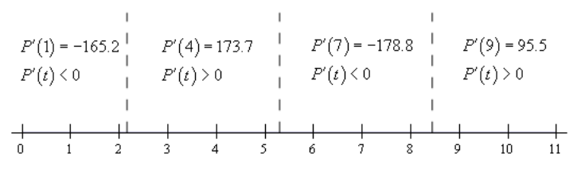

# Section 3.5 : Derivatives Of Trig Functions

With this section we're going to start looking at the derivatives of functions
other than polynomials or roots of polynomials. We'll start this process off by
taking a look at the derivatives of the six trig functions. Two of the
derivatives will be derived. The remaining four are left to you and will follow
similar proofs for the two given here.

Before we actually get into the derivatives of the trig functions we need to
give a couple of limits that will show up in the derivation of two of the
derivatives.

**Fact**

> $$ \lim\limits_{\theta \to 0}\frac{\sin \theta}{\theta} = 1 \quad \quad \lim\limits_{\theta \to 0}\frac{\cos\theta - 1}{\theta} = 0 $$

See the
[**Proof of Trig Limits**](https://tutorial.math.lamar.edu/Classes/CalcI/ProofTrigDeriv.aspx)
section of the Extras chapter to see the proof of these two limits.

Before proceeding a quick note. Students often ask why we always use radians in
a Calculus class. This is the reason why! The proof of the formula involving
sine above requires the angles to be in radians. If the angles are in degrees
the limit involving sine is not 1 and so the formulas we will derive below would
also change. The formulas below would pick up an extra constant that would just
get in the way of our work and so we use radians to avoid that. So, remember to
always use radians in a Calculus class!

Before we start differentiating trig functions let's work a quick set of limit
problems that this fact now allows us to do.

---

**Example 1** Evaluate each of the following limits.

**(a)** $\lim\limits_{\theta \to 0}\dfrac{\sin\theta}{6\theta}$

**Solution**

There really isn’t a whole lot to this limit. In fact, it’s only here to
contrast with the next example so you can see the difference in how these work.
In this case since there is only a 6 in the denominator we’ll just factor this
out and then use the fact.

$$ \lim\limits_{\theta \to 0}\frac{\sin\theta}{6\theta} = \frac{1}{6}\lim\limits_{\theta \to 0}\frac{\sin\theta}{\theta} = \frac{1}{6}(1) = \frac{1}{6} $$

**(b)** $\lim\limits_{x \to 0}\dfrac{\sin(6x)}{x}$

**Solution**

Now, in this case we can’t factor the 6 out of the sine so we're stuck with it
there and we'll need to figure out a way to deal with it. To do this problem we
need to notice that in the fact the argument of the sine is the same as the
denominator (_i.e._ both $\theta$'s). So we need to get both of the argument of
the sine and the denominator to be the same. We can do this by multiplying the
numerator and the denominator by 6 as follows.

$$ \lim\limits_{x \to 0}\frac{\sin(6x)}{x} = \lim\limits_{x \to 0}\frac{6\sin(6x)}{6x} = 6\lim\limits_{x \to 0}\frac{\sin(6x)}{6x} $$

Note that we factored the 6 in the numerator out of the limit. At this point,
while it may not look like it, we can use the fact above to finish the limit.

To see that we can use the fact on this limit let’s do a change of variables. A
change of variables is really just a renaming of portions of the problem to make
something look more like something we know how to deal with. They can’t always
be done, but sometimes, such as this case, they can simplify the problem. The
change of variables here is to let $\theta = 6x$ and then notice that as
$x \to 0$ we also have $\theta \to 6(0) = 0$. When doing a change of variables
in a limit we need to change all the $x$'s into $\theta$'s and that includes the
one in the limit.

Doing the change of variables on this limit gives,

$$ \lim\limits_{x \to 0}\frac{\sin(6x)}{x} = 6\lim\limits_{x \to 0}\frac{\sin(6x)}{6x} \quad \quad \rm{let } \theta = 6x $$

$$ \quad = 6\lim\limits_{\theta \to 0}\frac{\sin(\theta)}{\theta} $$

$$ \quad 6(1) $$

$$ \quad 6 $$

And there we are. Note that we didn't really need to do a change of variables
here. All we really need to notice is that the argument of the sine is the same
as the denominator and then we can use the fact. A change of variables, in this
case, is really only needed to make it clear that the fact does work.

**\(c\)** $\lim\limits_{x \to 0}\dfrac{x}{\sin(7x)}$

**Solution**

In this case we appear to have a small problem in that the function we’re taking
the limit of here is upside down compared to that in the fact. This is not the
problem it appears to be once we notice that,

$$ \frac{x}{\sin(7x)} = \frac{1}{\dfrac{\sin(7x)}{x}} $$

and then all we need to do is recall a nice property of limits that allows us to
do,

$$ \lim\limits_{x \to 0}\frac{x}{\sin(7x)} = \lim\limits_{x \to 0}\frac{1}{\dfrac{\sin(7x)}{x}} $$

$$ \quad = \frac{\lim\limits_{x \to 0}1}{\lim\limits_{x \to 0}\dfrac{\sin(7x)}{x}} $$

$$ \quad = \frac{1}{\lim\limits_{x \to 0}\dfrac{\sin(7x)}{x}} $$

With a little rewriting we can see that we do in fact end up needing to do a
limit like the one we did in the previous part. So, let's do the limit here and
this time we won't bother with a change of variable to help us out. All we need
to do is multiply the numerator and denominator of the fraction in the
denominator by 7 to get things set up to use the fact. Here is the work for this
limit.

$$ \lim\limits_{x \to 0}\frac{x}{\sin(7x)} = \frac{1}{\lim\limits_{x \to 0}\dfrac{7\sin(7x)}{7x}} $$

$$ \quad = \frac{1}{7\lim\limits_{x \to 0}\dfrac{\sin(7x)}{7x}} $$

$$ \quad = \frac{1}{(7)(1)} $$

$$ \quad = \frac{1}{7} $$

**(d)** $\lim\limits_{t \to 0}\dfrac{\sin(3t)}{\sin(8t)}$

**Solution**

This limit looks nothing like the limit in the fact, however it can be thought
of as a combination of the previous two parts by doing a little rewriting.
First, we’ll split the fraction up as follows,

$$ \lim\limits_{t \to 0}\frac{\sin(3t)}{\sin(8t)} = \lim\limits_{t \to 0}\frac{\sin(3t)}{1}\frac{1}{\sin(8t)} $$

Now, the fact wants a $t$ in the denominator of the first and in the numerator
of the second. This is easy enough to do if we multiply the whole thing by
$\dfrac{t}{t}$ (which is just one after all and so won’t change the problem) and
then do a little rearranging as follows,

$$ \lim\limits_{t \to 0}\frac{\sin(3t)}{\sin(8t)} = \lim\limits_{t \to 0}\frac{\sin(3t)}{1}\frac{1}{\sin(8t)}\frac{t}{t} $$

$$ \quad = \lim\limits_{t \to 0}\frac{\sin(3t)}{5}\frac{t}{\sin(8t)}$$

$$ \quad = \left(\lim\limits_{t \to 0}\frac{\sin(3t)}{t}\right)\left(\lim\limits_{t \to 0}\frac{t}{\sin(8t)}\right) $$

At this point we can see that this really is two limits that we've seen before.
Here is the work for each of these and notice on the second limit that we're
going to work it a little differently than we did in the previous part. This
time we're going to notice that it doesn't really matter whether the sine is in
the numerator or the denominator as long as the argument of the sine is the same
as what's in the numerator the limit is still one.

Here is the work for this limit.

$$ \lim\limits_{t \to 0}\frac{\sin(3t)}{\sin(8t)} = \left(\lim\limits_{t \to 0}\frac{3\sin(3t)}{3t}\right)\left(\lim\limits_{t \to 0}\frac{8t}{8\sin(8t)}\right) $$

$$ \quad = \left(3\lim\limits_{t \to 0}\frac{\sin(3t)}{3t}\right)\left(\frac{1}{8}\lim\limits_{t \to 0}\frac{8t}{\sin(8t)}\right) $$

$$ \quad = (3)\left(\frac{1}{8}\right) $$

$$ \quad = \frac{3}{8} $$

**(e)** $\lim\limits_{x \to 4}\dfrac{\sin(x - 4)}{x - 4}$

**Solution**

This limit almost looks the same as that in the fact in the sense that the
argument of the sine is the same as what is in the denominator. However, notice
that, in the limit, $x$ is going to 4 and not 0 as the fact requires. However,
with a change of variables we can see that this limit is in fact set to use the
fact above regardless.

So, let $\theta = x - 4$ and then notice that as $x \to 4$ we have
$\theta \to 0$. Therefore, after doing the change of variable the limit becomes,

$$ \lim\limits_{x \to 4}\frac{\sin(x - 4)}{x - 4} = \lim\limits_{\theta \to 0}\frac{\sin\theta}{\theta} = 1 $$

**(f)** $\lim\limits_{z \to 0}\dfrac{\cos(2z) - 1}{z}$

**Solution**

The previous parts of this example all used the sine portion of the fact.
However, we could just have easily used the cosine portion so here is a quick
example using the cosine portion to illustrate this. We'll not put in much
explanation here as this really does work in the same manner as the sine
portion.

$$ \lim\limits_{z \to 0}\frac{\cos(2z) - 1}{z} = \lim\limits_{z \to 0}\frac{2\left(\cos(2z) - 1\right)}{2z} $$

$$ \quad = 2\lim\limits_{z \to 0}\frac{\cos(2z) - 1}{2z} $$

$$ \quad = 2(0) $$

$$ \quad = 0 $$

All that is required to use the fact is that the argument of the cosine is the
same as the denominator.

---

Okay, now that we’ve gotten this set of limit examples out of the way let's get
back to the main point of this section, differentiating trig functions.

We'll start with finding the derivative of the sine function. To do this we will
need to use the definition of the derivative. It's been a while since we've had
to use this, but sometimes there just isn't anything we can do about it. Here is
the definition of the derivative for the sine function.

$$ \frac{d}{dx}\left(\sin(x)\right) = \lim\limits_{h \to 0}\frac{\sin(x + h) - \sin(x)}{h} $$

Since we can't just plug in $h = 0$ to evaluate the limit we will need to use
the following trig formula on the first sine in the numerator.

$$ \sin(x + h) = \sin(x)\cos(h) + \cos(x)\sin(h) $$

Doing this gives us,

$$ \frac{d}{dx}\left(\sin(x)\right) = \lim\limits_{h \to 0}\frac{\sin(x)\cos(h) + \cos(x)\sin(h) - \sin(x)}{h} $$

$$ \quad = \lim\limits_{h \to 0}\frac{\sin(x)\left(\cos(h) - 1\right) + \cos(x)\sin(h)}{h} $$

$$ \quad = \lim\limits_{h \to 0}\sin(x)\frac{\cos(h) - 1}{h} + \lim\limits_{h \to 0}\cos(x)\frac{\sin(h)}{h} $$

As you can see upon using the trig formula we can combine the first and third
term and then factor a sine out of that. We can then break up the fraction into
two pieces, both of which can be dealt with separately.

Now, both of the limits here are limits as $h$ approaches zero. In the first
limit we have a $\sin(x)$ and in the second limit we have a $\cos(x)$ . BOth of
these are only functions of $x$ only and as $h$ moves in towards zero this has
no effect on the value of $x$. Therefore, as far as the limits are concerned,
these two functions are constants and can be factored out of their respective
limits. Doing this gives,

$$ \frac{d}{dx}\left(\sin(x)\right) = \sin(x)\lim\limits_{h \to 0}\frac{\cos(h) - 1}{h} + \cos(x)\lim\limits_{h \to 0}\frac{\sin(h)}{h} $$

At this point all we need to do is use the limits in the fact above to finish
out this problem.

$$ \frac{d}{dx}\left(\cos(x)\right) = -\sin(x) $$

With these two out of the way the remaining four are fairly simple to get. All
the remaining four trig functions can be defined in terms of sine and cosine and
these definitions, along with appropriate derivative rules, can be used to get
their derivatives.

Let’s take a look at tangent. Tangent is defined as,

$$ \tan(x) = \frac{\sin(x)}{\cos(x)} $$

Now that we have the derivatives of sine and cosine all that we need to do is
use the quotient rule on this. Let's do that.

$$ \frac{d}{dx}\left(\tan(x)\right) = \frac{d}{dx}\left(\frac{\sin(x)}{\cos(x)}\right) $$

$$ \quad = \frac{\cos(x)\cos(x) - \sin(x)\left(-\sin(x)\right)}{\left(\cos(x)\right)^2} $$

$$ \quad = \frac{\cos^2(x) + \sin^2(x)}{\cos^2(x)} $$

Now, recall that $\cos^2(x) + \sin^2(x) = 1$ and if we also recall the
definition of secant in terms of cosine we arrive at,

$$ \frac{d}{dx}\left(\tan(x)\right) = \frac{\cos^2(x) + \sin^2(x)}{\cos^2(x)} $$

$$ \quad = \frac{1}{\cos^2(x)} $$

$$ \quad = \sec^2(x) $$

The remaining three trig functions are also quotients involving sine and/or
cosine and so can be differentiated in a similar manner. We'll leave the details
to you. Here are the derivatives of all six of the trig functions.

**Derivatives of the six trig functions**

> $$ \frac{d}{dx}\left(\sin(x)\right) = \cos(x) \quad \quad \frac{d}{dx}\left(\cos(x)\right) = -\sin(x) $$
>
> $$ \frac{d}{dx}\left(\tan(x)\right) = \sec^2(x) \quad \quad \frac{d}{dx}\left(\cot(x)\right) = -\csc^2(x) $$
>
> $$ \frac{d}{dx}\left(\sec(x)\right) = \sec(x)\tan(x) \quad \quad \frac{d}{dx}\left(\csc(x)\right) = -\csc(x)\cot(x) $$

At this point we should work some examples.

---

**Example 2** Differentiate each of the following functions.

**(a)** $g(x) = 3\sec(x) - 10\cot(x)$

**Solution**

There really isn't a whole lot to this problem. We'll just differentiate each
term using the formulas from above.

$$ g'(x) = 3\sec(x)\tan(x) - 10\left(-\csc^2(x)\right) $$

$$ \quad = 3\sec(x)\tan(x) + 10\csc^2(x) $$

**(b)** $h(w) = 3w^{-4} - w^2\tan(w)$

**Solution**

In this part we will need to use the product rule on the second term and note
that we really will need the product rule here. There is no other way to do this
derivative unlike what we saw when we first looked at the product rule. When we
first looked at the product rule the only functions we knew how to differentiate
were polynomials and in those cases all we really needed to do was multiply them
out and we could take the derivative without the product rule. We are now
getting into the point where we will be forced to do the product rule at times
regardless of whether or not we want to.

We will also need to be careful with the minus sign in front of the second term
and make sure that it gets dealt with properly. There are two ways to deal with
this. One way it to make sure that you use a set of parentheses as follows,

$$ h'(w) = -12w^{-5} - \left(2w\tan(w) + w^2\sec^2(w)\right) $$

$$ \quad = -12w^{-5} - 2w\tan(w) - w^2\sec^2(w) $$

Because the second term is being subtracted off of the first term then the whole
derivative of the second term must also be subtracted off of the derivative of
the first term. The parenthesis make this idea clear.

A potentially easier way to do this is to think of the minus sign as part of the
first function in the product. Or, in other words the two functions in the
product, using this idea, are $-w^2$ and $\tan(w)$. Doing this gives,

$$ h'(w) = -12w^{-5} - 2w\tan(w) - w^2\sec^2(w) $$

So, regardless of how you approach this problem you will get the same
derivative.

**\(c\)** $y = 5\sin(x)\cos(x) + 4\csc(x)$

**Solution**

As with the previous part we'll need to use the product rule on the first term.
We will also think of the 5 as part of the first function in the product to make
sure we deal with it correctly. Alternatively, you could make use of a set of
parentheses to make sure the 5 gets dealt with properly. Either way will work,
but we'll stick with thinking of the 5 as part of the first term in the product.
Here's the derivative of this function.

$$ y' = 5\cos(x)\cos(x) + 5\sin(x)\left(-\sin(x)\right) - 4\csc(x)\cot(x) $$

$$ \quad = 5\cos^2(x) - 5\sin^2(x) - 4\csc(x)\cot(x) $$

**(d)** $P(t) = \dfrac{\sin(t)}{3 - 2\cos(t)}$

**Solution**

In this part we'll need to use the quotient rule to take the derivative.

$$ P'(t) = \frac{\cos(t)\left(3 - 2\cos(t)\right) - \sin(t)\left(2\sin(t)\right)}{\left(3 - 2\cos(t)\right)^2} $$

$$ \quad = \frac{3\cos(t) - 2\cos^2(t) - 2\sin^2(t)}{\left(3 - 2\cos(t)\right)^2} $$

Be careful with the signs when differentiating the denominator. The negative
sign we get from differentiating the cosine will cancel against the negative
sign that is already there.

This appears to be done, but there is actually a fair amount of simplification
that can yet be done. To do this we need to factor out a "-2" from the last two
terms in the numerator and the make use of the fact that
$\cos^2(\theta) + \sin^2(\theta) = 1$.

$$ P'(t) = \frac{3\cos(t) - 2\left(\cos^2(t) + \sin^2(t)\right)}{\left(3 - 2\cos(t)\right)^2} $$

---

As a final problem here let's not forget that we still have our standard
interpretations to derivatives.

---

**Example 3** Suppose that the amount of money in a bank account is given by

$$ P(t) = 500 + 100\cos(t) - 150\sin(t) $$

where $t$ is in years. During the first 10 years in which the account is open
when is the amount of money in the account increasing?

**Solution**

To determine when the amount of money is increasing we need to determine when
the rate of change is positive. Since we know that the rate of change is given
by the derivative that is the first thing that we need to find.

$$ P'(t) = -100\sin(t) - 150\cos(t) $$

Now, we need to determine where in the first 10 years this will be positive.
This is equivalent to asking where in the interval $[0, 10]$ is the derivative
positive. Recall that both sine and cosine are continuous functions and so the
derivative is also a continuous function. The
[**Intermediate Value Theorem**](https://tutorial.math.lamar.edu/Classes/CalcI/Continuity.aspx#IVT)
then tells us that the derivative can only change sign if it first goes through
zero.

So, we need to solve the following equation.

$$ -100\sin(t) - 150\cos(t) = 0 $$

$$ 100\sin(t) = -150\cos(t) $$

$$ \frac{\sin(t)}{\cos(t)} = -1.5 $$

$$ \tan(t) = -1.5 $$

The solution to this equation is,

$$ t = 2.1588 + 2\pi n, \quad n = 0, \pm 1, \pm 2, \dots $$

$$ t = 5.3004 + 2\pi n, \quad n = 0, \pm 1, \pm 2, \dots $$

If you don't recall how to solve trig equations go back and take a look at the
sections on
[**solving trig equations**](https://tutorial.math.lamar.edu/Classes/CalcI/TrigEquations_CalcI.aspx)
in the Review chapter.

We are only interested in those solutions that fall in the range $[0, 10]$.
Plugging in values of $n$ into the solutions above we see that the values we
need are,

$$ t = 2.1588 \quad t = 2.1588 + 2\pi = 8.4420 $$

$$ t = 5.3004 $$

So, much like solving polynomial inequalities all that we need to do is sketch
in a number line and add in these points. These points will divide the number
line into regions in which the derivative must always be the same sign. All that
we need to do then is choose a test point from each region to determine the sign
of the derivative in that region.

Here is the number line with all the information on it.

So, it looks like the amount of money in the bank account will be increasing
during the following intervals.

$$ 2.1588 < t < 5.3004 \quad 8.4420 < t < 10 $$

Note that we can’t say anything about what is happening after $t = 10$ since we
haven’t done any work for $t$'s after that point.

---

In this section we saw how to differentiate trig functions. We also saw in the
last example that our interpretations of the derivative are still valid so we
can't forget those.

Also, it is important that we be able to solve trig equations as this is
something that will arise off and on in this course. It is also important that
we can do the kinds of number lines that we used in the last example to
determine where a function is positive and where a function is negative. This is
something that we will be doing on occasion in both this chapter and the next.

---

## Practice Problems

For problems 1 – 3 evaluate the given limit.

**1.** $\lim\limits_{z \to 0}\dfrac{\sin(10z)}{z}$

**Solution**

**2.** $\lim\limits_{\alpha \to 0}\dfrac{\sin(12\alpha)}{\sin(5\alpha)}$

**Solution**

**3.** $\lim\limits_{x \to 0}\dfrac{\cos(4x) - 1}{x}$

**Solution**

For problems 4 – 10 differentiate the given function.

**4.** $f(x) = 2\cos(x) - 6\sec(x) + 3$

**Solution**

**5.** $g(z) = 10\tan(z) - 2\cot(z)$

**Solution**

**6.** $f(w) = \tan(w)\sec(w)$

**Solution**

**7.** $h(t) = t^3 - t^2\sin(t)$

**Solution**

**8.** $y = 6 + 4\sqrt{x}\csc(x)$

**Solution**

**9.** $R(t) = \dfrac{1}{2\sin(t) - 4\cos(t)}$

**Solution**

**10.** $Z(v) = \dfrac{v + \tan(v)}{1 + \csc(v)}$

**Solution**

**11.** Find the tangent line to $f(x) = \tan(x) + 9\cos(x)$ at $x = \pi$.

**Solution**

**12.** The position of an object is given by $s(t) = 2 + 7\cos(t)$ determine
all the points where the object is not moving.

**Solution**

**13.** Where in the range $[-2, 7]$ is the function $f(x) = 4\cos(x) - x$ is
increasing and decreasing.

**Solution**

---

## Assignment Problems

For problems 1 – 6 evaluate the given limit.

**1.** $\lim\limits_{t \to 0}\dfrac{3t}{\sin(t)}$

**Solution**

**2.** $\lim\limits_{w \to 0}\dfrac{\sin(9w)}{10w}$

**Solution**

**3.** $\lim\limits_{\theta \to 0}\dfrac{\sin(2\theta)}{\sin(17\theta)}$

**Solution**

**4.** $\lim\limits_{x \to -4}\dfrac{\sin(x + 4)}{3x + 12}$

**Solution**

**5.** $\lim\limits_{x \to 0}\dfrac{\cos(x) - 1}{9}$

**Solution**

**6.** $\lim\limits_{z \to 0}\dfrac{\cos(8z) - 1}{2z}$

**Solution**

For problems 7 – 16 differentiate the given function.

**7.** $h(x) = x^4 - 9\sin(x) + 2\tan(x)$

**Solution**

**8.** $g(t) = 8\sec(t) + \cos(t) - 4\csc(t)$

**Solution**

**9.** $y = 6\cot(w) - 8\cos(w) + 9$

**Solution**

**10.** $f(x) = 8\sec(x)\csc(x)$

**Solution**

**11.** $h(t) = 8 - t^9\tan(t)$

**Solution**

**12.** $R(x) = 6\sqrt[5]{x^2} + 8x\sin(x)$

**Solution**

**13.** $h(z) = 3z - \dfrac{\cos(z)}{z^3}$

**Solution**

**14.** $Y(x) = \dfrac{1 + \cos(x)}{1 - \sin(x)}$

**Solution**

**15.** $f(w) = 3w - \dfrac{\sec(w)}{1 + 9\tan(w)}$

**Solution**

**16.** $g(t) = \dfrac{t\cot(t)}{t^2 + 1}$

**Solution**

**17.** Find the tangent line to $f(x) = 2\tan(x) - 4x$ at $x = 0$.

**Solution**

**18.** Find the tangent line to $f(x) = x\sec(x)$ at $x = 2\pi$.

**Solution**

**19.** Find the tangent line to $f(x) = \cos(x) + \sec(x)$ at $x = \pi$.

**Solution**

**20.** The position of an object is given by $s(t) = 9\sin(t) + 2\cos(t) - 7$
determine all the points hwere the obejct is not changing.

**Solution**

**21.** The position of an object is given by $s(t) = 8t + 10\sin(t)$ determine
where in the interval $[0, 12]$ the object is moving to the right and moving to
the left.

**Solution**

**22.** Where in the range $[-6, 6]$ is the function $f(z) = 3z - 8\cos(z)$ is
increasing and decreasing.

**Solution**

**23.** Where in the range $[-3, 5]$ is the function
$R(w) = 7\cos(w) - \sin(w) + 3$ is increasing and decreasing.

**Solution**

**24.** Where in the range $[0, 10]$ is the function $h(t) = 9 - 15\sin(t)$ is
increasing and decreasing.

**Solution**

**25.** Using the definition of the derivative prove that
$\dfrac{d}{dx}\left(\cos(x)\right) = -\sin(x)$.

**Solution**

**26.** Prove that $\dfrac{d}{dx}\left(\sec(x)\right) = \sec(x)\tan(x)$.

**Solution**

**27.** Prove that $\dfrac{d}{dx}\left(\cot(x)\right) = -\csc^2(x)$.

**Solution**

**28.** Prove that $\dfrac{d}{dx}\left(\csc(x)\right) = -\csc(x)\cot(x)$.

**Solution**
