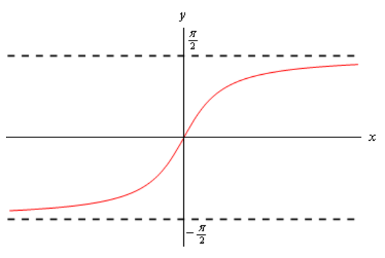

# Section 3.7 : Derivatives Of Inverse Trig Functions

In this section we are going to look at the derivatives of the inverse trig
functions. In order to derive the derivatives of inverse trig functions we'll
need the formula from the last section relating the derivatives of inverse
functions. If $f(x)$ and $g(x)$ are inverse functions then,

$$ g'(x) = \frac{1}{f'(g(x))} $$

Recall as well that two functions are inverses if $f(g(x)) = x$ and
$g(f(x)) = x$.

We'll go through inverse sine, inverse cosine and inverse tangent in detail here
and leave the other three to you to derive if you'd like to.

**Inverse Sine**

Let's start with inverse sine. Here is the definition of the inverse sine.

$$ y = \sin^{-1}x \quad \Leftrightarrow \quad \sin y = x \quad \text{ for } \quad -\frac{\pi}{2} \leq y \leq \frac{\pi}{2} $$

So, evaluating an inverse trig function is the same as asking what angle (_i.e._
$y$) did we plug into the sine function to get $x$. Ther restrictions on $y$
given above are there to make sure that we get a consistent answer out of the
inverse sine. We know that there are in fact an infinite number of angles that
will work and we want a consistent value when we work with inverse sine. Using
the range of angles above gives all possible values of the sine function exactly
once. If you’re not sure of that sketch out a unit circle and you’ll see that
that range of angles (the $y$'s) will cover all possible values of sine.

Note as well that since $-1 \leq \sin(y) \leq 1$ we also have
$-1 \leq x \leq 1$.

Let’s work a quick example.

---

**Example 1** Evaluate $\sin^{-1}\left(\dfrac{1}{2}\right)$

**Solution**

So, we are really asking what angle $y$ solves the following equation.

$$ \sin(y) = \frac{1}{2} $$

and we are restricted to the values of $y$ above.

From a unit circle we can quickly see that $y = \dfrac{\pi}{6}$.

---

We have the following relationship between the inverse sine function and the
sine function.

$$ \sin(\sin^{-1}x) = x \quad \sin^{-1}(\sin x) = x $$

In other words they are inverses of each other. This means that we can use the
fact above to find the derivative of inverse sine. Let's start with,

$$ f(x) = \sin x \quad g(x) = \sin^{-1}x $$

Then,

$$ g'(x) = \frac{1}{f'(g(x))} = \frac{1}{\cos\left(\sin^{-1}x\right)} $$

This is not a very useful formula. Let's see if we can get a better formula.
Let’s start by recalling the definition of the inverse sine function.

$$ y = \sin^{-1}(x) \quad \Rightarrow \quad x = \sin(y) $$

Using the first part of this definition the denominator in the derivative
becomes,

$$ \cos\left(\sin^{-1}x\right) = \cos(y) $$

Now, recall that

$$ \cos^2y + \sin^2y = 1 \quad \Rightarrow \quad \cos y = \sqrt{1 - \sin^2y} $$

Using this, the denominator is now,

$$ \cos\left(\sin^{-1}x\right) = \cos(y) = \sqrt{1 - \sin^2y} $$

Now, use the second part of the definition of the inverse sine function. The
denominator is then,

$$ \cos\left(\sin^{-1}x\right) = \sqrt{1 - \sin^2y} = \sqrt{1 - x^2} $$

Putting all of this together gives the following derivative.

$$ \frac{d}{dx}\left(\sin^{-1}x\right) = \frac{1}{\sqrt{1 - x^2}} $$

**Inverse Cosine**

Now let's take a look at the inverse cosine. Here is the definition for the
inverse cosine.

$$ y = \cos^{-1}x \quad \Leftrightarrow \quad \cos y = x \quad \text{ for } \quad 0 \leq y \leq \pi $$

As with the inverse sine we’ve got a restriction on the angles, $y$, that we get
out of the inverse cosine function. Again, if you’d like to verify this a quick
sketch of a unit circle should convince you that this range will cover all
possible values of cosine exactly once. Also, we also have $-1 \leq x \leq 1$
because $-1 \leq \cos(y) \leq 1$.

---

**Example 2** Evaluate $\cos^{-1}\left(-\dfrac{\sqrt{2}}{2}\right)$.

**Solution**

As with the inverse sine we are really just asking the following.

$$ \cos y = -\frac{\sqrt{2}}{2} $$

where $y$ must meet the requirements given above. From a unit circle we can see
that we must have $y = \dfrac{3\pi}{4}$.

---

The inverse cosine and cosine functions are also inverses of each other and so
we have,

$$ \cos\left(\cos^{-1}x\right) =x \quad \cos^{-1}(\cos x) = x $$

To find the derivative we'll do the same kind of work that we did with the
inverse sine above. If we start with

$$ f(x) = \cos x \quad g(x) = \cos^{-1}x $$

then,

$$ g'(x) = \frac{1}{f'(g(x))} = \frac{1}{-\sin(\cos^{-1}x)} $$

Simplifying the denominator here is almost identical to the work we did for the
inverse sine and so isn't shown here. Upon simplifying we get the following
derivative.

$$ \frac{d}{dx}(\cos^{-1} x) = -\frac{1}{\sqrt{1 - x^2}} $$

So, the derivative of the inverse cosine is nearly identical to the derivative
of the inverse sine. The only difference is the negative sign.

**Inverse Tangent**

Here is the definition of the inverse tangent.

$$ y = \tan^{-1}x \quad \Leftrightarrow \quad \tan y = x \quad \text{ for } \quad -\frac{\pi}{2} < y < \frac{\pi}{2} $$

Again, we have a restriction on $y$, but notice that we can’t let $y$ be either
of the two endpoints in the restriction above since tangent isn’t even defined
at those two points. To convince yourself that this range will cover all
possible values of tangent do a quick
[**sketch**](https://tutorial.math.lamar.edu/Classes/CalcI/CommonGraphs.aspx#Rev_Graph_Ex14)
of the tangent function and we can see that in this range we do indeed cover all
possible values of tangent. Also, in this case there are no restrictions on $x$
because tangent can take on all possible values.

---

**Example 3** Evaluate $\tan^{-1}1$.

**Solution**

Here we are asking,

$$ \tan y = 1 $$

where $y$ satisfies the restrictions given above. From a unit circle we can see
that $y = \dfrac{\pi}{4}$.

---

Because there is no restriction on $x$ we can ask for the limits of the inverse
tangent function as $x$ goes to plus or minus infinity. To do this we'll need
the graph of the inverse tangent function. This is shown below.

From this graph we can see that

$$ \lim\limits_{x \to \infty}\tan^{-1}x = \frac{\pi}{2} \quad \lim\limits_{x \to -\infty}\tan^{-1}x = -\frac{\pi}{2} $$

The tangent and inverse tangent functions are inverse functions so,

$$ \tan(\tan^{-1}x) = x \quad \tan^{-1}(\tan x) = x $$

Therefore, to find the derivative of the inverse tangent function we can start
with

$$ f(x) = \tan x \quad g(x) = \tan^{-1}x $$

We then have,

$$ g'(x) = \frac{1}{f'(g(x))} = \frac{1}{\sec^2(\tan^{-1}x)}$$

Simplifying the denominator is similar to the inverse sine, but different enough
to warrant showing the details. We'll start with the definition of the inverse
tangent.

$$ y = \tan^{-1}x \quad \Rightarrow \quad \tan y = x $$

The denominator is then,

$$ \sec^2(\tan^{-1}x) = \sec^2y $$

Now, if we start with the fact that

$$ \cos^2y + \sin^2y = 1 $$

and divide every term by $\cos^2y$ we will get,

$$ 1 + \tan^2y = \sec^2y $$

The denominator is then,

$$ \sec^2(\tan^{-1}x) = \sec^2y = 1 + \tan^2y $$

Finally using the second portion of the definition of the inverse tangent
function gives us,

$$ \sec^2(\tan^{-1}x) = 1 + \tan^2y = 1 + x^2 $$

The derivative of the inverse tangent is then,

$$ \frac{d}{dx}(\tan^{-1}x) = \frac{1}{1 + x^2} $$

There are three more inverse trig functions but the three shown here the most
common ones. Formulas for the remaining three could be derived by a similar
process as we did those above. Here are the derivatives of all six inverse trig
functions.

> $$ \frac{d}{dx}(\sin^{-1}x) = \frac{1}{\sqrt{1 - x^2}} \quad \quad \frac{d}{dx}(\cos^{-1}x) = -\frac{1}{\sqrt{1 - x^2}} $$
>
> $$ \frac{d}{dx}(\tan^{-1}x) = \frac{1}{1 + x^2} \quad \quad \frac{d}{dx}(\cot^{-1}x) = -\frac{1}{1 + x^2} $$
>
> $$ \frac{d}{dx}(\sec^{-1}x) = \frac{1}{|x|\sqrt{x^2 - 1}} \quad \quad \frac{d}{dx}(\csc^{-1}x) = -\frac{1}{|x|\sqrt{x^2 - 1}} $$

We should probably now do a couple of quick derivatives here before moving on to
the next section.

---

**Example 4** Differentiate the following functions.

**(a)** $f(t) = 4\cos^{-1}(t) - 10\tan^{-1}(t)$

**Solution**

Not much to do with this one other than differentiate each term.

$$ f'(t) = -\frac{4}{\sqrt{1 - t^2}} - \frac{10}{1 + t^2} $$

**(b)** $y = \sqrt{z}\sin^{-1}(z)$

**Solution**

Don't forget to convert the radical to fractional exponents before using the
product rule.

$$ y' = \frac{1}{2}z^{-\frac{1}{2}}\sin^{-1}(z) + \frac{\sqrt{z}}{\sqrt{1 - z^2}} $$

---

**Alternate Notation**

There is some alternate notation that is used on occasion to denote the inverse
trig functions. This notation is,

$$ \sin^{-1}x = \arcsin x \quad \quad \cos^{-1}x = \arccos x $$

$$ \tan^{-1}x = \arctan x \quad \quad \cot^{-1}x = \text{arccot } x $$

$$ \sec^{-1}x = \text{arcsec } x \quad \quad \csc^{-1}x = \text{arccsc } x $$

---

## Practice Problems

For each of the following problems differentiate the given function.

**1.** $T(z) = 2\cos(z) + 6\cos^{-1}(z)$

**Solution**

$$ T'(z) = \left[(2)'(\cos(z)) + (2)(\cos(z))'\right] + \left[(6)'(\cos^{-1}(z)) + (6)(\cos^{-1}(z))'\right] $$

$$ T'(z) = \left[(0)(\cos(z)) + (2)(-\sin(z))\right] + \left[(0)(\cos^{-1}(z)) + (6)\left(-\frac{1}{\sqrt{1 - z^2}}\right)\right] $$

$$ \boxed{T'(z) = -2\sin(z) - \frac{6}{\sqrt{1 - z^2}}} $$

**2.** $g(t) = \csc^{-1}(t) - 4\cos^{-1}(t)$

**Solution**

$$ g'(t) = (\csc^{-1}t) - \left[(4)'(\cot^{-1}(t)) + (4)(\cot^{-1}(t))'\right] $$

$$ g'(t) = -\frac{1}{|t|\sqrt{t^2 - 1}} - \left[(0)(\cot^{-1}(t)) + (4)\left(-\frac{1}{1 + t^2}\right)\right] $$

$$ \boxed{g'(t) = -\frac{1}{|t|\sqrt{t^2 - 1}} + \frac{4}{1 + t^2}} $$

**3.** $y = 5x^6 - \sec^{-1}(x)$

**Solution**

$$ y' = (5x^6)' - (\sec^{-1}(x))' $$

$$ \boxed{y' = 30x^5 - \frac{1}{|x|\sqrt{x^2 - 1}}} $$

**4.** $f(w) = \sin(w) + w^2\tan^{-1}(w)$

**Solution**

$$ f'(w) = (\sin(w))' + \left[(w^2)'(\tan^{-1}(w)) + (w^2)(\tan^{-1}(w))'\right] $$

$$ f'(w) = \cos(w) + \left[(2w)(\tan^{-1}(w)) + (w^2)\left(\frac{1}{1 + w^2}\right)\right] $$

$$ \boxed{f'(w) = \cos(w) + 2w\tan^{-1}(w) + \frac{w^2}{1 + w^2}} $$

**5.** $h(x) = \dfrac{\sin^{-1}(x)}{1 + x}$

**Solution**

$$ h'(x) = \frac{(\sin^{-1}(x))'(1 + x) - (\sin^{-1}(x))(1 + x)'}{(1 + x)^2} $$

$$ h'(x) = \frac{\left(\dfrac{1}{\sqrt{1 - x^2}}\right)(1 + x) - (\sin^{-1}(x))(0 + 1)}{(1 + x)^2} $$

$$ h'(x) = \frac{\dfrac{1 + x}{\sqrt{1 - x^2}} - \sin^{-1}(x)}{(1 + x)^2} $$

$$ \boxed{h'(x) = \frac{1 + x - \sqrt{1 - x^2}\sin^{-1}(x)}{\sqrt{1 - x^2}(1 + x)^2}} $$

---

## Assignment Problems

For each of the following problems differentiate the given function.

**1.** $f(x) = \sin(x) + 9\sin^{-1}(x)$

**Solution**

$$ f'(x) = (\sin(x))' + \left[(9)'(\sin^{-1}(x)) + (9)(\sin^{-1}(x))'\right] $$

$$ f'(x) = \cos(x) + \left[(0)(\sin^{-1}(x)) + (9)\left(\frac{1}{\sqrt{1 - x^2}}\right)\right] $$

$$ \boxed{f'(x) = \cos(x) + \frac{9}{\sqrt{1 - x^2}}} $$

**2.** $C(t) = 5\sin^{-1}(t) - \cos^{-1}(t)$

**Solution**

$$ C'(t) = \left[(5)'(\sin^{-1}(t)) + (5)(\sin^{-1}(t))'\right] - (\cos^{-1}(t))' $$

$$ C'(t) = \left[(0)(\sin^{-1}(t)) + (5)\left(\frac{1}{\sqrt{1 - t^2}}\right)\right] - \left(-\frac{1}{\sqrt{1 - t^2}}\right) $$

$$ C'(t) = \frac{5}{\sqrt{1 - t^2}} + \frac{1}{\sqrt{1 - t^2}} $$

$$ \boxed{C'(t) = \frac{6}{\sqrt{1 - t^2}}} $$

**3.** $g(z) = \tan^{-1}(z) + 4\cos^{-1}(z)$

**Solution**

$$ g'(z) = (\tan^{-1}(z))' + \left[(4)'(\cos^{-1}(z)) + (4)(\cos^{-1}(z))'\right] $$

$$ g'(z) = \frac{1}{1 + z^2} + \left[(0)(\cos^{-1}(z)) + (4)\left(-\frac{1}{\sqrt{1 - z^2}}\right)\right] $$

$$ \boxed{g'(z) = \frac{1}{1 + z^2} - \frac{4}{\sqrt{1 - z^2}}} $$

**4.** $h(t) = \sec^{-1}(t) - t^3\cos^{-1}(t)$

**Solution**

$$ h'(t) = (\sec^{-1}(t))' - \left[(t^3)'(\cos^{-1}(t)) + (t^3)(\cos^{-1}(t))'\right] $$

$$ h'(t) = \frac{1}{|t|\sqrt{t^2 - 1}} - \left[(3t^2)(\cos^{-1}(t)) + (t^3)\left(-\frac{1}{\sqrt{1 - t^2}}\right)\right] $$

$$ h'(t) = \frac{1}{|t|\sqrt{t^2 - 1}} - \left[3t^2\cos^{-1}(t) - \frac{t^3}{\sqrt{1 - t^2}}\right] $$

$$ \boxed{h'(t) = \frac{1}{|t|\sqrt{t^2 - 1}} - 3t^2\cos^{-1}(t) + \frac{t^3}{\sqrt{1 - t^2}}} $$

Note that the domain of $\sec^{-1}(\theta)$ is defined for $|\theta| \geq 1$ and
the domain of $\cos^{-1}(\theta)$ is <Fdefined for $-1 \leq \theta \leq 1$.
Because we are using both secant and cosine here, the only two points where
these domains intersect are $-1$ and $1$. Therefore $t$ can only be one of two
values for this particular derivative:

$$ t = -1 \quad \text{ AND } \quad t = 1 $$

**5.** $f(w) = \left(w - w^2\right)\sin^{-1}(w)$

**Solution**

$$ f'(w) = \left[(w - w^2)'(\sin^{-1}(w)) + (w - w^2)(\sin^{-1}(w))'\right] $$

$$ f'(w) = \left[(1 - 2w)(\sin^{-1}(w)) + (w - w^2)\left(\frac{1}{\sqrt{1 - w^2}}\right)\right] $$

$$ \boxed{f'(w) = \sin^{-1}(w) - 2w\sin^{-1}(w) + \frac{w - w^2}{\sqrt{1 - w^2}}} $$

**6.** $y = \left(x - \cot^{-1}(x)\right)\left(1 + \csc^{-1}(x)\right)$

**Solution**

$$ y' = \left[(x - \cot^{-1}(x))'(1 + \csc^{-1}(x)) + (x - \cot^{-1}(x))(1 + \csc^{-1}(x))'\right] $$

$$ y' = \left[\left(1 - \left(-\frac{1}{1 + x^2}\right)\right)(1 + \csc^{-1}(x)) + (x - \cot^{-1}(x))\left(0 + \left(-\frac{1}{|x|\sqrt{x^2 - 1}}\right)\right)\right] $$

$$ y' = \left[\left(\frac{1 + x^2}{1 + x^2} + \frac{1}{1 + x^2}\right)(1 + \csc^{-1}(x)) - \left(\frac{x - \cot^{-1}(x)}{|x|\sqrt{x^2 - 1}}\right)\right] $$

$$ \boxed{y' = \frac{(2 + x^2)(1 + \csc^{-1}(x))}{1 + x^2} - \frac{x - \cot^{-1}(x)}{|x|\sqrt{x^2 - 1}}} $$

**7.** $Q(z) = \dfrac{z + 1}{\tan^{-1}(z)}$

**Solution**

$$ Q'(z) = \frac{(z + 1)'(\tan^{-1}(z)) - (z + 1)(\tan^{-1}(z))'}{(\tan^{-1}(z))^2} $$

$$ Q'(z) = \frac{(1 + 0)(\tan^{-1}(z)) - (z + 1)\left(\dfrac{1}{1 + z^2}\right)}{(\tan^{-1}(z))^2} $$

$$ Q'(z) = \frac{\tan^{-1}(z) - \dfrac{z + 1}{1 + z^2}}{(\tan^{-1}(z))^2} $$

$$ \boxed{Q'(z) = \frac{(1 + z^2)\tan^{-1}(z) - z - 1}{(1 + z^2)(\tan^{-1}(z))^2}} $$

**8.** $A(t) = \dfrac{1 + \sin^{-1}(t)}{1 - \cos^{-1}(t)}$

**Solution**

$$ A'(t) = \frac{(1 + \sin^{-1}(t))'(1 - \cos^{-1}(t)) - (1 + \sin^{-1}(t))(1 - \cos^{-1}(t))'}{(1 - \cos^{-1}(t))^2} $$

$$ A'(t) = \frac{\left(0 + \left(\dfrac{1}{\sqrt{1 - t^2}}\right)\right)(1 - \cos^{-1}(t)) - (1 + \sin^{-1}(t))\left(0 - \left(-\dfrac{1}{\sqrt{1 - t^2}}\right)\right)}{(1 - \cos^{-1}(t))^2} $$

$$ A'(t) = \frac{\left(\dfrac{1}{\sqrt{1 - t^2}}\right)(1 - \cos^{-1}(t)) - (1 + \sin^{-1}(t))\left(\dfrac{1}{\sqrt{1 - t^2}}\right)}{(1 - \cos^{-1}(t))^2} $$

$$ A'(t) = \frac{\dfrac{1 - \cos^{-1}(t)}{\sqrt{1 - t^2}} - \dfrac{1 + \sin^{-1}(t)}{\sqrt{1 - t^2}}}{(1 - \cos^{-1}(t))^2} $$

$$ A'(t) = \frac{\dfrac{1 - \cos^{-1}(t) - 1 - \sin^{-1}(t)}{\sqrt{1 - t^2}}}{(1 - \cos^{-1}(t))^2} $$

$$ A'(t) = \frac{\dfrac{-\cos^{-1}(t) - \sin^{-1}(t)}{\sqrt{1 - t^2}}}{(1 - \cos^{-1}(t))^2} $$

$$ \boxed{A'(t) = \frac{-\cos^{-1}(t) - \sin^{-1}(t)}{(1 - \cos^{-1}(t))^2\sqrt{1 - t^2}}} $$
