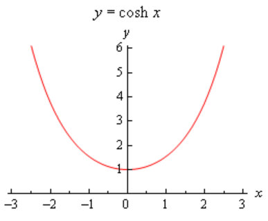
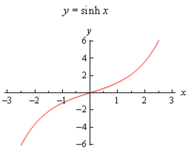
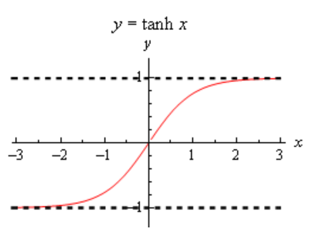

# Section 3.8 : Derivatives Of Hyperbolic Functions

The last set of functions that we’re going to be looking in this chapter at are
the hyperbolic functions. In many physical situations combinations of
$\mathbf{e}^x$ and $\mathbf{e}^{-x}$ arise fairly often. Because of this these
combinations are given names. There are six hyperbolic functions and they are
defined as follows.

$$ \sinh x = \frac{\mathbf{e}^x - \mathbf{e}^{-x}}{2} \quad \quad \cosh x = \frac{\mathbf{e}^x + \mathbf{e}^{-x}}{2}$$

$$ \tanh x = \frac{\sinh x}{\cosh x} \quad \quad \coth x = \frac{\cosh x}{\sinh x} = \frac{1}{\tanh x} $$

$$ \text{sech } x = \frac{1}{\cosh x} \quad \quad \text{csch } x = \frac{1}{\sinh x} $$

Here are the graphs of the three main hyperbolic functions.

We also have the following facts about the hyperbolic functions.

$$ \sinh(-x) = -\sinh(x) \quad \quad \cosh(-x) = \cosh(x) $$

$$ \cosh^2(x) - \sinh^2(x) = 1 \quad \quad 1 - \tanh^2(x) = \text{sech}^2(x) $$

You'll note that these are similar, but not quite the same, to some of the more
common trig identities so be careful to not confuse the identities here with
those of the standard trig functions.

Because the hyperbolic functions are defined in terms of exponential functions
finding their derivatives is fairly simple provided you’ve already read through
the next section. We haven’t however so we'll need the following formula that
can be easily proved after we've covered the next section.

$$ \frac{d}{dx}\left(\mathbf{e}^{-x}\right) = -\mathbf{e}^{-x} $$

With this formula we'll do the derivative for hyperbolic sine and leave the rest
to you as an exercise.

$$ \frac{d}{dx}(\sinh x) = \frac{d}{dx}\left(\frac{\mathbf{e}^x - \mathbf{e}^{-x}}{2}\right) = \frac{\mathbf{e}^x - \left(-\mathbf{e}^{-x}\right)}{2} = \frac{\mathbf{e}^x + \mathbf{e}^{-x}}{2} = \cosh x $$

For the rest we can either use the definition of the hyperbolic function and/or
the quotient rule. Here are all six derivatives.

> $$ \frac{d}{dx}(\sinh x) = \cosh x \quad \quad \frac{d}{dx}(\cosh x) = \sinh x $$
>
> $$ \frac{d}{dx}(\tanh x) = \text{sech}^2x \quad \quad \frac{d}{dx}(\coth x) = -\text{csch}^2x $$
>
> $$ \frac{d}{dx}(\text{sech }x) = -\text{sech }x\tanh x \quad \quad \frac{d}{dx}(\text{csch }x) = -\text{csch }x\coth x $$

Here are a couple of quick derivatives using hyperbolic functions.

---

**Example 1** Differentiate each of the following functions.

**(a)** $f(x) = 2x^5\cosh x$

**Solution**

$$ f'(x) = 10x^4\cosh x + 2x^5\sinh x $$

**(b)** $h(t) = \dfrac{\sinh t}{t + 1}$

**Solution**

$$ h'(t) = \frac{(t + 1)\cosh t - \sinh t}{(t + 1)^2} $$

---

## Practice Problems

For each of the following problems differentiate the given function.

**1.** $f(x) = \sinh(x) + 2\cosh(x) - \text{sech}(x)$

**Solution**

**2.** $R(t) = \tan(t) + t^2\text{csch}(t)$

**Solution**

**3.** $g(z) = \dfrac{z + 1}{\tanh(z)}$

**Solution**

---

## Assignment Problems

For each of the following problems differentiate the given function.

**1.** $h(w) = w^2 - 3\sinh(w)$

**Solution**

**2.** $g(x) = \cos(x) + \cosh(x)$

**Solution**

**3.** $H(t) = 3\text{csch}(t) + 7\sinh(t)$

**Solution**

**4.** $A(r) = \tan(r)\tanh(r)$

**Solution**

**5.** $f(x) = \mathbf{e}^x\cosh(x)$

**Solution**

**6.** $f(z) = \dfrac{\text{sech}(z) + 1}{1 - z}$

**Solution**

**7.** $Q(w) = \dfrac{\coth(w)}{w + \sinh(w)}$

**Solution**
