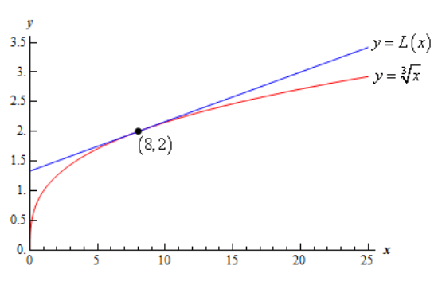

# Section 4.11 : Linear Approximations

In this section we're going to take a look at an application not of derivatives
but of the tangent line to a function. Of course, to get the tangent line we do
need to take derivatives, so in some way this is an application of derivatives
as well.

Given a function, $f(x)$, we can find its tangent at $x = a$. The equation of
the tangent line, which we'll call $L(x)$ for this discussion, is,

$$ L(x) = f(a) + f'(a)(x - a) $$

Take a look at the following graph of a function and its tangent line.

From this graph we can see that near $x = a$ the tangent line and the function
have nearly the same graph. On occassion we will use the tangent line, $L(x)$,
as an approximation to the function, $f(x)$, near $x = a$. In these cases we
call the tangent line the **linear approximation** to teh function at $x = a$.

So, why would we do this? Let's take a look at an example.

---

**Example 1** Determine the linear approximation for $f(x) = \sqrt[3]{x}$ at
$x = 8$. Use the linear approximation to approximate the value of
$\sqrt[3]{8.05}$ and $\sqrt[3]{25}$.

**Solution**

Since this is just the tangent line there really isn't a whole lot to finding
the linear approximation.

$$ f'(x) = \frac{1}{3}x^{-\frac{2}{3}} = \frac{1}{3\sqrt[3]{x^2}} \quad \quad f(8) = 2 \quad \quad f'(8) = \frac{1}{12} $$

The linear approximation is then,

$$  L(x) = 2 + \frac{1}{12}(x - 8) = \frac{1}{12}x + \frac{4}{3} $$

Now, the approximations are nothing more than plugging the given values of $x$
into the linear approximation. For comparison purposes we'll also compute the
exact values.

$$ L(8.05) = 2.00416667 \quad \quad \quad \sqrt[3]{8.05} = 2.00415802 $$

$$ L(25) = 3.41666667 \quad \quad \quad \sqrt[3]{25} = 2.92401774 $$

So, at $x = 8.05$ this linear approximation does a very good job of
approximating the actual value. However, at $x = 25$ it doesn't do such a good
job.

This shouldn't be too surprising if you think about it. Near $x = 8$ both the
function and the linear approximation have nearly the same slope and since they
both pass through the point $(8, 2)$ they should have nearly the same value as
long as we stay close to $x = 8$. However, as we move away from $x = 8$ the
linear approximation is a line and so will always have the same slope while the
function's slope will change as $x$ changes and so the function will, in all
likelihood, move away from the linear approximation.

Here's a quick sketch of the function and its linear approximation at $x = 8$.

As noted above, the farther from $x = 8$ we get the more distance separates the
function itself and its linear approximation.

---

Linear approximations do a very good job of approximating values of $f(x)$ as
long as we stay "near" $x = a$. However, athe farther away from $x = a$ we get
the worse the approximation is liable to be. The main problem here is that how
near we need to stay to $x = a$ in order to get a good approximation will depend
upon both the function we're using and the value of $x = a$ that we're using.
Also, there will often be no easy way of predicting how far away from $x = a$ we
can get and still have a "good" approximation.

Let's take a look at another example that is actually used fairly heavily in
some places.

---

**Example 2** Determine the linear approximation for $\sin\theta$ at
$\theta = 0$.

**Solution**

Again, there really isn't a whole lot to this example. All that we need to do is
compute the tangent line to $\sin\theta$ at $\theta = 0$

$$ f(\theta) = \sin\theta \quad \quad f'(\theta) = \cos\theta $$

$$ f(0) = 0 \quad \quad f'(0) = 1 $$

The linear approximation is,

$$ L(\theta) = f(0) + f'(0)(\theta - a) $$

$$ \quad = 0 + (1)(\theta - 0) $$

$$ \quad = \theta $$

So, as long as $\theta$ stays small we can say that $\sin\theta \approx \theta$.

---

This is actually a somewhat important linear approximation. In optics this
linear approximation is often used to simplify formulas. This linear
approximation is also used to help describe the motion of a pendulum and
vibrations in a string.

---

## Practice Problems

For problems 1 & 2 find a linear approximation to the function at the given
point.

**1.** $f(x) = 3x\mathbf{e}^{2x - 10}$ at $x = 5$

**Solution**

**2.** $h(t) = t^4 - 6t^3 + 3t - 7$ at $t = -3$

**Solution**

**3.** Find the linear approximation to $g(z) = \sqrt[4]{z}$ at $z = 2$. Use the
linear approximation to approximate the value of $\sqrt[4]{3}$ and
$\sqrt[4]{10}$. Compare the approximated values to the exact values.

**Solution**

**4.** Find the linear approximation to $f(t) = \cos(2t)$ at $t = \dfrac{1}{2}$.
Use the linear approximation to approxiamte the values of $\cos(2)$ and
$\cos(18)$. Compare the approximated values to the exact values.

**Solution**

**5.** Without using any kind of computational aid use a linear approximation to
estimate the value of $\mathbf{e}^{0.1}$.

**Solution**

---

## Assignment Problems

For problems 1 – 4 find a linear approximation to the function at the given
point.

**1.** $f(x) = \cos(2x)$ at $x = \pi$

**Solution**

**2.** $h(z) = \ln\left(z^2 + 5\right)$ at $z = 2$

**Solution**

**3.** $g(x) = 2 - 9x - 3x^2 -x^3$ at $x = -1$

**Solution**

**4.** $g(t) = \mathbf{e}^{\sin(t)}$ at $t = -4$

**Solution**

**5.** Find the linear approximation to $h(y) = \sin(y + 1)$ at $y = 0$. Use the
linear approximation to approximate the value of $\sin(2)$ and $\sin(15)$.
Compare the approximated values to the exact values.

**Solution**

**6.** Find the linear approximation to $R(t) = \sqrt[5]{t}$ at $t = 32$. Use
the linear approximation to approximate the value of $\sqrt[5]{31}$ and
$\sqrt[5]{3}$. Compare the approximated values to the exact values.

**Solution**

**7.** Find the linear approximation to $h(x) = \mathbf{e}^{1 - x}$ at $x = 1$.
Use the linear approximation to approximate the value of $\mathbf{e}$ and
$\mathbf{e}^{-4}$. Compare the approximated values to the exact values.

For problems 8 – 10 estimate the given value using a linear approximation and
without using any kind of computational aid.

**8.** $\ln(1.1)$

**Solution**

**9.** $\sqrt{8.9}$

**Solution**

**10.** $\sec(0.1)$

**Solution**
