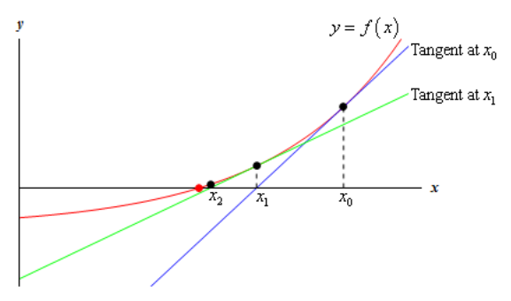
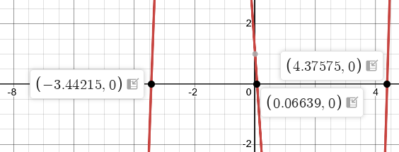
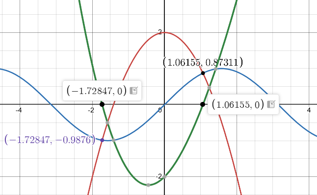
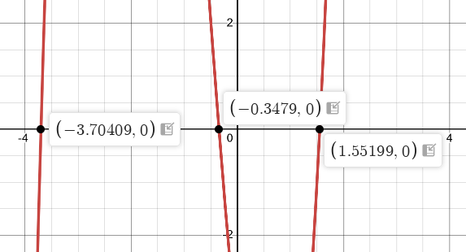
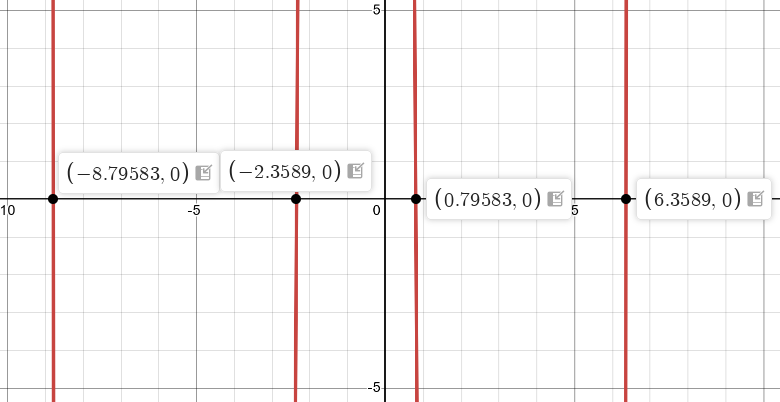
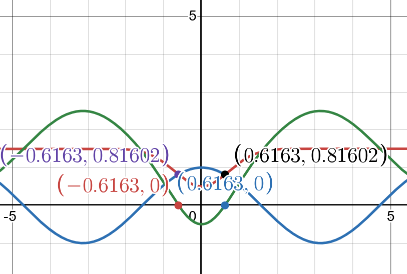
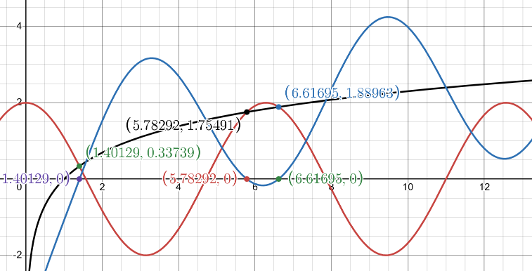
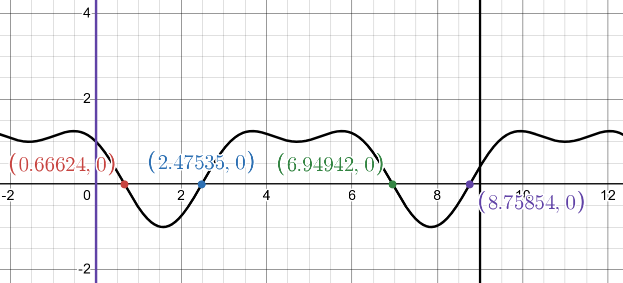

# Section 4.13 Newton's Method

The next application that we'll take a look at in this chapter is an important
application that is used in many areas. If you've been following along in the
chapter to this point it's quite possible that you've gotten the impression that
many of the applications that we've looked at are just made up by us to make you
work. This is unfortunate because all of the applications that we've looked at
to this point are real applications that really are used in real situations. The
problem is often that in order to work more meaningful examples of the
applications we would need more knowledge than we generally have about the
science and/or physics behind the problem. Without that knowledge we're stuck
doing some fairly simplistic examples that often don't seem very realistic at
all and that makes it hard to understand that the application we're looking at
is a real application.

That is going to change in this section. This is an application that we can all
understand and we can all understand needs to be done on occasion even if we
don't understand the physics/science behind an actual application.

In this section we are going to look at a method for approximating solutions to
equations. We all know that equations need to be solved on occasion and in fact
we've solved quite a few equations ourselves to this point. In all the examples
we've looked at to this point we were able to actually find the solutions, but
it's not always possible to do that exactly and/or do the work by hand. That is
where this application comes into play. So, let's see what this application is
all about.

Let's suppose that we want to approximate the solution to $f(x) = 0$ and let's
also suppose that we have somehow found an initial approximation to this
solution say, $x_0$. This initial approximation is probably not all that good,
in fact it may be nothing more than a quick guess we made, and so we'd like to
find a better approximation. This is easy enough to do. First, we will get the
tangent line to $f(x)$ at $x_0$.

$$ y = f(x_0) + f'(x_0)(x - x_0) $$

Now, take a look at the graph below.

The blue line (if you’re reading this in color anyway...) is the tangent line at
$x_0$. We can see that this line will cross the $x$-axis much closer to the
actual solution to the equation than $x_0$ does. Let's call this point where the
tangent at $x_0$ crosses the $x$-axis $x_1$ and we'll use this point as our new
approximation to the solution.

So, how do we find this point? Well we know it's coordinates, $(x_1, 0)$, and we
know that it's on the tangent line so plug this point into the tangent line and
solve for $x_1$ as follows,

$$ 0 = f(x_0) + f'(x_0)(x_1 - x_0) $$

$$ x_1 - x_0 = -\frac{f(x_0)}{f'(x_0)} $$

$$ x_1 = x_0 - \frac{f(x_0)}{f'(x_0)} $$

So, we can find the new approximation provided the derivative isnt zero at the
original approximation.

Now we repeat the whole process to find an even better approximation. We form up
the tangent line to $f(x)$ at $x_1$ and use its root, which we'll call $x_2$, as
a new approximation to the actual solution. If we do this we will arrive at the
following formula.

$$ x_2 = x_1 - \frac{f(x_1)}{f'(x_1)} $$

This point is also shown on the graph above and we can see from this graph that
if we continue following this process will get a sequence of numbers that are
getting very close the actual solution. This process is called Newton's Method.

Here is the general Newton's Method

**Newton's Method**

> If $x_n$ is an approximation of a solution of $f(x) = 0$ and if
> $f'(x_n) \neq 0$ the next approximation is given by,
>
> $$ x_{n + 1} = x_n - \frac{f(x_n)}{f'(x_n)} $$

This should lead to the question of when do we stop? How many times do we go
through this process? One of the more common stopping points in the process is
to continue until two successive approximations agree to a given number of
decimal places.

Before working any examples we should address two issues. First, we really do
need to be solving $f(x) = 0$ in order for Newton's Method to be applied. This
isn't really all that much of an issue but we do need to make sure that the
equation is in this form prior to using the method.

Secondly, we do need to somehow get our hands on an initial approximation to the
solution (_i.e._ we need $x_0$ somehow). One of the more common ways of getting
our hands on $x_0$ is to sketch the graph of the function and use that to get an
estimate of the solution which we then use as $x_0$. Another common method is if
we know that there is a solution to a function in an interval then we can use
the midpoint of the interval as $x_0$.

Let's work an example of Newton's Method.

---

**Example 1** Use Newton's Method to determine an approximation to the solution
to $\cos x = x$ that lies in the interval $[0, 2]$. Find the approximation to
six decimal places.

**Solution**

First note that we weren't given an initial guess. We were however, given an
interval in which to look. We will use this to get our initial guess. As noted
above the general rule of thumb in these cases is to take the initial
approximation to be the midpoint of the interval. So, we'll use $x_0 = 1$ as our
initial guess.

Next, recall that we **must** have the function in the form $f(x) = 0$.
Therefore, we first rewrite the equation as,

$$ \cos x - x = 0 $$

We can now write down the general formula for Newton's Method. Doing this will
often simplify up the work a little so it's generally not a bad idea to do this.

$$ x_{n + 1} = x_n - \frac{\cos x_n - x_n}{-\sin x_n - 1} $$

Let's now get the first approximation.

$$ x_1 = 1 - \frac{\cos(1) - 1}{-\sin(1) - 1} = 0.7503638679 $$

At this point we should point out that the phrase "six decimal places" does not
mean just get $x_1$ to six decimal places and then stop. Instead it means that
we continue until two successive approximations agree to six decimal places.

Given that stopping condition we clearly need to go at least one step farther.

$$ x_2 = 0.7503638679 - \frac{\cos(0.7503638679) - 0.7503638679}{-\sin(0.7503638679) - 1} = 0.7391128909 $$

Alright, we're making progress. We've got the approximation to 1 decimal place.
Let's do another one, leaving the details of the computation to you.

$$ x_3 = 0.7390851334 $$

We've got it to three decimal places. We'll need another one.

$$ x_4 = 0.7390851332 $$

And now we've got two approximations that agree to 9 decimal places and so we
can stop. We will assume that the solution is approximately
$x_4 = 0.7390851332$.

---

In this last example we saw that we didn't have to do too many computations in
order for Newton's Method to give us an approximation in the desired range of
accuracy. This will not always be the case. Sometimes it will take many
iterations through the process to get to the desired accuracy and on occasion it
can fail completely.

The following example is a little silly but it makes the point about the method
failing.

---

**Example 2** Use $x_0 = 1$ to find the approximation to the solution to
$\sqrt[3]{x} = 0$.

**Solution**

Yes, it's a silly example. Clearly the solution is $x = 0$, but it does make a
very important point. Let's get the general formula for Newton's method.

$$ x_{n + 1} = x_n - \frac{{x_n}^{\frac{1}{3}}}{\frac{1}{3}{x_n}^{-\frac{2}{3}}} = x_n - 3x_n = -2x_n $$

In fact, we don't really need to do any computations here. These computations
get farther and farther away from the solution, $x = 0$, with each iteration.
Here are a couple of computations to make the point.

$$ x_1 = -2 $$

$$ x_2 = 4 $$

$$ x_3 = -8 $$

$$ x_4 = 16 $$

$$ \text{etc.} $$

So, in this case the method fails and fails spectacularly.

---

So, we need to be a little careful with Newton's method. It will usually quickly
find an approximation to an equation. However, there are times when it will take
a lot of work or when it won't work at all.

---

## Practice Problems

For problems 1 & 2 use Newton's Method to determine $x_2$ for the given function
and given value of $x_0$.

**1.** $f(x) = x^3 - 7x^2 + 8x - 3 \text{, } x_0 = 5$

**Solution**

Let's just reference Newton's Method first here:

$$ x_{n + 1} = x_n - \frac{f(x_n)}{f'(x_n)} $$

We'll need the first derivative:

$$ f'(x) = 3x^2 - 14x + 8 $$

And then we can start using Newton's Method, starting at $x_0$:

$$ x_1 = x_0 - \frac{f(x_0)}{f'(x_0)} $$

$$ x_1 = 5 - \frac{(5)^3 - 7(5)^2 + 8(5) - 3}{3(5)^2 - 14(5) + 8} = 6 $$

And from here we can imply use $x_1$ to calculate $x_2$ in the same manner:

$$ x_2 = x_1 - \frac{f(x_1)}{f'(x_1)} $$

$$ x_2 = 6 - \frac{(6)^3 - 7(6)^2 + 8(6) - 3}{3(6)^2 - 14(6) + 8} = 5.71875 $$

$$ \boxed{x_2 = 5.71875} $$

**2.** $f(x) = x\cos(x) - x^2 \text{, } x_0 = 1$

**Solution**

Same deal as **1**.

$$ f'(x) = \cos(x) - x\sin(x) - 2x $$

$$ x_1 = 1 - \frac{(1)\cos(1) - (1)^2}{\cos(1) - (1)\sin(1) - 2(1)} \approx 0.8002329432  $$

$$ x_2 = (0.8002329432) - \frac{(0.8002329432)\cos(0.8002329432) - (0.8002329432)^2}{\cos(0.8002329432) - (0.8002329432)\sin(0.8002329432) - 2(0.8002329432)} \approx 0.7440943985 $$

$$ \boxed{x_2 \approx 0.7440943985} $$

For problems 3 & 4 use Newton's Method to find the root of the given equation,
accurate to six decimal places, that lies in the given interval.

**3.** $x^4 - 5x^3 + 9x + 3 = 0 \text{ in } [4, 6]$

**Solution**

Here we'll hae to pick an $x_0$ within the given interval, let's just choose
$x_0 = 5$. We'll also need the first derivative of the given equation.

$$ f(x) = x^4 - 5x^3 + 9x + 3 $$

$$ f'(x) = 4x^3 - 15x^2 + 9 $$

Now plug it into Newton's Method formula:

$$ x_1 = 5 - \frac{(5)^4 - 5(5)^3 + 9(5) + 3}{4(5)^3 - 15(5)^2 + 9} \approx 4.641791045 $$

We'll need to do at least one interation to see if the two approximations are
accurate within six decimal places.

$$ x_2 = (4.641791045) - \frac{(4.641791045)^4 - 5(4.641791045)^3 + 9(4.641791045) + 3}{4(4.641791045)^3 - 15(4.641791045)^2 + 9} \approx 4.537543959 $$

Not even the first decimal is accurate, so we need to continue iterating through
Newton's Method:

$$ x_3 = (4.537543959) - \frac{(4.537543959)^4 - 5(4.537543959)^3 + 9(4.537543959) + 3}{4(4.537543959)^3 - 15(4.537543959)^2 + 9} \approx 4.528973727 $$

Only the first decimal place is accurate, let's continue:

$$ x_4 = (4.528973727) - \frac{(4.528973727)^4 - 5(4.528973727)^3 + 9(4.528973727) + 3}{4(4.528973727)^3 - 15(4.528973727)^2 + 9} \approx 4.528917960 $$

Accurate up to four decimal places, let's keep going.

$$ x_5 = (4.528917960) - \frac{(4.528917960)^4 - 5(4.528917960)^3 + 9(4.528917960) + 3}{4(4.528917960)^3 - 15(4.528917960)^2 + 9} \approx 4.528917957 $$

And this is accurate up to seven decimal places. We are done.

$$ \boxed{x \approx 4.528917957} $$

**4.** $2x^2 + 5 = \mathbf{e}^x \text{ in } [3, 4]$

**Solution**

We can pick $x_0 = 3.5$ to get started. Let's also get the first derivative.

Set it to $0$ first and then express as a function:

$$ f(x) = 2x^2 + 5 - \mathbf{e}^x $$

$$ f'(x) = 4x - \mathbf{e}^x $$

Now set up first iteration of Newton's Method formula:

$$ x_1 = (3.5) - \frac{2(3.5)^2 + 5 - \mathbf{e}^{(3.5)}}{4(3.5) - \mathbf{e}^{(3.5)}} \approx 3.310862334 $$

At least one more iteration is needed:

$$ x_2 = (3.310862334) - \frac{2(3.310862334)^2 + 5 - \mathbf{e}^{(3.310862334)}}{4(3.310862334) - \mathbf{e}^{(3.310862334)}} \approx 3.276614422 $$

Not even accurate to one decimal place, again:

$$ x_3 = (3.276614422) - \frac{2(3.276614422)^2 + 5 - \mathbf{e}^{(3.276614422)}}{4(3.276614422) - \mathbf{e}^{(3.276614422)}} \approx 3.275601951 $$

Now accurate to two decimal places. Keep going:

$$ x_4 = (3.275601951) - \frac{2(3.275601951)^2 + 5 - \mathbf{e}^{(3.275601951)}}{4(3.275601951) - \mathbf{e}^{(3.275601951)}} \approx 3.275601089 $$

Accurate up to six decimal places. We can stop and present this as our
approximation for $x$:

$$ \boxed{x \approx 3.275601089} $$

For problems 5 & 6 use Newton's Method to find all the roots of the given
equation accurate to six decimal places.

**5.** $x^3 - x^2 - 15x + 1 = 0$

**Solution**

Because we are not given an $x_0$, we'll have to use some knowledge about this
particular equation and it's limits Let's firs express this as an function:

$$ f(x) = x^3 - x^2 - 15x + 1 $$

And because this polynomial is of an odd powered exponential as the leading
term, we know the following about the limits:

$$ \lim\limits_{x \to \infty}f(x) = \infty $$

$$ \lim\limits_{x \to -\infty}f(x) = -\infty $$

We also know from the
[**Fundamental Theorem of Algebra**](https://tutorial.math.lamar.edu/Classes/Alg/ZeroesOfPolynomials.aspx#FundThmAlg)
that a polynomial of degree $n$ will have exactly $n$ zeroes, some of which may
repeat.

Now, given what we know about the limits, this means the range of our function
is $(-\infty, \infty)$, but obviously that range is too large to give us a
meaningful guess for $x_0$. We could also actually solve the cubic polynomial
using
[**The Cubic Formula**](https://math.vanderbilt.edu/schectex/courses/cubic/),
but that is cumbersome and not encouraged for first year Calculus Students.
Instead, let's simply graph it using
[**Desmos**](https://www.desmos.com/calculator) or some graphing calculator to
find a value close to a root so we can get started.

Looking at these, we will need to approximate a $x_0$ for all three of these
points (remember, we will have at least 3 roots due to the Fundamental Theorem
of Algebra), but simplify at least the original so we don't actually get $0$
initially.

So let's guess:

$$ x_0 = -3.5 $$

Now let's get the first derivative as well:

$$ f(x) = x^3 - x^2 - 15x + 1 $$

$$ f'(x) = 3x^2 - 2x - 15 $$

And let's begin using Newton's Method to find approximations of our roots:

$$ x_1 = (-3.5) - \frac{(-3.5)^3 - (-3.5)^2 - 15(-3.5) + 1}{3(-3.5)^2 - 2(-3.5) - 15} \approx -3.443478261 $$

And we have to get within six decimal places, so let's iterate:

$$ x_2 = (-3.443478261) - \frac{(-3.443478261)^3 - (-3.443478261)^2 - 15(-3.443478261) + 1}{3(-3.443478261)^2 - 2(-3.443478261) - 15} \approx -3.442146902 $$

$$ x_2 = (-3.442146902) - \frac{(-3.442146902)^3 - (-3.442146902)^2 - 15(-3.442146902) + 1}{3(-3.442146902)^2 - 2(-3.442146902) - 15} \approx -3.442146170 $$

Accurate to six decimal places, so the estimate for the left most root is:

$$ \boxed{x \approx -3.442146170} $$

Now let's estimate the second root, looking at our Desmos graph, we can estimate
$x_0 = 0$:

$$ x_1 = (0) - \frac{(0)^3 - (0)^2 - 15(0) + 1}{3(0)^2 - 2(0) - 15} \approx 0.06666666667  $$

$$ x_2 = (0.06666666667) - \frac{(0.06666666667)^3 - (0.06666666667)^2 - 15(0.06666666667) + 1}{3(0.06666666667)^2 - 2(0.06666666667) - 15} \approx 0.06639231824 $$

$$ x_3 = (0.06639231824) - \frac{(0.06639231824)^3 - (0.06639231824)^2 - 15(0.06639231824) + 1}{3(0.06639231824)^2 - 2(0.06639231824) - 15} \approx 0.06639231426 $$

Accurate to six decimal places, so the estimate for the middle root is:

$$ \boxed{x \approx 0.06639231426} $$

And now the final root can be estimated as $x_0 = 4$

$$ x_1 = (4) - \frac{(4)^3 - (4)^2 - 15(4) + 1}{3(4)^2 - 2(4) - 15} = 4.44 $$

$$ x_2 = (4.44) - \frac{(4.44)^3 - (4.44)^2 - 15(4.44) + 1}{3(4.44)^2 - 2(4.44) - 15} \approx 4.377188493 $$

$$ x_3 = (4.377188493) - \frac{(4.377188493)^3 - (4.377188493)^2 - 15(4.377188493) + 1}{3(4.377188493)^2 - 2(4.377188493) - 15} \approx 4.375754596 $$

$$ x_4 = (4.375754596) - \frac{(4.375754596)^3 - (4.375754596)^2 - 15(4.375754596) + 1}{3(4.375754596)^2 - 2(4.375754596) - 15} \approx 4.375753856 $$

$$ x_5 = (4.375753856) - \frac{(4.375753856)^3 - (4.375753856)^2 - 15(4.375753856) + 1}{3(4.375753856)^2 - 2(4.375753856) - 15} \approx 4.375753856 $$

So we have our final root:

$$ \boxed{x \approx 4.375753856} $$

This leaves us with the final estimates of our roots as:

$$ \boxed{x \approx -3.442146170 \text{, } x \approx 0.06639231426 \text{, } x \approx 4.375753856} $$

**6.** $2 - x^2 = \sin(x)$

**Solution**

Let's first set this in proper form so we know what we're dealing with:

$$ 2 - x^2 = \sin(x) $$

$$ 0 = x^2 + \sin(x) - 2 $$

$$ f(x) = x^2 + \sin(x) - 2 $$

$$ f'(x) = 2x + \cos(x) $$

Now, this one can get tricky as the behavior of this function is a combination
of a polynomial/quadratic and a trigonometric (sine) function.

Let's evaluate each of these individually:

$$ 2 - x^2 = 0 $$

This is a quadratic, a parabola that opens downwards and has a vertex at
$y = 2$.

If we then evaluate:

$$ \sin(x) = 0 $$

We know that sine has roots at intervals at every $\pi$. It stands to reason
therefore that these two functions would intersect at points that would indicate
the values of roots for the established $f(x)$ above. Alternatively, we could
also simply plug in the formula for $f(x)$ into our graphing calculator/Desmos
to determine our estimated roots, but the point being made here is you can
divide up types of functions and get estimates for roots by comparing where they
intersect as well. Here is a graph of both to give you the idea:

The green graph is the total function, $f(x)$, while the blue graph is the sine
wave and the red graph is the quadratic. As you can see, where the $f(x)$ has
roots is also where the sine and the quadratic functions intersect on the
$x$-axis.

Thusly the two points where we can estimate for $x_0$ are $x_0 = -1.5$ and also
$x_0 = 1$. Let's start with $x_0 = -1.5$.

$$ x_1 = (-1.5) - \frac{(-1.5)^2 + \sin(-1.5) - 2}{2(-1.5) + \cos(-1.5)} \approx -1.755181948 $$

$$ x_2 = (-1.755181948) - \frac{(-1.755181948)^2 + \sin(-1.755181948) - 2}{2(-1.755181948) + \cos(-1.755181948)} \approx -1.728754674 $$

$$ x_3 = (-1.728754674) - \frac{(-1.728754674)^2 + \sin(-1.728754674) - 2}{2(-1.728754674) + \cos(-1.728754674)} \approx -1.728466353 $$

$$ x_4 = (-1.728466353) - \frac{(-1.728466353)^2 + \sin(-1.728466353) - 2}{2(-1.728466353) + \cos(-1.728466353)} \approx -1.728466319 $$

First root approximated as:

$$ \boxed{x \approx -1.728466319} $$

Second root approximation with $x_0 = 1$ as starting point:

$$ x_1 = (1) - \frac{(1)^2 + \sin(1) - 2}{2(1) + \cos(1)} \approx 1.062405571 $$

$$ x_2 = (1.062405571) - \frac{(1.062405571)^2 + \sin(1.062405571) - 2}{2(1.062405571) + \cos(1.062405571)} \approx 1.061549933 $$

$$ x_3 = (1.061549933) - \frac{(1.061549933)^2 + \sin(1.061549933) - 2}{2(1.061549933) + \cos(1.061549933)} \approx 1.061549775 $$

Second root approximated as:

$$ \boxed{x \approx 1.061549775} $$

So our two approximations for the roots are:

$$ \boxed{x \approx -1.728466319 \text{, } x \approx 1.061549775} $$

---

## Assignment Problems

For problems 1 - 3 use Newton's Method to determine $x_2$ for the given function
and given value of $x_0$.

**1.** $f(x) = 7x^3 - 8x + 4 \text{, } x_0 = -1$

**Solution**

Easy enough. Let's get what we need to implement Newton's Method.

$$ f'(x) - 21x^2 - 8 $$

$$ x_1 = (-1) - \frac{7(-1)^3 - 8(-1) + 4}{21(-1)^2 - 8} \approx -1.384615385 $$

$$ x_2 = (-1.384615385) - \frac{7(-1.384615385)^3 - 8(-1.384615385) + 4}{21(-1.384615385)^2 - 8} \approx -1.275974942 $$

$$ \boxed{x_2 \approx -1.275974942} $$

**2.** $f(x) = \cos(3x) - \sin(x) \text{, } x_0 = 0$

**Solution**

$$ f'(x) = -3\sin(3x) - \cos(x) $$

$$ x_1 = (0) - \frac{\cos(3(0)) - \sin(0)}{-3\sin(3(0)) - \cos(0)} = 1 $$

$$ x_2 = (1) - \frac{\cos(3(1)) - \sin(1)}{-3\sin(3(1)) - \cos(1)} \approx -0.9005240988 $$

$$ \boxed{x_2 \approx -0.9005240988} $$

**3.** $f(x) = 7 - \mathbf{e}^{2x - 3} \text{, } x_0 = 5$

**Solution**

$$ f'(x) = -2\mathbf{e}^{2x - 3} $$

$$ x_1 = (5) - \frac{7 - \mathbf{e}^{2(5) - 3}}{-2\mathbf{e}^{2(5) - 3}} \approx 4.503191587 $$

$$ x_2 = (4.503191587) - \frac{7 - \mathbf{e}^{2(4.503191587) - 3}}{-2\mathbf{e}^{2(4.503191587) - 3}} \approx 4.011812018 $$

$$ \boxed{x_2 \approx 4.011812018} $$

For problems 4 - 8 use Newton's Method to find the root of the given equation,
accurate to six decimal places, that lies in the given interval.

**4.** $x^5 = 6 \text{ in } [1, 2]$

**Solution**

Setting this equation to $0$ and then expressing it as a function will help us
set up to solve this problem:

$$ x^5 = 6 $$

$$ x^5 - 6 = 0 $$

$$ f(x) = x^5 - 6 $$

Now find the first derivative:

$$ f'(x) = 5x^4 $$

Choose a midpoint in the interval as a good starting guess for $x_0$. In this
case:

$$ x_0 = 1.5 $$

Let's plug in and approximate $x$ up to six decimal places accuracy.

$$ x_1 = (1.5) - \frac{(1.5)^5 - 6}{5(1.5)^4} \approx 1.437037037 $$

$$ x_2 = (1.437037037) - \frac{(1.437037037)^5 - 6}{5(1.437037037)^4} \approx 1.431020110 $$

$$ x_3 = (1.431020110) - \frac{(1.431020110)^5 - 6}{5(1.431020110)^4} \approx 1.430969085 $$

$$ x_4 = (1.430969085) - \frac{(1.430969085)^5 - 6}{5(1.430969085)^4} \approx 1.430969081 $$

Accurate within 6 decimal places, so our approximation for $x$ is:

$$ \boxed{x \approx 1.430969081} $$

**5.** $2x^3 - 9x^2 + 17x + 20 = 0 \text{ in } [-1, 1]$

**Solution**

We'll work through this one a little faster now.

$$ f(x) = 2x^3 - 9x^2 + 17x + 20 $$

$$ f'(x) = 6x^2 - 18x + 17 $$

$$ x_0 = 0 $$

$$ x_1 = (0) - \frac{2(0)^3 - 9(0)^2 + 17(0) + 20}{6(0)^2 - 18(0) + 17} \approx -1.176470588 $$

$$ x_2 = (-1.176470588) - \frac{2(-1.176470588)^3 - 9(-1.176470588)^2 + 17(-1.176470588) + 20}{6(-1.176470588)^2 - 18(-1.176470588) + 17} \approx -0.8384093606 $$

$$ x_3 = (-0.8384093606) - \frac{2(-0.8384093606)^3 - 9(-0.8384093606)^2 + 17(-0.8384093606) + 20}{6(-0.8384093606)^2 - 18(-0.8384093606) + 17} \approx -0.7899910493 $$

$$ x_4 = (-0.7899910493) - \frac{2(-0.7899910493)^3 - 9(-0.7899910493)^2 + 17(-0.7899910493) + 20}{6(-0.7899910493)^2 - 18(-0.7899910493) + 17} \approx -0.7890568109  $$

$$ x_5 = (-0.7890568109) - \frac{2(-0.7890568109)^3 - 9(-0.7890568109)^2 + 17(-0.7890568109) + 20}{6(-0.7890568109)^2 - 18(-0.7890568109) + 17} \approx -0.7890564677 $$

$$ \boxed{x \approx -0.7890564677} $$

**6.** $3 - 12x - 4x^3 - 3x^4 = 0 \text{ in } [-3, -1]$

**Solution**

$$ f(x) = 3 - 12x - 4x^3 - 3x^4 $$

$$ f'(x) = -12 - 12x^2 - 12x^3 $$

$$ x_0 = -2 $$

$$ x_1 = (-2) - \frac{3 - 12(-2) - 4(-2)^3 - 3(-2)^4}{-12 - 12(-2)^2 - 12(-2)^3} \approx -2.305555556 $$

$$ x_2 = (-2.305555556) - \frac{3 - 12(-2.305555556) - 4(-2.305555556)^3 - 3(-2.305555556)^4}{-12 - 12(-2.305555556)^2 - 12(-2.305555556)^3} \approx -2.234310217 $$

$$ x_3 = (-2.234310217) - \frac{3 - 12(-2.234310217) - 4(-2.234310217)^3 - 3(-2.234310217)^4}{-12 - 12(-2.234310217)^2 - 12(-2.234310217)^3} \approx -2.228873696 $$

$$ x_4 = (-2.228873696) - \frac{3 - 12(-2.228873696) - 4(-2.228873696)^3 - 3(-2.228873696)^4}{-12 - 12(-2.228873696)^2 - 12(-2.228873696)^3} \approx -2.228843337 $$

$$ x_5 = (-2.228843337) - \frac{3 - 12(-2.228843337) - 4(-2.228843337)^3 - 3(-2.228843337)^4}{-12 - 12(-2.228843337)^2 - 12(-2.228843337)^3} \approx -2.228843336 $$

$$ \boxed{x \approx -2.228843336} $$

**7.** $\mathbf{e}^x = 4\cos(x) \text{ in } [-1, 1]$

**Solution**

$$ f(x) = 4\cos(x) - \mathbf{e}^x $$

$$ f'(x) = -4\sin(x) - \mathbf{e}^x $$

$$ x_0 = 0 $$

$$ x_1 = (0) - \frac{4\cos(0) - \mathbf{e}^{(0)}}{-4\sin(0) - \mathbf{e}^{(0)}} = 3 $$

$$ x_2 = (3) - \frac{4\cos(3) - \mathbf{e}^{(3)}}{-4\sin(3) - \mathbf{e}^{(3)}} \approx 1.835569629 $$

$$ x_3 = (1.835569629) - \frac{4\cos(1.835569629) - \mathbf{e}^{(1.835569629)}}{-4\sin(1.835569629) - \mathbf{e}^{(1.835569629)}} \approx 1.113362007 $$

$$ x_4 = (1.113362007) - \frac{4\cos(1.113362007) - \mathbf{e}^{(1.113362007)}}{-4\sin(1.113362007) - \mathbf{e}^{(1.113362007)}} \approx 0.9207006795 $$

$$ x_5 = (0.9207006795) - \frac{4\cos(0.9207006795) - \mathbf{e}^{(0.9207006795)}}{-4\sin(0.9207006795) - \mathbf{e}^{(0.9207006795)}} \approx 0.9048979378 $$

$$ x_6 = (0.9048979378) - \frac{4\cos(0.9048979378) - \mathbf{e}^{(0.9048979378)}}{-4\sin(0.9048979378) - \mathbf{e}^{(0.9048979378)}} \approx 0.9047882232 $$

$$ x_7 = (0.9047882232) - \frac{4\cos(0.9047882232) - \mathbf{e}^{(0.9047882232)}}{-4\sin(0.9047882232) - \mathbf{e}^{(0.9047882232)}} \approx 0.9047882179 $$

$$ \boxed{x \approx 0.9047882179} $$

**8.** $x^2 = \mathbf{e}^{2 - x^2} \text{ in } [0, 2]$

**Solution**

$$ f(x) = x^2 - \mathbf{e}^{2 - x^2} $$

$$ f'(x) = 2x + 2x\mathbf{e}^{2 - x^2} $$

$$ x_0 = 1 $$

$$ x_1 = (1) - \frac{(1)^2 - \mathbf{e}^{2 - (1)^2}}{2(1) + 2(1)\mathbf{e}^{2 - (1)^2}} \approx 1.231058579 $$

$$ x_2 = (1.231058579) - \frac{(1.231058579)^2 - \mathbf{e}^{2 - (1.231058579)^2}}{2(1.231058579) + 2(1.231058579)\mathbf{e}^{2 - (1.231058579)^2}} \approx 1.247756103 $$

$$ x_3 = (1.247756103) - \frac{(1.247756103)^2 - \mathbf{e}^{2 - (1.247756103)^2}}{2(1.247756103) + 2(1.247756103)\mathbf{e}^{2 - (1.247756103)^2}} \approx 1.247856398 $$

$$ x_4 = (1.247856398) - \frac{(1.247856398)^2 - \mathbf{e}^{2 - (1.247856398)^2}}{2(1.247856398) + 2(1.247856398)\mathbf{e}^{2 - (1.247856398)^2}} \approx 1.247856402 $$

$$ \boxed{x \approx 1.247856402} $$

For problems 9 - 12 use Newton's Method to find all the roots of the given
equation accurate to six decimal places.

**9.** $2x^3 + 5x^2 - 10x - 4 = 0$

**Solution**

Because we are given no range or starting point for $x_0$, we'll have to reason
about the given equation to determine how many roots there are as well as likely
use a graphing calculator/Desmos to find where we should start for the estimates
of each root.

Luckily, this is already set up to $0$, so we can express it as:

$$ f(x) = 2x^3 + 5x^2 - 10x - 4 $$

Might as well get the first derivative while we're here:

$$ f'(x) = 6x^2 + 10x - 10 $$

Now, the function is a degree $3$ polynomial, and according to the Fundamental
Theorem of Algebra, we will have at least $3$ roots, though some of them may
repeat. There isn't an easy way to solve for a cubic polynomial without using a
fancy and error prone hands on formula, so let's just use our graphing
calculator/Desmos to find where we should estimate:

So we have three roots at $x = -3.70409$, $x = -0.3479$, and $x = 1.55199$.
Using this we can establish three guesses for the roots:

$$ x_0 = -4 \text{, } x_0 = -0.5 \text{, } x_0 = 1.5 $$

Let's start with $x_0 = -4$:

$$ x_1 = (-4) - \frac{2(-4)^3 + 5(-4)^2 - 10(-4) - 4}{6(-4)^2 + 10(-4) - 10} \approx -3.739130435 $$

$$ x_2 = (-3.739130435) - \frac{2(-3.739130435)^3 + 5(-3.739130435)^2 - 10(-3.739130435) - 4}{6(-3.739130435)^2 + 10(-3.739130435) - 10} \approx -3.704673924 $$

$$ x_3 = (-3.704673924) - \frac{2(-3.704673924)^3 + 5(-3.704673924)^2 - 10(-3.704673924) - 4}{6(-3.704673924)^2 + 10(-3.704673924) - 10} \approx -3.704089870 $$

$$ x_4 = (-3.704089870) - \frac{2(-3.704089870)^3 + 5(-3.704089870)^2 - 10(-3.704089870) - 4}{6(-3.704089870)^2 + 10(-3.704089870) - 10} \approx -3.704089704 $$

So our first root approximation is:

$$ \boxed{x \approx -3.704089704} $$

Let's now approximate our second root $x_0 = -0.5$

$$ x_1 = (-0.5) - \frac{2(-0.5)^3 + 5(-0.5)^2 - 10(-0.5) - 4}{6(-0.5)^2 + 10(-0.5) - 10} \approx -0.3518518519 $$

$$ x_2 = (-0.3518518519) - \frac{2(-0.3518518519)^3 + 5(-0.3518518519)^2 - 10(-0.3518518519) - 4}{6(-0.3518518519)^2 + 10(-0.3518518519) - 10} \approx -0.3479069160 $$

$$ x_3 = (-0.3479069160) - \frac{2(-0.3479069160)^3 + 5(-0.3479069160)^2 - 10(-0.3479069160) - 4}{6(-0.3479069160)^2 + 10(-0.3479069160) - 10} \approx -0.3479034261 $$

$$ x_4 = (-0.3479034261) - \frac{2(-0.3479034261)^3 + 5(-0.3479034261)^2 - 10(-0.3479034261) - 4}{6(-0.3479034261)^2 + 10(-0.3479034261) - 10} \approx -0.3479034261 $$

So the second root approximation is:

$$ \boxed{x \approx -0.3479034261} $$

Let's now approximate our third root $x_0 = 1.5$:

$$ x_1 = (1.5) - \frac{2(1.5)^3 + 5(1.5)^2 - 10(1.5) - 4}{6(1.5)^2 + 10(1.5) - 10} \approx 1.554054054 $$

$$ x_2 = (1.554054054) - \frac{2(1.554054054)^3 + 5(1.554054054)^2 - 10(1.554054054) - 4}{6(1.554054054)^2 + 10(1.554054054) - 10} \approx 1.551996166 $$

$$ x_3 = (1.551996166) - \frac{2(1.551996166)^3 + 5(1.551996166)^2 - 10(1.551996166) - 4}{6(1.551996166)^2 + 10(1.551996166) - 10} \approx 1.551993130 $$

$$ x_4 = (1.551993130) - \frac{2(1.551993130)^3 + 5(1.551993130)^2 - 10(1.551993130) - 4}{6(1.551993130)^2 + 10(1.551993130) - 10} \approx 1.551993130 $$

So our final root approximation is:

$$ \boxed{x_4 \approx 1.551993130} $$

So our answer of all approximate roots determined using Newton's Method is:

$$ \boxed{x \approx -3.704089704 \text{, } x \approx -0.3479034261 \text{, } x_4 \approx 1.551993130} $$

**10.** $x^4 + 4x^3 - 54x^2 - 92x + 105 = 0$

**Solution**

This is similar to **9**, except we have a degree $4$ polynomial, so by the
Fundamental Theorem of Algebra, we will have at least $4$ roots (though some/all
roots may or may not repeat). Luckily this is set to $0$, so we can express it
as a function, and get the first derivative:

$$ f(x) = x^4 + 4x^3 - 54x^2 - 92x + 105 $$

$$ f'(x) = 4x^3 + 12x^2 - 108x - 92 $$

Let's just graph it to find where we should estimate our roots:

So, we can see that we have roots at $x = -8.79583$, $x = -2.3589$,
$x = 0.79583$, and $x = 6.3589$.

This means we can start approximations with $x_0$ being:

$$ x_0 = -9 \text{, } x_0 = -2 \text{, } x = 1 \text{, } x = 6.5 $$

Let's start off with our leftmost root $x_0 = -9$:

$$ x_1 = (-9) - \frac{(-9)^4 + 4(-9)^3 - 54(-9)^2 - 92(-9) + 105}{4(-9)^3 + 12(-9)^2 - 108(-9) - 92} \approx -8.808270677 $$

$$ x_2 = (-8.80827067) - \frac{(-8.80827067)^4 + 4(-8.80827067)^3 - 54(-8.80827067)^2 - 92(-8.80827067) + 105}{4(-8.80827067)^3 + 12(-8.80827067)^2 - 108(-8.80827067) - 92} \approx -8.795881625 $$

$$ x_3 = (-8.795881625) - \frac{(-8.795881625)^4 + 4(-8.795881625)^3 - 54(-8.795881625)^2 - 92(-8.795881625) + 105}{4(-8.795881625)^3 + 12(-8.795881625)^2 - 108(-8.795881625) - 92} \approx -8.795831524 $$

$$ x_4 = (-8.795831524) - \frac{(-8.795831524)^4 + 4(-8.795831524)^3 - 54(-8.795831524)^2 - 92(-8.795831524) + 105}{4(-8.795831524)^3 + 12(-8.795831524)^2 - 108(-8.795831524) - 92} \approx -8.795831523 $$

So the first root approximation is:

$$ \boxed{x \approx -8.795831523} $$

Let's move onto the next root approximation of $x_0 = -2$

$$ x_1 = (-2) - \frac{(-2)^4 + 4(-2)^3 - 54(-2)^2 - 92(-2) + 105}{4(-2)^3 + 12(-2)^2 - 108(-2) - 92} \approx -2.407142857 $$

$$ x_2 = (-2.407142857) - \frac{(-2.407142857)^4 + 4(-2.407142857)^3 - 54(-2.407142857)^2 - 92(-2.407142857) + 105}{4(-2.407142857)^3 + 12(-2.407142857)^2 - 108(-2.407142857) - 92} \approx -2.359518736 $$

$$ x_3 = (-2.359518736) - \frac{(-2.359518736)^4 + 4(-2.359518736)^3 - 54(-2.359518736)^2 - 92(-2.359518736) + 105}{4(-2.359518736)^3 + 12(-2.359518736)^2 - 108(-2.359518736) - 92} \approx -2.358889050 $$

$$ x_4 = (-2.358889050) - \frac{(-2.358889050)^4 + 4(-2.358889050)^3 - 54(-2.358889050)^2 - 92(-2.358889050) + 105}{4(-2.358889050)^3 + 12(-2.358889050)^2 - 108(-2.358889050) - 92} \approx -2.358898944 $$

$$ x_5 = (-2.358898944) - \frac{(-2.358898944)^4 + 4(-2.358898944)^3 - 54(-2.358898944)^2 - 92(-2.358898944) + 105}{4(-2.358898944)^3 + 12(-2.358898944)^2 - 108(-2.358898944) - 92} \approx -2.358898944 $$

So the second root approximation is:

$$ \boxed{x \approx -2.358898944} $$

Let's move onto the next root approximation of $x_0 = 1$:

$$ x_1 = (1) - \frac{(1)^4 + 4(1)^3 - 54(1)^2 - 92(1) + 105}{4(1)^3 + 12(1)^2 - 108(1) - 92} \approx 0.8043478261 $$

$$ x_2 = (0.8043478261) - \frac{(0.8043478261)^4 + 4(0.8043478261)^3 - 54(0.8043478261)^2 - 92(0.8043478261) + 105}{4(0.8043478261)^3 + 12(0.8043478261)^2 - 108(0.8043478261) - 92} \approx 0.7958489134 $$

$$ x_3 = (0.7958489134) - \frac{(0.7958489134)^4 + 4(0.7958489134)^3 - 54(0.7958489134)^2 - 92(0.7958489134) + 105}{4(0.7958489134)^3 + 12(0.7958489134)^2 - 108(0.7958489134) - 92} \approx 0.7958315234 $$

$$ x_4 = (0.7958315234) - \frac{(0.7958315234)^4 + 4(0.7958315234)^3 - 54(0.7958315234)^2 - 92(0.7958315234) + 105}{4(0.7958315234)^3 + 12(0.7958315234)^2 - 108(0.7958315234) - 92} \approx 0.7958315233 $$

So our third root approximation is:

$$ \boxed{x \approx 0.7958315233} $$

Let's move onto our fourth and final root approximation of $x_0 = 6.5$:

$$ x_1 = (6.5) - \frac{(6.5)^4 + 4(6.5)^3 - 54(6.5)^2 - 92(6.5) + 105}{4(6.5)^3 + 12(6.5)^2 - 108(6.5) - 92} \approx 6.365603820 $$

$$ x_2 = (6.365603820) - \frac{(6.365603820)^4 + 4(6.365603820)^3 - 54(6.365603820)^2 - 92(6.365603820) + 105}{4(6.365603820)^3 + 12(6.365603820)^2 - 108(6.365603820) - 92} \approx 6.358915094 $$

$$ x_2 = (6.358915094) - \frac{(6.358915094)^4 + 4(6.358915094)^3 - 54(6.358915094)^2 - 92(6.358915094) + 105}{4(6.358915094)^3 + 12(6.358915094)^2 - 108(6.358915094) - 92} \approx 6.358898944 $$

$$ x_4 = (6.358898944) - \frac{(6.358898944)^4 + 4(6.358898944)^3 - 54(6.358898944)^2 - 92(6.358898944) + 105}{4(6.358898944)^3 + 12(6.358898944)^2 - 108(6.358898944) - 92} \approx 6.358898944 $$

So our final root approximation is:

$$ \boxed{x \approx 6.358898944} $$

And in total our approximations for $x$ are:

$$ \boxed{x \approx -8.795831523 \text{, } x \approx -2.358898944 \text{, } x \approx 0.7958315233 \text{, } x \approx 6.358898944} $$

**11.** $\dfrac{3}{2} - \mathbf{e}^{-x^2} = \cos(x)$

**Solution**

First, let's establish this as a function and find it's first derivative as
we'll simply need that to implement Newton's Method Formula:

$$ f(x) = \frac{3}{2} - \mathbf{e}^{-x^2} - \cos(x) $$

$$ f'(x) = 2x\mathbf{e}^{-x^2} + \sin(x) $$

We have a couple choices here, we can just set this equation to $0$, express it
as a function, then plug that into our graphing calculator and use that to
estimate our roots. The other option is to plug in each side of the equation as
an expression and reason about where these two will intersect. The
$x$-coordinate of where this exponential function and this trig function is also
where we can estimate our roots.

We know that $\cos(x)$ creates a wave function that has roots ever
$\dfrac{\pi}{2}$ intervals.

Though not intuitive, an exponential function that itself is raised to an even
number power creates a parabola, which when subtracted by a number will cause it
to "flatten out" at roughly that interval on both positive and negative sides of
the $x$-axis. Seeing a graph of these in action will be helpful at this point:

The green graph is $f(x)$ itself, while the blue graph is $g(x) = \cos(x)$ and
the red graph is $h(x) = \dfrac{3}{2} - \mathbf{e}^{-x^2}$. Notice that where
$g(x)$ and $h(x)$ intersect, the $x$-coordinates are equal to the roots of
$f(x)$. This gives us two roots that we can use to start our estimates for $x$:

$$ x_0 = -0.5 \text{, } x_0 = 0.5 $$

Let's start with the leftmost root of $x_0 = -0.5$:

$$ f(x) = \frac{3}{2} - \mathbf{e}^{-x^2} - \cos(x) $$

$$ f'(x) = 2x\mathbf{e}^{-x^2} + \sin(x) $$

$$ x_1 = (-0.5) - \frac{\dfrac{3}{2} - \mathbf{e}^{-(-0.5)^2} - \cos(-0.5)}{2(-0.5)\mathbf{e}^{-(-0.5)^2} + \sin(-0.5)} \approx -0.6242887247 $$

$$ x_2 = (-0.6242887247) - \frac{\dfrac{3}{2} - \mathbf{e}^{-(-0.6242887247)^2} - \cos(-0.6242887247)}{2(-0.6242887247)\mathbf{e}^{-(-0.6242887247)^2} + \sin(-0.6242887247)} \approx -0.6163273588 $$

$$ x_3 = (-0.6163273588) - \frac{\dfrac{3}{2} - \mathbf{e}^{-(-0.6163273588)^2} - \cos(-0.6163273588)}{2(-0.6163273588)\mathbf{e}^{-(-0.6163273588)^2} + \sin(-0.6163273588)} \approx -0.6163023466 $$

$$ x_4 = (-0.6163023466) - \frac{\dfrac{3}{2} - \mathbf{e}^{-(-0.6163023466)^2} - \cos(-0.6163023466)}{2(-0.6163023466)\mathbf{e}^{-(-0.6163023466)^2} + \sin(-0.6163023466)} \approx -0.6163023463 $$

So our first root approximation is:

$$ \boxed{x \approx -0.6163023463} $$

Let's now approximate for our second root, $x_0 = 0.5$:

$$ x_1 = (0.5) - \frac{\dfrac{3}{2} - \mathbf{e}^{-(0.5)^2} - \cos(0.5)}{2(0.5)\mathbf{e}^{-(0.5)^2} + \sin(0.5)} \approx 0.6242887247 $$

$$ x_2 = (0.6242887247) - \frac{\dfrac{3}{2} - \mathbf{e}^{-(0.6242887247)^2} - \cos(0.6242887247)}{2(0.6242887247)\mathbf{e}^{-(0.6242887247)^2} + \sin(0.6242887247)} \approx 0.6163273588 $$

$$ x_3 = (0.6163273588) - \frac{\dfrac{3}{2} - \mathbf{e}^{-(0.6163273588)^2} - \cos(0.6163273588)}{2(0.6163273588)\mathbf{e}^{-(0.6163273588)^2} + \sin(0.6163273588)} \approx 0.6163023466 $$

$$ x_4 = (0.6163023466) - \frac{\dfrac{3}{2} - \mathbf{e}^{-(0.6163023466)^2} - \cos(0.6163023466)}{2(0.6163023466)\mathbf{e}^{-(0.6163023466)^2} + \sin(0.6163023466)} \approx 0.6163023463 $$

So our second root approximation is:

$$ \boxed{x \approx 0.6163023463} $$

So our two root approximations are:

$$ \boxed{x \approx -0.6163023463 \text{, } x \approx 0.6163023463} $$

**12.** $\ln(x) = 2\cos(x)$

**Solution**

Similar in theory on how we can approach solving this. First let's just set to
$0$ and express as $f(x)$, then find $f'(x)$:

$$ f(x) = \ln(x) - 2\cos(x) $$

$$ f'(x) = \frac{1}{x} + 2\sin(x) $$

Let's also establish a few other function expressions so we can think on them
clearly:

$$ h(x) = \ln(x) $$

$$ j(x) = 2\cos(x) $$

We know that $j(x)$ will have roots ever $\dfrac{\pi}{2}$ intervals, with the
output $y$ values varying between $-2$ and $2$.

We also know that a standard log function like $h(x)$ can only ever be positive
and "veers" off towards $\infty$. Thusly it stands to reason that these two
functions will intersect at least once and as we have established, the
$x$-coordinate of the intersection(s) will be where we want to start our
approximations of $x_0$.

Let's visualize with a graph:

The black graph is $h(x)$, the red graph is $j(x)$ and the blue graph is $f(x)$.
The graph also shows to the right that eventually the two graphs no longer
intersect and that $f(x)$ also no longer has any roots.

Let's use this graph's values to establish three roots to approximate:

$$ x_0 = 1.5 \text{, } x_0 = 5.5 \text{, } x_0 = 6.5 $$

Let's start with the leftmost root $x_0 = 1.5$:

$$ x_1 = (1.5) - \frac{\ln(1.5) - 2\cos(1.5)}{\dfrac{1}{(1.5)} + 2\sin(1.5)} \approx 1.400817145 $$

$$ x_2 = (1.400817145) - \frac{\ln(1.400817145) - 2\cos(1.400817145)}{\dfrac{1}{(1.400817145)} + 2\sin(1.400817145)} \approx 1.401289361 $$

$$ x_3 = (1.401289361) - \frac{\ln(1.401289361) - 2\cos(1.401289361)}{\dfrac{1}{(1.401289361)} + 2\sin(1.401289361)} \approx 1.401289368 $$

So our first root approximation is:

$$ \boxed{x \approx 1.401289368} $$

Let's move onto our next root approximation of $x_0 = 5.5$:

$$ x_1 = (5.5) - \frac{\ln(5.5) - 2\cos(5.5)}{\dfrac{1}{(5.5)} + 2\sin(5.5)} \approx 5.733805677 $$

$$ x_2 = (5.733805677) - \frac{\ln(5.733805677) - 2\cos(5.733805677)}{\dfrac{1}{(5.733805677)} + 2\sin(5.733805677)} \approx 5.780571592 $$

$$ x_3 = (5.780571592) - \frac{\ln(5.780571592) - 2\cos(5.780571592)}{\dfrac{1}{(5.780571592)} + 2\sin(5.780571592)} \approx 5.782911550 $$

$$ x_4 = (5.782911550) - \frac{\ln(5.782911550) - 2\cos(5.782911550)}{\dfrac{1}{(5.782911550)} + 2\sin(5.782911550)} \approx 5.782917550 $$

$$ x_5 = (5.782917550) - \frac{\ln(5.782917550) - 2\cos(5.782917550)}{\dfrac{1}{(5.782917550)} + 2\sin(5.782917550)} \approx 5.782917550 $$

So our second approximation for $x$ is:

$$ \boxed{x = \approx 5.782917550} $$

Let's move onto our last root approximation of $x_0 = 6.5$:

$$ x_1 = (6.5) - \frac{\ln(6.5) - 2\cos(6.5)}{\dfrac{1}{(6.5)} + 2\sin(6.5)} \approx 6.639316910 $$

$$ x_2 = (6.639316910) - \frac{\ln(6.639316910) - 2\cos(6.639316910)}{\dfrac{1}{(6.639316910)} + 2\sin(6.639316910)} \approx 6.617494134 $$

$$ x_3 = (6.617494134) - \frac{\ln(6.617494134) - 2\cos(6.617494134)}{\dfrac{1}{(6.617494134)} + 2\sin(6.617494134)} \approx 6.616946504 $$

$$ x_4 = (6.616946504) - \frac{\ln(6.616946504) - 2\cos(6.616946504)}{\dfrac{1}{(6.616946504)} + 2\sin(6.616946504)} \approx 6.616946157 $$

So our final root approximation is:

$$ \boxed{x = \approx 6.616946157} $$

In total, our approximations for roots are:

$$ \boxed{x \approx 1.401289368 \text{, } x = \approx 5.782917550 \text{, } x = \approx 6.616946157} $$

**13.** Suppose that we want to find the root to $x^3 - 7x^2 + 8x - 3 = 0$. Is
it possible to use $x_0 = 4$ as the initial point? What can you conclude about
using Newton's Method to approximate roots from this example?

**Solution**

If we think on this briefly, we realize we can't, because it results in a
division by $0$ error. For Newton's Method to work, the first derivative cannot
ever equal $0$ for any of the initial points tried. If we find the first
derivative of the given equation:

$$ f(x) = x^3 - 7x^2 + 8x - 3 $$

$$ f'(x) = 3x^2 - 14x + 8 $$

If we then plug in $x = 4$:

$$ f'(4) = 3(4)^2 - 14(4) + 8 = 0 $$

In fact, the general definition of Newton's Method as defined in the notes of
this section explicitly states that:

$$ f'(x_n) \neq 0 $$

The conclusion I can draw from this is that there must be some informed way we
choose our initial approximation, either by observing a graph of the function or
by plugging in some value in an interval in which we are guaranteed to have a
root. In other words, we must have some method of inferring where a root lies,
otherwise Newton's Method becomes exceedingly tedious to implement due to an
unknown range of values for approximating our initial $x_0$.

**14.** Use the function $f(x) = \cos^2(x) - \sin(x)$ for this problem.

**(a)** Plot the function on the interval $[0, 9]$.

**Solution**

**(b)** Use $x_0 = 4$ to find one of the roots of this function to six decimal
places. Did you get the root you expected to?

**Solution**

Note: Given the graph, I expect this to take a while as $x = 4$ is not a root. I
expect it to either converge towards $x \approx 2.47535$ or $x \approx 6.94942$.

Let's first find the first derivative:

$$ f(x) = \cos^2(x) - \sin(x) $$

$$ f'(x) = -2\cos(x)\sin(x) - \cos(x) $$

Now let's start with Newton's Method:

$$ x_1 = (4) - \frac{\cos^2(4) - \sin(4)}{-2\cos(4)\sin(4) - \cos(4)} \approx 7.526961257 $$

$$ x_2 = (7.526961257) - \frac{\cos^2(7.526961257) - \sin(7.526961257)}{-2\cos(7.526961257)\sin(7.526961257) - \cos(7.526961257)} \approx 6.619258402 $$

$$ x_3 = (6.619258402) - \frac{\cos^2(6.619258402) - \sin(6.619258402)}{-2\cos(6.619258402)\sin(6.619258402) - \cos(6.619258402)} \approx 6.977624790 $$

$$ x_4 = (6.977624790) - \frac{\cos^2(6.977624790) - \sin(6.977624790)}{-2\cos(6.977624790)\sin(6.977624790) - \cos(6.977624790)} \approx 6.949371634 $$

$$ x_5 = (6.949371634) - \frac{\cos^2(6.949371634) - \sin(6.949371634)}{-2\cos(6.949371634)\sin(6.949371634) - \cos(6.949371634)} \approx 6.949424740 $$

$$ x_6 = (6.949424740) - \frac{\cos^2(6.949424740) - \sin(6.949424740)}{-2\cos(6.949424740)\sin(6.949424740) - \cos(6.949424740)} \approx 6.949424740 $$

So our approximation for $x$ is:

$$ x \approx 6.949424740 $$

I didn't exactly expect it to go towards the second root. Given that $x_0 = 4$,
I would have expected it to converge closer towards the graphed root of
$x = 2.47535$.

**\(c\)** Use $x_0 = 5$ to find one of the roots of this function to six decimal
places. Did you get the root you expected to?

**Solution**

$$ x_1 = (5) - \frac{\cos^2(5) - \sin(5)}{-2\cos(5)\sin(5) - \cos(5)} \approx 1.007862959 $$

$$ x_2 = (1.007862959) - \frac{\cos^2(1.007862959) - \sin(1.007862959)}{-2\cos(1.007862959)\sin(1.007862959) - \cos(1.007862959)} \approx 0.6173550653 $$

$$ x_3 = (0.6173550653) - \frac{\cos^2(0.6173550653) - \sin(0.6173550653)}{-2\cos(0.6173550653)\sin(0.6173550653) - \cos(0.6173550653)} \approx 0.6662431747 $$

$$ x_4 = (0.6662431747) - \frac{\cos^2(0.6662431747) - \sin(0.6662431747)}{-2\cos(0.6662431747)\sin(0.6662431747) - \cos(0.6662431747)} \approx 0.6662394325 $$

$$ x_5 = (0.6662394325) - \frac{\cos^2(0.6662394325) - \sin(0.6662394325)}{-2\cos(0.6662394325)\sin(0.6662394325) - \cos(0.6662394325)} \approx 0.6662394325 $$

So our approximated root is:

$$ x \approx 0.6662394325 $$

Again, I would have expected that we would have converged towards the graphed
root of $x = 6.94942$, interesting.

**(d)** Use $x_0 = 6$ to find one of the roots of this function to six decimal
places. Did you get the root you expected to?

**Solution**

$$ x_1 = (6) - \frac{\cos^2(6) - \sin(6)}{-2\cos(6)\sin(6) - \cos(6)} \approx 8.836048017 $$

$$ x_2 = (8.836048017) - \frac{\cos^2(8.836048017) - \sin(8.836048017)}{-2\cos(8.836048017)\sin(8.836048017) - \cos(8.836048017)} \approx 8.758379095 $$

$$ x_3 = (8.758379095) - \frac{\cos^2(8.758379095) - \sin(8.758379095)}{-2\cos(8.758379095)\sin(8.758379095) - \cos(8.758379095)} \approx 8.758538529 $$

$$ x_4 = (8.758538529) - \frac{\cos^2(8.758538529) - \sin(8.758538529)}{-2\cos(8.758538529)\sin(8.758538529) - \cos(8.758538529)} \approx 8.758538528 $$

So our estimated root is:

$$ x \approx 8.758538528 $$

Again, I would have expected this to converge towards $x = 6.94942$, not
$x = 8.75854$.

**(e)** What can you conclude about choosing values of $x_0$ to find roots of
equations using Newton's Method.

**Solution**

Ultimately, we must think carefully about the given function's behavior and how
it will be evaluated using Newton's Method. Each of these points did not
converge towards the "closest" actual root of the function. While each did
indeed converge towards an actual root, it wasn't always the one closest to the
approximated value given for $x_0$.

**15.** Use $x_0 = 0$ to find one of the roots of $2x^5 - 7x^3 + 3x - 1 = 0$
accurate to six decimal places. Did we choose a good value of $x_0$ for this
problem?

**Solution**

Let's just evaluate this normally and see where this leads us.

$$ f(x) = 2x^5 - 7x^3 + 3x - 1 $$

$$ f'(x) = 10x^4 - 21x^2 + 3 $$

$$ x_1 = (0) - \frac{2(0)^5 - 7(0)^3 + 3(0) - 1}{10(0)^4 - 21(0)^2 + 3} \approx 0.3333333333 $$

$$ x_2 = (0.3333333333) - \frac{2(0.3333333333)^5 - 7(0.3333333333)^3 + 3(0.3333333333) - 1}{10(0.3333333333)^4 - 21(0.3333333333)^2 + 3} \approx 0.6510416665 $$

$$ x_3 = (0.6510416665) - \frac{2(0.6510416665)^5 - 7(0.6510416665)^3 + 3(0.6510416665) - 1}{10(0.6510416665)^4 - 21(0.6510416665)^2 + 3} \approx 0.4696318440 $$

$$ x_4 = (0.4696318440) - \frac{2(0.4696318440)^5 - 7(0.4696318440)^3 + 3(0.4696318440) - 1}{10(0.4696318440)^4 - 21(0.4696318440)^2 + 3} \approx 0.2334542004 $$

$$ x_5 = (0.2334542004) - \frac{2(0.2334542004)^5 - 7(0.2334542004)^3 + 3(0.2334542004) - 1}{10(0.2334542004)^4 - 21(0.2334542004)^2 + 3} \approx 0.4389059977  $$

$$ x_6 = (0.4389059977) - \frac{2(0.4389059977)^5 - 7(0.4389059977)^3 + 3(0.4389059977) - 1}{10(0.4389059977)^4 - 21(0.4389059977)^2 + 3} \approx 0.07919418752 $$

$$ x_7 = (0.07919418752) - \frac{2(0.07919418752)^5 - 7(0.07919418752)^3 + 3(0.07919418752) - 1}{10(0.07919418752)^4 - 21(0.07919418752)^2 + 3} \approx 0.3461762353 $$

At this point I stopped. This exercise is showing us that a poorly chosen
initial approximation can cause Newton's Method to oscillate wildly and take
exceedingly long to get converge on an accurate approximation.
