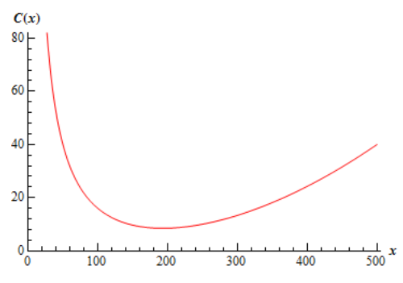

# Section 4.14 : Business Applications

In the final section of this chapter let's take a look at some applications of
derivatives in the business world. For the most part these are really
applications that we've already looked at, but they are now going to be
approached with an eye towards the business world.

Let's start things out with a couple of optimization problems. We've already
looked at more than a few of these in previous sections so there really isn't
anything all that new here except for the fact that they are coming out of the
business world.

---

**Example 1** An apartment complex has 250 apartments to rent. If they rent $x$
apartments then their monthly profit, in dollars, is given by,

$$ P(x) = -8x^2 + 3200x - 80,000 $$

How many apartments should they rent in order to maximize their profit?

**Solution**

All that we’re really being asked to do here is to maximize the profit subject
to the constraint that $x$ must be in the range $0 \leq x \leq 250$.

First, we'll need the derivative and the critical point(s) that fall in the
range $0 \leq x \leq 250$.

$$ P'(x) = -16x + 3200 \quad \Rightarrow \quad 3200 - 16x = 0 \quad \Rightarrow \quad x = \frac{3200}{16} = 200 $$

Since the profit function is continuous and we have an interval with finite
bounds we can find the maximum value by simply plugging in the only critical
point that we have (which nicely enough in the range of acceptable answers) and
the end points of the range.

$$ P(0) = -80,000 \quad \quad P(200) = 240,000 \quad \quad P(250) = 220,000 $$

So, it looks like they will generate the most profit if they only rent out 200
of the apartments instead of all 250 of them.

---

Note that with these problems you shouldn't just assume that renting all the
apartments will generate the most profit. Do not forget that there are all sorts
of maintenance costs and that the more tenants renting apartments the more the
maintenance costs will be. With this analysis we can see that, for this complex
at least, something probably needs to be done to get the maximum profit more
towards full capacity. This kind of analysis can help them determine just what
they need to do to move towards that goal whether it be raising rent or finding
a way to reduce maintenance costs.

Note as well that because most apartment complexes have at least a few units
empty after a tenant moves out and the like that it’s possible that they would
actually like the maximum profit to fall slightly under full capacity to take
this into account. Again, another reason to not just assume that maximum profit
will always be at the upper limit of the range.

Let's take a quick look at another problem along these lines.

---

**Example 2** A production facility is capable of producing 60,000 widgets in a
day and the total daily cost of producing $x$ widgets in a day is given by,

$$ C(x) = 250,000 + 0.08x + \frac{200,000,000}{x} $$

How many widgets per day should they produce in order to minimize production
costs?

**Solution**

Here we need to minimize the cost subject to the constraint that $x$ must be in
the range $0 \leq x \leq 60,000$. Note that in this case the cost function is
not continuous at the left endpoint and so we won't be able to just plug
critical points and endpoints into the cost function to find the minimum value.

Let's get the first couple of derivatives of the cost function.

$$ C'(x) = 0.08 - \frac{200,000,000}{x^2} \quad \quad C''(x) = \frac{400,000,000}{x^3} $$

The critical points of the cost function are,

$$ 0.08 - \frac{200,000,000}{x^w} = 0 $$

$$ 0.08x^2 = 200,000,000 $$

$$ x^2 = 2,500,000,000 \quad \quad \Rightarrow \quad \quad x = \pm \sqrt{2,500,000,000} = \pm 50,000 $$

Now, clearly the negative value doesn’t make any sense in this setting and so we
have a single critical point in the range of possible solutions : 50,000.

Now, as long as $x > 0$ the second derivative is positive and so, in the range
of possible solutions the function is always concave up and so producing 50,000
widgets will yield the absolute minimum production cost.

Recall from the
[**Optimization**](https://tutorial.math.lamar.edu/Classes/CalcI/Optimization.aspx#DerivApps_Opt_Verify)
section we discussed how we can use the second derivative to identity the
absolute extrema even though all we really get from it is relative extrema.

---

Now, we shouldn't walk out of the previous two examples with the idea that the
only applications to business are just applications we've already looked at but
with a business "twist" to them.

There are some very real applications to calculus that are in the business world
and at some level that is the point of this section. Note that to really learn
these applications and all of their intricacies you'll need to take a business
course or two or three. In this section we're just going to scratch the surface
and get a feel for some of the actual applications of calculus from the business
world and some of the main "buzz" words in the applications.

Let's start off by looking at the following example.

---

**Example 3** The production costs per week for producing $x$ widgets is given
by,

$$ C(x) = 500 + 350x - 0.09x^2 \text{, } \quad 0 \leq x \leq 1000 $$

Answer each of the following questions.

**(a)** What is the cost to produce the 301st widget?

**Solution**

We can’t just compute $C(301)$ as that is the cost of producing 301 widgets
while we are looking for the actual cost of producing the 301st
widget. In other words, what we're looking for here is,

$$ C(301) - C(300) = 97,695.91 - 97,400.00 = 295.91 $$

So, the cost of producing the 301st widget is $295.91.

**(b)** What is the rate of change of the cost at $x = 300$?

**Solution**

In this part all we need to do is get the derivative and then compute $C'(300)$.

$$ C'(x) = 350 - 0.18x \quad \Rightarrow \quad C'(300) = 296.00 $$

---

Okay, so just what did we learn in this example? The cost to produce an
additional item is called the **marginal cost** and as we’ve seen in the above
example the marginal cost is approximated by the rate of change of the **cost
function**, $C(x)$. So, we define the **marginal cost function** to be the
derivative of the cost function or, $C'(x)$. Let's work a quick example of this.

---

**Example 4** The production costs per day for some widget is given by,

$$ C(x) = 2500 - 10x - 0.01x^2 + 0.0002x^3 $$

What is the marginal cost when $x = 200$, $x = 300$ and $x = 400$?

**Solution**

So, we need the derivative and then we'll need to compute some values of the
derivative.

$$ C'(x) = -10 - 0.02x + 0.0006x^2 $$

$$ C'(200) = 10 \quad \quad C'(300) = 38 \quad \quad C'(400) = 78 $$

So, in order to produce the 201st widget it will cost approximately
$10. To produce the 301st widget will cost around $38. Finally, to
product the 401st widget it will cost approximately $78.

---

Note that it is important to note that $C'(n)$ is the approximate cost of
producing the $(n + 1)$st item and NOT the nth item as it
may seem to imply!

Let's now turn our attention to the **average cost** function. If $C(x)$ is the
cost function for some item then the average cost function is,

$$ \overline{C}(x) = \frac{C(x)}{x} $$

Here is the sketch of the average cost function from Example 4 above.

We can see from this that the average cost function has an absolute minimum. We
can also see that this absolute minimum will occur at a critical point when
$\overline{C}'(x) = 0$ since it clearly will have a horizontal tangent there.

Now, we could get the average cost function, differentiate that and then find
the critical point. However, this average cost function is fairly typical for
average cost functions so let's instead differentiate the general formula above
using the quotient rule and see what we have.

$$ \overline{C}'(x) = \frac{xC'(x) - C(x)}{x^2} $$

Now, as we noted above the absolute minimum will occur when
$\overline{C}'(x) = 0$ and this will in turn occur when,

$$ xC'(x) - C(x) = 0 \quad \quad \Rightarrow \quad \quad C'(x) = \frac{C(x)}{x} = \overline{C}(x) $$

So, we can see that it looks like for a typical average cost function we will
get the minimum average cost when the marginal cost is equal to the average
cost.

We should note however that not all average cost functions will look like this
and so you shouldn't assume that this will always be the case.

Let's now move onto the revenue and profit functions. First, let's suppose that
the price that some item can be sold at if there is a demand for $x$ units is
given by $p(x)$. This function is typically called either the **demand
function** or the **price function**.

The **revenue function** is then how much money is made by selling $x$ items and
is,

$$ R(x) = xp(x) $$

The **profit function** is then,

$$ P(x) = R(x) - C(x) = xp(x) - C(x) $$

Be careful not to confuse the demand function, $p(x)$ -lower case $p$, and the
profit function, $P(x)$ - upper case $P$. Bad notation maybe, but there it is.

Finally, the **marginal revenue function** is $R'(x)$ and the **marginal profit
function** is $P'(x)$ and these represent the revenue and profit respectively if
one more unit is sold.

Let's take a quick look at an example using these.

---

**Example 5** The weekly cost to produce $x$ widgets is given by

$$ C(x) = 75,000 + 100x - 0.03x^2 + 0.000004x^3 \quad \quad 0 \leq x \leq 10000 $$

and the demand function for the widgets is given by,

$$ p(x) = 200 - 0.005x \quad \quad 0 \leq x \leq 10000 $$

Determine the marginal cost, marginal revenue and marginal profit when 2500
widgets are sold and when 7500 widgets are sold. Assume that the company sells
exactly what they produce.

**Solution**

Okay, the first thing we need to do is get all the various functions that we'll
need. Here are the revenue and profit functions.

$$ R(x) = x(200 - 0.005x) = 200x - 0.005x^2 $$

$$ P(x) = 200x - 0.005x^2 - \left(75,000 + 100x - 0.03x^2 + 0.000004x^3\right) $$

$$ \quad = -75,000 + 100x + 0.025x^2 - 0.000004x^3 $$

Now, all the marginal functions are,

$$ C'(x) = 100 - 0.06x + 0.000012x^2 $$

$$ R'(x) = 200 - 0.01x $$

$$ P'(x) = 100 + 0.05x - 0.000012x^2 $$

The marginal functions when 2500 widgets are sold are,

$$ C'(2500) = 25 \quad \quad R'(2500) = 175 \quad \quad P'(2500) = 150 $$

The marginal functions when 7500 are sold are,

$$ C'(7500) = 325 \quad \quad R'(7500) = 125 \quad \quad P'(7500) = -200 $$

So, upon producing and selling the 2501st widget it will cost the
company approximately $25 to produce the widget and they will see an added $175
in revenue and $150 in profit.

On the other hand, when they produce and sell the 7501st widget it
will cost an additional $325 and they will receive an extra $125 in revenue, but
lose $200 in profit.

---

We'll close this section out with a brief discussion on maximizing the profit.
If we assume that the maximum profit will occur at a critical point such that
$P'(x) = 0$ we can then say the following,

$$ P'(x) = R'(x) - C'(x) = 0 \quad \quad \Rightarrow \quad \quad R'(x) = C'(x) $$

We then will know that this will be a maximum we also were to know that the
profit was always concave down or,

$$ P''(x) = R''(x) - C''(x)' < 0 \quad \quad \Rightarrow \quad \quad R''(x) < C''(x) $$

So, if we know that $R''(x) < C''(x)$ then we will maximize the profit if
$R'(x) = C'(x)$ or if the marginal cost equals the marginal revenue.

In this section we took a brief look at some of the ideas in the business world
that involve calculus. Again, it needs to be stressed however that there is a
lot more going on here and to really see how these applications are done you
should really take some business courses. The point of this section was to just
give a few ideas on how calculus is used in a field other than the sciences.

---

## Practice Problems

**1.** A company can produce a maximum of 1500 widgets in a year. If they sell x
widgets during the year then their profit, in dollars, is given by,

$$ P(x) = 30,000,000 - 360,000x + 750x^2 - \frac{1}{3}x^3 $$

How many widgets should they try to sell in order to maximize their profit?

**Solution**

**2.** A management company is going to build a new apartment complex. They know
that if the complex contains x apartments the maintenance costs for the
building, landscaping etc. will be,

$$ C(x) = 4000 + 14x - 0.04x^2 $$

The land they have purchased can hold a complex of at most 500 apartments. How
many apartments should the complex have in order to minimize the maintenance
costs?

**Solution**

**3.** The production costs, in dollars, per day of producing x widgets is given
by,

$$ C(x) = 1750 + 6x - 0.04x^2 + 0.0003x^3 $$

What is the marginal cost when $x = 175$ and $x = 300$? What do your answers
tell you about the production costs?

**Solution**

**4.** The production costs, in dollars, per month of producing x widgets is
given by,

$$ C(x) = 200 + 0.5x + \frac{10000}{x} $$

What is the marginal cost when $x = 200$ and $x = 500$? What do your answers
tell you about the production costs?

**Solution**

**5.** The production costs, in dollars, per week of producing x widgets is
given by,

$$ C(x) = 4000 - 32x + 0.08x^2 + 0.00006x^3 $$

and the demand function for the widgets is given by,

$$ p(x) = 250 + 0.02x - 0.001x^2 $$

What is the marginal cost, marginal revenue and marginal profit when $x = 200$
and $x = 400$? What do these numbers tell you about the cost, revenue and
profit?

**Solution**

---

## Assignment Problems

**1.** A company can produce a maximum of 2500 widgets in a year. If they sell x
widgets during the year then their profit, in dollars, is given by,

$$ P(x) = 500,000,000 - 1,540,000x + 1450x^2 - \frac{1}{3}x^3 $$

How many widgets should they try to sell in order to maximize their profit?

**Solution**

**2.** A company can produce a maximum of 25 widgets in a day. If they sell x
widgets during the day then their profit, in dollars, is given by,

$$ P(x) = 3000 - 40x + 11x^2 - \frac{1}{3}x^3 $$

How many widgets should they try to sell in order to maximize their profit?

**Solution**

**3.** A management company is going to build a new apartment complex. They know
that if the complex contains x apartments the maintenance costs for the
building, landscaping etc. will be,

$$ C(x) = 70,000 + \frac{2736}{5}x - \frac{211}{50}x^2 + \frac{1}{150}x^3 $$

The land they have purchased can hold a complex of at most 400 apartments. How
many apartments should the complex have in order to minimize the maintenance
costs?

**Solution**

**4.** The production costs of producing x widgets is given by,

$$ C(x) = 2000 + 4x + \frac{90,000}{x} $$

If the company can produce at most 200 widgets how many should they produce to
minimize the production costs?

**Solution**

**5.** The production costs, in dollars, per day of producing x widgets is given
by,

$$ C(x) = 400 - 3x + 2x^2 + 0.002x^3 $$

What is the marginal cost when $x = 20$ and $x = 75$? What do your answers tell
you about the production costs?

**Solution**

**6.** The production costs, in dollars, per month of producing x widgets is
given by,

$$ C(x) = 10,000 + 14x - \frac{8,000,000}{x^2} $$

What is the marginal cost when $x = 80$ and $x = 150$? What do your answers tell
you about the production costs?

**Solution**

**7.** The production costs, in dollars, per week of producing x widgets is
given by,

$$ C(x) = 65,000 + 4x + 0.2x^2 - 0.00002x^3 $$

and the demand function for the widgets is given by,

$$ p(x) = 5000 - 0.5x $$

What is the marginal cost, marginal revenue and marginal profit when $x = 2000$
and $x = 4800$? What do these numbers tell you about the cost, revenue and
profit?

**Solution**

**8.** The production costs, in dollars, per week of producing x widgets is
given by,

$$ C(x) = 800 + 0.008x^2 + \frac{56,000}{x} $$

and the demand function for the widgets is given by,

$$ p(x) = 350 - 0.05x - 0.001x^2 $$

What is the marginal cost, marginal revenue and marginal profit when $x = 175$
and $x = 325$? What do these numbers tell you about the cost, revenue and
profit?

**Solution**
