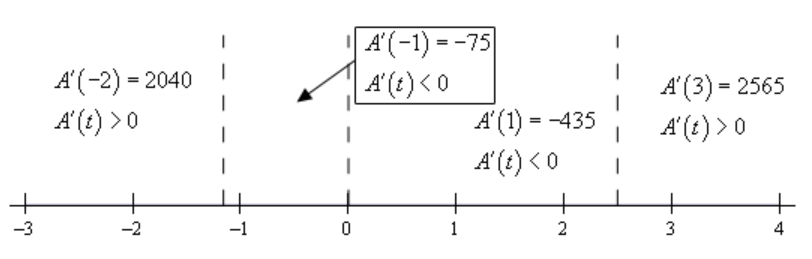
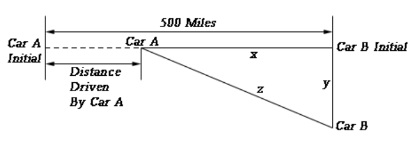

# Section 4.1 : Rates Of Change

The purpose of this section is to remind us of one of the more important
applications of derivatives. That is the fact that $f'(x)$ represents the rate
of change of $f(x)$. This is an application that we repeatedly saw in the
previous chapter. Almost every section in the previous chapter contained at
least one problem dealing with this application of derivatives. While this
application will arise occasionally in this chapter we are going to focus more
on other applications in this chapter.

So, to make sure that we don't forget about this application here is a brief set
of examples concentrating on the rate of change application of derivatives. Note
that the point of these examples is to remind you of material covered in the
previous chapter and not to teach you how to do these kinds of problems. If you
don't recall how to do these kinds of examples you'll need to go back and review
the previous chapter.

---

**Example 1** Determine all the points where the following function is not
changing.

$$ g(x) = 5 - 6x - 10\cos(2x) $$

**Solution**

First, we'll need to take the derivative of the function.

$$ g'(x) = -6 + 20\sin(2x) $$

Now, the function will not be changing if the rate of change is zero and so to
answer this question we need to determine where the derivative is zero. So,
let's set this equal to zero and solve.

$$ -6 + 20\sin(2x) = 0 \quad \Rightarrow \quad \sin(2x) = \frac{6}{20} = 0.3 $$

The solution to this is then,

$$ 2x = 0.3047 + 2\pi n \quad \text{ OR } \quad 2x = 2.8369 + 2\pi n \quad n = 0, \pm 1, \pm 2, \dots \quad \quad (1) $$

$$ x = 0.1524 + \pi n \quad \text{ OR } \quad x = 1.4185 + \pi n \quad n = 0, \pm 1, \pm 2, \dots \quad \quad (2) $$

If you don’t recall how to solve trig equations check out the
[**Solving Trig Equations**](https://tutorial.math.lamar.edu/Classes/CalcI/TrigEquations_CalcI.aspx)
sections in the Review Chapter.

---

---

**Example 2** Determine where the following function is increasing and
decreasing.

$$ A(t) = 27t^5 - 45t^4 - 130t^3 + 150 $$

**Solution**

As with the first problem we first need to take the derivative of the function.

$$ A'(t) = 135t^4 - 180t^3 - 390t^2 = 15t^2\left(9t^2 - 12t - 26\right) $$

Next, we need to determine where the function isn't changing. This is at,

$$ t = 0 $$

$$ t = \frac{12 \pm \sqrt{144 - 9(9)(-26)}}{18} = \frac{12 \pm \sqrt{1080}}{18} = \frac{12 \pm 6\sqrt{30}}{18} = \frac{2 \pm \sqrt{30}}{3} = -1.159 \text{, } 2.492 $$

So, the function is not changing at three values of $t$. Finally, to determine
where the function is increasing or decreasing we need to determine where the
derivative is positive or negative. Recall that if the derivative is positive
then the function must be increasing and if the derivative is negative then the
function must be decreasing. The following number line gives this information.

So, from this number line we can see that we have the following increasing and
decreasing information.

$$ \text{Increasing : } -\infty < t < -1.159 \text{, } 2.492 < t < \infty \quad \text{Decreasing : } - 1.159 < t < 0 \text{, } 0 < t < 2.492 $$

---

f you don’t remember how to solve polynomial and rational inequalities then you
should check out the appropriate sections in the Review Chapter.

Finally, we can't forget about
[**Related Rates**](https://tutorial.math.lamar.edu/Classes/CalcI/RelatedRates.aspx)
problems.

---

**Example 3** Two cars start out 500 miles apart. Car A is to the west of Car B
and starts driving to the east (i.e. towards Car B) at 35 mph and at the same
time Car B starts driving south at 50 mph. After 3 hours of driving at what rate
is the distance between the two cars changing? Is it increasing or decreasing?

**Solution**

The first thing to do here is to get sketch a figure showing the situation.

In this figure $y$ represents the distance driven by Car B and $x$ represents
the distance separating Car A from Car B’s initial position and $z$ represents
the distance separating the two cars. After 3 hours driving time with have the
following values of $x$ and $y$.

$$ x = 500 - 35(3) = 395 \quad \quad y = 50(3) = 150 $$

We can use the Pythagorean theorem to find $z$ at this time as follows,

$$ z^2 = 395^2 + 150^2 = 178525 \quad \Rightarrow \quad z = \sqrt{178525} = 422.5222 $$

Now, to answer this question we will need to determine $z'$ given that
$x' = -35$ and $y' = 50$. Do you agree with the signs on the two given rates?
Remember that a rate is negative if the quantity is decreasing and positive if
the quantity is increasing.

We can again use the Pythagorean theorem here. First, write it down and the
remember that $x$, $y$, and $z$ are all changing with time and so differentiate
the equation using
[**Implicit Differentiation**](https://tutorial.math.lamar.edu/Classes/CalcI/ImplicitDiff.aspx).

Finally, all we need to do is cancel a two from everything, plug in for the
known quantities and solve for $z'$.

$$ z'(422.5222) = (395)(-35) + (150)(50) \quad \Rightarrow \quad z' = \frac{-6325}{422.5222} = -14.9696 $$

---

So, in this section we covered three "standard" problems using the idea that the
derivative of a function gives the rate of change of the function. As mentioned
earlier, this chapter will be focusing more on other applications than the idea
of rate of change, however, we can't forget this application as it is a very
important one.

---

## Practice Problems

As noted in the text for this section the purpose of this section is only to
remind you of certain types of applications that were discussed in the previous
chapter. As such there aren't any problems written for this section. Instead
here is a list of links (note that these will only be active links in the web
version and not the pdf version) to problems from the relevant sections from the
previous chapter.

Each of the following sections has a selection of increasing/decreasing problems
towards the bottom of the problem set.

[**Differentiation Formulas**](https://tutorial.math.lamar.edu/Problems/CalcI/DiffFormulas.aspx)

[**Product & Quotient Rules**](https://tutorial.math.lamar.edu/Problems/CalcI/ProductQuotientRule.aspx)

[**Derivatives of Trig Functions**](https://tutorial.math.lamar.edu/Problems/CalcI/DiffTrigFcns.aspx)

[**Derivatives of Exponential and Logarithm Functions**](https://tutorial.math.lamar.edu/Problems/CalcI/DiffExpLogFcns.aspx)

[**Chain Rule**](https://tutorial.math.lamar.edu/Problems/CalcI/ChainRule.aspx)

Related Rates problems are in the
[**Related Rates**](https://tutorial.math.lamar.edu/Problems/CalcI/RelatedRates.aspx)
section.

---

## Assignment Problems

As noted in the text for this section the purpose of this section is only to
remind you of certain types of applications that were discussed in the previous
chapter. As such there aren't any problems written for this section. Instead
here is a list of links (note that these will only be active links in the web
version and not the pdf version) to problems from the relevant sections from the
previous chapter.

Each of the following sections has a selection of increasing/decreasing problems
towards the bottom of the problem set.

[**Differentiation Formulas**](https://tutorial.math.lamar.edu/Problems/CalcI/DiffFormulas.aspx)

[**Product & Quotient Rules**](https://tutorial.math.lamar.edu/Problems/CalcI/ProductQuotientRule.aspx)

[**Derivatives of Trig Functions**](https://tutorial.math.lamar.edu/Problems/CalcI/DiffTrigFcns.aspx)

[**Derivatives of Exponential and Logarithm Functions**](https://tutorial.math.lamar.edu/Problems/CalcI/DiffExpLogFcns.aspx)

[**Chain Rule**](https://tutorial.math.lamar.edu/Problems/CalcI/ChainRule.aspx)

Related Rates problems are in the
[**Related Rates**](https://tutorial.math.lamar.edu/Problems/CalcI/RelatedRates.aspx)
section.
