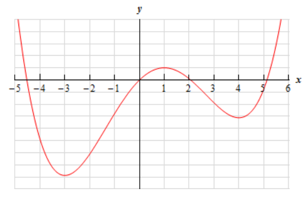
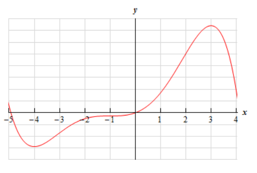
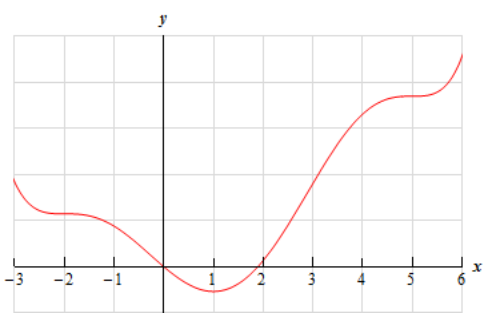

# Section 4.2 : Critical Points

Critical points will show up throughout a majority of this chapter so we first
need to define them and work a few examples before getting into the sections
that actually use them.

**Definition**

> We say that $x = c$ is a critical point of the function $f(x)$ if $f(c)$
> exists and if either of the following are true.
>
> $$ f'(c) = 0 \quad \text{ OR } \quad f'(c) \text{ doesn't exist} $$

Note that we require that $f(c)$ exists in order for $x = c$ to actually be a
critical point. This is an important, and often overlooked, point. What this is
really saying is that all critical points must be in the domain of the function.
If a point is not in the domain of the function then it is not a critical point.

Note as well that, at this point, we only work with real numbers and so any
complex numbers that might arise in finding critical points (and they will arise
on occasion) will be ignored. There are portions of calculus that work a little
differently when working with complex numbers and so in a first calculus class
such as this we ignore complex numbers and only work with real numbers. Calculus
with complex numbers is beyond the scope of this course and is usually taught in
higher level mathematics courses.

The main point of this section is to work some examples finding critical points.
So, let's work some examples.

---

**Example 1** Determine all the critical points for the function.

$$ f(x) = 6x^5 + 33x^4 - 30x^3 + 100 $$

**Solution**

We first need the derivative of the function in order to find the critical
points and so let's get that and notice that we'll factor it as much as possible
to make our life easier when we go to find the critical points.

$$ f'(x) = 30x^4 + 132x^3 - 90x^2 $$

$$ \quad = 6x^2\left(5x^2 + 22x - 15\right) $$

$$ \quad = 6x^2(5x - 3)(x + 5) $$

Now, our derivative is a polynomial and so will exist everywhere. Therefore, the
only critical points will be those values of $x$ which make the derivative zero.
So, we must solve.

$$ 6x^2(5x - 3)(x + 5) = 0 $$

Because this is the factored form of the derivative it's pretty easy to identify
the three critical points. They are,

$$ x = -5 \text{, } x = 0 \text{, } x = \frac{3}{5} $$

---

Polynomials are usually fairly simple functions to find critical points for
provided the degree doesn't get so large that we have trouble finding the roots
of the derivative.

Most of the more "interesting" functions for finding critical points aren't
polynomials however. So let's take a look at some functions that require a
little more effort on our part.

---

**Example 2** Determine all the critical points for the function.

$$ g(t) = \sqrt[3]{t^2}(2t - 1) $$

**Solution**

To find the derivative it's probably easiest to do a little simplification
before we actually differentiate. Let's multiply the root through the
parenthesis and simplify as much as possible. This will allow us to avoid using
the product rule when taking the derivative.

$$ g(t) = t^{\frac{2}{3}}(2t - 1) = 2t^{\frac{5}{3}} - t^{\frac{2}{3}} $$

Now differentiate.

$$ g'(t) = \frac{10}{3}t^{\frac{2}{3}} - \frac{2}{3}t^{-\frac{1}{3}} = \frac{10t^{\frac{2}{3}}}{3} - \frac{2}{3t^{\frac{1}{3}}} $$

We will need to be careful with this problem. When faced with a negative
exponent it is often best to eliminate the minus sign in the exponent as we did
above. This isn't really required but it can make our life easier on occasion if
we do that.

Notice as well that eliminating the negative exponent in the second term allows
us to correctly identify why $t = 0$ is a critical point for this function. Once
we move the second term to the denominator we can clearly see that the
derivative doesn’t exist at $t = 0$ and so this will be a critical point. If you
don't get rid of the negative exponent in the second term many people will
incorrectly state that $t = 0$ is a critical point because the derivative is
zero at $t = 0$. While this may seem like a silly point, after all in each case
$t = 0$ is identified as a critical point, it is sometimes important to know why
a point is a critical point. In fact, in a couple of sections we'll see a fact
that only works for critical points in which the derivative is zero.

So, we've found one critical point (where the derivative doesn't exist), but we
now need to determine where the derivative is zero (provided it is of
course...). To help with this it's usually best to combine the two terms into a
single rational expression. So, getting a common denominator and combining gives
us,

$$ g'(t) = \frac{10t - 2}{3t^{\frac{1}{3}}} $$

Notice that we still have $t = 0$ as a critical point. Doing this kind of
combining should never lose critical points, it's only being done to help us
find them. As we can see it's now become much easier to quickly determine where
the derivative will be zero. Recall that a rational expression will only be zero
if its numerator is zero (and provided the denominator isn't also zero at that
point of course).

So, in this case we can see that the numerator will be zero if
$t = \dfrac{1}{5}$ and so there are two critical points for this function.

$$ t = 0 \quad \text{ and } \quad t = \frac{1}{5} $$

---

---

**Example 3** Determine all the critical points for the function.

$$ R(w) = \frac{w^2 + 1}{w^2 - w - 6} $$

**Solution**

We'll leave it to you to verify that using the quotient rule, along with some
simplification, we get that the derivative is,

$$ R'(w) = \frac{-w^2 - 14w + 2}{\left(w^2 - w - 6\right)^2} = -\frac{w^2 + 14w - 1}{\left(w^2 - w - 6\right)^2} $$

Notice that we factored a "-1" out of the numerator to help a little with
finding the critical points. This negative out in front will not affect the
derivative whether or not the derivative is zero or not exist but will make our
work a little easier.

Now, we have two issues to deal with. First the derivative will not exist if
there is division by zero in the denominator. So we need to solve,

$$ w^2 - w - 6 = (w - 3)(w + 2) = 0 $$

We didn't bother squaring this since if this is zero, then zero squared is still
zero and if it isn't zero then squaring it won't make it zero.

So, we can see from this that the derivative will not exist at $w = 3$ and
$w = −2$. However, these are NOT critical points since the function will also
not exist at these points. Recall that in order for a point to be a critical
point the function must actually exist at that point.

At this point we need to be careful. The numerator doesn't factor, but that
doesn't mean that there aren’t any critical points where the derivative is zero.
We can use the quadratic formula on the numerator to determine if the fraction
as a whole is ever zero.

$$ w = \frac{-14 \pm \sqrt{(14)^2 - 4(1)(-1)}}{2(1)} = \frac{-14 \pm \sqrt{200}}{2} = \frac{-14 \pm 10\sqrt{2}}{2} = -7 \pm 5\sqrt{2} $$

So, we get two critical points. Also, these are not "nice" integers or
fractions. This will happen on occasion. Don’t get too locked into answers
always being "nice". Often they aren't.

Note as well that we only use real numbers for critical points. So, if upon
solving the quadratic in the numerator, we had gotten complex number these would
not have been considered critical points.

Summarizing, we have two critical points. They are,

$$ w = -7 + 5\sqrt{2} \text{, } w = -7 - 5\sqrt{2} $$

Again, remember that while the derivative doesn’t exist at $w = 3$ and $w = −2$
neither does the function and so these two points are not critical points for
this function.

---

In the previous example we had to use the quadratic formula to determine some
potential critical points. We know that sometimes we will get complex numbers
out of the quadratic formula. Just remember that, as mentioned at the start of
this section, when that happens we will ignore the complex numbers that arise.

So far all the examples have not had any trig functions, exponential functions,
_etc._ in them. We shouldn't expect that to always be the case. So, let's take a
look at some examples that don't just involve powers of $x$.

---

**Example 4** Determine all the critical points for the function.

$$ y = 6x - 4\cos(3x) $$

**Solution**

First get the derivative and don't forget to use the chain rule on the second
term.

$$ y' = 6 + 12\sin(3x) $$

Now, this will exist everywhere and so there won't be any critical points for
which the derivative doesn't exist. The only critical points will come from
points that make the derivative zero. We will need to solve,

$$ 6 + 12\sin(3x) = 0 $$

$$ \sin(3x) = -\frac{1}{2} $$

Solving this equation gives the following.

$$ 3x = 3.6652 + 2\pi n \text{, } \quad n = 0, \pm 1, \pm 2, \dots $$

$$ 3x = 5.7596 + 2\pi n \text{, } \quad n = 0, \pm 1, \pm 2, \dots $$

Don't forget the $2\pi n$ on these! There will be problems down the road in
which we will miss solutions without this! Also make sure that it gets put on at
this stage! Now divide by 3 to get all the critical points for this function.

$$ x = 1.2217 + \frac{2\pi n}{3} \text{, } \quad n = 0, \pm 1, \pm 2, \dots $$

$$ x = 1.9199 + \frac{2\pi n}{3} \text{, } \quad n = 0, \pm 1, \pm 2, \dots $$

---

Notice that in the previous example we got an infinite number of critical
points. That will happen on occasion so don't worry about it when it happens.

---

**Example 5** Determine all the critical points for the function.

$$ h(t) = 10t\mathbf{e}^{3 - t^2} $$

**Solution**

Here's the derivative for this function.

$$ h'(t) = 10\mathbf{e}^{3 - t^2} + 10t\mathbf{e}^{3 - t^2}(-2t) = 10\mathbf{e}^{3 - t^2} - 20t^2\mathbf{e}^{3 - t^2} $$

Now, this looks unpleasant, however with a little factoring we can clean things
up a little as follows

$$ h'(t) = 10\mathbf{e}^{3 - t^2}\left(1 - 2t^2\right) $$

This function will exist everywhere, so no critical points will come from the
derivative not existing. Determining where this is zero is easier than it looks.
We know that exponentials are never zero and so the only way the derivative will
be zero is if,

$$ 1 - 2t^2 = 0 $$

$$ 1 = 2t^2 $$

$$ \frac{1}{2} = t^2 $$

We will have two critical points for this function.

$$ t = \pm \frac{1}{\sqrt{2}} $$

---

---

**Example 6** Determine all the critical points for the function.

$$ f(x) = x^2\ln(3x) + 6 $$

**Solution**

Before getting the derivative let’s notice that since we can’t take the log of a
negative number or zero we will only be able to look at $x > 0$.

The derivative is then,

$$ f'(x) = 2x\ln(3x) + x^2\left(\frac{3}{3x}\right) $$

$$ \quad = 2x\ln(3x) + x $$

$$ \quad = x(2\ln(3x) + 1) $$

Now, this derivative will not exist if $x$ is a negative number of if $x = 0$,
but then again neither will the function and so these are not critical points.
Remeber that the function will only exist if $x > 0$ and nicely enough the
derivative will also only exist if $x > 0$ and so the only thing we need to
worry about is where the derivative is zero.

First note that, despite appearances, the derivative will not be zero for
$x = 0$. As noted above the derivative doesn’t exist at $x = 0$ because of the
natural logarithm and so the derivative can't be zero there!

So, the derivative will only be zero if,

$$ 2\ln(3x) + 1 = 0 $$

$$ \ln(3x) = -\frac{1}{2} $$

Recall that we can solve this by exponentiating both sides.

$$ \mathbf{e}^{\ln(3x)} = \mathbf{e}^{-\frac{1}{2}} $$

$$ 3x = \mathbf{e}^{-\frac{1}{2}} $$

$$ x = \frac{1}{3}\mathbf{e}^{-\frac{1}{2}} = \frac{1}{3\sqrt{\mathbf{e}}} $$

There is a single critical point for this function.

---

Let's work one more problem to make a point.

---

**Example 7** Determine all the critical points for the function.

$$ f(x) = x\mathbf{e}^{x^2} $$

**Solution**

Note that this function is not much different from the function used in
Example 5. In this case the derivative is,

$$ f'(x) = \mathbf{e}^{x^2} + x\mathbf{e}^{x^2}(2x) = \mathbf{e}^{x^2}\left(1 + 2x^2\right) $$

This function will never be zero for any real value of $x$. The exponential is
never zero of course and the polynomial will only be zero if $x$ is complex and
recall that we only want real values of $x$ for critical points.

Therefore, this function will not have any critical points.

---

It is important to note that not all functions will have critical points! In
this course most of the functions that we will be looking at do have critical
points. That is only because those problems make for more interesting examples.
Do not let this fact lead you to always expect that a function will have
critical points. Sometimes they don't as this final example has shown.

---

## Practice Problems

Determine the critical points of each of the following functions.

**1.** $f(x) = 8x^3 + 81x^2 - 42x - 8$

**Solution**

There is no divisions or square roots or logarithms here, so the domain of this
function is all real numbers.

$$ f'(x) = 24x^2 + 162x - 42 $$

$$ 0 = 24x^2 + 162x - 42 $$

$$ x = \frac{-(162) \pm \sqrt{(162)^2 - 4(24)(-42)}}{2(24)} $$

$$ x = \frac{-162 \pm 174}{48} $$

$$ \boxed{x = \frac{1}{4} \text{, } x = -7} $$

**2.** $R(t) = 1 + 80t^3 + 5t^4 - 2t^5$

**Solution**

Again, this is a polynomial without divisions, square roots, or logarithms, so
the domain of this function is all real numbers.

$$ R'(t) = 240t^2 + 20t^3 - 10t^4 $$

$$ R'(t) = -10t^2(-24 - 2t + t^2) $$

$$ R'(t) = -10t^2(t^2 - 2t - 24) $$

$$ R'(t) = -10t^2(t - 6)(t + 4) $$

$$ 0 = -10t^2(t - 6)(t + 4) $$

$$ \boxed{t = -4 \text{, } t = 0 \text{, } t = 6} $$

**3.** $g(w) = 2w^3 - 7w^2 - 3w - 2$

**Solution**

Doomain is all real numbers.

$$ g'(w) = 6w^2 - 14w - 3 $$

$$ 0 = 6w^2 - 14w - 3 $$

$$ w = \frac{-(-14) \pm \sqrt{(-14)^2 - 4(6)(-3)}}{2(6)} $$

$$ w = \frac{14 \pm 2\sqrt{67}}{12} $$

$$ w = \frac{7 \pm \sqrt{67}}{6} $$

$$ \boxed{w = \frac{7 + \sqrt{67}}{6} \text{, } w = \frac{7 - \sqrt{67}}{6}} $$

**4.** $g(x) = x^6 - 2x^5 + 8x^4$

**Solution**

Domain is all real numbers.

$$ g'(x) = 6x^5 - 10x^4 + 32x^3 $$

$$ g'(x) = 2x^3(3x^2 - 5x + 16) $$

$$ 0 = 2x^3(3x^2 - 5x + 16) $$

$$ x = 0 $$

$$ x = \frac{-(-5) \pm \sqrt{(-5)^2 - 4(3)(16)}}{2(3)} $$

$$ x = \frac{5 \pm i\sqrt{167}}{6} $$

Since there are no real numbers yielded from this evaluation for our critical
points. We can only ascdertain that $x = 0$ is our only critical point:

$$ \boxed{x = 0} $$

**5.** $h(z) = 4z^3 - 3z^2 + 9z + 12$

**Solution**

Domain is all real numbers.

$$ h'(z) = 12z^2 - 6z + 9 $$

$$ h'(z) = 3(4z^2 - 2z + 3) $$

$$ 0 = 3(4z^2 - 2z + 3) $$

$$ 0 = 4z^2 - 2z + 3 $$

$$ z = \frac{-(-2) \pm \sqrt{(-2)^2 - 4(4)(3)}}{2(4)} $$

$$ z = \frac{2 \pm 2i\sqrt{11}}{8} $$

And there are no critical points found.

$$ \boxed{\text{NO CRITICAL POINTS}} $$

**6.** $Q(x) = (2 - 8x)^4\left(x^2 - 9\right)^3$

**Solution**

The domain is all real numbers.

$$ Q'(x) = \left[(2 - 8x)^4\right]'\left[\left(x^2 - 9\right)^3\right] + \left[(2 - 8x)^4\right]\left[\left(x^2 - 9\right)^3\right]' $$

$$ Q'(x) = \left[4(2 - 8x)^3(2 - 8x)'\right]\left[\left(x^2 - 9\right)^3\right] + \left[(2 - 8x)^4\right]\left[3\left(x^2 - 9\right)^2\left(x^2 - 9\right)'\right] $$

$$ Q'(x) = 4(2 - 8x)^3(-8)\left(x^2 - 9\right)^3 + (2 - 8x)^4(3)\left(x^2 - 9\right)^2(2x) $$

$$ Q'(x) = -32(2 - 8x)^3\left(x^2 - 9\right)^3 + 6x(2 - 8x)^4\left(x^2 - 9\right)^2 $$

$$ Q'(x) = 2(2 - 8x)^3\left(x^2 - 9\right)^2\left[-16\left(x^2 - 9\right) + 3x(2 - 8x)\right] $$

$$ Q'(x) = 2(2 - 8x)^3\left(x^2 - 9\right)^2\left[-16x^2 + 144 + 6x - 24x^2\right] $$

$$ Q'(x) = 2(2 - 8x)^3\left(x^2 - 9\right)^2\left[-40x^2 + 6x + 144\right] $$

$$ Q'(x) = -4(2 - 8x)^3\left(x^2 - 9\right)^2\left[20x^2 - 3x - 72\right] $$

$$ 0 = -4(2 - 8x)^3\left(x^2 - 9\right)^2\left[20x^2 - 3x - 72\right] $$

$$ (2 - 8x)^3 = 0 $$

$$ 2 - 8x = 0 $$

$$ 2 = 8x $$

$$ x = \frac{1}{4} $$

$$ x^2 - 9 = 0 $$

$$ x^2 = 9 $$

$$ x = \pm 3 $$

$$ 20x^2 - 3x - 72 = 0 $$

$$ x = \frac{-(-3) \pm \sqrt{(-3)^2 - 4(20)(-72)}}{2(20)} $$

$$ x = \frac{3 \pm 3\sqrt{641}}{40} $$

Our critical points therefore are:

$$ \boxed{x = \frac{1}{4} \text{, } x = \pm 3 \text{, } x = \frac{3 \pm 3\sqrt{641}}{40}} $$

**7.** $f(z) = \dfrac{z + 4}{2z^2 + z + 8}$

**Solution**

Our domain is restricted by the function's denominator:

$$ 0 = 2z^2 + z + 8 $$

$$ z = \frac{-(1) \pm \sqrt{(1)^2 - 4(2)(8)}}{2(2)} $$

$$ z = \frac{-1 \pm 3i\sqrt{7}}{4} $$

Let's now find our derivative:

$$ f'(z) = \frac{(z + 4)'\left(2z^2 + z + 8\right) - (z + 4)\left(2z^2 + z + 8\right)'}{\left(2z^2 + z + 8\right)^2} $$

$$ f'(z) = \frac{(1)\left(2z^2 + z + 8\right) - (z + 4)(4z + 1)}{\left(2z^2 + z + 8\right)^2} $$

The derivative's factors will be the same as our evaluation for the divison by
zero error itself on the function, so those **cannot** be critical points.
Therefore we only have to evaluate where the numerator is $0$:

$$ 2z^2 + z + 8 - (z + 4)(4z + 1) = 0 $$

$$ 2z^2 + z + 8 - (4z^2 + 17z + 4) = 0 $$

$$ 2z^2 + z + 8 - 4z^2 - 17z - 4 = 0 $$

$$ -2z^2 - 16z + 4 = 0 $$

$$ 2z^2 + 16z - 4 = 0 $$

$$ z^2 + 8z - 2 = 0 $$

$$ z = \frac{-(8) \pm \sqrt{(8)^2 - 4(1)(-2)}}{2(1)} $$

$$ z = \frac{-8 \pm 6\sqrt{2}}{2} $$

$$ \boxed{z = -4 \pm 3\sqrt{2}} $$

**8.** $R(x) = \dfrac{1 - x}{x^2 + 2x - 15}$

**Solution**

Again, our denominator's factors will determine where the **function doesn't
exist**, and therefore where critical points can also not exist.

$$ x^2 + 2x - 15 = 0 $$

$$ (x + 5)(x - 3) = 0 $$

Therefore critical points **cannot** exist at:

$$ x = -5 \text{, } x = 3 $$

Now let's find our derivative:

$$ R'(x) = \frac{(1 - x)'\left(x^2 + 2x - 15\right) - (1 - x)\left(x^2 + 2x - 15\right)'}{\left(x^2 + 2x - 15\right)^2} $$

$$ R'(x) = \frac{(-1)\left(x^2 + 2x - 15\right) - (1 - x)(2x + 2)}{\left(x^2 + 2x - 15\right)^2} $$

Our derivative's denominator will yield the same points that are **not**
critical points, so all we have to do is evaluate where the numerator will
evaluate to $0$ to find our critical points.

$$ -x^2 - 2x + 15 - (1 - x)(2x + 2) = 0 $$

$$ -x^2 - 2x + 15 - (2x - 2x^2 + 2 - 2x) = 0 $$

$$ -x^2 - 2x + 15 - (-2x^2 + 2) = 0 $$

$$ -x^2 - 2x + 15 + 2x^2 - 2 = 0 $$

$$ x^2 - 2x + 13 = 0 $$

$$ x = \frac{-(-2) \pm \sqrt{(-2)^2 - 4(1)(13)}}{2(1)} $$

$$ x = \frac{2 \pm 4i\sqrt{3}}{2} $$

Because we cannot have complex numbers for critical points, we have found **no
critical points**.

$$ \boxed{\text{NO CRITICAL POINTS}} $$

**9.** $r(y) = \sqrt[5]{y^2 - 6y}$

**Solution**

Our domain is all real numbers (an odd number root will never return a complex
number). Let's rewrite our function so taking the derivative will be easier:

$$ r(y) = \left(y^2 - 6y\right)^{\frac{1}{5}} $$

Now find the derivative:

$$ r'(y) = \frac{1}{5}\left(y^2 - 6y\right)^{-\frac{4}{5}}\left(y^2 - 6y\right)' $$

$$ r'(y) = \frac{1}{5}\left(y^2 - 6y\right)^{-\frac{4}{5}}(2y - 6) $$

$$ r'(y) = \frac{2y - 6}{5\left(y^2 - 6y\right)^{\frac{4}{5}}} $$

Now evaluate where $r'(y)$ either doesn't exist (but $r(y)$ still exists), or
equals $0$.

$$ y^2 - 6y = 0 $$

$$ y(y - 6) = 0 $$

$$ y = 0 $$

$$ y = 6 $$

$$ 2y - 6 = 0 $$

$$ 2y = 6 $$

$$ y = 3 $$

So we have critical points at:

$$ \boxed{y = 0\text{, } y = 3\text{, } y = 6} $$

**10.** $h(t) = 15 - (3 - t)\left[t^2 - 8t + 7\right]^{\frac{1}{3}}$

The domain is still all real numbers as a cube root will never yield complex
numbers. Let's take the derivative:

$$ h'(t) = 0 - \left[(3 - t)'\left[\left(t^2 - 8t + 7\right)^{\frac{1}{3}}\right] + (3 - t)\left[\left(t^2 - 8t + 7\right)^{\frac{1}{3}}\right]'\right] $$

$$ h'(t) = 0 - \left[(-1)\left(t^2 - 8t + 7\right)^{\frac{1}{3}} + (3 - t)\left(\frac{1}{3}\right)\left(t^2 - 8t + 7\right)^{-\frac{2}{3}}\left(t^2 - 8t + 7\right)'\right] $$

$$ h'(t) = 0 - \left[(-1)\left(t^2 - 8t + 7\right)^{\frac{1}{3}} + (3 - t)\left(\frac{1}{3}\right)\left(t^2 - 8t + 7\right)^{-\frac{2}{3}}(2t - 8)\right] $$

$$ h'(t) = \left(t^2 - 8t + 7\right)^{\frac{1}{3}} - (3 - t)\left(\frac{1}{3}\right)\left(t^2 - 8t + 7\right)^{-\frac{2}{3}}(2t - 8) $$

$$ h'(t) = \left(t^2 - 8t + 7\right)^{\frac{1}{3}} - \frac{(3 - t)(2t - 8)}{3\left[t^2 - 8t + 7\right]^{\frac{2}{3}}}$$

$$ h'(t) = \frac{3\left(t^2 - 8t + 7\right) - (3 - t)(2t - 8)}{3\left(t^2 - 8t + 7\right)^{\frac{2}{3}}} $$

$$ h'(t) = \frac{\left(3t^2 - 24t + 21\right) - (6t - 2t^2 - 24 + 8t)}{3\left(t^2 - 8t + 7\right)^{\frac{2}{3}}} $$

$$ h'(t) = \frac{\left(3t^2 - 24t + 21\right) - (-2t^2 + 14t - 24)}{3\left(t^2 - 8t + 7\right)^{\frac{2}{3}}} $$

$$ h'(t) = \frac{3t^2 - 24t + 21 + 2t^2 - 14t + 24}{3\left(t^2 - 8t + 7\right)^{\frac{2}{3}}} $$

$$ h'(t) = \frac{5t^2 - 38t + 45}{3\left(t^2 - 8t + 7\right)^{\frac{2}{3}}} $$

The critical points exist where the derivative is zero or where it doesn't
exist.

$$ t^2 - 8t + 7 = 0 \text{ doesn't exist} $$

$$ (t - 1)(t - 7) = 0 $$

Critical points are at:

$$ t = 1 \text{, } t = 7 $$

Now in the numerator:

$$ 5t^2 - 38t + 45 = 0 $$

$$ t = \frac{-(-38) \pm \sqrt{(-38)^2 - 4(5)(45)}}{2(5)} $$

$$ t = \frac{38 \pm 4\sqrt{34}}{10} $$

$$ t = \frac{19 \pm 2\sqrt{34}}{5} $$

So all our critical points are:

$$ \boxed{t = 1 \text{, } t = 7 \text{, } t = \frac{19 \pm 2\sqrt{34}}{5}} $$

**Solution**

**11.** $s(z) = 4\cos(z) - z$

$$ s'(z) = -4\sin(z) - 1 $$

Setting to $0$ will help us find critical points:

$$ -4\sin(z) - 1 = 0 $$

$$ -4\sin(z) = 1 $$

$$ \sin(z) = -\frac{1}{4} $$

We know that sine is negative in Quadrants III and IV. So we can find our two
angles per unit circle revolution by:

$$ \pi - \sin^{-1}\left(-\frac{1}{4}\right) $$

And:

$$ 2\pi + \sin^{-1}\left(-\frac{1}{4}\right) $$

Finding the ArcSine will help us:

$$ \sin^{-1}\left(-\frac{1}{4}\right) \approx -0.2527 $$

Now evaluate thee two angles:

$$ z = \pi - \sin^{-1}\left(-\frac{1}{4}\right) + 2\pi n \text{, } \quad n = 0, \pm 1, \pm 2, \dots $$

$$ z = 2\pi + \sin^{-1}\left(-\frac{1}{4}\right) + 2\pi n \text{, } \quad n = 0, \pm 1, \pm 2, \dots $$

This evaluates to:

$$ \boxed{z \approx 6.0305 + 2\pi n \text{, } \quad n = 0, \pm 1, \pm 2, \dots} $$

$$ \boxed{z \approx 3.3943 + 2\pi n \text{, } \quad n = 0, \pm 1, \pm 2, \dots} $$

**Solution**

**12.** $f(y) = \sin\left(\dfrac{y}{3}\right) + \dfrac{2y}{9}$

**Solution**

$$ f'(y) = \cos\left(\frac{y}{3}\right)\left(\frac{y}{3}\right)' + \frac{(2y)'(9) - (2y)(9)'}{(9)^2} $$

$$ f'(y) = \cos\left(\frac{y}{3}\right)\left(\frac{(y)'(3) - (y)(3)'}{(3)^2}\right) + \frac{(2)(9)}{(9)^2} $$

$$ f'(y) = \cos\left(\frac{y}{3}\right)\left(\frac{3}{9}\right) + \frac{18}{81} $$

$$ f'(y) = \cos\left(\frac{y}{3}\right)\left(\frac{1}{3}\right) + \frac{2}{9} $$

Setting to $0$ will help us:

$$ \frac{1}{3}\left[\cos\left(\frac{y}{3}\right) + \frac{2}{3}\right] = 0 $$

$$ \cos\left(\frac{y}{3}\right) + \frac{2}{3} = 0 $$

$$ \cos\left(\frac{y}{3}\right) = -\frac{2}{3} $$

Finding the arccosine will help us:

$$ \frac{y}{3} = \cos^{-1}\left(-\frac{2}{3}\right) $$

$$ \frac{y}{3} \approx 2.3005 $$

Cosine is positive in Quadrants I and IV.

We can therefore find our other initial unit circle revolution angles like so:

$$ 2\pi - 2.3005 \approx 3.9827 $$

We can then express where our critical points are like so:

$$ \frac{y}{3} \approx 2.3005 + 2 \pi n \text{, } \quad n = 0, \pm 1, \pm 2, \dots $$

$$ \frac{y}{3} \approx 3.9827 + 2 \pi n \text{, } \quad n = 0, \pm 1, \pm 2, \dots $$

And finally evaluate by multiplying every side by $3$:

$$ \boxed{y \approx 6.9015  + 6 \pi n \text{, } \quad n = 0, \pm 1, \pm 2, \dots} $$

$$ \boxed{y \approx 11.9481 + 6 \pi n \text{, } \quad n = 0, \pm 1, \pm 2, \dots} $$

**13.** $V(t) = \sin^2(3t) + 1$

**Solution**

$$ V'(t) = 2\sin(3t)(\sin(3t))' $$

$$ V'(t) = 2\sin(3t)(\cos(3t)(3t)') $$

$$ V'(t) = 2\sin(3t)(\cos(3t)(3)) $$

$$ V'(t) = 6\sin(3t)\cos(3t) $$

Set to $0$:

$$ 6\sin(3t)\cos(3t) = 0 $$

$$ \sin(3t)\cos(3t) = 0 $$

$$ \sin(3t) = 0 $$

$$ \cos(3t) = 0 $$

We have two different trig problems to solve here to find our critical points.
Let's solve Sine first:

$$ \sin(3t) = 0 $$

$$ \sin^{-1}(0) = 3t $$

$$ 0 = 3t $$

We know from the unit circle that sine is $0$ at $0$ and $\pi$ radians.

$$ 3t = 0 + 2\pi n \text{, } \quad n = 0, \pm 1, \pm 2, \dots $$

$$ 3t = \pi + 2\pi n \text{, } \quad n = 0, \pm 1, \pm 2, \dots $$

Which evaluates:

$$ t = \frac{2}{3}\pi n \text{, } \quad n = 0, \pm 1, \pm 2, \dots $$

$$ t = \frac{\pi}{3} + \frac{2}{3}\pi n \text{, } \quad n = 0, \pm 1, \pm 2, \dots $$

And that covers critical points for Sine, what about Cosine?

$$ \cos(3t) = 0 $$

$$ \cos^{-1}(0) = 3t $$

We know that cosine is $0$ on the Unit Circle at $\dfrac{\pi}{2}$ and
$\dfrac{3\pi}{2}$. So:

$$ 3t = \frac{\pi}{2} + 2\pi n \text{, } \quad n = 0, \pm 1, \pm 2, \dots $$

$$ 3t = \frac{3\pi}{2} + 2\pi n \text{, } \quad n = 0, \pm 1, \pm 2, \dots $$

And further evaluated:

$$ t = \frac{\pi}{6} + \frac{2}{3}\pi n \text{, } \quad n = 0, \pm 1, \pm 2, \dots $$

$$ t = \frac{\pi}{2} + \frac{2}{3}\pi n \text{, } \quad n = 0, \pm 1, \pm 2, \dots $$

Thusly our critical points are at:

$$ \boxed{t = \frac{2}{3}\pi n \text{, } \quad n = 0, \pm 1, \pm 2, \dots} $$

$$ \boxed{t = \frac{\pi}{3} + \frac{2}{3}\pi n \text{, } \quad n = 0, \pm 1, \pm 2, \dots} $$

$$ \boxed{t = \frac{\pi}{6} + \frac{2}{3}\pi n \text{, } \quad n = 0, \pm 1, \pm 2, \dots} $$

$$ \boxed{t = \frac{\pi}{2} + \frac{2}{3}\pi n \text{, } \quad n = 0, \pm 1, \pm 2, \dots} $$

**14.** $f(x) = 5x\mathbf{e}^{9 - 2x}$

**Solution**

$$ f'(x) = (5x)'\left(\mathbf{e}^{9 - 2x}\right) + (5x)\left(\mathbf{e}^{9 - 2x}\right)' $$

$$ f'(x) = 5\mathbf{e}^{9 - 2x} + 5x\left(\mathbf{e}^{9 - 2x}(9 - 2x)'\right) $$

$$ f'(x) = 5\mathbf{e}^{9 - 2x} + 5x\left(\mathbf{e}^{9 - 2x}(-2)\right) $$

$$ f'(x) = 5\mathbf{e}^{9 - 2x} - 10x\mathbf{e}^{9 - 2x} $$

$$ f'(x) = 5\mathbf{e}^{9 - 2x}(1 - 2x) $$

Because exponentials can never evaluate to $0$, we only have to solve:

$$ 1 - 2x = 0 $$

$$ 1 = 2x $$

$$ \frac{1}{2} = x $$

So our only critical point is:

$$ \boxed{x = \frac{1}{2}} $$

**15.** $g(w) = \mathbf{e}^{w^3 - 2w^2 - 7w}$

**Solution**

$$ g'(w) = \mathbf{e}^{w^3 - 2w^2 - 7w}\left(w^3 - 2w^2 - 7w\right)' $$

$$ g'(w) = \mathbf{e}^{w^3 - 2w^2 - 7w}\left(3w^2 - 4w - 7\right) $$

Again, exponentials can never be zero, so we have to solve:

$$ 3w^2 - 4w - 7 = 0 $$

$$ w = \frac{-(-4) \pm \sqrt{(-4)^2 - 4(3)(-7)}}{2(3)} $$

$$ w = \frac{4 \pm 10}{6} $$

$$ w = \frac{2 \pm 5}{3} $$

$$ \boxed{w = \frac{7}{3} \text{, } w = -1} $$

**16.** $R(x) = \ln\left(x^2 + 4x + 14\right)$

**Solution**

$$ R'(x) = \frac{1}{x^2 + 4x + 14}\left(x^2 + 4x + 14\right)' $$

$$ R'(x) = \frac{1}{x^2 + 4x + 14}(2x + 4) $$

$$ R'(x) = \frac{2x + 4}{x^2 + 4x + 14} $$

Notice that the function $R(x)$ is a rational number, and will not exist at the
same denominator as it's derivative. Therefore the function will not exist at
any evaluation of the denominator for $0$, and therefore since it is has the
same denominator as it's derivative, we know that there are no critical points
that can be derived by evaluating the derivative's denominator.

Therefore, let's simply evaluate the numerator for $0$.

$$ 2x + 4 = 0 $$

$$ 2x = -4 $$

$$ x = -2 $$

So our only critical point is:

$$ \boxed{x = -2} $$

**17.** $A(t) = 3t - 7\ln(8t + 2)$

**Solution**

Notice that our domain is restricted by the fact that you cannot take the log of
$0$ or any negative number.

$$ A'(t) = 3 - \frac{7}{8t + 2}(8t + 2)' $$

$$ A'(t) = 3 - \frac{7}{8t + 2}(8) $$

$$ A'(t) = 3 - \frac{56}{8t + 2} $$

$$ A'(t) = \frac{3(8t + 2) - 56}{8t + 2} $$

$$ A'(t) = \frac{24t + 6 - 56}{8t + 2} $$

$$ A'(t) = \frac{24t - 50}{8t + 2} $$

Here we evaluate both the denominator and numerator, but since the denominator
is the same as the argument to the logarithm, we don't evaluate that for
critical points, as the function itself would not exist at that point.

Therefore, let's only evaluate where the numerator would be $0$:

$$ 24t - 50 = 0 $$

$$ 24t = 50 $$

$$ t = \frac{50}{24} $$

$$ t = \frac{25}{12} $$

So our critical point is at:

$$ \boxed{t = \frac{25}{12}} $$

---

## Assignment Problems

For problems 1 - 43 determine the critical points of each of the following
functions. Note that a couple of the problems involve equations that may not be
easily solved by hand and as such may require some computational aids. These are
marked are noted below.

**1.** $R(x) = 8x^3 - 18x^2 - 240x + 2$

**Solution**

Domain is all real numbers.

$$ R'(x) = 24x^2 - 36x - 240 $$

$$ R'(x) = 12(2x^2 - 3x - 20) $$

Set to $0$ to find critical points:

$$ 12(2x^2 - 3x - 20) = 0 $$

$$ 2x^2 - 3x - 20 = 0 $$

$$ x = \frac{-(-3) \pm \sqrt{(-3)^2 - 4(2)(-20)}}{2(2)} $$

$$ x = \frac{3 \pm 13}{4} $$

So our critical points are:

$$ \boxed{x = 4 \text{, } x = -\frac{5}{2}} $$

**2.** $f(z) = 2z^4 - 16z^3 + 20z^2 - 7$

**Solution**

Domain is all real numbers.

$$ f'(z) = 8z^3 - 48z^2 + 40z $$

$$ f'(z) = 8z(z^2 - 6z + 5) $$

$$ 8z(z^2 - 6z + 5) = 0 $$

$$ z = 0 $$

$$ z^2 - 6z + 5 = 0 $$

$$ (z - 5)(z - 1) = 0 $$

$$ z = 5 \text{, } z = 1 $$

So our critical points are:

$$ \boxed{z = 0 \text{, } z = 5 \text{, } z = 1} $$

**3.** $g(z) = 8 - 12z^5 - 25z^6 + \dfrac{90}{7}z^7$

**Solution**

Domain is all real numbers.

$$ g'(z) = -60z^4 - 150z^5 + 90z^6 $$

$$ g'(z) = 30z^4\left(-2 - 5z + 3z^2\right) $$

$$ g'(z) = 30z^4\left(3z^2 - 5z - 2\right) $$

$$ 30z^4 = 0 $$

$$ z = 0 $$

$$ 3z^2 - 5z - 2 $$

$$ z = \frac{-(-5) \pm \sqrt{(-5)^2 - 4(3)(-2)}}{2(3)} $$

$$ z = \frac{5 \pm 7}{6} $$

So our critical points are:

$$ \boxed{z = 0 \text{, } z = 2 \text{, } z = -\frac{1}{3}} $$

**4.** $g(t) = 3t^4 - 20t^3 - 132t^2 + 672t - 4$

Note : Depending upon your factoring skills this may require some computational
aids.

**Solution**

Domain is all real numbers.

$$ g'(t) = 12t^3 - 60t^2 - 164t + 672 $$

$$ g'(t) = 4\left(3t^3 - 15t^2 - 41t + 168\right) $$

$$ 4\left(3t^3 - 15t^2 - 41t + 168\right) = 0 $$

$$ 3t^3 - 15t^2 - 41t + 168 = 0 $$

Go to [desmos](https://www.desmos.com/calculator) or use a graphing calculator
and see where $t = 0$ approximately. If you were skilled, you could use the
Rational Zeros Theorem to solve.

Our critical points are:

$$ \boxed{t = -3.49497 \text{, } t = 2.82688 \text{, } t = 5.66809} $$

**5.** $h(x) = 10x^2 - 15x^3 + \dfrac{15}{2}x^4 - x^5$

Note : Depending upon your factoring skills this may require some computational
aids.

**Solution**

Domain is all real numbers.

$$ h'(x) = 20x - 45x^2 + 30x^3 - 5x^4 $$

$$ h'(x) = 5x(4 - 9x + 6x^2 - x^3) $$

$$ x = 0 $$

$$ 4 - 9x + 6x^2 - x^3 = 0 $$

$$ x^3 - 6x^2 + 9x - 4 = 0 $$

Again, if you had the skills, you could solve this without a graphing
calculator/desmos, using the Rational Zeros Theorem, but alas, you are no such
man. So our critical points are:

$$ \boxed{x = 0 \text{, } x = 1 \text{, } x = 4} $$

**6.** $P(w) = w^3 - 4w^2 - 7w - 1$

**Solution**

Domain is all real numbers.

$$ P'(w) = 3w^2 - 8w - 7 $$

$$ 3w^2 - 8w - 7 = 0 $$

$$ w = \frac{-(-8) \pm \sqrt{(-8)^2 - 4(3)(-7)}}{2(3)} $$

$$ w = \frac{8 \pm 2\sqrt{37}}{6} $$

$$ w = \frac{4 \pm \sqrt{37}}{3} $$

And those are our critical points:

$$ \boxed{w = \frac{4 \pm \sqrt{37}}{3}} $$

**7.** $A(t) = 7t^3 - 3t^2 + t - 15$

**Solution**

Domain is all real numbers.

$$ A'(t) = 21t^2 - 6t + 1 $$

$$ 21t^2 - 6t + 1 = 0 $$

$$ t = \frac{-(-6) \pm \sqrt{(-6)^2 - 4(21)(1)}}{2(21)} $$

$$ t = \frac{6 \pm 4i\sqrt{3}}{42} $$

You can't have complex numbers for critical points, so therefore there are none.

$$ \boxed{\text{NO CRITICAL POINTS}} $$

**8.** $a(t) = 4 - 2t^2 - 6t^3 - 3t^4$

**Solution**

Domain is all real numbers.

$$ a'(t) = -4t - 18t^2 - 12t^3 $$

$$ a'(t) = -2t(2 + 9t + 6t^2) $$

$$ t = 0 $$

$$ 6t^2 + 9t + 2 = 0 $$

$$ t = \frac{-(9) \pm \sqrt{(9)^2 - 4(6)(2)}}{2(6)} $$

$$ t = \frac{-9 \pm \sqrt{33}}{12} $$

So our critical points are:

$$ \boxed{t = 0 \text{, } t = \frac{-9 \pm \sqrt{33}}{12}} $$

**9.** $f(x) = 3x^4 - 20x^3 + 6x^2 + 120x + 5$

Note : Depending upon your factoring skills this may require some computational
aids.

**Solution**

Domain is all real numbers:

$$ f'(x) = 12x^3 - 60x^2 + 12x + 120 $$

$$ f'(x) = 12\left(x^3 - 5x^2 + x + 10\right) $$

$$ x^3 - 5x^2 + x + 10 = 0 $$

Use Desmos, our critical points are:

$$ \boxed{x = -1.19258 \text{, } x = 2 \text{, } x = 4.19258} $$

**10.** $h(v) = v^5 + v^4 + 10v^3 - 15$

**Solution**

Domain is all real numbers.

$$ h'(v) = 5v^4 + 4v^3 + 30v^2 $$

$$ h'(v) = v^2\left(5v^2 + 4v + 30\right) $$

$$ v = 0 $$

$$ 5v^2 + 4v + 30 = 0 $$

$$ v = \frac{-(4) \pm \sqrt{(4)^2 - 4(5)(30)}}{2(5)} $$

$$ v = \frac{-4 \pm 2i\sqrt{146}}{10} $$

Complex numbers cannot be critical points, so therefore our only critical point
is:

$$ \boxed{v = 0} $$

**11.** $g(z) = (z - 3)^5(2z + 1)^4$

**Solution**

$$ g'(z) = \left[(z - 3)^5\right]'\left[(2z + 1)^4\right] + \left[(z - 3)^5\right]\left[(2z + 1)^4\right]' $$

$$ g'(z) = 5(z - 3)^4(z - 3)'(2z + 1)^4 + (z - 3)^5(4)(2z + 1)^3(2z + 1)' $$

$$ g'(z) = 5(z - 3)^4(1)(2z + 1)^4 + (z - 3)^5(4)(2z + 1)^3(2) $$

$$ g'(z) = 5(z - 3)^4(2z + 1)^4 + 8(z - 3)^5(2z + 1)^3 $$

$$ g'(z) = (z - 3)^4(2z + 1)^3\left[5(2z + 1) + 8(z - 3)\right] $$

$$ g'(z) = (z - 3)^4(2z + 1)^3\left[10z + 5 + 8z - 24\right] $$

$$ g'(z) = (z - 3)^4(2z + 1)^3\left[18z - 19\right] $$

$$ z - 3 = 0 $$

$$ z = 3 $$

$$ 2z + 1 = 0 $$

$$ 2z = -1 $$

$$ z = -\frac{1}{2} $$

$$ 18z - 19 = 0 $$

$$ 18z = 19 $$

$$ z = \frac{19}{18} $$

So our critical points are:

$$ \boxed{z = 3 \text{, } z = -\frac{1}{2} \text{, } z = \frac{19}{18}} $$

**12.** $R(q) = (q + 2)^4\left(q^2 - 8\right)^2$

**Solution**

Domain is all real numbers.

$$ R'(q) = \left[(q + 2)^4\right]'\left[\left(q^2 - 8\right)^2\right] + \left[(q + 2)^4\right]\left[\left(q^2 - 8\right)^2\right]' $$

$$ R'(q) = 4(q + 2)^3(q + 2)'\left(q^2 - 8\right)^2 + (q + 2)^4(2)\left(q^2 - 8\right)\left(q^2 - 8\right)' $$

$$ R'(q) = 4(q + 2)^3(1)\left(q^2 - 8\right)^2 + (q + 2)^4(2)\left(q^2 - 8\right)(2q) $$

$$ R'(q) = 4(q + 2)^3\left(q^2 - 8\right)^2 + 4q(q + 2)^4\left(q^2 - 8\right) $$

$$ R'(q) = 4(q + 2)^3\left(q^2 - 8\right)\left[\left(q^2 - 8\right) + q(q + 2) \right] $$

$$ R'(q) = 4(q + 2)^3\left(q^2 - 8\right)\left[q^2 - 8 + q^2 + 2q\right] $$

$$ R'(q) = 4(q + 2)^3\left(q^2 - 8\right)\left(2q^2 + 2q - 8\right) $$

$$ R'(q) = 4(q + 2)^3\left(q^2 - 8\right)(2)\left(q^2 + q - 4\right) $$

$$ R'(q) = 8(q + 2)^3\left(q^2 - 8\right)\left(q^2 + q - 4\right) $$

$$ q + 2 = 0 $$

$$ q = -2 $$

$$ q^2 - 8 = 0 $$

$$ q^2 = 8 $$

$$ q = \pm \sqrt{8} $$

$$ q = \pm 2\sqrt{2} $$

$$ q^2 + q - 4 = 0 $$

$$ q = \frac{-(1) \pm \sqrt{(1)^2 - 4(1)(-4)}}{2(1)} $$

$$ q = \frac{-1 \pm \sqrt{17}}{2} $$

So our critical points are:

$$ \boxed{q = -2 \text{, } q = \pm 2\sqrt{2} \text{, } q = \frac{-1 \pm \sqrt{17}}{2}} $$

**13.** $f(t) = (t - 2)^3\left(t^2 + 1\right)^2$

**Solution**

Domain is all real numbers

$$ f'(t) = \left[(t - 2)^3\right]'\left[\left(t^2 + 1\right)^2\right] + \left[(t - 2)^3\right]\left[\left(t^2 + 1\right)^2\right]' $$

$$ f'(t) = 3(t - 2)^2(t - 2)'\left(t^2 + 1\right)^2 + (t - 2)^3(2)\left(t^2 + 1\right)\left(t^2 + 1\right)' $$

$$ f'(t) = 3(t - 2)^2(1)\left(t^2 + 1\right)^2 + (t - 2)^3(2)\left(t^2 + 1\right)(2t) $$

$$ f'(t) = 3(t - 2)^2\left(t^2 + 1\right)^2 + 4t(t - 2)^3\left(t^2 + 1\right) $$

$$ f'(t) = (t - 2)^2\left(t^2 + 1\right)\left[3\left(t^2 + 1\right) + 4t(t - 2)\right] $$

$$ f'(t) = (t - 2)^2\left(t^2 + 1\right)\left[3t^2 + 3 + 4t^2 - 8t\right] $$

$$ f'(t) = (t - 2)^2\left(t^2 + 1\right)\left(7t^2 - 8t + 3\right) $$

$$ t - 2 = 0 $$

$$ t = 2 $$

$$ t^2 + 1 = 0 $$

$$ t^2 = -1 $$

$$ t = i \text{ not a critical point} $$

$$ 7t^2 - 8t + 3 = 0 $$

$$ t = \frac{-(-8) \pm \sqrt{(-8)^2 - 4(7)(3)}}{2(7)} $$

$$ t = \frac{8 \pm 2i\sqrt{5}}{14} \text{ not critical points} $$

Therefore our only critical point is:

$$ \boxed{t = 2} $$

**14.** $f(w) = \dfrac{w^2 + 2w + 1}{3w - 5}$

**Solution**

Our domain is restricted by the denominator of the given function:

$$ 3w - 5 = 0 $$

$$ 3w = 5 $$

$$ w = \frac{5}{3} \text{ not a critical point} $$

Let's find the derivative:

$$ f'(w) = \frac{\left(w^2 + 2w + 1\right)'(3w - 5) - \left(w^2 + 2w + 1\right)(3w - 5)'}{(3w - 5)^2} $$

$$ f'(w) = \frac{(2w + 2)(3w - 5) - \left(w^2 + 2w + 1\right)(3)}{(3w - 5)^2} $$

$$ f'(w) = \frac{(6w^2 - 4w - 10) - \left(3w^2 + 6w + 3\right)}{(3w - 5)^2} $$

$$ f'(w) = \frac{6w^2 - 4w - 10 - 3w^2 - 6w - 3}{(3w - 5)^2} $$

$$ f'(w) = \frac{3w^2 - 10w - 13}{(3w - 5)^2} $$

Because our derivative's denominator evaluates to having the same zeros as the
function's denominators, these cannot be critical points. So we just evaluate
the numerator for zeros to find critical points.

$$ 3w^2 - 10w - 13 = 0 $$

$$ w = \frac{-(-10) \pm \sqrt{(-10)^2 - 4(3)(-13)}}{2(3)} $$

$$ w = \frac{10 \pm 16}{6} $$

$$ w = \frac{5 \pm 8}{3} $$

So our critical points are:

$$ \boxed{w = \frac{13}{3} \text{, } w = -1} $$

**15.** $h(t) = \dfrac{3 - 4t}{t^2 + 1}$

**Solution**

Again, we can't have critical points where our domain of the function is
undefined:

$$ t^2 + 1 = 0 $$

$$ t^2 = -1 $$

$$ t = i \text{, obviously not a critical point} $$

Let's find the derivative:

$$ h'(t) = \frac{(3 - 4t)'\left(t^2 + 1\right) - (3 - 4t)\left(t^2 + 1\right)'}{\left(t^2 + 1\right)^2} $$

$$ h'(t) = \frac{(-4)\left(t^2 + 1\right) - (3 - 4t)(2t)}{\left(t^2 + 1\right)^2} $$

$$ h'(t) = \frac{-4t^2 - 4 - \left(6t - 8t^2\right)}{\left(t^2 + 1\right)^2} $$

$$ h'(t) = \frac{-4t^2 - 4 - 6t + 8t^2}{\left(t^2 + 1\right)^2} $$

$$ h'(t) = \frac{4t^2 - 6t - 4}{\left(t^2 + 1\right)^2} $$

Again, our derivative's denominator's zeros are the same as the functions, and
so evaluating them for a critical point is unnecessary. Just evaluate the
numerator for $0$s:

$$ 4t^2 - 6t - 4 = 0 $$

$$ t = \frac{-(-6) \pm \sqrt{(-6)^2 - 4(4)(-4)}}{2(4)} $$

$$ t = \frac{6 \pm \sqrt{(-6)^2 - 4(4)(-4)}}{8} $$

$$ t = \frac{6 \pm 10}{8} $$

$$ t = \frac{3 \pm 5}{4} $$

So our critical points are:

$$ \boxed{t = 2 \text{, } t = -\frac{1}{2}} $$

**16.** $R(y) = \dfrac{y^2 - y}{y^2 + 3y + 8}$

**Solution**

Again, same deal here with the denominator and the domain restrictions/critical
points:

$$ y^2 + 3y + 8 = 0 $$

$$ y = \frac{-(3) \pm \sqrt{(3)^2 - 4(1)(8)}}{2(1)} $$

$$ y = \frac{-3 \pm \sqrt{(3)^2 - 4(1)(8)}}{2} $$

$$ y = \frac{-3 \pm i\sqrt{23}}{2} \text{, obviously not critical points} $$

Find the derivative now:

$$ R'(y) = \frac{\left(y^2 - y\right)'\left(y^2 + 3y + 8\right) - \left(y^2 - y\right)\left(y^2 + 3y + 8\right)'}{\left(y^2 + 3y + 8\right)^2} $$

$$ R'(y) = \frac{(2y - 1)\left(y^2 + 3y + 8\right) - \left(y^2 - y\right)\left(2y + 3\right)}{\left(y^2 + 3y + 8\right)^2} $$

$$ R'(y) = \frac{\left(2y^3 - y^2 + 6y^2 - 3y + 16y - 8\right) - \left(2y^3 - 2y^2 + 3y^2 - 3y\right)}{\left(y^2 + 3y + 8\right)^2} $$

$$ R'(y) = \frac{2y^3 - y^2 + 6y^2 - 3y + 16y - 8 - 2y^3 + 2y^2 - 3y^2 + 3y}{\left(y^2 + 3y + 8\right)^2} $$

$$ R'(y) = \frac{4y^2 + 16y - 8}{\left(y^2 + 3y + 8\right)^2} $$

$$ R'(y) = \frac{4(y^2 + 4y - 2)}{\left(y^2 + 3y + 8\right)^2} $$

Same deal with the denominator, it's not in consideration for critical points,
so just evaluate the numerator for $0$:

$$ y^2 + 4y - 2 = 0 $$

$$ y = \frac{-(4) \pm \sqrt{(4)^2 - 4(1)(-2)}}{2(1)} $$

$$ y = \frac{-4 \pm 2\sqrt{6}}{2} $$

$$ y = -2 \pm \sqrt{6} $$

And those are our critical points:

$$ \boxed{y = -2 \pm \sqrt{6}} $$

**17.** $Y(x) = \sqrt[3]{x - 7}$

**Solution**

The domain is all real numbers as odd numbered roots will never yield complex
numbers.

Let's rewrite this first for ease of use in finding the derivative:

$$ Y(x) = (x - 7)^{\frac{1}{3}} $$

Now find the derivative:

$$ Y'(x) = \frac{1}{3}(x - 7)^{-\frac{2}{3}}(x - 7)' $$

$$ Y'(x) = \frac{1}{3}(x - 7)^{-\frac{2}{3}}(1) $$

$$ Y'(x) = \frac{1}{3}(x - 7)^{-\frac{2}{3}} $$

$$ Y'(x) = \frac{1}{3(x - 7)^{\frac{2}{3}}} $$

And evaluating for $0$ is simple:

$$ x - 7 = 0 $$

$$ x = 7 $$

Note that this is a critical point because the derivative is **undefined** at
this point, not because the numerator is $0$.

$$ \boxed{x = 7} $$

**18.** $f(t) = \left(t^3 - 25t\right)^{\frac{2}{3}}$

**Solution**

Again, the domain is all real numbers as this is an odd number root (cube).
Let's find the derivative:

$$ f'(t) = \frac{2}{3}\left(t^3 - 25t\right)^{-\frac{1}{3}}\left(t^3 - 25t\right)' $$

$$ f'(t) = \frac{2}{3}\left(t^3 - 25t\right)^{-\frac{1}{3}}\left(3t^2 - 25\right) $$

$$ f'(t) = \frac{2\left(3t^2 - 25\right)}{3\left(t^3 - 25t\right)^{\frac{1}{3}}} $$

We evaluate the denominator to see where the derivative is **undefined** and
find critical points. While we evaluate the numerator to see where it equals $0$
and find critical points.

$$ 3t^2 - 25 = 0 $$

$$ 3t^2 = 25 $$

$$ t^2 = \frac{25}{3} $$

$$ t = \pm \sqrt{\frac{25}{3}} $$

$$ t = \pm \frac{5}{\sqrt{3}} $$

$$ t^3 - 25t = 0 $$

$$ t(t^2 - 25) = 0 $$

$$ t = 0 $$

$$ t^2 - 25 = 0 $$

$$ t^2 = 25 $$

$$ t = \pm 5 $$

So our critical points are:

$$ \boxed{t = \pm \frac{5}{\sqrt{3}} \text{, } t = 0 \text{, } t = \pm 5} $$

**19.** $h(x) = \sqrt[5]{x}(2x + 8)^2$

**Solution**

Again, domain is all real numbers as odd numbered roots can't produce complex
numbers. Let's rewrite the original function for ease in finding the derivative:

$$ h(x) = x^{\frac{1}{5}}(2x + 8)^2 $$

Now find the derivative:

$$ h'(x) = \left(x^{\frac{1}{5}}\right)'\left[(2x + 8)^2\right] + \left(x^{\frac{1}{5}}\right)\left[(2x + 8)^2\right]' $$

$$ h'(x) = \left(\frac{1}{5}x^{-\frac{4}{5}}\right)(2x + 8)^2 + x^{\frac{1}{5}}(2)(2x + 8)(2x + 8)' $$

$$ h'(x) = \left(\frac{1}{5}x^{-\frac{4}{5}}\right)(2x + 8)^2 + x^{\frac{1}{5}}(2)(2x + 8)(2) $$

$$ h'(x) = \left(\frac{1}{5}\right)x^{-\frac{4}{5}}(2x + 8)^2 + 4x^{\frac{1}{5}}(2x + 8) $$

$$ h'(x) = x^{\frac{1}{5}}(2x + 8)\left[\frac{1}{5}x^{-1}(2x + 8) + 4\right]$$

$$ h'(x) = x^{\frac{1}{5}}(2x + 8)\left[\frac{2x + 8}{5x} + 4\right]$$

$$ h'(x) = x^{\frac{1}{5}}(2x + 8)\left[\frac{2x + 8 + 20x}{5x}\right]$$

$$ h'(x) = x^{\frac{1}{5}}(2x + 8)\left[\frac{22x + 8}{5x}\right]$$

$$ x^{\frac{1}{5}} = 0 $$

$$ x = 0 $$

$$ 2x + 8 = 0 $$

$$ 2x = -8 $$

$$ x = -4 $$

$$ \frac{22x + 8}{5x} = 0 $$

$$ 5x = 0  $$

$$ x = 0  $$

$$ 22x + 8 = 0 $$

$$ 22x = -8 $$

$$ x = -\frac{8}{22} $$

$$ x = -\frac{4}{11} $$

So our critical points are:

$$ \boxed{x = 0 \text{, } x = -4 \text{, } x = -\frac{4}{11}} $$

**20.** $Q(w) = \left(6 - w^2\right)\sqrt[3]{w^2 - 4}$

**Solution**

Domain is all real numbers as usual, cube root means no complex numbers. Let's
rewrite:

$$ Q(w) = \left(6 - w^2\right)\left(w^2 - 4\right)^{\frac{1}{3}} $$

Now find derivative:

$$ Q'(w) = \left(6 - w^2\right)'\left[\left(w^2 - 4\right)^{\frac{1}{3}}\right] + \left(6 - w^2\right)\left[\left(w^2 - 4\right)^{\frac{1}{3}}\right]' $$

$$ Q'(w) = (-2w)\left(w^2 - 4\right)^{\frac{1}{3}} + \left(6 - w^2\right)\left(\frac{1}{3}\right)\left(w^2 - 4\right)^{-\frac{2}{3}}\left(w^2 - 4\right)' $$

$$ Q'(w) = (-2w)\left(w^2 - 4\right)^{\frac{1}{3}} + \left(6 - w^2\right)\left(\frac{1}{3}\right)\left(w^2 - 4\right)^{-\frac{2}{3}}(2w) $$

$$ Q'(w) = 2w\left(w^2 - 4\right)^{\frac{1}{3}}\left[-1 + \frac{6 - w^2}{3\left(w^2 - 4\right)}\right] $$

$$ Q'(w) = 2w\left(w^2 - 4\right)^{\frac{1}{3}}\left[\frac{-1\left(3)(w^2 - 4\right) + 6 - w^2}{3\left(w^2 - 4\right)}\right] $$

$$ Q'(w) = 2w\left(w^2 - 4\right)^{\frac{1}{3}}\left[\frac{-3w^2 + 12 + 6 - w^2}{3\left(w^2 - 4\right)}\right] $$

$$ Q'(w) = 2w\left(w^2 - 4\right)^{\frac{1}{3}}\left[\frac{-4w^2 + 18}{3\left(w^2 - 4\right)}\right] $$

$$ 2w = 0 $$

$$ w = 0 $$

$$ w^2 - 4 = 0 $$

$$ w^2 = 4 $$

$$ w = \pm 2 $$

$$ -4w^2 + 18 = 0 $$

$$ 4w^2 - 18 = 0 $$

$$ 4w^2 = 18 $$

$$ w^2 = \frac{18}{4} $$

$$ w^2 = \frac{9}{2} $$

$$ w = \pm \frac{3}{\sqrt{2}} $$

So our critical points are:

$$ \boxed{w = 0 \text{, } w = \pm 2 \text{, } w = \pm \frac{3}{\sqrt{2}}} $$

**21.** $Q(t) = 7\sin\left(\dfrac{t}{4}\right) - 2$

**Solution**

Trigonometric function, domain is all real numbers. Let's find the derivative.

$$ Q'(t) = 7\cos\left(\frac{t}{4}\right)\left(\frac{t}{4}\right)' $$

$$ Q'(t) = 7\cos\left(\frac{t}{4}\right)\left(\frac{(t)'(4) - (t)(4)'}{(4)^2}\right) $$

$$ Q'(t) = 7\cos\left(\frac{t}{4}\right)\left(\frac{1}{4}\right) $$

$$ Q'(t) = \frac{7}{4}\cos\left(\frac{t}{4}\right) $$

Discard $\dfrac{7}{4}$. Set to $0$:

$$ \cos\left(\frac{t}{4}\right) = 0 $$

Find ArcCos:

$$ \cos^{-1}(0) = \frac{\pi}{2} $$

We know that Cosine is $0$ also at $\dfrac{3\pi}{2}$.

Thusly we can get closer to expressing all iterations of our critical points
like so:

$$ \frac{t}{4} = \frac{\pi}{2} + 2 \pi n \text{, } \quad n = 0, \pm 1, \pm 2, \dots $$

$$ \frac{t}{4} = \frac{3\pi}{2} + 2 \pi n \text{, } \quad n = 0, \pm 1, \pm 2, \dots $$

And solving for $t$ gives us our critical points:

$$ \boxed{t = 2\pi + 8 \pi n \text{, } \quad n = 0, \pm 1, \pm 2, \dots} $$

$$ \boxed{t = 6\pi + 8 \pi n \text{, } \quad n = 0, \pm 1, \pm 2, \dots} $$

**22.** $g(x) = 3\cos(2x) - 5x$

**Solution**

$$ g'(x) = -3\sin(2x)(2x)' - 5 $$

$$ g'(x) = -3\sin(2x)(2) - 5 $$

$$ g'(x) = -6\sin(2x) - 5 $$

Set to $0$:

$$ -6\sin(2x) - 5 = 0 $$

$$ -6\sin(2x) = 5 $$

$$ \sin(2x) = -\frac{5}{6} $$

Use ArcSin:

$$ 2x = \sin^{-1}\left(-\frac{5}{6}\right) $$

$$ 2x \approx -0.9851 $$

Sine is negative in Quadrants III and IV, so we can find our two angles by:

$$ \pi + \sin^{-1}\left(-\frac{5}{6}\right) \approx 2.1565 $$

$$ 2\pi - \sin^{-1}\left(-\frac{5}{6}\right) \approx 7.2683 $$

We can then express our critical points like so:

$$ 2x \approx 2.1565 + 2\pi n \text{, } \quad n = 0, \pm 1, \pm 2, \dots $$

$$ 2x \approx 7.2683 + 2\pi n \text{, } \quad n = 0, \pm 1, \pm 2, \dots $$

And evaluate for $x$ to find our critical points:

$$ \boxed{x \approx 1.0783 + \pi n \text{, } \quad n = 0, \pm 1, \pm 2, \dots} $$

$$ \boxed{x \approx 3.6342 + \pi n \text{, } \quad n = 0, \pm 1, \pm 2, \dots} $$

**23.** $f(x) = 7\cos(x) + 2x$

**Solution**

$$ f'(x) = -7\sin(x) + 2 $$

Set to $0$:

$$ -7\sin(x) + 2 = 0 $$

$$ -7\sin(x) = -2 $$

$$ \sin(x) = \frac{2}{7} $$

Find ArcSin:

$$ x = \sin^{-1}\left(\frac{2}{7}\right) $$

$$ x \approx 0.2898 $$

Sine is positive in Quadrants I and II, so this is one of our $y$-coordinates.
The other can be determined by:

$$ \pi - \sin^{-1}\left(\frac{2}{7}\right) \approx 2.8518  $$

Thusly we can say our critical points are:

$$ \boxed{x \approx 0.2898 + 2\pi n \text{, } \quad n = 0, \pm 1, \pm 2, \dots} $$

$$ \boxed{x \approx 2.8518 + 2\pi n \text{, } \quad n = 0, \pm 1, \pm 2, \dots} $$

**24.** $h(t) = 6\sin(2t) + 12t$

**Solution**

$$ h'(t) = 6\cos(2t)(2t)' + 12 $$

$$ h'(t) = 6\cos(2t)(2) + 12 $$

$$ h'(t) = 12\cos(2t) + 12 $$

Set to $0$:

$$ 12\cos(2t) + 12 = 0 $$

$$ 12\cos(2t) = -12 $$

$$ \cos(2t) = -1 $$

Cosine is ever $-1$ at one angle: $\pi$.

$$ 2t = \pi $$

And this only occurs every $2\pi$, so:

$$ 2t = \pi + 2\pi n \text{, } \quad n = 0, \pm 1, \pm 2, \dots $$

Solving for $t$ gives us our critical points:

$$ \boxed{t = \frac{\pi}{2} + \pi n \text{, } \quad n = 0, \pm 1, \pm 2, \dots} $$

**25.** $w(z) = \cos^3\left(\dfrac{z}{5}\right)$

**Solution**

$$ w'(z) = 3\cos^2\left(\frac{z}{5}\right)\left(\cos\left(\frac{z}{5}\right)\right)' $$

$$ w'(z) = 3\cos^2\left(\frac{z}{5}\right)\left(-\sin\left(\frac{z}{5}\right)\left(\frac{z}{5}\right)'\right) $$

$$ w'(z) = 3\cos^2\left(\frac{z}{5}\right)\left(-\sin\left(\frac{z}{5}\right)\left(\frac{(z)'(5) - (z)(5)'}{(5)^2}\right)\right) $$

$$ w'(z) = 3\cos^2\left(\frac{z}{5}\right)\left(-\sin\left(\frac{z}{5}\right)\left(\frac{5}{25}\right)\right) $$

$$ w'(z) = 3\cos^2\left(\frac{z}{5}\right)\left(-\sin\left(\frac{z}{5}\right)\left(\frac{1}{5}\right)\right) $$

$$ w'(z) = -\frac{3}{5}\cos^2\left(\frac{z}{5}\right)\sin\left(\frac{z}{5}\right) $$

Set to $0$:

$$ -\frac{3}{5}\cos^2\left(\frac{z}{5}\right)\sin\left(\frac{z}{5}\right) = 0 $$

$$ \cos^2\left(\frac{z}{5}\right)\sin\left(\frac{z}{5}\right) = 0 $$

We have two trigonometrics to evaluate then, let's evaluate cosine first:

$$ \cos^2\left(\frac{z}{5}\right) = 0 $$

$$ \cos\left(\frac{z}{5}\right) = 0 $$

Cosine is only ever $0$ at $\dfrac{\pi}{2}$ and $\dfrac{3\pi}{2}$ radians.

$$ \frac{z}{5} = \cos^{-1}(0) = \frac{\pi}{2} $$

Thusly we can start to express our critical points like so:

$$ \frac{z}{5} = \frac{\pi}{2} + 2\pi n \text{, } \quad n = 0, \pm 1, \pm 2, \dots $$

$$ \frac{z}{5} = \frac{3\pi}{2} + 2\pi n \text{, } \quad n = 0, \pm 1, \pm 2, \dots $$

And solving for $z$ gives us our first set of critical points:

$$ z = \frac{5\pi}{2} + 10\pi n \text{, } \quad n = 0, \pm 1, \pm 2, \dots $$

$$ z = \frac{15\pi}{2} + 10\pi n \text{, } \quad n = 0, \pm 1, \pm 2, \dots $$

Now let's evaluate sine:

$$ \sin\left(\frac{z}{5}\right) = 0 $$

Sine is only ever $0$ at $0$ and $\pi$ radians.

$$ \frac{z}{5} = \sin^{-1}(0) = 0 $$

We can therefore start to express our critical points like so:

$$ \frac{z}{5} = 2\pi n \text{, } \quad n = 0, \pm 1, \pm 2, \dots $$

$$ \frac{z}{5} = \pi + 2\pi n \text{, } \quad n = 0, \pm 1, \pm 2, \dots $$

Solving for $z$ gives us our second set of critical points:

$$ z = 10\pi n \text{, } \quad n = 0, \pm 1, \pm 2, \dots $$

$$ z = 5\pi + 10\pi n \text{, } \quad n = 0, \pm 1, \pm 2, \dots $$

So our total set of critical points is as follows:

$$ \boxed{z = \frac{5\pi}{2} + 10\pi n \text{, } \quad n = 0, \pm 1, \pm 2, \dots} $$

$$ \boxed{z = \frac{15\pi}{2} + 10\pi n \text{, } \quad n = 0, \pm 1, \pm 2, \dots} $$

$$ \boxed{z = 10\pi n \text{, } \quad n = 0, \pm 1, \pm 2, \dots} $$

$$ \boxed{z = 5\pi + 10\pi n \text{, } \quad n = 0, \pm 1, \pm 2, \dots} $$

**26.** $U(z) = \tan(z) - 4z$

**Solution**

$$ U'(z) = \sec^2(z) - 4 $$

Set to $0$:

$$ \sec^2(z) - 4 = 0 $$

$$ \sec^2(z) = 4 $$

$$ \sec(z) = \pm 2 $$

There is no ArcSecant, but we can find this easily by:

$$ \frac{1}{\cos(z)} = \pm 2 $$

$$ \cos(z) = \pm \frac{1}{2} $$

$$ z = \cos^{-1}\left(\pm \frac{1}{2}\right) = \dfrac{\pi}{3}, \dfrac{2\pi}{3}  $$

Cosine is $\pm \dfrac{1}{2}$ at four different points on the Unit Circle:

$$ \frac{\pi}{3}, \frac{2\pi}{3}, \frac{4\pi}{3}, \frac{5\pi}{3} $$

Each of these occur every $2\pi$. And so our critical points are:

$$ \boxed{z = \frac{\pi}{3} + 2\pi n \text{, } \quad n = 0, \pm 1, \pm 2, \dots} $$

$$ \boxed{z = \frac{2\pi}{3} + 2\pi n \text{, } \quad n = 0, \pm 1, \pm 2, \dots} $$

$$ \boxed{z = \frac{4\pi}{3} + 2\pi n \text{, } \quad n = 0, \pm 1, \pm 2, \dots} $$

$$ \boxed{z = \frac{5\pi}{3} + 2\pi n \text{, } \quad n = 0, \pm 1, \pm 2, \dots} $$

**27.** $h(x) = x\cos(x) - \sin(x)$

**Solution**

$$ h'(x) = (x)'(\cos(x)) + (x)(\cos(x))' - \cos(x) $$

$$ h'(x) = (1)(\cos(x)) + (x)(-\sin(x)) - \cos(x) $$

$$ h'(x) = \cos(x) - x\sin(x) - \cos(x) $$

$$ h'(x) = -x\sin(x) $$

Set to $0$:

$$ -x\sin(x) = 0 $$

$$ -x = 0 $$

$$ x = 0 $$

Is one of our critical points. Let's evaluate for sine now:

$$ \sin(x) = 0 $$

Sine is $0$ at $0$ and $\pi$ radians.

$$ x = \sin^{-1}(0) = 0 $$

So our other critical points are:

$$ x = 2\pi n \text{, } \quad n = 0, \pm 1, \pm 2, \dots $$

$$ x = \pi + 2\pi n \text{, } \quad n = 0, \pm 1, \pm 2, \dots $$

So all of our critical points are:

$$ \boxed{x = 0} $$

$$ \boxed{x = 2\pi n \text{, } \quad n = 0, \pm 1, \pm 2, \dots} $$

$$ \boxed{x = \pi + 2\pi n \text{, } \quad n = 0, \pm 1, \pm 2, \dots} $$

**28.** $h(x) = 2\cos(x) - \cos(2x)$

**Solution**

$$ h'(x) = -2\sin(x) - (-\sin(2x)(2x)') $$

$$ h'(x) = -2\sin(x) - (-\sin(2x)(2)) $$

$$ h'(x) = -2\sin(x) + 2\sin(2x) $$

$$ h'(x) = 2(-\sin(x) + \sin(2x)) $$

Set to $0$:

$$ 2(-\sin(x) + \sin(2x)) = 0 $$

$$ -\sin(x) + \sin(2x) = 0 $$

$$ -\sin(x) = -\sin(2x) $$

$$ \sin(x) = \sin(2x) $$

Requires knowing the trigonometric identity:

$$ \sin(2x) = 2\sin x\cos x $$

So:

$$ \sin(x) = 2\sin(x)\cos(x) $$

$$ 2\sin(x)\cos(x) - \sin(x) = 0 $$

$$ \sin(x)(2\cos(x) - 1) = 0 $$

Now we have two factors:

$$ \sin(x) = 0 $$

$$ 2\cos(x) - 1 = 0 $$

Let's find the critical points for sine first:

$$ \sin(x) = 0 $$

Sine is $0$ at $0$ and $\pi$ radians so:

$$ x = \sin^{-1}(0) = 0 $$

$$ x = 2\pi n \text{, } \quad n = 0, \pm 1, \pm 2, \dots $$

$$ x = \pi + 2\pi n \text{, } \quad n = 0, \pm 1, \pm 2, \dots $$

And now let's find the critical points for cosine:

$$ 2\cos(x) - 1 = 0 $$

$$ 2\cos(x) = 1 $$

$$ \cos(x) = \frac{1}{2} $$

Cosine is $\dfrac{1}{2}$ at $\dfrac{\pi}{3}$ and $\dfrac{5\pi}{3}$ radians, so:

$$ x = \cos^{-1}\left(\frac{1}{2}\right) = \frac{\pi}{3} $$

$$ x = \frac{\pi}{3} + 2 \pi n \text{, } \quad n = 0, \pm 1, \pm 2, \dots $$

$$ x = \frac{5\pi}{3} + 2 \pi n \text{, } \quad n = 0, \pm 1, \pm 2, \dots $$

So our critical points are:

$$ \boxed{x = 2\pi n \text{, } \quad n = 0, \pm 1, \pm 2, \dots} $$

$$ \boxed{x = \pi + 2\pi n \text{, } \quad n = 0, \pm 1, \pm 2, \dots} $$

$$ \boxed{x = \frac{\pi}{3} + 2 \pi n \text{, } \quad n = 0, \pm 1, \pm 2, \dots} $$

$$ \boxed{x = \frac{5\pi}{3} + 2 \pi n \text{, } \quad n = 0, \pm 1, \pm 2, \dots} $$

**29.** $f(w) = \cos^2(w) - \cos^4(w)$

**Solution**

$$ f'(w) = 2\cos(w)(\cos(w))' - 4\cos^3(w)(\cos(w))' $$

$$ f'(w) = 2\cos(w)(-\sin(w)) - 4\cos^3(w)(-\sin(w)) $$

$$ f'(w) = -2\cos(w)\sin(w) + 4\cos^3(w)\sin(w) $$

$$ f'(w) = -2\cos(w)\sin(w)(1 - 2\cos^2(w)) $$

You'll need some identities here. Consider:

$$ \sin(2w) = 2\sin w \cos w $$

And:

$$ \cos(2w) = 2\cos^2 w - 1 $$

Using these we can rewrite our factors as:

$$ f'(w) = (-1)(2\cos(w)(\sin(w)))(1 - 2\cos^2(w)) $$

$$ f'(w) = (-1)(\sin(2w))(-1)(2\cos^2(w) - 1) $$

$$ f'(w) = (-1)(\sin(2w))(-1)(\cos(2w)) $$

$$ f'(w) = \sin(2w)\cos(2w) $$

Now we have two factors to set to $0$:

$$ \sin(2w)\cos(2w) = 0 $$

Solve for sine first:

$$ \sin(2w) = 0 $$

Sine is $0$ at $0$ and $\pi$ radians:

$$ 2w = 2\pi n \text{, } \quad n = 0, \pm 1, \pm 2, \dots $$

$$ 2w = \pi + 2\pi n \text{, } \quad n = 0, \pm 1, \pm 2, \dots $$

Solve for $w$ to get first set of critical points:

$$ w = \pi n \text{, } \quad n = 0, \pm 1, \pm 2, \dots $$

$$ w = \frac{\pi}{2} + \pi n \text{, } \quad n = 0, \pm 1, \pm 2, \dots $$

Now solve for cosine:

$$ \cos(2w) = 0 $$

Cosine is only ever $0$ at $\dfrac{\pi}{2}$ and $\dfrac{3\pi}{2}$ radians.

$$ 2w = \frac{\pi}{2} + 2\pi n \text{, } \quad n = 0, \pm 1, \pm 2, \dots $$

$$ 2w = \frac{3\pi}{2} + 2\pi n \text{, } \quad n = 0, \pm 1, \pm 2, \dots $$

And solve for $w$ for our other set of critical points:

$$ w = \frac{\pi}{4} + \pi n \text{, } \quad n = 0, \pm 1, \pm 2, \dots $$

$$ w = \frac{3\pi}{4} + \pi n \text{, } \quad n = 0, \pm 1, \pm 2, \dots $$

So our critical points are:

$$ \boxed{w = \pi n \text{, } \quad n = 0, \pm 1, \pm 2, \dots} $$

$$ \boxed{w = \frac{\pi}{2} + \pi n \text{, } \quad n = 0, \pm 1, \pm 2, \dots} $$

$$ \boxed{w = \frac{\pi}{4} + \pi n \text{, } \quad n = 0, \pm 1, \pm 2, \dots} $$

$$ \boxed{w = \frac{3\pi}{4} + \pi n \text{, } \quad n = 0, \pm 1, \pm 2, \dots} $$

**30.** $F(w) = \mathbf{e}^{14w + 3}$

**Solution**

Euler's number. Okay, here we go.

$$ F'(w) = \mathbf{e}^{14w + 3}(14w + 3)' $$

$$ F'(w) = \mathbf{e}^{14w + 3}(14) $$

$$ F'(w) = 14\mathbf{e}^{14w + 3} $$

And since exponentials cannot evaluate to $0$, we have no critical points.

$$ \boxed{\text{NO CRITICAL POINTS}} $$

**31.** $g(z) = z^2\mathbf{e}^{1 - z}$

**Solution**

$$ g'(z) = \left(z^2\right)'\left(\mathbf{e}^{1 - z}\right) + \left(z^2\right)\left(\mathbf{e}^{1 - z}\right)' $$

$$ g'(z) = (2z)\left(\mathbf{e}^{1 - z}\right) + \left(z^2\right)\left(\mathbf{e}^{1 - z}(1 - z)'\right) $$

$$ g'(z) = 2z\mathbf{e}^{1 - z} + z^2\mathbf{e}^{1 - z}(-1) $$

$$ g'(z) = 2z\mathbf{e}^{1 - z} - z^2\mathbf{e}^{1 - z} $$

$$ g'(z) = z\mathbf{e}^{1 - z}\left(2 - z\right)$$

Since exponentials can't evaluate to $0$, that means we're left with:

$$ z = 0 $$

$$ 2 - z = 0 $$

$$ 2 = z $$

And so our critical points are:

$$ \boxed{z = 0 \text{, } z = 2} $$

**32.** $A(x) = (3 - 2x)\mathbf{e}^{x^2}$

**Solution**

$$ A'(x) = (3 - 2x)'\left(\mathbf{e}^{x^2}\right) + (3 - 2x)\left(\mathbf{e}^{x^2}\right)' $$

$$ A'(x) = -2\mathbf{e}^{x^2} + (3 - 2x)\left(\mathbf{e}^{x^2}\left(x^2\right)'\right) $$

$$ A'(x) = -2\mathbf{e}^{x^2} + (3 - 2x)\left(\mathbf{e}^{x^2}(2x)\right) $$

$$ A'(x) = -2\mathbf{e}^{x^2} + 2x\mathbf{e}^{x^2}(3 - 2x) $$

$$ A'(x) = 2\mathbf{e}^{x^2}(-1 + x(3 - 2x)) $$

$$ A'(x) = 2\mathbf{e}^{x^2}(-1 + 3x - 2x^2) $$

We now have factors, because the exponent will never be $0$, we only have to
evaluate:

$$ -1 + 3x - 2x^2 = 0 $$

$$ 2x^2 - 3x + 1 = 0 $$

$$ x = \frac{-(-3) \pm \sqrt{(-3)^2 - 4(2)(1)}}{2(2)} $$

$$ x = \frac{3 \pm 1}{4} $$

So our critical points are:

$$ \boxed{x = 1 \text{, } x = \frac{1}{2}} $$

**33.** $P(t) = (6t + 1)\mathbf{e}^{8t - t^2}$

**Solution**

$$ P'(t) = (6t + 1)'\left(\mathbf{e}^{8t - t^2}\right) + (6t + 1)\left(\mathbf{e}^{8t - t^2}\right)' $$

$$ P'(t) = 6\mathbf{e}^{8t - t^2} + (6t + 1)\left(\mathbf{e}^{8t - t^2}\left(8t - t^2\right)'\right) $$

$$ P'(t) = 6\mathbf{e}^{8t - t^2} + (6t + 1)\left(\mathbf{e}^{8t - t^2}(8 - 2t)\right) $$

$$ P'(t) = 6\mathbf{e}^{8t - t^2} + \mathbf{e}^{8t - t^2}(6t + 1)(8 - 2t) $$

$$ P'(t) = \mathbf{e}^{8t - t^2}[6 + (6t + 1)(8 - 2t)] $$

$$ P'(t) = \mathbf{e}^{8t - t^2}[6 + (48t + 8 - 12t^2 - 2t)] $$

$$ P'(t) = \mathbf{e}^{8t - t^2}[14 + 46t - 12t^2] $$

Now set to $0$, because exponentials can't evaluate to $0$, we can ignore them.

$$ 14 + 46t - 12t^2 = 0 $$

$$ 12t^2 - 46t - 14 = 0 $$

$$ t = \frac{-(-46) \pm \sqrt{(-46)^2 - 4(12)(-14)}}{2(12)} $$

$$ t = \frac{46 \pm 2\sqrt{697}}{24} $$

And our critical points are:

$$ \boxed{t = \frac{23 \pm \sqrt{697}}{12}} $$

**34.** $f(x) = \mathbf{e}^{3 + x^2} - \mathbf{e}^{2x^2 - 4}$

**Solution**

$$ f'(x) = \mathbf{e}^{3 + x^2}\left(3 + x^2\right)' - \mathbf{e}^{2x^2 - 4}\left(2x^2 - 4\right)' $$

$$ f'(x) = \mathbf{e}^{3 + x^2}(2x) - \mathbf{e}^{2x^2 - 4}(4x) $$

$$ f'(x) = 2x\left(\mathbf{e}^{3 + x^2} - 2\mathbf{e}^{2x^2 - 4}\right) $$

Evaluate to $0$:

$$ 2x = 0 $$

$$ x = 0 $$

$$ \mathbf{e}^{3 + x^2} - 2\mathbf{e}^{2x^2 - 4} = 0 $$

$$ \mathbf{e}^{3 + x^2} = 2\mathbf{e}^{2x^2 - 4} $$

$$ \frac{\mathbf{e}^{3 + x^2}}{\mathbf{e}^{2x^2 - 4}} = 2 $$

$$ \mathbf{e}^{\left(3 + x^2\right) - \left(2x^2 - 4\right)} = 2 $$

$$ \mathbf{e}^{3 + x^2 - 2x^2 + 4} = 2 $$

$$ \mathbf{e}^{7 - x^2} = 2 $$

$$ \ln\left(\mathbf{e}^{7 - x^2}\right) = \ln(2) $$

$$ 7 - x^2 = \ln(2) $$

$$ -x^2 = \ln(2) - 7 $$

$$ x^2 = 7 - \ln(2) $$

$$ x = \pm \sqrt{7 - \ln(2)} $$

So the critical points are:

$$ \boxed{x = 0 \text{, } x = \pm \sqrt{7 - \ln(2)}} $$

**35.** $f(z) = \mathbf{e}^{z^2 - 4z} + \mathbf{e}^{8z - 2z^2}$

**Solution**

$$ f'(z) = \mathbf{e}^{z^2 - 4z}\left(z^2 - 4z\right)' + \mathbf{e}^{8z - 2z^2}\left(8z - 2z^2\right)' $$

$$ f'(z) = \mathbf{e}^{z^2 - 4z}(2z - 4) + \mathbf{e}^{8z - 2z^2}(8 - 4z) $$

$$ f'(z) = \mathbf{e}^{z^2 - 4z}(2z - 4) + \mathbf{e}^{8z - 2z^2}(-1)(4z - 8) $$

$$ f'(z) = \mathbf{e}^{z^2 - 4z}(2z - 4) + \mathbf{e}^{8z - 2z^2}(-1)(2)(2z - 4) $$

$$ f'(z) = (2z - 4)\left[\mathbf{e}^{z^2 - 4z} - 2\mathbf{e}^{8z - 2z^2}\right] $$

$$ 2z - 4 = 0 $$

$$ 2z = 4 $$

$$ z = 2 $$

$$ \mathbf{e}^{z^2 - 4z} - 2\mathbf{e}^{8z - 2z^2} = 0 $$

$$ \mathbf{e}^{z^2 - 4z} = 2\mathbf{e}^{8z - 2z^2} $$

$$ \frac{\mathbf{e}^{z^2 - 4z}}{\mathbf{e}^{8z - 2z^2}} = 2 $$

$$ \mathbf{e}^{\left(z^2 - 4z\right) - \left(8z - 2z^2\right)} = 2 $$

$$ \mathbf{e}^{z^2 - 4z - 8z + 2z^2} = 2 $$

$$ \mathbf{e}^{3z^2 - 12z} = 2 $$

$$ \ln\left(\mathbf{e}^{3z^2 - 12z}\right) = \ln(2) $$

$$ 3z^2 - 12z = \ln(2) $$

$$ 3z^2 - 12z - \ln(2) = 0 $$

$$ z = \frac{-(-12) \pm \sqrt{(-12)^2 - 4(3)(-\ln(2))}}{2(3)} $$

$$ z = \frac{12 \pm \sqrt{144 + 12\ln(2)}}{6} $$

$$ z = 2 \pm \frac{\sqrt{144 + 12\ln(2)}}{6} $$

$$ z = 2 \pm \frac{\sqrt{12(12 + \ln(2))}}{6} $$

$$ z = 2 \pm \frac{\sqrt{(4)(3)(12 + \ln(2))}}{6} $$

$$ z = 2 \pm \frac{2\sqrt{3(12 + \ln(2))}}{6} $$

$$ z = 2 \pm \frac{\sqrt{3(12 + \ln(2))}}{3} $$

So our critical points are:

$$ \boxed{z = 2 \text{, } z = 2 \pm \frac{\sqrt{3(12 + \ln(2))}}{3}} $$

**36.** $h(y) = \mathbf{e}^{6y^3 - 8y^2}$

**Solution**

$$ h'(y) = \mathbf{e}^{6y^3 - 8y^2}\left(6y^3 - 8y^2\right)' $$

$$ h'(y) = \mathbf{e}^{6y^3 - 8y^2}\left(18y^2 - 16y\right) $$

An exponential doesn't evaluate to $0$, so we can ignore it.

$$ 18y^2 - 16y = 0 $$

$$ y(18y - 16) = 0 $$

$$ y = 0 $$

$$ 18y - 16 = 0 $$

$$ 18y = 16 $$

$$ y = \frac{16}{18} $$

$$ y = \frac{8}{9} $$

So our critical points are:

$$ \boxed{y = 0 \text{, } y = \frac{8}{9}} $$

**37.** $g(t) = \mathbf{e}^{2t^3 + 4t^2 - t}$

**Solution**

$$ g'(t) = \mathbf{e}^{2t^3 + 4t^2 - t}\left(2t^3 + 4t^2 - t\right)' $$

$$ g'(t) = \mathbf{e}^{2t^3 + 4t^2 - t}\left(6t^2 + 8t - 1\right) $$

Again, exponents don't evaluate to $0$, we can ignore it.

$$ 6t^2 + 8t - 1 = 0 $$

$$ t = \frac{-(8) \pm \sqrt{(8)^2 - 4(6)(-1)}}{2(6)} $$

$$ t = \frac{-8 \pm 2\sqrt{22}}{12} $$

And our critical points are:

$$ \boxed{t = \frac{-4 \pm \sqrt{22}}{6}} $$

**38.** $Z(t) = \ln\left(t^2 + t + 3\right)$

**Solution**

Logarithms, Domain is restricted by the fact that the argument cannot be $0$.

$$ Z'(t) = \frac{1}{t^2 + t + 3}\left(t^2 + t + 3\right)' $$

$$ Z'(t) = \frac{1}{t^2 + t + 3}(2t + 1) $$

$$ Z'(t) = \frac{2t + 1}{t^2 + t + 3} $$

Normally we could check to see what would make the derivative's denominator
undefined, but because it is the same as the argument to a log of the original
function, that would break the rules around what makes a critical point. So
let's just evaluate the numerator for $0$ and call it a solution:

$$ 2t + 1 = 0 $$

$$ 2t = -1 $$

And so our sole critical point is:

$$ \boxed{t = -\frac{1}{2}} $$

**39.** $G(r) = r - \ln\left(r^2 + 1\right)$

**Solution**

$$ G'(r) = 1 - \frac{\left(r^2 + 1\right)'}{r^2 + 1} $$

$$ G'(r) = 1 - \frac{2r}{r^2 + 1} $$

$$ G'(r) = \frac{r^2 + 1 - 2r}{r^2 + 1} $$

$$ G'(r) = \frac{r^2 - 2r + 1}{r^2 + 1} $$

Again, we cannot consider the denominator here for critical points because it is
the same as the argument to the log, which cannot be $0$, so we ignore it. Just
evaluate the numerator:

$$ r^2 - 2r + 1 = 0 $$

$$ (r - 1)^2 = 0 $$

$$ r - 1 = 0 $$

So our sole critical point is:

$$ \boxed{r = 1} $$

**40.** $A(z) = 2 - 6z + \ln(8z + 1)$

**Solution**

$$ A'(z) = -6 + \frac{(8z + 1)'}{8z + 1} $$

$$ A'(z) = -6 + \frac{8}{8z + 1} $$

$$ A'(z) = \frac{-6(8z + 1) + 8}{8z + 1} $$

$$ A'(z) = \frac{-48z - 6 + 8}{8z + 1} $$

$$ A'(z) = \frac{-48z + 2}{8z + 1} $$

Same deal, can't consider the denominator.

$$ -48z + 2 = 0 $$

$$ -48z = -2 $$

$$ z = \frac{2}{48} $$

Our sole critical point is:

$$ \boxed{z = \frac{1}{24}} $$

**41.** $f(x) = x - 4\ln\left(x^2 + x + 2\right)$

**Solution**

$$ f'(x) = 1 - 4\left(\frac{\left(x^2 + x + 2\right)'}{x^2 + x + 2}\right) $$

$$ f'(x) = 1 - 4\left(\frac{2x + 1}{x^2 + x + 2}\right) $$

$$ f'(x) = \frac{(x^2 + x + 2) -4(2x + 1)}{x^2 + x + 2} $$

$$ f'(x) = \frac{x^2 + x + 2 - 8x - 4}{x^2 + x + 2} $$

$$ f'(x) = \frac{x^2 - 7x - 2}{x^2 + x + 2} $$

Again, denominator same as original function's log argument, can't evaluate for
critical points.

$$ x^2 - 7x - 2 = 0 $$

$$ x = \frac{-(-7) \pm \sqrt{(-7)^2 - 4(1)(-2)}}{2(1)} $$

And so our critical points are:

$$ \boxed{x = \frac{7 \pm \sqrt{57}}{2}} $$

**42.** $g(x) = \ln(4x + 2) - \ln(x + 4)$

**Solution**

$$ g'(x) = \frac{(4x + 2)'}{4x + 2} - \frac{(x + 4)'}{x + 4} $$

$$ g'(x) = \frac{4}{4x + 2} - \frac{1}{x + 4} $$

$$ g'(x) = \frac{4(x + 4) - (4x + 2)}{(4x + 2)(x + 4)}$$

$$ g'(x) = \frac{4x + 16 - 4x - 2}{(4x + 2)(x + 4)}$$

$$ g'(x) = \frac{14}{(4x + 2)(x + 4)}$$

Since both factors in the denominator are arguments to the logs in the original
function, we cannot evaluate them for $0$ as that would violate the rules for
critical points.

We also have no variables in our numerator, so we can say that this function has
no critical points.

$$ \boxed{\text{NO CRITICAL POINTS}} $$

**43.** $h(t) = \ln\left(t^2 - t + 1\right) + \ln(4 - t)$

**Solution**

$$ h'(t) = \frac{\left(t^2 - t + 1\right)'}{t^2 - t + 1} + \frac{(4 - t)'}{4 - t} $$

$$ h'(t) = \frac{2t - 1}{t^2 - t + 1} + \frac{-1}{4 - t} $$

$$ h'(t) = \frac{2t - 1}{t^2 - t + 1} - \frac{1}{4 - t} $$

$$ h'(t) = \frac{(2t - 1)(4 - t) - \left(t^2 - t + 1\right)}{\left(t^2 - t + 1\right)(4 - t)} $$

$$ h'(t) = \frac{8t - 4 - 2t^2 + t - t^2 + t - 1}{\left(t^2 - t + 1\right)(4 - t)} $$

$$ h'(t) = \frac{-3t^2 + 10t - 5}{\left(t^2 - t + 1\right)(4 - t)} $$

Again, denominator's factors aren't in consideration as they are arguments to
logs and cannot be $0$ to be considered for critical points. Just consider
numerator:

$$ -3t^2 + 10t - 5 = 0 $$

$$ 3t^2 - 10t + 5 = 0 $$

$$ t = \frac{-(-10) \pm \sqrt{(-10)^2 - 4(3)(5)}}{2(3)} $$

$$ t = \frac{10 \pm 2\sqrt{10}}{6} $$

So our critical points are:

$$ \boxed{t = \frac{5 \pm \sqrt{10}}{3}} $$

**44.** The graph of some function, $f(x)$, is shown. Based on the graph,
estimate the location of all the critical points of the function.

**Solution**

Critical points can occur wherever the function changes direction, as the
critical points are where there is no slope to the function.

Based off the graph given, I can estimate that the critical points occur at:

$$ \boxed{x = - 3 \text{, } x = 1 \text{, } x = 4} $$

**45.** The graph of some function, $f(x)$, is shown. Based on the graph,
estimate the location of all the critical points of the function.

**Solution**

Again, same logic here. Estimate of possible critical points are:

$$ \boxed{x = -4 \text{, } x = -2 \text{, } x = 0 \text{, } x = 3} $$

**46.** The graph of some function, $f(x)$, is shown. Based on the graph,
estimate the location of all the critical points of the function.

**Solution**

Same logic. Estimates are:

$$ \boxed{x \approx -2.5 \text{, } x \approx -1.25 \text{, } x = 1 \text{, } x \approx 4.25 \text{, } x \approx 5.5} $$
