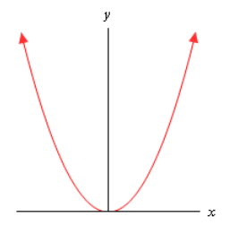
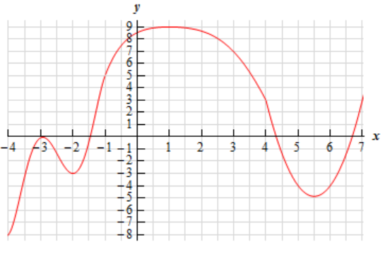
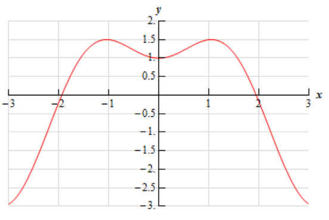

# Section 4.3 : Minimum And Maximum Values

Many of our applications in this chapter will revolve around minimum and maximum
values of a function. While we can all visualize the minimum and maximum values
of a function we want to be a little more specific in our work here. In
particular, we want to differentiate between two types of minimum or maximum
values. The following definition gives the types of minimums and/or maximums
values that we'll be looking at.

**Definition**

> 1. We say that $f(x)$ has an **absolute (or global) maximum** at $x = c$ if
>    $f(x) \leq f(c)$ for every $x$ in the domain we are working on.
> 2. We say that $f(x)$ has a **relative (or local) maximum** at $x = c$ if
>    $f(x) \leq f(c)$ for every $x$ in some open interval around $x = c$.
> 3. We say that $f(x)$ has an **absolute (or global) minimum** at $x = c$ if
>    $f(x) \geq f(c)$ for every $x$ in the domain we are working on.
> 4. We say that $f(x)$ has a **relative (or local) minimum** at $x = c$ if
>    $f(x) \geq f(c)$ for every $x$ in some open interval around $x = c$.

Note that when we say an "open interval around $x = c$" we mean that we can find
some interval $(a, b)$, not including the endpoints, such that $a < c < b$. Or,
in other words, $c$ will be contained somewhere inside the interval and will not
be either of the endpoints.

Also, we will collectively call the minimum and maximum points of a function the
**extrema** of the function. So, relative extrema will refer to the relative
minimums and maximums while absolute extrema refer to the absolute minimums and
maximums.

Now, let's talk a little bit about the subtle difference between the absolute
and relative in the definition above.

We will have an absolute maximum (or minimum) at $x = c$ provided $f(c)$ is the
largest (or smallest) value that the function will ever take on the domain that
we are working on. Also, when we say the "domain we are working on" this simply
means the range of $x$'s that we have chosen to work with for a given problem.
There may be other values of $x$ that we can actually plug into the function but
have excluded them for some reason

A relative maximum or minimum is slightly different. All that's required for a
point to be a relative maximum or minimum is for that point to be a maximum or
minimum in some interval of $x$'s around $x = c$. There may be larger or smaller
values of the function at some other place, but relative to $x = c$, or local to
$x = c$, $f(c)$ is larger or smaller than all the other function values that are
near it.

Note as well that in order for a point to be a relative extrema we must be able
to look at function values on both sides of $x = c$ to see if it really is a
maximum or minimum at that point. This means that relative extrema do not occur
at the end points of a domain. They can only occur interior to the domain.

There is actually some debate on the preceding point. Some folks do feel that
relative extrema can occur on the end points of a domain. However, in this class
we will be using the definition that says that they can't occur at the end
points of a domain. This will be discussed in a little more detail at the end of
the section once we have a relevant fact taken care of.

It's usually easier to get a feel for the definitions by taking a quick look at
a graph.

For the function shown in this graph we have relative maximums at $x = b$ and
$x = d$. Both of these points are relative maximums since they are interior to
the domain shown and are the largest point on the graph in some interval around
the point. We also have a relative minimum at $x = c$ since this point is
interior to the domain and is the lowest point on the graph in an interval
around it. The far-right end point, $x = e$, will not be a relative minimum
since it is an end point.

The function will have an absolute maximum at x=d and an absolute minimum at
$x = a$. These two points are the largest and smallest that the function will
ever be. We can also notice that the absolute extrema for a function will occur
at either the endpoints of the domain or at relative extrema. We will use this
idea in later sections so it's more important than it might seem at the present
time.

Let's take a quick look at some examples to make sure that we have the
definitions of absolute extrema and relative extrema straight.

---

**Example 1** Identify the absolute extrema and relative extrema for the
following function.

$$ f(x) = x^2 \quad \text{ on } \quad [-1, 2] $$

**Solution**

Since this function is easy enough to graph let's do that. However, we only want
the graph on the interval $[-1, 2]$. Here is the graph,

Note that we used dots at the end of the graph to remind us that the graph ends
at these points.

We can now identify the extrema from the graph. It looks like we've got a
relative and absolute minimum of zero at $x = 0$ and an absolute maximum of four
at $x = 2$. Note that $x = -1$ is not a relative maximum since it is at the end
point of the interval.

This function doesn't have any relative maximums.

---

As we saw in the previous example functions do not have to have relative
extrema. It is completely possible for a function to not have a relative maximum
and/or a relative minimum.

---

**Example 2** Identify the absolute extrema and relative extrema for the
following function.

$$ f(x) = x^2 \quad \text{ on } \quad [-2, 2] $$

**Solution**

Here is the graph for this function.

In this case we still have a relative and absolute minimum of zero at $x = 0$.
We also still have an absolute maximum of four. However, unlike the first
example this will occur at two points, $x = -2$ and $x = 2$.

Again, the function doesn't have any relative maximums.

---

As this example has shown there can only be a single absolute maximum or
absolute minimum value, but they can occur at more than one place in the domain.

---

In this case we've given no domain and so the assumption is that we will take
the largest possible domain. For this function that means all the real numbers.
Here is the graph

In this case the graph doesn't stop increasing at either end and so there are no
maximums of any kind for this function. No matter which point we pick on the
graph there will be points both larger and smaller than it on either side so we
can’t have any maximums (of any kind, relative or absolute) in a graph.

We still have a relative and absolute minimum value of zero at $x = 0$.

---

So, some graphs can have minimums but not maximums. Likewise, a graph could have
maximums but not minimums.

---

**Example 4** Identify the absolute extrema and relative extrema for the
following function.

$$ f(x) = x^3 \quad \text{ on } \quad [-2, 2] $$

**Solution**

Here is the graph for this function.

This function has an absolute maximum of eight at $x = 2$ and an absolute
minimum of negative eight at $x = -2$. This function has no relative extrema.

---

So, a function doesn't have to have relative extrema as this example has shown.

---

**Example 5** Identify the absolute extrema and relative extrema for the
following function.

$$ f(x) = x^3 $$

Again, we aren't restricting the domain this time so here's the graph.

In this case the function has no relative extrema and no absolute extrema.

---

As we've seen in the previous example functions don't have to have any kind of
extrema, relative or absolute.

---

**Example 6** Identify the absolute extrema and relative extrema for the
following function.

$$ f(x) = \cos(x) $$

**Solution**

We've not restricted the domain for this function. Here is the graph.

Cosine has extrema (relative and absolute) that occur at many points. Cosine has
both relative and absolute maximums of 1 at

$$ x = \dots -4\pi\text{, } -2\pi\text{, } 0\text{, } 2\pi\text{, } 4\pi\text{, } \dots $$

Cosine also has both relative and absolute minimums of -1 at

$$ x = \dots \text{, } -3\pi \text{, }  -\pi \text{, } \pi \text{, } 3\pi \text{, } \dots $$

---

As this example has shown a graph can in fact have extrema occurring at a large
number (infinite in this case) of points.

We've now worked quite a few examples and we can use these examples to see a
nice fact about absolute extrema. First let's notice that all the functions
above were
[**continuous**](https://tutorial.math.lamar.edu/Classes/CalcI/Continuity.aspx)
functions. Next notice that every time we restricted the domain to a closed
interval (_i.e._ the interval contains its end points) we got absolute maximums
and absolute minimums. Finally, in only one of the three examples in which we
did not restrict the domain did we get both an absolute maximum and an absolute
minimum.

These observations lead us the following theorem.

**Extreme Value Theorem**

> Suppose that $f(x)$ is continuous on the interval $[a, b]$ then there are two
> numbers $a \leq c$, $d \leq b$ so that $f(c)$ is an absolute maximum for the
> function and $f(d)$ is an absolute minimum for the function.

So, if we have a continuous function on an interval $[a, b]$ then we are
guaranteed to have both an absolute maximum and an absolute minimum for the
function somewhere in the interval. The theorem doesn't tell us where they will
occur or if they will occur more than once, but at least it tells us that they
do exist somewhere. Sometimes, all that we need to know is that they do exist.

This theorem doesn't say anything about absolute extrema if we aren't working on
an interval. We saw examples of functions above that had both absolute extrema,
one absolute extrema, and no absolute extrema when we didn't restrict ourselves
down to an interval.

The requirement that a function be continuous is also required in order for us
to use the theorem. Consider the case of

$$ f(x) = \frac{1}{x^2} \quad \text{ on } \quad [-1, 1] $$

Here's the graph.

This function is not continuous at $x = 0$ as we move in towards zero the
function is approaching infinity. So, the function does not have an absolute
maximum. Note that it does have an absolute minimum however. In fact the
absolute minimum occurs twice at both $x = -1$ and $x = 1$.

If we changed the interval a little to say,

$$ f(x) = \frac{1}{x^2} \quad \text{ on } \quad \left[\frac{1}{2}, 1\right] $$

the function would now have both absolute extrema. We may only run into problems
if the interval contains the point of discontinuity. If it doesn't then the
theorem will hold.

We should also point out that just because a function is not continuous at a
point that doesn't mean that it won't have both absolute extrema in an interval
that contains that point. Below is the graph of a function that is not
continuous at a point in the given interval and yet has both absolute extrema.

This graph is not continuous at $x = c$, yet it does have both an absolute
maximum ($x = b$) and an absolute minimum ($x = c$). Also note that, in this
case one of the absolute extrema occurred at the point of discontinuity, but it
doesn’t need to. The absolute minimum could just have easily been at the other
end point or at some other point interior to the region. The point here is that
this graph is not continuous and yet does have both absolute extrema

The point of all this is that we need to be careful to only use the Extreme
Value Theorem when the conditions of the theorem are met and not misinterpret
the results if the conditions aren't met.

In order to use the Extreme Value Theorem we must have an interval that includes
its endpoints, often called a closed interval, and the function must be
continuous on that interval. If we don't have a closed interval and/or the
function isn't continuous on the interval then the function may or may not have
absolute extrema.

We need to discuss one final topic in this section before moving on to the first
major application of the derivative that we’re going to be looking at in this
chapter.

**Fermat's Theorem**

> If $f(x)$ has a relative extrema at $x = c$ and $f'(c)$ exists then $x = c$ is
> a critical point of $f(x)$. In fact, it will be a critical point such that
> $f'(c) = 0$.

To see the proof of this theorem see the
**[Proofs From Derivative Applications**](https://tutorial.math.lamar.edu/Classes/CalcI/DerivativeAppsProofs.aspx#Extras_DerAppPf_Fermat)
section of the Extras chapter.

Also note that we can say that $f'(c) = 0$ because we are also assuming that
$f'(c)$ exists.

This theorem tells us that there is a nice relationship between relative extrema
and critical points. In fact, it will allow us to get a list of all possible
relative extrema. Since a relative extrema must be a critical point the list of
all critical points will give us a list of all possible relative extrema.

Consider the case of $f(x) = x^2$. We saw that this function had a relative
minimum at $x = 0$ ini several earlier examples. So according to Fermat's
theorem $x = 0$ should be a critical point. The derivative of the function is,

$$ f'(x) = 2x $$

Sure enough $x = 0$ is a critical point.

Be careful not to misuse this theorem. It doesn't say that a critical point will
be a relative extrema. To see this, consider the following case.

$$ f(x) = x^3 \quad f'(x) = 3x^2 $$

Clearly $x = 0$ is a critical point. However, we saw in an earlier example this
function has no relative extrema of any kind. So, critical points do not have to
be relative extrema.

Also note that this theorem says nothing about absolute extrema. An absolute
extrema may or may not be a critical point.

Before we leave this section we need to discuss a couple of issues.

First, Fermat’s Theorem only works for critical points in which $f'(c) = 0$.
This does not, however, mean that relative extrema won't occur at critical
points where the derivative does not exist. To see this consider $f(x) = |x|$.
This function clearly has a relative minimum at $x = 0$ and yet in a previous
[**section**](https://tutorial.math.lamar.edu/Classes/CalcI/DefnOfDerivative.aspx#Deriv_Defn_Ex4)
we showed in an example that $f'(0)$ does not exist.

What this all means is that if we want to locate relative extrema all we really
need to do is look at the critical points as those are the places where relative
extrema may exist.

Finally, recall that at that start of the section we stated that relative
extrema will not exist at endpoints of the interval we are looking at. The
reason for this is that if we allowed relative extrema to occur there it may
well (and in fact most of the time) violate Fermat's Theorem. There is no reason
to expect end points of intervals to be critical points of any kind. Therefore,
we do not allow relative extrema to exist at the endpoints of intervals.

---

## Practice Problems

**1.** Below is the graph of some function, $f(x)$. Identify all of the relative
extrema and absolute extrema of the function.

**Solution**

**2.** Below is the graph of some function, $f(x)$. Identify all of the relative
extrema and absolute extrema of the function.

**Solution**

**3.** Sketch the graph of $g(x) = x^2 - 4x$ and identify all the relative
extrema and absolute extrema of the function on each of the following intervals.

**(a)** $(-\infty, \infty)$

**(b)** $[-1, 4]$

**\(c\)** $[1, 3]$

**(d)** $[3, 5]$

**(e)** $(-1, 5]$

**Solution**

**4.** Sketch the graph of $h(x) = -(x + 4)^3$ and identify all the relative
extrema and absolute extrema of the function on each of the following intervals.

**(a)** $(-\infty, \infty)$

**(b)** $[-5.5, -2]$

**\(c\)** $[-4, -3)$

**(d)** $[-4, -3]$

**Solution**

**5.** Sketch the graph of some function on the interval $[1, 6]$ that has an
absolute maximum at $x = 6$ and an absolute minimum at $x = 3$.

**Solution**

**6.** Sketch the graph of some function on the interval $[-4, 3]$ that has an
absolute maximum at $x = -3$ and an absolute minimum at $x = 2$.

**Solution**

**7.** Sketch the graph of some function that meets the following conditions:

**(a)** The function is continuous.

**(b)** Has two relative minimums.

**\(c\)** One of relative minimums is also an absolute minimum and the other
relative minimum is not an absolute minimum.

**(d)** Has one relative maximum.

**(e)** Has no absolute maximum.

**Solution**

---

## Assignment Problems

**1.** Below is the graph of some function, $f(x)$. Identify all of the relative
extrema and absolute extrema of the function.

**Solution**

**2.** Below is the graph of some function, $f(x)$. Identify all of the relative
extrema and absolute extrema of the function.

**Solution**

**3.** Below is the graph of some function, $f(x)$. Identify all of the relative
extrema and absolute extrema of the function.

**Solution**

**4.** Below is the graph of some function, $f(x)$. Identify all of the relative
extrema and absolute extrema of the function.

**Solution**

**5.** Sketch the graph of $f(x) = 3 - \dfrac{1}{2}x$ and identify all the
relative extrema and absolute extrema of the function on each of the following
intervals.

**(a)** $(-\infty, \infty)$

**(b)** $[-3, 2]$

**\(c\)** $[-4, 1)$

**(d)** $(0, 5)$

**Solution**

**6.** Sketch the graph of $g(x) = (x - 2)^2$ and identify all the relative
extrema and absolute extrema of the function on each of the following intervals.

**(a)** $(-\infty, \infty)$

**(b)** $[0, 3]$

**\(c\)** $[-1, 5]$

**(d)** $[-1, 1]$

**(e)** $[1, 3)$

**(f)** $(2, 4)$

**Solution**

**7.** Sketch the graph of $h(x) = \mathbf{e}^{3 - x}$ and identify all the
relative extrema and absolute extrema of the function on each of the following
intervals.

**(a)** $(-\infty, \infty)$

**(b)** $[-1, 3]$

**\(c\)** $[-6, -1]$

**(d)** $(1, 4]$

**Solution**

**8.** Sketch the graph of $h(x) = \cos(x) + 2$ and identify all the relative
extrema and absolute extrema of the function on each of the following intervals.
Do all work for this problem in radians.

**(a)** $(-\infty, \infty)$

**(b)** $\left[-\dfrac{\pi}{3}, \dfrac{\pi}{4}\right]$

**\(c\)** $\left[-\dfrac{\pi}{2}, 2\pi\right]$

**(d)** $\left[\dfrac{1}{2}, 1\right]$

**Solution**

**9.** Sketch the graph of a function on the interval $[3, 9]$ that has an
absolute maximum at $x = 5$ and an absolute minimum at $x = 4$.

**Solution**

**10.** Sketch the graph of a function on the interval $[0, 10]$ that has an
absolute maximum at $x = 5$ and an absolute maximums at $x = 0$ and $x = 10$.

**Solution**

**11.** Sketch the graph of a function on the interval $(-\infty, \infty)$ that
has a relative minimum at $x = -7$, a relative maximum at $x = 2$ and no
absolute extrema.

**Solution**

**12.** Sketch the graph of a function that meets the following conditions:

**(a)** Has at least one absolute maximum.

**(b)** Has one relative minimum.

**\(c\)** Has no absolute minimum.

**Solution**

**13.** Sketch the graph of a function that meets the following conditions:

**(a)** Graphed on the interval $[2, 9]$.

**(b)** Has a discontinuity at some point interior to the interval.

**\(c\)** Has an absolute maximum at the discontinuity in part **(b)**.

**(d)** Has an absolute minimum at the discontinuity in part **(b)**.

**Solution**

**14.** Sketch the graph of the function that meets the following conditions:

**(a)** Graphed on the interval $[-4, 10]$.

**(b)** Has no relative extrema.

**\(c\)** Has an absolute maximum at one end point.

**(d)** Has an absolute minimum at the other end point.

**Solution**

**15.** Sketch the graph of a function that meets the following conditions:

**(a)** Has a discontinuity at some point.

**(b)** Has an absolute maximum and an absolute minimum.

**\(c\)** Neither absolute extrema occurs at the discontinuity.
